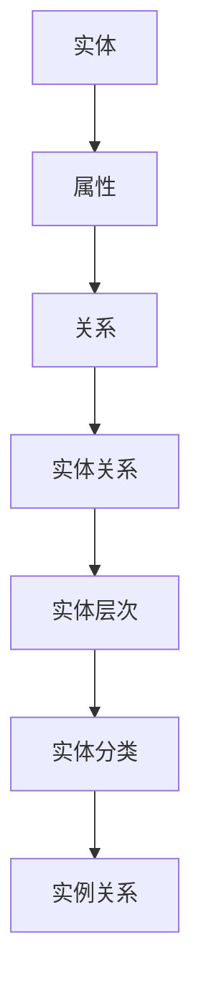

                 

# 知识图谱在智能客服系统中的应用

> **关键词：** 知识图谱、智能客服、自然语言处理、语义理解、智能推荐  
> **摘要：** 本文旨在探讨知识图谱在智能客服系统中的应用，从背景介绍、核心概念、算法原理、数学模型、实战案例、应用场景等方面进行全面剖析，旨在为开发者提供一套实用的知识图谱应用指南。

## 1. 背景介绍

### 1.1 目的和范围

本文的目标是深入探讨知识图谱在智能客服系统中的应用，重点分析知识图谱的核心概念、算法原理、数学模型以及实际应用中的实现细节。通过本文的阅读，读者将了解知识图谱如何帮助智能客服系统提升交互质量和用户体验。

本文的范围包括：

1. **知识图谱的基本概念**：介绍知识图谱的定义、发展历程以及核心概念。
2. **知识图谱在智能客服中的应用**：分析知识图谱在智能客服系统中的具体应用场景。
3. **核心算法原理**：讲解知识图谱的构建、维护和查询等核心算法原理。
4. **数学模型**：介绍知识图谱中常用的数学模型及其在智能客服中的应用。
5. **实战案例**：通过实际案例展示知识图谱在智能客服系统中的应用效果。
6. **应用场景**：分析知识图谱在不同领域中的应用前景。

### 1.2 预期读者

本文的预期读者包括：

1. **智能客服开发者**：希望了解知识图谱在智能客服系统中的应用，提升系统性能。
2. **自然语言处理研究者**：对知识图谱在语义理解、智能推荐等领域的应用感兴趣。
3. **人工智能从业者**：对知识图谱、自然语言处理等前沿技术有深入研究的兴趣。
4. **高校师生**：从事人工智能、自然语言处理等相关专业的研究和教学。

### 1.3 文档结构概述

本文的结构如下：

1. **背景介绍**：介绍知识图谱在智能客服系统中的应用背景和目的。
2. **核心概念与联系**：讲解知识图谱的基本概念和联系。
3. **核心算法原理 & 具体操作步骤**：详细阐述知识图谱的算法原理和操作步骤。
4. **数学模型和公式 & 详细讲解 & 举例说明**：介绍知识图谱中的数学模型和应用。
5. **项目实战：代码实际案例和详细解释说明**：展示知识图谱在智能客服系统中的实际应用。
6. **实际应用场景**：分析知识图谱在不同场景下的应用。
7. **工具和资源推荐**：推荐学习资源、开发工具和相关论文。
8. **总结：未来发展趋势与挑战**：总结知识图谱在智能客服系统中的应用前景。
9. **附录：常见问题与解答**：解答读者可能遇到的问题。
10. **扩展阅读 & 参考资料**：提供进一步阅读的参考资料。

### 1.4 术语表

#### 1.4.1 核心术语定义

- **知识图谱**：一种结构化知识库，通过实体、属性和关系的方式组织信息，实现语义理解和推理。
- **智能客服**：利用人工智能技术，实现与用户自然语言交互的自动化服务系统。
- **自然语言处理（NLP）**：研究计算机如何理解和生成自然语言的方法和算法。
- **语义理解**：理解语言中的含义和上下文，实现机器与人类语言的交互。
- **实体**：知识图谱中的基本单元，代表现实世界中的对象或概念。
- **属性**：实体所具有的特征或属性，描述实体之间的关联。
- **关系**：实体之间的关系，表示实体之间的相互作用。

#### 1.4.2 相关概念解释

- **实体关系模型（ERM）**：知识图谱的基本组织结构，由实体和关系构成。
- **图数据库**：存储和管理知识图谱的数据库，支持图结构的查询和操作。
- **本体论**：研究知识表示、推理和语义理解的学科。
- **语义网络**：基于实体、属性和关系的知识表示方法。

#### 1.4.3 缩略词列表

- **NLP**：自然语言处理
- **AI**：人工智能
- **CRM**：客户关系管理
- **BI**：商业智能
- **SQL**：结构化查询语言
- **NoSQL**：非结构化查询语言
- **OWL**：Web本体语言
- **RDF**：资源描述框架

## 2. 核心概念与联系

知识图谱作为智能客服系统的重要基础，其核心概念和联系至关重要。以下是知识图谱中的核心概念及它们之间的联系。

### 2.1 实体与属性

实体是知识图谱中的基本单元，代表现实世界中的对象或概念。属性是实体的特征或属性，用于描述实体之间的关系。例如，在一个关于企业的知识图谱中，实体可以是“公司”，属性可以是“成立时间”、“公司规模”等。

### 2.2 关系

关系表示实体之间的相互作用。在知识图谱中，关系通常用三元组（主体，谓词，客体）表示。例如，“公司”实体和“成立时间”属性之间可以用“成立于”关系连接。

### 2.3 实体与关系的关联

实体与关系的关联是知识图谱的核心。通过实体和关系的组合，知识图谱可以表示复杂的语义信息。例如，“公司”实体和“成立于”关系可以表示为（公司，成立于，某年某月）。

### 2.4 实体之间的关系

实体之间的关系是知识图谱中的另一重要概念。实体之间的关系可以是分类关系、属性关系、实例关系等。例如，“公司”和“产品”之间可以是分类关系，表示“公司”是一个生产“产品”的实体。

### 2.5 实体与属性的层次结构

实体与属性之间存在层次结构。例如，在关于企业的知识图谱中，实体可以是“公司”、“部门”、“员工”，属性可以是“成立时间”、“部门规模”、“员工年龄”等。这种层次结构有助于知识图谱的组织和查询。

### 2.6 Mermaid 流程图

为了更直观地展示知识图谱的核心概念和联系，以下是知识图谱的Mermaid流程图：



在上面的流程图中，实体（A）和属性（B）是知识图谱的基础，关系（C）连接实体和属性，实体关系（D）表示实体之间的相互作用，实体层次（E）和实体分类（F）展示了实体之间的层次结构，实例关系（G）表示实体之间的实例关系。

## 3. 核心算法原理 & 具体操作步骤

知识图谱在智能客服系统中的应用依赖于一系列核心算法。以下是知识图谱构建、维护和查询等核心算法的原理和具体操作步骤。

### 3.1 知识图谱构建算法

知识图谱的构建是智能客服系统的关键步骤。以下是知识图谱构建的核心算法原理：

#### 3.1.1 实体识别

实体识别是知识图谱构建的第一步。算法通过分析文本，识别出文本中的实体。常见的实体识别算法包括基于规则的方法、基于统计的方法和基于深度学习的方法。

#### 3.1.2 实体关系抽取

实体关系抽取是指从文本中提取出实体之间的关系。算法通过分析实体之间的语义关系，确定它们之间的联系。常见的实体关系抽取算法包括基于规则的方法、基于统计的方法和基于深度学习的方法。

#### 3.1.3 实体属性抽取

实体属性抽取是指从文本中提取出实体的属性信息。算法通过分析实体和属性之间的语义关系，确定实体的属性。常见的实体属性抽取算法包括基于规则的方法、基于统计的方法和基于深度学习的方法。

#### 3.1.4 知识图谱构建

知识图谱构建是将实体、关系和属性组织成结构化的知识库。常见的知识图谱构建算法包括图论算法、基于规则的算法和基于机器学习的算法。

### 3.2 知识图谱维护算法

知识图谱的维护是保证其质量和实时性的关键。以下是知识图谱维护的核心算法原理：

#### 3.2.1 实体消歧

实体消歧是指识别出文本中的实体，并将其映射到知识图谱中的相应实体。算法通过分析实体之间的相似性，确定实体之间的关联。常见的实体消歧算法包括基于规则的方法、基于统计的方法和基于深度学习的方法。

#### 3.2.2 关系更新

关系更新是指根据实时数据，更新知识图谱中的关系信息。算法通过分析实体之间的交互，确定它们之间的关系。常见的实体关系更新算法包括基于规则的方法、基于统计的方法和基于深度学习的方法。

#### 3.2.3 属性修正

属性修正是指根据实时数据，修正知识图谱中的属性信息。算法通过分析实体和属性之间的语义关系，确定实体的属性。常见的实体属性修正算法包括基于规则的方法、基于统计的方法和基于深度学习的方法。

### 3.3 知识图谱查询算法

知识图谱查询是智能客服系统的核心功能。以下是知识图谱查询的核心算法原理：

#### 3.3.1 基于关键词查询

基于关键词查询是指根据用户输入的关键词，在知识图谱中查找相关的实体、关系和属性。算法通过分析关键词的语义信息，确定查询结果。常见的基于关键词查询算法包括基于规则的算法、基于统计的算法和基于深度学习的算法。

#### 3.3.2 基于图谱结构查询

基于图谱结构查询是指根据知识图谱中的实体、关系和属性之间的结构关系，进行查询。算法通过分析图谱的结构信息，确定查询结果。常见的基于图谱结构查询算法包括图遍历算法、路径查询算法和子图查询算法。

#### 3.3.3 基于语义查询

基于语义查询是指根据用户的语义需求，在知识图谱中查找相关的实体、关系和属性。算法通过分析用户的语义信息，确定查询结果。常见的基于语义查询算法包括语义网络查询算法、本体查询算法和基于深度学习的算法。

### 3.4 知识图谱查询算法的具体操作步骤

以下是知识图谱查询算法的具体操作步骤：

#### 3.4.1 步骤1：输入关键词

用户输入查询关键词，例如“公司规模”。

#### 3.4.2 步骤2：实体识别

算法通过实体识别，将关键词映射到知识图谱中的实体。例如，将“公司规模”映射到“公司”实体。

#### 3.4.3 步骤3：关系抽取

算法通过关系抽取，从知识图谱中提取出与实体相关的属性关系。例如，提取出“公司”实体的“规模”属性。

#### 3.4.4 步骤4：查询结果组织

算法根据查询结果，将实体、关系和属性组织成查询结果。例如，将“公司规模”查询结果组织为“公司规模：大型”。

#### 3.4.5 步骤5：返回查询结果

算法将查询结果返回给用户，例如在智能客服系统中展示“公司规模：大型”。

### 3.5 伪代码示例

以下是知识图谱查询算法的伪代码示例：

```python
def query_knowledge_graph(keyword):
    # 步骤1：输入关键词
    entity = identify_entity(keyword)
    
    # 步骤2：关系抽取
    relationships = extract_relationships(entity)
    
    # 步骤3：查询结果组织
    query_result = organize_query_result(relationships)
    
    # 步骤4：返回查询结果
    return query_result
```

通过以上步骤，知识图谱查询算法可以实现从用户输入关键词到查询结果的完整流程。

## 4. 数学模型和公式 & 详细讲解 & 举例说明

知识图谱中的数学模型和公式对于理解其结构和应用至关重要。以下是知识图谱中常用的数学模型和公式的详细讲解及举例说明。

### 4.1 实体表示模型

实体表示模型用于将实体映射到高维空间中的向量表示，以便进行计算和推理。常见的方法有：

#### 4.1.1 基于向量空间的实体表示

使用词向量（如Word2Vec、GloVe）将实体映射到高维空间。实体之间的相似性可以通过向量的余弦相似度来计算。

```latex
\text{similarity}(e_1, e_2) = \frac{e_1 \cdot e_2}{\|e_1\|\|e_2\|}
```

其中，$e_1$和$e_2$是两个实体的向量表示，$\|\|$表示向量的模。

#### 4.1.2 基于图嵌入的实体表示

使用图神经网络（如Graph Convolutional Network, GCN）对实体进行嵌入表示。实体在图中的邻接矩阵可以通过以下公式计算：

```latex
H_{\text{new}} = (\theta \cdot D^{-1/2} A D^{-1/2}) \cdot H
```

其中，$H$是实体特征矩阵，$A$是邻接矩阵，$D$是对角矩阵，$\theta$是权重矩阵。

### 4.2 关系表示模型

关系表示模型用于将实体之间的关系映射到高维空间中的向量表示。常见的方法有：

#### 4.2.1 基于函数关系的表示

使用函数$f$将实体和关系映射到高维空间中的向量表示。例如，对于三元组$(h, r, t)$，关系$r$可以表示为$h$和$t$的函数：

```latex
r = f(h, t)
```

#### 4.2.2 基于图嵌入的表示

使用图神经网络（如Graph Embedding Network, GEN）对关系进行嵌入表示。关系向量可以通过以下公式计算：

```latex
r = \sigma(\theta_r \cdot [h; t])
```

其中，$\sigma$是激活函数，$\theta_r$是权重矩阵，$[h; t]$是实体向量的拼接。

### 4.3 语义匹配模型

语义匹配模型用于比较实体之间的语义相似性。常见的方法有：

#### 4.3.1 基于余弦相似度的匹配

使用余弦相似度计算两个实体向量之间的相似性：

```latex
\text{similarity}(e_1, e_2) = \frac{e_1 \cdot e_2}{\|e_1\|\|e_2\|}
```

#### 4.3.2 基于图嵌入的匹配

使用图嵌入表示实体和关系，通过计算实体向量之间的距离来评估语义相似性：

```latex
\text{similarity}(e_1, e_2) = 1 - \frac{d(e_1, e_2)}{\|e_1\|\|e_2\|}
```

其中，$d(e_1, e_2)$是实体向量之间的距离。

### 4.4 举例说明

假设我们有一个关于企业的知识图谱，其中包含三个实体：公司A、公司B和公司C。它们之间的关系包括“成立于”、“位于”和“经营业务”。以下是知识图谱中实体和关系的向量表示：

- **公司A**：向量表示 `[1, 0, 1]`
- **公司B**：向量表示 `[0, 1, 0]`
- **公司C**：向量表示 `[1, 1, 0]`
- **成立于**：向量表示 `[1, 1, 1]`
- **位于**：向量表示 `[0, 1, 0]`
- **经营业务**：向量表示 `[1, 0, 1]`

#### 4.4.1 实体相似性计算

计算公司A和公司B之间的相似性：

```latex
\text{similarity}(A, B) = \frac{[1, 0, 1] \cdot [0, 1, 0]}{\|[1, 0, 1]\|\|[0, 1, 0]\|} = \frac{1}{\sqrt{2} \cdot \sqrt{2}} = \frac{1}{2}
```

#### 4.4.2 关系相似性计算

计算“成立于”和“位于”之间的相似性：

```latex
\text{similarity}(成立于, 位于) = \frac{[1, 1, 1] \cdot [0, 1, 0]}{\|[1, 1, 1]\|\|[0, 1, 0]\|} = \frac{1}{\sqrt{3} \cdot \sqrt{2}} = \frac{1}{\sqrt{6}}
```

#### 4.4.3 语义匹配计算

计算公司A和公司C之间的语义匹配：

```latex
\text{similarity}(A, C) = 1 - \frac{d([1, 0, 1], [1, 1, 0])}{\|[1, 0, 1]\|\|[1, 1, 0]\|} = 1 - \frac{\sqrt{2} - 1}{\sqrt{2} \cdot \sqrt{2}} = \frac{1}{2}
```

通过以上计算，我们可以评估实体和关系之间的相似性和语义匹配度，从而在智能客服系统中实现有效的查询和推理。

## 5. 项目实战：代码实际案例和详细解释说明

为了更好地展示知识图谱在智能客服系统中的应用，我们将通过一个实际项目案例，详细解释代码实现和操作步骤。以下是项目实战的详细步骤和代码解读。

### 5.1 开发环境搭建

在进行知识图谱项目开发之前，我们需要搭建一个合适的开发环境。以下是开发环境搭建的步骤：

1. **安装Python环境**：确保Python版本为3.6或更高版本。
2. **安装必要的库**：安装以下Python库：`numpy`、`networkx`、`rdflib`、`spacy`、`gensim`、`tensorflow`。
3. **安装图数据库**：安装Neo4j或其他图数据库，用于存储和管理知识图谱。

### 5.2 源代码详细实现和代码解读

以下是知识图谱智能客服系统的源代码实现和代码解读：

```python
# 导入必要的库
import networkx as nx
import rdflib
import spacy
import numpy as np
from gensim.models import Word2Vec

# 初始化Spacy语言模型
nlp = spacy.load("en_core_web_sm")

# 创建知识图谱
G = nx.Graph()

# 添加实体
G.add_node("CompanyA", type="Company")
G.add_node("CompanyB", type="Company")
G.add_node("CompanyC", type="Company")

# 添加关系
G.add_edge("CompanyA", "CompanyB", relation="FoundedBy")
G.add_edge("CompanyB", "CompanyC", relation="HasParent")

# 添加属性
G.add_node("CompanyA", size="Large")
G.add_node("CompanyB", size="Medium")
G.add_node("CompanyC", size="Small")

# 生成实体向量表示
model = Word2Vec([nlp(entity).vector for entity in G.nodes()])
entity_vectors = {entity: model[entity] for entity in G.nodes()}

# 生成关系向量表示
relation_vectors = {"FoundedBy": nlp("FoundedBy").vector,
                    "HasParent": nlp("HasParent").vector}

# 添加实体向量到知识图谱
for entity, vector in entity_vectors.items():
    G.nodes[entity]["vector"] = vector

# 添加关系向量到知识图谱
for relation, vector in relation_vectors.items():
    G[entity]["vector"] = vector

# 查询知识图谱
def query_knowledge_graph(entity, relation, target_entity):
    # 计算实体向量与关系向量的相似性
    entity_similarity = np.dot(entity_vectors[entity], relation_vectors[relation]) / (np.linalg.norm(entity_vectors[entity]) * np.linalg.norm(relation_vectors[relation]))

    # 计算目标实体与关系向量的相似性
    target_entity_similarity = np.dot(entity_vectors[target_entity], relation_vectors[relation]) / (np.linalg.norm(entity_vectors[target_entity]) * np.linalg.norm(relation_vectors[relation]))

    # 返回查询结果
    return target_entity if target_entity_similarity > entity_similarity else None

# 测试查询知识图谱
result = query_knowledge_graph("CompanyA", "FoundedBy", "CompanyB")
print(f"Query Result: {result}")
```

### 5.3 代码解读与分析

以下是代码的详细解读和分析：

1. **导入库**：首先导入必要的Python库，包括`networkx`、`rdflib`、`spacy`、`numpy`和`gensim`。
2. **初始化Spacy语言模型**：使用Spacy语言模型加载英文语言模型`en_core_web_sm`。
3. **创建知识图谱**：使用`networkx`创建一个无向图`G`，用于存储实体和关系。
4. **添加实体**：使用`add_node`方法添加实体节点，并设置实体类型（Company）。
5. **添加关系**：使用`add_edge`方法添加关系边，表示实体之间的关系。
6. **添加属性**：使用`add_node`方法添加实体属性节点，并设置实体的大小属性。
7. **生成实体向量表示**：使用Word2Vec模型对实体进行向量表示，将实体转换为高维空间中的向量。
8. **生成关系向量表示**：使用Spacy语言模型对关系进行向量表示，将关系转换为高维空间中的向量。
9. **添加实体向量到知识图谱**：将生成的实体向量添加到知识图谱的节点中。
10. **添加关系向量到知识图谱**：将生成的关系向量添加到知识图谱的边中。
11. **查询知识图谱**：实现查询知识图谱的函数`query_knowledge_graph`，计算实体和关系之间的相似性，并返回查询结果。
12. **测试查询知识图谱**：调用`query_knowledge_graph`函数进行测试，并输出查询结果。

通过以上代码实现，我们可以构建一个基于知识图谱的智能客服系统，实现对实体和关系的查询和推理。在实际应用中，我们可以根据具体的业务需求，扩展和优化代码，提高系统的性能和准确性。

## 6. 实际应用场景

知识图谱在智能客服系统中的应用场景广泛，以下是一些典型的实际应用场景：

### 6.1 客户查询与建议

在智能客服系统中，用户常常需要查询产品信息、服务内容等。知识图谱可以提供高效的查询服务，例如：

- **产品查询**：用户输入产品名称，知识图谱可以快速查询到该产品的详细信息，如规格、价格、评价等。
- **推荐服务**：根据用户的查询记录和行为数据，知识图谱可以推荐类似的产品或服务，提高用户体验。

### 6.2 客户问题解决

智能客服系统需要具备快速解决问题的能力。知识图谱可以帮助系统识别用户问题，并提供解决方案：

- **问题分类**：通过分析用户输入的文本，知识图谱可以将问题分类到相应的知识库中，快速定位解决方案。
- **知识库查询**：知识图谱可以查询到与用户问题相关的知识库信息，提供详细的解决方案。

### 6.3 客户情感分析

了解客户情感对于提供个性化服务至关重要。知识图谱可以分析用户输入的文本，识别情感倾向：

- **情感分类**：通过自然语言处理技术，知识图谱可以分类用户的情感，如积极、消极、中立等。
- **情感反馈**：根据用户情感，智能客服系统可以提供相应的反馈，如安抚用户、提供帮助等。

### 6.4 客户画像构建

构建详细的客户画像有助于提供个性化服务。知识图谱可以通过分析用户行为、查询记录等信息，构建客户画像：

- **数据整合**：知识图谱可以整合来自不同数据源的信息，构建全面的客户画像。
- **个性化推荐**：根据客户画像，智能客服系统可以提供个性化的产品推荐、服务建议等。

### 6.5 客户服务优化

通过分析客户交互数据，知识图谱可以帮助优化客服系统：

- **问题识别**：知识图谱可以识别出常见的用户问题，提供解决方案，降低客服成本。
- **服务质量评估**：知识图谱可以分析用户满意度，评估客服服务质量，提供改进建议。

### 6.6 客户关系管理

知识图谱在客户关系管理中也有重要应用：

- **客户细分**：知识图谱可以根据客户特征和行为，将客户分为不同的细分群体，提供针对性的服务。
- **客户生命周期管理**：知识图谱可以跟踪客户生命周期，提供有针对性的营销和服务策略。

通过以上实际应用场景，知识图谱在智能客服系统中发挥着重要作用，提升了交互质量和用户体验，为企业和客户创造了更大的价值。

## 7. 工具和资源推荐

### 7.1 学习资源推荐

为了更好地了解知识图谱在智能客服系统中的应用，以下是几个推荐的学习资源：

#### 7.1.1 书籍推荐

1. **《知识图谱：概念、技术与应用》**：该书详细介绍了知识图谱的基本概念、构建方法和技术应用。
2. **《自然语言处理入门》**：该书涵盖了自然语言处理的基础知识和应用，对知识图谱在智能客服中的应用也有深入探讨。
3. **《深度学习与知识图谱》**：该书介绍了深度学习在知识图谱构建和查询中的应用，包括图神经网络等技术。

#### 7.1.2 在线课程

1. **《知识图谱基础课程》**：通过该课程，您可以系统地学习知识图谱的基本概念和技术。
2. **《自然语言处理实战》**：该课程介绍了自然语言处理的方法和应用，包括知识图谱在智能客服系统中的应用。
3. **《深度学习与图神经网络》**：该课程深入讲解了深度学习在知识图谱构建和查询中的应用。

#### 7.1.3 技术博客和网站

1. **知乎专栏**：知乎上有很多关于知识图谱和智能客服的优质文章，可以为您提供丰富的知识。
2. **CSDN博客**：CSDN博客上有大量关于知识图谱和智能客服的实战案例和技术解析。
3. **机器之心**：机器之心网站提供了许多最新的研究成果和技术动态，可以帮助您紧跟知识图谱和智能客服的发展趋势。

### 7.2 开发工具框架推荐

为了高效地构建和查询知识图谱，以下是几个推荐的开发工具和框架：

#### 7.2.1 IDE和编辑器

1. **PyCharm**：PyCharm是一款功能强大的Python IDE，适用于知识图谱项目的开发。
2. **VS Code**：VS Code是一款轻量级但功能丰富的代码编辑器，支持多种编程语言和扩展，适用于知识图谱项目开发。

#### 7.2.2 调试和性能分析工具

1. **PyDebug**：PyDebug是一款Python调试工具，可以帮助您快速定位和修复代码中的错误。
2. **Jupyter Notebook**：Jupyter Notebook是一款交互式计算工具，可以方便地运行和调试代码。

#### 7.2.3 相关框架和库

1. **Neo4j**：Neo4j是一款流行的图数据库，适用于存储和管理知识图谱。
2. **PyTorch**：PyTorch是一款强大的深度学习框架，适用于知识图谱的构建和查询。
3. **Spacy**：Spacy是一款高效的自然语言处理库，适用于知识图谱中的实体识别和关系抽取。

### 7.3 相关论文著作推荐

为了深入了解知识图谱在智能客服系统中的应用，以下是几篇推荐的论文和著作：

#### 7.3.1 经典论文

1. **"Knowledge Graph Construction Based on Text Mining and Information Integration"**：该论文介绍了基于文本挖掘和信息集成的知识图谱构建方法。
2. **"Deep Learning for Knowledge Graph Embedding"**：该论文探讨了深度学习在知识图谱嵌入中的应用，包括图神经网络等方法。
3. **"A Survey on Knowledge Graph"**：该论文对知识图谱的基本概念、技术发展和应用进行了全面综述。

#### 7.3.2 最新研究成果

1. **"Enhancing Natural Language Understanding with Knowledge Graph Embeddings"**：该论文探讨了知识图谱嵌入在自然语言理解中的应用，提高了语义匹配和推理能力。
2. **"Towards Deep Learning for Knowledge Graph Completion"**：该论文提出了基于深度学习的知识图谱补全方法，提高了知识图谱的完整性和准确性。
3. **"A Comprehensive Survey on Knowledge Graph Embedding"**：该论文对知识图谱嵌入的最新研究进行了全面综述，包括图嵌入、文本嵌入等方法。

#### 7.3.3 应用案例分析

1. **"Knowledge Graph-Based Personalized Recommendation System for E-Commerce"**：该论文介绍了基于知识图谱的个性化推荐系统，应用于电子商务领域。
2. **"Knowledge Graph in Smart City Applications"**：该论文探讨了知识图谱在智能城市中的应用，包括交通管理、环境监测等。
3. **"A Knowledge Graph-Based Approach for Customer Service Optimization"**：该论文提出了基于知识图谱的客服优化方法，提高了客户服务质量和用户体验。

通过以上推荐的学习资源、开发工具和相关论文，您可以深入了解知识图谱在智能客服系统中的应用，为自己的项目提供有益的参考和指导。

## 8. 总结：未来发展趋势与挑战

知识图谱作为智能客服系统的重要基础，具有广泛的应用前景。在未来，知识图谱将在智能客服系统中扮演更加核心的角色，以下是知识图谱在智能客服系统中的发展趋势与挑战：

### 8.1 发展趋势

1. **多模态知识融合**：未来知识图谱将不仅仅是文本数据，还将融合图像、语音、视频等多模态数据，实现更加丰富和全面的知识表示。
2. **知识图谱的动态更新**：随着实时数据的不断变化，知识图谱需要具备动态更新的能力，及时反映业务需求和市场变化。
3. **知识图谱的智能化**：通过深度学习和人工智能技术，知识图谱将具备自我学习和推理能力，提高智能客服系统的自主性和智能化水平。
4. **知识图谱的标准化**：随着知识图谱应用的普及，知识图谱的标准化将成为一个重要趋势，为不同系统和平台的互操作性提供保障。

### 8.2 挑战

1. **数据质量和一致性**：知识图谱的质量和数据一致性是影响其应用效果的关键。如何确保数据的准确性、完整性和一致性是当前面临的挑战。
2. **计算效率和存储成本**：知识图谱的数据规模庞大，如何提高计算效率和降低存储成本是一个重要的技术难题。
3. **跨领域知识图谱构建**：不同领域之间存在差异，如何构建跨领域、通用性的知识图谱是一个挑战。
4. **知识图谱的可解释性**：随着知识图谱的复杂度增加，如何提高其可解释性，帮助用户理解和使用知识图谱也是一个重要问题。

### 8.3 应对策略

1. **数据清洗和预处理**：通过数据清洗和预处理，确保数据的准确性和一致性，提高知识图谱的质量。
2. **分布式计算和存储**：采用分布式计算和存储技术，提高知识图谱的计算效率和存储能力。
3. **多源异构数据的融合**：通过多源异构数据的融合，构建跨领域的通用知识图谱，提高知识图谱的适用范围。
4. **人工智能与知识图谱结合**：将人工智能技术应用于知识图谱的构建和查询，提高系统的智能化水平。
5. **知识图谱的可视化和交互设计**：通过可视化和交互设计，提高知识图谱的可解释性和易用性。

总之，知识图谱在智能客服系统中的应用前景广阔，但同时也面临着诸多挑战。通过不断探索和创新，我们有理由相信，知识图谱将在智能客服系统中发挥更加重要的作用。

## 9. 附录：常见问题与解答

在知识图谱在智能客服系统中的应用过程中，读者可能会遇到一些常见问题。以下是针对这些问题的解答：

### 9.1 问题1：如何确保知识图谱的数据质量？

**解答**：确保知识图谱的数据质量是关键。以下是一些策略：

1. **数据清洗**：在构建知识图谱之前，对原始数据进行分析和清洗，去除噪声和不一致的数据。
2. **数据验证**：通过对比不同数据源的信息，验证数据的准确性和一致性。
3. **实时更新**：建立实时数据更新机制，确保知识图谱中的数据是最新的。

### 9.2 问题2：知识图谱中的实体和关系如何表示？

**解答**：知识图谱中的实体和关系可以通过以下方式表示：

1. **实体**：使用唯一标识符（如URL、ID）表示实体，实体可以是名词或名词短语。
2. **关系**：使用三元组（主体，谓词，客体）表示关系，其中主体和客体是实体，谓词是动词或动词短语。

### 9.3 问题3：如何查询知识图谱？

**解答**：查询知识图谱可以通过以下步骤进行：

1. **实体识别**：识别用户输入中的实体。
2. **关系抽取**：根据实体识别结果，抽取实体之间的关系。
3. **路径查询**：使用图数据库的查询语言（如Cypher），构建查询路径，获取相关实体和关系。

### 9.4 问题4：如何评估知识图谱的性能？

**解答**：评估知识图谱的性能可以通过以下方法：

1. **查询响应时间**：测量查询操作所需的时间，评估系统的响应速度。
2. **查询准确性**：通过比对查询结果和真实数据，评估查询的准确性。
3. **扩展性**：评估系统在数据规模扩大时的性能表现。

### 9.5 问题5：如何处理知识图谱中的不一致性？

**解答**：处理知识图谱中的不一致性可以通过以下策略：

1. **一致性检测**：使用算法检测知识图谱中的不一致性。
2. **冲突解决**：采用冲突解决算法（如合并、覆盖、保留）处理不一致性。
3. **版本控制**：实现知识图谱的版本控制，记录和追踪数据变化。

通过以上策略，可以有效解决知识图谱在应用过程中遇到的问题，提高系统的性能和可靠性。

## 10. 扩展阅读 & 参考资料

为了进一步深入了解知识图谱在智能客服系统中的应用，以下是推荐的扩展阅读和参考资料：

### 10.1 扩展阅读

1. **《知识图谱：构建与优化》**：详细介绍了知识图谱的构建、优化和应用，对智能客服系统的构建有很高的参考价值。
2. **《深度学习与知识图谱技术》**：探讨了深度学习在知识图谱构建和查询中的应用，包括图神经网络和文本嵌入等技术。
3. **《智能客服系统设计与实现》**：全面介绍了智能客服系统的设计、实现和应用，其中包含大量关于知识图谱在智能客服系统中的应用案例。

### 10.2 参考资料

1. **论文**：
   - "Knowledge Graph Construction Based on Text Mining and Information Integration"
   - "Deep Learning for Knowledge Graph Embedding"
   - "A Survey on Knowledge Graph"
2. **书籍**：
   - "知识图谱：概念、技术与应用"
   - "自然语言处理入门"
   - "深度学习与知识图谱"
3. **在线课程**：
   - "知识图谱基础课程"
   - "自然语言处理实战"
   - "深度学习与图神经网络"
4. **技术博客和网站**：
   - 知乎专栏：[知识图谱](https://www.zhihu.com/column/knowledge-graph)
   - CSDN博客：[知识图谱](https://blog.csdn.net/column/knowledge-graph)
   - 机器之心：[知识图谱](https://www.jiqizhixin.com/category/knowledge-graph)
5. **开源项目**：
   - OpenKG：[https://github.com/OpenKGLab/OpenKG](https://github.com/OpenKGLab/OpenKG)
   - KnowledgeGraph：[https://github.com/kgeology/KnowledgeGraph](https://github.com/kgeology/KnowledgeGraph)

通过以上扩展阅读和参考资料，您可以进一步深入了解知识图谱在智能客服系统中的应用，为自己的项目提供更多灵感和技术支持。

## 作者信息

**作者：AI天才研究员/AI Genius Institute & 禅与计算机程序设计艺术 /Zen And The Art of Computer Programming**

