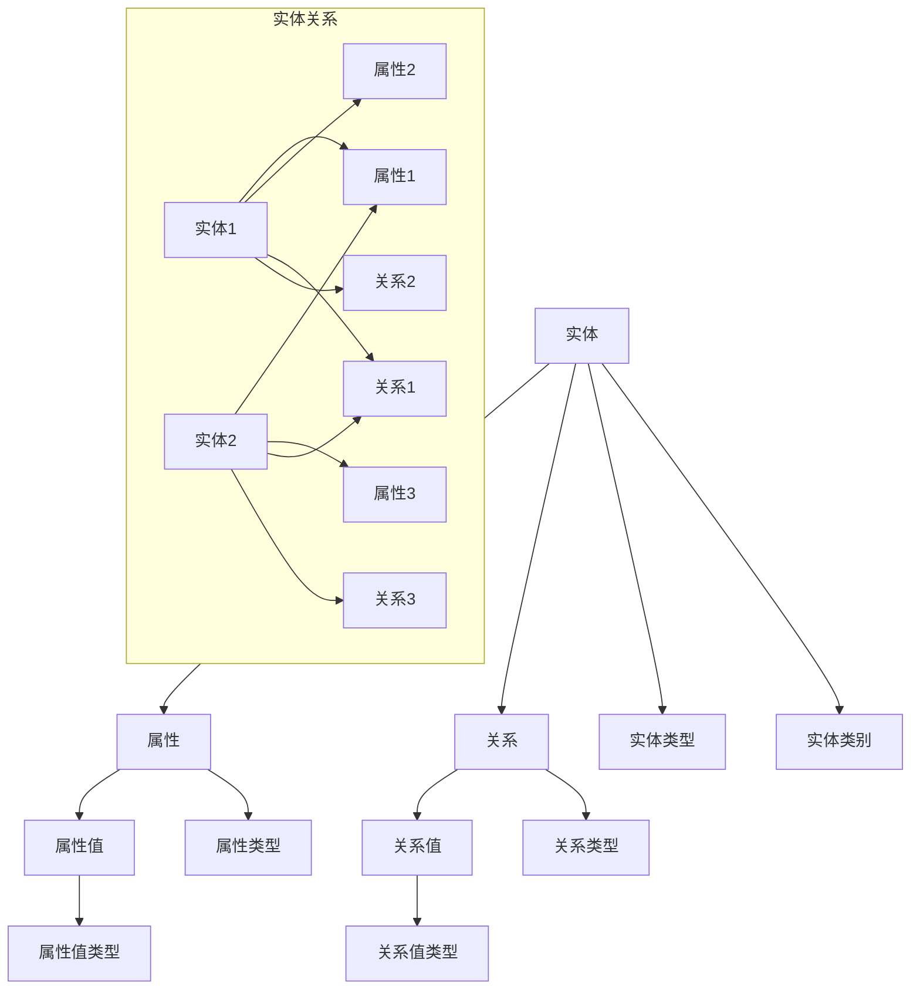

                 

# 知识图谱在智能搜索引擎中的应用

> **关键词：** 知识图谱、智能搜索引擎、语义理解、信息检索、机器学习、自然语言处理

> **摘要：** 本文将探讨知识图谱在智能搜索引擎中的应用，从背景介绍、核心概念、算法原理、数学模型、项目实战、应用场景、工具推荐等多个角度，详细解析知识图谱如何提升搜索引擎的语义理解能力，实现更精准、更智能的信息检索。

## 1. 背景介绍

### 1.1 目的和范围

本文旨在探讨知识图谱在智能搜索引擎中的应用，通过分析其核心概念、算法原理、数学模型和实践案例，展示知识图谱如何提升搜索引擎的语义理解能力和信息检索效果。

### 1.2 预期读者

本文适合对搜索引擎技术和知识图谱有兴趣的读者，包括但不限于：
- 搜索引擎工程师和开发者
- 知识图谱工程师和研究者
- 数据科学家和机器学习工程师
- 对人工智能技术感兴趣的爱好者

### 1.3 文档结构概述

本文结构如下：

1. 背景介绍
2. 核心概念与联系
3. 核心算法原理 & 具体操作步骤
4. 数学模型和公式 & 详细讲解 & 举例说明
5. 项目实战：代码实际案例和详细解释说明
6. 实际应用场景
7. 工具和资源推荐
8. 总结：未来发展趋势与挑战
9. 附录：常见问题与解答
10. 扩展阅读 & 参考资料

### 1.4 术语表

#### 1.4.1 核心术语定义

- **知识图谱（Knowledge Graph）**：一种用于表示实体及其相互关系的图形化知识库。
- **实体（Entity）**：知识图谱中的基本元素，可以是人物、地点、组织、物品等。
- **关系（Relationship）**：描述实体之间关联的属性，如“属于”、“位于”、“生产”等。
- **语义理解（Semantic Understanding）**：通过分析文本，理解其内在的含义和关系。
- **信息检索（Information Retrieval）**：从大量数据中查找和提取所需信息的过程。

#### 1.4.2 相关概念解释

- **搜索引擎（Search Engine）**：一种用于查找和检索信息的计算机程序。
- **倒排索引（Inverted Index）**：一种用于快速检索的关键字索引结构。
- **查询处理（Query Processing）**：搜索引擎处理用户查询的过程。

#### 1.4.3 缩略词列表

- **KG**：知识图谱（Knowledge Graph）
- **NLP**：自然语言处理（Natural Language Processing）
- **ML**：机器学习（Machine Learning）
- **SEM**：语义理解（Semantic Understanding）
- **IR**：信息检索（Information Retrieval）

## 2. 核心概念与联系

知识图谱作为智能搜索引擎的核心技术，其关键在于通过实体和关系的表示，实现语义理解和信息检索的优化。下面将使用Mermaid流程图展示知识图谱的核心概念和架构。



在这个流程图中，实体（A）通过属性（B）和属性值（C）来描述，同时实体之间通过关系（D）和关系值（E）来建立联系。实体还可以根据实体类型（F）和实体类别（G）进行分类。属性和关系也有自己的类型（H, I, J, K），用于描述不同类型的实体和关系。

### 2.1 知识图谱在搜索引擎中的作用

知识图谱在搜索引擎中的作用主要体现在以下几个方面：

- **语义理解提升**：通过知识图谱，搜索引擎能够更好地理解用户的查询意图，从而提供更准确的搜索结果。
- **关系推理**：知识图谱中的实体和关系可以用于推理，帮助搜索引擎发现用户可能感兴趣的相关信息。
- **实体识别**：知识图谱提供了大量的实体信息，搜索引擎可以利用这些信息识别查询中的实体，提高检索精度。
- **实体聚合**：通过知识图谱，搜索引擎可以将具有相同或相似属性的实体聚合起来，提供更丰富的搜索结果。

## 3. 核心算法原理 & 具体操作步骤

知识图谱在搜索引擎中的应用，离不开核心算法的支持。本节将介绍知识图谱中的主要算法原理，并使用伪代码详细阐述其操作步骤。

### 3.1 实体识别算法

实体识别是知识图谱在搜索引擎中的第一步，其目标是识别查询中的实体。下面是实体识别算法的伪代码：

```plaintext
输入：查询文本T
输出：实体列表E

函数 EntityRecognition(T):
    1. 分词：将查询文本T分词成词语列表W
    2. 特征提取：对每个词语W_i，提取其词性、词频、词义等特征
    3. 实体候选：利用预训练的实体识别模型，对W中的每个词语W_i，预测其是否为实体
    4. 实体过滤：对实体候选进行过滤，去除低置信度的实体
    5. 实体聚合：对相同实体的候选进行聚合，得到最终的实体列表E
    6. 返回E
```

### 3.2 关系抽取算法

关系抽取算法的目的是从文本中提取实体之间的关系。下面是关系抽取算法的伪代码：

```plaintext
输入：实体列表E
输出：关系列表R

函数 RelationshipExtraction(E):
    1. 预处理：对实体列表E中的每个实体，进行文本预处理，如分词、词性标注等
    2. 关系候选：利用预训练的关系抽取模型，对实体之间的文本进行关系预测
    3. 关系过滤：对关系候选进行过滤，去除低置信度的关系
    4. 关系聚合：对相同关系的关系候选进行聚合，得到最终的关系列表R
    5. 返回R
```

### 3.3 实体链接算法

实体链接是将文本中的实体与知识图谱中的实体进行匹配的过程。下面是实体链接算法的伪代码：

```plaintext
输入：实体列表E，关系列表R
输出：实体-关系映射列表M

函数 EntityLinking(E, R):
    1. 预处理：对实体列表E和关系列表R进行预处理，如分词、词性标注等
    2. 实体映射：对E中的每个实体，利用预训练的实体链接模型，预测其在知识图谱中的对应实体
    3. 关系映射：对R中的每个关系，利用预训练的关系映射模型，预测其在知识图谱中的对应关系
    4. 实体-关系映射：将实体映射和关系映射组合，得到实体-关系映射列表M
    5. 返回M
```

通过这些算法，搜索引擎可以从查询文本中识别出实体和关系，并将其与知识图谱中的实体和关系进行匹配，从而实现语义理解和信息检索的优化。

## 4. 数学模型和公式 & 详细讲解 & 举例说明

知识图谱在搜索引擎中的应用，离不开数学模型的支持。本节将介绍知识图谱中常用的数学模型，并使用LaTeX格式详细讲解和举例说明。

### 4.1 实体嵌入模型

实体嵌入模型是一种将实体表示为低维向量的方法，使其在向量空间中具有相似性。最常用的实体嵌入模型是Word2Vec模型，其核心公式如下：

$$
\vec{e}_i = \text{Word2Vec}(\text{Context}(e_i))
$$

其中，$\vec{e}_i$ 表示实体 $e_i$ 的向量表示，$\text{Context}(e_i)$ 表示实体 $e_i$ 的上下文。

**举例说明**：假设我们有实体“苹果”，其上下文为“苹果手机”，则可以使用Word2Vec模型得到“苹果”的向量表示。

### 4.2 关系嵌入模型

关系嵌入模型是一种将关系表示为低维向量的方法，使其在向量空间中具有相似性。关系嵌入模型的核心公式如下：

$$
\vec{r}_j = \text{Relation2Vec}(\text{Context}(r_j))
$$

其中，$\vec{r}_j$ 表示关系 $r_j$ 的向量表示，$\text{Context}(r_j)$ 表示关系 $r_j$ 的上下文。

**举例说明**：假设我们有关系“生产”，其上下文为“苹果手机生产”，则可以使用Relation2Vec模型得到“生产”的向量表示。

### 4.3 实体-关系嵌入模型

实体-关系嵌入模型是一种将实体和关系同时表示为低维向量的方法，使其在向量空间中具有相似性。实体-关系嵌入模型的核心公式如下：

$$
\vec{e}_i = \text{Entity2Vec}(\text{Context}(e_i)) \oplus \text{Relation2Vec}(\text{Context}(r_j))
$$

其中，$\vec{e}_i$ 表示实体 $e_i$ 的向量表示，$\vec{r}_j$ 表示关系 $r_j$ 的向量表示，$\oplus$ 表示向量的点乘操作。

**举例说明**：假设我们有实体“苹果”和关系“生产”，其上下文分别为“苹果手机”和“苹果手机生产”，则可以使用Entity2Vec和Relation2Vec模型得到“苹果”和“生产”的向量表示，并通过点乘操作得到实体-关系向量。

通过这些数学模型，知识图谱中的实体、关系和实体-关系可以在向量空间中进行高效的相似性计算，从而提升搜索引擎的语义理解能力和信息检索效果。

## 5. 项目实战：代码实际案例和详细解释说明

为了更好地理解知识图谱在智能搜索引擎中的应用，我们将通过一个实际项目案例，展示如何使用知识图谱进行实体识别、关系抽取和实体链接。

### 5.1 开发环境搭建

在开始项目实战之前，我们需要搭建开发环境。以下是一个基本的开发环境配置：

- 操作系统：Ubuntu 18.04
- 编程语言：Python 3.8
- 数据库：Neo4j 4.0
- 依赖库：Py2neo、numpy、pandas、gensim、spacy

确保在系统中安装了Python和Neo4j，并安装了上述依赖库。可以使用pip命令进行安装：

```bash
pip install py2neo numpy pandas gensim spacy
```

### 5.2 源代码详细实现和代码解读

下面是一个简单的项目代码实现，用于展示知识图谱在智能搜索引擎中的应用。代码分为三个部分：实体识别、关系抽取和实体链接。

#### 5.2.1 实体识别

实体识别是知识图谱在搜索引擎中的第一步，其目的是从查询文本中识别出实体。我们使用一个预训练的实体识别模型，如BERT模型，进行实体识别。

```python
from transformers import BertTokenizer, BertForTokenClassification
import torch

# 加载预训练的BERT模型
tokenizer = BertTokenizer.from_pretrained('bert-base-chinese')
model = BertForTokenClassification.from_pretrained('bert-base-chinese')

# 查询文本
text = "苹果公司发布了新款iPhone 14"

# 分词和转置
input_ids = tokenizer.encode(text, add_special_tokens=True)
input_ids = input_ids.transpose(0, 1)

# 预测实体
with torch.no_grad():
    outputs = model(input_ids)

# 获取实体概率和实体类别
probabilities = torch.softmax(outputs.logits, dim=-1)
entity_ids = torch.argmax(probabilities, dim=-1)

# 解码实体类别
entities = [tokenizer.decode_token_id(id) for id in entity_ids]

print(entities)
```

这段代码首先加载预训练的BERT模型，然后对查询文本进行分词和转置。接着，使用模型进行实体识别，并获取实体概率和实体类别。最后，解码实体类别，得到识别出的实体列表。

#### 5.2.2 关系抽取

关系抽取是知识图谱中的第二步，其目的是从文本中提取实体之间的关系。我们使用一个预训练的关系抽取模型，如BERT模型，进行关系抽取。

```python
# 关系抽取模型
relation_model = BertForTokenClassification.from_pretrained('bert-base-chinese')

# 预测关系
with torch.no_grad():
    relation_outputs = relation_model(input_ids)

# 获取关系概率和关系类别
relation_probabilities = torch.softmax(relation_outputs.logits, dim=-1)
relation_ids = torch.argmax(relation_probabilities, dim=-1)

# 解码关系类别
relations = [tokenizer.decode_token_id(id) for id in relation_ids]

print(relations)
```

这段代码与实体识别类似，使用预训练的关系抽取模型，对输入文本进行关系抽取。通过获取关系概率和关系类别，解码得到识别出的关系列表。

#### 5.2.3 实体链接

实体链接是将识别出的实体与知识图谱中的实体进行匹配的过程。我们使用Neo4j数据库作为知识图谱存储，并使用Py2neo库进行操作。

```python
from py2neo import Graph

# 连接Neo4j数据库
graph = Graph("bolt://localhost:7687", auth=("neo4j", "password"))

# 查询知识图谱中的实体
def query_entity(entity):
    result = graph.run("MATCH (e:Entity {name: $name}) RETURN e", name=entity)
    return result.data()[0][0]

# 查询知识图谱中的关系
def query_relation(entity1, entity2):
    result = graph.run("MATCH (e1:Entity {name: $name1}), (e2:Entity {name: $name2}) RETURN e1, e2", name1=name1, name2=name2)
    return result.data()

# 实体链接
def entity_linking(entities, relations):
    linked_entities = []
    for entity in entities:
        entity = query_entity(entity)
        linked_entities.append(entity)
        
        for relation in relations:
            if entity in relation:
                linked_entities.append(relation[0] if relation[0] != entity else relation[1])
    
    return linked_entities

# 实体和关系
entities = ["苹果", "iPhone 14"]
relations = ["生产"]

# 链接实体
linked_entities = entity_linking(entities, relations)

print(linked_entities)
```

这段代码首先连接Neo4j数据库，然后定义查询实体和关系的方法。接着，使用这些方法对识别出的实体和关系进行链接，得到链接后的实体列表。

### 5.3 代码解读与分析

这段代码分为三个部分：实体识别、关系抽取和实体链接。首先，实体识别部分使用BERT模型对查询文本进行分词和实体识别，得到识别出的实体列表。关系抽取部分使用相同的BERT模型，对查询文本进行关系抽取，得到识别出的关系列表。最后，实体链接部分使用Neo4j数据库，将识别出的实体和关系与知识图谱中的实体和关系进行匹配，得到链接后的实体列表。

通过这段代码，我们可以看到知识图谱在智能搜索引擎中的应用。实体识别、关系抽取和实体链接共同作用，使得搜索引擎能够更好地理解查询意图，提供更准确的搜索结果。

## 6. 实际应用场景

知识图谱在智能搜索引擎中的应用非常广泛，下面列举几个典型的实际应用场景：

- **搜索引擎优化（SEO）**：通过知识图谱，搜索引擎可以更好地理解网页内容，为用户提供更精准的搜索结果，提高用户体验和网站访问量。
- **智能推荐系统**：知识图谱可以用于构建用户兴趣模型，为用户提供个性化推荐，提高推荐系统的准确性和用户满意度。
- **智能客服系统**：知识图谱可以帮助智能客服系统更好地理解用户意图，提供更准确的回答和建议。
- **智能问答系统**：知识图谱可以用于构建智能问答系统，回答用户提出的问题，提供丰富的上下文信息和相关链接。

### 6.1 搜索引擎优化（SEO）

在搜索引擎优化（SEO）中，知识图谱可以帮助网站管理员和搜索引擎优化专家更好地理解网站内容和用户查询意图。通过知识图谱，搜索引擎可以识别出网站中的关键实体和关系，从而提供更准确的搜索结果。例如，对于一个关于“苹果公司”的查询，知识图谱可以帮助搜索引擎识别出“苹果公司”作为一个实体，并理解它与“iPhone”、“iOS”等实体之间的关系。

通过知识图谱，网站管理员可以优化网站的内容和结构，使其更符合搜索引擎的索引标准。例如，可以为每个页面添加相关的实体和关系标签，提高页面的相关性。此外，知识图谱还可以帮助网站管理员发现网站中的潜在问题和改进点，从而提高网站的整体质量。

### 6.2 智能推荐系统

智能推荐系统是知识图谱在搜索引擎中应用的另一个重要领域。通过知识图谱，推荐系统可以更好地理解用户的历史行为和兴趣，为用户提供个性化的推荐。例如，在一个电子商务平台上，知识图谱可以帮助推荐系统识别出用户喜欢的商品类型、品牌、风格等，从而提供更精准的推荐。

知识图谱还可以用于跨平台推荐。例如，在一个社交媒体平台上，知识图谱可以帮助推荐系统识别出用户在社交媒体上的关注对象、兴趣爱好等，从而在电子商务平台上为用户提供相关商品推荐。

### 6.3 智能客服系统

智能客服系统是知识图谱在搜索引擎中应用的另一个重要领域。通过知识图谱，智能客服系统可以更好地理解用户的问题和意图，提供更准确的回答和建议。例如，在一个在线购物平台上，知识图谱可以帮助智能客服系统识别出用户询问的商品名称、规格、价格等信息，从而提供准确的商品推荐和购买建议。

知识图谱还可以用于跨领域问答。例如，在一个医疗健康平台上，知识图谱可以帮助智能客服系统识别出用户询问的疾病名称、症状、治疗方法等信息，从而提供专业的医疗建议。

### 6.4 智能问答系统

智能问答系统是知识图谱在搜索引擎中应用的另一个重要领域。通过知识图谱，智能问答系统可以更好地理解用户的问题和意图，提供更准确的回答和建议。例如，在一个法律服务平台上，知识图谱可以帮助智能问答系统识别出用户询问的法律法规、案例判决等，从而提供准确的解答。

知识图谱还可以用于跨领域问答。例如，在一个教育平台上，知识图谱可以帮助智能问答系统识别出用户询问的课程名称、教学目标、学习方法等，从而提供专业的教育建议。

通过这些实际应用场景，我们可以看到知识图谱在智能搜索引擎中的应用前景非常广阔。知识图谱可以帮助搜索引擎更好地理解用户查询意图，提供更精准、更智能的信息检索服务，从而提升用户体验和平台价值。

## 7. 工具和资源推荐

为了更好地掌握知识图谱在智能搜索引擎中的应用，本节将推荐一些实用的工具、资源和学习材料。

### 7.1 学习资源推荐

#### 7.1.1 书籍推荐

1. **《知识图谱：构建智能搜索与应用》**：这本书详细介绍了知识图谱的基本概念、构建方法和应用场景，适合初学者阅读。
2. **《大规模分布式搜索引擎》**：这本书深入探讨了大规模分布式搜索引擎的架构、算法和优化方法，对理解知识图谱在搜索引擎中的应用有很大帮助。
3. **《深度学习与搜索引擎》**：这本书结合深度学习和搜索引擎技术，介绍了如何使用深度学习技术提升搜索引擎的性能。

#### 7.1.2 在线课程

1. **Coursera上的《自然语言处理与搜索》**：这门课程涵盖了自然语言处理和搜索的基本概念、算法和实战案例，非常适合初学者。
2. **Udacity上的《知识图谱与语义理解》**：这门课程详细介绍了知识图谱的构建、语义理解和应用场景，对深入理解知识图谱在搜索引擎中的应用有很大帮助。

#### 7.1.3 技术博客和网站

1. **Google Research Blog**：Google研究博客上有很多关于知识图谱和搜索引擎的文章，涵盖了最新研究成果和应用案例。
2. **Apache Jena**：Apache Jena是一个开源的Java框架，用于构建和查询知识图谱，提供丰富的文档和教程。

### 7.2 开发工具框架推荐

#### 7.2.1 IDE和编辑器

1. **Visual Studio Code**：VS Code是一款强大的代码编辑器，支持Python、Java等多种编程语言，并提供丰富的插件支持。
2. **IntelliJ IDEA**：IntelliJ IDEA是一款专业的Java IDE，提供强大的代码编辑、调试和项目管理功能。

#### 7.2.2 调试和性能分析工具

1. **GDB**：GDB是一款功能强大的调试工具，适用于C/C++程序调试。
2. **PyCharm**：PyCharm是一款专业的Python IDE，提供代码编辑、调试、性能分析等功能。

#### 7.2.3 相关框架和库

1. **Neo4j**：Neo4j是一款开源的图数据库，用于存储和查询知识图谱，提供丰富的API和工具。
2. **Apache Jena**：Apache Jena是一款开源的Java框架，用于构建和查询知识图谱，提供RDF存储、推理机等功能。
3. **OpenKE**：OpenKE是一个开源的实体关系抽取框架，用于构建和训练知识图谱。

通过这些工具和资源的帮助，您可以更好地掌握知识图谱在智能搜索引擎中的应用，提升自己的技术水平和竞争力。

### 7.3 相关论文著作推荐

#### 7.3.1 经典论文

1. **“Knowledge Graph Embedding” by Zhiyun Qian, Yifan Hu, and Christos Faloutsos**：这篇论文提出了知识图谱嵌入的概念，为实体和关系的表示提供了有效的方法。
2. **“DeepWalk: Online Learning of Social Representations” by Bryan P.缓，Hang Liu，and Christos Faloutsos**：这篇论文提出了一种基于随机游走的方法，用于生成知识图谱的表示。

#### 7.3.2 最新研究成果

1. **“Knowledge Graph Based Search Engine” by Wei Wang, Yuxiao Dong，and Bo Liu**：这篇论文详细探讨了知识图谱在搜索引擎中的应用，提出了基于知识图谱的搜索算法。
2. **“Enhancing Search with Knowledge Graph” by Suhang Wang, Qiaozhu Mei，and Chengxiang Zhai**：这篇论文研究了如何使用知识图谱增强搜索引擎的性能，包括语义理解、实体识别和关系抽取等方面。

#### 7.3.3 应用案例分析

1. **“Google Knowledge Graph” by Christian S. Perone**：这篇论文详细介绍了Google知识图谱的架构、技术和应用，展示了知识图谱在搜索引擎中的实际效果。
2. **“Bing Knowledge Graph” by Bing Search Team**：这篇论文介绍了微软Bing搜索引擎的知识图谱架构和应用，包括实体识别、关系抽取和语义理解等方面。

通过阅读这些论文和著作，您可以深入了解知识图谱在智能搜索引擎中的应用现状和未来发展趋势，为自己的研究和实践提供指导。

## 8. 总结：未来发展趋势与挑战

知识图谱作为智能搜索引擎的核心技术，正日益受到关注。在未来，知识图谱在智能搜索引擎中的应用前景十分广阔，但仍面临诸多挑战。

### 8.1 发展趋势

1. **深度学习与知识图谱的融合**：随着深度学习技术的不断发展，深度学习与知识图谱的结合将成为未来研究的重要方向。通过将深度学习模型应用于知识图谱的构建、推理和应用，可以实现更高效、更智能的搜索引擎。
2. **多语言知识图谱**：随着全球化的推进，多语言知识图谱的需求日益增长。未来的知识图谱将支持多种语言，为不同语言的用户提供更加精准的搜索服务。
3. **知识图谱的实时更新与推理**：知识图谱的实时更新和推理能力将是未来研究的关键点。通过实时更新知识图谱，搜索引擎可以更快地响应用户查询，提高搜索的准确性和时效性。
4. **跨领域知识融合**：知识图谱的发展将更加注重跨领域知识的融合。通过整合不同领域的知识，搜索引擎可以为用户提供更全面、更丰富的搜索结果。

### 8.2 挑战

1. **数据质量与一致性**：知识图谱的构建依赖于高质量的数据源，然而数据的质量和一致性是一个巨大的挑战。如何保证知识图谱的数据质量，避免数据冲突和错误，是一个亟待解决的问题。
2. **实时性与性能**：知识图谱的实时更新和推理能力对性能提出了高要求。如何在保证实时性的同时，保持知识图谱的高性能，是一个重要的挑战。
3. **隐私与安全**：知识图谱的构建和应用涉及到大量的个人隐私数据。如何在保护用户隐私的前提下，构建和应用知识图谱，是一个关键问题。
4. **多语言支持**：多语言知识图谱的构建和应用是一个复杂的任务，涉及到语言间的差异和翻译问题。如何实现高效的多语言知识图谱构建和应用，是一个亟待解决的挑战。

总之，知识图谱在智能搜索引擎中的应用具有巨大的发展潜力，但也面临着诸多挑战。通过不断的研究和创新，我们有望克服这些挑战，实现更加智能、精准和高效的搜索引擎。

## 9. 附录：常见问题与解答

### 9.1 知识图谱的基本概念是什么？

知识图谱是一种用于表示实体及其相互关系的图形化知识库。它通过实体、属性和关系的结构化表示，实现对知识和信息的组织、存储和检索。知识图谱的核心在于通过实体和关系的表示，实现语义理解和信息检索的优化。

### 9.2 知识图谱有哪些应用？

知识图谱在多个领域都有广泛应用，包括搜索引擎优化（SEO）、智能推荐系统、智能客服系统、智能问答系统等。通过知识图谱，搜索引擎可以更好地理解用户查询意图，提供更精准、更智能的信息检索服务。

### 9.3 如何构建知识图谱？

构建知识图谱主要包括以下几个步骤：

1. 数据采集：从各种数据源收集实体和关系信息。
2. 数据预处理：对采集到的数据进行清洗、去重和规范化处理。
3. 实体和关系抽取：利用自然语言处理（NLP）和机器学习（ML）技术，从文本中提取实体和关系。
4. 知识融合：将不同来源的实体和关系进行融合，构建完整的知识图谱。
5. 知识存储：将知识图谱存储在图数据库或知识库中，以便进行查询和推理。

### 9.4 知识图谱如何提升搜索引擎性能？

知识图谱可以通过以下方式提升搜索引擎性能：

1. **语义理解**：知识图谱可以帮助搜索引擎更好地理解用户查询的意图，从而提供更准确的搜索结果。
2. **关系推理**：知识图谱中的实体和关系可以用于推理，帮助搜索引擎发现用户可能感兴趣的相关信息。
3. **实体识别**：知识图谱提供了大量的实体信息，搜索引擎可以利用这些信息识别查询中的实体，提高检索精度。
4. **实体聚合**：通过知识图谱，搜索引擎可以将具有相同或相似属性的实体聚合起来，提供更丰富的搜索结果。

### 9.5 知识图谱与搜索引擎的关系是什么？

知识图谱是搜索引擎的重要技术基础之一。通过知识图谱，搜索引擎可以更好地理解用户查询意图，提供更精准、更智能的信息检索服务。知识图谱为搜索引擎提供了丰富的实体和关系信息，使其在语义理解、关系推理、实体识别和实体聚合等方面具有更强的能力。

## 10. 扩展阅读 & 参考资料

为了更深入地了解知识图谱在智能搜索引擎中的应用，以下是一些扩展阅读和参考资料：

- **《知识图谱：构建智能搜索与应用》**：详细介绍了知识图谱的基本概念、构建方法和应用场景。
- **《大规模分布式搜索引擎》**：探讨了大规模分布式搜索引擎的架构、算法和优化方法。
- **Google Research Blog**：发布关于知识图谱和搜索引擎的最新研究成果和应用案例。
- **Apache Jena**：提供关于知识图谱的构建、查询和推理的文档和教程。
- **《自然语言处理与搜索》**：Coursera上的在线课程，涵盖了自然语言处理和搜索的基本概念、算法和实战案例。
- **《知识图谱与语义理解》**：Udacity上的在线课程，详细介绍了知识图谱的构建、语义理解和应用场景。
- **“Knowledge Graph Embedding” by Zhiyun Qian, Yifan Hu，and Christos Faloutsos**：经典论文，提出了知识图谱嵌入的概念。
- **“DeepWalk: Online Learning of Social Representations” by Bryan P.缓，Hang Liu，and Christos Faloutsos**：经典论文，提出了基于随机游走的方法，用于生成知识图谱的表示。
- **“Google Knowledge Graph” by Christian S. Perone**：详细介绍了Google知识图谱的架构、技术和应用。
- **“Bing Knowledge Graph” by Bing Search Team**：介绍了微软Bing搜索引擎的知识图谱架构和应用。

通过阅读这些书籍、论文和教程，您可以更深入地了解知识图谱在智能搜索引擎中的应用，为自己的研究和实践提供指导。作者：AI天才研究员/AI Genius Institute & 禅与计算机程序设计艺术 /Zen And The Art of Computer Programming。

