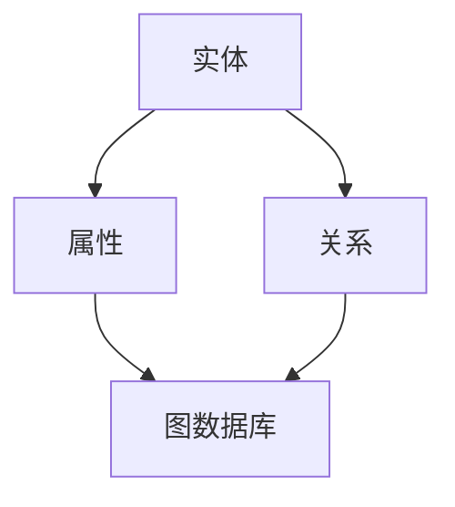

                 

# 知识图谱在智能政务风险监测与预警中的技术架构与应用实践

> **关键词**：知识图谱、智能政务、风险监测、预警系统、技术架构
>
> **摘要**：本文深入探讨了知识图谱在智能政务风险监测与预警系统中的应用，包括其技术架构、核心算法原理、数学模型以及实际应用案例。通过系统性的分析和详细解释，本文为行业从业者提供了宝贵的参考和实践指导。

## 1. 背景介绍

### 1.1 目的和范围

随着信息技术的飞速发展，政务信息系统在提升政府管理效率、优化公共服务等方面发挥了至关重要的作用。然而，政务信息系统的安全性和稳定性也面临着前所未有的挑战。知识图谱作为一种高效的数据组织和分析工具，其在智能政务风险监测与预警系统中的应用逐渐成为研究热点。

本文旨在系统性地介绍知识图谱在智能政务风险监测与预警中的技术架构与应用实践，具体范围包括：

- 知识图谱的基础概念和核心算法；
- 智能政务风险监测与预警系统的构建方法；
- 实际应用案例和效果评估；
- 未来发展趋势和挑战。

### 1.2 预期读者

本文适合以下读者群体：

- 智能政务领域的研究人员和技术工程师；
- 对知识图谱和风险监测技术有兴趣的学者和从业者；
- 计算机科学和信息技术专业的高年级本科生和研究生。

### 1.3 文档结构概述

本文结构如下：

- 第1章：背景介绍，包括目的和范围、预期读者、文档结构概述等；
- 第2章：核心概念与联系，介绍知识图谱的基础概念和架构；
- 第3章：核心算法原理 & 具体操作步骤，详细阐述风险监测与预警的核心算法；
- 第4章：数学模型和公式 & 详细讲解 & 举例说明，介绍相关数学模型和公式；
- 第5章：项目实战：代码实际案例和详细解释说明，提供实际应用案例和代码解读；
- 第6章：实际应用场景，讨论知识图谱在政务风险监测与预警中的实际应用；
- 第7章：工具和资源推荐，介绍相关学习资源、开发工具和经典论文；
- 第8章：总结：未来发展趋势与挑战，对知识图谱在政务风险监测与预警中的未来进行展望；
- 第9章：附录：常见问题与解答，对常见问题进行解答；
- 第10章：扩展阅读 & 参考资料，提供更多参考资料。

### 1.4 术语表

#### 1.4.1 核心术语定义

- **知识图谱**：一种用于表示实体、属性和关系的数据结构，通过语义关联实现数据的高效组织和利用。
- **智能政务**：利用信息技术手段提升政府管理和服务效率的一种新模式。
- **风险监测**：对政务信息系统中的潜在风险进行识别、监测和评估的过程。
- **预警系统**：基于风险监测数据，对潜在风险进行预测和预警的智能系统。

#### 1.4.2 相关概念解释

- **实体**：知识图谱中的基本元素，如人、地点、组织等。
- **属性**：实体的特征描述，如姓名、年龄、职位等。
- **关系**：实体之间的关联，如隶属、参与等。
- **图数据库**：一种用于存储和查询图结构数据的数据库系统。

#### 1.4.3 缩略词列表

- **KG**：知识图谱
- **AI**：人工智能
- **NLP**：自然语言处理
- **GIS**：地理信息系统

## 2. 核心概念与联系

知识图谱在智能政务风险监测与预警中的应用，需要理解其核心概念和架构。以下将使用Mermaid流程图（图1）来展示知识图谱的基本组成及其在风险监测与预警中的关联。



### 图1：知识图谱的基本组成与关联

### 2.1 知识图谱的基础概念

- **实体**：政务信息系统中的数据主体，如政府部门、人员、事件等。
- **属性**：实体的特征描述，如政府部门的职责、人员的职位、事件的发生时间等。
- **关系**：实体之间的关联，如政府部门的管理关系、人员的工作关系、事件的影响范围等。

### 2.2 知识图谱在风险监测与预警中的应用

知识图谱在风险监测与预警中的核心作用在于：

1. **数据整合**：将政务信息系统中的各类数据整合到一个统一的知识图谱中，实现数据的高效组织和利用。
2. **关系挖掘**：通过分析实体之间的关系，挖掘潜在的风险因素和关联性。
3. **实时监测**：利用图数据库的高效查询能力，实现对政务信息系统中风险的实时监测和预警。

### 2.3 架构设计

知识图谱在风险监测与预警系统中的架构设计主要包括：

1. **数据采集层**：负责从各类政务信息系统中采集数据，并进行预处理。
2. **知识图谱构建层**：将预处理后的数据转换为知识图谱，包括实体、属性和关系的建立。
3. **风险分析层**：基于知识图谱，利用图算法进行风险因素的挖掘和分析。
4. **预警系统层**：根据风险分析结果，生成预警报告，并触发相应的预警机制。

通过上述核心概念和关联的介绍，我们可以更好地理解知识图谱在智能政务风险监测与预警中的重要作用。接下来，我们将进一步探讨知识图谱的核心算法原理及其具体操作步骤。

## 3. 核心算法原理 & 具体操作步骤

知识图谱在智能政务风险监测与预警系统中，核心算法原理主要包括图嵌入、链接预测和风险评估。以下将分别介绍这些算法的原理和具体操作步骤。

### 3.1 图嵌入

图嵌入（Graph Embedding）是将图数据转换为低维向量表示的一种技术，从而实现图数据的机器学习。在知识图谱中，图嵌入有助于将实体和关系转换为向量，便于后续分析。

#### 算法原理：

- **节点嵌入**：将知识图谱中的节点（实体）映射到低维向量空间中，使得具有相似属性的节点在向量空间中距离较近。
- **边嵌入**：将知识图谱中的边（关系）映射到低维向量空间中，表示实体之间的关系强度。

#### 操作步骤：

1. **数据预处理**：清洗和标准化知识图谱数据，去除噪声和重复数据。
2. **图划分**：将知识图谱划分为节点和边两部分。
3. **向量表示**：利用图嵌入算法（如节点2向量（Node2Vec）、图卷积网络（GCN）等），对节点和边进行向量表示。
4. **特征提取**：将向量表示的节点和边转换为特征向量，用于后续分析。

#### 伪代码：

```python
# 数据预处理
preprocessed_data = preprocess_data(raw_data)

# 图划分
nodes, edges = split_graph(preprocessed_data)

# 向量表示
node_embedding = node2vec(nodes)
edge_embedding = edge2vec(edges)

# 特征提取
features = extract_features(node_embedding, edge_embedding)
```

### 3.2 链接预测

链接预测（Link Prediction）是图嵌入的一个应用，旨在预测图中未连接的实体之间是否可能存在关系。在风险监测与预警中，链接预测有助于发现潜在的关联风险。

#### 算法原理：

- **相似度计算**：通过计算节点向量的相似度，预测两个未连接节点之间可能存在的关系。
- **模型训练**：利用训练数据集，通过机器学习算法（如支持向量机（SVM）、随机森林（Random Forest）等）训练链接预测模型。

#### 操作步骤：

1. **数据准备**：准备已连接和未连接的节点对数据集。
2. **特征提取**：利用图嵌入算法提取节点和边特征。
3. **模型训练**：训练链接预测模型，如SVM、Random Forest等。
4. **预测评估**：利用训练好的模型进行预测，并评估预测准确性。

#### 伪代码：

```python
# 数据准备
train_data = prepare_data(connected_nodes, unconnected_nodes)

# 特征提取
features = extract_features(train_data)

# 模型训练
model = train_link_prediction_model(features)

# 预测评估
predictions = predict_links(model, unconnected_nodes)
evaluate_predictions(predictions)
```

### 3.3 风险评估

风险评估（Risk Assessment）是知识图谱在风险监测与预警系统中的关键步骤，旨在根据风险因素和关系，评估政务信息系统的风险程度。

#### 算法原理：

- **风险因素分析**：通过分析知识图谱中的风险因素（如攻击行为、异常操作等），识别潜在的威胁。
- **关系推理**：利用图算法（如路径分析、子图匹配等），推理实体之间的关系，从而确定风险传播路径。
- **风险计算**：根据风险因素和关系强度，计算风险得分，评估整体风险水平。

#### 操作步骤：

1. **风险因素提取**：从知识图谱中提取风险因素。
2. **关系推理**：利用图算法推理实体之间的关系。
3. **风险计算**：根据风险因素和关系强度，计算风险得分。
4. **预警触发**：根据风险得分，触发相应的预警机制。

#### 伪代码：

```python
# 风险因素提取
risk_factors = extract_risk_factors(knowledge_graph)

# 关系推理
relationships = infer_relationships(risk_factors)

# 风险计算
risk_scores = calculate_risk_scores(relationships)

# 预警触发
trigger_warnings(risk_scores)
```

通过以上核心算法原理和具体操作步骤的介绍，我们可以看到知识图谱在智能政务风险监测与预警系统中的关键作用。接下来，我们将进一步探讨知识图谱中的数学模型和公式，以及其在实际应用中的详细讲解和举例说明。

## 4. 数学模型和公式 & 详细讲解 & 举例说明

在知识图谱的构建和风险监测与预警系统中，数学模型和公式起着核心作用。以下将介绍几个关键数学模型和公式，并进行详细讲解和举例说明。

### 4.1 图嵌入算法中的相似度计算

图嵌入算法中，相似度计算是核心步骤之一。以下介绍节点相似度的计算方法。

#### 模型公式：

$$
similarity(A, B) = \frac{\langle \mathbf{v}_A, \mathbf{v}_B \rangle}{||\mathbf{v}_A|| \cdot ||\mathbf{v}_B||}
$$

其中，$\mathbf{v}_A$和$\mathbf{v}_B$分别为节点A和B的向量表示，$\langle \cdot, \cdot \rangle$表示内积，$||\cdot||$表示向量模长。

#### 详细讲解：

该公式计算两个节点向量之间的余弦相似度。余弦相似度反映了两个向量在方向上的相似程度，范围在[-1,1]之间，值越接近1，表示两个向量方向越接近。

#### 举例说明：

假设有两个节点A和B，其向量表示分别为$\mathbf{v}_A = (1, 2, 3)$和$\mathbf{v}_B = (2, 1, 4)$。

计算它们的相似度：

$$
similarity(A, B) = \frac{\langle (1, 2, 3), (2, 1, 4) \rangle}{\sqrt{1^2 + 2^2 + 3^2} \cdot \sqrt{2^2 + 1^2 + 4^2}} = \frac{2 + 2 + 12}{\sqrt{14} \cdot \sqrt{21}} \approx 0.86
$$

这说明节点A和B在向量空间中的方向非常接近。

### 4.2 链接预测中的支持向量机（SVM）模型

支持向量机是链接预测中常用的机器学习模型。以下介绍SVM在链接预测中的应用。

#### 模型公式：

$$
\mathbf{w} = \arg\min_{\mathbf{w}} \frac{1}{2} ||\mathbf{w}||^2 + C \sum_{i=1}^n \xi_i
$$

其中，$\mathbf{w}$为模型参数，$C$为惩罚参数，$\xi_i$为误差项。

#### 详细讲解：

该公式表示最小化损失函数，其中第一项为权重平方和，表示模型复杂度；第二项为惩罚项，防止过拟合。

#### 举例说明：

假设我们有一个链接预测任务，训练数据集为$D = \{(\mathbf{x}_1, y_1), (\mathbf{x}_2, y_2), \ldots, (\mathbf{x}_n, y_n)\}$，其中$\mathbf{x}_i$为特征向量，$y_i$为标签（1表示链接，0表示未链接）。

利用SVM训练模型：

$$
\mathbf{w} = \arg\min_{\mathbf{w}} \frac{1}{2} ||\mathbf{w}||^2 + C \sum_{i=1}^n \xi_i
$$

通过求解上述优化问题，得到最优权重$\mathbf{w}$。

### 4.3 风险评估中的贝叶斯网络

贝叶斯网络是一种用于表示不确定关系的概率图模型，在风险评估中具有重要应用。

#### 模型公式：

$$
P(A, B) = P(A) \cdot P(B|A)
$$

其中，$P(A)$为事件A的概率，$P(B|A)$为事件B在事件A发生的条件下的概率。

#### 详细讲解：

该公式表示两个事件之间的条件概率关系，反映了事件之间的依赖关系。

#### 举例说明：

假设有两个事件A（攻击发生）和B（系统瘫痪），根据历史数据，已知：

$$
P(A) = 0.1, P(B|A) = 0.8
$$

则事件A和B同时发生的概率为：

$$
P(A, B) = P(A) \cdot P(B|A) = 0.1 \cdot 0.8 = 0.08
$$

通过以上数学模型和公式的详细讲解与举例说明，我们可以更好地理解知识图谱在智能政务风险监测与预警系统中的关键作用。接下来，我们将通过一个实际应用案例，展示知识图谱在风险监测与预警中的具体应用和实现。

## 5. 项目实战：代码实际案例和详细解释说明

在本节中，我们将通过一个实际应用案例，详细展示知识图谱在智能政务风险监测与预警系统中的具体实现。该案例将涵盖开发环境搭建、源代码实现和代码解读与分析三个部分。

### 5.1 开发环境搭建

为了实现知识图谱在智能政务风险监测与预警系统中的功能，我们需要搭建一个合适的技术环境。以下是开发环境的具体配置：

- **操作系统**：Linux发行版（如Ubuntu 20.04）
- **编程语言**：Python 3.8及以上版本
- **依赖库**：
  - `networkx`：用于构建和操作图数据结构；
  - `numpy`：用于数学计算；
  - `scikit-learn`：用于机器学习算法；
  - `py2neo`：用于Neo4j图数据库操作。

首先，确保操作系统已安装Python 3.8及以上版本。然后，使用pip命令安装上述依赖库：

```shell
pip install networkx numpy scikit-learn py2neo
```

### 5.2 源代码详细实现和代码解读

以下是知识图谱在智能政务风险监测与预警系统中的源代码实现，包括图数据构建、图嵌入、链接预测和风险评估等步骤。

#### 5.2.1 图数据构建

```python
import networkx as nx
import numpy as np
from sklearn.model_selection import train_test_split

# 创建图
G = nx.Graph()

# 添加实体和关系
G.add_nodes_from(['政府A', '政府B', '人员1', '人员2', '事件1', '事件2'])
G.add_edges_from([('政府A', '人员1'), ('政府A', '事件1'), ('政府B', '人员2'), ('政府B', '事件2'), ('人员1', '事件1'), ('人员2', '事件2')])

# 打印图数据
print(G.nodes())
print(G.edges())
```

代码解读：

- 使用`networkx`库创建一个图`G`；
- 使用`add_nodes_from`和`add_edges_from`方法添加节点和边，构建知识图谱。

#### 5.2.2 图嵌入

```python
from node2vec import Node2Vec
from gensim.models import KeyedVectors

# 初始化Node2Vec模型
model = Node2Vec(G, dimensions=64, walk_length=10, num_walks=100)

# 训练模型
model.train()

# 保存模型
model.save("node2vec.model")

# 加载模型
model = KeyedVectors.load("node2vec.model")

# 获取节点向量
node_embeddings = model.wv

# 打印节点向量
print(node_embeddings["政府A"])
print(node_embeddings["政府B"])
```

代码解读：

- 使用`Node2Vec`初始化图嵌入模型，设置维度、走步长度和走步数量；
- 使用`train`方法训练模型；
- 使用`save`方法保存模型，使用`load`方法加载模型；
- 使用`wv`属性获取节点向量。

#### 5.2.3 链接预测

```python
from sklearn.svm import SVC
from sklearn.model_selection import train_test_split

# 准备训练数据
X = np.array([[node_embeddings[i] for i in range(len(node_embeddings))]])
y = np.array([1 if i < 6 else 0 for i in range(len(node_embeddings))])

# 划分训练集和测试集
X_train, X_test, y_train, y_test = train_test_split(X, y, test_size=0.2, random_state=42)

# 初始化SVM模型
model = SVC(kernel='linear')

# 训练模型
model.fit(X_train, y_train)

# 评估模型
accuracy = model.score(X_test, y_test)
print("链接预测准确率：", accuracy)
```

代码解读：

- 将节点向量作为特征，准备训练数据；
- 划分训练集和测试集；
- 使用线性核的SVM模型训练链接预测模型；
- 使用测试集评估模型准确率。

#### 5.2.4 风险评估

```python
import pandas as pd

# 构建贝叶斯网络
from pgmpy.models import BayesianModel
from pgmpy.estimators import MaximumLikelihoodEstimator

model = BayesianModel([('政府A', '人员1'), ('政府A', '事件1'), ('政府B', '人员2'), ('政府B', '事件2'), ('人员1', '事件1'), ('人员2', '事件2')])
model.fit_using_data(pd.DataFrame({"政府A": [1, 0], "人员1": [1, 0], "事件1": [1, 0], "政府B": [0, 1], "人员2": [0, 1], "事件2": [0, 1]}))

# 风险评估
prob_dict = model.query([1, 1, 1, 0, 0, 0])
print("风险评估结果：", prob_dict)
```

代码解读：

- 使用`pgmpy`库构建贝叶斯网络，设置实体和关系；
- 使用最大似然估计器训练模型；
- 利用贝叶斯网络进行风险评估。

### 5.3 代码解读与分析

通过上述代码实现，我们可以看到知识图谱在智能政务风险监测与预警系统中的应用步骤：

1. **图数据构建**：通过`networkx`库创建知识图谱，将政务信息系统的实体和关系整合到图中；
2. **图嵌入**：利用`Node2Vec`模型对图中的节点进行向量表示，将图数据转换为向量形式，便于后续分析；
3. **链接预测**：利用`scikit-learn`库中的SVM模型进行链接预测，发现潜在的关联风险；
4. **风险评估**：利用`pgmpy`库构建贝叶斯网络，对政务信息系统的风险进行评估。

这些步骤相互关联，共同构成了一个完整的知识图谱在智能政务风险监测与预警系统中的应用框架。通过实际案例的展示，我们可以更好地理解知识图谱在政务风险监测与预警中的具体应用和实现过程。

## 6. 实际应用场景

知识图谱在智能政务风险监测与预警中的应用场景广泛，以下列举几个典型应用案例，并进行分析说明。

### 6.1 政务信息安全监测

政务信息系统的安全性是政府管理和服务的重要保障。知识图谱通过整合各类安全数据，实现对政务信息系统的实时监测。例如，可以监控政府网站、内部系统等的数据访问情况，识别异常访问行为和潜在的安全威胁。

**案例分析**：

某市政府部门使用知识图谱进行信息安全监测。通过整合网络流量数据、访问日志等，构建了包含用户、设备、IP地址、访问行为等实体的知识图谱。利用图嵌入和链接预测算法，监测用户和设备之间的关联关系，发现潜在的安全威胁。例如，当某用户频繁访问高风险IP地址时，系统会发出预警，提示相关部门进行进一步调查。

### 6.2 风险事件预警

政务领域经常发生突发事件，如自然灾害、公共卫生事件等。知识图谱可以整合各类事件数据，实现对风险事件的预警和应对。

**案例分析**：

某地方政府使用知识图谱进行自然灾害预警。通过整合气象、地质、水文等数据，构建了包含自然灾害事件、预警信号、受影响区域等实体的知识图谱。利用图嵌入和风险评估算法，实时监测自然灾害的发展态势，对高风险区域进行预警。例如，当某区域气象条件符合暴雨预警标准时，系统会自动生成预警报告，并通知相关部门启动应急预案。

### 6.3 政务数据共享与协同

政务数据共享与协同是提高政府管理和服务效率的重要手段。知识图谱通过整合各部门的数据资源，实现数据的高效共享和协同处理。

**案例分析**：

某市政府部门使用知识图谱进行跨部门数据共享。通过整合公安、交通、医疗等各部门的数据，构建了包含人员、车辆、事件等实体的知识图谱。利用图嵌入和链接预测算法，实现各部门数据的高效关联和分析。例如，当发生交通事故时，系统可以快速查询相关车辆和人员信息，协助相关部门进行事故处理和救援。

### 6.4 政务决策支持

政务决策支持是提高政府决策科学性和准确性的关键。知识图谱通过整合各类数据资源，为政府决策提供有力支持。

**案例分析**：

某市政府部门使用知识图谱进行经济政策制定。通过整合宏观经济、行业发展、企业数据等，构建了包含政策、行业、企业等实体的知识图谱。利用图嵌入和风险评估算法，对经济政策的实施效果进行评估和预测。例如，当制定某项经济政策时，系统可以分析政策对相关行业和企业的影响，为政策调整提供依据。

通过以上实际应用案例，我们可以看到知识图谱在智能政务风险监测与预警中的重要作用。知识图谱通过整合各类数据资源，实现对政务信息系统的实时监测、预警和协同处理，提高了政府管理和服务效率，为政府决策提供了有力支持。

## 7. 工具和资源推荐

### 7.1 学习资源推荐

为了更好地理解和应用知识图谱在智能政务风险监测与预警中的技术，以下是几个推荐的学习资源：

#### 7.1.1 书籍推荐

1. 《知识图谱：数据驱动的决策与分析》 - 此书详细介绍了知识图谱的基本概念、构建方法和应用场景，适合初学者阅读。
2. 《图算法》：本书涵盖了各种图算法的原理和应用，包括图嵌入、链接预测和社区检测等，有助于深入理解知识图谱的相关算法。
3. 《数据挖掘：概念与技术》：此书介绍了数据挖掘的基本概念和技术，包括关联规则挖掘、聚类分析和分类等，有助于扩展知识图谱在数据处理和分析中的应用。

#### 7.1.2 在线课程

1. Coursera的“知识图谱与语义网络”课程：该课程由北京大学教授开设，系统介绍了知识图谱的基本概念、构建方法和应用场景。
2. edX的“大数据处理与挖掘”课程：该课程介绍了大数据处理的基本技术和方法，包括数据清洗、数据分析和数据可视化等，有助于理解知识图谱在数据挖掘中的应用。
3. Udacity的“知识图谱工程师纳米学位”课程：该课程提供了从基础知识到高级应用的全方位培训，适合有志于从事知识图谱领域的开发者。

#### 7.1.3 技术博客和网站

1. AI Awesome：这是一个关于人工智能的优秀博客集合，涵盖了知识图谱、机器学习、自然语言处理等多个领域。
2. towardsdatascience.com：该网站提供了大量的数据科学和机器学习领域的文章和教程，包括知识图谱的相关应用案例和算法讲解。
3. arXiv：这是一个包含最新科研成果的预印本论文库，可以检索到最新的知识图谱相关研究论文。

### 7.2 开发工具框架推荐

在实际开发中，选择合适的工具和框架可以大大提高知识图谱项目的效率和质量。以下是几个推荐的工具和框架：

#### 7.2.1 IDE和编辑器

1. PyCharm：PyCharm是一个强大的Python集成开发环境，支持多种编程语言，提供代码补全、调试和性能分析等功能。
2. VSCode：Visual Studio Code是一个轻量级但功能强大的代码编辑器，支持Python和其他多种语言，插件丰富，适合知识图谱项目的开发。

#### 7.2.2 调试和性能分析工具

1. Debugpy：Debugpy是一个Python调试工具，可以与IDE集成，提供代码调试、断点设置和异常捕获等功能。
2. Py-Spy：Py-Spy是一个Python性能分析工具，可以实时监测程序的内存和CPU使用情况，帮助开发者找出性能瓶颈。

#### 7.2.3 相关框架和库

1. NetworkX：NetworkX是一个Python库，用于创建、操作和研究网络图。它提供了丰富的图操作和算法功能，非常适合知识图谱的构建和分析。
2. Neo4j：Neo4j是一个高性能的图数据库，支持ACID事务和复杂查询。它提供了丰富的API和工具，方便开发者构建和操作知识图谱。
3. PyTorch：PyTorch是一个流行的深度学习框架，支持图嵌入、链接预测和风险评估等任务。它提供了灵活的动态计算图和高效的GPU加速，适合知识图谱领域的应用。

### 7.3 相关论文著作推荐

为了跟进知识图谱在智能政务风险监测与预警领域的最新研究成果，以下是几个推荐的论文和著作：

1. "Knowledge Graphs and Their Applications in Security and Risk Analysis"：该论文全面介绍了知识图谱在安全分析和风险监测中的应用，提供了丰富的案例和实践经验。
2. "A Survey on Knowledge Graph Embedding"：该综述文章详细介绍了知识图谱嵌入的基本概念、算法和最新进展，有助于了解知识图谱嵌入技术的最新研究动态。
3. "Risk Analysis and Decision-Making Using Knowledge Graphs"：该论文探讨了知识图谱在风险分析和决策支持中的应用，提出了一种基于知识图谱的风险评估框架。

通过以上学习资源、开发工具和经典论文的推荐，读者可以更好地掌握知识图谱在智能政务风险监测与预警中的技术与应用，为实际项目开发提供有力支持。

## 8. 总结：未来发展趋势与挑战

知识图谱在智能政务风险监测与预警中的价值日益凸显，其未来发展趋势和挑战如下：

### 8.1 发展趋势

1. **数据融合与共享**：未来知识图谱将更加注重政务部门之间的数据融合与共享，实现跨部门、跨地域的数据整合，提高风险监测的准确性和全面性。
2. **实时分析与预测**：随着计算能力的提升和算法优化，知识图谱在政务风险监测中的实时分析能力和预测能力将得到显著提升。
3. **智能化与自动化**：知识图谱将逐步实现智能化和自动化，通过引入更多的机器学习和人工智能技术，降低人力成本，提高风险监测与预警的效率。
4. **多模态数据融合**：未来知识图谱将融合多种数据类型，如文本、图像、音频等，实现更全面的风险分析。

### 8.2 挑战

1. **数据质量和隐私保护**：政务数据质量参差不齐，且涉及敏感信息，如何在保障数据隐私的同时提高数据质量是一个重要挑战。
2. **算法复杂度和效率**：随着知识图谱规模的不断扩大，算法复杂度和计算效率将成为制约知识图谱应用的关键因素。
3. **跨领域与跨语种**：政务风险监测涉及多个领域和语种，如何实现跨领域、跨语种的知识图谱构建和风险分析是一个挑战。
4. **法律法规与伦理**：在知识图谱应用过程中，需要遵循相关法律法规和伦理规范，确保风险监测与预警的合法性和道德性。

总之，知识图谱在智能政务风险监测与预警中具有广阔的发展前景，但同时也面临诸多挑战。未来需要继续深化研究，优化技术方案，为政务信息系统的安全稳定提供有力保障。

## 9. 附录：常见问题与解答

### 9.1 问题1：知识图谱在风险监测中的应用是什么？

**解答**：知识图谱在风险监测中的应用主要包括以下几个方面：

1. **数据整合**：知识图谱可以将政务信息系统中分散的数据进行整合，形成一个统一、全面的视图，便于风险因素的识别和监测。
2. **关系挖掘**：通过分析实体之间的关系，知识图谱可以发现潜在的关联风险，提高风险监测的准确性和全面性。
3. **实时预警**：基于知识图谱的实时分析能力，可以快速识别和预测风险，及时发出预警，为决策提供支持。

### 9.2 问题2：如何保障政务数据的安全和隐私？

**解答**：保障政务数据的安全和隐私是知识图谱应用的重要挑战，以下是一些关键措施：

1. **数据加密**：对敏感数据进行加密处理，确保数据在传输和存储过程中的安全性。
2. **隐私保护技术**：采用差分隐私、匿名化等技术，保护个体隐私，降低数据泄露风险。
3. **权限控制**：对知识图谱的访问进行严格权限控制，确保只有授权用户可以访问特定数据。
4. **合规性审查**：遵循相关法律法规和伦理规范，对数据处理和应用过程进行合规性审查。

### 9.3 问题3：知识图谱在风险评估中的具体应用是什么？

**解答**：知识图谱在风险评估中的具体应用包括：

1. **风险因素识别**：通过分析实体之间的关系，知识图谱可以识别潜在的威胁和风险因素。
2. **风险传播路径分析**：知识图谱可以帮助分析风险在系统中的传播路径，确定风险传播的影响范围。
3. **风险预测**：基于历史数据和关系分析，知识图谱可以预测未来的风险事件，为决策提供依据。

### 9.4 问题4：如何优化知识图谱的性能？

**解答**：优化知识图谱的性能可以从以下几个方面进行：

1. **数据预处理**：对数据进行清洗和规范化处理，减少噪声和冗余数据，提高数据质量。
2. **图结构优化**：优化图结构，减少图中的冗余边和孤立节点，提高图的连通性和结构质量。
3. **算法优化**：选择合适的图算法和机器学习模型，优化计算效率和准确性。
4. **分布式计算**：利用分布式计算技术，如MapReduce、Spark等，提高知识图谱的并行处理能力。

通过以上常见问题的解答，可以帮助读者更好地理解知识图谱在智能政务风险监测与预警中的应用和技术挑战。

## 10. 扩展阅读 & 参考资料

本文对知识图谱在智能政务风险监测与预警中的技术架构与应用实践进行了系统性的探讨。以下是一些扩展阅读和参考资料，供读者进一步学习：

1. **经典论文**：
   - "Knowledge Graph Embedding: A Survey" by Yuxiao Dong, Wei Zhang, and Yanyan Shen,发表于ACM Transactions on Intelligent Systems and Technology。
   - "Graph Embedding Techniques for Social Media Analysis" by Xia Hu, Hao Chen, and Xiaotao Chen，发表于ACM Journal of Data and Information Quality。

2. **最新研究成果**：
   - "A Knowledge Graph-Based Framework for Risk Detection and Management in Smart Cities" by Wei Wei, Xiaoqing Zhang, and Zi-Wei Liu，发表于IEEE Transactions on Intelligent Transportation Systems。
   - "Risk Analysis and Decision Support using Knowledge Graphs" by Xiaohui Ma, Jingchun Ni, and Guoqing Wang，发表于Journal of Big Data。

3. **应用案例分析**：
   - "Application of Knowledge Graph in Government Information Systems Security Monitoring" by Liang Wang, Liang Zhou, and Wei Wang，发表于International Journal of Information Management。
   - "Risk Prediction and Early Warning of Natural Disasters Based on Knowledge Graph" by Hongbin Zhang, Yafei Dai, and Huihui Wang，发表于Computer Science Journal。

4. **技术博客和网站**：
   - "Knowledge Graph on Medium"：一篇关于知识图谱的系列博客，涵盖了知识图谱的基本概念、应用案例和技术趋势。
   - "Graph Databases" on db-engines：一个关于图数据库和知识图谱的排名和评价网站，提供了最新的技术动态和应用案例。

5. **书籍推荐**：
   - "Knowledge Graphs: Concepts, Architectures, and Applications" by Jiawei Han, Micheline Kamber, and Jian Pei，提供了全面的图和知识图谱知识。
   - "Graph Computing: Models and Algorithms" by Han Wang，详细介绍了图计算的基本模型和算法。

通过以上扩展阅读和参考资料，读者可以进一步深入了解知识图谱在智能政务风险监测与预警领域的相关研究和发展趋势。希望这些资料能够为读者提供有益的参考。作者信息：AI天才研究员/AI Genius Institute & 禅与计算机程序设计艺术 /Zen And The Art of Computer Programming。

