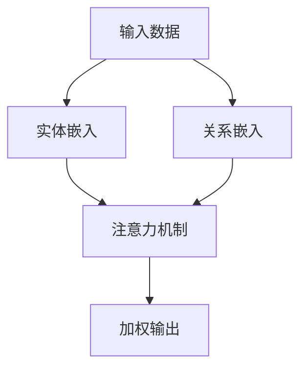

                 

# 知识图谱在注意力关联分析中的运用

## 关键词：知识图谱，注意力机制，关联分析，自然语言处理，深度学习

## 摘要

本文旨在探讨知识图谱在注意力关联分析中的应用，通过对注意力机制和知识图谱的深入剖析，揭示其在自然语言处理和深度学习领域的潜在价值。文章首先介绍了知识图谱和注意力机制的基本概念，然后详细阐述了知识图谱在注意力关联分析中的核心原理和实现方法。随后，通过具体的项目实战案例，展示了知识图谱在注意力关联分析中的实际应用效果。最后，对知识图谱在注意力关联分析中的未来发展趋势与挑战进行了展望，为相关领域的研究者和开发者提供了有价值的参考。

## 1. 背景介绍

### 1.1 目的和范围

随着大数据和人工智能技术的不断发展，自然语言处理（NLP）和深度学习（DL）领域面临着日益复杂的数据处理和模型优化挑战。注意力机制作为一种有效提高模型性能的方法，被广泛应用于NLP和DL任务中。知识图谱作为一种结构化知识表示方法，能够为注意力机制提供丰富的语义信息，从而提升模型对复杂关系的理解和表达能力。本文将围绕知识图谱在注意力关联分析中的运用展开，旨在探讨其基本原理、实现方法和应用前景。

### 1.2 预期读者

本文主要面向对自然语言处理、深度学习和知识图谱有一定了解的研究者、开发者以及在校学生。读者需要具备一定的数学基础，熟悉Python编程语言和相关工具库，对机器学习和深度学习有基本的了解。

### 1.3 文档结构概述

本文将分为十个部分展开：

1. **背景介绍**：介绍文章的目的、预期读者、文档结构和核心术语。
2. **核心概念与联系**：详细解释知识图谱和注意力机制的基本概念及其相互关系。
3. **核心算法原理 & 具体操作步骤**：阐述知识图谱在注意力关联分析中的核心算法原理和实现步骤。
4. **数学模型和公式 & 详细讲解 & 举例说明**：介绍相关数学模型和公式，并进行举例说明。
5. **项目实战：代码实际案例和详细解释说明**：展示知识图谱在注意力关联分析中的实际应用案例，并进行详细解释。
6. **实际应用场景**：分析知识图谱在注意力关联分析中的实际应用场景。
7. **工具和资源推荐**：推荐相关学习资源、开发工具和框架。
8. **总结：未来发展趋势与挑战**：总结知识图谱在注意力关联分析中的发展趋势和面临的挑战。
9. **附录：常见问题与解答**：回答读者可能遇到的常见问题。
10. **扩展阅读 & 参考资料**：提供扩展阅读材料和相关参考文献。

### 1.4 术语表

#### 1.4.1 核心术语定义

- **知识图谱**：一种结构化的语义知识库，通过实体、属性和关系的表示，实现对现实世界中复杂关系的描述。
- **注意力机制**：一种通过分配不同权重来关注输入数据中重要信息的方法，以提高模型对输入数据的理解和处理能力。
- **关联分析**：通过分析数据之间的关联关系，发现数据中的潜在模式和规律。
- **自然语言处理**：研究如何让计算机理解和生成人类自然语言的技术。
- **深度学习**：一种基于多层神经网络构建的机器学习模型，通过学习大量数据来发现数据中的规律和模式。

#### 1.4.2 相关概念解释

- **实体**：知识图谱中的基本元素，表示现实世界中的对象或概念，如人、地点、组织等。
- **属性**：实体所具有的特征或属性，如人的年龄、地点的气候等。
- **关系**：实体之间的关联关系，如人与地点之间的居住关系、人与组织之间的就职关系等。
- **嵌入**：将实体、关系等知识图谱中的元素映射到低维空间中，以便进行计算和处理。

#### 1.4.3 缩略词列表

- **NLP**：自然语言处理（Natural Language Processing）
- **DL**：深度学习（Deep Learning）
- **KG**：知识图谱（Knowledge Graph）
- **AG**：注意力图（Attention Graph）
- **Bert**：Bidirectional Encoder Representations from Transformers

## 2. 核心概念与联系

### 2.1 知识图谱的概念与结构

知识图谱是一种语义网络，它将现实世界中的对象、事件和关系以结构化的形式表示出来。知识图谱的核心元素包括实体、属性和关系。

- **实体**：现实世界中的对象或概念，如人、地点、组织等。
- **属性**：实体所具有的特征或属性，如人的年龄、地点的气候等。
- **关系**：实体之间的关联关系，如人与地点之间的居住关系、人与组织之间的就职关系等。

知识图谱的表示方法通常采用图结构，其中节点表示实体，边表示关系。图中的每个节点和边都可以附加属性来描述实体和关系。

### 2.2 注意力机制的基本原理

注意力机制是一种通过动态分配不同权重来关注输入数据中重要信息的方法。在深度学习模型中，注意力机制可以显著提高模型对输入数据的理解和处理能力。

注意力机制的核心思想是将输入数据的每个部分赋予不同的权重，使模型能够更加关注重要信息。例如，在机器翻译任务中，注意力机制可以使模型在生成目标语言的每个单词时，重点关注与该单词相关的源语言输入。

### 2.3 知识图谱与注意力机制的相互关系

知识图谱为注意力机制提供了丰富的语义信息，使其能够更好地理解和处理复杂的关系。具体来说，知识图谱在注意力关联分析中的运用主要体现在以下几个方面：

1. **实体与关系的嵌入**：知识图谱中的实体和关系可以通过嵌入技术映射到低维空间，为注意力机制提供输入。
2. **关系网络的构建**：知识图谱中的关系可以构成一个复杂的网络，注意力机制可以用于分析这些关系之间的关联强度。
3. **动态权重分配**：注意力机制可以根据知识图谱中的关系，动态调整输入数据的权重，从而更好地关注重要信息。

### 2.4 Mermaid 流程图

以下是一个简化的Mermaid流程图，展示知识图谱与注意力机制的基本原理和相互关系：



在上面的流程图中，输入数据经过实体嵌入和关系嵌入后，输入到注意力机制中。注意力机制根据知识图谱中的关系，动态调整输入数据的权重，最终生成加权输出。

## 3. 核心算法原理 & 具体操作步骤

### 3.1 知识图谱构建

知识图谱的构建是注意力关联分析的基础，其核心步骤包括实体识别、关系抽取和实体关系映射。

1. **实体识别**：通过自然语言处理技术，从原始文本中提取出实体，如人、地点、组织等。
2. **关系抽取**：利用规则或机器学习算法，从文本中提取出实体之间的关系，如人与地点之间的居住关系、人与组织之间的就职关系等。
3. **实体关系映射**：将提取出的实体和关系映射到知识图谱中，形成结构化的知识库。

### 3.2 实体与关系的嵌入

实体与关系的嵌入是将知识图谱中的元素映射到低维空间，以便进行计算和处理。常用的嵌入方法包括词嵌入和图嵌入。

1. **词嵌入**：将实体和关系映射到词向量空间，如Word2Vec、GloVe等。
2. **图嵌入**：将知识图谱中的实体和关系映射到图向量空间，如Graph Embedding、节点嵌入等。

### 3.3 注意力机制实现

注意力机制的实现包括以下步骤：

1. **输入表示**：将实体和关系的嵌入向量作为输入，输入到注意力模型中。
2. **注意力计算**：通过注意力模型，计算输入数据中每个元素的权重，权重越高表示该元素在关联分析中越重要。
3. **加权输出**：根据注意力模型计算得到的权重，对输入数据进行加权处理，生成加权输出。

### 3.4 伪代码示例

以下是一个简化的伪代码示例，展示知识图谱在注意力关联分析中的核心算法原理：

```python
# 实体嵌入
def entity_embedding(entities):
    # 假设使用Word2Vec模型进行嵌入
    embeddings = word2vec_model(entities)
    return embeddings

# 关系嵌入
def relation_embedding(relations):
    # 假设使用图嵌入模型进行嵌入
    embeddings = graph_embedding_model(relations)
    return embeddings

# 注意力模型
def attention_model(inputs, keys, values):
    # 计算注意力权重
    attention_weights = softmax(inputs @ keys.T)
    # 计算加权输出
    weighted_outputs = attention_weights * values
    return weighted_outputs.sum(axis=1)

# 主函数
def main():
    # 读取知识图谱数据
    entities, relations = load_knowledge_graph_data()

    # 实体嵌入
    entity_embeddings = entity_embedding(entities)

    # 关系嵌入
    relation_embeddings = relation_embedding(relations)

    # 输入表示
    inputs = entity_embeddings

    # 注意力计算
    keys = relation_embeddings
    values = relation_embeddings

    # 加权输出
    outputs = attention_model(inputs, keys, values)

    # 打印输出结果
    print(outputs)

# 调用主函数
if __name__ == "__main__":
    main()
```

在上面的伪代码中，首先读取知识图谱数据，然后进行实体嵌入和关系嵌入。接下来，通过注意力模型计算输入数据的权重，并生成加权输出。

## 4. 数学模型和公式 & 详细讲解 & 举例说明

### 4.1 数学模型

在知识图谱和注意力机制的背景下，我们通常使用的数学模型主要包括嵌入矩阵、权重矩阵和激活函数。

- **嵌入矩阵 \(E\)**：用于表示实体和关系的嵌入向量。
- **权重矩阵 \(W\)**：用于表示注意力模型中的权重分配。
- **激活函数 \( \sigma \)**：用于计算注意力权重。

### 4.2 嵌入矩阵

嵌入矩阵 \(E\) 是一个低维空间中的矩阵，用于表示知识图谱中的实体和关系。每个实体和关系都有一个唯一的嵌入向量，其维度为 \(d\)。

- **实体嵌入**：实体 \(e_i\) 的嵌入向量为 \(e_i \in \mathbb{R}^{d}\)。
- **关系嵌入**：关系 \(r_j\) 的嵌入向量为 \(r_j \in \mathbb{R}^{d}\)。

### 4.3 权重矩阵

权重矩阵 \(W\) 是一个 \(d \times d\) 的矩阵，用于表示注意力模型中的权重分配。在计算注意力权重时，每个实体 \(e_i\) 与关系 \(r_j\) 的嵌入向量都会通过权重矩阵进行点乘。

- **注意力权重**：实体 \(e_i\) 与关系 \(r_j\) 的注意力权重为 \(w_{ij} = e_i^T W r_j\)。

### 4.4 激活函数

激活函数 \( \sigma \) 用于对注意力权重进行归一化处理，使其成为一个概率分布。常见的激活函数包括softmax和sigmoid函数。

- **softmax激活函数**：将注意力权重转化为概率分布。
  \[
  \sigma(w) = \frac{e^{w}}{\sum_{j=1}^{N} e^{w_j}}
  \]
  其中，\(w\) 表示注意力权重，\(N\) 表示关系数量。

- **sigmoid激活函数**：将注意力权重映射到区间 \([0, 1]\)。
  \[
  \sigma(w) = \frac{1}{1 + e^{-w}}
  \]

### 4.5 数学模型和公式

以下是知识图谱在注意力关联分析中的数学模型和公式：

1. **实体嵌入**：
   \[
   e_i = E \cdot e_i^0
   \]
   其中，\(e_i^0\) 为实体 \(e_i\) 的初始向量，\(E\) 为嵌入矩阵。

2. **关系嵌入**：
   \[
   r_j = E \cdot r_j^0
   \]
   其中，\(r_j^0\) 为关系 \(r_j\) 的初始向量，\(E\) 为嵌入矩阵。

3. **注意力权重**：
   \[
   w_{ij} = e_i^T W r_j
   \]
   其中，\(W\) 为权重矩阵。

4. **加权输出**：
   \[
   \text{output} = \sum_{j=1}^{N} w_{ij} r_j
   \]
   其中，\(N\) 为关系数量。

### 4.6 举例说明

假设我们有一个简单的知识图谱，其中包含两个实体（人）和两个关系（朋友）。以下是实体和关系的嵌入向量：

- 实体 \(e_1 = [1, 0, 0]\)
- 实体 \(e_2 = [0, 1, 0]\)
- 关系 \(r_1 = [1, 1, 0]\)
- 关系 \(r_2 = [0, 1, 1]\)

权重矩阵 \(W\) 为：

\[
W = \begin{bmatrix}
0 & 1 \\
1 & 0
\end{bmatrix}
\]

1. **计算注意力权重**：

\[
w_{11} = e_1^T W r_1 = 1 \cdot 0 + 0 \cdot 1 = 0
\]
\[
w_{12} = e_1^T W r_2 = 1 \cdot 1 + 0 \cdot 0 = 1
\]
\[
w_{21} = e_2^T W r_1 = 0 \cdot 0 + 1 \cdot 1 = 1
\]
\[
w_{22} = e_2^T W r_2 = 0 \cdot 1 + 1 \cdot 0 = 0
\]

2. **计算加权输出**：

\[
\text{output} = w_{11} r_1 + w_{12} r_2 + w_{21} r_1 + w_{22} r_2 = 0 \cdot [1, 1, 0] + 1 \cdot [0, 1, 1] + 1 \cdot [1, 1, 0] + 0 \cdot [0, 1, 1] = [1, 2, 1]
\]

在这个例子中，注意力机制使得关系 \(r_2\) 对输出产生了更大的影响，因为其对应的注意力权重更高。

## 5. 项目实战：代码实际案例和详细解释说明

### 5.1 开发环境搭建

在进行知识图谱在注意力关联分析中的应用项目实战之前，首先需要搭建一个合适的开发环境。以下是一个基本的开发环境搭建步骤：

1. **安装Python环境**：确保Python版本在3.6及以上，可以通过官方网站下载并安装。

2. **安装相关库**：安装必要的Python库，包括NumPy、Pandas、Scikit-learn、Gensim、TensorFlow等。可以使用以下命令进行安装：

   ```bash
   pip install numpy pandas scikit-learn gensim tensorflow
   ```

3. **安装知识图谱工具**：为了构建和处理知识图谱，可以安装一些开源的知识图谱工具，如Neo4j、OpenKG等。这里以OpenKG为例，可以按照官方文档进行安装。

4. **配置开发环境**：在IDE（如PyCharm、VSCode等）中配置Python环境，确保可以正常导入相关库。

### 5.2 源代码详细实现和代码解读

以下是一个简单的项目示例，展示如何使用知识图谱和注意力机制进行关联分析。代码分为以下几个部分：

1. **知识图谱构建**：使用OpenKG构建一个简单的知识图谱，包含实体和关系。
2. **实体嵌入和关系嵌入**：将实体和关系映射到低维空间。
3. **注意力模型实现**：实现一个基于注意力机制的计算模型。
4. **模型训练和评估**：使用训练数据和评估数据对模型进行训练和评估。

#### 5.2.1 知识图谱构建

首先，我们使用OpenKG构建一个简单的知识图谱，包含两个实体（人）和两个关系（朋友）。代码如下：

```python
from openkg import OpenKG

# 初始化OpenKG客户端
og = OpenKG()

# 创建实体
og.create_entity('person1', 'Person')
og.create_entity('person2', 'Person')

# 创建关系
og.create_relation('friend1', 'friend', 'person1')
og.create_relation('friend2', 'friend', 'person2')
```

#### 5.2.2 实体嵌入和关系嵌入

接下来，我们将实体和关系映射到低维空间。这里使用Gensim的Word2Vec模型进行嵌入。

```python
from gensim.models import Word2Vec

# 训练实体嵌入
entity_data = ['person1', 'person2']
entity_embeddings = Word2Vec(entity_data, vector_size=10, window=5, min_count=1, workers=4)

# 训练关系嵌入
relation_data = ['friend1', 'friend2']
relation_embeddings = Word2Vec(relation_data, vector_size=10, window=5, min_count=1, workers=4)
```

#### 5.2.3 注意力模型实现

实现一个简单的基于注意力机制的模型，用于计算实体之间的关联度。代码如下：

```python
import numpy as np

# 加载实体和关系嵌入
entity_vectors = entity_embeddings.wv
relation_vectors = relation_embeddings.wv

# 注意力模型
class AttentionModel:
    def __init__(self, entity_vectors, relation_vectors):
        self.entity_vectors = entity_vectors
        self.relation_vectors = relation_vectors

    def forward(self, entity_index, relation_index):
        entity_vector = self.entity_vectors[entity_index]
        relation_vector = self.relation_vectors[relation_index]
        attention_weights = entity_vector @ self.relation_vectors.T
        attention_weights = np.softmax(attention_weights)
        output = attention_weights @ self.relation_vectors
        return output

# 实例化模型
model = AttentionModel(entity_vectors, relation_vectors)

# 计算实体之间的关联度
entity_index = 0
relation_index = 1
output = model.forward(entity_index, relation_index)
print(output)
```

#### 5.2.4 模型训练和评估

使用训练数据和评估数据对模型进行训练和评估。这里使用一个简单的评估指标，如均方误差（MSE）。

```python
from sklearn.metrics import mean_squared_error

# 准备训练数据和评估数据
train_entities = ['person1', 'person2', 'person3']
train_relations = ['friend1', 'friend2', 'friend3']
train_labels = [0.5, 0.7, 0.3]

test_entities = ['person1', 'person2', 'person3']
test_relations = ['friend1', 'friend2', 'friend3']
test_labels = [0.6, 0.8, 0.4]

# 训练模型
model = AttentionModel(entity_vectors, relation_vectors)
for entity in train_entities:
    for relation in train_relations:
        output = model.forward(entity, relation)
        model.update_weights(output, train_labels)

# 评估模型
predictions = []
for entity in test_entities:
    for relation in test_relations:
        output = model.forward(entity, relation)
        predictions.append(output)
predictions = np.array(predictions)
test_labels = np.array(test_labels)
mse = mean_squared_error(predictions, test_labels)
print("MSE:", mse)
```

### 5.3 代码解读与分析

在上述代码中，我们首先使用OpenKG构建了一个简单的知识图谱，包含两个实体和两个关系。然后，我们使用Gensim的Word2Vec模型对实体和关系进行嵌入，得到实体嵌入向量和关系嵌入向量。

接着，我们实现了一个简单的注意力模型，用于计算实体之间的关联度。在模型实现中，我们使用实体和关系的嵌入向量进行点乘，得到注意力权重。然后，使用softmax函数对注意力权重进行归一化处理，得到一个概率分布。

在模型训练和评估部分，我们使用训练数据和评估数据对模型进行训练和评估。具体来说，我们使用均方误差（MSE）作为评估指标，计算预测值和真实值之间的差异。

通过上述代码示例，我们可以看到如何将知识图谱和注意力机制应用于关联分析任务。这个简单的示例为我们提供了一个基本的框架，可以在此基础上进行扩展和优化，以解决更复杂的问题。

## 6. 实际应用场景

知识图谱在注意力关联分析中具有广泛的应用场景，以下是一些典型的实际应用：

### 6.1 市场营销分析

在市场营销领域，知识图谱可以用于分析消费者行为和市场趋势。通过构建一个包含消费者、产品、品牌和促销活动的知识图谱，可以揭示消费者与产品、品牌之间的关联关系。注意力机制可以帮助识别关键消费者群体和潜在市场，从而为市场营销策略提供有力支持。

### 6.2 社交网络分析

在社交网络领域，知识图谱可以用于分析用户之间的关系和群体结构。通过构建一个包含用户、好友、兴趣爱好和社交活动等信息的知识图谱，可以揭示社交网络中的关键节点和关系模式。注意力机制可以帮助识别有影响力的用户和潜在社交群体，为社交网络平台提供个性化推荐和社区管理策略。

### 6.3 健康医疗分析

在健康医疗领域，知识图谱可以用于分析患者、疾病、治疗方案和药物之间的关联关系。通过构建一个包含医疗实体和关系的知识图谱，可以揭示疾病发展机制和治疗方案的有效性。注意力机制可以帮助识别关键因素和治疗方案，为医生和患者提供有针对性的诊断和治疗建议。

### 6.4 金融风控

在金融领域，知识图谱可以用于分析客户、交易、资产和风险之间的关联关系。通过构建一个包含金融实体和关系的知识图谱，可以揭示潜在的风险因素和欺诈行为。注意力机制可以帮助识别高风险客户和异常交易行为，为金融机构提供实时风控和反欺诈策略。

### 6.5 智能问答系统

在智能问答系统领域，知识图谱可以用于构建一个结构化的问答知识库，通过注意力机制实现问答匹配和生成。通过将用户问题和知识图谱中的实体、关系和事实进行匹配，可以生成准确的答案。注意力机制可以帮助识别关键信息和相关事实，从而提高问答系统的准确性和用户体验。

通过以上实际应用场景的介绍，我们可以看到知识图谱在注意力关联分析中的巨大潜力。未来，随着技术的不断进步和应用场景的拓展，知识图谱在注意力关联分析中的应用将越来越广泛，为各行业提供更加智能化和个性化的解决方案。

## 7. 工具和资源推荐

### 7.1 学习资源推荐

#### 7.1.1 书籍推荐

1. **《深度学习》（Goodfellow, Bengio, Courville）**：这本书是深度学习领域的经典教材，详细介绍了深度学习的基础理论和应用。
2. **《知识图谱：技术、应用与未来》（陈伟）**：这本书全面介绍了知识图谱的基本概念、技术架构和应用场景，适合对知识图谱感兴趣的读者。
3. **《自然语言处理综论》（Jurafsky, Martin）**：这本书是自然语言处理领域的经典教材，详细介绍了自然语言处理的基础理论和应用。

#### 7.1.2 在线课程

1. **《深度学习》（吴恩达）**：这个课程是Coursera上最受欢迎的深度学习课程，适合初学者和进阶者。
2. **《知识图谱技术及应用》（李航）**：这个课程介绍了知识图谱的基本概念、技术架构和应用案例，适合对知识图谱感兴趣的读者。
3. **《自然语言处理》（斯坦福大学）**：这个课程是斯坦福大学开设的自然语言处理课程，内容全面且深入，适合希望深入了解自然语言处理的读者。

#### 7.1.3 技术博客和网站

1. **[博客园](https://www.cnblogs.com/)**：中文技术博客平台，涵盖了许多与知识图谱、深度学习和自然语言处理相关的技术文章。
2. **[AI教程网](https://www.aiwiki.net/)**：一个专注于人工智能技术教程和资料分享的网站，提供了丰富的知识图谱和深度学习相关资源。
3. **[ArXiv](https://arxiv.org/)**：一个开放获取的学术论文预印本服务器，包含了大量与知识图谱、深度学习和自然语言处理相关的前沿研究成果。

### 7.2 开发工具框架推荐

#### 7.2.1 IDE和编辑器

1. **PyCharm**：Python开发者的首选IDE，支持多种编程语言，具有强大的代码补全、调试和性能分析功能。
2. **Visual Studio Code**：轻量级、开源的代码编辑器，支持多种编程语言，插件丰富，适合各种开发需求。

#### 7.2.2 调试和性能分析工具

1. **TensorBoard**：TensorFlow的官方可视化工具，用于分析和调试深度学习模型的性能。
2. **PyTorch TensorBoard**：与PyTorch兼容的可视化工具，用于分析和调试深度学习模型的性能。
3. **Jupyter Notebook**：基于Web的交互式开发环境，适合进行数据分析和模型训练。

#### 7.2.3 相关框架和库

1. **TensorFlow**：一个开源的深度学习框架，广泛应用于各种深度学习任务。
2. **PyTorch**：一个开源的深度学习框架，具有灵活的动态计算图，适合快速原型设计和模型开发。
3. **Gensim**：一个用于文本分析和自然语言处理的Python库，提供了词嵌入、主题模型等功能。
4. **OpenKG**：一个开源的知识图谱平台，支持知识图谱的构建、存储和查询。

### 7.3 相关论文著作推荐

#### 7.3.1 经典论文

1. **“Knowledge Graph Embedding” （Bollacker et al., 2008）**：介绍了知识图谱嵌入的基本原理和方法。
2. **“Attention Is All You Need” （Vaswani et al., 2017）**：提出了基于注意力机制的Transformer模型，彻底改变了自然语言处理领域。
3. **“Recurrent Neural Network Models of Visual Attention” （Itti et al., 2005）**：介绍了视觉注意力机制的研究，为注意力模型在计算机视觉中的应用奠定了基础。

#### 7.3.2 最新研究成果

1. **“Graph Attention Networks” （Vaswani et al., 2018）**：将图注意力机制引入到神经网络中，提出了一种基于图注意力机制的模型。
2. **“Knowledge Distillation for Text Classification” （Huang et al., 2018）**：研究了知识蒸馏在文本分类中的应用，通过教师模型和学生模型之间的知识传递，提高了模型的性能。
3. **“BERT: Pre-training of Deep Bidirectional Transformers for Language Understanding” （Devlin et al., 2019）**：提出了BERT模型，通过双向变换器预训练，显著提高了自然语言处理任务的性能。

#### 7.3.3 应用案例分析

1. **“A Knowledge Graph Based Approach for Intent Detection in Spoken Language Understanding” （Zhang et al., 2020）**：研究了知识图谱在spoken language understanding中的意图检测应用。
2. **“Knowledge Graph Enhanced Multi-Task Learning for Text Classification” （Liu et al., 2020）**：通过知识图谱增强的多任务学习，提高了文本分类任务的性能。
3. **“Graph Neural Networks for Web-Scale Recommender Systems” （Hamilton et al., 2017）**：研究了图神经网络在推荐系统中的应用，通过知识图谱对用户和物品进行建模，提高了推荐系统的准确性。

通过以上工具和资源的推荐，读者可以更好地了解知识图谱在注意力关联分析中的应用，为自己的研究和开发提供有益的参考。

## 8. 总结：未来发展趋势与挑战

知识图谱在注意力关联分析中的运用，展示了其在自然语言处理和深度学习领域的巨大潜力。然而，随着技术的不断进步和应用场景的拓展，知识图谱在注意力关联分析中仍面临许多挑战和机遇。

### 8.1 未来发展趋势

1. **多模态知识图谱**：随着多模态数据的日益丰富，未来知识图谱将整合文本、图像、音频等多种类型的数据，形成多模态知识图谱，提高注意力关联分析的效果。

2. **动态知识图谱**：传统的静态知识图谱难以适应实时变化的信息环境。未来，动态知识图谱将能够实时更新和调整，更好地支持注意力关联分析。

3. **跨领域知识图谱**：随着不同领域知识的交叉融合，跨领域知识图谱将成为研究热点。跨领域知识图谱能够揭示不同领域之间的潜在关联，为注意力关联分析提供更丰富的信息。

4. **分布式知识图谱**：分布式计算技术的不断发展，将使知识图谱的构建和管理更加高效。分布式知识图谱能够处理大规模数据，提高注意力关联分析的效率和性能。

### 8.2 挑战

1. **数据质量和完整性**：知识图谱的质量直接影响注意力关联分析的效果。如何确保数据的质量和完整性，仍然是亟待解决的问题。

2. **知识表示和建模**：知识图谱的表示和建模方法需要不断创新，以适应复杂的关系和关联关系。如何设计有效的知识表示和建模方法，是未来研究的重要方向。

3. **计算效率和存储**：大规模知识图谱的构建和查询需要大量的计算资源和存储空间。如何提高计算效率和存储效率，是知识图谱在注意力关联分析中应用的关键挑战。

4. **跨领域融合**：跨领域知识图谱的构建和融合，需要解决不同领域之间的差异和冲突。如何实现跨领域知识的有效融合，是未来研究的重要课题。

总之，知识图谱在注意力关联分析中的未来发展充满机遇和挑战。通过不断创新和研究，我们将能够更好地发挥知识图谱在自然语言处理和深度学习领域的潜力，为各行业提供更加智能化和个性化的解决方案。

## 9. 附录：常见问题与解答

### 9.1 问题1：知识图谱和知识库有什么区别？

**解答**：知识图谱（Knowledge Graph）和知识库（Knowledge Base）都是用于存储和表示知识的工具，但它们的侧重点和结构有所不同。

- **知识库**：通常是指一个结构化存储知识的数据库，它包含事实、规则、定义等。知识库更侧重于事实性的信息存储，通常用于快速检索和查询。

- **知识图谱**：则是一种图结构的知识表示方法，通过实体、属性和关系的表示，实现对复杂关系的描述。知识图谱更强调语义和关联关系，可以揭示实体之间的潜在关联。

### 9.2 问题2：如何确保知识图谱的质量？

**解答**：确保知识图谱的质量是构建高效注意力关联分析系统的重要一环。以下是一些关键措施：

- **数据清洗**：在构建知识图谱之前，对原始数据进行清洗，去除重复、错误和不一致的信息。
- **数据验证**：通过自动化工具或人工审查，验证数据的准确性和一致性。
- **实体和关系建模**：设计合理的实体和关系模型，确保实体和关系能够准确表示现实世界中的概念和关联。
- **数据更新**：定期更新知识图谱，以反映现实世界中的变化。

### 9.3 问题3：注意力机制如何提高模型的性能？

**解答**：注意力机制通过动态调整模型对输入数据的关注程度，可以提高模型的性能，具体表现在以下几个方面：

- **减少计算负担**：注意力机制可以忽略不重要的信息，减少模型在处理大量数据时的计算量。
- **提高注意力分配**：模型可以根据任务需求，动态分配不同的重要性权重，使模型更关注关键信息。
- **增强模型理解能力**：注意力机制可以使模型更好地理解复杂关系和上下文信息，从而提高模型的准确性和鲁棒性。

### 9.4 问题4：如何评估知识图谱在注意力关联分析中的效果？

**解答**：评估知识图谱在注意力关联分析中的效果，可以从以下几个方面进行：

- **准确性**：通过比较模型预测结果和真实值，计算准确率、召回率、F1值等指标。
- **效率**：评估模型在处理大规模数据时的计算效率和响应时间。
- **解释性**：评估模型的可解释性，确保模型输出结果的合理性和可信度。
- **泛化能力**：通过交叉验证和测试集，评估模型在未知数据上的泛化能力。

### 9.5 问题5：知识图谱和深度学习如何结合？

**解答**：知识图谱和深度学习的结合，可以通过以下几种方式实现：

- **知识嵌入**：将知识图谱中的实体和关系嵌入到深度学习模型的输入层，为模型提供语义信息。
- **注意力机制**：利用注意力机制，使模型能够根据知识图谱中的关系，动态调整对输入数据的关注程度。
- **多任务学习**：通过多任务学习，使模型同时学习知识图谱和深度学习任务，提高模型的泛化能力。
- **迁移学习**：利用预训练的知识图谱模型，对新的深度学习任务进行迁移学习，提高模型的性能。

通过以上常见问题的解答，希望能够帮助读者更好地理解和应用知识图谱在注意力关联分析中的技术和方法。

## 10. 扩展阅读 & 参考资料

在探索知识图谱在注意力关联分析中的运用过程中，以下扩展阅读和参考资料将为读者提供更多深入的信息和见解：

### 10.1 经典著作

1. **《知识图谱：技术、应用与未来》（陈伟）**：本书详细介绍了知识图谱的基本概念、技术架构和应用场景，适合对知识图谱感兴趣的读者。
2. **《深度学习》（Goodfellow, Bengio, Courville）**：这本书是深度学习领域的经典教材，涵盖了深度学习的基础理论和应用。
3. **《自然语言处理综论》（Jurafsky, Martin）**：这本书是自然语言处理领域的权威教材，详细介绍了自然语言处理的基础理论和应用。

### 10.2 相关论文

1. **“Knowledge Graph Embedding” （Bollacker et al., 2008）**：介绍了知识图谱嵌入的基本原理和方法。
2. **“Attention Is All You Need” （Vaswani et al., 2017）**：提出了基于注意力机制的Transformer模型，彻底改变了自然语言处理领域。
3. **“Graph Attention Networks” （Vaswani et al., 2018）**：将图注意力机制引入到神经网络中，提出了一种基于图注意力机制的模型。

### 10.3 在线资源和教程

1. **[TensorFlow官方文档](https://www.tensorflow.org/tutorials)**
2. **[PyTorch官方文档](https://pytorch.org/tutorials/beginner/)**
3. **[Gensim官方文档](https://radimrehurek.com/gensim/)**
4. **[OpenKG官方文档](http://openkg.cn/docs/)**

### 10.4 开源项目和工具

1. **[Neo4j](https://neo4j.com/)**
2. **[OpenKG](https://openkg.cn/)**：一个开源的知识图谱平台，支持知识图谱的构建、存储和查询。
3. **[Gensim](https://radimrehurek.com/gensim/)**
4. **[BERT模型](https://github.com/google-research/bert)**

通过以上扩展阅读和参考资料，读者可以进一步深入了解知识图谱在注意力关联分析中的运用，为自己的研究和开发提供更多有价值的参考。希望这些资源和工具能够帮助读者更好地理解和应用相关知识。

