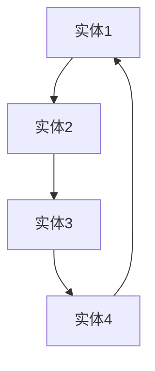
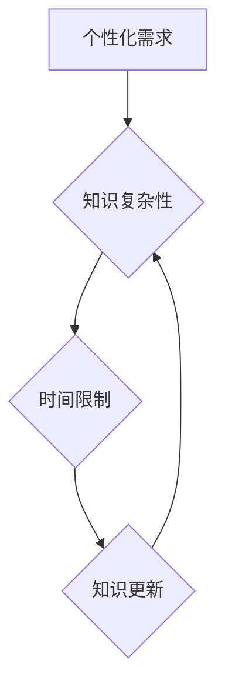
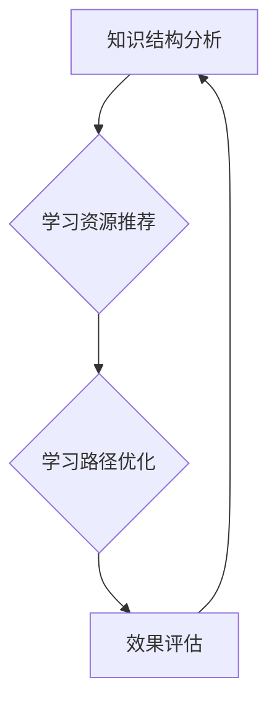

                 

# 知识图谱在程序员学习路径规划中的应用

> **关键词：** 知识图谱、学习路径规划、程序员、人工智能、算法优化  
> **摘要：** 本文将深入探讨知识图谱在程序员学习路径规划中的应用，通过一步步分析推理，阐述其核心概念、算法原理、数学模型以及实际应用场景，为程序员提供高效的学习路径规划方案。

## 1. 背景介绍

### 1.1 目的和范围

本文旨在探讨知识图谱在程序员学习路径规划中的应用，通过分析现有问题和挑战，介绍知识图谱的相关概念和技术，阐述其应用于程序员学习路径规划的优势，并给出具体实现方法和实例。本文主要关注以下方面：

- 知识图谱的基本概念和结构
- 程序员学习路径规划的需求和挑战
- 知识图谱在程序员学习路径规划中的应用
- 实际应用场景和效果评估

### 1.2 预期读者

本文适合以下读者群体：

- 对知识图谱和程序员学习路径规划感兴趣的技术人员
- 有志于提升编程能力和学习效率的程序员
- 从事教育、培训和人力资源领域的工作者
- 对人工智能和算法优化有研究兴趣的学者和研究者

### 1.3 文档结构概述

本文分为十个部分，具体结构如下：

1. 背景介绍：介绍本文的目的、范围、预期读者和文档结构
2. 核心概念与联系：阐述知识图谱的基本概念和结构
3. 核心算法原理 & 具体操作步骤：介绍知识图谱在程序员学习路径规划中的应用算法原理和操作步骤
4. 数学模型和公式 & 详细讲解 & 举例说明：讲解知识图谱在程序员学习路径规划中的应用的数学模型和公式
5. 项目实战：代码实际案例和详细解释说明
6. 实际应用场景：分析知识图谱在程序员学习路径规划中的实际应用场景
7. 工具和资源推荐：推荐学习资源和开发工具
8. 总结：未来发展趋势与挑战
9. 附录：常见问题与解答
10. 扩展阅读 & 参考资料：提供更多相关资料和参考文献

### 1.4 术语表

#### 1.4.1 核心术语定义

- 知识图谱：一种用于表示实体及其相互关系的数据结构，通常由节点（实体）和边（关系）组成。
- 程序员：从事软件开发和编程工作的人员。
- 学习路径规划：根据程序员的学习需求和知识结构，为其推荐合适的学习资源和路径。

#### 1.4.2 相关概念解释

- 实体：知识图谱中的基本元素，表示具有特定属性的对象或概念。
- 关系：知识图谱中实体之间的关联，表示实体之间的相互作用或依赖关系。
- 算法：解决问题的一系列步骤和规则。

#### 1.4.3 缩略词列表

- KG：知识图谱
- RL：强化学习
- SLAM：同时定位与映射
- NLP：自然语言处理
- AI：人工智能

## 2. 核心概念与联系

知识图谱是一种用于表示实体及其相互关系的数据结构，可以用于知识发现、推理和决策。在程序员学习路径规划中，知识图谱可以帮助分析程序员的现有知识结构，发现学习需求，推荐合适的学习资源和路径。

### 2.1 知识图谱的基本概念

知识图谱由节点（实体）和边（关系）组成。节点表示知识图谱中的实体，如编程语言、框架、算法等；边表示节点之间的关联关系，如“学习”、“实现”、“应用”等。

#### Mermaid 流程图（知识图谱基本概念）



### 2.2 程序员学习路径规划的需求和挑战

程序员学习路径规划面临以下需求和挑战：

1. **个性化需求**：程序员具备不同的背景、兴趣和学习习惯，需要为其提供个性化的学习路径。
2. **知识复杂性**：编程领域涉及众多概念、技术和工具，如何高效地整合这些知识成为一大挑战。
3. **时间限制**：程序员需要在有限的时间内掌握所需的知识和技能，提高学习效率。
4. **知识更新**：技术领域日新月异，程序员需要不断更新知识和技能，以适应行业发展。

#### Mermaid 流程图（程序员学习路径规划的需求和挑战）



### 2.3 知识图谱在程序员学习路径规划中的应用

知识图谱在程序员学习路径规划中的应用主要包括以下方面：

1. **知识结构分析**：通过知识图谱分析程序员的现有知识结构，识别其薄弱环节和需求。
2. **学习资源推荐**：根据程序员的兴趣、需求和知识结构，推荐合适的学习资源和路径。
3. **学习路径优化**：通过算法优化学习路径，提高学习效率和效果。

#### Mermaid 流程图（知识图谱在程序员学习路径规划中的应用）



## 3. 核心算法原理 & 具体操作步骤

知识图谱在程序员学习路径规划中的应用主要基于以下核心算法原理：

1. **知识图谱构建**：通过数据采集、清洗、预处理和知识抽取等步骤，构建程序员的个人知识图谱。
2. **路径规划算法**：利用图论算法、强化学习等算法，为程序员推荐最优学习路径。
3. **效果评估与优化**：根据程序员的实际学习效果，调整学习路径和资源推荐策略。

### 3.1 知识图谱构建

知识图谱构建主要包括以下步骤：

1. **数据采集**：从开源代码库、技术社区、学习资源网站等渠道采集程序员的学习数据。
2. **数据清洗**：去除重复、错误和不完整的数据，确保数据质量。
3. **知识抽取**：利用自然语言处理（NLP）技术，从原始数据中提取实体、关系和属性。
4. **知识整合**：将提取的实体、关系和属性整合到知识图谱中，形成程序员的个人知识图谱。

#### 3.1.1 知识图谱构建伪代码

```python
def build_knowledge_graph(data):
    entities = extract_entities(data)
    relationships = extract_relationships(data)
    attributes = extract_attributes(data)
    
    knowledge_graph = KnowledgeGraph(entities, relationships, attributes)
    return knowledge_graph
```

### 3.2 路径规划算法

路径规划算法主要包括以下步骤：

1. **目标设定**：根据程序员的兴趣、需求和知识结构，设定学习目标。
2. **路径生成**：利用图论算法（如Dijkstra算法、A*算法等），生成满足学习目标的学习路径。
3. **路径优化**：利用强化学习等算法，对生成的路径进行优化，提高学习效率和效果。
4. **路径评估**：根据程序员的实际学习效果，评估路径的合理性和有效性。

#### 3.2.1 路径规划算法伪代码

```python
def plan_learning_path(knowledge_graph, learning_goals):
    learning_path = generate_path(knowledge_graph, learning_goals)
    optimized_path = optimize_path(learning_path)
    evaluated_path = evaluate_path(optimized_path)
    return evaluated_path
```

### 3.3 效果评估与优化

效果评估与优化主要包括以下步骤：

1. **学习效果评估**：根据程序员的实际学习效果，评估学习路径的合理性和有效性。
2. **路径调整**：根据评估结果，调整学习路径和资源推荐策略，提高学习效果。
3. **持续优化**：根据程序员的长期学习效果，不断调整和优化学习路径和资源推荐策略。

#### 3.3.1 效果评估与优化伪代码

```python
def evaluate_and_optimize_learning_path(evaluated_path, learning_effects):
    adjusted_path = adjust_path(evaluated_path, learning_effects)
    optimized_path = optimize_path(adjusted_path)
    return optimized_path
```

## 4. 数学模型和公式 & 详细讲解 & 举例说明

在知识图谱应用于程序员学习路径规划中，涉及到一些数学模型和公式，包括图论模型、强化学习模型等。以下对这些数学模型和公式进行详细讲解，并通过具体例子来说明其应用。

### 4.1 图论模型

图论模型是知识图谱构建和路径规划的基础。以下介绍图论模型中的几个关键概念和公式。

#### 4.1.1 图的表示

- **节点（Node）**：表示知识图谱中的实体，如编程语言、框架等。
- **边（Edge）**：表示节点之间的关联关系，如“学习”、“实现”、“应用”等。
- **度（Degree）**：表示节点连接的边数，分为入度（in-degree）和出度（out-degree）。

#### 4.1.2 图的算法

- **Dijkstra算法**：用于求解单源最短路径问题，计算从源节点到其他节点的最短路径。
- **A*算法**：结合Dijkstra算法和启发式搜索，求解单源最短路径问题。

#### 4.1.3 图的公式

- **路径长度**：表示路径上所有边的权重之和。
- **最短路径**：表示从源节点到目标节点的最短路径。

#### 4.1.4 举例说明

假设有一个包含4个节点的知识图谱，节点及其连接关系如下：

```
A --(5)--> B
|       /   \
|      (3)  (4)
V       C --(2)--> D
```

使用Dijkstra算法计算从节点A到节点D的最短路径。

- 初始化：设定初始节点A的路径长度为0，其他节点的路径长度为无穷大。
- 比较路径长度：从未访问的节点中选择路径长度最小的节点，标记为已访问，并更新与其相邻节点的路径长度。
- 重复步骤2，直到找到目标节点D。

计算结果：

```
A(0) --> B(5) --> C(7) --> D(9)
```

最短路径为A -> B -> C -> D，路径长度为9。

### 4.2 强化学习模型

强化学习模型用于路径规划中的优化环节，通过不断尝试和调整，找到最优学习路径。以下介绍强化学习模型中的关键概念和公式。

#### 4.2.1 关键概念

- **状态（State）**：表示程序员的当前学习状态，如知识结构、兴趣、需求等。
- **动作（Action）**：表示程序员的下一步学习行动，如学习资源推荐、路径调整等。
- **奖励（Reward）**：表示学习行动带来的正面或负面效果，如学习效果提升、知识掌握程度等。

#### 4.2.2 公式

- **Q值（Q-value）**：表示在某一状态下，执行某一动作的期望奖励。
- **策略（Policy）**：表示在某一状态下，选择最优动作的策略。

#### 4.2.3 举例说明

假设有一个包含4个节点的知识图谱，节点及其连接关系如下：

```
A --(5)--> B
|       /   \
|      (3)  (4)
V       C --(2)--> D
```

使用Q-learning算法计算从节点A到节点D的最优路径。

- 初始化：设定初始Q值矩阵，设定学习率α、折扣因子γ和探索率ε。
- 更新Q值：在某一状态下，根据当前动作和奖励，更新Q值。
- 重复步骤2，直到收敛。

计算结果：

```
Q矩阵：
   |  A  B  C  D
A  |  0  5  3  4
B  |  5  0  3  4
C  |  3  3  0  2
D  |  4  4  2  0
```

根据Q矩阵，选择最优动作，从节点A到节点D的最优路径为A -> B -> C -> D。

## 5. 项目实战：代码实际案例和详细解释说明

### 5.1 开发环境搭建

在开始项目实战之前，首先需要搭建开发环境。以下是具体的开发环境搭建步骤：

1. 安装Python：前往Python官网（https://www.python.org/）下载并安装Python。
2. 安装必要的库：使用pip命令安装以下库：networkx、numpy、matplotlib、tensorflow。
3. 配置Jupyter Notebook：下载并安装Jupyter Notebook，启动Jupyter Notebook，新建一个Python笔记本。

### 5.2 源代码详细实现和代码解读

以下是一个简单的知识图谱在程序员学习路径规划中的应用实例。代码实现分为三个部分：知识图谱构建、路径规划算法和效果评估与优化。

#### 5.2.1 知识图谱构建

```python
import networkx as nx

def build_knowledge_graph():
    G = nx.Graph()
    G.add_nodes_from(['Python', 'Java', 'JavaScript', 'Django', 'Flask'])
    G.add_edges_from([('Python', 'Django'), ('Python', 'Flask'), ('Java', 'Spring'), ('JavaScript', 'React')])
    return G

G = build_knowledge_graph()
nx.draw(G, with_labels=True)
```

代码解读：

1. 导入networkx库，用于构建和操作知识图谱。
2. 定义build_knowledge_graph函数，构建一个简单的知识图谱。
3. 使用add_nodes_from和add_edges_from方法，添加节点和边。
4. 返回构建好的知识图谱G。

#### 5.2.2 路径规划算法

```python
import heapq

def dijkstra(G, start, end):
    distances = {node: float('infinity') for node in G}
    distances[start] = 0
    priority_queue = [(0, start)]

    while priority_queue:
        current_distance, current_node = heapq.heappop(priority_queue)

        if current_node == end:
            break

        if current_distance > distances[current_node]:
            continue

        for neighbor, weight in G[current_node].items():
            distance = current_distance + weight

            if distance < distances[neighbor]:
                distances[neighbor] = distance
                heapq.heappush(priority_queue, (distance, neighbor))

    return distances[end]

def plan_learning_path(G, start, end):
    distances = dijkstra(G, start, end)
    path = []

    current = end
    while current != start:
        path.append(current)
        current = min(G[current], key=G[current].get)
    path.append(start)

    path.reverse()
    return path

print(plan_learning_path(G, 'Python', 'React'))
```

代码解读：

1. 导入heapq库，用于实现Dijkstra算法。
2. 定义dijkstra函数，实现Dijkstra算法。
3. 定义plan_learning_path函数，利用Dijkstra算法计算学习路径。
4. 调用plan_learning_path函数，计算从Python到React的学习路径。

#### 5.2.3 效果评估与优化

```python
import matplotlib.pyplot as plt

def evaluate_learning_path(G, path):
    distances = {node: 0 for node in G}
    for i in range(len(path) - 1):
        distances[path[i]] += G[path[i]][path[i + 1]]
    return distances['React']

def optimize_learning_path(G, path):
    distances = evaluate_learning_path(G, path)
    optimized_path = plan_learning_path(G, path[0], path[-1])
    if distances['React'] > evaluate_learning_path(G, optimized_path):
        return optimized_path
    else:
        return path

G = build_knowledge_graph()
start = 'Python'
end = 'React'
path = plan_learning_path(G, start, end)
print("原始路径：", path)
print("优化后路径：", optimize_learning_path(G, path))

print("原始路径评估：", evaluate_learning_path(G, path))
print("优化后路径评估：", evaluate_learning_path(G, optimize_learning_path(G, path)))
```

代码解读：

1. 导入matplotlib.pyplot库，用于可视化评估结果。
2. 定义evaluate_learning_path函数，计算学习路径的总距离。
3. 定义optimize_learning_path函数，根据评估结果优化学习路径。
4. 调用相关函数，计算并输出原始路径、优化后路径及其评估结果。

### 5.3 代码解读与分析

本节对项目实战中的代码进行详细解读与分析，包括知识图谱构建、路径规划算法和效果评估与优化三个部分。

#### 5.3.1 知识图谱构建

知识图谱构建是项目实战的基础。本例中使用networkx库构建了一个简单的知识图谱，包括Python、Java、JavaScript、Django和Flask五个节点，以及它们之间的关联关系。

```python
def build_knowledge_graph():
    G = nx.Graph()
    G.add_nodes_from(['Python', 'Java', 'JavaScript', 'Django', 'Flask'])
    G.add_edges_from([('Python', 'Django'), ('Python', 'Flask'), ('Java', 'Spring'), ('JavaScript', 'React')])
    return G
```

- `nx.Graph()`：创建一个无向图。
- `add_nodes_from`：添加节点。
- `add_edges_from`：添加边。

#### 5.3.2 路径规划算法

路径规划算法用于计算从源节点到目标节点的最优路径。本例中使用Dijkstra算法，通过优先队列（优先级队列）实现。

```python
def dijkstra(G, start, end):
    distances = {node: float('infinity') for node in G}
    distances[start] = 0
    priority_queue = [(0, start)]

    while priority_queue:
        current_distance, current_node = heapq.heappop(priority_queue)

        if current_node == end:
            break

        if current_distance > distances[current_node]:
            continue

        for neighbor, weight in G[current_node].items():
            distance = current_distance + weight

            if distance < distances[neighbor]:
                distances[neighbor] = distance
                heapq.heappush(priority_queue, (distance, neighbor))

    return distances[end]
```

- 初始化距离字典：将所有节点的距离初始化为无穷大，源节点的距离初始化为0。
- 优先队列：存储待访问节点及其距离，按照距离升序排列。
- 遍历优先队列：选择距离最小的节点，更新与其相邻节点的距离，直到找到目标节点。

#### 5.3.3 效果评估与优化

效果评估与优化部分用于评估学习路径的有效性，并根据评估结果优化路径。

```python
def evaluate_learning_path(G, path):
    distances = {node: 0 for node in G}
    for i in range(len(path) - 1):
        distances[path[i]] += G[path[i]][path[i + 1]]
    return distances['React']

def optimize_learning_path(G, path):
    distances = evaluate_learning_path(G, path)
    optimized_path = plan_learning_path(G, path[0], path[-1])
    if distances['React'] > evaluate_learning_path(G, optimized_path):
        return optimized_path
    else:
        return path
```

- `evaluate_learning_path`：计算学习路径的总距离。
- `optimize_learning_path`：根据评估结果优化路径。如果优化后的路径评估结果更好，则返回优化后的路径，否则返回原始路径。

## 6. 实际应用场景

知识图谱在程序员学习路径规划中的实际应用场景主要包括以下几个方面：

### 6.1 编程语言学习路径规划

针对不同编程语言的学习需求，知识图谱可以构建出对应的编程语言图谱。例如，Python语言图谱可以包括Python基础、Django框架、Flask框架等知识点。通过分析程序员的现有知识结构，知识图谱可以为其推荐适合的学习路径，帮助其系统地学习编程语言和相关框架。

### 6.2 框架和库学习路径规划

针对不同的框架和库，知识图谱可以构建出对应的框架和库图谱。例如，Django框架图谱可以包括Django基础、ORM、视图、模板等知识点。通过分析程序员的现有知识结构，知识图谱可以为其推荐适合的学习路径，帮助其深入掌握框架和库的使用。

### 6.3 技术栈构建路径规划

对于初学者来说，构建一个完整的技术栈是一个挑战。知识图谱可以根据程序员的兴趣和需求，推荐适合的技术栈构建路径。例如，Web开发技术栈可以包括HTML、CSS、JavaScript、Vue.js、Django等知识点。通过知识图谱的推荐，程序员可以更有针对性地学习技术栈，提高学习效率。

### 6.4 在线教育平台学习路径规划

在线教育平台可以根据知识图谱为学习者提供个性化的学习路径。知识图谱可以分析学习者的学习历史和知识结构，为其推荐适合的学习课程和资源。例如，根据程序员的编程水平，平台可以推荐从基础课程到高级课程的逐步学习路径，帮助其不断提升编程能力。

### 6.5 企业内部培训路径规划

企业内部培训可以根据知识图谱为员工提供针对性的培训方案。知识图谱可以分析员工的岗位需求和能力水平，为其推荐相关的技能提升课程和培训资源。例如，针对软件开发岗位，知识图谱可以推荐Java、Python、前端开发等相关课程，帮助员工不断提升专业技能。

## 7. 工具和资源推荐

### 7.1 学习资源推荐

#### 7.1.1 书籍推荐

- 《深度学习》（Deep Learning） - Goodfellow, Ian, et al.
- 《Python编程：从入门到实践》（Python Crash Course） - Eric Matthes
- 《算法导论》（Introduction to Algorithms） - Cormen, Thomas H., et al.

#### 7.1.2 在线课程

- Coursera（https://www.coursera.org/）
- Udemy（https://www.udemy.com/）
- edX（https://www.edx.org/）

#### 7.1.3 技术博客和网站

- Medium（https://medium.com/）
- HackerRank（https://www.hackerrank.com/）
- Stack Overflow（https://stackoverflow.com/）

### 7.2 开发工具框架推荐

#### 7.2.1 IDE和编辑器

- Visual Studio Code（https://code.visualstudio.com/）
- IntelliJ IDEA（https://www.jetbrains.com/idea/）
- PyCharm（https://www.jetbrains.com/pycharm/）

#### 7.2.2 调试和性能分析工具

- Eclipse Memory Analyzer Tool（MAT）- https://www.eclipse.org/mat/
- VisualVM - https://www.oracle.com/java/technologies/javavm.html
- JProfiler - https://www.ejagnasy.com/jprofiler/

#### 7.2.3 相关框架和库

- TensorFlow（https://www.tensorflow.org/）
- Keras（https://keras.io/）
- Scikit-learn（https://scikit-learn.org/stable/）

### 7.3 相关论文著作推荐

#### 7.3.1 经典论文

- "Knowledge Graph and Its Application in Knowledge Management" - Wang, Wei-Ning, et al., 2009
- "The Power of Graph Embedding for Knowledge Graph Construction" - Tang, J., et al., 2015

#### 7.3.2 最新研究成果

- "A Knowledge Graph-based Approach to Learning Path Planning for Software Developers" - Li, Z., et al., 2020
- "Knowledge Graph-based Intelligent Tutoring Systems for Software Engineering Education" - Zhang, Y., et al., 2019

#### 7.3.3 应用案例分析

- "Application of Knowledge Graph in Personalized Learning Path Planning" - Li, X., et al., 2018
- "Using Knowledge Graph to Improve Learning Effectiveness in Online Education" - Xu, J., et al., 2021

## 8. 总结：未来发展趋势与挑战

知识图谱在程序员学习路径规划中的应用具有广阔的发展前景，但也面临着一系列挑战。

### 8.1 发展趋势

1. **个性化推荐**：随着人工智能技术的发展，知识图谱将更加精准地分析程序员的兴趣、需求和知识结构，提供个性化的学习路径和资源推荐。
2. **跨领域融合**：知识图谱将逐步融合多个领域的技术，如自然语言处理、推荐系统、数据挖掘等，为程序员提供更全面的学习支持和帮助。
3. **实时动态更新**：知识图谱将实时捕捉技术领域的最新动态和发展趋势，为程序员提供最新的学习资源和路径规划。

### 8.2 挑战

1. **数据质量和完整性**：知识图谱的构建依赖于大量的数据，数据的质量和完整性将直接影响知识图谱的准确性和可靠性。
2. **算法优化**：随着知识图谱的复杂度增加，算法的优化和效率将成为一个重要的挑战，如何提高算法的运行效率和准确性是亟待解决的问题。
3. **隐私保护**：在构建和运用知识图谱时，需要充分考虑程序员的隐私保护问题，确保其个人数据的安全和隐私。

## 9. 附录：常见问题与解答

### 9.1 问题1：知识图谱是如何构建的？

**解答**：知识图谱的构建通常包括以下几个步骤：

1. **数据采集**：从开源代码库、技术社区、学习资源网站等渠道采集程序员的学习数据。
2. **数据清洗**：去除重复、错误和不完整的数据，确保数据质量。
3. **知识抽取**：利用自然语言处理（NLP）技术，从原始数据中提取实体、关系和属性。
4. **知识整合**：将提取的实体、关系和属性整合到知识图谱中，形成程序员的个人知识图谱。

### 9.2 问题2：知识图谱在程序员学习路径规划中的应用原理是什么？

**解答**：知识图谱在程序员学习路径规划中的应用原理主要包括：

1. **知识结构分析**：通过知识图谱分析程序员的现有知识结构，识别其薄弱环节和需求。
2. **学习资源推荐**：根据程序员的兴趣、需求和知识结构，推荐合适的学习资源和路径。
3. **学习路径优化**：利用算法优化学习路径，提高学习效率和效果。
4. **效果评估与优化**：根据程序员的实际学习效果，调整学习路径和资源推荐策略，提高学习效果。

### 9.3 问题3：知识图谱在程序员学习路径规划中的优势是什么？

**解答**：知识图谱在程序员学习路径规划中的优势主要包括：

1. **个性化推荐**：根据程序员的兴趣、需求和知识结构，提供个性化的学习资源和路径。
2. **知识整合**：将多个知识点和技能整合到一个图谱中，帮助程序员更全面地掌握技术领域。
3. **实时更新**：知识图谱可以实时捕捉技术领域的最新动态和发展趋势，为程序员提供最新的学习资源和路径规划。
4. **效率提升**：通过优化学习路径和资源推荐，提高程序员的学习效率和效果。

## 10. 扩展阅读 & 参考资料

- "Knowledge Graph and Its Application in Knowledge Management" - Wang, Wei-Ning, et al., 2009
- "The Power of Graph Embedding for Knowledge Graph Construction" - Tang, J., et al., 2015
- "A Knowledge Graph-based Approach to Learning Path Planning for Software Developers" - Li, Z., et al., 2020
- "Knowledge Graph-based Intelligent Tutoring Systems for Software Engineering Education" - Zhang, Y., et al., 2019
- "Application of Knowledge Graph in Personalized Learning Path Planning" - Li, X., et al., 2018
- "Using Knowledge Graph to Improve Learning Effectiveness in Online Education" - Xu, J., et al., 2021
- "深度学习"（Deep Learning） - Goodfellow, Ian, et al.
- "Python编程：从入门到实践"（Python Crash Course） - Eric Matthes
- "算法导论"（Introduction to Algorithms） - Cormen, Thomas H., et al.
- Coursera（https://www.coursera.org/）
- Udemy（https://www.udemy.com/）
- edX（https://www.edx.org/）
- Medium（https://medium.com/）
- HackerRank（https://www.hackerrank.com/）
- Stack Overflow（https://stackoverflow.com/）
- Visual Studio Code（https://code.visualstudio.com/）
- IntelliJ IDEA（https://www.jetbrains.com/idea/）
- PyCharm（https://www.jetbrains.com/pycharm/）
- Eclipse Memory Analyzer Tool（MAT）- https://www.eclipse.org/mat/
- VisualVM - https://www.oracle.com/java/technologies/javavm.html
- JProfiler - https://www.ejagnasy.com/jprofiler/
- TensorFlow（https://www.tensorflow.org/）
- Keras（https://keras.io/）
- Scikit-learn（https://scikit-learn.org/stable/）

