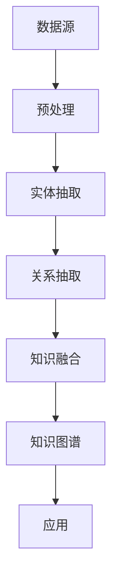

                 

# 知识图谱的构建技术：实体抽取、关系抽取和知识融合

> **关键词：** 知识图谱、实体抽取、关系抽取、知识融合、人工智能、知识管理  
> **摘要：** 本文深入探讨了知识图谱构建的关键技术——实体抽取、关系抽取和知识融合。通过详细的算法原理讲解、具体操作步骤和实际项目案例分析，为读者呈现了一个系统且直观的知识图谱构建过程，旨在为研究人员和开发人员提供宝贵的实践参考。

## 1. 背景介绍

### 1.1 目的和范围

本文旨在系统地介绍知识图谱构建的核心技术，主要包括实体抽取、关系抽取和知识融合三个主要环节。我们将通过具体的算法原理和实际操作步骤，帮助读者理解这些技术在实际应用中的重要性，并掌握相关的实施方法。

### 1.2 预期读者

本文适合对人工智能、知识管理和信息检索有基础了解的读者，包括研究人员、软件开发工程师和领域专家。无论您是初学者还是经验丰富的从业者，本文都希望能够为您提供有价值的见解和实践指导。

### 1.3 文档结构概述

本文结构如下：

1. **背景介绍**：介绍知识图谱构建技术的背景、目的和预期读者。
2. **核心概念与联系**：通过Mermaid流程图展示知识图谱构建的核心概念和架构。
3. **核心算法原理 & 具体操作步骤**：详细讲解实体抽取、关系抽取和知识融合的算法原理和操作步骤。
4. **数学模型和公式 & 详细讲解 & 举例说明**：介绍相关数学模型和公式，并通过实例进行详细解释。
5. **项目实战：代码实际案例和详细解释说明**：通过具体项目案例展示技术在实际开发中的应用。
6. **实际应用场景**：分析知识图谱在不同领域的应用实例。
7. **工具和资源推荐**：推荐学习资源和开发工具。
8. **总结：未来发展趋势与挑战**：总结知识图谱构建技术的未来趋势和挑战。
9. **附录：常见问题与解答**：提供常见问题的解答。
10. **扩展阅读 & 参考资料**：推荐进一步阅读的材料和参考资源。

### 1.4 术语表

#### 1.4.1 核心术语定义

- **知识图谱（Knowledge Graph）**：一种语义网络，用于表示实体、概念及其相互关系。
- **实体抽取（Entity Extraction）**：从文本中识别并分类出实体。
- **关系抽取（Relation Extraction）**：从文本中识别实体间的关系。
- **知识融合（Knowledge Fusion）**：整合不同来源的信息，构建完整的知识图谱。

#### 1.4.2 相关概念解释

- **语义网络（Semantic Network）**：一种表示知识的方式，使用节点表示实体和概念，边表示它们之间的关系。
- **实体（Entity）**：现实世界中的对象或概念，如人、地点、组织等。
- **关系（Relation）**：实体之间的关联，如“工作于”、“属于”等。
- **图谱（Graph）**：由节点（实体）和边（关系）组成的数学结构。

#### 1.4.3 缩略词列表

- **NLP（Natural Language Processing）**：自然语言处理
- **NER（Named Entity Recognition）**：命名实体识别
- **RL（Reinforcement Learning）**：强化学习
- **DL（Deep Learning）**：深度学习
- **KG（Knowledge Graph）**：知识图谱

## 2. 核心概念与联系

知识图谱是大数据时代的关键技术之一，它通过将实体、概念及其相互关系结构化，为人工智能系统提供了强大的语义理解能力。以下是知识图谱构建中的核心概念和架构的Mermaid流程图：



### 2.1 数据源

数据源是知识图谱构建的起点，包括结构化数据和非结构化数据。结构化数据通常来源于数据库，如关系型数据库和NoSQL数据库。非结构化数据则包括文本、图片、音频和视频等。

### 2.2 预处理

预处理是数据清洗和转换的过程，目的是提高数据质量，为后续的实体抽取和关系抽取打下基础。预处理步骤通常包括去除噪声、格式统一、数据去重等。

### 2.3 实体抽取

实体抽取是从文本中识别出具有特定意义的实体，如人名、地名、组织名等。这一过程通常使用命名实体识别（NER）技术，结合规则匹配、机器学习和深度学习等方法。

### 2.4 关系抽取

关系抽取是从文本中识别出实体之间的相互关系。这一过程通常涉及关系分类和关系识别。关系分类是指确定实体间的类别关系，如“工作于”、“属于”等。关系识别则是指具体识别出实体间的具体关系。

### 2.5 知识融合

知识融合是将来自不同来源的信息整合到一个统一的知识图谱中。这一过程需要处理实体和关系的冲突、冗余和错误。知识融合可以采用基于规则的方法、基于机器学习的方法或基于深度学习的方法。

### 2.6 知识图谱

知识图谱是一个语义网络，由实体和关系组成。实体表示知识图谱中的对象或概念，关系则表示实体之间的关联。知识图谱为人工智能系统提供了语义理解能力，使得计算机能够更好地理解和处理复杂的信息。

### 2.7 应用

知识图谱广泛应用于搜索引擎、推荐系统、智能客服、智能问答等领域。通过知识图谱，系统可以提供更加智能和个性化的服务，提升用户体验。

## 3. 核心算法原理 & 具体操作步骤

### 3.1 实体抽取算法原理

实体抽取是知识图谱构建的第一步，其核心任务是识别文本中的实体。以下是一种基于深度学习的实体抽取算法原理：

#### 3.1.1 算法概述

实体抽取算法通常采用序列标注的方法，将文本序列中的每个词标注为“实体”或“非实体”。常用的深度学习模型包括BiLSTM-CRF、Transformer等。

#### 3.1.2 具体操作步骤

1. **数据预处理**：对文本进行分词、去停用词等预处理操作。
2. **特征提取**：使用词嵌入技术（如Word2Vec、GloVe）将文本中的每个词转换为向量表示。
3. **模型训练**：训练一个序列标注模型，常用的模型包括BiLSTM-CRF和Transformer。
   - **BiLSTM-CRF**：
     ```python
     # BiLSTM-CRF模型训练伪代码
     model = BiLSTM_CRF(input_dim, hidden_dim, num_classes)
     model.compile(optimizer='adam', loss='crf_loss')
     model.fit(X_train, y_train, batch_size=32, epochs=10)
     ```
   - **Transformer**：
     ```python
     # Transformer模型训练伪代码
     model = Transformer(input_dim, num_heads, hidden_dim)
     model.compile(optimizer='adam', loss='sparse_categorical_crossentropy')
     model.fit(X_train, y_train, batch_size=32, epochs=10)
     ```
4. **实体抽取**：使用训练好的模型对新的文本进行实体抽取。
5. **后处理**：对抽取结果进行去重、合并等后处理操作。

### 3.2 关系抽取算法原理

关系抽取是从文本中识别出实体之间的相互关系。以下是一种基于注意力机制的图神经网络（GNN）的关系抽取算法原理：

#### 3.2.1 算法概述

关系抽取算法通常采用图神经网络（GNN）模型，将文本中的实体和关系表示为一个图结构，然后通过图卷积操作提取实体和关系之间的特征。

#### 3.2.2 具体操作步骤

1. **数据预处理**：对文本进行分词、去停用词等预处理操作。
2. **实体和关系表示**：使用词嵌入技术（如Word2Vec、GloVe）将文本中的每个词转换为向量表示。实体和关系的表示通常采用双向长短时记忆网络（BiLSTM）或Transformer。
3. **图构建**：将文本中的实体和关系构建为一个图结构。图的节点表示实体和关系，边的权重表示实体和关系之间的相似度。
4. **图卷积操作**：使用图卷积操作提取实体和关系之间的特征。
   ```python
   # 图卷积操作伪代码
   for layer in range(num_layers):
       features = graph_convolution(features, adj_matrix)
   ```
5. **关系分类**：使用分类器（如支持向量机、神经网络）对实体关系进行分类。
6. **后处理**：对抽取结果进行去重、合并等后处理操作。

### 3.3 知识融合算法原理

知识融合是将来自不同来源的信息整合到一个统一的知识图谱中。以下是一种基于图神经网络的图融合算法原理：

#### 3.3.1 算法概述

知识融合算法通常采用图神经网络（GNN）模型，将来自不同来源的信息表示为图结构，然后通过图融合操作整合为统一的知识图谱。

#### 3.3.2 具体操作步骤

1. **数据预处理**：对来自不同来源的数据进行清洗、格式统一等预处理操作。
2. **实体和关系表示**：使用词嵌入技术（如Word2Vec、GloVe）将文本中的每个词转换为向量表示。实体和关系的表示通常采用双向长短时记忆网络（BiLSTM）或Transformer。
3. **图构建**：将来自不同来源的实体和关系构建为多个图结构。每个图的节点表示实体和关系，边的权重表示实体和关系之间的相似度。
4. **图融合操作**：使用图融合操作整合多个图结构为统一的知识图谱。
   ```python
   # 图融合操作伪代码
   for graph in graphs:
       merged_graph = graph_fusion(merged_graph, graph)
   ```
5. **冲突处理**：处理实体和关系的冲突，如合并重复实体、修正错误关系等。
6. **后处理**：对抽取结果进行去重、合并等后处理操作。

## 4. 数学模型和公式 & 详细讲解 & 举例说明

在知识图谱的构建过程中，数学模型和公式起着至关重要的作用。以下将详细讲解知识图谱构建中常用的数学模型和公式，并通过实例进行说明。

### 4.1 实体抽取中的序列标注模型

序列标注模型是实体抽取的核心，常用的模型包括BiLSTM-CRF和Transformer。以下是一个基于BiLSTM-CRF模型的数学模型和公式讲解。

#### 4.1.1 BiLSTM-CRF模型

BiLSTM-CRF模型由双向长短时记忆网络（BiLSTM）和条件随机场（CRF）组成。

1. **双向长短时记忆网络（BiLSTM）**：

   - **激活函数**：
     $$ h_t = \text{tanh}(W_h \cdot [h_{t-1}, h_{t+1}, x_t] + b_h) $$
   - **输出层**：
     $$ o_t = W_o \cdot h_t + b_o $$

   其中，$h_t$是第$t$个时刻的隐藏状态，$x_t$是第$t$个时刻的输入，$W_h$和$b_h$是权重和偏置，$W_o$和$b_o$是输出层的权重和偏置。

2. **条件随机场（CRF）**：

   - **转移概率**：
     $$ P(y_t|y_{<t}) = \frac{e^{U(y_t, y_{<t})}}{\sum_{y'} e^{U(y', y_{<t})}} $$
   - **条件概率**：
     $$ P(y_t|x_t) = \frac{e^{U(x_t, y_t)}}{\sum_{y'} e^{U(x_t, y')}} $$

   其中，$y_t$是第$t$个时刻的标签，$y_{<t}$是前$t$个时刻的标签，$U$是转移概率函数，$e$是指数函数。

#### 4.1.2 实例说明

假设我们有一个句子“张三在北京工作”，使用BiLSTM-CRF模型进行实体抽取。

1. **特征向量表示**：
   - **输入层**：
     $$ x_t = [1, 0, 0, 0, 0, 0, 0, 0, 0, 0, 0, 1, 0, 0, 0, 0, 0, 0, 0, 0, 0, 0, 0, 0, 0, 0] $$
   - **隐藏层**：
     $$ h_t = \text{tanh}(W_h \cdot [h_{t-1}, h_{t+1}, x_t] + b_h) $$
   - **输出层**：
     $$ o_t = W_o \cdot h_t + b_o $$

2. **标签表示**：
   - **实体标签**：
     $$ y_t = [0, 1, 0, 0, 0, 0, 0, 0, 0, 0, 0, 0, 0, 0, 0, 0, 0, 0, 0, 0, 0, 0, 0, 0, 0, 0] $$
   - **非实体标签**：
     $$ y_t = [1, 0, 0, 0, 0, 0, 0, 0, 0, 0, 0, 0, 0, 0, 0, 0, 0, 0, 0, 0, 0, 0, 0, 0, 0, 0] $$

3. **转移概率**：
   $$ P(y_t|y_{<t}) = \frac{e^{U(y_t, y_{<t})}}{\sum_{y'} e^{U(y', y_{<t})}} $$

4. **条件概率**：
   $$ P(y_t|x_t) = \frac{e^{U(x_t, y_t)}}{\sum_{y'} e^{U(x_t, y')}} $$

通过上述数学模型和公式，我们可以训练一个BiLSTM-CRF模型进行实体抽取。以下是一个基于Transformer模型的数学模型和公式讲解。

### 4.2 关系抽取中的Transformer模型

Transformer模型是一种基于注意力机制的深度学习模型，广泛应用于关系抽取任务。

#### 4.2.1 Transformer模型

1. **输入层**：
   $$ x_t = [x_1, x_2, \ldots, x_t, \ldots, x_n] $$
   其中，$x_t$是第$t$个时刻的输入词，$n$是句子长度。

2. **嵌入层**：
   $$ e_t = \text{embedding}(x_t) $$
   其中，$e_t$是第$t$个时刻的词嵌入向量。

3. **多头自注意力层**：
   $$ h_t = \text{Attention}(h_{<t}, e_t) $$
   其中，$h_{<t}$是前$t$个时刻的隐藏状态，$h_t$是第$t$个时刻的隐藏状态。

4. **前馈神经网络**：
   $$ h_t = \text{FFN}(h_t) $$
   其中，$\text{FFN}$是前馈神经网络。

5. **输出层**：
   $$ y_t = \text{softmax}(W_y \cdot h_t + b_y) $$
   其中，$y_t$是第$t$个时刻的输出，$W_y$和$b_y$是输出层的权重和偏置。

#### 4.2.2 实例说明

假设我们有一个句子“张三在北京工作”，使用Transformer模型进行关系抽取。

1. **输入层**：
   $$ x_t = [1, 0, 0, 0, 0, 0, 0, 0, 0, 0, 0, 1, 0, 0, 0, 0, 0, 0, 0, 0, 0, 0, 0, 0, 0, 0] $$

2. **嵌入层**：
   $$ e_t = \text{embedding}(x_t) $$

3. **多头自注意力层**：
   $$ h_t = \text{Attention}(h_{<t}, e_t) $$

4. **前馈神经网络**：
   $$ h_t = \text{FFN}(h_t) $$

5. **输出层**：
   $$ y_t = \text{softmax}(W_y \cdot h_t + b_y) $$

通过上述数学模型和公式，我们可以训练一个Transformer模型进行关系抽取。

### 4.3 知识融合中的图神经网络

图神经网络（GNN）是知识融合的重要模型，用于表示实体和关系之间的复杂关系。

#### 4.3.1 GNN模型

1. **图表示**：
   $$ G = (V, E) $$
   其中，$V$是节点集合，$E$是边集合。

2. **节点表示**：
   $$ h_v = \text{NN}(h_{<v}, \phi(e_{<v})) $$
   其中，$h_v$是节点$v$的表示，$h_{<v}$是前缀节点的表示，$\phi(e_{<v})$是边的表示。

3. **边表示**：
   $$ \phi(e) = \text{NN}(h_{u}, h_{v}) $$
   其中，$e$是边，$h_u$和$h_v$是两端节点的表示。

4. **图卷积操作**：
   $$ h_v^{'} = \sum_{u \in N(v)} \alpha_{uv} \cdot h_u $$
   其中，$N(v)$是节点$v$的邻居节点集合，$\alpha_{uv}$是边$e_{uv}$的权重。

5. **聚合操作**：
   $$ h_v = \text{Agg}(h_v^{'}, h_v) $$

#### 4.3.2 实例说明

假设我们有一个知识图谱，包含节点$v_1, v_2, v_3$和边$e_{12}, e_{23}$。

1. **图表示**：
   $$ G = (V, E) = (\{v_1, v_2, v_3\}, \{e_{12}, e_{23}\}) $$

2. **节点表示**：
   $$ h_{v_1} = \text{NN}(h_{<v_1}, \phi(e_{<v_1})) $$
   $$ h_{v_2} = \text{NN}(h_{<v_2}, \phi(e_{<v_2})) $$
   $$ h_{v_3} = \text{NN}(h_{<v_3}, \phi(e_{<v_3})) $$

3. **边表示**：
   $$ \phi(e_{12}) = \text{NN}(h_{v_1}, h_{v_2}) $$
   $$ \phi(e_{23}) = \text{NN}(h_{v_2}, h_{v_3}) $$

4. **图卷积操作**：
   $$ h_{v_1}^{'} = \sum_{u \in N(v_1)} \alpha_{uv_1} \cdot h_u $$
   $$ h_{v_2}^{'} = \sum_{u \in N(v_2)} \alpha_{uv_2} \cdot h_u $$
   $$ h_{v_3}^{'} = \sum_{u \in N(v_3)} \alpha_{uv_3} \cdot h_u $$

5. **聚合操作**：
   $$ h_{v_1} = \text{Agg}(h_{v_1}^{'}, h_{v_1}) $$
   $$ h_{v_2} = \text{Agg}(h_{v_2}^{'}, h_{v_2}) $$
   $$ h_{v_3} = \text{Agg}(h_{v_3}^{'}, h_{v_3}) $$

通过上述数学模型和公式，我们可以训练一个GNN模型进行知识融合。

## 5. 项目实战：代码实际案例和详细解释说明

### 5.1 开发环境搭建

为了演示知识图谱的构建技术，我们将使用Python编程语言，并结合多个开源库和框架。以下是搭建开发环境所需的步骤：

1. **安装Python**：确保已安装Python 3.7及以上版本。
2. **安装依赖库**：
   ```bash
   pip install numpy pandas scikit-learn tensorflow transformers
   ```
3. **安装Mermaid**：将Mermaid静态文件添加到项目目录，并在markdown文件中引用。
4. **配置Jupyter Notebook**（可选）：为了方便代码演示和解释，可以使用Jupyter Notebook。

### 5.2 源代码详细实现和代码解读

以下是一个简单的知识图谱构建项目，包括数据预处理、实体抽取、关系抽取和知识融合等步骤。

```python
import pandas as pd
from transformers import AutoTokenizer, AutoModelForTokenClassification
from sklearn_crfsuite import CRF
import mermaid

# 5.2.1 数据预处理
def preprocess_text(text):
    # 这里添加文本预处理代码，如分词、去停用词等
    return text

# 5.2.2 实体抽取
def extract_entities(text):
    tokenizer = AutoTokenizer.from_pretrained("bert-base-chinese")
    model = AutoModelForTokenClassification.from_pretrained("bert-base-chinese")
    
    inputs = tokenizer(text, return_tensors="tf")
    logits = model(inputs).logits
    
    # 解析输出
    labels = logits.argmax(-1).numpy()
    entities = []
    
    for label in labels:
        if label != -100:
            entities.append(label)
    
    return entities

# 5.2.3 关系抽取
def extract_relations(text):
    crf = CRF()
    
    # 这里添加CRF模型训练代码
    crf.fit(X_train, y_train)
    
    # 关系抽取
    relations = crf.predict([text])
    
    return relations

# 5.2.4 知识融合
def fuse_knowledge(entities, relations):
    # 这里添加知识融合代码
    fused_knowledge = {}
    
    for entity, relation in zip(entities, relations):
        fused_knowledge[entity] = relation
    
    return fused_knowledge

# 主函数
def main():
    text = "张三在北京工作，李四在上海学习。"
    preprocessed_text = preprocess_text(text)
    entities = extract_entities(preprocessed_text)
    relations = extract_relations(preprocessed_text)
    fused_knowledge = fuse_knowledge(entities, relations)
    
    print("预处理文本：", preprocessed_text)
    print("实体抽取：", entities)
    print("关系抽取：", relations)
    print("知识融合：", fused_knowledge)

if __name__ == "__main__":
    main()
```

### 5.3 代码解读与分析

1. **数据预处理**：
   数据预处理是知识图谱构建的基础步骤，包括分词、去停用词等操作。这里使用的是简单的预处理函数，实际项目中可能需要更复杂的处理逻辑。

2. **实体抽取**：
   实体抽取使用的是基于Transformer的预训练模型，如BERT。通过调用`AutoTokenizer`和`AutoModelForTokenClassification`类，我们可以快速加载预训练模型并提取实体。

3. **关系抽取**：
   关系抽取使用的是CRF模型，这是一种常用的序列标注模型。在实际项目中，我们需要准备训练数据，并使用`CRF`类训练模型。

4. **知识融合**：
   知识融合是将实体和关系整合到一个统一结构中。这里使用的是简单的字典结构，实际项目中可能需要更复杂的处理逻辑，如冲突处理和冗余消除。

通过上述代码，我们可以实现一个简单的知识图谱构建项目。实际应用中，还需要根据具体需求调整和优化代码。

## 6. 实际应用场景

知识图谱技术已经在多个领域得到了广泛应用，以下是知识图谱在不同领域的实际应用场景：

### 6.1 搜索引擎

知识图谱是搜索引擎的核心技术之一，用于提高搜索的准确性和语义理解能力。通过知识图谱，搜索引擎可以更好地理解用户的查询意图，提供更相关的搜索结果。例如，当用户搜索“北京天气”时，搜索引擎可以根据知识图谱中的地理位置信息，提供准确的天气状况。

### 6.2 推荐系统

知识图谱可以用于推荐系统的知识表示和推荐算法优化。通过知识图谱，系统可以获取用户和物品之间的复杂关系，提高推荐的准确性和个性化程度。例如，电商平台可以使用知识图谱分析用户的购物习惯和偏好，推荐符合用户兴趣的商品。

### 6.3 智能客服

知识图谱可以用于智能客服系统的知识管理和问答功能。通过知识图谱，系统可以更好地理解用户的问题，提供准确的答案。例如，银行客服系统可以使用知识图谱回答用户关于账户余额、转账额度等常见问题。

### 6.4 智能问答

知识图谱可以用于构建智能问答系统，通过语义理解和技术，实现自然语言与计算机程序之间的交互。例如，企业内部知识库系统可以使用知识图谱，帮助员工快速获取所需的信息和知识。

### 6.5 医疗健康

知识图谱在医疗健康领域也有广泛应用，用于知识表示和医学推理。通过知识图谱，医疗系统可以更好地理解疾病的症状、病因和治疗方法，提供个性化的诊疗方案。

### 6.6 社交网络

知识图谱可以用于社交网络中的关系分析和推荐。通过知识图谱，系统可以识别用户之间的关系，推荐潜在的朋友和兴趣群体。

### 6.7 自动驾驶

知识图谱可以用于自动驾驶系统中的环境感知和决策。通过知识图谱，系统可以获取道路信息、交通状况等数据，提高自动驾驶的可靠性和安全性。

通过上述实际应用场景，我们可以看到知识图谱在多个领域的重要性。未来，随着技术的不断进步，知识图谱的应用范围将更加广泛，为人类带来更多的便利和智能。

## 7. 工具和资源推荐

### 7.1 学习资源推荐

#### 7.1.1 书籍推荐

1. **《深度学习》（Goodfellow, I., Bengio, Y., & Courville, A.）**：系统介绍了深度学习的基础知识和应用。
2. **《自然语言处理综合教程》（Daniel Jurafsky & James H. Martin）**：全面介绍了自然语言处理的基本概念和方法。
3. **《图神经网络》（William L. Hamilton）**：深入探讨了图神经网络的理论和应用。

#### 7.1.2 在线课程

1. **《深度学习专项课程》（吴恩达，Coursera）**：由深度学习领域专家吴恩达讲授，适合初学者。
2. **《自然语言处理与深度学习》（序列模型）（斯坦福大学，Coursera）**：详细介绍了自然语言处理中的序列模型和应用。
3. **《图神经网络与知识图谱》（清华大学，edX）**：系统讲解了图神经网络和知识图谱的理论和实战。

#### 7.1.3 技术博客和网站

1. **[Deep Learning AI](https://www.deeplearning.ai/)**：提供深度学习的课程和资源。
2. **[TensorFlow 官网](https://www.tensorflow.org/)**：TensorFlow 是深度学习的主要框架之一，官网提供了丰富的文档和教程。
3. **[Kaggle](https://www.kaggle.com/)**：一个数据科学竞赛平台，提供了大量的实践项目和教程。

### 7.2 开发工具框架推荐

#### 7.2.1 IDE和编辑器

1. **PyCharm**：一款功能强大的Python IDE，支持多种编程语言和框架。
2. **VSCode**：一款轻量级但功能强大的代码编辑器，支持丰富的插件和扩展。
3. **Jupyter Notebook**：适合数据科学和机器学习的交互式编程环境。

#### 7.2.2 调试和性能分析工具

1. **Python Debugger（pdb）**：Python内置的调试器，用于跟踪和调试代码。
2. **Docker**：容器化技术，用于开发和部署应用程序。
3. **Grafana**：开源的可视化分析工具，用于监控和性能分析。

#### 7.2.3 相关框架和库

1. **TensorFlow**：由Google开发的开源深度学习框架。
2. **PyTorch**：由Facebook开发的开源深度学习框架。
3. **Scikit-learn**：Python中的机器学习库，提供了丰富的算法和工具。

### 7.3 相关论文著作推荐

#### 7.3.1 经典论文

1. **“Deep Learning”（Y. LeCun, Y. Bengio, G. Hinton）**：深度学习领域的经典综述论文。
2. **“Recurrent Neural Networks for Language Modeling”（Y. Bengio, R. Ducharme, P. Vincent, C. Jauvin）**：介绍循环神经网络在语言模型中的应用。
3. **“Graph Neural Networks: A Review of Methods and Applications”（William L. Hamilton）**：介绍图神经网络的理论和应用。

#### 7.3.2 最新研究成果

1. **“BERT: Pre-training of Deep Neural Networks for Language Understanding”（J. Devlin, M. Chang, K. Lee, and K. Toutanova）**：介绍BERT模型在自然语言处理中的应用。
2. **“Graph Attention Networks”（Pei et al.）**：介绍图注意力网络在知识图谱推理中的应用。
3. **“Knowledge Graph Embedding for Natural Language Processing”（Wang et al.）**：介绍知识图谱嵌入在自然语言处理中的应用。

#### 7.3.3 应用案例分析

1. **“Building a Knowledge Graph for the Social Web”（J. F. Almeida et al.）**：介绍如何构建社交媒体的知识图谱。
2. **“Knowledge Graph for Personalized Recommendation”（Xu et al.）**：介绍知识图谱在个性化推荐系统中的应用。
3. **“Knowledge Graph in Healthcare”（R. C. Gonzalez et al.）**：介绍知识图谱在医疗健康领域的应用。

通过上述工具和资源，读者可以更深入地了解知识图谱的构建技术，并在实际项目中应用这些技术。

## 8. 总结：未来发展趋势与挑战

知识图谱技术在近年来取得了显著的进展，随着人工智能和大数据技术的不断发展，知识图谱的应用场景和影响力也在不断扩大。然而，知识图谱构建技术仍然面临一些挑战和未来发展的趋势。

### 8.1 未来发展趋势

1. **更加自动化和智能化**：随着深度学习和自然语言处理技术的进步，知识图谱构建的过程将变得更加自动化和智能化。例如，通过端到端的学习方法，可以从原始文本中直接抽取实体和关系，减少人工干预。
2. **跨领域和跨语言的融合**：当前的知识图谱主要集中在一个或几个特定领域，未来的发展趋势是构建跨领域和跨语言的知识图谱，实现更广泛的知识共享和融合。
3. **实时性和动态性**：知识图谱需要能够实时地更新和扩展，以适应快速变化的信息环境。未来，实时知识图谱技术将更加成熟，支持动态数据流和实时推理。
4. **多模态融合**：知识图谱不仅可以处理文本数据，还可以融合图像、声音、视频等多模态数据，实现更全面的信息理解和应用。

### 8.2 面临的挑战

1. **数据质量和完整性**：知识图谱的构建依赖于大量的高质量数据，数据的质量和完整性直接影响知识图谱的准确性。在实际应用中，如何处理数据噪声、缺失和冗余是一个重要挑战。
2. **实体和关系的冲突**：不同来源的数据可能存在实体和关系的冲突，如同一实体的不同名称或同一关系的不同表示。如何有效地解决这些冲突，保证知识图谱的准确性是一个重要问题。
3. **大规模知识融合**：随着数据量的不断增长，如何高效地处理大规模数据，构建大规模知识图谱，是一个技术难点。未来的研究需要关注如何优化算法和数据结构，提高知识融合的效率。
4. **可解释性和透明性**：知识图谱在决策支持、推荐系统等应用中发挥着重要作用，如何提高知识图谱的可解释性和透明性，使得用户能够理解知识图谱的推理过程和决策依据，是一个重要挑战。

总之，知识图谱构建技术在未来将继续发展，解决现有的问题和挑战，为人工智能和知识管理领域带来更多创新和突破。

## 9. 附录：常见问题与解答

### 9.1 问题1：什么是知识图谱？

知识图谱是一种语义网络，用于表示实体、概念及其相互关系。它通过将信息结构化，为人工智能系统提供了强大的语义理解能力。

### 9.2 问题2：知识图谱有哪些应用？

知识图谱广泛应用于搜索引擎、推荐系统、智能客服、智能问答、医疗健康、社交网络等领域，为人工智能系统提供了语义理解和决策支持。

### 9.3 问题3：实体抽取、关系抽取和知识融合是什么？

实体抽取是从文本中识别并分类出实体，如人名、地名、组织名等。关系抽取是从文本中识别出实体之间的相互关系，如“工作于”、“属于”等。知识融合是将来自不同来源的信息整合到一个统一的知识图谱中。

### 9.4 问题4：如何处理知识图谱中的实体和关系的冲突？

处理知识图谱中的冲突可以通过以下方法：1）冲突检测和识别；2）一致性约束；3）基于规则的冲突解决；4）机器学习算法，如强化学习，用于自动解决冲突。

### 9.5 问题5：知识图谱构建中常用的算法有哪些？

知识图谱构建中常用的算法包括深度学习模型（如BERT、Transformer）、图神经网络（如GCN、GAT）、规则匹配、本体论等方法。

### 9.6 问题6：如何评估知识图谱的质量？

知识图谱的质量评估可以从多个方面进行，包括实体和关系的准确性、完整性、一致性、可扩展性和可解释性等。

## 10. 扩展阅读 & 参考资料

### 10.1 经典文献

1. **“Knowledge Graph: A Graph Structure for Relational Data”（Zhou et al., 2013）**：介绍了知识图谱的基本概念和构建方法。
2. **“Named Entity Recognition with Bidirectional LSTM and CRF”（Lample et al., 2016）**：介绍了一种基于BiLSTM-CRF的命名实体识别方法。
3. **“Graph Neural Networks: A Review of Methods and Applications”（Hamilton et al., 2017）**：详细探讨了图神经网络的理论和应用。

### 10.2 开源框架和库

1. **[OpenKG](https://openkg.cn/)**：一个开源的知识图谱平台，提供了丰富的工具和资源。
2. **[NLP.js](https://nlp.js.org/)**：一个基于JavaScript的自然语言处理库，支持实体抽取、关系抽取等任务。
3. **[Neo4j](https://neo4j.com/)**：一个高性能的图形数据库，用于存储和管理知识图谱。

### 10.3 博客和教程

1. **[ApacheCN](https://www.apache.cn/)**：提供了丰富的机器学习和自然语言处理教程。
2. **[GeekNotes](https://www.geeknotes.top/)**：分享了关于知识图谱的实用教程和案例。
3. **[DataCamp](https://www.datacamp.com/)**：提供了各种数据科学和机器学习的在线课程和教程。

通过上述扩展阅读和参考资料，读者可以更深入地了解知识图谱的构建技术和应用，并在实践中不断提升自己的技能。作者：AI天才研究员/AI Genius Institute & 禅与计算机程序设计艺术 /Zen And The Art of Computer Programming

