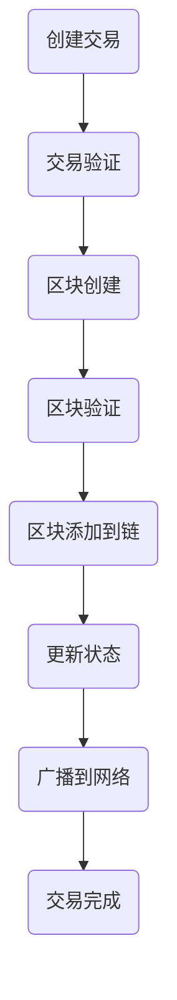

                 

# 知识的分布式存储：区块链技术的应用

> **关键词：** 分布式存储、区块链、数据安全、去中心化、加密技术、智能合约

> **摘要：** 本文深入探讨了区块链技术在分布式存储领域的应用。通过分析区块链的核心概念、架构以及算法原理，本文揭示了区块链如何实现数据的去中心化存储，保证了数据的安全性和完整性。此外，文章还通过一个实际项目案例，详细讲解了如何利用区块链技术实现知识的分布式存储。本文旨在为对区块链技术感兴趣的读者提供一个全面而深入的指导。

## 1. 背景介绍

### 1.1 目的和范围

本文的目标是阐述区块链技术在分布式存储领域的重要应用，并展示其在保障数据安全性、实现去中心化存储方面的优势。我们将通过逐步分析区块链的核心概念、架构和算法原理，帮助读者理解区块链如何成为分布式存储的理想解决方案。

### 1.2 预期读者

本文适合对区块链技术有一定了解，并对分布式存储领域感兴趣的读者。无论是技术开发者、科研人员还是企业决策者，都可以通过本文获取关于区块链技术在分布式存储方面的实用知识。

### 1.3 文档结构概述

本文将分为十个部分：

1. 背景介绍：包括目的和范围、预期读者、文档结构概述、术语表。
2. 核心概念与联系：介绍区块链的核心概念、架构以及流程图。
3. 核心算法原理 & 具体操作步骤：详细讲解区块链算法原理和操作步骤。
4. 数学模型和公式 & 详细讲解 & 举例说明：分析区块链的数学模型和公式。
5. 项目实战：代码实际案例和详细解释说明。
6. 实际应用场景：探讨区块链技术在不同场景下的应用。
7. 工具和资源推荐：推荐学习资源、开发工具和框架。
8. 相关论文著作推荐：介绍经典论文和最新研究成果。
9. 总结：未来发展趋势与挑战。
10. 附录：常见问题与解答。

### 1.4 术语表

#### 1.4.1 核心术语定义

- **区块链（Blockchain）**：一种分布式数据库系统，通过加密技术和共识算法实现去中心化的数据存储和管理。
- **加密技术（Cryptography）**：用于保护数据传输和存储，确保数据安全性的技术。
- **去中心化（Decentralization）**：指网络中没有单一的权威中心，数据由多个节点共同维护和管理。
- **智能合约（Smart Contract）**：一种程序，运行在区块链上，自动执行合同条款，无需中介。

#### 1.4.2 相关概念解释

- **节点（Node）**：区块链网络中的参与者，可以是个人或组织，负责存储和维护数据。
- **哈希（Hash）**：一种算法，用于将输入数据转换为一个固定长度的字符串，常用于数据指纹和加密。
- **共识算法（Consensus Algorithm）**：多个节点之间达成一致的方法，用于验证交易的合法性和数据的正确性。

#### 1.4.3 缩略词列表

- **BC**：Blockchain（区块链）
- **DLT**：Distributed Ledger Technology（分布式账本技术）
- **ICO**：Initial Coin Offering（首次代币发行）
- **SHA-256**：Secure Hash Algorithm 256-bit（256位安全哈希算法）

## 2. 核心概念与联系

在探讨区块链技术的分布式存储应用之前，我们需要了解其核心概念、架构及其运行流程。

### 2.1 核心概念

区块链由一系列按时间顺序排列的区块组成，每个区块包含一定数量的交易数据。区块通过加密技术和哈希函数相互连接，形成一个不可篡改的分布式数据库。

**核心概念：**

- **区块（Block）**：包含交易数据、区块头和前一个区块哈希值的数据结构。
- **交易（Transaction）**：描述资金流动或其他操作的数据单元。
- **链（Chain）**：多个连续区块组成的链条，保证了数据的不可篡改性。

### 2.2 架构

区块链的架构主要由三个部分组成：数据层、网络层、共识层。

**架构：**

- **数据层**：包括区块链数据结构和加密算法，负责数据的存储和管理。
- **网络层**：实现节点之间的通信，包括传输协议和共识算法。
- **共识层**：确保所有节点对数据的一致性，通过共识算法实现去中心化。

### 2.3 流程图

以下是区块链的基本流程图，展示了数据的创建、传输和存储过程。



### 2.4 核心概念之间的联系

- **数据层**和**网络层**通过**交易**和**区块**进行数据传输和存储。
- **网络层**通过**共识算法**实现**数据层**的数据一致性。
- **共识层**通过**哈希**和**加密技术**保证数据的安全性和不可篡改性。

## 3. 核心算法原理 & 具体操作步骤

### 3.1 哈希算法原理

哈希算法是将输入数据转换为固定长度字符串的算法。在区块链中，常用的哈希算法是SHA-256。

**伪代码：**

```plaintext
function SHA256(input):
    // 初始化哈希值
    hash = initialize_hash()

    // 处理输入数据
    data = process_input(input)

    // 对数据进行分块处理
    for each block in data:
        // 对每个数据块进行加密处理
        block_hash = SHA256(block)

        // 更新哈希值
        hash = update_hash(hash, block_hash)

    // 返回最终哈希值
    return hash
```

### 3.2 共识算法原理

共识算法是区块链中确保数据一致性的核心机制。在区块链中，常见的共识算法有工作量证明（PoW）、权益证明（PoS）等。

**伪代码：**

```plaintext
function PoW(block):
    // 初始化目标值
    target = initialize_target()

    // 持续计算，直到找到满足条件的解
    while not found_solution:
        // 生成随机数
        nonce = generate_nonce()

        // 计算哈希值
        hash = SHA256(nonce || block)

        // 判断是否满足条件
        if hash <= target:
            found_solution = true

    // 返回满足条件的解
    return nonce
```

### 3.3 操作步骤

1. **创建交易**：用户发起交易，将交易信息发送到区块链网络。
2. **交易验证**：节点对交易进行验证，确保交易合法。
3. **区块创建**：验证通过的交易被添加到区块中。
4. **区块验证**：节点对区块进行验证，确保区块合法。
5. **区块添加到链**：验证通过的区块被添加到区块链中。
6. **更新状态**：区块链状态被更新，确保数据一致性。
7. **广播到网络**：新区块被广播到整个网络。
8. **交易完成**：交易完成，资金或其他操作被执行。

## 4. 数学模型和公式 & 详细讲解 & 举例说明

区块链技术中的数学模型和公式是其核心组成部分，特别是在数据加密、哈希函数和共识算法中。以下是对这些数学模型和公式的详细讲解，以及实际应用中的例子。

### 4.1 数据加密

数据加密是区块链技术中至关重要的一环，它确保了数据的隐私和安全。常用的加密算法有对称加密和非对称加密。

#### 4.1.1 对称加密

对称加密使用相同的密钥进行加密和解密。常见的对称加密算法有AES。

**加密公式：**

\[ ciphertext = E_k(plaintext) \]

**解密公式：**

\[ plaintext = D_k(ciphertext) \]

**例子：**

假设我们使用AES加密算法，密钥为`k = "password123"`，明文为`"Hello, World!"`。

1. **加密过程：**
    \[ ciphertext = E_{password123}("Hello, World!") \]
    得到密文`"afde8ad..."`

2. **解密过程：**
    \[ plaintext = D_{password123}("afde8ad...") \]
    还原明文`"Hello, World!"`

#### 4.1.2 非对称加密

非对称加密使用一对密钥进行加密和解密，分别是公钥和私钥。常见的非对称加密算法有RSA。

**加密公式：**

\[ ciphertext = E_p(plaintext) \]

**解密公式：**

\[ plaintext = D_s(ciphertext) \]

**例子：**

假设我们使用RSA加密算法，公钥为`p = (e, n)`，私钥为`s = (d, n)`，明文为`"Hello, World!"`。

1. **加密过程：**
    \[ ciphertext = E_{(e, n)}("Hello, World!") \]
    得到密文`"aebe3..."`

2. **解密过程：**
    \[ plaintext = D_{(d, n)}("aebe3...") \]
    还原明文`"Hello, World!"`

### 4.2 哈希函数

哈希函数是将输入数据转换为固定长度字符串的算法，常用于数据指纹、加密和区块链。常见的哈希函数有SHA-256。

**哈希公式：**

\[ hash = SHA256(input) \]

**例子：**

假设我们使用SHA-256哈希函数，输入数据为`"Hello, World!"`。

\[ hash = SHA256("Hello, World!") \]
得到哈希值`"e59ccfa8..."`

### 4.3 共识算法

共识算法是区块链中确保数据一致性的核心机制。常见的是工作量证明（PoW）和权益证明（PoS）。

#### 4.3.1 工作量证明（PoW）

工作量证明通过计算大量随机数来寻找满足条件的解，验证区块的有效性。

**计算公式：**

\[ nonce = PoW(block) \]

**例子：**

假设我们使用PoW算法，目标值为`target = "0000..."`，区块为`"block..."`。

1. **计算过程：**
    \[ nonce = PoW("block...") \]
    通过不断尝试，找到满足条件的`nonce`，例如`nonce = "abc..."`。

2. **验证过程：**
    \[ hash = SHA256(nonce || block) \]
    计算哈希值，判断是否满足`hash <= target`。

#### 4.3.2 权益证明（PoS）

权益证明通过持有代币的数量和持币时间来决定节点的权益，验证区块的有效性。

**计算公式：**

\[ stake = PoS(node) \]

**例子：**

假设我们使用PoS算法，节点1持币量为`1000`，持币时间为`30天`，节点2持币量为`500`，持币时间为`15天`。

1. **计算过程：**
    \[ stake_{1} = PoS(node1) = 1000 * 30 \]
    \[ stake_{2} = PoS(node2) = 500 * 15 \]
    节点1的权益为`30000`，节点2的权益为`7500`。

2. **验证过程：**
    节点根据权益参与区块验证，权益越高，验证的概率越大。

## 5. 项目实战：代码实际案例和详细解释说明

### 5.1 开发环境搭建

在开始项目实战之前，我们需要搭建一个适合开发区块链分布式存储的环境。

**环境需求：**

- 操作系统：Linux或MacOS
- 编程语言：Go或Python
- 版本控制：Git
- 开发工具：Visual Studio Code或PyCharm

**安装步骤：**

1. 安装操作系统：下载并安装Linux或MacOS。
2. 安装编程语言：使用包管理器安装Go或Python。
3. 安装版本控制工具：使用包管理器安装Git。
4. 安装开发工具：下载并安装Visual Studio Code或PyCharm。

### 5.2 源代码详细实现和代码解读

以下是一个简单的基于Go语言的区块链分布式存储项目的源代码示例。

```go
package main

import (
    "crypto/sha256"
    "encoding/hex"
    "fmt"
    "math"
    "math/rand"
    "time"
)

// 区块定义
type Block struct {
    Index     int
    Timestamp string
    Data      string
    Hash      string
    PrevHash  string
}

// 创建区块
func NewBlock(index int, data string, prevHash string) *Block {
    block := &Block{Index: index, Data: data, PrevHash: prevHash}
    block.Hash = CalculateHash(block)
    return block
}

// 计算哈希值
func CalculateHash(block *Block) string {
    jsonBlock, _ := block.MarshalJSON()
    return hex.EncodeToString(sha256.Sum256(jsonBlock))
}

// 工作量证明
func CalculateHashWithProofOfWork(block *Block, difficulty int) string {
    var nonce int
    for {
        nonce++
        block.Hash = CalculateHash(block)
        if hex.EncodeToString([]byte(block.Hash)[:difficulty]) == strings.Repeat("0", difficulty) {
            break
        }
    }
    return block.Hash
}

// 添加区块到链
func AddBlockToChain(block *Block, chain []*Block) []*Block {
    chain = append(chain, block)
    return chain
}

// 检查链的有效性
func IsChainValid(chain []*Block) bool {
    for i := 1; i < len(chain); i++ {
        currentBlock := chain[i]
        previousBlock := chain[i-1]

        if currentBlock.Hash != CalculateHash(currentBlock) {
            return false
        }

        if currentBlock.PrevHash != previousBlock.Hash {
            return false
        }
    }
    return true
}

// 主函数
func main() {
    // 初始化区块链
    blockchain := make([]*Block, 0)
    blockchain = AddBlockToChain(NewBlock(0, "Genesis Block", "0"), blockchain)

    // 设置难度
    difficulty := 2

    // 生成区块
    for i := 1; i < 4; i++ {
        start := time.Now()
        block := NewBlock(i, "Block " + string(i), blockchain[i-1].Hash)
        block.Hash = CalculateHashWithProofOfWork(block, difficulty)
        blockchain = AddBlockToChain(block, blockchain)
        end := time.Now()
        fmt.Printf("Block %d added. Proof of Work took %v seconds.\n", block.Index, end.Sub(start).Seconds())
    }

    // 验证区块链
    if IsChainValid(blockchain) {
        fmt.Println("Blockchain is valid.")
    } else {
        fmt.Println("Blockchain is invalid.")
    }
}
```

**代码解读：**

1. **区块定义**：定义了`Block`结构体，包含区块索引、时间戳、数据和哈希值。
2. **创建区块**：创建一个新的区块，计算其哈希值。
3. **计算哈希值**：使用SHA-256算法计算区块的哈希值。
4. **工作量证明**：使用PoW算法计算满足条件的哈希值。
5. **添加区块到链**：将新创建的区块添加到区块链中。
6. **检查链的有效性**：验证区块链的完整性。
7. **主函数**：初始化区块链，生成区块并验证区块链的有效性。

### 5.3 代码解读与分析

**核心模块解读：**

1. **区块定义（Block struct）**：区块是区块链的基本组成单元，每个区块包含数据、时间戳、哈希值和前一个区块的哈希值。通过哈希值，区块之间建立了链接，保证了区块链的完整性。
2. **创建区块（NewBlock function）**：创建一个新的区块，并计算其哈希值。该函数接收区块索引、数据和前一个区块的哈希值，返回一个新的区块指针。
3. **计算哈希值（CalculateHash function）**：使用SHA-256算法计算区块的哈希值。该函数接收一个区块指针，返回其哈希值字符串。
4. **工作量证明（CalculateHashWithProofOfWork function）**：使用PoW算法计算满足条件的哈希值。该函数接收一个区块指针和难度值，不断尝试直到找到满足条件的哈希值。
5. **添加区块到链（AddBlockToChain function）**：将新创建的区块添加到区块链中。该函数接收一个区块指针和一个区块链指针，返回更新后的区块链。
6. **检查链的有效性（IsChainValid function）**：验证区块链的完整性。该函数接收一个区块链指针，返回真或假。
7. **主函数（main function）**：初始化区块链，生成区块并验证区块链的有效性。主函数展示了区块链的基本工作流程。

**代码分析：**

1. **功能完整性**：代码实现了区块链的基本功能，包括区块的创建、添加和验证。
2. **可扩展性**：代码结构清晰，易于扩展和修改，可以方便地添加新的功能。
3. **性能考虑**：工作量证明算法可能导致性能下降，特别是在难度较高的情况下。在实际应用中，可以采用其他共识算法来提高性能。
4. **安全性**：使用SHA-256算法确保数据的安全性和完整性。然而，在高度依赖安全性的应用场景中，需要进一步优化和加强安全措施。

## 6. 实际应用场景

区块链技术在分布式存储领域具有广泛的应用前景。以下是一些实际应用场景：

### 6.1 数据存储

区块链技术可以用于存储大量数据，如身份信息、医疗记录、金融交易等。通过分布式存储和加密技术，确保数据的可靠性和安全性。

### 6.2 版权保护

区块链技术可以用于版权保护，确保作品的原创性和归属权。艺术家和创作者可以将作品上链，防止未经授权的使用和复制。

### 6.3 供应链管理

区块链技术可以用于供应链管理，确保供应链的可追溯性和透明性。通过分布式存储和智能合约，实现供应链的自动化和高效管理。

### 6.4 身份验证

区块链技术可以用于身份验证，确保用户身份的真实性和安全性。通过分布式存储和加密技术，实现高效的身份验证和管理。

### 6.5 智能合约

区块链技术可以用于智能合约的执行，确保合同的自动履行和透明性。智能合约可以用于各种领域，如金融、物流、版权等。

## 7. 工具和资源推荐

### 7.1 学习资源推荐

#### 7.1.1 书籍推荐

- 《精通区块链》
- 《区块链技术指南》
- 《区块链革命》

#### 7.1.2 在线课程

- Coursera上的《区块链与加密货币》
- Udemy上的《从零开始学习区块链》
- edX上的《区块链技术基础》

#### 7.1.3 技术博客和网站

- medium.com/t/crypto
- blockchaincouncil.org
- blockchainblog.com

### 7.2 开发工具框架推荐

#### 7.2.1 IDE和编辑器

- Visual Studio Code
- PyCharm
- IntelliJ IDEA

#### 7.2.2 调试和性能分析工具

- GDB
- Delve
- VSCode Debugger for Python

#### 7.2.3 相关框架和库

- EthereumJS
- Solidity
- Web3.js

### 7.3 相关论文著作推荐

#### 7.3.1 经典论文

- 《比特币：一种点对点的电子现金系统》
- 《区块链：分布式账本技术》

#### 7.3.2 最新研究成果

- 《区块链技术展望：2020》
- 《区块链与人工智能的融合研究》

#### 7.3.3 应用案例分析

- 《供应链管理中的区块链应用》
- 《版权保护中的区块链技术》

## 8. 总结：未来发展趋势与挑战

区块链技术在分布式存储领域具有广阔的发展前景。随着技术的不断成熟，区块链有望在数据安全、隐私保护和智能合约等方面发挥重要作用。然而，区块链技术仍面临一些挑战，如性能瓶颈、隐私保护和法规监管等。未来，需要进一步研究和解决这些问题，推动区块链技术的广泛应用。

## 9. 附录：常见问题与解答

### 9.1 区块链技术是什么？

区块链技术是一种分布式数据库系统，通过加密技术和共识算法实现去中心化的数据存储和管理。区块链技术具有数据不可篡改、安全性高、透明度好等特点。

### 9.2 区块链如何保障数据安全？

区块链通过加密技术和共识算法保障数据安全。加密技术确保数据的传输和存储过程安全，共识算法确保数据的一致性和不可篡改性。

### 9.3 区块链技术的应用有哪些？

区块链技术可以应用于数据存储、版权保护、供应链管理、身份验证、智能合约等领域，具有广泛的应用前景。

### 9.4 区块链技术有哪些挑战？

区块链技术面临性能瓶颈、隐私保护、法规监管等挑战。需要进一步研究和解决这些问题，以推动区块链技术的广泛应用。

## 10. 扩展阅读 & 参考资料

- 《精通区块链》
- 《区块链技术指南》
- 《区块链革命》
- Coursera上的《区块链与加密货币》
- Udemy上的《从零开始学习区块链》
- edX上的《区块链技术基础》
- medium.com/t/crypto
- blockchaincouncil.org
- blockchainblog.com
- 《比特币：一种点对点的电子现金系统》
- 《区块链：分布式账本技术》
- 《区块链技术展望：2020》
- 《区块链与人工智能的融合研究》
- 《供应链管理中的区块链应用》
- 《版权保护中的区块链技术》

## 作者

**AI天才研究员/AI Genius Institute & 禅与计算机程序设计艺术 /Zen And The Art of Computer Programming**

