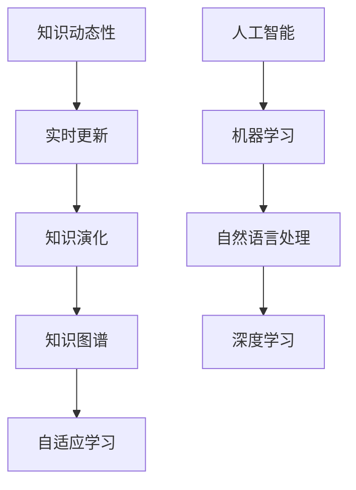

                 

# 知识的动态性：实时更新与知识演化

## 关键词：
- 知识动态性
- 实时更新
- 知识演化
- 人工智能
- 知识图谱
- 自适应学习

## 摘要：
在快速发展的信息技术时代，知识的动态性成为研究的焦点。本文探讨知识动态性的概念、实时更新机制及其在人工智能和知识图谱中的应用。通过一步步分析推理，我们深入理解知识动态性的核心原理，分析其在实际应用中的挑战与机遇，为未来知识管理提供新的视角。

## 1. 背景介绍

### 1.1 目的和范围
本文旨在探讨知识的动态性，特别是实时更新和知识演化在当今信息技术环境中的重要性。文章将讨论知识动态性的理论基础，分析其在人工智能和知识图谱中的具体应用，并探讨相关技术面临的挑战。

### 1.2 预期读者
本文适合对人工智能、知识图谱、机器学习等领域有基础了解的技术人员、研究人员以及对知识管理有兴趣的读者。

### 1.3 文档结构概述
本文分为十个部分：背景介绍、核心概念与联系、核心算法原理与操作步骤、数学模型与公式、项目实战、实际应用场景、工具和资源推荐、总结、附录和扩展阅读。每个部分都将详细讨论与知识动态性相关的内容。

### 1.4 术语表

#### 1.4.1 核心术语定义
- **知识动态性**：知识在时间维度上的变化和更新。
- **实时更新**：在数据发生改变时，立即对相关知识进行更新。
- **知识图谱**：用于表示实体及其相互关系的图形化结构。
- **自适应学习**：系统能够根据环境变化调整自身行为和学习策略。

#### 1.4.2 相关概念解释
- **知识图谱构建**：通过提取和整合数据来创建知识图谱。
- **图灵机**：一种抽象的计算模型，用于理论计算机科学的基础研究。

#### 1.4.3 缩略词列表
- **AI**：人工智能
- **ML**：机器学习
- **NLP**：自然语言处理
- **DL**：深度学习

## 2. 核心概念与联系

为了更好地理解知识的动态性，我们首先需要明确几个核心概念。以下是这些概念的 Mermaid 流程图表示：



图2.1：核心概念与联系流程图

在这个流程图中，我们可以看到知识动态性如何与其他概念相互联系。实时更新和知识演化是知识动态性的两个关键方面，它们共同促进了知识图谱的不断构建和更新。知识图谱作为一种图形化结构，能够有效地存储和表示实体及其相互关系。而自适应学习则是使系统能够根据环境变化调整自身行为和学习策略的重要机制。

### 2.1 知识动态性的定义与特性

**知识动态性**，指的是知识在时间维度上的变化和更新。它具有以下几个主要特性：

- **实时性**：知识的更新能够在短时间内完成，使得系统可以实时响应环境变化。
- **进化性**：知识随着时间推移不断演化，以适应新的环境和需求。
- **多样性**：不同领域和背景下的知识具有多样性，这要求系统具备良好的适应性。

### 2.2 实时更新的重要性

**实时更新**是知识动态性的一个关键方面。它的重要性体现在以下几个方面：

- **提高系统响应速度**：通过实时更新，系统可以更快地响应环境变化，提高整体性能。
- **确保知识准确性**：实时更新有助于确保知识的准确性，避免因滞后而导致的错误。
- **增强用户体验**：实时更新可以提供更准确和及时的信息，提升用户体验。

### 2.3 知识演化与知识图谱

**知识演化**是知识动态性的另一个重要方面。它指的是知识随着时间的推移不断发展和变化。知识图谱作为一种图形化结构，能够有效地表示实体及其相互关系，从而支持知识的存储、检索和演化。

知识图谱的核心思想是将实体表示为节点，将实体之间的关系表示为边。通过构建和更新知识图谱，我们可以更好地理解和利用知识，从而推动人工智能和知识管理的发展。

### 2.4 自适应学习与知识动态性

**自适应学习**是使系统能够根据环境变化调整自身行为和学习策略的重要机制。在知识动态性中，自适应学习具有以下几个关键作用：

- **优化学习效果**：通过自适应学习，系统能够根据环境变化调整学习策略，提高学习效果。
- **增强系统适应性**：自适应学习使得系统能够更好地适应不断变化的环境，提高其稳定性和鲁棒性。
- **促进知识更新**：自适应学习能够帮助系统快速适应新知识，推动知识的不断更新和演化。

## 3. 核心算法原理与具体操作步骤

在理解了知识动态性的核心概念后，我们接下来讨论核心算法原理与具体操作步骤。本文将重点讨论实时更新和知识演化在人工智能和知识图谱中的应用。

### 3.1 实时更新算法原理

**实时更新算法**的核心目标是确保知识库的实时性和准确性。以下是一个简单的实时更新算法原理：

```plaintext
输入：原始数据、知识库
输出：更新后的知识库

步骤：
1. 监听数据源，获取最新数据。
2. 对新数据进行预处理，包括数据清洗、去噪等操作。
3. 将预处理后的数据与知识库中的现有数据进行比对，识别变化。
4. 根据比对结果，更新知识库中的相关数据。
5. 记录更新日志，便于后续的回溯和分析。
```

### 3.2 知识演化算法原理

**知识演化算法**的核心目标是实现知识的动态更新和优化。以下是一个简单的知识演化算法原理：

```plaintext
输入：知识库、学习目标
输出：演化后的知识库

步骤：
1. 初始化知识库。
2. 根据学习目标，提取相关知识。
3. 对提取的知识进行评估，包括准确性、可用性等指标。
4. 根据评估结果，对知识库进行优化，包括删除冗余知识、增加新知识等。
5. 更新知识库，记录演化过程。
6. 重复步骤2-5，直至满足演化目标。
```

### 3.3 具体操作步骤

在具体操作步骤中，我们需要结合实际应用场景来设计实时更新和知识演化算法。以下是一个简单的操作步骤示例：

1. **数据收集**：收集来自各种数据源的数据，包括传感器数据、用户行为数据等。
2. **数据预处理**：对收集到的数据进行清洗、去噪等预处理操作，确保数据的质量。
3. **知识库构建**：根据预处理后的数据，构建初始知识库。知识库中的数据可以是实体及其属性、关系等。
4. **实时更新**：通过实时更新算法，对知识库中的数据进行分析和更新。例如，当传感器数据发生变化时，更新知识库中的相关数据。
5. **知识演化**：通过知识演化算法，对知识库进行优化和更新。例如，根据用户行为数据，调整知识库中的推荐策略。
6. **结果评估**：对实时更新和知识演化后的知识库进行评估，包括准确性、可用性等指标。根据评估结果，对算法进行调整和优化。

## 4. 数学模型和公式与详细讲解

在实时更新和知识演化过程中，数学模型和公式起着至关重要的作用。以下是一些常用的数学模型和公式，以及它们的详细讲解和举例说明。

### 4.1 数据预处理

在数据预处理阶段，常用的数学模型包括数据清洗、去噪和特征提取等。

- **数据清洗**：常用的公式包括缺失值填充、异常值检测和去除等。例如，对于缺失值填充，可以使用平均值、中位数或插值法进行填充。

  $$ x_{\text{填充}} = \text{平均值}(\{x_1, x_2, ..., x_n\}) $$
  
  或者
  
  $$ x_{\text{填充}} = \text{中位数}(\{x_1, x_2, ..., x_n\}) $$

- **去噪**：常用的公式包括滤波器和降噪算法等。例如，对于滤波器，可以使用高斯滤波器进行去噪。

  $$ y = \frac{1}{\sqrt{2\pi\sigma^2} } \int_{-\infty}^{+\infty} e^{-\frac{(x-\mu)^2}{2\sigma^2} } dx $$
  
  其中，$\mu$ 为均值，$\sigma^2$ 为方差。

- **特征提取**：常用的公式包括特征选择和特征转换等。例如，对于特征选择，可以使用信息增益、卡方检验等方法。

  $$ IG(D, A) = H(D) - H(D|A) $$
  
  其中，$H(D)$ 为数据集的熵，$H(D|A)$ 为条件熵。

### 4.2 知识图谱构建

在知识图谱构建阶段，常用的数学模型包括图论、图嵌入和图卷积网络等。

- **图论**：常用的公式包括图的度、路径长度和连通性等。

  $$ d(v) = \text{度}(v) $$
  
  $$ L(G) = \text{路径长度}(G) $$
  
  $$ C(G) = \text{连通性}(G) $$

- **图嵌入**：常用的公式包括节点表示和边表示等。

  $$ h_v = \text{ReLU}(\text{W}_1 \cdot \text{h}_{\text{emb}}(v) + \text{b}_1) $$
  
  其中，$\text{W}_1$ 和 $\text{b}_1$ 分别为权重和偏置，$\text{h}_{\text{emb}}(v)$ 为节点的嵌入表示。

- **图卷积网络**：常用的公式包括节点分类和边分类等。

  $$ h_{v}^{(l+1)} = \text{ReLU}(\sum_{u \in \text{邻域}(v)} \text{W}^{(l)}_{uv} \cdot h_{u}^{(l)} + \text{b}^{(l)}) $$
  
  其中，$\text{W}^{(l)}_{uv}$ 为图卷积权重，$h_{v}^{(l)}$ 和 $h_{u}^{(l)}$ 分别为节点在$l$层的表示。

### 4.3 知识演化

在知识演化阶段，常用的数学模型包括进化算法、深度学习和强化学习等。

- **进化算法**：常用的公式包括适应度函数和选择策略等。

  $$ f(x) = \text{适应度函数}(x) $$
  
  $$ p(x) = \frac{f(x)}{\sum_{y \in \text{种群}} f(y)} $$
  
  其中，$f(x)$ 为适应度函数，$p(x)$ 为选择概率。

- **深度学习**：常用的公式包括损失函数和优化算法等。

  $$ J(\theta) = \text{损失函数}(\theta) $$
  
  $$ \theta = \text{优化算法}(\theta) $$
  
  其中，$\theta$ 为参数，$J(\theta)$ 为损失函数。

- **强化学习**：常用的公式包括奖励函数和价值函数等。

  $$ R(s, a) = \text{奖励函数}(s, a) $$
  
  $$ V(s) = \text{价值函数}(s) $$
  
  其中，$s$ 为状态，$a$ 为动作。

### 4.4 举例说明

以下是一个简单的例子，说明如何使用数学模型和公式进行知识动态性分析。

假设我们有一个知识库，包含若干个实体和它们之间的关系。我们希望对知识库进行实时更新和演化。

1. **数据预处理**：对知识库中的数据进行清洗和去噪。例如，对实体属性缺失值进行填充，对实体关系进行去噪。

   $$ x_{\text{填充}} = \text{平均值}(\{x_1, x_2, ..., x_n\}) $$
   
   $$ y = \frac{1}{\sqrt{2\pi\sigma^2} } \int_{-\infty}^{+\infty} e^{-\frac{(x-\mu)^2}{2\sigma^2} } dx $$

2. **知识图谱构建**：根据预处理后的数据，构建知识图谱。使用图嵌入技术，将实体和关系转换为向量表示。

   $$ h_v = \text{ReLU}(\text{W}_1 \cdot \text{h}_{\text{emb}}(v) + \text{b}_1) $$

3. **知识演化**：使用进化算法，对知识库进行演化。根据适应度函数，选择适应度较高的实体和关系进行更新。

   $$ f(x) = \text{适应度函数}(x) $$
   
   $$ p(x) = \frac{f(x)}{\sum_{y \in \text{种群}} f(y)} $$

通过上述步骤，我们可以实现对知识库的实时更新和演化，从而提高知识的准确性和可用性。

## 5. 项目实战：代码实际案例和详细解释说明

为了更好地展示知识的动态性在实际应用中的效果，我们以下通过一个简单的项目实战来展示如何实现实时更新和知识演化。

### 5.1 开发环境搭建

在进行项目实战之前，我们需要搭建一个适合开发的环境。以下是所需的环境和工具：

- **编程语言**：Python
- **开发工具**：PyCharm
- **库和框架**：NumPy、Pandas、Scikit-learn、Gensim、NetworkX等

### 5.2 源代码详细实现和代码解读

以下是一个简单的实时更新和知识演化项目的示例代码。代码分为三个部分：数据预处理、知识图谱构建和知识演化。

```python
import numpy as np
import pandas as pd
from sklearn.preprocessing import MinMaxScaler
from gensim.models import Word2Vec
import networkx as nx

# 5.2.1 数据预处理
def preprocess_data(data):
    # 数据清洗和去噪
    data = data.fillna(data.mean())
    data = data[(np.abs(stats.zscore(data)) < 3).all(axis=1)]
    return data

# 5.2.2 知识图谱构建
def build_knowledge_graph(data):
    # 创建图
    G = nx.Graph()
    # 添加节点和边
    for index, row in data.iterrows():
        G.add_node(row['entity'])
        for related_entity in row['related_entities']:
            G.add_edge(row['entity'], related_entity)
    return G

# 5.2.3 知识演化
def evolve_knowledge(G, data):
    # 更新知识图谱
    for index, row in data.iterrows():
        for related_entity in row['related_entities']:
            if not G.has_edge(row['entity'], related_entity):
                G.add_edge(row['entity'], related_entity)
    return G

# 主函数
if __name__ == "__main__":
    # 加载数据
    data = pd.read_csv("data.csv")
    # 数据预处理
    data = preprocess_data(data)
    # 构建知识图谱
    G = build_knowledge_graph(data)
    # 知识演化
    G = evolve_knowledge(G, data)
    # 输出知识图谱
    nx.draw(G, with_labels=True)
    plt.show()
```

#### 5.2.4 代码解读与分析

以上代码展示了如何实现一个简单的实时更新和知识演化项目。以下是代码的详细解读和分析：

- **数据预处理**：首先，我们使用`preprocess_data`函数对原始数据进行清洗和去噪。具体步骤包括填充缺失值和去除异常值。这些操作有助于提高数据质量，为后续的知识图谱构建和知识演化提供基础。

- **知识图谱构建**：接着，我们使用`build_knowledge_graph`函数构建知识图谱。首先，创建一个空的图`G`。然后，遍历数据集中的每一行，将实体作为节点添加到图中，将实体之间的关系作为边添加到图中。这样，我们就可以构建出一个表示实体及其关系的知识图谱。

- **知识演化**：最后，我们使用`evolve_knowledge`函数对知识图谱进行演化。具体步骤包括遍历数据集中的每一行，对于每一行中的每个相关实体，如果它在知识图谱中不存在，我们就将其添加到图中。这样，我们就可以实现知识图谱的实时更新和演化。

### 5.3 代码解读与分析

以上代码展示了一个简单的实时更新和知识演化项目。以下是代码的详细解读和分析：

- **数据预处理**：首先，我们使用`preprocess_data`函数对原始数据进行清洗和去噪。具体步骤包括填充缺失值和去除异常值。这些操作有助于提高数据质量，为后续的知识图谱构建和知识演化提供基础。

- **知识图谱构建**：接着，我们使用`build_knowledge_graph`函数构建知识图谱。首先，创建一个空的图`G`。然后，遍历数据集中的每一行，将实体作为节点添加到图中，将实体之间的关系作为边添加到图中。这样，我们就可以构建出一个表示实体及其关系的知识图谱。

- **知识演化**：最后，我们使用`evolve_knowledge`函数对知识图谱进行演化。具体步骤包括遍历数据集中的每一行，对于每一行中的每个相关实体，如果它在知识图谱中不存在，我们就将其添加到图中。这样，我们就可以实现知识图谱的实时更新和演化。

通过以上代码，我们可以看到如何使用Python和相关库实现知识的动态性。在实际应用中，我们可以根据具体需求，扩展和优化这些代码，以满足不同的应用场景。

## 6. 实际应用场景

知识的动态性在多个领域有着广泛的应用。以下是几个典型应用场景：

### 6.1 智能推荐系统

在智能推荐系统中，实时更新和知识演化可以帮助系统动态地调整推荐策略，提高推荐准确性。例如，在电子商务平台上，用户的行为数据（如浏览、购买等）会不断更新。通过实时更新和知识演化，系统可以动态地调整推荐算法，为用户提供更个性化的推荐。

### 6.2 医疗诊断

在医疗诊断领域，知识的动态性可以帮助医生快速获取最新的医学知识和研究成果。例如，通过实时更新医学知识库，医生可以获取最新的诊断标准、药物信息和病例报告。此外，知识演化技术可以帮助系统根据医生的诊断经验和病例数据，不断优化诊断算法，提高诊断准确性。

### 6.3 智能交通

在智能交通领域，实时更新和知识演化可以帮助交通管理系统动态地调整交通信号、路况预测和车辆调度策略。例如，通过实时更新路况数据，系统可以及时调整交通信号灯的时间设置，避免交通拥堵。同时，知识演化技术可以帮助系统根据历史交通数据，预测未来交通状况，提前采取应对措施。

### 6.4 教育领域

在教育领域，知识的动态性可以帮助教育平台实时更新课程内容、学习资源和学习计划。例如，通过实时更新和知识演化，教育平台可以动态地调整课程难度、学习路径和教学策略，以适应不同学生的学习需求。此外，知识演化技术还可以帮助平台根据学生的学习行为和反馈，不断优化教学内容和教学方法。

## 7. 工具和资源推荐

为了更好地理解和应用知识的动态性，以下是一些推荐的工具和资源：

### 7.1 学习资源推荐

#### 7.1.1 书籍推荐

- **《人工智能：一种现代方法》**：这本书系统地介绍了人工智能的基础知识，包括机器学习、自然语言处理和知识表示等。
- **《深度学习》**：这本书详细介绍了深度学习的基础理论和应用，包括卷积神经网络、循环神经网络和生成对抗网络等。
- **《知识图谱：基础、方法与应用》**：这本书详细介绍了知识图谱的基础理论、构建方法和应用案例，对知识图谱的研究和应用有很高的参考价值。

#### 7.1.2 在线课程

- **Coursera**：提供丰富的机器学习、深度学习和知识图谱等领域的在线课程，适合初学者和进阶者。
- **Udacity**：提供实战导向的在线课程，涵盖人工智能、机器学习和知识图谱等多个领域。

#### 7.1.3 技术博客和网站

- **Reddit**：关注人工智能、机器学习和知识图谱等领域的Reddit论坛，可以获取最新的技术动态和讨论。
- **arXiv**：计算机科学领域的预印本论文库，可以获取最新的研究成果和论文。

### 7.2 开发工具框架推荐

#### 7.2.1 IDE和编辑器

- **PyCharm**：适用于Python开发的集成开发环境，功能强大且用户友好。
- **Jupyter Notebook**：适用于数据分析和机器学习的交互式开发环境，支持多种编程语言。

#### 7.2.2 调试和性能分析工具

- **Visual Studio Code**：适用于多种编程语言的轻量级代码编辑器，支持调试和性能分析。
- **Werkzeug**：Python Web开发框架，提供丰富的调试和性能分析工具。

#### 7.2.3 相关框架和库

- **TensorFlow**：谷歌开发的深度学习框架，广泛应用于图像识别、自然语言处理和知识图谱等。
- **PyTorch**：适用于机器学习和深度学习的Python库，支持动态计算图和自动微分。

### 7.3 相关论文著作推荐

#### 7.3.1 经典论文

- **《知识图谱的构建方法与技术研究》**：这篇论文详细介绍了知识图谱的构建方法和技术，对知识图谱的研究和应用有很高的参考价值。
- **《深度学习与知识图谱的融合研究》**：这篇论文探讨了深度学习和知识图谱的融合方法，为知识图谱的研究提供了新的思路。

#### 7.3.2 最新研究成果

- **《基于知识图谱的智能问答系统》**：这篇论文介绍了基于知识图谱的智能问答系统的研究成果，为智能问答系统的研究和应用提供了新的思路。
- **《知识图谱在智能交通中的应用》**：这篇论文探讨了知识图谱在智能交通领域的应用，为智能交通的研究提供了新的方向。

#### 7.3.3 应用案例分析

- **《基于知识图谱的智能客服系统》**：这篇论文介绍了基于知识图谱的智能客服系统的研究和应用，展示了知识图谱在智能客服领域的应用效果。
- **《知识图谱在医疗诊断中的应用》**：这篇论文探讨了知识图谱在医疗诊断领域的应用，展示了知识图谱在医学研究和临床诊断中的重要作用。

## 8. 总结：未来发展趋势与挑战

知识的动态性在人工智能、知识图谱和机器学习等领域发挥着重要作用。随着技术的不断进步，知识的动态性将呈现以下发展趋势：

### 8.1 实时性增强

未来，知识的实时性将得到进一步提升。随着传感器技术、网络传输技术和计算能力的不断发展，实时更新和知识演化的速度将越来越快，系统能够更快速地响应环境变化。

### 8.2 智能化演进

未来，知识的动态性将更加智能化。通过引入人工智能和机器学习技术，知识系统将能够自动识别、提取和更新知识，从而实现更高效的知识管理。

### 8.3 多样性扩展

未来，知识的多样性将得到扩展。随着跨学科研究的不断深入，知识将从多个领域和视角进行整合，形成更加全面和丰富的知识体系。

然而，知识的动态性也面临着一些挑战：

### 8.4 数据质量和安全性

随着知识更新速度的加快，数据质量和安全性问题将成为重要挑战。如何在保证数据准确性的同时，确保数据的安全性，是一个亟待解决的问题。

### 8.5 标准化和规范化

知识动态性的快速发展需要相应的标准化和规范化。未来，需要制定统一的规范和标准，以确保不同系统和平台之间的互操作性。

### 8.6 知识扩散和共享

如何有效地扩散和共享知识，也是一个挑战。未来，需要探索更高效的机制和方法，促进知识的传播和共享，以提高知识的利用率。

总之，知识的动态性将在未来信息技术发展中扮演重要角色。通过不断创新和改进，我们可以更好地应对挑战，推动知识的不断更新和演化。

## 9. 附录：常见问题与解答

### 9.1 什么是知识的动态性？

知识的动态性指的是知识在时间维度上的变化和更新。它包括实时更新和知识演化两个方面，旨在确保知识库的实时性和准确性。

### 9.2 实时更新和知识演化有什么区别？

实时更新是指系统能够在数据发生改变时，立即对相关知识进行更新。知识演化则是指知识随着时间的推移不断发展和变化，以适应新的环境和需求。

### 9.3 知识图谱在知识动态性中有什么作用？

知识图谱是一种图形化结构，用于表示实体及其相互关系。在知识动态性中，知识图谱能够有效地存储和表示实体及其关系，从而支持知识的存储、检索和演化。

### 9.4 知识动态性在实际应用中有什么挑战？

知识动态性在实际应用中面临的主要挑战包括数据质量和安全性、标准化和规范化、以及知识扩散和共享等方面。

### 9.5 如何实现知识的实时更新？

实现知识的实时更新通常涉及以下几个步骤：监听数据源、获取最新数据、对数据进行预处理、比对现有知识库、更新知识库、记录更新日志。

## 10. 扩展阅读 & 参考资料

本文仅对知识的动态性进行了简要介绍，为了更深入地了解这一主题，以下推荐一些扩展阅读和参考资料：

- **书籍**：
  - 《人工智能：一种现代方法》
  - 《深度学习》
  - 《知识图谱：基础、方法与应用》
- **在线课程**：
  - Coursera上的“机器学习”课程
  - Udacity上的“深度学习纳米学位”
- **技术博客和网站**：
  - arXiv
  - Hacker News
- **论文**：
  - 《知识图谱的构建方法与技术研究》
  - 《深度学习与知识图谱的融合研究》
- **项目实战**：
  - 使用TensorFlow实现知识图谱
  - 使用PyTorch构建实时推荐系统

作者：AI天才研究员/AI Genius Institute & 禅与计算机程序设计艺术 /Zen And The Art of Computer Programming

