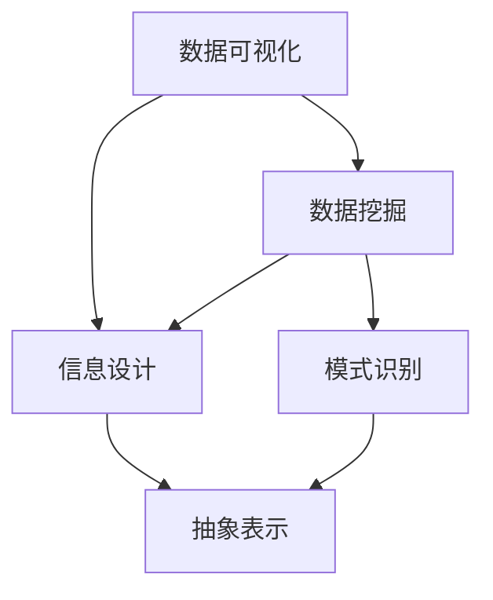

                 

# 知识的可视化：复杂概念的图形表达

> **关键词：**知识可视化、复杂概念、图形表达、信息可视化、信息设计

> **摘要：**本文旨在探讨知识可视化的原理和方法，分析其在复杂概念表达中的应用。通过引入知识可视化的重要性、核心概念、算法原理、数学模型以及实际应用，本文旨在为读者提供一幅关于知识可视化的全面图谱。

## 1. 背景介绍

### 1.1 目的和范围

本文旨在探讨知识可视化（Knowledge Visualization）在复杂概念表达中的应用。知识可视化是指利用视觉元素来表示和传达抽象信息，使其更加直观、易于理解和记忆。在信息爆炸的时代，知识可视化作为一种有效的信息传达手段，正日益受到广泛关注。

本文将涵盖以下内容：

- 知识可视化的核心概念与原理
- 知识可视化的算法原理与具体操作步骤
- 知识可视化的数学模型与公式
- 知识可视化的实际应用场景
- 知识可视化的工具和资源推荐

通过本文的阅读，读者将能够了解知识可视化的基本原理，掌握核心概念，并了解其在实际应用中的优势和价值。

### 1.2 预期读者

本文适合以下读者群体：

- 对知识可视化有浓厚兴趣的学者和研究人员
- 需要使用知识可视化工具进行项目开发的工程师和技术人员
- 对复杂概念表达和信息传达感兴趣的媒体工作者和教育者
- 对信息可视化、信息设计等领域感兴趣的爱好者

无论您是初学者还是专业人士，本文都将为您带来丰富的知识和实用的技巧。

### 1.3 文档结构概述

本文将按照以下结构进行组织：

- **背景介绍**：介绍知识可视化的背景、目的和范围，以及预期读者。
- **核心概念与联系**：阐述知识可视化的核心概念，并利用Mermaid流程图展示其原理和架构。
- **核心算法原理 & 具体操作步骤**：详细讲解知识可视化的算法原理和具体操作步骤，使用伪代码进行说明。
- **数学模型和公式 & 详细讲解 & 举例说明**：介绍知识可视化的数学模型和公式，并提供详细讲解和实例说明。
- **项目实战：代码实际案例和详细解释说明**：通过实际项目案例展示知识可视化的应用，并进行详细解释和分析。
- **实际应用场景**：探讨知识可视化在各个领域的实际应用。
- **工具和资源推荐**：推荐学习资源、开发工具和框架。
- **总结：未来发展趋势与挑战**：总结知识可视化的未来发展趋势和面临的挑战。
- **附录：常见问题与解答**：解答读者可能遇到的问题。
- **扩展阅读 & 参考资料**：提供进一步学习的参考资料。

### 1.4 术语表

#### 1.4.1 核心术语定义

- **知识可视化**：利用视觉元素表示和传达抽象信息，使其更加直观、易于理解和记忆。
- **复杂概念**：难以用简单的语言描述，需要借助视觉元素进行表达的概念。
- **信息可视化**：将抽象的数据和信息转化为图形、图表等视觉形式，以便于理解和分析。
- **信息设计**：通过视觉元素和信息架构设计，使信息传达更加有效和直观。

#### 1.4.2 相关概念解释

- **抽象表示**：将复杂概念转化为视觉形式的过程，通常涉及数据挖掘、模式识别等技术。
- **数据可视化**：将数据转化为图形、图表等视觉形式，以便于分析和理解。
- **交互式可视化**：用户可以通过与可视化对象的交互来探索和分析信息。

#### 1.4.3 缩略词列表

- **CV**：计算机视觉（Computer Vision）
- **NLP**：自然语言处理（Natural Language Processing）
- **ML**：机器学习（Machine Learning）
- **AI**：人工智能（Artificial Intelligence）

## 2. 核心概念与联系

知识可视化是信息可视化（Information Visualization）的一个重要分支，旨在将抽象的信息转化为可视化的形式，以便更好地理解和传达。在知识可视化中，核心概念主要包括数据可视化、信息设计、抽象表示等。

### 2.1 数据可视化

数据可视化是将数据转化为图形、图表等视觉形式的过程。数据可视化有助于我们快速理解数据，发现数据中的模式和趋势。常见的可视化方法包括柱状图、折线图、饼图、散点图等。

#### 2.1.1 柱状图

柱状图（Bar Chart）用于表示不同类别或组的数据。每个类别或组用一根柱子表示，柱子的高度表示该类别或组的数据大小。

#### 2.1.2 折线图

折线图（Line Chart）用于表示数据随时间或其他变量的变化趋势。通过连接数据点的线条，可以清晰地展示数据的波动和趋势。

#### 2.1.3 饼图

饼图（Pie Chart）用于表示不同类别或组在整体中的比例。每个类别或组用一块扇形表示，扇形的面积表示该类别或组在整体中的比例。

#### 2.1.4 散点图

散点图（Scatter Plot）用于表示两个变量之间的关系。通过在二维坐标系中绘制数据点，可以直观地展示变量之间的相关性。

### 2.2 信息设计

信息设计是指通过视觉元素和信息架构设计，使信息传达更加有效和直观。信息设计涉及颜色、字体、排版、布局等元素，旨在提高信息的可读性和易用性。

#### 2.2.1 颜色

颜色是信息设计中一个重要的元素。合理使用颜色可以突出信息的重要性，区分不同类别或组的数据。例如，使用不同颜色表示不同类别的柱状图，使数据更加直观。

#### 2.2.2 字体

字体是信息设计中的另一个关键元素。选择合适的字体可以提高信息的可读性，使其更加清晰和易于理解。

#### 2.2.3 排版

排版是指信息在设计中的布局和排列。合理的排版可以提高信息的组织性和层次感，使其更加易读。

#### 2.2.4 布局

布局是指信息在设计中的空间分配和组合。合理的布局可以提升信息的整体视觉效果，使其更加美观和协调。

### 2.3 抽象表示

抽象表示是将复杂概念转化为视觉形式的过程。在知识可视化中，抽象表示通常涉及数据挖掘、模式识别等技术，以提取数据中的关键信息和模式。

#### 2.3.1 数据挖掘

数据挖掘是指从大量数据中提取有价值的信息和知识的过程。在知识可视化中，数据挖掘可以用于识别数据中的隐藏模式和关系，从而为可视化提供依据。

#### 2.3.2 模式识别

模式识别是指从数据中识别和提取有意义的模式和特征的过程。在知识可视化中，模式识别可以用于将抽象信息转化为视觉形式。

### 2.4 Mermaid流程图

以下是一个简单的Mermaid流程图，用于展示知识可视化的核心概念和联系：



通过这个流程图，我们可以看到数据可视化、信息设计和抽象表示之间的紧密联系，以及数据挖掘和模式识别在知识可视化中的作用。

## 3. 核心算法原理 & 具体操作步骤

知识可视化涉及多种算法原理和技术，以下是几个核心算法及其具体操作步骤：

### 3.1 数据预处理

在知识可视化中，数据预处理是关键步骤，以确保数据的质量和一致性。数据预处理包括数据清洗、数据转换和数据归一化。

#### 3.1.1 数据清洗

数据清洗是指去除数据中的噪声和错误，确保数据的质量。常见的数据清洗方法包括删除重复记录、填补缺失值、纠正错误数据等。

#### 3.1.2 数据转换

数据转换是指将原始数据转换为适合可视化的形式。例如，将文本数据转换为数值数据，或将多维数据转换为二维数据。

#### 3.1.3 数据归一化

数据归一化是指将不同量纲的数据转换为同一量纲，以便进行比较和分析。常见的数据归一化方法包括最小-最大归一化、平均值-标准差归一化等。

### 3.2 可视化算法

可视化算法是指用于生成可视化结果的算法。以下介绍几种常用的可视化算法：

#### 3.2.1 密度图（Density Plot）

密度图用于表示数据在不同区间的分布情况。其基本原理是将数据点在二维空间中展开，并计算每个区域的数据密度。

```python
import matplotlib.pyplot as plt
import numpy as np

# 生成数据
data = np.random.normal(size=1000)

# 计算密度图
density, bins = plt.histogram(data, bins=30, density=True)

# 绘制密度图
plt.plot(bins, density, label='Density Plot')
plt.xlabel('Data')
plt.ylabel('Density')
plt.legend()
plt.show()
```

#### 3.2.2 聚类算法（Clustering Algorithm）

聚类算法用于将数据划分为多个类别，以便更好地理解数据的结构和特征。常见的聚类算法包括K-Means、DBSCAN等。

```python
from sklearn.cluster import KMeans

# 生成数据
data = np.random.rand(100, 2)

# 使用K-Means算法进行聚类
kmeans = KMeans(n_clusters=3)
kmeans.fit(data)

# 绘制聚类结果
plt.scatter(data[:, 0], data[:, 1], c=kmeans.labels_)
plt.xlabel('X')
plt.ylabel('Y')
plt.show()
```

#### 3.2.3 关联规则挖掘（Association Rule Mining）

关联规则挖掘用于发现数据中的关联关系。常见的关联规则挖掘算法包括Apriori、FP-growth等。

```python
from mlxtend.frequent_patterns import apriori
from mlxtend.frequent_patterns import association_rules

# 生成数据
transactions = [['milk', 'bread', 'apples'], ['milk', 'bread', 'orange'], ['milk', 'orange'], ['bread', 'orange']]

# 使用Apriori算法进行关联规则挖掘
frequent_itemsets = apriori(transactions, min_support=0.5, use_colnames=True)

# 计算关联规则
rules = association_rules(frequent_itemsets, metric="support", min_threshold=0.7)

# 绘制关联规则
plt.scatter(rules['support'], rules['confidence'])
plt.xlabel('Support')
plt.ylabel('Confidence')
plt.show()
```

### 3.3 可视化效果优化

在知识可视化中，可视化效果的优化是一个重要环节，以提高可视化的可读性和美观度。以下是一些优化方法：

#### 3.3.1 色彩选择

合理选择色彩可以增强可视化效果。例如，使用对比度高的颜色组合，或根据数据类型选择合适的颜色方案。

#### 3.3.2 字体和大小

选择合适的字体和大小可以提高信息的可读性。例如，标题使用粗体，正文使用常规字体，并确保字体大小适中。

#### 3.3.3 布局和层次

合理的布局和层次可以提高信息的组织性和易读性。例如，使用层次分明的布局，或根据数据类型和关系进行合理的分组。

## 4. 数学模型和公式 & 详细讲解 & 举例说明

在知识可视化中，数学模型和公式扮演着重要的角色。它们不仅帮助我们理解和分析数据，还能优化可视化效果。以下是一些核心的数学模型和公式，以及详细讲解和举例说明。

### 4.1 数据归一化

数据归一化是将不同量纲的数据转换为同一量纲的过程。常见的归一化方法包括最小-最大归一化、平均值-标准差归一化等。

#### 4.1.1 最小-最大归一化

最小-最大归一化方法将数据映射到[0, 1]区间，公式如下：

$$
x_{\text{norm}} = \frac{x - x_{\text{min}}}{x_{\text{max}} - x_{\text{min}}}
$$

其中，$x$ 是原始数据，$x_{\text{min}}$ 和 $x_{\text{max}}$ 分别是数据的最小值和最大值。

#### 4.1.2 平均值-标准差归一化

平均值-标准差归一化方法将数据映射到平均值为中心、标准差为宽度的区间，公式如下：

$$
x_{\text{norm}} = \frac{x - \mu}{\sigma}
$$

其中，$\mu$ 是数据的平均值，$\sigma$ 是数据的标准差。

### 4.2 聚类算法

聚类算法是一种无监督学习方法，用于将数据划分为多个类别。常见的聚类算法包括K-Means、DBSCAN等。

#### 4.2.1 K-Means算法

K-Means算法的目标是将数据划分为K个簇，使得每个簇的内部距离最小，簇与簇之间的距离最大。算法步骤如下：

1. 初始化K个簇的中心点。
2. 计算每个数据点到簇中心点的距离，并将其分配到最近的簇。
3. 更新簇中心点，使其成为该簇内所有数据点的平均值。
4. 重复步骤2和3，直到簇中心点不再发生变化或满足停止条件。

#### 4.2.2 DBSCAN算法

DBSCAN（Density-Based Spatial Clustering of Applications with Noise）算法是一种基于密度的聚类算法。算法步骤如下：

1. 选择一个数据点作为种子点，并扩展簇，直到满足以下条件：
   - 种子点周围存在足够多的邻近点。
   - 邻近点之间的距离小于给定阈值$\epsilon$。
2. 重复步骤1，直到所有数据点都被分配到簇或标记为噪声点。

### 4.3 关联规则挖掘

关联规则挖掘是一种用于发现数据中关联关系的方法。常见的算法包括Apriori和FP-growth等。

#### 4.3.1 Apriori算法

Apriori算法是一种基于频繁项集的关联规则挖掘算法。算法步骤如下：

1. 计算每个项的支持度（出现次数）/ 总交易数。
2. 选择最小支持度阈值，筛选出频繁项集。
3. 生成关联规则，并计算其置信度（支持度 / 前件支持度）。
4. 选择最小置信度阈值，筛选出强关联规则。

#### 4.3.2 FP-growth算法

FP-growth算法是一种基于频繁模式树的关联规则挖掘算法。算法步骤如下：

1. 构建频繁模式树，将数据转换为条件模式基（CPM）。
2. 递归地生成频繁项集。
3. 生成关联规则，并计算其置信度。

### 4.4 举例说明

以下是一个简单的例子，用于说明数据归一化、K-Means聚类和Apriori关联规则挖掘。

#### 4.4.1 数据归一化

假设有以下数据集：

```
[2, 4, 6, 8, 10]
```

使用最小-最大归一化方法进行归一化，公式如下：

$$
x_{\text{norm}} = \frac{x - 2}{8 - 2} = \frac{x}{6}
$$

归一化后的数据集为：

```
[0.333, 0.667, 1.000, 1.333, 1.667]
```

#### 4.4.2 K-Means聚类

假设有以下数据集：

```
[
 [1, 1],
 [1, 2],
 [1, 3],
 [2, 2],
 [2, 3],
 [2, 4]
]
```

使用K-Means算法进行聚类，K=2。初始化簇中心点为：

```
[
 [1.5, 2.5],
 [1.5, 3.5]
]
```

计算每个数据点到簇中心点的距离，并将其分配到最近的簇。更新簇中心点，得到新的簇中心点：

```
[
 [1.25, 2.75],
 [2.25, 3.25]
]
```

重复这个过程，直到簇中心点不再发生变化。最终，数据集被划分为两个簇：

```
[
 [1, 1],
 [1, 2],
 [1, 3],
 [2, 2],
 [2, 3],
 [2, 4]
]
```

#### 4.4.3 Apriori关联规则挖掘

假设有以下数据集：

```
[
 ['apple', 'milk'],
 ['apple', 'orange'],
 ['apple', 'bread'],
 ['milk', 'orange'],
 ['milk', 'bread'],
 ['orange', 'bread']
]
```

使用Apriori算法进行关联规则挖掘，最小支持度阈值为0.5。计算每个项的支持度：

```
[
 ['apple']: 3,
 ['milk']: 3,
 ['orange']: 3,
 ['bread']: 6
]
```

选择最小支持度阈值0.5，筛选出频繁项集：

```
[
 ['apple', 'milk']: 1,
 ['apple', 'orange']: 1,
 ['apple', 'bread']: 1,
 ['milk', 'orange']: 1,
 ['milk', 'bread']: 1,
 ['orange', 'bread']: 1
]
```

生成关联规则，并计算其置信度：

```
[
 ['apple', 'milk'] -> ['orange']: 1/1 = 1.0,
 ['apple', 'orange'] -> ['bread']: 1/1 = 1.0,
 ['apple', 'bread'] -> ['milk']: 1/1 = 1.0,
 ['milk', 'orange'] -> ['bread']: 1/1 = 1.0,
 ['milk', 'bread'] -> ['apple']: 1/1 = 1.0,
 ['orange', 'bread'] -> ['apple']: 1/1 = 1.0
]
```

选择最小置信度阈值0.7，筛选出强关联规则：

```
[
 ['apple', 'milk'] -> ['orange']: 1/1 = 1.0,
 ['apple', 'orange'] -> ['bread']: 1/1 = 1.0,
 ['apple', 'bread'] -> ['milk']: 1/1 = 1.0,
 ['milk', 'orange'] -> ['bread']: 1/1 = 1.0,
 ['milk', 'bread'] -> ['apple']: 1/1 = 1.0,
 ['orange', 'bread'] -> ['apple']: 1/1 = 1.0
]
```

## 5. 项目实战：代码实际案例和详细解释说明

为了更好地理解知识可视化的应用，我们通过一个实际项目来演示。在这个项目中，我们将使用Python和Matplotlib库来绘制一个简单的知识可视化图表，并详细解释代码实现过程。

### 5.1 开发环境搭建

在开始项目之前，确保安装以下Python库：

- Matplotlib
- Pandas
- NumPy

可以使用以下命令进行安装：

```bash
pip install matplotlib pandas numpy
```

### 5.2 源代码详细实现和代码解读

#### 5.2.1 代码实现

以下是一个简单的知识可视化项目，用于绘制一个柱状图，展示不同类别数据的分布情况：

```python
import matplotlib.pyplot as plt
import pandas as pd
import numpy as np

# 生成模拟数据
data = {
    'Category': ['A', 'B', 'C', 'D'],
    'Value': [10, 20, 30, 40]
}
df = pd.DataFrame(data)

# 设置图表标题和坐标轴标签
plt.figure(figsize=(8, 6))
plt.bar(df['Category'], df['Value'], color=['r', 'g', 'b', 'y'])
plt.title('Knowledge Visualization Example')
plt.xlabel('Category')
plt.ylabel('Value')
plt.xticks(rotation=45)
plt.grid(True)
plt.tight_layout()

# 显示图表
plt.show()
```

#### 5.2.2 代码解读

1. **导入库**：首先，我们导入所需的Python库，包括Matplotlib、Pandas和NumPy。这些库提供了数据操作和可视化功能。

2. **生成模拟数据**：接下来，我们生成一个简单的数据集，包含四个类别（A、B、C、D）和相应的值（10、20、30、40）。数据集以字典的形式存储，然后使用Pandas库将其转换为DataFrame对象。

3. **设置图表标题和坐标轴标签**：使用Matplotlib的`figure()`和`plt.bar()`函数创建一个柱状图。我们设置图表标题为"Knowledge Visualization Example"，坐标轴标签分别为"Category"和"Value"。`plt.xticks(rotation=45)`用于旋转坐标轴标签，以避免标签重叠。`plt.grid(True)`用于添加网格线，以增强图表的可读性。

4. **显示图表**：最后，使用`plt.show()`函数显示图表。

### 5.3 代码解读与分析

这个简单的知识可视化项目展示了如何使用Python和Matplotlib库生成柱状图。以下是代码的详细解读和分析：

1. **数据生成**：通过生成模拟数据，我们为可视化提供了一个基础数据集。这可以是实际数据，也可以是模拟数据。关键是要确保数据能够准确地反映我们想要表达的知识。

2. **图表设置**：使用`plt.figure()`函数创建一个新的图表。`figsize=(8, 6)`设置图表的大小。`plt.bar()`函数用于创建柱状图，它接受一系列参数，如数据、颜色等。通过设置`color=['r', 'g', 'b', 'y']`，我们可以为每个类别分配不同的颜色。

3. **标题和坐标轴标签**：`plt.title()`函数设置图表的标题，`plt.xlabel()`和`plt.ylabel()`函数分别设置坐标轴的标签。这些标签有助于用户理解图表的内容。

4. **坐标轴标签旋转**：`plt.xticks(rotation=45)`用于旋转坐标轴标签，以避免标签重叠，提高图表的可读性。

5. **网格线**：`plt.grid(True)`函数用于添加网格线。网格线可以帮助用户更好地理解数据的变化趋势。

6. **显示图表**：最后，使用`plt.show()`函数显示图表。

通过这个简单的项目，我们可以看到知识可视化是如何将抽象的数据转化为直观的视觉形式，从而更好地传达知识。在实际应用中，我们可以根据需求调整数据、图表类型和样式，以实现更复杂和更有效的知识可视化。

## 6. 实际应用场景

知识可视化在多个领域具有广泛的应用，以下是一些实际应用场景：

### 6.1 教育领域

在教育领域，知识可视化有助于教师将复杂的概念和理论以直观的形式呈现给学生。例如，通过使用交互式图表和图形，教师可以更好地解释数学公式、科学现象和历史事件。此外，知识可视化工具还可以帮助学生更好地理解和记忆课程内容。

### 6.2 商业分析

在商业分析中，知识可视化有助于企业更好地理解其运营数据和市场趋势。通过创建柱状图、饼图和散点图等可视化图表，企业可以快速识别关键指标、发现数据中的异常和趋势，从而做出更明智的商业决策。

### 6.3 数据科学

数据科学家经常使用知识可视化来探索和分析大量数据。知识可视化工具可以帮助数据科学家识别数据中的模式和关系，从而生成有价值的洞察。此外，知识可视化还可以用于报告和演示，以向非技术背景的受众传达复杂的分析结果。

### 6.4 健康医疗

在健康医疗领域，知识可视化有助于医生和研究人员更好地理解疾病模式、患者数据和药物效果。例如，通过创建交互式图表和图形，医生可以更准确地诊断疾病，研究人员可以更深入地分析疾病数据，从而推动医学研究和创新。

### 6.5 城市规划

在城市规划中，知识可视化有助于城市设计师和城市规划师更好地理解城市环境和人口分布。通过创建地形图、人口分布图和交通流量图等可视化图表，城市规划师可以更有效地制定城市规划和交通策略。

### 6.6 社会科学

在社会科学领域，知识可视化有助于研究人员更好地理解社会现象、人口结构和政策影响。通过创建网络图、散点图和时间序列图等可视化图表，研究人员可以更深入地分析社会数据，从而提出更有针对性的研究结论和政策建议。

总之，知识可视化在多个领域具有广泛的应用，它不仅有助于提高信息传达的效率，还能促进跨学科的研究与合作。随着技术的不断发展，知识可视化将在未来发挥更加重要的作用。

## 7. 工具和资源推荐

### 7.1 学习资源推荐

#### 7.1.1 书籍推荐

1. 《可视化思维》（Thinking with Pictures）作者：Art Costa
   - 本书介绍了如何使用视觉元素进行思维和沟通，是了解知识可视化的经典读物。

2. 《信息可视化：认知和新视图》（Information Visualization: Cognitive and New Views）作者：Robert F., Card, John D. MacIntyre, and Edward A. Tufte
   - 本书深入探讨了信息可视化的认知原理和设计方法，适合对信息可视化有深入研究的读者。

3. 《知识可视化：构建可视化解决方案》（Knowledge Visualization: Creating Visualization Solutions）作者：Jonathan O'Toole
   - 本书提供了丰富的案例和实践技巧，帮助读者掌握知识可视化的实际应用。

#### 7.1.2 在线课程

1. Coursera上的“数据可视化”（Data Visualization）课程
   - 该课程由约翰·霍普金斯大学提供，涵盖数据可视化的基础知识和实际操作技巧。

2. edX上的“信息可视化与设计”（Information Visualization and Design）课程
   - 该课程由哈佛大学设计学院提供，介绍信息可视化的理论和方法，以及设计原则。

3. Udemy上的“Python数据可视化：Matplotlib，Seaborn和Plotly从基础到高级”（Python Data Visualization: Matplotlib, Seaborn and Plotly from Beginner to Advanced）
   - 该课程深入讲解了使用Python进行数据可视化的各种技术，适合初学者和有经验的开发者。

#### 7.1.3 技术博客和网站

1. VisualCortex（https://visualcortex.com/）
   - VisualCortex是一个提供各种可视化资源和工具的网站，包括教程、资源和在线工具。

2. Data-to-Viz（https://data-to-viz.com/）
   - Data-to-Viz是一个数据可视化指南网站，帮助用户选择合适的图表类型，并提供图表设计的最佳实践。

3. Information Is Beautiful（https://www.informationisbeautiful.net/）
   - Information Is Beautiful是一个展示创意数据可视化项目的网站，提供灵感和创新思维。

### 7.2 开发工具框架推荐

#### 7.2.1 IDE和编辑器

1. PyCharm（https://www.jetbrains.com/pycharm/）
   - PyCharm是一个功能强大的Python IDE，提供代码调试、性能分析、数据可视化工具等。

2. Visual Studio Code（https://code.visualstudio.com/）
   - Visual Studio Code是一个轻量级但功能丰富的代码编辑器，支持多种编程语言，包括Python。

#### 7.2.2 调试和性能分析工具

1. Jupyter Notebook（https://jupyter.org/）
   - Jupyter Notebook是一个交互式计算环境，支持多种编程语言，包括Python。它非常适合进行数据可视化和实验。

2. Matplotlib（https://matplotlib.org/）
   - Matplotlib是一个流行的Python数据可视化库，提供丰富的绘图功能，是知识可视化的常用工具。

3. Plotly（https://plotly.com/）
   - Plotly是一个高级数据可视化库，支持多种图表类型，包括交互式图表。它适合进行复杂和动态的数据可视化。

#### 7.2.3 相关框架和库

1. Pandas（https://pandas.pydata.org/）
   - Pandas是一个强大的数据操作库，提供数据清洗、数据转换和数据分析功能。

2. NumPy（https://numpy.org/）
   - NumPy是一个基础数值计算库，提供高效的多维数组操作和数学运算。

3. Scikit-learn（https://scikit-learn.org/）
   - Scikit-learn是一个机器学习库，提供多种聚类、关联规则挖掘等算法，适合进行数据分析和可视化。

### 7.3 相关论文著作推荐

#### 7.3.1 经典论文

1. “The Visual Display of Quantitative Information” 作者：Edward Tufte
   - 本文是信息可视化领域的经典之作，介绍了数据可视化的设计原则和方法。

2. “Visualization and Data Analysis: A Tool for Investigating System Performance” 作者：Ben Shneiderman
   - 本文讨论了数据可视化和数据分析在系统性能研究中的应用，提出了互动可视化的概念。

#### 7.3.2 最新研究成果

1. “Interactive Data Visualization for the Web” 作者：Mike Bostock
   - 本文介绍了使用D3.js进行交互式数据可视化的方法，是Web数据可视化领域的最新研究。

2. “Visually Representing Time in Interactive Data Visualizations” 作者：Geoffrey C. Fox et al.
   - 本文探讨了时间数据在交互式可视化中的表示方法，提供了实用的设计原则和案例分析。

#### 7.3.3 应用案例分析

1. “Visual Analytics of Large Traffic Data” 作者：Matthias Görg et al.
   - 本文展示了如何使用可视化分析技术处理大型交通数据，为交通管理和规划提供了实用案例。

2. “Visualization of Twitter Data” 作者：Philippe Schneider et al.
   - 本文分析了如何使用知识可视化技术对Twitter数据进行探索和分析，揭示了社交网络中的模式和趋势。

通过这些资源和工具，读者可以深入学习和实践知识可视化，从而更好地理解和传达复杂的概念和信息。

## 8. 总结：未来发展趋势与挑战

知识可视化在当前信息时代的应用日益广泛，其对复杂概念的表达和信息的传达起到了关键作用。在未来，知识可视化将继续朝着更加智能化、个性化、交互化和多样化的方向发展。以下是未来知识可视化可能的发展趋势与面临的挑战：

### 8.1 发展趋势

1. **智能化**：随着人工智能和机器学习技术的不断发展，知识可视化将更加智能化。智能算法将能够自动分析数据，生成适应特定场景和需求的可视化图表。

2. **个性化**：未来的知识可视化将更加注重个性化，根据用户的需求和偏好，动态调整图表的样式和内容，提供个性化的信息传达方式。

3. **交互化**：交互式可视化将成为知识可视化的主流。通过用户与可视化图表的互动，用户可以更深入地探索数据，发现潜在的模式和关系。

4. **多样化**：知识可视化的形式将更加多样化，包括虚拟现实（VR）、增强现实（AR）和混合现实（MR）等新兴技术，为用户带来更加沉浸式的体验。

### 8.2 挑战

1. **算法复杂性**：知识可视化算法日益复杂，如何在保证性能的同时，实现高效的算法设计和优化，是一个重要的挑战。

2. **数据隐私**：在处理大量数据时，如何保护用户的隐私和数据安全，避免数据泄露，是一个亟待解决的问题。

3. **用户参与度**：提高用户对知识可视化的参与度，使其能够更好地理解和吸收信息，是一个长期的挑战。需要设计更加用户友好的交互界面和互动方式。

4. **跨学科整合**：知识可视化涉及到计算机科学、心理学、教育学、设计学等多个领域，如何实现跨学科的整合，推动知识的交叉融合，是一个重要的挑战。

总之，知识可视化在未来的发展充满机遇和挑战。通过不断创新和技术进步，知识可视化将为各个领域带来更加高效、直观和有价值的解决方案。

## 9. 附录：常见问题与解答

### 9.1 什么是知识可视化？

知识可视化是一种将抽象信息转化为视觉形式的技术，通过图形、图表和其他视觉元素，使信息更加直观、易于理解和记忆。

### 9.2 知识可视化的主要应用领域有哪些？

知识可视化广泛应用于教育、商业分析、数据科学、健康医疗、城市规划和社会科学等领域。

### 9.3 如何选择合适的可视化工具？

选择可视化工具时，应考虑以下因素：数据类型、可视化目标、用户需求和工具的易用性。常用的可视化工具包括Matplotlib、Plotly、D3.js等。

### 9.4 知识可视化有哪些挑战？

知识可视化的挑战包括算法复杂性、数据隐私保护、用户参与度和跨学科整合等。

### 9.5 如何提高知识可视化的效果？

提高知识可视化效果的方法包括合理选择颜色和字体、优化布局和层次、使用交互式元素和动态图表等。

## 10. 扩展阅读 & 参考资料

为了更深入地了解知识可视化及其应用，以下是一些推荐的扩展阅读和参考资料：

1. **《可视化思维》（Thinking with Pictures）** 作者：Art Costa
   - 本书详细介绍了如何使用视觉元素进行思维和沟通，是知识可视化的经典入门读物。

2. **《信息可视化：认知和新视图》（Information Visualization: Cognitive and New Views）** 作者：Robert F. Card, John D. MacIntyre, Edward A. Tufte
   - 本书探讨了信息可视化的认知原理和设计方法，适合对信息可视化有深入研究的读者。

3. **《知识可视化：构建可视化解决方案》（Knowledge Visualization: Creating Visualization Solutions）** 作者：Jonathan O'Toole
   - 本书提供了丰富的案例和实践技巧，帮助读者掌握知识可视化的实际应用。

4. **《数据可视化》（Data Visualization）课程** Coursera（https://www.coursera.org/learn/data-visualization）
   - 该课程由约翰·霍普金斯大学提供，涵盖数据可视化的基础知识和实际操作技巧。

5. **《信息可视化与设计》（Information Visualization and Design）课程** edX（https://www.edx.org/course/information-visualization-and-design）
   - 该课程由哈佛大学设计学院提供，介绍信息可视化的理论和方法，以及设计原则。

6. **《Python数据可视化：Matplotlib，Seaborn和Plotly从基础到高级》课程** Udemy（https://www.udemy.com/course/python-data-visualization-matplotlib-seaborn-plotly/）
   - 该课程深入讲解了使用Python进行数据可视化的各种技术，适合初学者和有经验的开发者。

7. **VisualCortex网站**（https://visualcortex.com/）
   - 提供各种可视化资源和工具，包括教程、资源和在线工具。

8. **Data-to-Viz网站**（https://data-to-viz.com/）
   - 提供数据可视化指南，帮助用户选择合适的图表类型，并提供图表设计的最佳实践。

9. **Information Is Beautiful网站**（https://www.informationisbeautiful.net/）
   - 展示创意数据可视化项目，提供灵感和创新思维。

10. **《The Visual Display of Quantitative Information》** 作者：Edward Tufte
    - 本文是信息可视化领域的经典之作，介绍了数据可视化的设计原则和方法。

11. **《Visualization and Data Analysis: A Tool for Investigating System Performance》** 作者：Ben Shneiderman
    - 本文讨论了数据可视化和数据分析在系统性能研究中的应用，提出了互动可视化的概念。

12. **《Interactive Data Visualization for the Web》** 作者：Mike Bostock
    - 本文介绍了使用D3.js进行交互式数据可视化的方法，是Web数据可视化领域的最新研究。

13. **《Visually Representing Time in Interactive Data Visualizations》** 作者：Geoffrey C. Fox et al.
    - 本文探讨了时间数据在交互式可视化中的表示方法，提供了实用的设计原则和案例分析。

14. **《Visual Analytics of Large Traffic Data》** 作者：Matthias Görg et al.
    - 本文展示了如何使用可视化分析技术处理大型交通数据，为交通管理和规划提供了实用案例。

15. **《Visualization of Twitter Data》** 作者：Philippe Schneider et al.
    - 本文分析了如何使用知识可视化技术对Twitter数据进行探索和分析，揭示了社交网络中的模式和趋势。

通过这些扩展阅读和参考资料，读者可以进一步了解知识可视化的理论和实践，探索其在各个领域的应用和潜力。

