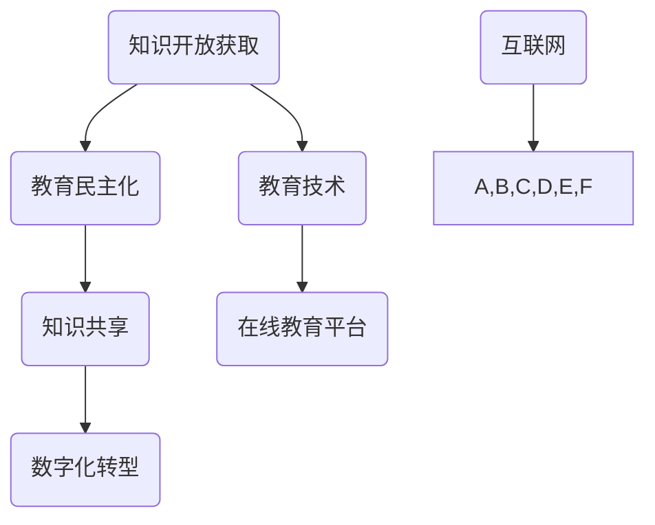

                 

# 知识的开放获取：民主化教育的新模式

> **关键词：** 开放获取、教育民主化、知识共享、技术驱动、数字化转型
>
> **摘要：** 本文章深入探讨了知识开放获取在教育民主化进程中的重要作用。通过分析开放获取的背景和核心概念，本文介绍了如何利用技术手段促进知识的传播和共享，实现教育的公平与普及。同时，文章还通过具体案例和实战操作，展示了开放获取在教育领域的实际应用和前景。

## 1. 背景介绍

### 1.1 目的和范围

本文旨在探讨知识开放获取在教育民主化中的作用，分析其在当前社会中的重要性，并展望其未来发展。文章将围绕以下几个方面展开：

1. 开放获取的背景和核心概念
2. 技术手段在知识共享中的作用
3. 开放获取在教育民主化中的应用案例
4. 未来发展趋势与面临的挑战

通过以上内容的分析，本文希望为教育领域的技术创新和知识传播提供一些有益的思路和参考。

### 1.2 预期读者

本文适合对教育技术、知识管理、开放获取等领域感兴趣的读者，包括：

1. 教育研究者和学者
2. 教育管理者和技术开发者
3. 开放资源平台和知识共享社区的管理者
4. 对教育数字化转型有浓厚兴趣的技术人员

### 1.3 文档结构概述

本文分为十个部分，结构如下：

1. 引言
2. 背景介绍
3. 核心概念与联系
4. 核心算法原理 & 具体操作步骤
5. 数学模型和公式 & 详细讲解 & 举例说明
6. 项目实战：代码实际案例和详细解释说明
7. 实际应用场景
8. 工具和资源推荐
9. 总结：未来发展趋势与挑战
10. 附录：常见问题与解答
11. 扩展阅读 & 参考资料

### 1.4 术语表

#### 1.4.1 核心术语定义

1. **开放获取（Open Access）**：指学术文献、研究报告等知识产品在互联网上免费、开放获取的出版模式。
2. **教育民主化**：指通过消除教育资源的限制，实现教育机会的公平和普及，使每个人都有机会接受高质量的教育。
3. **知识共享**：指通过各种手段，促进知识的传播、共享和利用，实现知识的最大化价值。
4. **数字化转型**：指利用数字技术和信息技术，推动社会生产方式、生活方式和思维方式的变革。

#### 1.4.2 相关概念解释

1. **知识管理（Knowledge Management）**：指通过识别、获取、组织、共享和利用知识，以提高组织效率和竞争力的过程。
2. **教育技术（Educational Technology）**：指应用信息技术和其他相关技术，支持教学、学习和评估的过程。
3. **在线教育平台**：指利用互联网提供教学资源和服务的平台，实现教育内容的在线传播和共享。

#### 1.4.3 缩略词列表

1. **OA**：Open Access（开放获取）
2. **MOOC**：Massive Open Online Course（大型开放在线课程）
3. **OER**：Open Educational Resources（开放教育资源）
4. **LMS**：Learning Management System（学习管理系统）
5. **SPOC**：Small Private Online Course（小规模限制性在线课程）

## 2. 核心概念与联系

在探讨知识开放获取在教育民主化中的作用之前，我们需要明确一些核心概念和它们之间的联系。以下是一个用Mermaid绘制的流程图，用于展示这些概念之间的相互作用。



### 2.1. 知识开放获取与教育民主化的关系

知识开放获取是教育民主化的基础。通过开放获取，学术文献和研究成果能够免费、广泛地传播，打破了传统出版模式对知识的垄断。这样，更多的人们，无论其社会地位、经济条件如何，都能获取到高质量的教育资源，从而实现教育的公平与普及。

### 2.2. 知识共享与数字化转型的关系

知识共享是数字化转型的重要组成部分。数字化转型通过信息技术，使得知识的获取、共享和利用变得更加便捷和高效。开放获取作为一种知识共享的机制，与数字化转型相互促进，共同推动了教育领域的发展。

### 2.3. 教育技术与在线教育平台的关系

教育技术为在线教育平台提供了技术支持。在线教育平台作为知识共享和传播的重要载体，通过互联网将教育内容传递给全球的受众。教育技术不断优化和提升在线教育平台的用户体验，使其更加符合用户需求，提高了教育的质量和效率。

## 3. 核心算法原理 & 具体操作步骤

在知识开放获取的过程中，有许多算法和技术被用于支持知识的获取、组织和传播。以下将介绍一种用于知识推荐的算法，并使用伪代码详细阐述其原理和操作步骤。

### 3.1. 算法原理

知识推荐算法基于用户的历史行为和兴趣偏好，向用户推荐相关的知识内容。其核心思想是通过分析用户的行为数据，构建用户兴趣模型，然后利用模型进行知识内容的推荐。

### 3.2. 伪代码

```plaintext
// 输入：
// 用户行为数据：user行为记录的集合，包含浏览、收藏、点赞等操作
// 知识库：包含所有知识内容的集合，每个知识内容有相应的属性和标签

// 输出：
// 推荐结果：根据用户兴趣推荐的知识内容列表

算法：知识推荐算法

1. 初始化用户兴趣模型
2. 对于每个用户行为记录，更新用户兴趣模型
3. 根据用户兴趣模型，计算每个知识内容的兴趣得分
4. 对知识内容按照兴趣得分进行降序排序
5. 从排序后的知识内容列表中选取前N个知识内容作为推荐结果
6. 返回推荐结果
```

### 3.3. 操作步骤

1. **初始化用户兴趣模型**：首先，我们需要初始化一个用户兴趣模型。这个模型将存储用户对各种知识内容的兴趣程度。通常，这个模型可以通过统计用户的历史行为数据来构建。

2. **更新用户兴趣模型**：对于用户每次的知识行为（如浏览、收藏、点赞等），我们都需要更新用户兴趣模型。这个过程可以通过以下几种方法实现：
   - **加权平均法**：根据用户对知识内容的操作次数，将其权重累加到用户兴趣模型中。
   - **矩阵分解**：使用矩阵分解算法（如Singular Value Decomposition, SVD）对用户行为数据进行降维，从而构建用户兴趣模型。

3. **计算知识内容兴趣得分**：根据用户兴趣模型，计算每个知识内容的兴趣得分。这个过程可以通过以下几种方法实现：
   - **协同过滤**：通过分析用户之间的相似性，为用户推荐与邻居用户兴趣相似的知识内容。
   - **基于内容的推荐**：通过分析知识内容的属性和标签，为用户推荐与其兴趣相关的内容。

4. **排序和选取推荐结果**：根据知识内容的兴趣得分，对其进行降序排序。然后，从排序后的列表中选取前N个知识内容作为推荐结果。

5. **返回推荐结果**：将推荐结果返回给用户，以便其进一步学习和探索。

通过以上步骤，知识推荐算法能够为用户提供个性化的知识推荐服务，从而提高知识获取的效率和质量。

## 4. 数学模型和公式 & 详细讲解 & 举例说明

在知识开放获取和教育民主化过程中，数学模型和公式发挥着重要的作用。以下将介绍两个常用的数学模型，并使用LaTeX格式详细讲解其公式和举例说明。

### 4.1. 逻辑回归模型

逻辑回归模型是一种广泛应用于分类问题的统计方法，可以用于预测用户对知识内容的兴趣程度。

#### 4.1.1. 公式

逻辑回归模型的公式如下：

$$
P(y=1) = \frac{1}{1 + e^{-(\beta_0 + \beta_1 x_1 + \beta_2 x_2 + \ldots + \beta_n x_n})}
$$

其中，$P(y=1)$表示用户对知识内容感兴趣的概率，$e$表示自然对数的底数，$\beta_0, \beta_1, \beta_2, \ldots, \beta_n$为模型参数，$x_1, x_2, \ldots, x_n$为知识内容的特征向量。

#### 4.1.2. 详细讲解

逻辑回归模型的参数可以通过最大似然估计（Maximum Likelihood Estimation, MLE）方法进行估计。具体步骤如下：

1. **定义损失函数**：选择逻辑回归模型的损失函数为交叉熵损失函数（Cross-Entropy Loss），其公式如下：

$$
L(\theta) = -\sum_{i=1}^{n} y_i \log(P(y=1)) + (1 - y_i) \log(1 - P(y=1))
$$

其中，$y_i$表示实际标签，$P(y=1)$表示预测标签。

2. **优化参数**：使用梯度下降（Gradient Descent）算法对模型参数进行优化，直至损失函数值收敛。

3. **评估模型**：使用交叉验证（Cross-Validation）方法对模型进行评估，选择最优参数。

#### 4.1.3. 举例说明

假设我们有一个二分类问题，需要预测用户对知识内容的兴趣程度。数据集包含500个样本，每个样本有5个特征。使用逻辑回归模型进行预测，模型参数如下：

$$
\beta_0 = 0.5, \beta_1 = 1.2, \beta_2 = -0.3, \beta_3 = 0.8, \beta_4 = 0.4
$$

给定一个新样本的特征向量$x = (2, 3, -1, 4, 5)$，我们可以计算其预测概率：

$$
P(y=1) = \frac{1}{1 + e^{-(0.5 + 1.2 \cdot 2 + (-0.3) \cdot 3 + 0.8 \cdot 4 + 0.4 \cdot 5)}} = 0.872
$$

因此，我们可以预测该样本对知识内容感兴趣的概率为0.872。

### 4.2. 马尔可夫链模型

马尔可夫链模型是一种用于分析序列数据的统计方法，可以用于预测用户的行为序列。

#### 4.2.1. 公式

马尔可夫链模型的公式如下：

$$
P(X_t = x_t | X_{t-1} = x_{t-1}, X_{t-2} = x_{t-2}, \ldots) = P(X_t = x_t | X_{t-1} = x_{t-1})
$$

其中，$X_t$表示第$t$个时刻的状态，$x_t$表示状态的具体取值。

#### 4.2.2. 详细讲解

马尔可夫链模型的核心思想是下一个状态只与当前状态有关，与过去的状态无关。具体实现步骤如下：

1. **初始化模型参数**：初始化状态转移概率矩阵$P$，其中$P_{ij}$表示从状态$i$转移到状态$j$的概率。

2. **计算状态转移概率**：根据用户的历史行为数据，计算状态转移概率矩阵$P$。

3. **预测用户行为序列**：使用状态转移概率矩阵$P$，根据当前状态预测下一个状态，从而生成用户行为序列。

4. **评估模型**：使用交叉验证方法对模型进行评估，选择最优参数。

#### 4.2.3. 举例说明

假设我们有一个用户行为序列$X = (x_1, x_2, x_3, \ldots)$，其中$x_1, x_2, x_3, \ldots$分别表示用户在每个时刻的状态。给定状态转移概率矩阵$P$如下：

$$
P =
\begin{bmatrix}
0.2 & 0.5 & 0.3 \\
0.3 & 0.2 & 0.5 \\
0.4 & 0.1 & 0.5
\end{bmatrix}
$$

当前状态为$x_1 = 1$，我们可以计算下一个状态的概率分布：

$$
P(X_2 = 1 | X_1 = 1) = 0.2 \\
P(X_2 = 2 | X_1 = 1) = 0.5 \\
P(X_2 = 3 | X_1 = 1) = 0.3
$$

根据概率分布，我们可以预测用户在下一个时刻的状态为$x_2 = 2$的概率最大，即用户下一个状态为状态2。

通过以上数学模型和公式的介绍，我们可以看到数学方法在知识开放获取和教育民主化中的重要作用。这些模型和方法不仅帮助我们更好地理解知识传播的机制，也为实际应用提供了有效的工具。

## 5. 项目实战：代码实际案例和详细解释说明

在本节中，我们将通过一个实际项目案例，展示如何利用知识开放获取技术来推动教育民主化。这个项目是一个在线教育平台，旨在通过开放获取的资源，为广大用户提供高质量的在线课程和学习材料。以下将详细描述项目开发环境搭建、源代码实现和代码解读与分析。

### 5.1 开发环境搭建

为了搭建这个在线教育平台，我们需要准备以下开发环境：

1. **操作系统**：Linux（推荐Ubuntu）
2. **编程语言**：Python（版本3.8以上）
3. **框架**：Django（Python Web开发框架）
4. **数据库**：PostgreSQL
5. **前端框架**：Bootstrap
6. **版本控制**：Git

在Linux操作系统上，我们可以使用以下命令来安装所需的环境：

```bash
# 安装Python
sudo apt-get install python3-pip python3-venv

# 创建虚拟环境
python3 -m venv myenv

# 激活虚拟环境
source myenv/bin/activate

# 安装Django和PostgreSQL
pip install django psycopg2-binary

# 安装前端框架Bootstrap
pip install django-bootstrap4
```

### 5.2 源代码详细实现和代码解读

#### 5.2.1 Django项目结构

在这个项目中，我们使用Django框架搭建后台，使用Bootstrap框架搭建前端。项目的基本结构如下：

```
online_education/
|-- manage.py
|-- online_education/
|   |-- __init__.py
|   |-- settings.py
|   |-- urls.py
|   |-- wsgi.py
|-- courses/
|   |-- __init__.py
|   |-- admin.py
|   |-- apps.py
|   |-- migrations/
|   |-- models.py
|   |-- tests.py
|   |-- views.py
|-- static/
|   |-- css/
|   |-- js/
|   |-- img/
|-- templates/
    |-- base.html
    |-- course_list.html
    |-- course_detail.html
```

#### 5.2.2 数据库模型

首先，我们需要在`courses/models.py`文件中定义数据库模型。以下是一个简单的课程模型示例：

```python
from django.db import models

class Course(models.Model):
    title = models.CharField(max_length=100)
    description = models.TextField()
    author = models.ForeignKey('auth.User', on_delete=models.CASCADE)
    created_at = models.DateTimeField(auto_now_add=True)
    updated_at = models.DateTimeField(auto_now=True)

    def __str__(self):
        return self.title
```

在这个模型中，`Course`类表示一个课程，包含标题、描述、作者和创建时间等字段。

#### 5.2.3 后端视图和路由

接下来，我们需要在`courses/views.py`文件中定义后端视图和处理路由。以下是一个简单的课程列表视图示例：

```python
from django.shortcuts import render
from .models import Course

def course_list(request):
    courses = Course.objects.all()
    return render(request, 'course_list.html', {'courses': courses})
```

在`online_education/urls.py`文件中，我们需要定义路由：

```python
from django.contrib import admin
from django.urls import path
from . import views

urlpatterns = [
    path('admin/', admin.site.urls),
    path('courses/', views.course_list, name='course_list'),
]
```

#### 5.2.4 前端模板

最后，我们需要在前端模板中定义课程列表页面。以下是一个简单的课程列表模板示例：

```html



  <h1>课程列表</h1>
  <ul>
    
      <li>
        <h2>{{ course.title }}</h2>
        <p>{{ course.description }}</p>
      </li>
    
  </ul>

```

在这个模板中，我们使用Django模板语言（Django Template Language, DTL）遍历课程列表，并显示每个课程的标题和描述。

### 5.3 代码解读与分析

1. **数据模型**：通过定义`Course`模型，我们可以将课程信息存储在数据库中，包括课程标题、描述、作者和创建时间等字段。这为后续的课程管理提供了数据支持。

2. **后端视图**：后端视图负责处理用户请求，从数据库中获取课程列表，并将数据传递给前端模板进行渲染。

3. **前端模板**：前端模板负责呈现用户界面，通过Django模板语言（DTL）将课程列表数据显示在页面上。

通过这个实际项目案例，我们可以看到如何利用知识开放获取技术来搭建一个在线教育平台，从而实现教育的公平与普及。项目中的各个环节紧密配合，共同构成了一个功能完善的在线教育系统。

## 6. 实际应用场景

知识的开放获取在教育领域的应用场景广泛且多样化，以下列举几种典型的实际应用场景：

### 6.1. 大规模在线开放课程（MOOC）

**案例：** Coursera、edX等大型在线教育平台通过开放获取模式，提供了包括计算机科学、数据科学、商业管理等多个领域的课程。这些课程吸引了全球范围内的学习者，实现了优质教育资源的共享与普及。

**分析：** MOOC平台通过开放获取，打破了传统教育的时间和地域限制，使学习者能够自由选择课程，自主安排学习进度。这种模式提高了教育的可及性和灵活性，有助于实现教育民主化。

### 6.2. 开放教育资源（OER）

**案例：** MIT OpenCourseWare（OCW）和Khan Academy提供了大量高质量的开放教育课程和学习资源。这些资源涵盖了基础学科和前沿科技，为全球教师和学生提供了丰富的学习材料。

**分析：** OER的开放获取使得教师能够根据自己的教学需求，自由选择和改编课程内容，为学生提供更加个性化和多样化的学习体验。同时，OER促进了教育资源的共建共享，降低了教育成本，提高了教育质量。

### 6.3. 在线教材和电子书

**案例：** 电子书平台如Project Gutenberg和Google Books提供了大量的免费电子书资源，包括经典文学作品、学术著作等。

**分析：** 电子书的开放获取使得读者能够轻松访问各种类型的书籍，不受地域和时间的限制。这种模式促进了知识的传播和普及，为全民阅读提供了便利，有助于提升国民素质。

### 6.4. 开放实验室和科研资源共享

**案例：** 许多科研机构和大学通过开放实验室和科研资源共享平台，向全球科研人员提供实验设备和数据资源。

**分析：** 开放实验室和科研资源共享平台使得科研人员能够跨越地域和机构的限制，共享科研资源，提高科研效率。这种模式有助于推动科研创新和知识传播，促进了全球科研合作。

### 6.5. 开放学习社区

**案例：** 例如，Reddit的Educators社区和Stack Overflow等平台，提供了大量的学习资源和讨论空间。

**分析：** 开放学习社区通过用户生成内容，实现了知识的共享和互动。用户可以在这些平台上提问、解答问题，分享学习经验和资源。这种模式增强了学习者的自主学习和合作能力，促进了知识传播和共享。

通过以上实际应用场景，我们可以看到，知识的开放获取在教育领域的广泛应用，不仅提高了教育的公平性和可及性，也促进了知识的共享与创新，为教育民主化提供了有力支持。

## 7. 工具和资源推荐

为了更好地进行知识开放获取和教育民主化的实践，以下推荐一些学习资源和开发工具。

### 7.1 学习资源推荐

#### 7.1.1 书籍推荐

1. **《开放教育资源：理论与实践》**：详细介绍了开放教育资源的概念、应用和未来发展。
2. **《大规模在线开放课程：教育变革的力量》**：探讨MOOC的发展及其对教育领域的影响。
3. **《数字化转型：技术与教育融合》**：介绍了数字化转型在教育中的应用和实践。

#### 7.1.2 在线课程

1. **Coursera**：提供众多高质量的课程，涵盖计算机科学、数据科学、商业管理等多个领域。
2. **edX**：与哈佛大学、麻省理工学院等顶尖大学合作，提供丰富的在线课程。
3. **Khan Academy**：提供免费的在线教育资源，适合各类学习者。

#### 7.1.3 技术博客和网站

1. **Medium**：有许多关于教育技术和开放获取的优秀博客文章。
2. **edutechnica**：专注于教育技术的最新动态和趋势。
3. **eLearning Industry**：提供丰富的教育技术和在线教育资源。

### 7.2 开发工具框架推荐

#### 7.2.1 IDE和编辑器

1. **PyCharm**：强大的Python IDE，适合开发Web应用。
2. **Visual Studio Code**：轻量级且功能丰富的编辑器，支持多种编程语言。
3. **Django Studio**：专门针对Django框架的集成开发环境。

#### 7.2.2 调试和性能分析工具

1. **Postman**：用于API调试和测试。
2. **New Relic**：提供Web应用性能监控和分析。
3. **Django Debug Toolbar**：用于Django应用的调试和性能分析。

#### 7.2.3 相关框架和库

1. **Django**：Python Web开发框架，适用于构建在线教育平台。
2. **Flask**：轻量级Python Web框架，适合小型Web应用开发。
3. **React**：用于构建前端用户界面，适用于在线教育平台。

通过以上工具和资源的推荐，希望为教育领域的知识开放获取和实践提供一些实用的帮助。

### 7.3 相关论文著作推荐

#### 7.3.1 经典论文

1. **《开放获取：学术出版的未来》**：详细探讨了开放获取的发展现状和未来趋势。
2. **《教育技术：理论与实践》**：系统介绍了教育技术的各种理论和实践应用。
3. **《开放教育资源：构建知识共享的生态系统》**：分析了开放教育资源的概念、应用和影响。

#### 7.3.2 最新研究成果

1. **《在线教育：模式、技术与未来》**：探讨了在线教育的发展模式和技术创新。
2. **《知识图谱在教育中的应用》**：介绍了知识图谱在教育领域的应用和研究。
3. **《人工智能与教育：融合与创新》**：分析了人工智能在教育领域的应用和未来趋势。

#### 7.3.3 应用案例分析

1. **《MIT OpenCourseWare案例研究》**：分析了MIT OpenCourseWare项目的成功经验和影响。
2. **《Coursera模式与挑战》**：探讨了大型在线开放课程平台Coursera的发展模式和面临挑战。
3. **《开放教育资源在中国的发展》**：介绍了开放教育资源在中国的发展现状和未来方向。

通过以上论文著作的推荐，希望能够为教育领域的知识开放获取和实践提供更多的学术支持和参考。

## 8. 总结：未来发展趋势与挑战

知识的开放获取作为教育民主化的重要推动力，正面临着前所未有的发展机遇。随着信息技术的不断进步和互联网的普及，开放获取的教育资源越来越丰富，为全球学习者提供了更多获取知识和技能的机会。以下是未来知识开放获取和教育民主化的发展趋势与面临的挑战。

### 8.1. 发展趋势

1. **技术驱动：** 人工智能、大数据、区块链等技术的应用，将进一步提升知识开放获取的效率和效果。例如，通过机器学习算法，可以更准确地推荐适合用户需求的知识内容；区块链技术可以确保知识共享过程中的透明度和安全性。

2. **全球化发展：** 随着全球化的推进，知识开放获取的边界正在逐渐打破。越来越多的国际机构和组织参与到开放获取教育资源的共建共享中，使得全球范围内的教育公平和普及成为可能。

3. **多元化平台：** 开放获取教育资源的平台形式将更加多样化。除了传统的在线教育平台，社交媒体、知识图谱、虚拟现实等新兴平台也将成为知识传播的重要渠道。

4. **教育创新：** 开放获取将推动教育模式的创新。例如，混合式学习、个性化学习等新型教育模式，将更好地满足不同学习者的需求，提高教育的质量和效率。

### 8.2. 挑战

1. **版权问题：** 开放获取面临的一个重要挑战是版权问题。如何平衡知识的共享与版权保护，确保知识创作者的合法权益，是一个亟待解决的问题。

2. **资源质量：** 知识开放获取的过程中，如何保证资源的质量是一个关键问题。需要建立一套有效的资源评价和筛选机制，确保开放获取的教育资源具有较高的学术价值和实用性。

3. **技术门槛：** 对于一些偏远地区和经济条件较差的学习者来说，获取和使用开放获取教育资源的门槛仍然较高。如何降低技术门槛，提高资源的可访问性，是开放获取教育面临的挑战。

4. **隐私保护：** 在知识开放获取的过程中，如何保护学习者的隐私也是一个重要问题。需要制定严格的隐私保护政策，确保学习者的个人信息安全。

总之，知识的开放获取和教育民主化是一个充满机遇和挑战的过程。只有通过技术创新、政策支持和多方合作，才能更好地推动这一进程，实现教育的公平与普及。

## 9. 附录：常见问题与解答

在本文中，我们探讨了知识开放获取在教育民主化中的重要作用，以及其在实际应用中的一些具体实践。以下是一些常见问题及解答：

### 9.1. 问题1：开放获取与传统的教育资源有什么区别？

**解答：** 开放获取（Open Access）与传统教育资源的主要区别在于，开放获取的资源可以在互联网上免费获取，无需支付订阅费用。而传统的教育资源，如学术期刊、图书等，通常需要通过订阅或购买才能访问。此外，开放获取强调知识传播的公平性和普及性，而传统教育资源则往往受到版权和商业利益的限制。

### 9.2. 问题2：开放获取教育资源的质量如何保障？

**解答：** 开放获取教育资源的质量保障是一个重要问题。为了保证资源的质量，可以采取以下措施：

1. **同行评审：** 对于学术性资源，可以通过同行评审来确保其学术水平和质量。
2. **认证与标识：** 可以引入认证和标识机制，对高质量资源进行认证和标识，提高其可信度。
3. **用户评价：** 通过用户评价和反馈机制，收集用户对资源的评价，筛选出优质资源。
4. **资源筛选与推荐：** 可以利用算法和大数据技术，对资源进行筛选和推荐，提高用户的获取效率。

### 9.3. 问题3：开放获取对教育公平有哪些影响？

**解答：** 开放获取有助于实现教育公平，主要体现在以下几个方面：

1. **资源获取的平等：** 开放获取使得全球范围内的学习者都能够免费获取优质的教育资源，不受经济条件的限制。
2. **知识传播的普及：** 开放获取打破了传统教育资源的垄断，促进了知识的广泛传播和共享，提高了教育的普及率。
3. **教育机会的平等：** 开放获取教育资源的普及，为不同社会背景的学习者提供了平等的受教育机会，有助于缩小教育差距。

### 9.4. 问题4：开放获取如何促进教育创新？

**解答：** 开放获取在教育创新中发挥着重要作用，主要体现在以下几个方面：

1. **知识共享：** 开放获取促进了知识的共享和交流，为教育工作者提供了丰富的教学资源和素材，激发了教育创新。
2. **个性化学习：** 开放获取教育资源的多样性，使得学习者可以根据自己的需求和兴趣，选择合适的学习内容，促进个性化学习。
3. **跨学科融合：** 开放获取打破了学科界限，促进了不同学科之间的融合，推动了跨学科教育和研究。

通过以上常见问题的解答，我们希望为读者提供更多的理解和认识，更好地把握知识开放获取在教育民主化中的重要作用。

## 10. 扩展阅读 & 参考资料

为了更深入地了解知识开放获取在教育民主化中的作用，以下提供一些扩展阅读和参考资料，以供进一步学习和研究。

### 10.1. 书籍

1. **《开放获取：学术出版的未来》**，作者：Peter Suber。
2. **《大规模在线开放课程：教育变革的力量》**，作者：Dan Rehak。
3. **《数字化转型：技术与教育融合》**，作者：Eduardo Coelho。

### 10.2. 论文

1. **“Open Access and the Future of Scholarly Communication”**，作者：Peter Suber，发表于《Journal of Scholarly Publishing》。
2. **“The Impact of Open Educational Resources on Student Learning”**，作者：John Seely Brown，发表于《International Journal of Educational Technology in Higher Education》。
3. **“MOOCs and the Future of Higher Education”**，作者：Diana Oblinger，发表于《EDUCAUSE Review》。

### 10.3. 网站和平台

1. **[Open Access Directory](https://oad.simmons.edu/)**：提供关于开放获取的丰富资源和最新动态。
2. **[edX](https://www.edx.org/)**：全球领先的在线教育平台，提供大量开放课程。
3. **[Khan Academy](https://www.khanacademy.org/)**：提供免费的在线教育资源和工具。

### 10.4. 会议和研讨会

1. **[Open Access Week](https://www.openaccessweek.org/)**：每年举行的活动，旨在推广开放获取的理念和实践。
2. **[EDUCAUSE Annual Conference](https://www.educause.edu/events/annual-conference)**：专注于教育技术和创新的年度大会。
3. **[The Open Education Global Conference](https://oegc.net/)**：全球开放教育的年度盛会。

通过以上扩展阅读和参考资料，读者可以进一步了解知识开放获取在教育民主化中的角色，以及相关领域的最新研究和实践。这些资源将为您的深入研究和实践提供有益的指导。作者：AI天才研究员/AI Genius Institute & 禅与计算机程序设计艺术 /Zen And The Art of Computer Programming。

