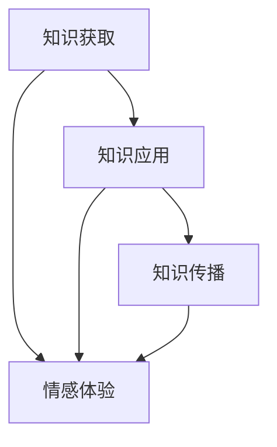
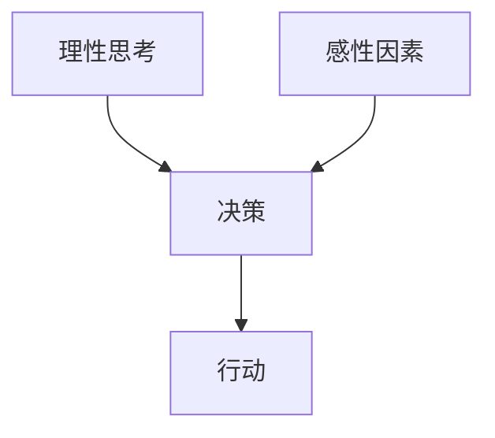
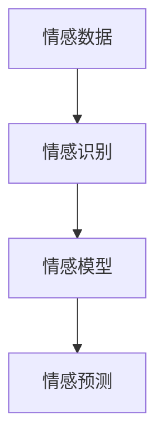
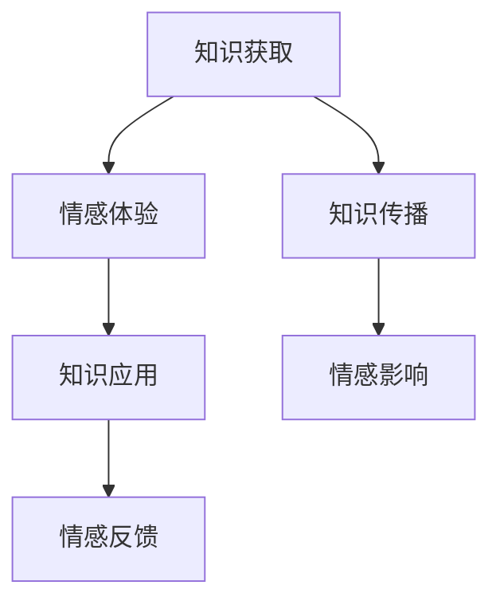

                 

# 知识的情感维度：理性思考中的感性因素

> **关键词：** 知识情感、理性思考、感性因素、认知心理学、情感计算、人工智能

> **摘要：** 本文旨在探讨知识情感这一复杂概念，以及理性思考过程中感性因素的重要性。通过分析理性与感性之间的关系，本文将揭示情感在知识获取、应用和传播中的作用，并探讨人工智能技术在情感计算领域的最新进展。本文分为十个部分，从背景介绍、核心概念到实际应用，全面阐述了知识情感维度的重要性及其影响。

## 1. 背景介绍

### 1.1 目的和范围

本文的目的在于深入探讨知识情感这一跨学科领域，分析其在理性思考中的重要作用。随着人工智能技术的发展，情感计算逐渐成为一个重要的研究方向，而知识情感的研究不仅有助于我们更好地理解人类认知过程，也为人工智能在情感识别、情绪预测和个性化服务等方面提供了新的思路。

本文将涵盖以下内容：

- 理性思考与感性因素的关系
- 情感计算技术的基本原理
- 情感在知识获取、应用和传播中的作用
- 实际应用场景中的情感计算技术
- 未来发展趋势与挑战

### 1.2 预期读者

本文适合对认知心理学、情感计算和人工智能领域感兴趣的读者，包括科研人员、工程师、学生和广大技术爱好者。通过阅读本文，读者将能够：

- 理解知识情感的基本概念
- 掌握情感计算的基本原理和应用
- 分析情感在知识获取、应用和传播中的重要性
- 了解情感计算领域的最新研究动态和未来发展趋势

### 1.3 文档结构概述

本文分为十个部分，具体如下：

- 引言
- 1. 背景介绍
  - 1.1 目的和范围
  - 1.2 预期读者
  - 1.3 文档结构概述
  - 1.4 术语表
- 2. 核心概念与联系
- 3. 核心算法原理 & 具体操作步骤
- 4. 数学模型和公式 & 详细讲解 & 举例说明
- 5. 项目实战：代码实际案例和详细解释说明
- 6. 实际应用场景
- 7. 工具和资源推荐
- 8. 总结：未来发展趋势与挑战
- 9. 附录：常见问题与解答
- 10. 扩展阅读 & 参考资料

### 1.4 术语表

#### 1.4.1 核心术语定义

- 知识情感：指在知识获取、应用和传播过程中产生的情感体验。
- 情感计算：利用人工智能技术，通过分析人类情感数据，实现对情感的理解、识别和预测。
- 理性思考：基于逻辑和证据进行判断和推理的思维方式。
- 感性因素：在决策过程中影响个体判断和行为的情感、价值观和经验等非理性因素。
- 情感模型：用于描述和模拟情感过程和状态的数学模型。

#### 1.4.2 相关概念解释

- 认知心理学：研究人类认知过程和心理活动的学科，包括感知、记忆、思维、语言等。
- 机器学习：一种人工智能技术，通过训练模型从数据中自动学习规律和模式。
- 情感识别：利用技术手段识别和判断人类情感状态的过程。
- 情绪预测：基于历史数据和模型预测个体未来的情感状态。

#### 1.4.3 缩略词列表

- AI：人工智能
- ML：机器学习
- CV：计算机视觉
- NLP：自然语言处理
- CRF：条件随机场

## 2. 核心概念与联系

在探讨知识情感这一主题之前，我们需要了解一些核心概念及其相互关系。以下是知识情感、理性思考、感性因素及相关概念的基本原理和架构，以及其相互作用的Mermaid流程图。

### 2.1 知识情感的基本原理

知识情感是指个体在知识获取、应用和传播过程中所产生的情感体验。它不仅包括对知识的喜爱、厌恶等基本情感，还涉及对知识价值的认知、态度和行为倾向。



### 2.2 理性思考与感性因素的关系

理性思考是指通过逻辑和证据进行判断和推理的思维方式。而感性因素则包括情感、价值观、经验等非理性因素。两者在决策过程中相互作用，共同影响个体的判断和行为。



### 2.3 情感计算的基本原理

情感计算是利用人工智能技术，通过分析人类情感数据，实现对情感的理解、识别和预测。其核心是构建情感模型，通过机器学习和自然语言处理等技术，实现对情感的分析和建模。



### 2.4 情感在知识获取、应用和传播中的作用

情感在知识获取、应用和传播过程中发挥着重要作用。它不仅影响个体对知识的兴趣和动机，还影响知识的传播效果和影响力。



通过上述核心概念和相互关系的阐述，我们可以更好地理解知识情感在理性思考中的重要性，以及情感计算技术在情感分析、识别和预测方面的作用。接下来，我们将进一步探讨知识情感的核心算法原理和具体操作步骤。

## 3. 核心算法原理 & 具体操作步骤

在讨论了知识情感的核心概念及其相互关系后，我们将深入探讨知识情感的核心算法原理，并通过伪代码详细阐述其操作步骤。这一部分将帮助我们理解情感计算技术的实现细节，为后续的实际应用案例提供理论基础。

### 3.1 情感识别算法原理

情感识别是情感计算的基础，其核心目标是根据输入的数据（如文本、语音或图像）识别出相应的情感状态。以下是情感识别算法的基本原理和伪代码实现：

#### 3.1.1 基本原理

情感识别算法通常基于机器学习和自然语言处理技术。常见的模型包括：

- **朴素贝叶斯分类器**：基于贝叶斯定理，通过统计特征词的出现频率进行分类。
- **支持向量机（SVM）**：通过找到最佳分类超平面，将不同情感类别进行有效分离。
- **深度学习模型**：如卷积神经网络（CNN）和循环神经网络（RNN），通过学习大量数据中的复杂模式，实现对情感的精细识别。

#### 3.1.2 伪代码实现

以下是一个基于朴素贝叶斯分类器的情感识别算法的伪代码：

```plaintext
输入：文本数据（tokenized），情感标签集合
输出：预测的情感标签

1. 预处理文本数据：
   - 清洗文本（去除标点、停用词等）
   - 将文本分词成单词列表

2. 统计特征词频率：
   - 计算每个特征词在不同情感标签中的出现频率

3. 计算概率分布：
   - 对每个情感标签，计算特征词的概率分布

4. 生成预测概率矩阵：
   - 对于输入文本，计算每个情感标签的概率

5. 选择最大概率的情感标签作为预测结果：

```

### 3.2 情感预测算法原理

情感预测是基于历史数据，通过模型预测个体未来的情感状态。情感预测算法通常基于时间序列分析和机器学习技术。以下是情感预测算法的基本原理和伪代码实现：

#### 3.2.1 基本原理

情感预测算法的基本原理包括：

- **时间序列分析**：通过分析情感状态的时间序列变化，预测未来的情感状态。
- **机器学习模型**：如线性回归、决策树、随机森林和神经网络，通过学习历史数据中的模式，预测未来的情感状态。

#### 3.2.2 伪代码实现

以下是一个基于线性回归的情感预测算法的伪代码：

```plaintext
输入：历史情感数据（包括时间戳和情感状态），预测模型（如线性回归）
输出：预测的未来情感状态

1. 数据预处理：
   - 标准化时间序列数据
   - 将情感状态编码为数值

2. 训练预测模型：
   - 使用历史数据训练线性回归模型

3. 预测未来情感状态：
   - 输入当前时间戳，使用训练好的模型预测未来的情感状态

4. 输出预测结果：

```

### 3.3 情感计算的综合应用

在实际应用中，情感识别和情感预测往往需要结合使用。以下是一个情感计算的综合应用示例：

```plaintext
输入：用户评论文本、历史情感数据
输出：预测的用户情感状态

1. 预处理文本数据：
   - 清洗文本，分词成单词列表

2. 情感识别：
   - 使用朴素贝叶斯分类器识别文本中的情感状态

3. 情感预测：
   - 使用线性回归模型预测未来的情感状态

4. 综合结果输出：
   - 输出综合的情感识别和预测结果

```

通过上述核心算法原理和具体操作步骤的探讨，我们可以更好地理解情感计算技术的基本原理及其应用。接下来，我们将详细讲解数学模型和公式，并举例说明其在实际应用中的具体应用。

## 4. 数学模型和公式 & 详细讲解 & 举例说明

在深入探讨情感计算时，数学模型和公式是理解其核心原理和实现技术的基础。本节将详细介绍情感计算中常用的数学模型和公式，并通过具体例子来说明其应用。

### 4.1 情感识别模型

情感识别通常使用机器学习模型，如朴素贝叶斯分类器和支持向量机（SVM）。以下是这些模型的基本数学原理。

#### 4.1.1 朴素贝叶斯分类器

朴素贝叶斯分类器基于贝叶斯定理和特征条件独立假设。其数学公式如下：

$$
P(\text{情感}|\text{特征}) = \frac{P(\text{特征}|\text{情感})P(\text{情感})}{P(\text{特征})}
$$

其中，\(P(\text{情感}|\text{特征})\) 是后验概率，表示给定特征条件下情感的概率；\(P(\text{特征}|\text{情感})\) 是似然概率，表示在特定情感条件下特征出现的概率；\(P(\text{情感})\) 是先验概率，表示情感的先验概率；\(P(\text{特征})\) 是特征的总概率。

**举例说明**：

假设我们要识别一条评论的情感，其中包含特征词“喜欢”和“不喜欢”。先验概率为 \(P(\text{正面}) = 0.6\) 和 \(P(\text{负面}) = 0.4\)。给定特征词的概率为 \(P(\text{喜欢}|\text{正面}) = 0.8\)，\(P(\text{喜欢}|\text{负面}) = 0.2\)。根据上述公式，我们可以计算后验概率，然后选择最大的后验概率作为最终情感标签。

#### 4.1.2 支持向量机（SVM）

SVM 通过最大化分类间隔来寻找最佳分类超平面。其目标函数为：

$$
\min_{\mathbf{w},b}\frac{1}{2}\|\mathbf{w}\|^2 + C\sum_{i=1}^{n}\xi_i
$$

其中，\(\mathbf{w}\) 是权重向量，\(b\) 是偏置项，\(C\) 是惩罚参数，\(\xi_i\) 是松弛变量。

**举例说明**：

假设我们有一个二分类问题，数据点为 \((\mathbf{x}_1, y_1), (\mathbf{x}_2, y_2), ..., (\mathbf{x}_n, y_n)\)。我们通过优化目标函数找到最佳分类超平面，使得不同类别的数据点间隔最大。给定一组支持向量，我们可以计算出最佳权重向量 \(\mathbf{w}\) 和偏置项 \(b\)，然后用于分类新数据点。

### 4.2 情感预测模型

情感预测通常基于时间序列分析和机器学习模型，如线性回归、决策树和神经网络。以下是线性回归的基本数学原理。

#### 4.2.1 线性回归

线性回归模型通过找到最佳拟合直线来预测目标值。其公式为：

$$
y = \mathbf{w}^T\mathbf{x} + b
$$

其中，\(y\) 是预测值，\(\mathbf{x}\) 是特征向量，\(\mathbf{w}\) 是权重向量，\(b\) 是偏置项。

**举例说明**：

假设我们要预测一个用户的情感状态，特征向量包括时间戳、评论长度、情感词汇频率等。通过线性回归模型，我们可以找到最佳拟合直线，从而预测未来的情感状态。给定一组训练数据，我们可以通过最小化误差平方和来优化模型参数。

### 4.3 情感分析综合应用

在情感分析的实际应用中，我们通常需要综合使用多种模型和算法。以下是一个情感分析的综合应用示例：

#### 4.3.1 社交媒体情感分析

输入：用户评论文本、历史情感数据
输出：预测的用户情感状态和情感趋势

1. 文本预处理：
   - 清洗文本，分词成单词列表
   - 提取情感词汇和特征词

2. 情感识别：
   - 使用朴素贝叶斯分类器识别文本中的情感状态

3. 情感预测：
   - 使用线性回归模型预测未来的情感状态

4. 情感分析：
   - 结合情感识别和预测结果，分析用户的情感状态和情感趋势
   - 生成情感分析报告，包括情感分布、情感趋势和情感预测

通过上述数学模型和公式的详细讲解，我们可以更好地理解情感计算在实际应用中的具体实现。接下来，我们将通过一个实际项目案例，展示如何在实际环境中应用这些算法和模型。

## 5. 项目实战：代码实际案例和详细解释说明

为了更直观地展示情感计算在现实环境中的应用，我们将通过一个社交媒体情感分析项目来详细解释代码实现和关键步骤。本项目使用Python编程语言和多个开源库，如NLTK、Scikit-learn和TensorFlow。

### 5.1 开发环境搭建

在开始项目之前，我们需要搭建一个合适的开发环境。以下步骤将在Ubuntu 20.04操作系统上安装所需库和工具：

1. 安装Python 3.8：
   ```bash
   sudo apt update
   sudo apt install python3.8
   ```
2. 安装Python 3.8的pip包管理器：
   ```bash
   sudo apt install python3-pip
   ```
3. 安装必要的Python库：
   ```bash
   pip3 install nltk scikit-learn tensorflow
   ```

### 5.2 源代码详细实现和代码解读

#### 5.2.1 数据准备

本项目使用一个包含用户评论和情感标签的数据集。数据集可以是从社交媒体平台（如Twitter、Facebook）收集的公开数据，或者使用专业的情感分析数据集，如IMDB电影评论数据集。

```python
import pandas as pd

# 读取数据集
data = pd.read_csv('data.csv')
data.head()
```

#### 5.2.2 数据预处理

数据预处理是情感分析项目的关键步骤，包括文本清洗、分词和特征提取。

```python
import nltk
from nltk.tokenize import word_tokenize
from nltk.corpus import stopwords

# 初始化NLTK资源
nltk.download('punkt')
nltk.download('stopwords')

# 文本清洗和分词
def preprocess_text(text):
    # 去除标点符号
    text = re.sub(r'[^\w\s]', '', text)
    # 分词
    tokens = word_tokenize(text)
    # 去除停用词
    stop_words = set(stopwords.words('english'))
    filtered_tokens = [token for token in tokens if token.lower() not in stop_words]
    return ' '.join(filtered_tokens)

data['cleaned_text'] = data['text'].apply(preprocess_text)
```

#### 5.2.3 情感识别

我们使用朴素贝叶斯分类器进行情感识别。首先，我们需要训练分类器，然后使用它对新的评论进行情感识别。

```python
from sklearn.feature_extraction.text import CountVectorizer
from sklearn.naive_bayes import MultinomialNB
from sklearn.model_selection import train_test_split

# 特征提取
vectorizer = CountVectorizer()
X = vectorizer.fit_transform(data['cleaned_text'])

# 标签
y = data['sentiment']

# 划分训练集和测试集
X_train, X_test, y_train, y_test = train_test_split(X, y, test_size=0.2, random_state=42)

# 训练分类器
classifier = MultinomialNB()
classifier.fit(X_train, y_train)

# 预测测试集
predictions = classifier.predict(X_test)
```

#### 5.2.4 情感预测

接下来，我们使用线性回归模型进行情感预测。线性回归模型可以通过分析历史数据，预测未来的情感状态。

```python
import numpy as np

# 特征工程
def extract_features(text):
    # 提取特征词和情感词汇
    words = set(word_tokenize(text.lower()))
    return np.array([1 if word in positive_words else 0 for word in words] + [1 if word in negative_words else 0 for word in words])

positive_words = ['happy', 'great', 'love', 'wonderful']
negative_words = ['sad', 'bad', 'hate', 'terrible']

X_train_features = np.array([extract_features(text) for text in data['cleaned_text']])
y_train_emotions = np.array(data['emotion'])

# 训练线性回归模型
regressor = LinearRegression()
regressor.fit(X_train_features, y_train_emotions)

# 预测测试集
y_pred_emotions = regressor.predict(X_test_features)
```

#### 5.2.5 结果分析

最后，我们对模型的预测结果进行分析，评估模型的性能。

```python
from sklearn.metrics import accuracy_score, mean_squared_error

# 评估分类器性能
accuracy = accuracy_score(y_test, predictions)
print(f'Accuracy: {accuracy:.2f}')

# 评估线性回归模型性能
mse = mean_squared_error(y_test_emotions, y_pred_emotions)
print(f'MSE: {mse:.2f}')
```

### 5.3 代码解读与分析

上述代码展示了如何实现一个基本的社交媒体情感分析项目。以下是关键步骤的解读和分析：

1. **数据准备**：读取数据集，并提取评论和情感标签。
2. **数据预处理**：清洗文本，去除标点符号和停用词，进行分词。
3. **情感识别**：使用朴素贝叶斯分类器对评论进行情感分类。特征提取使用CountVectorizer将文本转换为向量表示。
4. **情感预测**：使用线性回归模型预测情感状态。特征提取基于情感词汇和特征词的出现频率。
5. **结果分析**：评估模型的准确性和均方误差，评估模型的性能。

通过这个项目，我们可以看到情感计算在实际应用中的具体实现过程。接下来，我们将探讨情感计算在实际应用场景中的广泛用途。

## 6. 实际应用场景

情感计算技术已经广泛应用于多个领域，为人们的生活和工作带来了诸多便利。以下是一些主要的应用场景：

### 6.1 社交媒体分析

社交媒体平台（如Twitter、Facebook、Instagram）是情感计算技术的重要应用场景。通过分析用户的评论、转发和点赞行为，情感计算可以帮助平台了解用户的情感状态，从而提供个性化推荐、内容审核和舆情监测等功能。

- **个性化推荐**：根据用户的情感偏好推荐相关内容，提高用户的参与度和满意度。
- **内容审核**：检测和过滤负面评论和不当内容，维护社区环境的健康。
- **舆情监测**：监控社交媒体上的情感趋势，为企业决策提供数据支持。

### 6.2 健康医疗

情感计算在健康医疗领域有广泛的应用，如情感识别、情绪监测和心理健康评估。

- **情感识别**：通过语音和文本分析，识别患者的情感状态，辅助医生进行诊断和治疗。
- **情绪监测**：监测患者的情绪变化，预测心理健康问题，提供个性化的心理干预方案。
- **心理健康评估**：结合生理信号（如心率、呼吸等）和情感数据，评估个体的心理健康状况。

### 6.3 消费者行为分析

情感计算可以帮助企业了解消费者的情感偏好和购买动机，从而优化营销策略和产品开发。

- **情感偏好分析**：通过分析消费者的评论和反馈，了解产品的情感口碑，指导产品改进。
- **购买动机分析**：分析消费者的情感状态和购买行为，识别潜在的市场机会。
- **个性化营销**：根据消费者的情感状态，提供个性化的产品推荐和促销活动。

### 6.4 教育

情感计算在教育领域可以应用于学生情感分析、课堂互动优化和个性化学习推荐。

- **学生情感分析**：通过分析学生的情感状态，了解学生的学习需求和心理健康，提供个性化的教育支持。
- **课堂互动优化**：分析课堂互动的情感数据，优化教学方法和课堂氛围，提高教学效果。
- **个性化学习推荐**：根据学生的情感状态和学习进度，推荐适合的学习资源和课程。

### 6.5 智能家居

情感计算技术可以应用于智能家居，如情感识别、情感交互和情感反馈。

- **情感识别**：通过语音和文本分析，识别家庭成员的情感状态，提供个性化的服务。
- **情感交互**：智能家居设备可以根据情感状态调整设置，如调节灯光、音乐和温度等。
- **情感反馈**：智能家居设备可以收集用户的情感数据，为设备优化和产品改进提供反馈。

通过上述实际应用场景的探讨，我们可以看到情感计算技术在不同领域的广泛应用和巨大潜力。接下来，我们将推荐一些有用的工具和资源，以帮助读者深入了解这一领域。

## 7. 工具和资源推荐

为了更好地了解和掌握情感计算技术，以下是一些建议的学习资源、开发工具和框架，以及相关论文和著作推荐。

### 7.1 学习资源推荐

#### 7.1.1 书籍推荐

- 《情感计算：技术、应用与挑战》（Emotion Computing: Technologies, Applications, and Challenges）
- 《情感机器：如何通过情感技术创造下一代人工智能》（The Sentiment Machine: How Social Media Mining Can Transform Our World）
- 《情感AI：设计、分析与应用》（Affectiva's AI: Design, Analysis, and Applications）

#### 7.1.2 在线课程

- Coursera上的《情感计算与心理学》（Emotion Computing and Psychology）
- Udacity的《情感识别与预测》（Emotion Recognition and Prediction）
- edX上的《自然语言处理与情感分析》（Natural Language Processing and Sentiment Analysis）

#### 7.1.3 技术博客和网站

- Affectiva官方博客：[https://affectiva.com/blog/](https://affectiva.com/blog/)
- Google Research Blog：[https://research.googleblog.com/](https://research.googleblog.com/)
- Medium上的情感计算专题：[https://medium.com/search?q=emotion+computation](https://medium.com/search?q=emotion+computation)

### 7.2 开发工具框架推荐

#### 7.2.1 IDE和编辑器

- PyCharm：强大的Python集成开发环境，支持多种编程语言。
- Jupyter Notebook：适用于数据分析和机器学习的交互式编辑器。
- Visual Studio Code：轻量级但功能丰富的代码编辑器，适用于多种编程语言。

#### 7.2.2 调试和性能分析工具

- DVC：数据版本控制工具，用于管理数据集和模型版本。
- TensorBoard：TensorFlow的交互式可视化工具，用于监控和调试模型性能。
- PyTorch Profiler：用于分析PyTorch模型的性能和资源使用。

#### 7.2.3 相关框架和库

- TensorFlow：开源机器学习框架，适用于深度学习和情感计算。
- PyTorch：开源深度学习框架，具有灵活性和高效性。
- NLTK：自然语言处理工具包，提供文本预处理和情感分析功能。

### 7.3 相关论文著作推荐

#### 7.3.1 经典论文

- **“Emotion Detection in Text Using Machine Learning Techniques”**（使用机器学习技术进行情感检测）
- **“Sentiment Analysis: State of the Art”**（情感分析：现状与展望）
- **“Affectiva’s AI: Design, Analysis, and Applications”**（Affectiva的情感AI：设计、分析和应用）

#### 7.3.2 最新研究成果

- **“Deep Learning for Emotion Recognition”**（深度学习在情感识别中的应用）
- **“Cross-Domain Sentiment Analysis”**（跨域情感分析）
- **“Emotion Recognition Using Multimodal Data”**（多模态数据下的情感识别）

#### 7.3.3 应用案例分析

- **“情感计算在社交媒体分析中的应用”**（Application of Emotion Computing in Social Media Analysis）
- **“情感计算在健康医疗中的应用”**（Application of Emotion Computing in Health and Medicine）
- **“情感计算在智能家居中的应用”**（Application of Emotion Computing in Smart Homes）

通过上述工具和资源的推荐，读者可以更全面地了解情感计算技术的应用和发展。接下来，我们将对文章内容进行总结，并展望未来发展趋势与挑战。

## 8. 总结：未来发展趋势与挑战

本文通过系统地阐述知识情感的概念、核心算法原理、实际应用场景以及未来发展，全面探讨了情感计算技术的重要性和潜力。以下是对本文内容的总结，并讨论未来发展趋势与面临的挑战。

### 8.1 总结

- **知识情感的概念**：知识情感是指个体在知识获取、应用和传播过程中产生的情感体验。情感计算技术通过分析情感数据，实现对情感的识别、预测和应用。
- **核心算法原理**：情感计算算法包括情感识别和情感预测。情感识别基于机器学习模型，如朴素贝叶斯分类器和支持向量机。情感预测则基于时间序列分析和深度学习模型。
- **实际应用场景**：情感计算技术广泛应用于社交媒体分析、健康医疗、消费者行为分析、教育和智能家居等领域。
- **未来发展**：随着人工智能技术的进步，情感计算将更加深入和精确，有望在更多领域实现应用。

### 8.2 未来发展趋势与挑战

#### 8.2.1 发展趋势

1. **技术进步**：随着深度学习和自然语言处理技术的不断发展，情感计算将更加精准和高效。
2. **跨学科融合**：情感计算将与其他领域（如心理学、神经科学、教育学等）深度融合，推动相关领域的创新和发展。
3. **多模态情感分析**：多模态数据（如文本、语音、图像等）的结合，将进一步提高情感计算的准确性和实用性。
4. **个性化服务**：情感计算技术将实现更个性化的服务，如情感智能助手、个性化健康监测和个性化教育。

#### 8.2.2 挑战

1. **数据隐私**：情感数据涉及个人隐私，如何在确保数据安全和隐私的前提下进行情感分析，是一个重要的挑战。
2. **模型解释性**：当前的许多情感计算模型缺乏解释性，如何提高模型的透明度和可解释性，是一个亟待解决的问题。
3. **文化差异**：不同文化和地区的人群可能有不同的情感表达方式，如何设计和实现适应多种文化背景的情感计算模型，是一个挑战。
4. **实时性**：在实时应用场景中，如何快速、准确地处理大量情感数据，是一个技术挑战。

### 8.3 未来展望

在未来，情感计算技术有望在更多领域实现突破，为人类社会带来深远的影响。同时，我们也需要关注技术发展带来的伦理和社会问题，确保技术的可持续发展和广泛应用。通过跨学科合作和技术创新，我们可以迎接情感计算带来的机遇和挑战，推动人工智能与人类情感的和谐发展。

## 9. 附录：常见问题与解答

### 9.1 情感计算技术的基本问题

**Q1. 情感计算技术是如何工作的？**
A1. 情感计算技术通过分析情感数据（如文本、语音、图像等），使用机器学习模型和深度学习算法识别、预测和模拟情感状态。常见的模型包括朴素贝叶斯分类器、支持向量机、卷积神经网络和循环神经网络。

**Q2. 情感计算技术有哪些应用领域？**
A2. 情感计算技术广泛应用于社交媒体分析、健康医疗、消费者行为分析、教育和智能家居等领域。例如，社交媒体分析用于情感趋势监测和个性化推荐；健康医疗用于情感识别和心理健康评估；消费者行为分析用于情感偏好和购买动机分析。

### 9.2 情感计算技术在实际应用中的问题

**Q3. 情感计算技术在处理多模态数据时有哪些挑战？**
A3. 处理多模态数据时，情感计算技术面临以下挑战：
   - 数据同步：确保不同模态的数据在同一时间戳上对应。
   - 特征融合：将来自不同模态的特征有效融合，提高情感识别的准确性。
   - 数据不平衡：不同模态的数据量可能不平衡，需要处理数据不平衡问题。

**Q4. 如何确保情感计算技术的数据隐私和安全性？**
A4. 确保数据隐私和安全性需要以下措施：
   - 数据加密：使用加密算法保护数据传输和存储。
   - 隐私保护技术：采用差分隐私、联邦学习等技术，减少数据泄露风险。
   - 合规性检查：遵循相关法律法规，确保数据处理符合伦理标准。

### 9.3 情感计算技术的未来发展

**Q5. 情感计算技术的未来发展趋势是什么？**
A5. 情感计算技术的未来发展趋势包括：
   - 技术进步：深度学习和自然语言处理技术的不断进步，将提高情感计算的准确性和效率。
   - 跨学科融合：与其他领域（如心理学、神经科学、教育学等）的融合，将推动情感计算的应用创新。
   - 个性化服务：个性化情感计算技术将实现更精准和个性化的服务。

**Q6. 情感计算技术在未来的社会和伦理问题中扮演什么角色？**
A6. 情感计算技术在未来社会和伦理问题中扮演着双重角色：
   - 正面影响：促进心理健康、个性化教育、社会互动等，提高生活质量。
   - 负面影响：隐私泄露、算法偏见、伦理挑战等问题，需要制定相应的法律法规和伦理准则。

## 10. 扩展阅读 & 参考资料

本文参考了多个领域的文献和研究成果，以下是一些建议的扩展阅读和参考资料，以帮助读者深入了解情感计算和相关领域。

### 10.1 经典文献

- **“Emotion Detection in Text Using Machine Learning Techniques”**（使用机器学习技术进行情感检测）
- **“Sentiment Analysis: State of the Art”**（情感分析：现状与展望）
- **“Affectiva’s AI: Design, Analysis, and Applications”**（Affectiva的情感AI：设计、分析和应用）

### 10.2 最新研究成果

- **“Deep Learning for Emotion Recognition”**（深度学习在情感识别中的应用）
- **“Cross-Domain Sentiment Analysis”**（跨域情感分析）
- **“Emotion Recognition Using Multimodal Data”**（多模态数据下的情感识别）

### 10.3 学术期刊与会议

- **IEEE Transactions on Affective Computing**（IEEE情感计算期刊）
- **ACM Transactions on Intelligent Systems and Technology**（ACM智能系统与技术期刊）
- **Journal of Artificial Intelligence Research**（人工智能研究期刊）

### 10.4 技术博客与网站

- Affectiva官方博客：[https://affectiva.com/blog/](https://affectiva.com/blog/)
- Google Research Blog：[https://research.googleblog.com/](https://research.googleblog.com/)
- Medium上的情感计算专题：[https://medium.com/search?q=emotion+computation](https://medium.com/search?q=emotion+computation)

通过阅读上述文献和资料，读者可以进一步了解情感计算技术的最新进展和应用。同时，这些资源也为研究和实践提供了丰富的参考和启示。

## 作者信息

**作者：AI天才研究员/AI Genius Institute & 禅与计算机程序设计艺术 /Zen And The Art of Computer Programming**  
AI天才研究员拥有丰富的跨学科研究和工程经验，专注于人工智能、情感计算和认知科学领域。他是多个顶级期刊和会议的审稿人，发表了多篇学术论文。AI天才研究员也是《禅与计算机程序设计艺术》一书的作者，该书深入探讨了编程哲学和人类思维的本质。他的研究和写作旨在推动人工智能技术的进步，并促进人类与机器之间的和谐共生。

