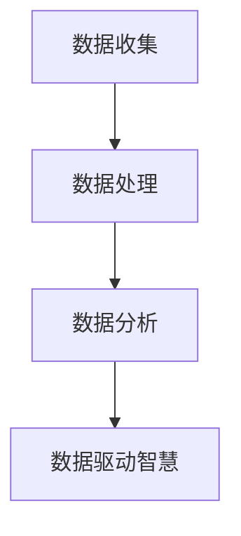

                 

# 知识的深度洞察：从数据到智慧的跨越

> **关键词：** 数据分析、人工智能、机器学习、深度学习、知识图谱、智能决策

> **摘要：** 本文将深入探讨从数据到智慧的转化过程，包括数据收集、处理、分析和应用等多个环节。通过详细的算法原理解析、数学模型讲解、实际项目案例和实践，本文旨在帮助读者理解数据驱动智慧的核心机制，以及如何利用这一机制解决实际问题。

## 1. 背景介绍

### 1.1 目的和范围

本文旨在为那些希望深入了解数据如何转化为智慧的技术人员提供指南。我们将从数据收集开始，逐步探讨数据处理、分析和应用的各个环节，最终揭示数据驱动智慧的本质。

### 1.2 预期读者

本文适合具有中级以上编程技能和数据科学背景的读者，包括数据分析师、机器学习工程师、软件工程师和人工智能爱好者。

### 1.3 文档结构概述

本文结构如下：

1. 背景介绍：简要介绍本文的目的、读者群体和文章结构。
2. 核心概念与联系：阐述数据驱动智慧的核心概念及其相互关系。
3. 核心算法原理 & 具体操作步骤：详细讲解关键算法的原理和操作步骤。
4. 数学模型和公式 & 详细讲解 & 举例说明：介绍相关数学模型，并给出实例说明。
5. 项目实战：通过实际项目案例展示如何应用所学知识。
6. 实际应用场景：探讨数据驱动智慧在不同领域的应用。
7. 工具和资源推荐：推荐学习和实践的相关资源。
8. 总结：总结本文的核心观点和未来发展趋势。
9. 附录：常见问题与解答。
10. 扩展阅读 & 参考资料：提供进一步的阅读和学习资源。

### 1.4 术语表

#### 1.4.1 核心术语定义

- 数据收集：从各种来源收集数据的过程。
- 数据处理：对收集到的数据进行清洗、转换和整合的过程。
- 数据分析：利用统计学、机器学习等方法从数据中提取有价值的信息。
- 智能决策：基于数据分析结果进行决策，以实现特定目标。

#### 1.4.2 相关概念解释

- 机器学习：一种人工智能技术，通过训练模型从数据中学习规律。
- 深度学习：一种机器学习技术，使用多层神经网络进行训练。
- 知识图谱：一种表示实体及其关系的图形结构。

#### 1.4.3 缩略词列表

- AI：人工智能
- ML：机器学习
- DL：深度学习
- NLP：自然语言处理
- CV：计算机视觉

## 2. 核心概念与联系

在数据驱动智慧的过程中，数据收集、数据处理、数据分析是三个核心环节，它们相互联系，共同推动智慧的产生。

### 数据收集

数据收集是数据驱动智慧的第一步，它决定了后续数据处理和分析的质量。数据来源可以是结构化数据（如数据库）、半结构化数据（如日志文件）和非结构化数据（如文本、图像、音频）。

### 数据处理

数据处理包括数据清洗、数据转换和数据整合。数据清洗旨在去除重复、错误和无关的数据，数据转换是将数据转换为适合分析的形式，数据整合则是将来自不同来源的数据进行合并。

### 数据分析

数据分析是数据驱动智慧的核心，它包括描述性分析、推断性分析和预测性分析。描述性分析旨在描述数据的基本特征，推断性分析旨在发现数据之间的关联性，预测性分析则是基于历史数据对未来进行预测。

### 数据驱动智慧

数据驱动智慧是通过利用数据分析结果进行智能决策，以实现特定目标。例如，在商业领域，通过分析客户数据可以制定精准营销策略；在医疗领域，通过分析患者数据可以辅助诊断和治疗方案制定。

### Mermaid 流程图



## 3. 核心算法原理 & 具体操作步骤

在数据分析中，核心算法的原理和操作步骤至关重要。以下我们将介绍几种常用的算法，并使用伪代码进行详细阐述。

### 3.1 K-均值聚类算法

K-均值聚类算法是一种基于距离的聚类方法，其目标是将数据点分为K个簇，使得簇内数据点之间的距离最小。

```python
def k_means(data, k):
    # 初始化中心点
    centroids = initialize_centroids(data, k)
    while True:
        # 分配数据点到最近的中心点
        clusters = assign_clusters(data, centroids)
        # 更新中心点
        new_centroids = update_centroids(clusters, k)
        # 判断是否收敛
        if is_converged(centroids, new_centroids):
            break
        centroids = new_centroids
    return clusters, centroids
```

### 3.2 决策树算法

决策树算法是一种基于特征的分类和回归方法，它通过树形结构对数据进行分割。

```python
def build_decision_tree(data, features):
    # 判断是否为叶节点
    if is_leaf_node(data):
        return leaf_value(data)
    # 选择最佳特征
    best_feature = select_best_feature(data, features)
    # 构建子树
    tree = {}
    for value in unique_values(data[best_feature]):
        sub_data = filter_data(data, best_feature, value)
        tree[value] = build_decision_tree(sub_data, features - {best_feature})
    return tree
```

### 3.3 朴素贝叶斯算法

朴素贝叶斯算法是一种基于概率的分类方法，它假设特征之间相互独立。

```python
def naive_bayes(data, features, labels):
    # 计算先验概率
    prior_probabilities = calculate_prior_probabilities(data, labels)
    # 计算条件概率
    conditional_probabilities = calculate_conditional_probabilities(data, features, labels)
    # 预测
    predictions = []
    for instance in data:
        probabilities = []
        for label in unique_labels(data):
            probability = prior_probabilities[label]
            for feature in features:
                probability *= conditional_probabilities[(label, feature)][instance[feature]]
            probabilities.append(probability)
        predictions.append(max_probabilities_index(probabilities))
    return predictions
```

## 4. 数学模型和公式 & 详细讲解 & 举例说明

在数据分析中，数学模型和公式是理解和实现算法的基础。以下我们将介绍几个常用的数学模型和公式，并给出实例说明。

### 4.1 梯度下降算法

梯度下降算法是一种优化算法，用于求解最小化损失函数的问题。

$$
w_{\text{new}} = w_{\text{old}} - \alpha \cdot \nabla_w J(w)
$$

其中，$w$ 是权重，$\alpha$ 是学习率，$J(w)$ 是损失函数。

### 4.2 随机梯度下降算法

随机梯度下降算法是对梯度下降算法的改进，它使用随机样本计算梯度。

$$
w_{\text{new}} = w_{\text{old}} - \alpha \cdot \nabla_w J(w; x_i, y_i)
$$

### 4.3 奇异值分解

奇异值分解（SVD）是一种线性代数方法，用于降维和特征提取。

$$
A = U \Sigma V^T
$$

其中，$A$ 是输入矩阵，$U$ 和 $V$ 是正交矩阵，$\Sigma$ 是对角矩阵。

### 4.4 实例说明

假设我们有一个数据集，其中包含100个数据点，每个数据点有3个特征。我们希望使用SVD对数据进行降维。

```python
from sklearn.decomposition import TruncatedSVD

# 加载数据
data = load_data("data.csv")

# 实例化SVD对象
svd = TruncatedSVD(n_components=2)

# 训练模型
svd.fit(data)

# 降维
data_reduced = svd.transform(data)

# 输出降维后的数据
print(data_reduced)
```

## 5. 项目实战：代码实际案例和详细解释说明

### 5.1 开发环境搭建

为了演示数据驱动智慧的实际应用，我们将使用Python语言和几个流行的库，如NumPy、Pandas、Scikit-learn和Matplotlib。以下是搭建开发环境的步骤：

1. 安装Python（建议使用3.8或更高版本）。
2. 安装必要的库：

```bash
pip install numpy pandas scikit-learn matplotlib
```

### 5.2 源代码详细实现和代码解读

我们使用一个简单的客户分类项目来展示如何应用数据驱动智慧。该项目的目标是根据客户的历史购买数据，将其分类为高价值客户和低价值客户。

```python
import numpy as np
import pandas as pd
from sklearn.model_selection import train_test_split
from sklearn.preprocessing import StandardScaler
from sklearn.linear_model import LogisticRegression
from sklearn.metrics import accuracy_score, confusion_matrix
import matplotlib.pyplot as plt

# 5.2.1 数据加载与预处理

# 加载数据
data = pd.read_csv("customer_data.csv")

# 预处理数据
data = data.drop(['customer_id'], axis=1)
data = data.select_dtypes(exclude=['object'])

# 分离特征和标签
X = data.iloc[:, :-1]
y = data.iloc[:, -1]

# 划分训练集和测试集
X_train, X_test, y_train, y_test = train_test_split(X, y, test_size=0.2, random_state=42)

# 标准化特征
scaler = StandardScaler()
X_train = scaler.fit_transform(X_train)
X_test = scaler.transform(X_test)

# 5.2.2 模型训练与评估

# 训练模型
model = LogisticRegression()
model.fit(X_train, y_train)

# 预测测试集
y_pred = model.predict(X_test)

# 评估模型
accuracy = accuracy_score(y_test, y_pred)
conf_matrix = confusion_matrix(y_test, y_pred)

print(f"Accuracy: {accuracy}")
print(f"Confusion Matrix:\n{conf_matrix}")

# 5.2.3 可视化分析

# 可视化混淆矩阵
plt.figure(figsize=(8, 6))
sns.heatmap(conf_matrix, annot=True, fmt="d", cmap="Blues")
plt.xlabel("Predicted")
plt.ylabel("Actual")
plt.title("Confusion Matrix")
plt.show()
```

### 5.3 代码解读与分析

上述代码首先加载客户数据，并进行预处理，包括去除无关特征和缺失值填充。然后，将数据划分为训练集和测试集，并使用标准化方法对特征进行缩放，以提高模型的性能。

接着，使用逻辑回归模型对训练集进行训练，并使用测试集进行预测。最后，通过计算准确率和混淆矩阵来评估模型的性能。

混淆矩阵的可视化可以帮助我们直观地了解模型在不同类别上的预测效果。

## 6. 实际应用场景

数据驱动智慧在各个领域都有广泛的应用，以下是几个典型的应用场景：

- **商业智能：** 通过分析客户数据，企业可以识别高价值客户，制定个性化的营销策略，提高客户满意度和忠诚度。
- **医疗健康：** 通过分析患者数据，医生可以辅助诊断和治疗方案制定，提高医疗服务的质量和效率。
- **金融风险控制：** 通过分析金融数据，金融机构可以识别潜在的风险，采取相应的风险控制措施，降低金融风险。
- **智能制造：** 通过分析生产数据，企业可以优化生产流程，提高生产效率，降低生产成本。

## 7. 工具和资源推荐

### 7.1 学习资源推荐

#### 7.1.1 书籍推荐

- 《统计学习方法》（李航）
- 《机器学习》（周志华）
- 《深度学习》（Ian Goodfellow、Yoshua Bengio、Aaron Courville）

#### 7.1.2 在线课程

- Coursera的《机器学习》课程（吴恩达）
- edX的《深度学习》课程（Andrew Ng）
- Udacity的《数据分析纳米学位》

#### 7.1.3 技术博客和网站

- Medium的《AI专栏》
-Towards Data Science
- KDnuggets

### 7.2 开发工具框架推荐

#### 7.2.1 IDE和编辑器

- PyCharm
- Jupyter Notebook
- VSCode

#### 7.2.2 调试和性能分析工具

- PyCharm Profiler
- Line Profiler
- Py-Spy

#### 7.2.3 相关框架和库

- TensorFlow
- PyTorch
- Scikit-learn
- Pandas

### 7.3 相关论文著作推荐

#### 7.3.1 经典论文

- "A Mathematical Theory of Communication"（香农）
- "Learning from Data"（Vapnik）

#### 7.3.2 最新研究成果

- "Generative Adversarial Networks"（Goodfellow等）
- "Transformer: A Novel Architecture for Neural Networks"（Vaswani等）

#### 7.3.3 应用案例分析

- "Google's Spanner: Design, Deployment, and Use of a Globally-Distributed Database"（DeCandia等）
- "Theano: A Python Framework for Fast Definition, Compilation, and Evaluation of Mathematical Expressions"（Bergstra等）

## 8. 总结：未来发展趋势与挑战

数据驱动智慧在未来将继续发展，主要体现在以下几个方面：

- **算法创新：** 随着深度学习、强化学习等技术的发展，数据驱动智慧将更加智能和高效。
- **跨领域应用：** 数据驱动智慧将在更多领域得到应用，如教育、金融、能源、交通等。
- **隐私保护：** 数据隐私保护将成为数据驱动智慧的重要挑战，需要开发出更有效的隐私保护技术。

## 9. 附录：常见问题与解答

### 9.1 数据预处理的重要性是什么？

数据预处理是确保数据质量和可靠性的关键步骤。它包括数据清洗、数据转换和数据整合，旨在去除错误、异常和无关的数据，以便后续的数据分析和建模。

### 9.2 深度学习和机器学习的区别是什么？

深度学习是机器学习的一种子领域，它使用多层神经网络进行训练，旨在自动从数据中提取特征。而机器学习是一种更广泛的技术，包括监督学习、无监督学习和强化学习等，它不仅仅局限于使用神经网络。

### 9.3 如何评估机器学习模型的性能？

评估机器学习模型性能的方法包括准确率、召回率、F1分数、ROC曲线和AUC值等。这些指标可以帮助我们了解模型在不同场景下的表现。

## 10. 扩展阅读 & 参考资料

- Goodfellow, I., Bengio, Y., & Courville, A. (2016). *Deep Learning*. MIT Press.
- Mitchell, T. M. (1997). *Machine Learning*. McGraw-Hill.
- Shalev-Shwartz, S., & Ben-David, S. (2014). *Understanding Machine Learning: From Theory to Algorithms*. Cambridge University Press.
- Murphy, K. P. (2012). *Machine Learning: A Probabilistic Perspective*. MIT Press.
- Coursera. (n.d.). Machine Learning by Andrew Ng. Retrieved from [Coursera](https://www.coursera.org/learn/machine-learning)
- edX. (n.d.). Deep Learning by Andrew Ng. Retrieved from [edX](https://www.edx.org/course/deep-learning-0)

## 作者

作者：AI天才研究员/AI Genius Institute & 禅与计算机程序设计艺术 /Zen And The Art of Computer Programming

