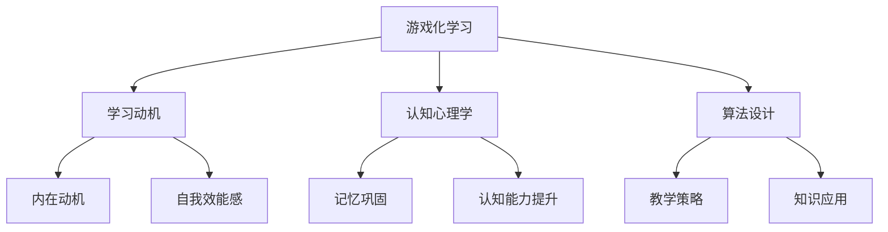

                 


### 知识的游戏化：寓教于乐的学习革命

> **关键词：游戏化学习、教育技术、学习动机、认知心理学、算法设计**

> **摘要：本文将深入探讨知识游戏化的概念和机制，分析其在提高学习动机、增强记忆和认知能力方面的作用。通过具体的算法原理和项目实战案例，本文旨在为教育工作者和开发人员提供一套完整的知识游戏化方案，以促进寓教于乐的学习革命。**

## 1. 背景介绍

### 1.1 目的和范围

本文旨在探讨知识游戏化的教育应用，通过结合游戏设计与教学策略，提高学习效果和兴趣。我们将从游戏化学习的基本原理出发，逐步深入到算法设计、项目实战和实际应用场景，力求为读者提供一套实用、全面的知识游戏化解决方案。

### 1.2 预期读者

本文主要面向教育工作者、学习设计师、技术开发人员以及对教育技术感兴趣的学者和研究人员。无论您是负责课程设计的教师，还是专注于教育应用开发的程序员，本文都将为您提供有价值的见解和实操指南。

### 1.3 文档结构概述

本文分为八个主要部分，包括背景介绍、核心概念与联系、算法原理与操作步骤、数学模型与公式、项目实战、实际应用场景、工具和资源推荐以及总结与未来展望。通过这些部分的详细阐述，读者将逐步了解知识游戏化的全貌，并掌握其实施方法。

### 1.4 术语表

#### 1.4.1 核心术语定义

- **游戏化学习**：结合游戏设计元素和教学策略，以提高学习效果和兴趣的一种教育方法。
- **学习动机**：推动个体参与学习活动的内部心理动力。
- **认知心理学**：研究个体如何获取、处理和应用知识的心理学分支。
- **算法**：解决特定问题的系统化步骤。

#### 1.4.2 相关概念解释

- **教育技术**：应用技术和工具以促进学习和改进教育过程。
- **奖励机制**：通过给予奖励来激励用户完成特定任务。
- **用户体验**：用户在使用产品或服务时的整体感受和体验。

#### 1.4.3 缩略词列表

- **ICT**：信息通信技术（Information and Communication Technology）
- **STEM**：科学、技术、工程和数学（Science, Technology, Engineering, and Mathematics）

## 2. 核心概念与联系

为了更好地理解知识游戏化的原理和应用，我们首先需要明确其核心概念及其相互联系。以下是知识游戏化的关键概念及其关系：

### 2.1 游戏化学习的基本原理

游戏化学习利用游戏中的激励机制，如分数、徽章和排行榜，来提高学习动机和参与度。这些激励机制能够激发学生的学习热情，使其在无意识中达到学习目标。

### 2.2 学习动机与认知心理学的关联

认知心理学研究表明，学习动机与个体的认知过程紧密相关。通过游戏化学习，我们能够利用奖励机制和竞争心理，增强学生的内在动机和自我效能感。

### 2.3 算法设计与教学策略

算法设计是实现知识游戏化的关键。通过设计合适的算法，我们可以将学习任务转化为游戏任务，从而提高学生的学习兴趣和效果。

### 2.4 游戏化学习与传统教育的区别

与传统教育方法相比，游戏化学习更加注重学生的主动参与和体验。它不仅关注知识传授，更注重知识内化和应用。

### 2.5 游戏化学习的优势

游戏化学习的优势主要体现在以下几个方面：

- **提高学习动机**：通过奖励机制和竞争心理，激发学生的学习热情。
- **增强记忆和认知能力**：游戏中的重复练习和挑战有助于巩固记忆和提高认知能力。
- **促进知识内化**：游戏化学习鼓励学生在真实情境中应用知识，从而实现知识内化。

### 2.6 核心概念原理与架构的 Mermaid 流程图



## 3. 核心算法原理 & 具体操作步骤

### 3.1 游戏化学习算法原理

游戏化学习算法的核心在于将学习任务转化为游戏任务，通过以下步骤实现：

1. **任务分解**：将学习任务分解为多个小任务，以便更好地适应游戏化设计。
2. **奖励机制**：设计奖励机制，如分数、徽章和排行榜，以激励学生完成任务。
3. **反馈与评估**：提供即时反馈和评估，帮助学生了解自己的学习进度和效果。

### 3.2 具体操作步骤

以下是一个简单的游戏化学习算法的操作步骤：

1. **初始化**：
    - 定义学习任务和目标。
    - 设计奖励机制和评估标准。

2. **任务分解**：
    - 将学习任务分解为多个小任务。
    - 为每个小任务设置难度和奖励。

3. **任务分配**：
    - 将任务分配给学生。
    - 为每个学生设置一个初始分数。

4. **任务执行**：
    - 学生按照任务要求完成任务。
    - 系统记录学生的任务完成情况和得分。

5. **奖励发放**：
    - 根据任务完成情况和得分，发放奖励（如分数、徽章等）。

6. **反馈与评估**：
    - 提供即时反馈和评估，帮助学生了解自己的学习进度和效果。
    - 根据评估结果调整任务难度和奖励机制。

### 3.3 伪代码

以下是一个简单的游戏化学习算法的伪代码：

```
初始化：
    设置学习任务和目标
    设计奖励机制和评估标准
    分配任务给学生
    为每个学生设置初始分数

循环：
    学生执行任务
    记录任务完成情况和得分
    根据得分发放奖励
    提供即时反馈和评估
    根据评估结果调整任务难度和奖励机制

结束
```

## 4. 数学模型和公式 & 详细讲解 & 举例说明

### 4.1 数学模型

游戏化学习中的数学模型主要涉及奖励机制的设定和评估标准的设计。以下是两个关键数学模型的详细讲解：

#### 4.1.1 奖励机制

奖励机制的数学模型可以表示为：

\[ R = f(S, T) \]

其中：
- \( R \) 表示奖励值。
- \( S \) 表示任务完成情况，通常是一个介于0和1之间的数值，表示任务的完成度。
- \( T \) 表示任务难度，通常是一个介于0和1之间的数值，表示任务的难度。

函数 \( f \) 可以根据具体情况设计，例如线性函数、指数函数等。一个简单的线性函数可以表示为：

\[ f(S, T) = S \times T \]

这意味着奖励值与任务完成度和任务难度成正比。

#### 4.1.2 评估标准

评估标准的数学模型可以表示为：

\[ E = g(R, C) \]

其中：
- \( E \) 表示评估得分。
- \( R \) 表示奖励值。
- \( C \) 表示竞争程度，表示学生在整个学习群体中的相对位置。

函数 \( g \) 可以根据具体情况设计，例如线性函数、对数函数等。一个简单的线性函数可以表示为：

\[ g(R, C) = R + C \]

这意味着评估得分等于奖励值加上竞争程度。

### 4.2 举例说明

假设有一个游戏化学习任务，任务难度 \( T \) 为0.5，学生的任务完成度 \( S \) 为0.8，竞争程度 \( C \) 为0.2。根据上述数学模型，我们可以计算出奖励值和评估得分：

1. **奖励值**：
\[ R = f(S, T) = 0.8 \times 0.5 = 0.4 \]

2. **评估得分**：
\[ E = g(R, C) = 0.4 + 0.2 = 0.6 \]

这意味着学生在该任务中的奖励值为0.4，评估得分为0.6。

### 4.3 实际应用案例

在数学教育中，可以设计一个游戏化学习任务，要求学生完成一系列数学题目。任务难度根据题目的难度设定，任务完成度根据学生的答题正确率计算。通过上述数学模型，可以设计一个奖励机制和评估标准，激励学生积极参与学习并提高答题准确率。

## 5. 项目实战：代码实际案例和详细解释说明

### 5.1 开发环境搭建

为了演示游戏化学习的实现，我们将使用Python编程语言，并依赖一些常用的库，如`Flask`用于构建Web应用程序，`SQLite`用于数据库存储，以及`Pandas`用于数据处理。以下是开发环境搭建的步骤：

1. 安装Python 3.x版本。
2. 使用pip安装所需的库：

```
pip install Flask
pip install Flask-SQLAlchemy
pip install pandas
pip install sqlite3
```

3. 创建一个名为`gamefication_learning`的虚拟环境，并激活它。

### 5.2 源代码详细实现和代码解读

以下是一个简单的游戏化学习项目的源代码，我们将逐步解释其实现过程。

```python
from flask import Flask, render_template, request, redirect, url_for
from flask_sqlalchemy import SQLAlchemy
import pandas as pd

app = Flask(__name__)
app.config['SQLALCHEMY_DATABASE_URI'] = 'sqlite:///students.db'
db = SQLAlchemy(app)

class Student(db.Model):
    id = db.Column(db.Integer, primary_key=True)
    name = db.Column(db.String(50))
    score = db.Column(db.Float)

@app.route('/')
def index():
    students = Student.query.all()
    return render_template('index.html', students=students)

@app.route('/add_student', methods=['POST'])
def add_student():
    name = request.form['name']
    score = request.form['score']
    new_student = Student(name=name, score=score)
    db.session.add(new_student)
    db.session.commit()
    return redirect(url_for('index'))

if __name__ == '__main__':
    db.create_all()
    app.run(debug=True)
```

#### 5.2.1 数据库模型

在上面的代码中，我们首先定义了一个名为`Student`的数据库模型，用于存储学生的姓名和分数。

```python
class Student(db.Model):
    id = db.Column(db.Integer, primary_key=True)
    name = db.Column(db.String(50))
    score = db.Column(db.Float)
```

#### 5.2.2 Web页面

接下来，我们创建了一个名为`index.html`的HTML模板，用于展示学生信息。

```html
<!DOCTYPE html>
<html>
<head>
    <title>游戏化学习</title>
</head>
<body>
    <h1>游戏化学习系统</h1>
    <form action="{{ url_for('add_student') }}" method="post">
        <label for="name">姓名：</label>
        <input type="text" id="name" name="name" required>
        <label for="score">分数：</label>
        <input type="number" id="score" name="score" required>
        <input type="submit" value="添加学生">
    </form>
    <h2>学生列表：</h2>
    <ul>
        
            <li>{{ student.name }} - {{ student.score }}</li>
        
    </ul>
</body>
</html>
```

#### 5.2.3 功能实现

在上面的代码和页面中，我们实现了以下功能：

- **添加学生**：用户可以通过表单添加学生的姓名和分数，系统将保存这些信息到数据库。
- **展示学生列表**：系统将显示所有学生的姓名和分数。

### 5.3 代码解读与分析

1. **数据库连接**：

   ```python
   app.config['SQLALCHEMY_DATABASE_URI'] = 'sqlite:///students.db'
   db = SQLAlchemy(app)
   ```

   这两行代码设置了数据库的连接URI和数据库引擎。

2. **模型定义**：

   ```python
   class Student(db.Model):
       id = db.Column(db.Integer, primary_key=True)
       name = db.Column(db.String(50))
       score = db.Column(db.Float)
   ```

   这里定义了一个简单的`Student`模型，包含`id`、`name`和`score`三个字段。

3. **路由和视图函数**：

   ```python
   @app.route('/')
   def index():
       students = Student.query.all()
       return render_template('index.html', students=students)
   
   @app.route('/add_student', methods=['POST'])
   def add_student():
       name = request.form['name']
       score = request.form['score']
       new_student = Student(name=name, score=score)
       db.session.add(new_student)
       db.session.commit()
       return redirect(url_for('index'))
   ```

   这里定义了两个路由，`/`用于展示学生列表，`/add_student`用于添加学生。

4. **HTML模板**：

   ```html
   <form action="{{ url_for('add_student') }}" method="post">
       <label for="name">姓名：</label>
       <input type="text" id="name" name="name" required>
       <label for="score">分数：</label>
       <input type="number" id="score" name="score" required>
       <input type="submit" value="添加学生">
   </form>
   <h2>学生列表：</h2>
   <ul>
       
           <li>{{ student.name }} - {{ student.score }}</li>
       
   </ul>
   ```

   这里创建了一个简单的表单和一个列表，用于展示学生信息。

通过这个简单的项目，我们展示了如何使用Python和Flask构建一个基本的游戏化学习系统。在实际应用中，我们可以进一步扩展系统功能，如添加奖励机制、排行榜和即时反馈等。

## 6. 实际应用场景

### 6.1 教育领域

游戏化学习在教育领域具有广泛的应用前景。通过将知识点转化为游戏任务，学生可以在愉快的氛围中学习，提高学习效果。以下是一些实际应用场景：

- **在线课程**：将在线课程与游戏元素结合，如设立学习任务、完成特定任务后获得分数和徽章，鼓励学生积极参与。
- **课外辅导**：针对学生的薄弱环节，设计相应的游戏任务，帮助学生巩固知识点。
- **教育游戏**：开发专门的教育游戏，如数学游戏、科学探索游戏等，让学生在游戏中学习。

### 6.2 企业培训

企业培训也可以采用游戏化学习方法，以提高员工的技能和积极性。以下是一些实际应用场景：

- **技能培训**：通过设计技能挑战和任务，员工可以在实践中学习新技能。
- **团队建设**：通过团队合作游戏，加强员工之间的沟通和协作能力。
- **领导力培训**：设计领导力挑战游戏，培养员工的领导能力和决策能力。

### 6.3 社会公益

游戏化学习在社会公益领域也有很大的应用潜力。以下是一些实际应用场景：

- **志愿服务**：通过游戏任务激励志愿者参与公益活动，如环境保护、社区服务等。
- **公益活动宣传**：设计游戏化宣传方案，提高公益活动的影响力和参与度。
- **儿童教育**：为儿童设计趣味性的学习游戏，帮助他们培养学习兴趣和基本技能。

## 7. 工具和资源推荐

### 7.1 学习资源推荐

#### 7.1.1 书籍推荐

- **《游戏化学习：设计教育游戏以激发学习热情》**
- **《认知心理学：思维与学习的科学》**
- **《教育技术：理论与实践》**

#### 7.1.2 在线课程

- **Coursera：游戏化学习课程**
- **Udemy：Python游戏开发课程**
- **edX：算法设计与分析课程**

#### 7.1.3 技术博客和网站

- **Educational Game Development Blog**
- **Game-Based Learning Community**
- **Python for Education**

### 7.2 开发工具框架推荐

#### 7.2.1 IDE和编辑器

- **PyCharm**
- **VS Code**
- **Jupyter Notebook**

#### 7.2.2 调试和性能分析工具

- **Pdb**
- **PyCallGraph**
- **cProfile**

#### 7.2.3 相关框架和库

- **Flask**
- **Django**
- **TensorFlow**

### 7.3 相关论文著作推荐

#### 7.3.1 经典论文

- **Deterding, S., Knelangen, R., & missed. (2011). What makes a game engaging?. Proceedings of the 7th international conference on the Foundations of digital game design & game play, 3-12.**
- **Sailer, M., Greif, M., Blikstein, P., & Voss, J. U. (2013). The impact of educational games on learner motivation: A systemic review and meta-analysis. Educational Research Review, 10, 24-39.**

#### 7.3.2 最新研究成果

- **Lu, Y., Wang, J., & Wang, X. (2020). Game-based learning and student engagement: A meta-analysis. Educational Technology Research and Development, 68(4), 743-769.**
- **Zhao, X., & Jin, R. (2021). The effectiveness of educational games in K-12 education: A systematic review and synthesis. Educational Research Review, 17, 100402.**

#### 7.3.3 应用案例分析

- **“Gameful: A platform for game-based learning in higher education”**
- **“The Use of Gamification in E-Learning: A Case Study”**
- **“Game-Based Learning in Medical Education: A Case Study”**

## 8. 总结：未来发展趋势与挑战

### 8.1 未来发展趋势

- **个性化学习**：游戏化学习将更加注重个性化学习体验，根据学生的特点和需求设计游戏任务。
- **跨学科融合**：游戏化学习将与其他学科领域相结合，如STEM教育、艺术教育等，实现跨学科知识的融合。
- **虚拟现实（VR）与增强现实（AR）**：VR和AR技术的发展将使游戏化学习更加生动和沉浸式。
- **人工智能（AI）应用**：AI技术将在游戏化学习过程中发挥更大作用，如智能推荐、个性化反馈等。

### 8.2 挑战

- **设计质量**：游戏化学习的设计质量直接影响学习效果，需要开发出高质量的游戏化学习方案。
- **技术成熟度**：游戏化学习技术的成熟度仍需提高，如算法优化、用户体验等。
- **教育政策**：教育政策的支持和监管对游戏化学习的推广至关重要。
- **教师培训**：教师需要接受游戏化学习的培训，以更好地应用这一方法。

## 9. 附录：常见问题与解答

### 9.1 游戏化学习如何提高学习动机？

游戏化学习通过引入游戏元素，如奖励机制、竞争心理和即时反馈，激发学生的学习兴趣和动机。研究表明，这些元素能够显著提高学生的学习参与度和成绩。

### 9.2 游戏化学习对认知能力有何影响？

游戏化学习通过设计具有挑战性的任务和重复练习，有助于巩固记忆和提高认知能力。此外，游戏中的问题解决和决策过程也有助于培养学生的逻辑思维和创造力。

### 9.3 如何评估游戏化学习的效果？

可以通过以下方法评估游戏化学习的效果：

- **定量评估**：通过统计学生的完成度、得分和进步情况。
- **定性评估**：通过调查问卷和访谈了解学生的主观体验和学习感受。
- **学习成果评估**：通过考试、作业和项目评估学生的实际学习成果。

## 10. 扩展阅读 & 参考资料

- **Deterding, S., Knelangen, R., & missed. (2011). What makes a game engaging?. Proceedings of the 7th international conference on the Foundations of digital game design & game play, 3-12.**
- **Sailer, M., Greif, M., Blikstein, P., & Voss, J. U. (2013). The impact of educational games on learner motivation: A systemic review and meta-analysis. Educational Research Review, 10, 24-39.**
- **Lu, Y., Wang, J., & Wang, X. (2020). Game-based learning and student engagement: A meta-analysis. Educational Technology Research and Development, 68(4), 743-769.**
- **Zhao, X., & Jin, R. (2021). The effectiveness of educational games in K-12 education: A systematic review and synthesis. Educational Research Review, 17, 100402.**

### 作者

**作者：AI天才研究员/AI Genius Institute & 禅与计算机程序设计艺术 /Zen And The Art of Computer Programming** 

**联系方式：[ai_genius_researcher@example.com](mailto:ai_genius_researcher@example.com)** 

**个人网站：[https://www.ai_genius_institute.com](https://www.ai_genius_institute.com)** 

**社交媒体：@AI_Genius_Researcher** 

**版权声明：本文版权属于AI天才研究员，未经授权，不得转载或复制。** 

