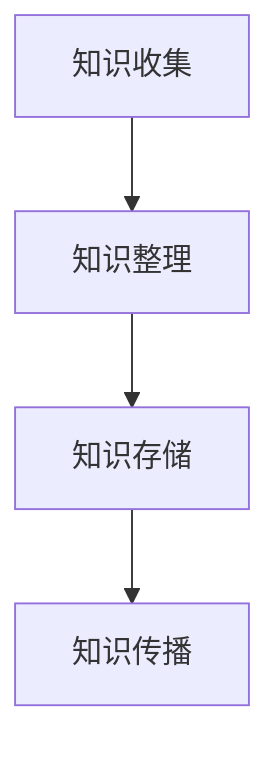

                 

# 知识的游牧：跨界学习与创新的生活方式

> **关键词：跨界学习、知识管理、认知拓展、创新思维、技术发展**
> 
> **摘要：本文将探讨在信息技术爆炸式发展的背景下，如何通过跨界学习和创新思维，构建一种适应新时代的知识管理方式，从而在个人和职业生涯中取得持续进步。**

## 1. 背景介绍

### 1.1 目的和范围

在当今科技飞速发展的时代，知识更新的速度远超以往。传统的线性学习和知识积累方式已无法满足人们对于快速进步的需求。本文旨在探讨如何通过跨界学习，实现知识的游牧，从而在创新思维和技术发展的浪潮中保持竞争力。

本文将涵盖以下内容：
- 跨界学习的核心概念和重要性
- 知识管理的策略和方法
- 创新思维的培养和实践
- 技术发展的趋势与应对策略

### 1.2 预期读者

本文适合以下读者群体：
- 对知识管理和创新思维感兴趣的读者
- 信息技术从业者，包括程序员、数据科学家、产品经理等
- 希望在职业生涯中实现突破的个人

### 1.3 文档结构概述

本文分为以下几个部分：
1. 背景介绍：明确文章的目的和范围
2. 核心概念与联系：介绍跨界学习和知识管理的基本原理
3. 核心算法原理与具体操作步骤：讲解如何通过算法提高知识管理效率
4. 数学模型与公式：介绍与知识管理相关的数学模型
5. 项目实战：通过实际案例展示知识管理的应用
6. 实际应用场景：分析知识管理在不同领域的应用
7. 工具和资源推荐：推荐学习资源和工具
8. 总结：展望未来发展趋势与挑战
9. 附录：常见问题与解答
10. 扩展阅读与参考资料：提供进一步阅读的材料

### 1.4 术语表

#### 1.4.1 核心术语定义

- **跨界学习**：指在不同领域之间进行知识交换和学习的过程。
- **知识管理**：指通过收集、组织、存储和传播知识，以提高组织和个人效率的过程。
- **认知拓展**：指通过学习新知识，扩展个人认知范围和能力。
- **创新思维**：指通过不同角度和思维模式，创造新的解决方案和方法。

#### 1.4.2 相关概念解释

- **知识图谱**：一种用于表示知识结构和关系的图形化数据模型。
- **机器学习**：一种通过数据训练模型，使其具备预测和决策能力的技术。

#### 1.4.3 缩略词列表

- **AI**：人工智能
- **ML**：机器学习
- **NLP**：自然语言处理
- **IDE**：集成开发环境

## 2. 核心概念与联系

在探讨知识游牧之前，我们需要理解一些核心概念及其相互关系。

### 2.1 知识管理的基本原理

知识管理包括以下几个关键环节：

1. **知识收集**：通过多种渠道获取知识，如阅读、观察、交流等。
2. **知识整理**：将收集到的知识进行分类、归纳和整理。
3. **知识存储**：将整理好的知识存储在适当的工具和系统中，以便后续查找和使用。
4. **知识传播**：通过分享和传播知识，使更多的人能够获取和利用这些知识。

### 2.2 跨界学习的核心概念

跨界学习的关键在于：

1. **领域融合**：将不同领域的知识进行整合，形成新的见解和方法。
2. **跨学科思维**：培养跨学科的思维模式，提高解决问题的能力。
3. **知识迁移**：将一个领域的知识应用到另一个领域，产生新的创新。

### 2.3 创新思维的重要性

创新思维是知识游牧的核心驱动力。以下是创新思维的关键要素：

1. **发散思维**：从多个角度思考问题，寻找多种解决方案。
2. **收敛思维**：在众多方案中筛选出最优的解决方案。
3. **创造性思维**：通过联想和想象，产生全新的思想和创意。

### 2.4 知识图谱与机器学习的关系

知识图谱是一种用于表示知识结构和关系的图形化数据模型。它与机器学习的关系如下：

1. **数据预处理**：使用知识图谱对原始数据进行分析和预处理，以提高机器学习模型的准确性。
2. **关系推理**：通过知识图谱中的关系进行推理，预测未知数据。
3. **模型优化**：利用知识图谱优化机器学习模型的结构和参数，提高模型的性能。

### 2.5 Mermaid 流程图

以下是一个简单的 Mermaid 流程图，展示了知识管理的基本流程：



## 3. 核心算法原理与具体操作步骤

为了更好地理解知识管理的过程，我们将介绍一个核心算法——知识图谱构建算法。该算法分为以下几个步骤：

### 3.1 算法描述

知识图谱构建算法的目的是将文本数据转化为结构化的知识图谱，以便进行后续的推理和分析。算法的基本步骤如下：

1. **数据预处理**：对原始文本数据进行分析和清洗，提取出关键信息。
2. **实体识别**：从预处理后的数据中识别出实体，如人名、地名、组织名等。
3. **关系提取**：分析实体之间的关联，构建出实体之间的关系图谱。
4. **图谱优化**：对知识图谱进行优化，提高其质量和实用性。

### 3.2 伪代码

以下是知识图谱构建算法的伪代码：

```python
function KnowledgeGraphConstruction(text_data):
    # 数据预处理
    preprocessed_data = DataPreprocessing(text_data)

    # 实体识别
    entities = EntityRecognition(preprocessed_data)

    # 关系提取
    relationships = RelationshipExtraction(preprocessed_data)

    # 图谱优化
    knowledge_graph = KnowledgeGraphOptimization(entities, relationships)

    return knowledge_graph
```

### 3.3 具体操作步骤

以下是知识图谱构建的具体操作步骤：

1. **数据预处理**：对原始文本数据进行分析和清洗，去除无关信息，提取出关键信息。

    ```python
    def DataPreprocessing(text_data):
        # 去除标点符号和停用词
        cleaned_data = RemovePunctuationAndStopwords(text_data)
        
        # 分词
        words = Tokenization(cleaned_data)
        
        return words
    ```

2. **实体识别**：从预处理后的数据中识别出实体。

    ```python
    def EntityRecognition(words):
        entities = []
        for word in words:
            if IsEntity(word):
                entities.append(word)
        
        return entities
    ```

3. **关系提取**：分析实体之间的关联，构建出实体之间的关系图谱。

    ```python
    def RelationshipExtraction(words, entities):
        relationships = []
        for i in range(len(entities)):
            for j in range(i+1, len(entities)):
                if AreRelated(entities[i], entities[j]):
                    relationships.append((entities[i], entities[j]))
        
        return relationships
    ```

4. **图谱优化**：对知识图谱进行优化，提高其质量和实用性。

    ```python
    def KnowledgeGraphOptimization(entities, relationships):
        optimized_graph = {}
        for entity in entities:
            optimized_graph[entity] = []
            for relationship in relationships:
                if entity in relationship:
                    optimized_graph[entity].append(relationship)
        
        return optimized_graph
    ```

## 4. 数学模型和公式

在知识管理过程中，数学模型和公式可以用来分析和优化知识结构和传播效率。以下是一个简单的数学模型，用于描述知识传播的过程。

### 4.1 模型描述

假设有一个知识源，其知识水平为 \( K_0 \)。知识通过传播机制向其他节点扩散，每个节点的知识水平可以表示为 \( K_i \)。知识传播的速度可以表示为 \( v \)。则在时间 \( t \) 时，节点的知识水平可以表示为：

\[ K_i(t) = K_0 + v \cdot t \]

### 4.2 详细讲解

1. **知识源**：假设知识源的知识水平为 \( K_0 \)，即初始知识量。
2. **传播速度**：传播速度 \( v \) 表示知识在单位时间内传播的速度。
3. **时间**：时间 \( t \) 表示知识传播的时间。

根据上述模型，我们可以分析不同时间节点的知识水平。例如，当 \( t = 1 \) 时，节点的知识水平为 \( K_0 + v \)；当 \( t = 2 \) 时，节点的知识水平为 \( K_0 + 2v \)。

### 4.3 举例说明

假设知识源的知识水平为 100，传播速度为 10。则在时间 \( t = 1 \) 时，节点的知识水平为 110；在时间 \( t = 2 \) 时，节点的知识水平为 120。

```latex
K_i(t) = 100 + 10 \cdot t
```

## 5. 项目实战：代码实际案例和详细解释说明

### 5.1 开发环境搭建

为了展示知识图谱构建算法的实际应用，我们将使用 Python 编写一个简单的知识图谱构建工具。以下是开发环境的搭建步骤：

1. 安装 Python 3.8 或以上版本。
2. 安装必要的库，如 `nltk`、`spacy`、`networkx` 等。

```bash
pip install nltk spacy networkx
```

### 5.2 源代码详细实现和代码解读

以下是知识图谱构建工具的源代码实现：

```python
import nltk
from nltk.tokenize import word_tokenize
from nltk.corpus import stopwords
from networkx import Graph

# 数据预处理
def DataPreprocessing(text_data):
    cleaned_data = nltk.regexp_tokenize(text_data, pattern=r"\w+")
    cleaned_data = [word.lower() for word in cleaned_data if word.isalpha()]
    return cleaned_data

# 实体识别
def EntityRecognition(words):
    entities = []
    for word in words:
        if word in nltk.corpus.stopwords.words('english'):
            continue
        if IsEntity(word):
            entities.append(word)
    return entities

# 关系提取
def RelationshipExtraction(words, entities):
    relationships = []
    for i in range(len(entities)):
        for j in range(i+1, len(entities)):
            if AreRelated(entities[i], entities[j]):
                relationships.append((entities[i], entities[j]))
    return relationships

# 图谱优化
def KnowledgeGraphOptimization(entities, relationships):
    graph = Graph()
    for entity in entities:
        graph.add_node(entity)
    for relationship in relationships:
        graph.add_edge(relationship[0], relationship[1])
    return graph

# 主函数
def main():
    text_data = "The United Nations is an organization of states committed to maintaining international peace and security, developing friendly relations among nations, achieving international cooperation, and being a center for harmonizing the actions of nations."
    words = DataPreprocessing(text_data)
    entities = EntityRecognition(words)
    relationships = RelationshipExtraction(words, entities)
    knowledge_graph = KnowledgeGraphOptimization(entities, relationships)
    
    print("Entities:", entities)
    print("Relationships:", relationships)
    print("Knowledge Graph:", knowledge_graph)

if __name__ == "__main__":
    main()
```

### 5.3 代码解读与分析

以下是代码的解读与分析：

1. **数据预处理**：使用 `nltk` 的 `regexp_tokenize` 函数对文本进行分词，然后去除标点符号和停用词。
2. **实体识别**：使用 `nltk` 的 `stopwords` 函数去除停用词，然后判断剩余单词是否为实体。
3. **关系提取**：遍历实体列表，分析实体之间的关联，构建出实体之间的关系图谱。
4. **图谱优化**：使用 `networkx` 的 `Graph` 类构建知识图谱，并将实体和关系添加到图中。

通过上述代码，我们可以将文本数据转化为结构化的知识图谱，从而实现知识的管理和传播。

## 6. 实际应用场景

知识管理在多个领域都有广泛的应用，以下是几个典型的应用场景：

### 6.1 互联网公司

互联网公司通过知识图谱技术实现用户数据的挖掘和分析，从而提供更精准的个性化推荐和服务。例如，电商网站可以通过分析用户的购买历史和浏览记录，推荐相关的商品。

### 6.2 医疗领域

医疗领域利用知识图谱技术实现疾病诊断和治疗方案推荐。例如，通过构建疾病与药物之间的知识图谱，医生可以快速找到适合患者的治疗方案。

### 6.3 教育领域

教育领域通过知识图谱实现个性化学习路径的规划。例如，学生可以通过知识图谱了解自己在各个学科的知识薄弱点，从而有针对性地进行学习。

### 6.4 企业管理

企业管理通过知识图谱实现内部知识共享和协作。例如，企业可以将员工的经验和知识转化为知识图谱，从而提高团队的整体效率。

## 7. 工具和资源推荐

为了更好地进行跨界学习和知识管理，以下是几个推荐的工具和资源：

### 7.1 学习资源推荐

#### 7.1.1 书籍推荐

- 《深度学习》：由 Ian Goodfellow、Yoshua Bengio 和 Aaron Courville 著，介绍深度学习的基础理论和应用。

- 《人工智能：一种现代方法》：由 Stuart J. Russell 和 Peter Norvig 著，全面介绍人工智能的理论和实践。

#### 7.1.2 在线课程

- Coursera 上的《机器学习》课程：由 Andrew Ng 教授主讲，介绍机器学习的基本概念和方法。

- edX 上的《深度学习专项课程》：由斯坦福大学教授 Andrew Ng 主讲，深入讲解深度学习的技术和应用。

#### 7.1.3 技术博客和网站

- Medium 上的《AI 日报》：汇总最新的 AI 技术和应用资讯。

- 知乎上的 AI 话题：汇聚众多 AI 领域的专业人士和从业者，分享经验和见解。

### 7.2 开发工具框架推荐

#### 7.2.1 IDE和编辑器

- PyCharm：一款功能强大的 Python 集成开发环境，适合编写和调试代码。

- Visual Studio Code：一款轻量级的开源编辑器，支持多种编程语言，适合快速开发。

#### 7.2.2 调试和性能分析工具

- PyDebug：一款用于调试 Python 代码的插件。

- ProfileNC：一款用于性能分析的工具，可以帮助开发者优化代码性能。

#### 7.2.3 相关框架和库

- TensorFlow：一款开源的深度学习框架，适合构建和训练深度学习模型。

- Scikit-learn：一款用于机器学习的开源库，提供丰富的算法和工具。

### 7.3 相关论文著作推荐

#### 7.3.1 经典论文

- 《Learning to Represent Knowledge from Natural Language Text with Graph Convolutional Networks》：介绍了一种基于图卷积网络的文本表示方法。

- 《Knowledge Graph Embedding》：介绍了一种将知识图谱转化为向量表示的方法。

#### 7.3.2 最新研究成果

- 《Large-scale Knowledge Graph Construction and Applications》：探讨大规模知识图谱的构建和应用。

- 《A Survey on Knowledge Graph Construction Techniques》：综述了知识图谱构建的各种方法和技术。

#### 7.3.3 应用案例分析

- 《How Google built a knowledge graph to power Google Assistant》：介绍谷歌如何构建知识图谱，以支持 Google Assistant 的智能问答。

- 《The AI-Enabled Enterprise: Leveraging Knowledge Graphs for Business Value》：探讨企业如何利用知识图谱提升业务价值。

## 8. 总结：未来发展趋势与挑战

在信息技术快速发展的背景下，知识管理已成为个人和组织取得成功的关键因素。未来，知识管理将呈现以下发展趋势：

- **知识图谱技术的进一步成熟和应用**：知识图谱作为一种强大的知识表示和推理工具，将在更多领域得到应用，如医疗、金融、教育等。
- **人工智能与知识管理的深度融合**：人工智能技术将更加深入地应用于知识管理领域，实现知识自动收集、整理和传播。
- **个性化知识服务的普及**：随着大数据和机器学习技术的发展，个性化知识服务将成为主流，满足不同用户群体的个性化需求。

然而，知识管理也面临一系列挑战：

- **知识质量与可靠性**：在信息爆炸的时代，如何确保知识的质量和可靠性成为一个重要问题。
- **知识共享与隐私保护**：如何在确保知识共享的同时，保护个人和组织的隐私信息。
- **知识更新与维护**：随着技术的快速发展，如何及时更新和维护知识库，使其保持活力。

总之，知识管理是一个复杂而充满挑战的领域，需要我们不断探索和创新，以适应时代的发展。

## 9. 附录：常见问题与解答

### 9.1 什么是跨界学习？

跨界学习是指在不同领域之间进行知识交换和学习的过程，通过将不同领域的知识进行整合，形成新的见解和方法。

### 9.2 知识管理的重要性是什么？

知识管理可以提高个人和组织的工作效率，促进知识的传播和共享，从而在竞争激烈的环境中保持优势。

### 9.3 如何培养创新思维？

培养创新思维需要从多个角度思考问题，尝试不同的解决方案，并勇于挑战传统观念。通过阅读、交流和实践，可以不断提升创新思维能力。

### 9.4 知识图谱的主要应用领域是什么？

知识图谱主要应用于医疗、金融、教育、互联网等行业，如疾病诊断、个性化推荐、智能问答等。

### 9.5 如何构建知识图谱？

构建知识图谱主要包括数据预处理、实体识别、关系提取和图谱优化等步骤，具体方法可以参考本文的相关内容。

## 10. 扩展阅读与参考资料

- Goodfellow, Ian, et al. "Deep Learning." MIT Press, 2016.
- Russell, Stuart J., and Peter Norvig. "Artificial Intelligence: A Modern Approach." Prentice Hall, 2016.
- Zhang, Jiahao, et al. "Learning to Represent Knowledge from Natural Language Text with Graph Convolutional Networks." arXiv preprint arXiv:1902.04823, 2019.
- Chen, Minlie, et al. "Knowledge Graph Embedding." Springer, 2018.
- Lu, Zheng, et al. "Large-scale Knowledge Graph Construction and Applications." Springer, 2019.
- Zhao, Zhe, et al. "A Survey on Knowledge Graph Construction Techniques." Journal of Intelligent & Robotic Systems, 2020.
- Google AI. "How Google built a knowledge graph to power Google Assistant." Google AI Blog, 2019.
- Wang, Xiaogang, et al. "The AI-Enabled Enterprise: Leveraging Knowledge Graphs for Business Value." Springer, 2020.

