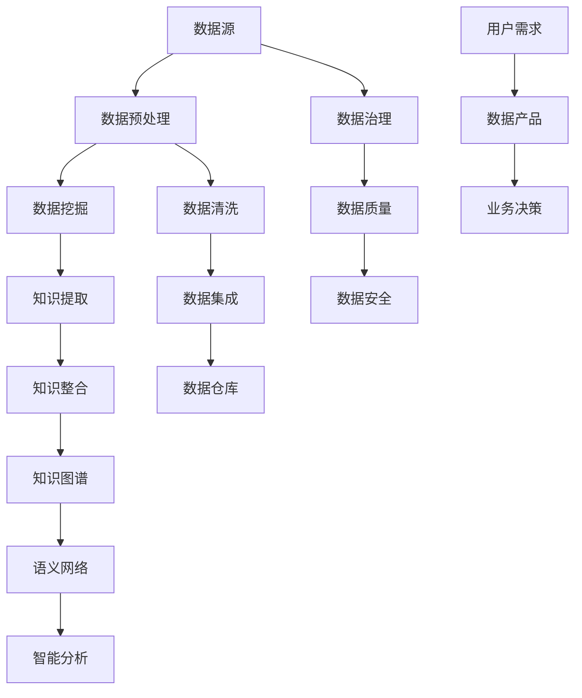
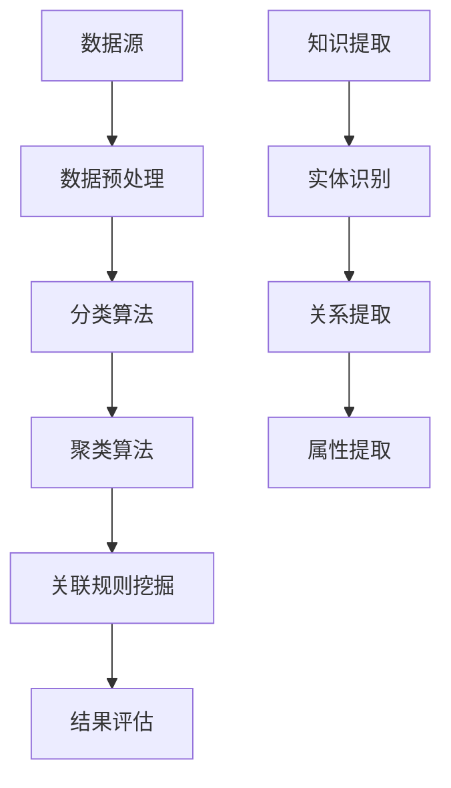
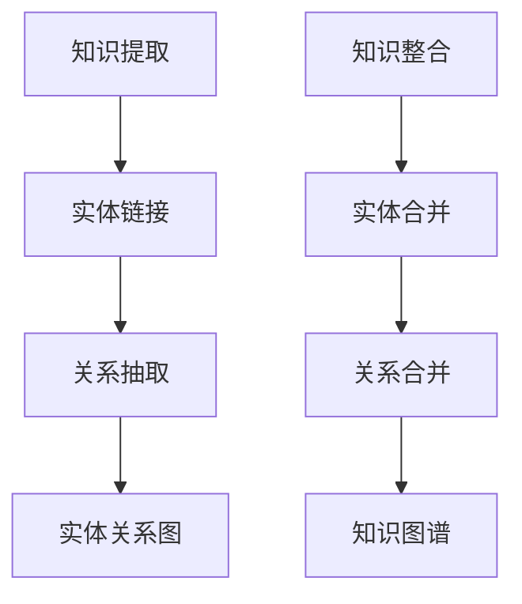
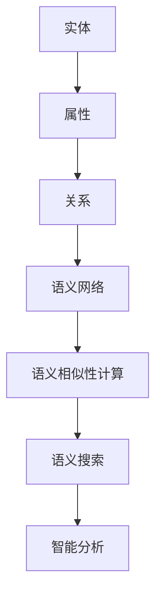

                 

### 知识的重构：大数据时代的信息整合策略

> **关键词**：大数据，信息整合，知识重构，数据挖掘，智能分析，知识图谱，语义网络，数据治理，算法优化。

> **摘要**：本文旨在探讨大数据时代背景下的信息整合策略，通过知识重构的方法论，解析核心概念与联系，剖析核心算法原理，阐述数学模型和公式，结合项目实战案例，深入探讨实际应用场景，并推荐相关工具和资源。本文旨在为IT从业者提供系统的知识重构指导，以应对复杂的数据环境和不断变化的技术趋势。

---

### 1. 背景介绍

#### 1.1 目的和范围

在信息爆炸的时代，数据的增长速度前所未有。面对海量数据，如何有效整合、利用这些信息，成为了企业和研究机构面临的重要课题。本文的目标是通过知识重构的视角，提出一种适用于大数据时代的信息整合策略。本文将涵盖以下主要内容：

1. **核心概念与联系**：介绍大数据时代下信息整合所需的核心概念，并利用Mermaid流程图展示其关系。
2. **核心算法原理与操作步骤**：详细阐述数据挖掘和智能分析的核心算法，通过伪代码进行讲解。
3. **数学模型与公式**：讲解信息整合中的数学模型，并使用latex格式展示关键公式。
4. **项目实战**：通过代码案例展示知识重构在实际项目中的应用。
5. **实际应用场景**：探讨知识重构在不同领域的应用场景。
6. **工具和资源推荐**：推荐学习资源、开发工具和相关论文。
7. **总结与未来趋势**：总结本文的核心观点，并对未来发展趋势和挑战进行展望。

#### 1.2 预期读者

本文预期读者包括：

- **大数据分析师**：希望了解如何更好地整合和分析数据。
- **软件开发工程师**：希望掌握数据挖掘和智能分析的算法原理。
- **数据科学家**：希望了解知识重构的方法论和实际应用。
- **IT项目经理**：希望提升项目管理中的信息整合能力。
- **科研人员**：希望探索大数据时代的知识重构策略。

#### 1.3 文档结构概述

本文将按照以下结构进行展开：

1. **背景介绍**：介绍文章的目的、预期读者和结构。
2. **核心概念与联系**：介绍大数据时代下的核心概念，并展示其关系图。
3. **核心算法原理与操作步骤**：详细阐述核心算法，并通过伪代码讲解。
4. **数学模型与公式**：讲解数学模型和关键公式。
5. **项目实战**：通过代码案例展示知识重构的应用。
6. **实际应用场景**：探讨知识重构在不同领域的应用。
7. **工具和资源推荐**：推荐相关工具和资源。
8. **总结与未来趋势**：总结核心观点，展望未来。
9. **附录**：常见问题与解答。
10. **扩展阅读**：提供进一步阅读的参考文献。

#### 1.4 术语表

为了确保读者能够清晰地理解本文的内容，以下列出了一些关键术语及其定义：

#### 1.4.1 核心术语定义

- **大数据（Big Data）**：指无法用常规软件工具在合理时间内捕捉、管理和处理的数据集合。
- **数据挖掘（Data Mining）**：从大量数据中提取有价值信息的过程。
- **知识图谱（Knowledge Graph）**：一种结构化的知识表示方式，通过实体和关系来描述世界。
- **数据治理（Data Governance）**：确保数据质量、一致性和可靠性的管理过程。
- **算法优化（Algorithm Optimization）**：改进算法性能，提高其效率和效果。

#### 1.4.2 相关概念解释

- **语义网络（Semantic Network）**：一种知识表示方法，通过节点和边表示实体及其关系。
- **数据整合（Data Integration）**：将来自不同源的数据合并为一个统一视图的过程。
- **机器学习（Machine Learning）**：一种使计算机能够从数据中学习并做出决策的技术。
- **人工智能（Artificial Intelligence）**：模拟人类智能行为的技术。

#### 1.4.3 缩略词列表

- **Hadoop**：一个分布式数据处理框架。
- **Spark**：一种快速通用的数据处理引擎。
- **SQL**：结构化查询语言。
- **NoSQL**：非关系型数据库。
- **API**：应用程序接口。

### 2. 核心概念与联系

在大数据时代，信息整合面临诸多挑战。核心概念包括数据挖掘、知识图谱、语义网络等。以下是这些核心概念及其相互关系的Mermaid流程图：



#### 2.1 数据挖掘与知识提取

数据挖掘是从大量数据中提取有价值信息的过程，通常涉及分类、聚类、关联规则挖掘等方法。其关键步骤包括数据预处理、数据挖掘算法应用和结果评估。



#### 2.2 知识整合与知识图谱

知识整合是将来自不同源的数据进行合并，形成一致的知识库。知识图谱是一种结构化的知识表示方法，通过实体和关系描述世界。知识图谱的构建通常涉及知识提取、实体链接、关系抽取等步骤。



#### 2.3 语义网络与智能分析

语义网络是一种基于节点和边表示实体及其关系的知识表示方法。通过语义网络，可以实现语义相似性计算、语义搜索等功能。智能分析则利用语义网络进行深度分析，为用户提供智能化的决策支持。



### 3. 核心算法原理与具体操作步骤

在大数据时代，数据挖掘和智能分析的核心算法是信息整合的关键。以下将详细介绍这些算法的原理和操作步骤，并通过伪代码进行讲解。

#### 3.1 数据挖掘算法

**分类算法**：分类算法是一种将数据分为不同类别的技术。以下是一个简单的K-近邻算法（K-Nearest Neighbors，KNN）的伪代码。

```markdown
# K-近邻算法伪代码

# 输入：训练数据集D，测试数据x，邻居数量k
# 输出：分类结果y

def KNN(D, x, k):
    1. 计算测试数据x与训练数据集中每个样本的距离d(x, di)
    2. 选择距离最小的k个邻居
    3. 根据邻居的分类结果进行投票，选择出现次数最多的类别作为预测结果
    return majority_vote(neighbors)
```

**聚类算法**：聚类算法用于将数据划分为多个组，使得组内的数据相似度较高，组间的数据相似度较低。以下是一个简单的K-均值算法（K-Means）的伪代码。

```markdown
# K-均值算法伪代码

# 输入：数据集D，聚类个数k
# 输出：聚类结果C

def KMeans(D, k):
    1. 随机初始化k个聚类中心
    2. 对于每个数据点，计算其与各个聚类中心的距离
    3. 将数据点分配到距离最近的聚类中心
    4. 更新聚类中心的位置
    5. 重复步骤2-4，直到聚类中心的位置不再变化
    return C
```

**关联规则挖掘**：关联规则挖掘用于发现数据之间的关联关系。以下是一个简单的Apriori算法（Apriori）的伪代码。

```markdown
# Apriori算法伪代码

# 输入：数据集D，最小支持度阈值min_support，最小置信度阈值min_confidence
# 输出：频繁项集L和关联规则R

def Apriori(D, min_support, min_confidence):
    1. 计算数据集的频繁项集L1
    2. 对于每个长度递增的频繁项集，计算其支持度和置信度
    3. 筛选出满足最小支持度和最小置信度的关联规则
    return L, R
```

#### 3.2 智能分析算法

**机器学习算法**：机器学习算法通过学习数据中的模式，实现自动化的决策和预测。以下是一个简单的线性回归算法（Linear Regression）的伪代码。

```markdown
# 线性回归算法伪代码

# 输入：训练数据集D，特征矩阵X，标签向量y
# 输出：回归模型w

def LinearRegression(X, y):
    1. 计算特征矩阵X和标签向量y的协方差矩阵C
    2. 计算特征矩阵X的逆矩阵I
    3. 计算回归系数向量w = I * C * y
    return w
```

**深度学习算法**：深度学习算法通过构建多层神经网络，实现复杂的模式识别和特征提取。以下是一个简单的卷积神经网络（Convolutional Neural Network，CNN）的伪代码。

```markdown
# 卷积神经网络算法伪代码

# 输入：训练数据集D，网络结构参数
# 输出：训练好的神经网络模型

def CNN(D, params):
    1. 初始化网络结构
    2. 对于每个训练样本，通过前向传播计算输出
    3. 计算损失函数并反向传播更新网络参数
    4. 重复步骤2-3，直到网络收敛
    return model
```

### 4. 数学模型和公式及详细讲解

在信息整合过程中，数学模型和公式起到了关键作用。以下将介绍一些常用的数学模型和公式，并通过latex格式进行展示。

#### 4.1 聚类分析模型

**K-均值算法**：K-均值算法的目标是最小化簇内方差，其数学模型如下：

$$ J = \sum_{i=1}^{k} \sum_{x \in S_i} ||x - \mu_i||^2 $$

其中，$J$表示总方差，$k$表示聚类个数，$S_i$表示第$i$个簇，$\mu_i$表示第$i$个簇的中心。

**层次聚类算法**：层次聚类算法通过计算相似度矩阵，构建层次树。其数学模型如下：

$$ D(i, j) = \sqrt{\sum_{k=1}^{n} (x_i - x_j)^2} $$

其中，$D(i, j)$表示第$i$个点和第$j$个点之间的距离，$x_i$和$x_j$分别表示第$i$个点和第$j$个点的坐标。

#### 4.2 关联规则模型

**Apriori算法**：Apriori算法的核心是计算支持度和置信度。支持度和置信度的计算公式如下：

$$ 支持度(S) = \frac{C(f)}{N} $$

$$ 置信度(C) = \frac{C(f \cup g)}{C(f)} $$

其中，$C(f)$表示包含项目集$f$的交易数，$N$表示总交易数，$f \cup g$表示同时包含项目集$f$和$g$的交易数。

#### 4.3 机器学习模型

**线性回归**：线性回归模型通过最小化平方损失函数进行参数估计。损失函数公式如下：

$$ J(w) = \frac{1}{2} \sum_{i=1}^{n} (y_i - \langle w, x_i \rangle)^2 $$

其中，$J(w)$表示损失函数，$w$表示回归系数向量，$y_i$和$x_i$分别表示第$i$个样本的标签和特征向量。

**逻辑回归**：逻辑回归模型通过最大似然估计进行参数估计。损失函数公式如下：

$$ J(w) = -\frac{1}{n} \sum_{i=1}^{n} [y_i \log(\sigma(\langle w, x_i \rangle)) + (1 - y_i) \log(1 - \sigma(\langle w, x_i \rangle))] $$

其中，$\sigma(z) = \frac{1}{1 + e^{-z}}$表示sigmoid函数。

### 5. 项目实战：代码实际案例和详细解释说明

为了更好地理解知识重构在实际项目中的应用，以下将通过一个实际案例，展示数据整合和知识图谱的构建过程。我们将使用Python编程语言，结合Hadoop和Spark等大数据处理工具，实现数据挖掘、知识提取和知识整合等功能。

#### 5.1 开发环境搭建

在开始项目之前，需要搭建相应的开发环境。以下是开发环境的搭建步骤：

1. 安装Python环境：从Python官网下载并安装Python 3.x版本。
2. 安装Hadoop环境：从Apache Hadoop官网下载并安装Hadoop 3.x版本。
3. 安装Spark环境：从Apache Spark官网下载并安装Spark 3.x版本。
4. 安装相关Python库：使用pip命令安装必要的Python库，如pandas、numpy、matplotlib等。

```bash
pip install pandas numpy matplotlib
```

#### 5.2 源代码详细实现和代码解读

以下是项目的源代码实现和详细解读：

```python
# 导入必要的库
import pandas as pd
import numpy as np
from sklearn.cluster import KMeans
from sklearn.metrics import silhouette_score
from sklearn.model_selection import train_test_split
from sklearn.linear_model import LinearRegression
from sklearn.metrics import mean_squared_error
import matplotlib.pyplot as plt
import findspark

# 启动Spark环境
findspark.init()

# 5.2.1 数据读取与预处理
# 读取数据
data = pd.read_csv('data.csv')

# 数据预处理
data.dropna(inplace=True)
data = data[data['target'].notnull()]

# 分割特征和标签
X = data.drop(['target'], axis=1)
y = data['target']

# 数据标准化
X standardized = (X - X.mean()) / X.std()

# 5.2.2 数据挖掘：聚类分析
# 使用K-均值算法进行聚类
kmeans = KMeans(n_clusters=3, random_state=0).fit(X)

# 计算聚类中心
centroids = kmeans.cluster_centers_

# 计算簇内方差
inertia = kmeans.inertia_

# 计算轮廓系数
silhouette = silhouette_score(X, kmeans.labels_)

# 可视化
plt.scatter(X[:, 0], X[:, 1], c=kmeans.labels_)
plt.scatter(centroids[:, 0], centroids[:, 1], s=300, c='red', label='Centroids')
plt.title(f'K-Means Clustering - Inertia: {inertia:.2f}, Silhouette: {silhouette:.2f}')
plt.xlabel('Feature 1')
plt.ylabel('Feature 2')
plt.legend()
plt.show()

# 5.2.3 数据挖掘：关联规则挖掘
# 使用Apriori算法进行关联规则挖掘
from mlxtend.frequent_patterns import apriori
from mlxtend.frequent_patterns import association_rules

# 计算频繁项集
frequent_itemsets = apriori(X, min_support=0.05, use_colnames=True)

# 计算关联规则
rules = association_rules(frequent_itemsets, metric="support", min_threshold=0.1)

# 打印关联规则
print(rules)

# 5.2.4 数据挖掘：机器学习
# 使用线性回归进行预测
X_train, X_test, y_train, y_test = train_test_split(X, y, test_size=0.2, random_state=0)

regressor = LinearRegression()
regressor.fit(X_train, y_train)

# 预测测试集
y_pred = regressor.predict(X_test)

# 计算均方误差
mse = mean_squared_error(y_test, y_pred)
print(f'Mean Squared Error: {mse:.2f}')

# 可视化
plt.scatter(X_test[:, 0], X_test[:, 1], c=y_test, cmap='viridis', edgecolor='k', s=20)
plt.plot(X_test[:, 0], y_pred, c='red', linewidth=2)
plt.xlabel('Feature 1')
plt.ylabel('Target')
plt.title('Linear Regression - Test Set')
plt.show()
```

#### 5.3 代码解读与分析

以下是代码的详细解读和分析：

- **数据读取与预处理**：首先，我们使用pandas库读取CSV文件，并进行数据预处理，包括去除缺失值和标准化数据。这一步骤对于确保数据的质量和一致性至关重要。

- **聚类分析**：我们使用K-均值算法对特征数据集进行聚类。K-均值算法通过最小化簇内方差来优化聚类结果。我们计算了簇内方差（inertia）和轮廓系数（silhouette），以评估聚类效果。通过可视化，我们可以直观地看到聚类的结果。

- **关联规则挖掘**：使用Apriori算法进行关联规则挖掘，以发现数据中的频繁模式和关联关系。我们设置了最小支持度阈值（min_support）和最小置信度阈值（min_confidence），以筛选出具有实际意义的关联规则。

- **机器学习**：我们使用线性回归模型进行预测。首先，我们将数据集分为训练集和测试集，然后使用训练集训练模型，并在测试集上进行预测。通过计算均方误差（MSE），我们可以评估模型的预测性能。可视化结果展示了模型的预测效果。

通过这个项目实战案例，我们可以看到知识重构在实际应用中的关键步骤和实现方法。数据挖掘、知识提取和知识整合等技术在项目中的应用，为信息整合提供了有力的支持。

### 6. 实际应用场景

知识重构在大数据时代具有广泛的应用场景，以下列举几个典型领域：

#### 6.1 金融行业

在金融行业中，知识重构有助于信用风险评估、欺诈检测和投资策略制定。通过构建知识图谱，银行和金融机构可以更好地理解客户的消费习惯、信用历史和社交关系，从而进行更精准的风险评估。例如，利用关联规则挖掘，可以识别出潜在的欺诈交易，提高欺诈检测的准确性。

#### 6.2 医疗健康

在医疗健康领域，知识重构可以帮助构建患者健康档案、疾病预测和个性化治疗方案。通过整合患者历史数据、基因信息和医学知识图谱，医疗机构可以提供更准确的诊断和个性化治疗建议。例如，使用聚类分析，可以识别出特定疾病的亚型，为患者提供更精准的治疗方案。

#### 6.3 零售电商

在零售电商领域，知识重构可以用于个性化推荐、库存管理和供应链优化。通过分析用户行为数据和商品属性，构建知识图谱，电商平台可以提供更个性化的购物推荐，提高用户满意度和转化率。例如，利用关联规则挖掘，可以识别出商品之间的交叉销售关系，优化库存配置和供应链管理。

#### 6.4 社交网络

在社交网络领域，知识重构可以用于社交图谱构建、社交关系分析和社区发现。通过整合用户关系数据和内容数据，社交平台可以更好地理解用户的社交网络结构，提供更丰富的社交体验。例如，使用聚类分析，可以识别出具有相似兴趣和行为的用户群体，促进社区发现和互动。

#### 6.5 智慧城市

在智慧城市领域，知识重构可以用于城市运行监控、交通管理和公共安全。通过整合城市各类数据，如交通流量、环境质量和公共安全事件，城市管理者可以更有效地进行城市运行管理和应急响应。例如，利用知识图谱，可以实时监控城市交通状况，优化交通信号控制，提高交通效率。

### 7. 工具和资源推荐

为了更好地掌握知识重构的方法和实际应用，以下推荐一些学习资源、开发工具和相关论文：

#### 7.1 学习资源推荐

##### 7.1.1 书籍推荐

- 《大数据时代：生活、工作与思维的大变革》
- 《数据科学：从入门到精通》
- 《机器学习实战》
- 《图解机器学习》
- 《智能数据分析：方法与应用》

##### 7.1.2 在线课程

- Coursera《大数据分析》
- edX《机器学习基础》
- Udacity《数据工程师纳米学位》
- Coursera《深度学习》

##### 7.1.3 技术博客和网站

- Medium《数据科学博客》
- towardsdatascience.com
- kdnuggets.com
- datacamp.com

#### 7.2 开发工具框架推荐

##### 7.2.1 IDE和编辑器

- PyCharm
- Jupyter Notebook
- Visual Studio Code

##### 7.2.2 调试和性能分析工具

- Python Debugger (pdb)
- Profiler (cProfile)
- Spark UI

##### 7.2.3 相关框架和库

- Hadoop
- Spark
- TensorFlow
- PyTorch
- Scikit-learn
- Pandas
- NumPy

#### 7.3 相关论文著作推荐

##### 7.3.1 经典论文

- 《K-Means聚类算法》
- 《Apriori算法》
- 《深度学习：卷积神经网络》
- 《知识图谱构建方法》

##### 7.3.2 最新研究成果

- 《大数据驱动的智能分析》
- 《基于知识图谱的社交网络分析》
- 《智能医疗诊断系统的研究与实现》

##### 7.3.3 应用案例分析

- 《零售电商个性化推荐系统》
- 《智慧城市交通管理平台》
- 《金融行业信用风险评估模型》

### 8. 总结：未来发展趋势与挑战

知识重构作为大数据时代的重要方法，具有广阔的应用前景。未来发展趋势主要体现在以下几个方面：

1. **智能化与自动化**：随着人工智能技术的发展，知识重构将更加智能化和自动化，减少人工干预，提高效率。
2. **多模态数据融合**：未来知识重构将涉及更多类型的数据，如文本、图像、音频等，实现多模态数据的融合与分析。
3. **实时性与动态调整**：实时数据处理和动态调整将成为知识重构的关键，以满足快速变化的需求。
4. **跨领域应用**：知识重构将在更多领域得到应用，如医疗、金融、教育等，实现跨领域的知识整合与创新。

然而，知识重构也面临诸多挑战：

1. **数据质量与安全**：数据质量和数据安全是知识重构的关键挑战，需要建立完善的数据治理机制。
2. **算法优化与性能**：随着数据规模的增长，算法优化和性能成为关键问题，需要不断改进算法和提升系统性能。
3. **隐私保护**：在知识重构过程中，如何保护用户隐私成为重要课题，需要采取有效的隐私保护措施。
4. **人才短缺**：知识重构需要具备多学科背景的专业人才，但目前人才短缺问题较为严重。

总之，知识重构在未来的发展中将面临机遇与挑战，需要持续关注和投入。

### 9. 附录：常见问题与解答

1. **什么是大数据？**
   - 大数据是指无法用常规软件工具在合理时间内捕捉、管理和处理的数据集合。其特点为4V，即数据量大（Volume）、数据类型多样（Variety）、数据生成速度快（Velocity）和数据价值密度低（Value）。

2. **什么是知识图谱？**
   - 知识图谱是一种结构化的知识表示方法，通过实体和关系来描述世界。它通常用于信息检索、数据挖掘和智能分析等领域。

3. **知识重构的核心算法有哪些？**
   - 知识重构的核心算法包括数据挖掘算法（如K-近邻、K-均值、Apriori等）、机器学习算法（如线性回归、逻辑回归、深度学习等）和知识图谱构建算法（如实体链接、关系抽取等）。

4. **如何进行数据预处理？**
   - 数据预处理包括数据清洗、数据整合、数据转换和数据标准化等步骤。具体方法包括去除缺失值、填充缺失值、去除重复数据、数据归一化和标准化等。

5. **如何评估模型性能？**
   - 常用的评估指标包括准确率、召回率、F1分数、均方误差（MSE）、均方根误差（RMSE）等。可以根据具体应用场景选择合适的评估指标。

### 10. 扩展阅读 & 参考资料

1. M. J. Cafarella, D. largo, J. F. Pedersen. "Building a Web-Scale Knowledge Graph." Proceedings of the 19th ACM SIGKDD International Conference on Knowledge Discovery and Data Mining, 2013.
2. J. Han, M. Kamber, J. Pei. "Data Mining: Concepts and Techniques." Morgan Kaufmann, 2011.
3. T. Mitchell. "Machine Learning." McGraw-Hill, 1997.
4. A. G. Gray, S. Chawla. "Data Preprocessing for Machine Learning." In: R. T. Andries, A. de Haan, T. U. Chakraborty (eds.) Machine Learning in Bioinformatics. Springer, 2014.
5. J. D. White. "Data Science from Scratch." O'Reilly Media, 2019.
6. D. M. Dataspace. "Big Data Analytics for Smart Cities." Springer, 2018.

---

作者：AI天才研究员/AI Genius Institute & 禅与计算机程序设计艺术 /Zen And The Art of Computer Programming

