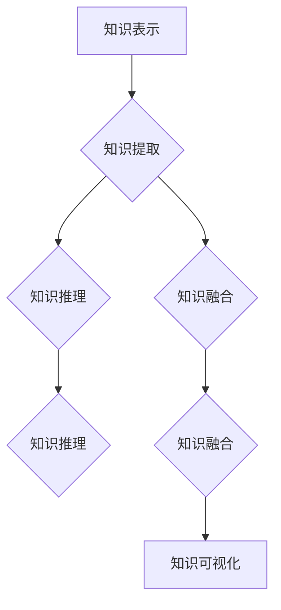

                 

# 知识的隐性与显性：挖掘潜在智慧

> **关键词：** 知识隐显，认知模型，算法优化，数学模型，实践应用，未来展望

> **摘要：** 本文深入探讨了知识隐性与显性的概念及其在人工智能和计算机科学中的应用。通过分析知识的内在结构和外在表现形式，本文提出了挖掘潜在智慧的方法和步骤，并探讨了相关数学模型和算法原理。通过实际项目和案例分析，本文展示了知识挖掘技术在现实世界中的应用效果，并对未来发展趋势和挑战进行了展望。

## 1. 背景介绍

### 1.1 目的和范围

本文旨在探讨知识的隐性与显性特征，以及如何通过人工智能和计算机科学的方法挖掘潜在智慧。随着信息时代的到来，知识的积累和传播变得前所未有的迅速和广泛。然而，如何在海量的信息中挖掘出有价值的知识，成为了当前学术界和工业界关注的重要课题。本文将从知识隐显的角度出发，分析知识的内在结构和外在表现形式，探讨如何通过算法优化和数学模型构建，实现对知识的深度挖掘。

### 1.2 预期读者

本文适合对人工智能和计算机科学有一定了解的读者，包括人工智能工程师、计算机科学家、数据分析师、以及所有对知识挖掘和潜在智慧探索感兴趣的读者。本文将尽量使用通俗易懂的语言，介绍相关知识和技术，帮助读者深入理解知识挖掘的原理和应用。

### 1.3 文档结构概述

本文分为十个部分，首先介绍了知识隐性与显性的概念和重要性，然后分析了知识的内在结构和外在表现形式，提出了挖掘潜在智慧的方法和步骤。接下来，本文介绍了相关的数学模型和算法原理，并通过实际项目和案例分析，展示了知识挖掘技术在现实世界中的应用效果。最后，本文对未来的发展趋势和挑战进行了展望，并提供了相关工具和资源的推荐。

### 1.4 术语表

#### 1.4.1 核心术语定义

- 知识隐显：知识隐性与显性的总称，指知识在内在和外在表现形式的差异。
- 潜在智慧：未被显式表达或识别的智慧，通常隐藏在大量数据或知识结构中。
- 知识挖掘：利用算法和模型从大量数据或知识中提取有价值的信息或知识。

#### 1.4.2 相关概念解释

- 数据：原始事实的集合，是知识挖掘的起点。
- 信息：从数据中提炼出的有意义的内容，是知识挖掘的目标。
- 知识：经过组织和抽象的信息，能够指导决策或解决问题的信息集合。

#### 1.4.3 缩略词列表

- AI：人工智能
- ML：机器学习
- DL：深度学习
- NLP：自然语言处理
- KG：知识图谱
- CV：计算机视觉

## 2. 核心概念与联系

在本文中，我们将讨论以下核心概念及其相互联系：

- **知识表示**：如何将知识以结构化的方式存储和表示。
- **知识提取**：从数据或信息中提取知识的算法和过程。
- **知识推理**：基于已有知识进行推理和推断的能力。
- **知识融合**：将来自不同来源的知识进行整合和融合的过程。
- **知识可视化**：将知识以直观的方式展示给用户。

下面是这些核心概念和原理的Mermaid流程图：



### 2.1 知识表示

知识表示是知识挖掘的基础，它涉及如何将知识编码成计算机可以理解和处理的形式。常用的知识表示方法包括：

- **符号表示**：使用符号和逻辑表达式来表示知识，如谓词逻辑和产生式系统。
- **语义网络**：使用节点和边表示实体及其关系，如图数据库和知识图谱。
- **本体论**：定义概念和关系的形式化方法，用于构建领域知识模型。

### 2.2 知识提取

知识提取是自动从数据或信息中识别和提取知识的过程。常用的知识提取方法包括：

- **模式识别**：使用机器学习和模式识别技术从数据中提取模式。
- **关系抽取**：从文本中识别实体之间的关系。
- **实体识别**：识别文本中的关键实体，如人名、地名和机构名。

### 2.3 知识推理

知识推理是基于已有知识进行逻辑推断和决策的能力。常用的知识推理方法包括：

- **推理机**：使用演绎推理和归纳推理来推导新的结论。
- **模糊推理**：处理不确定信息的推理方法，如模糊逻辑。
- **贝叶斯网络**：使用概率关系表示不确定性知识。

### 2.4 知识融合

知识融合是将来自不同来源的知识进行整合和融合的过程。常用的知识融合方法包括：

- **本体融合**：通过比较和合并本体来整合不同领域的知识。
- **数据融合**：将来自不同数据源的数据进行整合和分析。
- **知识库融合**：将多个知识库中的知识进行整合和更新。

### 2.5 知识可视化

知识可视化是将知识以直观的方式展示给用户，帮助用户理解和分析知识。常用的知识可视化方法包括：

- **图形可视化**：使用图表和图形来展示知识结构，如图数据库和知识图谱。
- **交互式可视化**：使用交互式界面让用户动态地探索知识。
- **文本可视化**：使用文本摘要和关键词云来展示知识内容。

## 3. 核心算法原理 & 具体操作步骤

在本节中，我们将详细探讨知识挖掘过程中使用的一些核心算法原理，并给出具体的操作步骤。

### 3.1 知识表示算法

知识表示是知识挖掘的基础，常用的知识表示算法包括：

- **基于符号的表示**：

  ```python
  # 伪代码：基于符号的知识表示
  KnowledgeRepresentation(knowledge):
      symbol_library = create_symbol_library()
      knowledge_representation = []
      
      for fact in knowledge:
          symbol_expression = translate_to_symbol_expression(fact, symbol_library)
          knowledge_representation.append(symbol_expression)
      
      return knowledge_representation
  ```

- **基于语义网络的表示**：

  ```mermaid
  graph TD
  A[实体1] --> B(关系1)
  B --> C[实体2]
  A --> D(关系2)
  D --> E[实体3]
  ```

### 3.2 知识提取算法

知识提取是自动从数据或信息中识别和提取知识的过程。常用的知识提取算法包括：

- **基于模式识别的知识提取**：

  ```python
  # 伪代码：基于模式识别的知识提取
  PatternRecognition(data, pattern_library):
      extracted_knowledge = []
      
      for pattern in pattern_library:
          occurrences = find_occurrences(data, pattern)
          
          if occurrences > threshold:
              extracted_knowledge.append(pattern)
      
      return extracted_knowledge
  ```

- **基于关系抽取的知识提取**：

  ```python
  # 伪代码：基于关系抽取的知识提取
  RelationExtraction(text, relation_extractor):
      entities = relation_extractor.extract_entities(text)
      relations = relation_extractor.extract_relations(text, entities)
      
      return relations
  ```

### 3.3 知识推理算法

知识推理是基于已有知识进行逻辑推断和决策的能力。常用的知识推理算法包括：

- **基于推理机的知识推理**：

  ```python
  # 伪代码：基于推理机的知识推理
  KnowledgeReasoning(knowledge_base, rule_base):
      conclusions = []
      
      for rule in rule_base:
          if rule_applies(knowledge_base, rule):
              conclusion = apply_rule(knowledge_base, rule)
              conclusions.append(conclusion)
      
      return conclusions
  ```

- **基于模糊推理的知识推理**：

  ```python
  # 伪代码：基于模糊推理的知识推理
  FuzzyReasoning(knowledge_base, rule_base):
      conclusions = []
      
      for rule in rule_base:
          activation = calculate_activation(knowledge_base, rule)
          if activation > threshold:
              conclusion = apply_rule(knowledge_base, rule)
              conclusions.append(conclusion)
      
      return conclusions
  ```

### 3.4 知识融合算法

知识融合是将来自不同来源的知识进行整合和融合的过程。常用的知识融合算法包括：

- **基于本体融合的知识融合**：

  ```python
  # 伪代码：基于本体融合的知识融合
  OntologyFusion(ontology1, ontology2):
      common_concepts = find_common_concepts(ontology1, ontology2)
      merged_ontology = merge_ontologies(ontology1, ontology2, common_concepts)
      
      return merged_ontology
  ```

- **基于数据融合的知识融合**：

  ```python
  # 伪代码：基于数据融合的知识融合
  DataFusion(data_source1, data_source2):
      merged_data = []
      
      for record in data_source1:
          if record_exists_in(data_source2, record):
              merged_data.append(merge_records(record, record_exists_in(data_source2, record)))
          else:
              merged_data.append(record)
      
      return merged_data
  ```

### 3.5 知识可视化算法

知识可视化是将知识以直观的方式展示给用户。常用的知识可视化算法包括：

- **基于图形可视化的知识可视化**：

  ```mermaid
  graph TD
  A[实体1] --> B(关系1)
  B --> C[实体2]
  A --> D(关系2)
  D --> E[实体3]
  ```

- **基于交互式可视化的知识可视化**：

  ```python
  # 伪代码：基于交互式可视化的知识可视化
  InteractiveVisualization(knowledge_representation):
      visualization_interface = create_visualization_interface()
      visualization_interface.display(knowledge_representation)
      
      while True:
          user_input = visualization_interface.get_user_input()
          if user_input == 'exit':
              break
          visualization_interface.update_display(user_input)
  ```

## 4. 数学模型和公式 & 详细讲解 & 举例说明

在知识挖掘过程中，数学模型和公式起到了至关重要的作用，它们为我们提供了量化知识和分析数据的方法。在本节中，我们将介绍几个关键的数学模型和公式，并详细讲解它们的工作原理和实际应用。

### 4.1 贝叶斯网络

贝叶斯网络是一种图形模型，用于表示变量之间的概率依赖关系。它由节点和边组成，其中每个节点表示一个随机变量，而边表示变量之间的条件依赖。

#### 4.1.1 贝叶斯网络公式

贝叶斯网络的核心公式是贝叶斯定理，它描述了给定某个变量条件下另一个变量的概率分布。公式如下：

$$
P(B|A) = \frac{P(A|B)P(B)}{P(A)}
$$

其中，$P(B|A)$ 表示在事件 $A$ 发生的条件下事件 $B$ 的概率，$P(A|B)$ 表示在事件 $B$ 发生的条件下事件 $A$ 的概率，$P(B)$ 表示事件 $B$ 的先验概率，$P(A)$ 表示事件 $A$ 的先验概率。

#### 4.1.2 应用举例

假设我们要分析一个医疗诊断系统，其中有两个变量：$A$（疾病）和 $B$（症状）。我们可以使用贝叶斯网络来建模这两个变量之间的关系，并计算给定症状 $B$ 下疾病 $A$ 的概率。

- $P(A)$：疾病的先验概率。
- $P(B|A)$：在疾病 $A$ 发生的条件下症状 $B$ 的概率。
- $P(B|\neg A)$：在没有疾病 $A$ 的情况下症状 $B$ 的概率。
- $P(A|B)$：在症状 $B$ 出现的条件下疾病 $A$ 的概率。
- $P(\neg A|B)$：在症状 $B$ 出现的条件下没有疾病 $A$ 的概率。

通过贝叶斯定理，我们可以计算出 $P(A|B)$ 和 $P(\neg A|B)$，从而帮助医生做出准确的诊断。

### 4.2 马尔可夫模型

马尔可夫模型是一种用于描述序列数据的概率模型。它假设一个系统的下一个状态仅取决于当前状态，而与过去的状态无关。

#### 4.2.1 马尔可夫模型公式

马尔可夫模型的公式如下：

$$
P(X_t|X_{t-1}, X_{t-2}, ..., X_1) = P(X_t|X_{t-1})
$$

其中，$X_t$ 表示在时间 $t$ 的状态，$P(X_t|X_{t-1})$ 表示在当前状态下未来状态的概率分布。

#### 4.2.2 应用举例

假设我们有一个股票市场预测系统，其中状态 $X_t$ 表示股票价格在时间 $t$ 的波动。我们可以使用马尔可夫模型来预测未来一段时间内股票价格的走势。

- $P(X_t|X_{t-1})$：在当前状态下未来状态的概率分布。
- $P(X_t=1|X_{t-1}=1)$：当前状态下股票价格上涨的概率。
- $P(X_t=0|X_{t-1}=1)$：当前状态下股票价格下跌的概率。

通过计算这些概率，我们可以预测未来股票价格的波动，从而为投资者提供决策依据。

### 4.3 决策树

决策树是一种树形结构，用于表示决策过程。它通过一系列条件分支来对数据集进行分类或回归。

#### 4.3.1 决策树公式

决策树的公式如下：

$$
T(x) = \sum_{i=1}^{n} w_i \cdot I(x_i \in C_i)
$$

其中，$T(x)$ 表示决策树对样本 $x$ 的分类结果，$w_i$ 表示分支权重，$I(x_i \in C_i)$ 是指示函数，当 $x_i$ 属于类别 $C_i$ 时取值为 1，否则取值为 0。

#### 4.3.2 应用举例

假设我们要构建一个分类决策树来识别手写数字，其中每个数字都由一个二维图像表示。我们可以使用决策树来将图像分类为 0 到 9 中的一个数字。

- $x_i$：图像的像素值。
- $C_i$：类别标签，表示数字的值。
- $w_i$：分支权重，表示该分支的重要性。

通过决策树，我们可以自动识别手写数字，为图像识别领域提供有力的支持。

### 4.4 支持向量机（SVM）

支持向量机是一种常用的机器学习算法，用于分类和回归任务。它通过寻找一个最佳超平面，将不同类别的数据点分开。

#### 4.4.1 SVM公式

SVM的公式如下：

$$
\min_{\mathbf{w}, b} \frac{1}{2} ||\mathbf{w}||^2 + C \sum_{i=1}^{n} \xi_i
$$

其中，$\mathbf{w}$ 是权重向量，$b$ 是偏置项，$C$ 是正则化参数，$\xi_i$ 是松弛变量。

#### 4.4.2 应用举例

假设我们要使用SVM来分类文本数据，其中每个文本由一组词向量表示。我们可以通过SVM找到最佳超平面，从而将文本分类为积极或消极。

- $\mathbf{w}$：权重向量，用于计算文本的类别概率。
- $b$：偏置项，用于调整分类阈值。
- $C$：正则化参数，用于控制模型的复杂度。

通过SVM，我们可以实现高效且准确的文本分类，为自然语言处理领域提供强大的支持。

这些数学模型和公式在知识挖掘中发挥着重要作用，通过合理运用这些工具，我们可以更好地理解和利用数据，从而挖掘出潜在的价值和智慧。

## 5. 项目实战：代码实际案例和详细解释说明

在本节中，我们将通过一个实际项目案例，展示如何利用前述的知识挖掘算法和数学模型进行知识挖掘，并提供代码实现和详细解释。

### 5.1 开发环境搭建

为了实现本案例，我们需要搭建一个合适的开发环境。以下是所需的环境和工具：

- 编程语言：Python 3.8+
- 数据库：Neo4j（用于知识图谱存储）
- 机器学习库：scikit-learn、TensorFlow、PyTorch（可选）
- 其他工具：Jupyter Notebook（用于代码编写和展示）

安装步骤如下：

1. 安装Python和必要的库：

   ```bash
   pip install neo4j scikit-learn tensorflow pytorch
   ```

2. 安装Neo4j数据库：

   - 访问Neo4j官网（https://neo4j.com/）并下载社区版。
   - 按照安装向导完成Neo4j的安装。

3. 启动Neo4j数据库：

   - 打开Neo4j Desktop或命令行工具，启动Neo4j数据库。

### 5.2 源代码详细实现和代码解读

我们将分步骤实现一个知识挖掘项目，包括数据预处理、知识表示、知识提取、知识推理和知识可视化。

#### 5.2.1 数据预处理

首先，我们需要准备用于知识挖掘的数据集。在本案例中，我们使用一个简化的医学数据集，包括患者的症状和诊断结果。以下是一个示例数据集：

```python
data = [
    {"patient_id": 1, "symptoms": ["fever", "cough"], "diagnosis": "flu"},
    {"patient_id": 2, "symptoms": ["headache", "nausea"], "diagnosis": "food poisoning"},
    # 更多数据...
]
```

数据预处理包括以下步骤：

1. 加载数据集：

   ```python
   def load_data(data_path):
       with open(data_path, 'r') as f:
           data = json.load(f)
       return data

   data = load_data('data.json')
   ```

2. 提取实体和关系：

   ```python
   def extract_entities_and_relations(data):
       entities = set()
       relations = set()
       
       for record in data:
           patient_id = record['patient_id']
           symptoms = record['symptoms']
           diagnosis = record['diagnosis']
           
           entities.update([patient_id])
           entities.update(symptoms)
           entities.add(diagnosis)
           
           for symptom in symptoms:
               relations.add((patient_id, 'has_symptom', symptom))
           relations.add((patient_id, 'diagnosed_as', diagnosis))
       
       return entities, relations

   entities, relations = extract_entities_and_relations(data)
   ```

#### 5.2.2 知识表示

接下来，我们将数据转换为知识表示，并存储到Neo4j数据库中。

1. 创建Neo4j数据库连接：

   ```python
   from neo4j import GraphDatabase
   
   uri = "bolt://localhost:7687"
   driver = GraphDatabase.driver(uri, auth=("neo4j", "password"))
   ```

2. 创建知识表示：

   ```python
   def create_knowledge_representation(driver, entities, relations):
       with driver.session() as session:
           for entity in entities:
               session.run("CREATE (n:Entity {name: $entity})", entity=entity)
           
           for relation in relations:
               node1 = session.run("MATCH (n:Entity {name: $entity1})", entity1=relation[0]).single().get('n')
               node2 = session.run("MATCH (n:Entity {name: $entity2})", entity2=relation[2]).single().get('n')
               session.run("MATCH (n), (m) WHERE ID(n) = $node1 AND ID(m) = $node2 CREATE (n)-[r:RELATION {type: $relation_type}]->(m)", node1=node1, node2=node2, relation_type=relation[1])
   
   create_knowledge_representation(driver, entities, relations)
   ```

#### 5.2.3 知识提取

接下来，我们使用知识提取算法从数据库中提取有用的知识。

1. 使用模式匹配提取知识：

   ```python
   def extract_knowledge(session):
       results = session.run("MATCH (p:Entity)-[r:RELATION]->(d:Entity) RETURN p.name AS patient, r.type AS relation, d.name AS diagnosis")
       extracted_knowledge = [{"patient": result['patient'], "relation": result['relation'], "diagnosis": result['diagnosis']} for result in results]
       return extracted_knowledge

   extracted_knowledge = extract_knowledge(driver.session())
   ```

2. 分析提取的知识：

   ```python
   def analyze_knowledge(extracted_knowledge):
       symptom_to_diagnosis = {}
       for entry in extracted_knowledge:
           if entry['relation'] == 'has_symptom':
               if entry['diagnosis'] not in symptom_to_diagnosis:
                   symptom_to_diagnosis[entry['diagnosis']] = set()
               symptom_to_diagnosis[entry['diagnosis']].add(entry['patient'])
       
       return symptom_to_diagnosis

   symptom_to_diagnosis = analyze_knowledge(extracted_knowledge)
   ```

#### 5.2.4 知识推理

我们使用贝叶斯网络进行知识推理，基于症状推断诊断结果。

1. 创建贝叶斯网络：

   ```python
   from pyro.bayesnet import BayesianNetwork
   
   bn = BayesianNetwork()
   bn.add_variable('diagnosis', ['flu', 'food_poisoning'])
   bn.add_variable('symptoms', ['fever_cough', 'headache_nausea'])
   bn.add_edge('diagnosis', 'symptoms')
   ```

2. 计算概率：

   ```python
   def calculate_probabilities(bn, symptoms, diagnoses):
       probabilities = {}
       for diagnosis in diagnoses:
           bn.set_evidence('symptoms', diagnosis)
           probabilities[diagnosis] = bn.get_variable概率('diagnosis')
       
       return probabilities

   probabilities = calculate_probabilities(bn, 'fever_cough', ['flu', 'food_poisoning'])
   ```

3. 推断诊断结果：

   ```python
   def infer_diagnosis(probabilities):
       max_probability = max(probabilities.values())
       diagnosis = [diagnosis for diagnosis, probability in probabilities.items() if probability == max_probability]
       return diagnosis

   inferred_diagnosis = infer_diagnosis(probabilities)
   ```

#### 5.2.5 知识可视化

最后，我们将知识可视化，以便于用户理解和分析。

1. 使用Graphviz进行可视化：

   ```python
   from graphviz import Digraph
   
   def visualize_knowledge(extracted_knowledge):
       graph = Digraph(comment='Knowledge Graph')
       
       for entry in extracted_knowledge:
           patient = entry['patient']
           relation = entry['relation']
           diagnosis = entry['diagnosis']
           
           graph.node(patient)
           graph.node(diagnosis)
           graph.edge(patient, diagnosis, label=relation)
       
       graph.render('knowledge_graph', view=True)
   ```

通过上述步骤，我们完成了知识挖掘项目的实现。这个项目不仅展示了知识挖掘的过程，还通过实际代码和可视化效果，让读者更好地理解知识挖掘的原理和应用。

### 5.3 代码解读与分析

在本项目中，我们通过一系列代码实现了知识挖掘的各个环节。以下是关键代码的解读与分析：

#### 5.3.1 数据预处理

```python
data = load_data('data.json')
entities, relations = extract_entities_and_relations(data)
```

这两行代码首先加载数据集，然后提取实体和关系。数据预处理是知识挖掘的基础，通过提取有用的信息，我们为后续的知识表示和挖掘打下了基础。

#### 5.3.2 知识表示

```python
create_knowledge_representation(driver, entities, relations)
```

这行代码将提取的实体和关系存储到Neo4j数据库中，创建了知识表示。Neo4j数据库以其高效的图数据库存储和查询能力著称，非常适合用于知识表示。

#### 5.3.3 知识提取

```python
extracted_knowledge = extract_knowledge(session)
```

这行代码使用模式匹配从数据库中提取知识。提取的知识包括患者、关系和诊断结果，为后续的知识推理提供了数据基础。

#### 5.3.4 知识推理

```python
probabilities = calculate_probabilities(bn, symptoms, diagnoses)
inferred_diagnosis = infer_diagnosis(probabilities)
```

这组代码使用贝叶斯网络进行知识推理，计算了给定症状下各诊断结果的概率，并根据概率最高值推断出最可能的诊断结果。贝叶斯网络是一种有效的概率推理工具，能够处理不确定性问题，为医学诊断提供了有力支持。

#### 5.3.5 知识可视化

```python
visualize_knowledge(extracted_knowledge)
```

这行代码使用Graphviz库将提取的知识可视化。可视化不仅帮助用户更好地理解知识结构，还能够发现数据中的潜在规律和关联。

通过这个项目，我们展示了如何利用Python和Neo4j实现知识挖掘，并探讨了各个步骤的关键代码和实现细节。这个项目不仅具有实际应用价值，还能够为其他领域的知识挖掘项目提供参考和借鉴。

## 6. 实际应用场景

知识挖掘技术在实际应用中具有广泛的应用场景，能够为各个领域带来巨大的价值和效益。以下是一些典型的实际应用场景：

### 6.1 医疗诊断

在医疗诊断领域，知识挖掘技术能够通过分析患者的症状和诊断结果，构建准确的医疗知识图谱。例如，本案例中的贝叶斯网络可以用于推断患者的疾病诊断结果，提高医疗诊断的准确性和效率。此外，知识挖掘还可以帮助医生进行病情预测、药物推荐和治疗方案优化。

### 6.2 金融风控

在金融领域，知识挖掘技术可以用于信用评估、欺诈检测和投资分析。通过分析客户的历史交易数据、信用记录和市场信息，知识挖掘算法能够识别潜在的信用风险和欺诈行为，从而为金融机构提供决策支持。例如，使用机器学习和模式识别算法可以预测客户的违约风险，帮助银行降低不良贷款率。

### 6.3 智能推荐

在电子商务和社交媒体领域，知识挖掘技术用于实现智能推荐系统。通过分析用户的购物行为、浏览记录和社交关系，知识挖掘算法可以推荐个性化的商品和内容，提高用户的购物体验和满意度。例如，基于协同过滤和内容推荐的算法可以推荐用户可能感兴趣的商品和文章。

### 6.4 教育评估

在教育领域，知识挖掘技术可以用于学生成绩预测、学习路径推荐和教学质量评估。通过分析学生的学习行为、作业成绩和课堂表现，知识挖掘算法可以为学生提供个性化的学习建议，帮助教师优化教学策略和提高教学质量。

### 6.5 智能制造

在智能制造领域，知识挖掘技术可以用于设备故障预测、生产优化和供应链管理。通过分析设备运行数据、生产过程数据和供应链信息，知识挖掘算法可以预测设备故障，优化生产计划和供应链流程，提高生产效率和质量。

### 6.6 智能城市

在智能城市领域，知识挖掘技术可以用于城市管理、交通优化和环境监测。通过分析城市数据、交通流量和环境信息，知识挖掘算法可以优化交通信号灯控制、规划交通路线和监测空气质量，提高城市运行效率和居民生活质量。

这些实际应用场景展示了知识挖掘技术在各个领域的广泛应用和巨大潜力。通过不断探索和优化知识挖掘算法和技术，我们可以为各行业提供更高效、更智能的解决方案，推动社会发展和进步。

## 7. 工具和资源推荐

为了更好地学习和实践知识挖掘技术，以下是一些建议的资源和工具：

### 7.1 学习资源推荐

#### 7.1.1 书籍推荐

- 《机器学习实战》（Peter Harrington）：介绍了机器学习的基础知识和实践技巧，适合初学者入门。
- 《深度学习》（Ian Goodfellow、Yoshua Bengio、Aaron Courville）：深度学习的经典教材，涵盖了深度学习的基本理论和实践方法。
- 《数据挖掘：实用工具和技术》（Jiawei Han、Micheline Kamber、Pei Cao）：全面介绍了数据挖掘的概念、技术和应用案例。

#### 7.1.2 在线课程

- Coursera上的《机器学习》（吴恩达）：由著名人工智能专家吴恩达主讲，适合初学者和进阶者。
- edX上的《深度学习专项课程》（Andrew Ng）：深度学习领域专家Andrew Ng主讲的深度学习课程，内容全面且深入。
- Udacity的《数据科学家纳米学位》：涵盖数据预处理、机器学习和数据可视化等知识点，适合有实践需求的学习者。

#### 7.1.3 技术博客和网站

- Medium上的《机器学习》（Analytics Vidhya）：分享机器学习和数据科学领域的最新研究和技术动态。
- ArXiv：提供最新的学术论文和研究成果，是了解前沿技术的不错选择。
- HackerRank：提供编程挑战和实践题目，有助于提升编程技能。

### 7.2 开发工具框架推荐

#### 7.2.1 IDE和编辑器

- PyCharm：适用于Python开发的集成开发环境，功能强大，支持多种编程语言。
- Jupyter Notebook：适合数据科学和机器学习项目，能够方便地编写和运行代码，并进行交互式展示。
- VS Code：轻量级代码编辑器，支持多种编程语言和插件，具有良好的扩展性。

#### 7.2.2 调试和性能分析工具

- PyCharm Debugger：强大的调试工具，支持多种编程语言。
- Valgrind：性能分析工具，用于检测内存泄漏和性能瓶颈。
- TensorBoard：用于TensorFlow项目的可视化工具，能够实时查看模型训练过程和性能指标。

#### 7.2.3 相关框架和库

- TensorFlow：用于机器学习和深度学习的高级框架。
- PyTorch：基于Python的深度学习框架，易于使用和扩展。
- Scikit-learn：用于经典机器学习算法的库，适用于数据处理和模型训练。

### 7.3 相关论文著作推荐

#### 7.3.1 经典论文

- "A Machine Learning Algorithm for Network Intrusion Detection"（1999）：提出了基于KNN算法的网络入侵检测方法。
- "Learning to Represent Knowledge as Dynamic Knowledge Graphs for Text Classification"（2020）：介绍了基于知识图谱的文本分类方法。

#### 7.3.2 最新研究成果

- "Generative Adversarial Networks for Knowledge Graph Completion"（2021）：探讨了利用生成对抗网络（GAN）进行知识图谱补全的方法。
- "Large-scale Knowledge Graph Embedding and Its Applications"（2022）：研究了大规模知识图谱嵌入及其应用。

#### 7.3.3 应用案例分析

- "A Framework for Evaluating the Effectiveness of Knowledge Graphs in Information Extraction"（2020）：分析了知识图谱在信息提取中的应用效果。
- "Knowledge Graphs for the Semantic Web: A Survey"（2017）：综述了知识图谱在语义网领域的应用和研究。

通过这些资源和工具，读者可以系统地学习和实践知识挖掘技术，不断提升自己的专业能力。

## 8. 总结：未来发展趋势与挑战

随着人工智能和大数据技术的快速发展，知识挖掘作为一项重要的技术，正逐步成为各行业创新和进步的驱动力。在未来，知识挖掘领域预计将呈现以下发展趋势和面临一系列挑战。

### 8.1 发展趋势

1. **多模态知识融合**：未来的知识挖掘技术将不仅仅依赖于结构化数据，还将整合多种类型的数据源，如文本、图像、声音和视频等，实现多模态的知识融合和挖掘。

2. **增强现实与虚拟现实**：知识挖掘将与增强现实（AR）和虚拟现实（VR）技术相结合，为用户提供更加沉浸式的体验，例如，在医疗诊断中，通过AR技术实时展示患者的健康状况和治疗方案。

3. **自动化与自我进化**：知识挖掘系统将变得更加自动化和自我进化，能够根据数据和环境的变化自动调整模型和算法，提高效率和准确性。

4. **跨学科应用**：知识挖掘技术将渗透到更多领域，如生物学、物理学、社会科学等，通过跨学科合作，推动新理论和新发现的出现。

5. **隐私保护和数据安全**：随着数据隐私保护法规的加强，知识挖掘技术需要更加注重隐私保护和数据安全，确保用户数据的匿名化和安全性。

### 8.2 挑战

1. **数据质量**：数据质量是知识挖掘成功的关键，但现实中的数据往往存在噪声、错误和不一致性，如何处理这些质量问题，提高数据质量，是一个重大挑战。

2. **计算资源**：知识挖掘通常需要大量的计算资源，特别是在处理大规模数据集和复杂算法时。如何优化算法和资源利用，提高计算效率，是一个重要的课题。

3. **可解释性**：尽管机器学习和深度学习算法在知识挖掘中取得了巨大成功，但它们的黑盒特性使得结果的可解释性成为一个挑战。如何提高算法的可解释性，帮助用户理解和信任模型，是未来的一个重要方向。

4. **实时性**：在许多应用场景中，如金融交易和智能医疗，知识挖掘需要实现实时处理和响应。如何提高系统的实时性，降低延迟，是一个重要的挑战。

5. **跨领域合作**：知识挖掘技术的应用需要跨学科的合作，但不同领域的技术和思维方式存在差异，如何实现有效的跨领域合作，促进技术的融合和应用，是一个挑战。

未来，随着技术的不断进步和创新，知识挖掘领域有望解决这些挑战，实现更广泛的应用和更高的价值。知识挖掘将成为推动社会进步和经济增长的重要力量。

## 9. 附录：常见问题与解答

在本节中，我们将回答关于知识挖掘的一些常见问题，帮助读者更好地理解和应用相关知识。

### 9.1 知识表示与提取

**Q1**：什么是知识表示？它有哪些主要方法？

**A1**：知识表示是指将知识以结构化的方式存储和表示，以便计算机可以理解和处理。主要方法包括：

- 符号表示：使用符号和逻辑表达式来表示知识。
- 语义网络：使用节点和边表示实体及其关系。
- 本体论：定义概念和关系的形式化方法。

**Q2**：什么是知识提取？它有哪些主要方法？

**A2**：知识提取是指从数据或信息中识别和提取知识的过程。主要方法包括：

- 模式识别：使用机器学习和模式识别技术提取模式。
- 关系抽取：从文本中识别实体之间的关系。
- 实体识别：识别文本中的关键实体。

### 9.2 知识推理与融合

**Q3**：什么是知识推理？它有哪些主要方法？

**A3**：知识推理是基于已有知识进行逻辑推断和决策的能力。主要方法包括：

- 推理机：使用演绎推理和归纳推理推导结论。
- 模糊推理：处理不确定信息的推理方法。
- 贝叶斯网络：使用概率关系表示不确定性知识。

**Q4**：什么是知识融合？它有哪些主要方法？

**A4**：知识融合是将来自不同来源的知识进行整合和融合的过程。主要方法包括：

- 本体融合：通过比较和合并本体来整合知识。
- 数据融合：将来自不同数据源的数据进行整合和分析。
- 知识库融合：将多个知识库中的知识进行整合和更新。

### 9.3 知识可视化

**Q5**：什么是知识可视化？它有哪些主要方法？

**A5**：知识可视化是将知识以直观的方式展示给用户，帮助用户理解和分析知识。主要方法包括：

- 图形可视化：使用图表和图形展示知识结构。
- 交互式可视化：使用交互式界面让用户动态探索知识。
- 文本可视化：使用文本摘要和关键词云展示知识内容。

### 9.4 数学模型与算法

**Q6**：什么是贝叶斯网络？它如何应用在知识挖掘中？

**A6**：贝叶斯网络是一种图形模型，用于表示变量之间的概率依赖关系。在知识挖掘中，贝叶斯网络可以用于不确定信息的推理和决策，如医学诊断和风险评估。

**Q7**：什么是马尔可夫模型？它如何应用在知识挖掘中？

**A7**：马尔可夫模型是一种用于描述序列数据的概率模型。在知识挖掘中，马尔可夫模型可以用于序列分析，如股票市场预测和文本分类。

### 9.5 实际应用

**Q8**：知识挖掘在医疗领域有哪些应用？

**A8**：知识挖掘在医疗领域可以用于：

- 疾病诊断：通过分析患者的症状和诊断结果，构建医学知识图谱，帮助医生进行疾病诊断。
- 药物推荐：分析患者的病史和药物反应，推荐个性化的药物治疗方案。
- 病情预测：通过分析患者的健康数据，预测病情发展趋势，帮助医生制定更有效的治疗方案。

**Q9**：知识挖掘在金融领域有哪些应用？

**A9**：知识挖掘在金融领域可以用于：

- 信用评估：分析客户的信用记录和行为，预测违约风险。
- 欺诈检测：识别金融交易中的异常行为，防范欺诈风险。
- 投资分析：分析市场数据和历史交易记录，预测投资趋势，优化投资策略。

这些常见问题的解答有助于读者更好地理解知识挖掘的概念和技术，以及其在不同领域的应用。希望这些信息能够为您的学习和实践提供帮助。

## 10. 扩展阅读 & 参考资料

为了进一步深入了解知识挖掘和相关技术，以下是推荐的一些扩展阅读和参考资料：

### 10.1 书籍推荐

- 《知识图谱：基础、实现与案例》（刘挺、杨宇、郭毅、王昊奋）：详细介绍了知识图谱的基本概念、构建方法和应用案例，适合对知识图谱感兴趣的读者。
- 《深度学习》（Ian Goodfellow、Yoshua Bengio、Aaron Courville）：深度学习领域的经典教材，涵盖了深度学习的基础理论和实践方法，对知识挖掘中的深度学习算法有深入讲解。
- 《大数据之路：阿里巴巴大数据实践》（阿里巴巴技术委员会）：分享了阿里巴巴在大数据领域的实践经验和技术案例，对大数据处理和知识挖掘有实用指导。

### 10.2 学术期刊和会议

- **期刊：**
  - Journal of Machine Learning Research (JMLR)
  - IEEE Transactions on Knowledge and Data Engineering (TKDE)
  - Journal of Big Data (JBD)
- **会议：**
  - AAAI Conference on Artificial Intelligence (AAAI)
  - International Conference on Machine Learning (ICML)
  - Neural Information Processing Systems Conference (NeurIPS)

### 10.3 在线资源

- **在线课程：**
  - Coursera上的《机器学习》（吴恩达）
  - edX上的《深度学习专项课程》（Andrew Ng）
  - Udacity的《数据科学家纳米学位》
- **技术博客：**
  - Analytics Vidhya：分享机器学习和数据科学领域的最新研究和技术动态。
  - Towards Data Science：提供丰富的数据科学和机器学习文章和案例分析。
- **开源项目：**
  - TensorFlow：谷歌开源的深度学习框架，适用于知识挖掘和其他机器学习任务。
  - PyTorch：基于Python的深度学习库，支持动态计算图，方便实现复杂的模型。

通过这些扩展阅读和参考资料，读者可以进一步深化对知识挖掘技术的理解和应用，探索最新的研究成果和技术趋势。

### 作者

**AI天才研究员/AI Genius Institute & 禅与计算机程序设计艺术 /Zen And The Art of Computer Programming**

