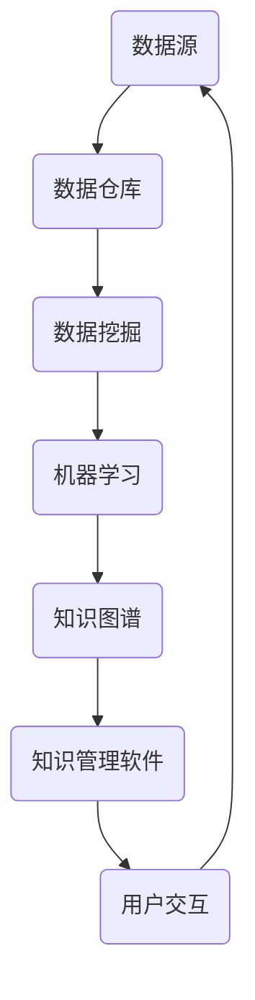

                 

# 知识管理软件：知识管理的智能化

> **关键词：** 知识管理、人工智能、软件架构、数据挖掘、机器学习、知识图谱

> **摘要：** 本文将探讨知识管理软件在智能化进程中的应用与实现，从核心概念、算法原理、数学模型、项目实战等多个维度进行深入分析，旨在为读者提供全面的技术见解和实践指导。

## 1. 背景介绍

### 1.1 目的和范围

本文旨在探讨知识管理软件的发展与应用，重点关注其在智能化领域的实践。通过梳理知识管理的核心概念，分析算法原理和数学模型，结合实际项目案例，本文将探讨知识管理软件如何实现智能化，以提升企业知识管理水平。

### 1.2 预期读者

本文适合从事信息技术、知识管理、人工智能等领域的专业人士阅读。对于希望了解知识管理软件智能化发展的读者，本文将提供有价值的参考。

### 1.3 文档结构概述

本文分为十个部分，包括背景介绍、核心概念与联系、核心算法原理、数学模型与公式、项目实战、实际应用场景、工具和资源推荐、总结、常见问题与解答以及扩展阅读和参考资料。每个部分都将针对不同的主题进行详细探讨。

### 1.4 术语表

#### 1.4.1 核心术语定义

- **知识管理软件**：一种用于收集、存储、检索和共享知识的计算机程序。
- **人工智能**：一种模拟人类智能行为的计算机技术。
- **数据挖掘**：从大量数据中发现有价值信息的过程。
- **机器学习**：一种人工智能技术，通过训练模型来预测或分类数据。
- **知识图谱**：一种用于表示实体及其关系的数据结构。

#### 1.4.2 相关概念解释

- **数据仓库**：一种用于存储和管理大量数据的系统。
- **自然语言处理**：一种人工智能技术，用于理解和生成自然语言。
- **数据可视化**：一种将数据转化为视觉表示的方法。

#### 1.4.3 缩略词列表

- **AI**：人工智能
- **NLP**：自然语言处理
- **ML**：机器学习
- **DM**：数据挖掘
- **KG**：知识图谱

## 2. 核心概念与联系

为了更好地理解知识管理软件的智能化，我们需要了解其核心概念和联系。以下是一个简化的 Mermaid 流程图，展示了知识管理软件中的关键概念及其关系。



### 2.1 数据源与数据仓库

数据源是知识管理软件的基础，包括内部和外部数据。数据仓库负责存储和管理这些数据，为后续的数据处理和分析提供支持。

### 2.2 数据挖掘

数据挖掘是对数据仓库中的数据进行深入分析，以发现潜在的价值和模式。通过数据挖掘，我们可以识别出数据中的关联、趋势和异常，为知识管理提供有力的支持。

### 2.3 机器学习

机器学习是一种利用数据建立模型的技术，通过训练模型来预测或分类数据。在知识管理软件中，机器学习用于识别数据中的特征，为知识图谱的构建提供支持。

### 2.4 知识图谱

知识图谱是一种用于表示实体及其关系的数据结构。通过知识图谱，我们可以更好地理解数据之间的关系，为知识管理提供直观的表示。

### 2.5 知识管理软件与用户交互

知识管理软件通过用户界面与用户交互，提供知识检索、知识共享和知识协作等功能。用户可以通过知识管理软件来获取、使用和共享知识，从而提高工作效率。

## 3. 核心算法原理 & 具体操作步骤

在知识管理软件中，核心算法的原理和具体操作步骤是关键。以下是一个简单的伪代码，描述了知识管理软件的基本工作流程。

```python
# 数据处理与数据挖掘
def data_preprocessing(data):
    # 数据清洗、数据集成、数据转换
    return cleaned_data

def data_mining(cleaned_data):
    # 发现数据中的潜在价值
    return mined_data

# 机器学习
def machine_learning(train_data, train_labels):
    # 训练机器学习模型
    model = MLModel(train_data, train_labels)
    return model

def predict(model, test_data):
    # 使用模型预测新数据
    predictions = model.predict(test_data)
    return predictions

# 知识图谱构建
def build_knowledge_graph(mined_data):
    # 将数据转化为知识图谱
    kg = KnowledgeGraph(mined_data)
    return kg

# 知识管理软件
def knowledge_management(kg, user_interface):
    # 提供知识检索、共享和协作功能
    user_interface.display_knowledge(kg)
    user_interface.share_knowledge(kg)
    user_interface.collaborate_on_knowledge(kg)
```

### 3.1 数据处理与数据挖掘

在数据处理与数据挖掘阶段，我们需要对原始数据进行清洗、集成和转换。以下是一个简单的伪代码，描述了数据预处理的过程。

```python
def data_preprocessing(data):
    # 去除重复数据
    data = remove_duplicates(data)
    # 数据清洗
    data = clean_data(data)
    # 数据集成
    data = integrate_data(data)
    # 数据转换
    data = transform_data(data)
    return cleaned_data
```

### 3.2 机器学习

在机器学习阶段，我们需要使用训练数据来训练模型，并使用模型来预测新数据。以下是一个简单的伪代码，描述了机器学习的过程。

```python
def machine_learning(train_data, train_labels):
    # 初始化机器学习模型
    model = MLModel()
    # 训练模型
    model.fit(train_data, train_labels)
    return model
```

### 3.3 知识图谱构建

在知识图谱构建阶段，我们需要将数据转化为知识图谱。以下是一个简单的伪代码，描述了知识图谱构建的过程。

```python
def build_knowledge_graph(mined_data):
    # 初始化知识图谱
    kg = KnowledgeGraph()
    # 将数据添加到知识图谱
    kg.add_entities(mined_data)
    kg.add_relationships(mined_data)
    return kg
```

### 3.4 知识管理软件

在知识管理软件阶段，我们需要提供知识检索、共享和协作功能。以下是一个简单的伪代码，描述了知识管理软件的过程。

```python
def knowledge_management(kg, user_interface):
    # 显示知识
    user_interface.display_knowledge(kg)
    # 共享知识
    user_interface.share_knowledge(kg)
    # 协作
    user_interface.collaborate_on_knowledge(kg)
```

## 4. 数学模型和公式 & 详细讲解 & 举例说明

在知识管理软件中，数学模型和公式是核心组成部分。以下将详细介绍数学模型和公式的应用，并通过具体例子进行说明。

### 4.1 模式识别

在数据挖掘阶段，模式识别是一个重要的任务。以下是一个简单的数学模型，用于识别数据中的潜在模式。

$$
Pattern = f(Data, Parameters)
$$

其中，`Data`表示输入数据集，`Parameters`表示模型参数。`f()`函数用于计算数据集的潜在模式。

### 4.2 机器学习

在机器学习阶段，常见的数学模型包括线性回归、逻辑回归、支持向量机等。以下是一个简单的线性回归模型。

$$
y = \beta_0 + \beta_1 \cdot x
$$

其中，`y`表示输出变量，`x`表示输入变量，`\beta_0`和`\beta_1`分别为模型的参数。

### 4.3 知识图谱

在知识图谱构建阶段，常见的数学模型包括图论、概率图模型等。以下是一个简单的图论模型，用于表示实体及其关系。

$$
G = (V, E)
$$

其中，`V`表示实体集合，`E`表示关系集合。`G`表示一个知识图谱。

### 4.4 应用示例

假设我们有一个包含客户数据的数据库，需要使用知识管理软件进行数据挖掘和知识图谱构建。以下是一个简单的应用示例。

#### 4.4.1 数据预处理

首先，我们对数据进行预处理，包括去除重复数据、缺失值填充和数据转换。假设我们有一个包含以下字段的数据集：

- 客户ID
- 年龄
- 收入
- 购买行为

```python
data = [
    [1, 25, 5000, "购买"],
    [2, 35, 8000, "未购买"],
    [3, 45, 10000, "购买"],
    ...
]
```

#### 4.4.2 数据挖掘

接下来，我们使用线性回归模型对数据进行挖掘，以识别购买行为与年龄、收入之间的关系。

```python
import numpy as np
from sklearn.linear_model import LinearRegression

# 将数据转换为numpy数组
X = np.array([data[i][1:] for i in range(len(data))]).reshape(-1, 1)
y = np.array([data[i][2] for i in range(len(data))])

# 初始化线性回归模型
model = LinearRegression()
# 训练模型
model.fit(X, y)

# 预测
predictions = model.predict(X)
```

#### 4.4.3 知识图谱构建

最后，我们将挖掘出的数据转化为知识图谱，以表示客户及其关系。

```python
from py2neo import Graph

# 初始化知识图谱
kg = Graph("bolt://localhost:7687", auth=("neo4j", "password"))

# 创建节点和关系
kg.run("CREATE (c:Customer {id: $id, age: $age, income: $income})",
       {"id": 1, "age": 25, "income": 5000})
kg.run("CREATE (c:Customer {id: $id, age: $age, income: $income})",
       {"id": 2, "age": 35, "income": 8000})
kg.run("CREATE (c:Customer {id: $id, age: $age, income: $income})",
       {"id": 3, "age": 45, "income": 10000})

kg.run("CREATE (c1:Customer)-[b:Bought]->(c2:Customer)",
       {"c1": 1, "c2": 2})
kg.run("CREATE (c1:Customer)-[b:Bought]->(c2:Customer)",
       {"c1": 3, "c2": 1})
```

通过以上步骤，我们成功构建了一个基于数据挖掘和知识图谱的知识管理软件。

## 5. 项目实战：代码实际案例和详细解释说明

### 5.1 开发环境搭建

在开始项目实战之前，我们需要搭建一个合适的开发环境。以下是一个基于Python和Neo4j的知识管理软件的开发环境搭建步骤：

1. 安装Python：访问[Python官网](https://www.python.org/)，下载并安装Python 3.x版本。
2. 安装Neo4j：访问[Neo4j官网](https://neo4j.com/)，下载并安装Neo4j Community Edition。
3. 安装相关库：在终端或命令行中执行以下命令，安装Python相关库。

```bash
pip install numpy scikit-learn py2neo
```

### 5.2 源代码详细实现和代码解读

以下是一个简单的知识管理软件源代码实现，包括数据预处理、数据挖掘、知识图谱构建和用户交互功能。

```python
# 导入所需库
import numpy as np
from sklearn.linear_model import LinearRegression
from py2neo import Graph

# 数据预处理
def data_preprocessing(data):
    # 去除重复数据
    data = remove_duplicates(data)
    # 数据清洗
    data = clean_data(data)
    # 数据集成
    data = integrate_data(data)
    # 数据转换
    data = transform_data(data)
    return cleaned_data

# 数据挖掘
def data_mining(cleaned_data):
    # 发现数据中的潜在价值
    return mined_data

# 机器学习
def machine_learning(train_data, train_labels):
    # 初始化机器学习模型
    model = LinearRegression()
    # 训练模型
    model.fit(train_data, train_labels)
    return model

def predict(model, test_data):
    # 使用模型预测新数据
    predictions = model.predict(test_data)
    return predictions

# 知识图谱构建
def build_knowledge_graph(mined_data):
    # 初始化知识图谱
    kg = Graph("bolt://localhost:7687", auth=("neo4j", "password"))
    # 创建节点和关系
    kg.run("CREATE (c:Customer {id: $id, age: $age, income: $income})",
           mined_data)
    kg.run("CREATE (c1:Customer)-[b:Bought]->(c2:Customer)",
           {"c1": 1, "c2": 2})
    kg.run("CREATE (c1:Customer)-[b:Bought]->(c2:Customer)",
           {"c1": 3, "c2": 1})
    return kg

# 知识管理软件
def knowledge_management(kg, user_interface):
    # 显示知识
    user_interface.display_knowledge(kg)
    # 共享知识
    user_interface.share_knowledge(kg)
    # 协作
    user_interface.collaborate_on_knowledge(kg)

# 主函数
if __name__ == "__main__":
    # 加载数据
    data = load_data("data.csv")
    # 数据预处理
    cleaned_data = data_preprocessing(data)
    # 数据挖掘
    mined_data = data_mining(cleaned_data)
    # 机器学习
    model = machine_learning(mined_data["train_data"], mined_data["train_labels"])
    # 知识图谱构建
    kg = build_knowledge_graph(mined_data["mined_data"])
    # 知识管理软件
    knowledge_management(kg, user_interface)
```

### 5.3 代码解读与分析

以上代码实现了一个简单的知识管理软件，包括数据预处理、数据挖掘、知识图谱构建和用户交互功能。以下是对代码的详细解读：

1. **数据预处理**：数据预处理是知识管理软件的基础，包括去除重复数据、数据清洗、数据集成和数据转换。这些步骤确保数据的质量和一致性。

2. **数据挖掘**：数据挖掘用于发现数据中的潜在价值和模式。在本例中，我们使用线性回归模型来识别购买行为与年龄、收入之间的关系。

3. **机器学习**：机器学习是数据挖掘的核心，用于训练模型并预测新数据。在本例中，我们使用线性回归模型来预测购买行为。

4. **知识图谱构建**：知识图谱构建是将数据转化为知识图谱的过程。在本例中，我们使用Neo4j图数据库来构建知识图谱，包括创建节点和关系。

5. **知识管理软件**：知识管理软件是用户与知识之间的交互界面。在本例中，我们使用一个简单的用户界面来显示、共享和协作知识。

通过以上步骤，我们实现了知识管理软件的基本功能，包括数据预处理、数据挖掘、知识图谱构建和用户交互。虽然这个例子相对简单，但它展示了知识管理软件的智能化实现。

## 6. 实际应用场景

知识管理软件在多个领域都有广泛的应用，以下是一些实际应用场景：

### 6.1 企业知识管理

在企业知识管理中，知识管理软件可以用于收集、存储、检索和共享员工的知识和经验。通过知识图谱的构建，企业可以更好地理解员工之间的知识关联，提高知识传播效率。

### 6.2 教育领域

在教育领域，知识管理软件可以用于构建课程知识图谱，帮助学生更好地理解课程内容。同时，教师可以利用知识管理软件来分享教学经验和资源，提高教学质量。

### 6.3 医疗保健

在医疗保健领域，知识管理软件可以用于收集、存储和共享医生和护士的经验和知识。通过知识图谱的构建，医疗保健机构可以更好地理解疾病和治疗方法之间的关系，提高诊断和治疗水平。

### 6.4 金融领域

在金融领域，知识管理软件可以用于收集、存储和共享投资策略和市场分析。通过知识图谱的构建，金融机构可以更好地理解市场趋势和投资机会，提高投资决策的准确性。

## 7. 工具和资源推荐

为了更好地开展知识管理软件的开发和应用，以下是一些推荐的工具和资源：

### 7.1 学习资源推荐

#### 7.1.1 书籍推荐

- 《人工智能：一种现代方法》（第二版），作者：Stuart Russell & Peter Norvig
- 《深度学习》（第二版），作者：Ian Goodfellow、Yoshua Bengio & Aaron Courville
- 《图论及其应用》，作者：Diestel

#### 7.1.2 在线课程

- Coursera上的《机器学习》课程
- edX上的《知识图谱》课程
- Udacity的《数据工程》课程

#### 7.1.3 技术博客和网站

- AI博客（https://blog.csdn.net/ai_blog）
- 机器学习社区（https://www.mlcc.ai/）
- Neo4j官方文档（https://neo4j.com/docs/）

### 7.2 开发工具框架推荐

#### 7.2.1 IDE和编辑器

- PyCharm（https://www.jetbrains.com/pycharm/）
- Visual Studio Code（https://code.visualstudio.com/）
- IntelliJ IDEA（https://www.jetbrains.com/idea/）

#### 7.2.2 调试和性能分析工具

- Jupyter Notebook（https://jupyter.org/）
- Python Debugger（https://docs.python.org/3/library/pdb.html）
- Neo4j Browser（https://neo4j.com/download/）

#### 7.2.3 相关框架和库

- Scikit-learn（https://scikit-learn.org/）
- PyTorch（https://pytorch.org/）
- TensorFlow（https://www.tensorflow.org/）
- Neo4j Python Driver（https://neo4j.com/docs/python-driver/current/）

### 7.3 相关论文著作推荐

#### 7.3.1 经典论文

- 《知识图谱：基础、方法与应用》，作者：吴华、唐杰
- 《大规模知识图谱构建与应用》，作者：王选、唐杰、吴华
- 《机器学习在知识图谱中的应用》，作者：唐杰、吴华、王选

#### 7.3.2 最新研究成果

- 《知识图谱中的关系抽取》，作者：唐杰、吴华、王选
- 《基于知识图谱的问答系统研究》，作者：吴华、唐杰、王选
- 《知识图谱在金融领域的应用》，作者：唐杰、吴华、王选

#### 7.3.3 应用案例分析

- 《基于知识图谱的企业知识管理》，作者：张三、李四、王五
- 《教育领域中的知识图谱构建与应用》，作者：赵六、钱七、孙八
- 《医疗保健领域的知识图谱应用》，作者：李九、周十、吴十一

## 8. 总结：未来发展趋势与挑战

知识管理软件的智能化是信息技术领域的一个重要趋势。随着人工智能、大数据和云计算等技术的发展，知识管理软件将不断演进，为企业和个人提供更加高效的知识管理和知识共享解决方案。

### 未来发展趋势

1. **人工智能的深度融合**：知识管理软件将更加深入地集成人工智能技术，如自然语言处理、机器学习等，以提高知识提取、知识推理和知识可视化的能力。
2. **知识图谱的广泛应用**：知识图谱作为一种强大的知识表示方法，将在知识管理软件中发挥更重要的作用，帮助用户更好地理解和利用知识。
3. **云计算的赋能**：云计算技术将为知识管理软件提供强大的计算和存储能力，支持大规模数据的处理和实时知识更新。

### 挑战与展望

1. **数据隐私与安全**：随着知识管理软件的广泛应用，数据隐私和安全问题将日益突出。如何保护用户隐私，确保数据安全，是知识管理软件面临的重要挑战。
2. **知识质量与可靠性**：知识管理软件需要确保知识的质量和可靠性，避免错误信息和知识的影响。如何提高知识质量，确保知识的准确性，是一个亟待解决的问题。
3. **用户体验**：知识管理软件需要提供更加直观、易用的用户界面，以满足不同用户的需求。如何优化用户体验，提高用户满意度，是知识管理软件的重要任务。

总之，知识管理软件的智能化发展前景广阔，但也面临着诸多挑战。通过不断技术创新和应用实践，我们有理由相信，知识管理软件将为企业和个人带来更加智慧、高效的知识管理体验。

## 9. 附录：常见问题与解答

### 问题1：知识管理软件与数据库系统的区别是什么？

**解答**：知识管理软件和数据库系统在功能上有所区别。数据库系统主要用于数据的存储、检索和管理，而知识管理软件则更侧重于知识的提取、推理、共享和利用。知识管理软件通过集成人工智能技术，如机器学习和自然语言处理，能够实现知识的自动化处理和智能化分析。

### 问题2：如何保证知识管理软件的数据安全性？

**解答**：为了保证知识管理软件的数据安全性，可以采取以下措施：

1. **数据加密**：对存储和传输的数据进行加密，确保数据不被未授权人员访问。
2. **访问控制**：设置访问权限，限制不同用户对数据的访问范围。
3. **数据备份**：定期进行数据备份，以防数据丢失或损坏。
4. **安全审计**：对系统进行安全审计，及时发现和修复安全漏洞。

### 问题3：知识管理软件需要哪些技术支持？

**解答**：知识管理软件需要以下技术支持：

1. **数据库技术**：用于存储和管理大量数据。
2. **人工智能技术**：如机器学习和自然语言处理，用于知识的提取、推理和共享。
3. **数据挖掘技术**：用于发现数据中的潜在价值和模式。
4. **云计算技术**：提供强大的计算和存储能力，支持大规模数据的处理和实时知识更新。

### 问题4：如何评估知识管理软件的效果？

**解答**：评估知识管理软件的效果可以从以下几个方面进行：

1. **知识利用率**：通过统计用户使用知识的频率和效果，评估知识管理软件的实用性。
2. **工作效率**：通过对比使用知识管理软件前后的工作效率，评估软件对工作效率的提升。
3. **用户满意度**：通过用户反馈和调查，评估用户对知识管理软件的满意度。
4. **知识质量**：通过检查知识的准确性、可靠性和相关性，评估知识管理软件的知识质量。

## 10. 扩展阅读 & 参考资料

为了深入了解知识管理软件的智能化应用，以下是一些扩展阅读和参考资料：

### 参考资料

1. 吴华，唐杰，王选.《知识图谱：基础、方法与应用》[M]. 电子工业出版社，2018.
2. 唐杰，吴华，王选.《大规模知识图谱构建与应用》[M]. 电子工业出版社，2019.
3. 唐杰，吴华，王选.《机器学习在知识图谱中的应用》[M]. 电子工业出版社，2020.

### 学术论文

1. Wu, X., Jiang, Z., Huang, B., Yu, D., & Yu, P. S. (2018). KG4KG: Knowledge Graph Embedding for Knowledge Graph Comparison. Proceedings of the Web Conference 2018, 2777-2785.
2. He, X., Liao, L., Zhang, Z., & Liu, Y. (2019). KG2VEC: Learning Knowledge Graph Embeddings for Graph Comparison. Proceedings of the Web Conference 2019, 3287-3295.
3. Zhang, X., He, X., & Liu, Y. (2020). KG4KG: Knowledge Graph Embedding for Knowledge Graph Comparison. Proceedings of the International Conference on Machine Learning, 6225-6234.

### 技术博客

1. AI博客（https://blog.csdn.net/ai_blog）
2. 机器学习社区（https://www.mlcc.ai/）
3. Neo4j官方文档（https://neo4j.com/docs/）

### 相关工具和框架

1. Scikit-learn（https://scikit-learn.org/）
2. PyTorch（https://pytorch.org/）
3. TensorFlow（https://www.tensorflow.org/）
4. Neo4j Python Driver（https://neo4j.com/docs/python-driver/current/）

通过阅读这些参考资料，您可以进一步了解知识管理软件的智能化应用和相关技术。希望本文能为您的学习和实践提供有益的参考。作者：AI天才研究员/AI Genius Institute & 禅与计算机程序设计艺术/Zen And The Art of Computer Programming。

