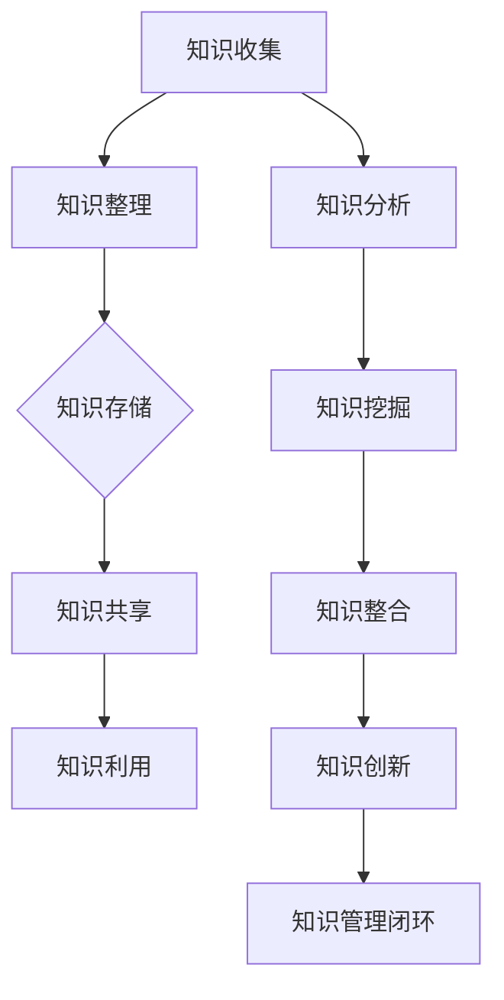
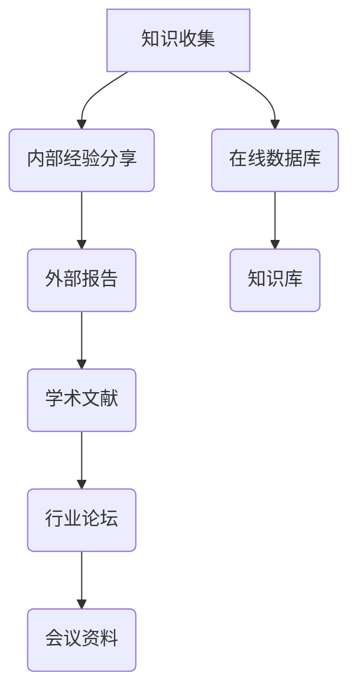
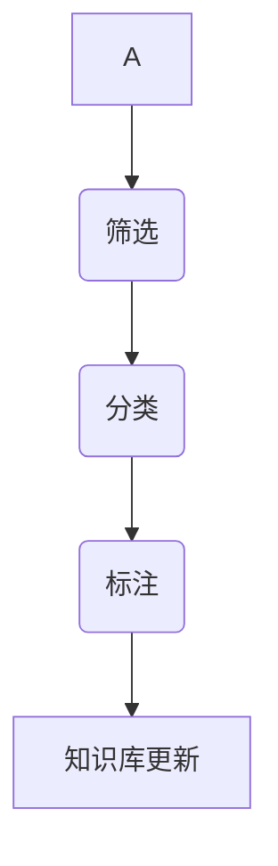
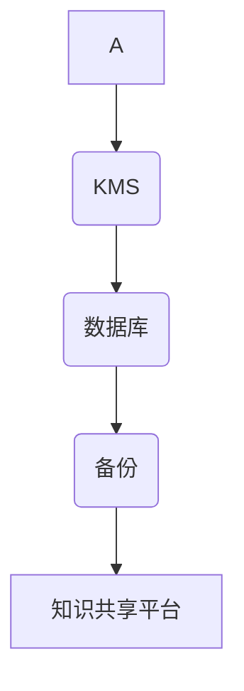
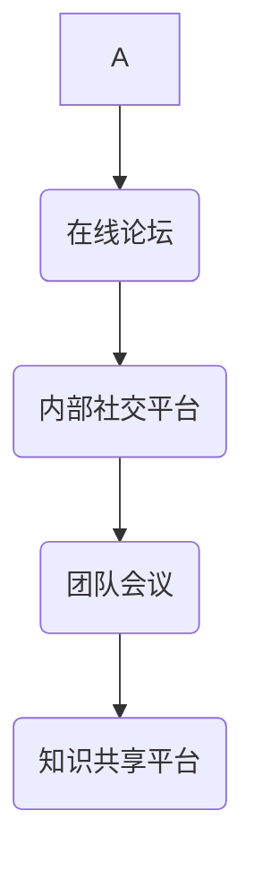
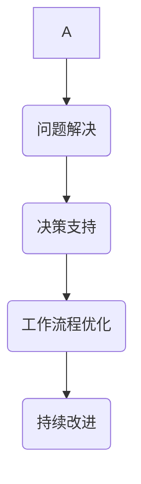
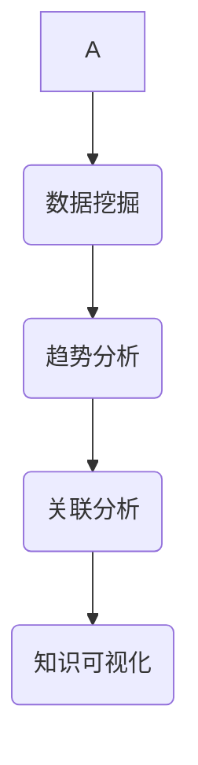
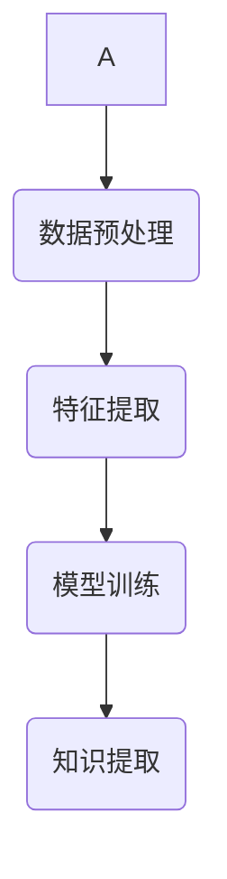

                 

# 知识管理：leveraging组织的集体智慧

> 关键词：知识管理、组织智慧、信息共享、协同工作、智能算法、流程优化、技术框架、项目实战

> 摘要：本文旨在探讨知识管理在现代组织中的重要性，以及如何利用组织的集体智慧来提升工作效率和创新能力。我们将从背景介绍、核心概念、算法原理、数学模型、项目实战、应用场景、工具推荐和未来发展趋势等方面，系统性地阐述知识管理的核心思想和技术实现。

## 1. 背景介绍

### 1.1 目的和范围

知识管理作为现代企业管理的重要组成部分，对于提升组织竞争力、推动持续创新具有重要意义。本文的目的在于：

- 分析知识管理的基本概念和核心要素。
- 阐述知识管理在组织中的重要性。
- 探讨如何利用组织的集体智慧来优化工作流程和提升创新能力。

本文的范围包括以下几个方面：

- 知识管理的定义、目的和基本流程。
- 知识管理中的关键技术和方法。
- 知识管理在各个行业中的应用案例。
- 知识管理的未来发展趋势和面临的挑战。

### 1.2 预期读者

本文面向以下读者群体：

- 企业管理者：了解知识管理的基本概念和实现方法，以便在实际工作中推动知识管理项目的实施。
- 知识管理从业者：掌握知识管理的最新技术和应用案例，提升自身专业素养。
- 程序员和技术人员：了解知识管理在软件开发和创新中的应用，为项目的成功提供技术支持。
- 研究人员：关注知识管理的理论研究和新技术的应用，为知识管理领域的发展提供新的思路。

### 1.3 文档结构概述

本文结构如下：

- 第1章：背景介绍，阐述知识管理的基本概念和重要性。
- 第2章：核心概念与联系，介绍知识管理的核心概念和相关流程。
- 第3章：核心算法原理 & 具体操作步骤，讲解知识管理中的关键算法和实现方法。
- 第4章：数学模型和公式 & 详细讲解 & 举例说明，分析知识管理中的数学模型和应用。
- 第5章：项目实战：代码实际案例和详细解释说明，通过具体案例展示知识管理的实际应用。
- 第6章：实际应用场景，探讨知识管理在不同领域的应用案例。
- 第7章：工具和资源推荐，介绍知识管理相关的学习资源、开发工具和框架。
- 第8章：总结：未来发展趋势与挑战，分析知识管理的未来发展趋势和面临的挑战。
- 第9章：附录：常见问题与解答，提供知识管理相关的常见问题解答。
- 第10章：扩展阅读 & 参考资料，推荐相关的扩展阅读资料。

### 1.4 术语表

#### 1.4.1 核心术语定义

- 知识管理：通过对知识进行收集、整理、存储、共享和利用，以提高组织工作效率和创新能力的过程。
- 组织智慧：组织内部成员通过知识共享和协同工作所形成的集体智慧。
- 信息共享：组织内部成员之间共享知识、经验和信息的过程。
- 协同工作：组织内部成员共同完成某项任务或项目的过程。
- 智能算法：利用机器学习和人工智能技术，对大规模数据进行处理和分析的算法。
- 流程优化：通过分析和改进工作流程，提高组织工作效率和质量。

#### 1.4.2 相关概念解释

- 知识：指人类通过实践和经验所获得的信息、技能、知识和认知。
- 信息：指以特定形式表达的知识，可以用于传递、存储和处理。
- 数据：指未经处理的原始信息，通常以数字、字符等形式存在。
- 知识共享：指组织内部成员之间共享知识、经验和信息的过程。
- 知识存储：指将知识以数字化的形式存储在数据库、知识库等工具中。
- 知识利用：指组织内部成员通过使用和整合知识，解决实际问题和提高工作效率。

#### 1.4.3 缩略词列表

- KMS：知识管理系统（Knowledge Management System）
- KM：知识管理（Knowledge Management）
- AI：人工智能（Artificial Intelligence）
- ML：机器学习（Machine Learning）
- NLP：自然语言处理（Natural Language Processing）
- IoT：物联网（Internet of Things）

## 2. 核心概念与联系

知识管理涉及多个核心概念和流程，以下是知识管理的基本原理和架构的 Mermaid 流程图：

### 2.1 知识收集

知识收集是知识管理的起点，包括从各种渠道获取知识的过程。这些渠道可以包括内部员工的经验分享、外部行业报告、学术研究文献、行业论坛和会议等。

### 2.2 知识整理

知识整理是对收集到的知识进行筛选、分类和标注的过程。这一步骤确保知识的质量和可访问性。

### 2.3 知识存储

知识存储是将整理后的知识以数字化的形式存储在知识库或其他数据库中，以便后续检索和利用。

### 2.4 知识共享

知识共享是组织内部成员之间共享知识、经验和信息的过程。这可以通过在线论坛、内部社交平台、团队会议等方式实现。

### 2.5 知识利用

知识利用是指组织内部成员通过使用和整合知识，解决实际问题和提高工作效率的过程。知识利用可以促进创新和持续改进。

### 2.6 知识分析

知识分析是指对存储在知识库中的知识进行挖掘、分析和处理的过程。这有助于发现潜在的价值和趋势。

### 2.7 知识挖掘

知识挖掘是指从大量数据中提取有价值的信息和知识的过程。这可以通过机器学习和人工智能技术实现。

### 2.8 知识整合

知识整合是指将不同来源、不同形式的知

