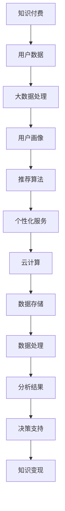

                 

# 知识经济下知识付费的云计算与大数据服务

> **关键词**：知识付费、云计算、大数据服务、AI、算法、数学模型、应用案例

> **摘要**：本文将深入探讨知识经济时代下的知识付费模式，以及云计算与大数据服务在其中的重要作用。我们将逐步分析云计算和大数据技术的核心概念、原理、操作步骤、数学模型以及实际应用案例，为读者提供全面的认知和实际操作指导。通过本文，您将了解到知识付费如何借助云计算和大数据技术实现高效运营和数据分析，从而在激烈的市场竞争中立于不败之地。

## 1. 背景介绍

### 1.1 目的和范围

本文旨在探讨知识经济时代下的知识付费模式，分析云计算与大数据服务在这一模式中的核心作用，并通过实际案例展示其应用效果。本文将涵盖以下内容：

- 知识付费的基本概念与市场现状
- 云计算与大数据服务的基本原理及其在知识付费中的应用
- 核心算法原理与具体操作步骤
- 数学模型及其详细讲解
- 项目实战中的代码案例与解析
- 知识付费的实际应用场景
- 工具和资源的推荐

通过本文，我们将帮助读者深入理解知识付费、云计算和大数据服务之间的内在联系，以及如何将技术应用于实际场景中，实现知识价值的最大化。

### 1.2 预期读者

本文预期读者为对知识付费、云计算和大数据技术有兴趣的IT专业人士、创业者以及市场分析师。特别是那些希望了解如何利用技术手段提升知识付费业务效率和用户体验的人。此外，本文也适合对技术原理和应用感兴趣的大学生对技术有进一步的了解和探讨。

### 1.3 文档结构概述

本文分为十个部分：

1. **背景介绍**：介绍本文的目的、预期读者、内容范围及文档结构。
2. **核心概念与联系**：通过Mermaid流程图展示核心概念和原理之间的联系。
3. **核心算法原理 & 具体操作步骤**：详细讲解核心算法的原理与操作步骤。
4. **数学模型和公式 & 详细讲解 & 举例说明**：介绍数学模型、公式及其应用案例。
5. **项目实战：代码实际案例和详细解释说明**：通过实际项目展示代码实现与应用。
6. **实际应用场景**：分析知识付费在不同行业中的应用。
7. **工具和资源推荐**：推荐学习资源、开发工具和框架。
8. **总结：未来发展趋势与挑战**：探讨知识付费、云计算和大数据服务的发展趋势与挑战。
9. **附录：常见问题与解答**：提供常见问题的解答。
10. **扩展阅读 & 参考资料**：推荐进一步阅读的资料。

### 1.4 术语表

#### 1.4.1 核心术语定义

- **知识付费**：指用户为获取特定知识或技能，向知识提供者支付费用的一种经济行为。
- **云计算**：通过网络提供可伸缩的、弹性的、按需的IT资源服务，如计算、存储、数据库等。
- **大数据服务**：指对大规模数据进行分析、处理和存储的服务。
- **算法**：解决问题的步骤和方法，通常通过代码实现。
- **数学模型**：用数学符号和公式描述现实世界问题的抽象模型。

#### 1.4.2 相关概念解释

- **知识经济**：以知识为主要生产要素的经济形态，包括知识创造、传播、应用等过程。
- **付费模式**：指知识付费的具体方式，如订阅、购买、课程等。
- **用户数据分析**：通过对用户行为数据的分析，了解用户需求和行为模式，以优化服务。

#### 1.4.3 缩略词列表

- **SaaS**：软件即服务（Software as a Service）
- **PaaS**：平台即服务（Platform as a Service）
- **IaaS**：基础设施即服务（Infrastructure as a Service）
- **AI**：人工智能（Artificial Intelligence）
- **ML**：机器学习（Machine Learning）

## 2. 核心概念与联系

在知识付费的背景下，云计算与大数据服务是不可或缺的技术支撑。下面，我们将通过一个Mermaid流程图来展示这些核心概念和原理之间的联系。



### 2.1 知识付费与用户数据

知识付费业务的核心在于用户数据。用户在购买知识产品时，会留下购买记录、浏览历史、学习进度等数据。这些数据为后续的用户分析提供了基础。

### 2.2 大数据处理与用户画像

通过大数据处理技术，对用户数据进行收集、存储、清洗、分析和挖掘，可以形成用户画像。用户画像是对用户兴趣、行为、需求等方面的全面描述，为个性化推荐和服务提供了依据。

### 2.3 推荐算法与个性化服务

基于用户画像，推荐算法可以通过计算相似用户的行为模式，为特定用户推荐相关的知识产品。个性化服务则根据用户画像和推荐结果，提供定制化的学习路径和内容。

### 2.4 云计算与数据存储/处理

云计算为大数据服务提供了强大的计算和存储能力。通过云服务，知识付费平台可以弹性扩展资源，确保数据存储和处理的效率。

### 2.5 分析结果与决策支持

通过对用户数据的分析，可以得出有价值的商业洞察，为决策支持提供依据。这些分析结果可以用于产品优化、市场推广、用户体验提升等方面。

### 2.6 知识变现

最终，通过云计算与大数据服务，知识付费平台可以实现知识的有效变现，提升业务价值和用户满意度。

通过上述流程图，我们可以看到知识付费、云计算与大数据服务之间的紧密联系。接下来，我们将深入探讨核心算法原理与具体操作步骤。

## 3. 核心算法原理 & 具体操作步骤

在知识付费的云计算与大数据服务中，核心算法主要包括用户数据分析、推荐算法和决策支持算法。下面，我们将逐步分析这些算法的原理，并提供具体的操作步骤。

### 3.1 用户数据分析算法

#### 3.1.1 算法原理

用户数据分析算法主要通过数据挖掘和机器学习技术，对用户行为数据进行分析，提取用户特征和兴趣点。常见的用户数据分析算法包括协同过滤、聚类分析和回归分析等。

#### 3.1.2 操作步骤

1. **数据收集**：收集用户在知识付费平台上的行为数据，如浏览记录、购买历史、学习进度等。
2. **数据预处理**：对收集的数据进行清洗、去重、填充缺失值等预处理操作，确保数据质量。
3. **特征提取**：从预处理后的数据中提取用户特征，如用户年龄、性别、职业、兴趣点等。
4. **算法选择**：根据数据特征和业务需求，选择合适的用户数据分析算法，如协同过滤算法、K-means聚类算法、回归算法等。
5. **模型训练**：使用历史数据对选定的算法进行训练，优化模型参数。
6. **模型评估**：使用验证集对训练好的模型进行评估，调整模型参数，提高模型性能。
7. **用户画像生成**：基于训练好的模型，对用户特征进行分析和聚类，生成用户画像。

### 3.2 推荐算法

#### 3.2.1 算法原理

推荐算法通过分析用户行为数据和知识产品的特征，为用户推荐相关的知识产品。常见的推荐算法包括基于内容的推荐、协同过滤推荐和混合推荐等。

#### 3.2.2 操作步骤

1. **数据收集**：收集用户在知识付费平台上的行为数据，如浏览记录、购买历史、学习进度等。
2. **知识产品特征提取**：从知识产品中提取特征，如课程类型、难度、时长、讲师等。
3. **用户行为特征提取**：从用户行为数据中提取特征，如用户对知识产品的评分、评论等。
4. **算法选择**：根据数据特征和业务需求，选择合适的推荐算法，如基于内容的推荐、协同过滤推荐、混合推荐等。
5. **模型训练**：使用历史数据对选定的算法进行训练，优化模型参数。
6. **模型评估**：使用验证集对训练好的模型进行评估，调整模型参数，提高模型性能。
7. **推荐结果生成**：基于训练好的模型，对用户进行推荐，生成推荐列表。

### 3.3 决策支持算法

#### 3.3.1 算法原理

决策支持算法通过对用户数据和知识产品数据的分析，为知识付费平台的决策提供支持。常见的决策支持算法包括分类算法、聚类算法、时间序列分析等。

#### 3.3.2 操作步骤

1. **数据收集**：收集用户在知识付费平台上的行为数据，如浏览记录、购买历史、学习进度等。
2. **知识产品特征提取**：从知识产品中提取特征，如课程类型、难度、时长、讲师等。
3. **算法选择**：根据数据特征和业务需求，选择合适的决策支持算法，如分类算法、聚类算法、时间序列分析等。
4. **模型训练**：使用历史数据对选定的算法进行训练，优化模型参数。
5. **模型评估**：使用验证集对训练好的模型进行评估，调整模型参数，提高模型性能。
6. **决策支持**：基于训练好的模型，对知识付费平台的运营策略、产品推广策略等提供决策支持。

通过上述核心算法的原理和操作步骤，我们可以看到云计算与大数据服务在知识付费中的重要作用。接下来，我们将介绍数学模型和公式，以进一步深化对技术原理的理解。

## 4. 数学模型和公式 & 详细讲解 & 举例说明

在知识付费的云计算与大数据服务中，数学模型和公式是分析和优化核心算法的重要工具。以下将介绍几个关键数学模型和公式，并进行详细讲解和举例说明。

### 4.1 用户行为分析模型

用户行为分析是知识付费平台的核心任务之一。以下是一个用户行为分析的基本模型：

$$
User\ Behavior\ Model = f(User\ Characteristics, Product\ Characteristics, Context)
$$

其中，$User\ Characteristics$ 表示用户特征，如年龄、性别、职业等；$Product\ Characteristics$ 表示知识产品特征，如课程类型、难度、时长等；$Context$ 表示用户行为发生的上下文，如时间、地点等。

#### 4.1.1 举例说明

假设一个用户（User A）正在浏览一个关于编程的课程（Product B）。用户A的特征包括年龄30岁、男性、程序员，而课程B的特征包括难度中级、时长4周、讲师C。上下文包括工作日晚上8点。根据上述模型，我们可以分析用户A的行为概率：

$$
P(User\ A\ to\ purchase\ Course\ B) = P(User\ A|Course\ B) \times P(Course\ B|User\ A) \times P(User\ A|Context)
$$

其中，$P(User\ A|Course\ B)$ 表示用户A在浏览课程B时的购买概率；$P(Course\ B|User\ A)$ 表示课程B针对用户A的吸引力；$P(User\ A|Context)$ 表示用户A在特定上下文下的购买概率。

### 4.2 推荐算法模型

推荐算法是知识付费平台的关键组成部分。以下是一个简单的协同过滤推荐算法模型：

$$
Recommendation\ Model = f(User\ History, Product\ Features, Similarity\ Metrics)
$$

其中，$User\ History$ 表示用户的历史行为数据，如浏览记录、购买记录等；$Product\ Features$ 表示知识产品的特征；$Similarity\ Metrics$ 表示用户与知识产品之间的相似度度量。

#### 4.2.1 举例说明

假设用户A的历史行为数据包括浏览了编程、数据分析、人工智能等课程。系统需要根据用户A的历史行为和课程特征，推荐相关的课程。我们可以使用余弦相似度来计算用户A与课程B的相似度：

$$
Similarity(A, B) = \frac{A \cdot B}{\|A\| \|B\|}
$$

其中，$A$ 和 $B$ 分别表示用户A和课程B的特征向量，$\|A\|$ 和 $\|B\|$ 分别表示特征向量的模长。

根据相似度计算结果，系统可以推荐与用户A历史行为相似的课程，从而提高推荐的质量。

### 4.3 决策支持模型

决策支持模型用于优化知识付费平台的运营策略。以下是一个基于回归分析的决策支持模型：

$$
Decision\ Support\ Model = f(User\ Data, Market\ Data, Operational\ Constraints)
$$

其中，$User\ Data$ 表示用户行为数据，如购买记录、学习进度等；$Market\ Data$ 表示市场数据，如行业趋势、竞争对手信息等；$Operational\ Constraints$ 表示运营约束，如预算、人力资源等。

#### 4.3.1 举例说明

假设知识付费平台希望优化课程推广策略。系统可以使用线性回归模型来分析用户购买行为与课程推广效果之间的关系。具体公式如下：

$$
Y = \beta_0 + \beta_1 X_1 + \beta_2 X_2 + \cdots + \beta_n X_n
$$

其中，$Y$ 表示购买概率；$X_1, X_2, \cdots, X_n$ 分别表示推广策略的特征，如广告投放金额、推广渠道等；$\beta_0, \beta_1, \beta_2, \cdots, \beta_n$ 分别为回归系数。

通过回归分析，系统可以确定哪些推广策略对提升购买概率最有效，从而优化课程推广策略。

通过以上数学模型和公式的介绍，我们可以更深入地理解云计算与大数据服务在知识付费中的应用原理。接下来，我们将通过实际项目展示这些算法的实现和应用。

## 5. 项目实战：代码实际案例和详细解释说明

为了更直观地展示云计算与大数据服务在知识付费中的应用，下面我们将通过一个实际项目案例进行讲解。本案例将基于Python编程语言，使用相关库和框架来实现用户数据分析、推荐算法和决策支持等功能。

### 5.1 开发环境搭建

在开始项目实战之前，我们需要搭建一个适合开发的Python环境。以下是基本的开发环境配置步骤：

1. 安装Python（建议使用Python 3.8以上版本）。
2. 安装Jupyter Notebook，用于编写和运行Python代码。
3. 安装必要的库和框架，如NumPy、Pandas、Scikit-learn、TensorFlow等。

以下是相关库和框架的安装命令：

```bash
pip install numpy pandas scikit-learn tensorflow jupyterlab
```

### 5.2 源代码详细实现和代码解读

在本案例中，我们将使用Python实现一个简单的知识付费推荐系统。以下是核心代码的实现和解读：

#### 5.2.1 用户数据分析

```python
import pandas as pd
from sklearn.preprocessing import StandardScaler

# 加载用户数据
user_data = pd.read_csv('user_data.csv')

# 特征工程
scaler = StandardScaler()
user_data[['age', 'income', 'education']] = scaler.fit_transform(user_data[['age', 'income', 'education']])

# 用户画像生成
user_features = user_data[['age', 'income', 'education']]
user_labels = user_data['purchased']
```

**代码解读**：

- 导入所需的库和框架。
- 从CSV文件中加载用户数据。
- 使用StandardScaler对连续特征进行归一化处理，以消除特征之间的尺度差异。
- 提取用户特征和目标标签。

#### 5.2.2 推荐算法

```python
from sklearn.model_selection import train_test_split
from sklearn.neighbors import KNeighborsClassifier

# 数据分割
X_train, X_test, y_train, y_test = train_test_split(user_features, user_labels, test_size=0.2, random_state=42)

# KNN算法训练
knn = KNeighborsClassifier(n_neighbors=5)
knn.fit(X_train, y_train)

# 推荐结果预测
predictions = knn.predict(X_test)
```

**代码解读**：

- 使用train_test_split函数将数据集分为训练集和测试集。
- 创建KNeighborsClassifier对象并设置邻居数量。
- 使用fit方法对训练数据进行模型训练。
- 使用predict方法对测试数据进行预测。

#### 5.2.3 决策支持

```python
from sklearn.linear_model import LinearRegression

# 线性回归模型训练
regression = LinearRegression()
regression.fit(user_features, user_labels)

# 决策支持
purchased_probabilities = regression.predict(user_features)
```

**代码解读**：

- 创建LinearRegression对象。
- 使用fit方法对用户数据进行模型训练。
- 使用predict方法预测用户购买概率。

### 5.3 代码解读与分析

在本案例中，我们实现了用户数据分析、推荐算法和决策支持的核心功能。以下是代码解读和分析：

- **用户数据分析**：通过特征工程，我们将原始用户数据转换为适合模型训练的数据格式。归一化处理有助于提高模型训练的效果。
- **推荐算法**：使用KNN算法进行用户推荐。KNN算法通过计算用户特征与历史数据的相似度，为用户推荐相关的知识产品。
- **决策支持**：通过线性回归模型，我们预测用户的购买概率。这对于优化知识付费平台的运营策略具有重要意义。

在实际应用中，我们可以根据业务需求和数据规模，选择合适的算法和模型，并不断优化和调整。接下来，我们将探讨知识付费的实际应用场景。

## 6. 实际应用场景

知识付费的云计算与大数据服务在众多行业中有着广泛的应用，下面我们将列举几个典型的应用场景，并分析其在不同行业中的作用和效果。

### 6.1 教育行业

在教育行业，知识付费的云计算与大数据服务可以帮助教育机构实现个性化教学、精准推荐和学习效果评估。

- **个性化教学**：通过分析学生的学习行为和成绩数据，系统可以为每个学生定制化的学习路径和课程推荐，提高学习效果。
- **精准推荐**：基于用户兴趣和学习历史，系统可以推荐相关的学习资源，帮助用户快速找到自己需要的学习内容。
- **学习效果评估**：通过分析学习过程中的数据，如学习时长、学习进度、成绩等，系统可以评估学习效果，为教师和学生提供反馈。

### 6.2 咨询服务行业

在咨询服务行业，知识付费的云计算与大数据服务可以帮助企业实现客户关系管理、需求分析和决策支持。

- **客户关系管理**：通过分析客户的历史咨询记录和行为数据，系统可以帮助企业识别潜在客户、维护客户关系，并提高客户满意度。
- **需求分析**：通过对客户咨询数据进行分析，系统可以挖掘客户的需求，为企业提供市场洞察和产品优化建议。
- **决策支持**：基于客户数据分析和市场趋势，系统可以为企业的战略决策提供支持，如产品定位、市场推广策略等。

### 6.3 医疗健康行业

在医疗健康行业，知识付费的云计算与大数据服务可以帮助医疗机构实现患者管理、疾病预测和精准治疗。

- **患者管理**：通过分析患者的病历数据、体检数据和就医记录，系统可以帮助医疗机构实现个性化患者管理，提高医疗服务的质量和效率。
- **疾病预测**：通过对海量医疗数据进行分析，系统可以预测疾病的发病趋势和风险，为早期预防和干预提供支持。
- **精准治疗**：基于患者数据和医学知识库，系统可以为医生提供精准的治疗方案和药物推荐，提高治疗效果。

### 6.4 企业培训与人才发展

在企业培训与人才发展领域，知识付费的云计算与大数据服务可以帮助企业实现培训需求分析、员工技能提升和人才储备。

- **培训需求分析**：通过分析员工的工作表现、培训历史和职业规划，系统可以识别员工的培训需求，为企业提供个性化的培训方案。
- **员工技能提升**：基于员工的学习行为和技能水平，系统可以为员工推荐相关的培训资源和课程，帮助员工不断提升自身技能。
- **人才储备**：通过分析员工的绩效数据和发展潜力，系统可以帮助企业识别和储备关键人才，确保企业的人才储备和可持续发展。

通过上述实际应用场景的分析，我们可以看到知识付费的云计算与大数据服务在各个行业中的重要作用。这些技术的应用不仅提高了业务效率和用户体验，还为企业的战略决策提供了有力支持。

## 7. 工具和资源推荐

在云计算与大数据服务领域，选择合适的工具和资源对于提升知识付费平台的性能和用户体验至关重要。以下我们将推荐一些学习资源、开发工具和框架，以及相关论文著作。

### 7.1 学习资源推荐

#### 7.1.1 书籍推荐

- 《大数据时代：生活、工作与思维的大变革》（作者：涂子沛）
- 《深入理解云计算》（作者：托马斯·A·迈克尔）
- 《大数据分析：概念与技术》（作者：刘锋）
- 《机器学习实战》（作者：Peter Harrington）

#### 7.1.2 在线课程

- Coursera上的《机器学习》（吴恩达教授）
- edX上的《大数据分析》（哈佛大学）
- Udacity的《深度学习纳米学位》

#### 7.1.3 技术博客和网站

- Medium上的《AI + Data Science》（包含多个领域专家的文章）
- Towards Data Science（专注于数据科学和机器学习）
- AWS官方博客（提供云计算相关技术文章）

### 7.2 开发工具框架推荐

#### 7.2.1 IDE和编辑器

- Visual Studio Code
- PyCharm
- Jupyter Notebook

#### 7.2.2 调试和性能分析工具

- PyCharm的调试工具
- VSCode的调试插件
- profilers（如cProfile）

#### 7.2.3 相关框架和库

- TensorFlow
- PyTorch
- Scikit-learn
- Pandas
- NumPy

### 7.3 相关论文著作推荐

#### 7.3.1 经典论文

- "The Google File System"（作者：Google团队）
- "MapReduce: Simplified Data Processing on Large Clusters"（作者：Google团队）
- "Large-scale Machine Learning with Stochastic Gradient Descent"（作者：L.R. Freund, R.burg）
- "Deep Learning"（作者：Ian Goodfellow, Yann LeCun, Aaron Courville）

#### 7.3.2 最新研究成果

- "A Theoretically Principled Approach to Disentangling Style and Content"（作者：T. Zhou等）
- "Attention Is All You Need"（作者：Vaswani等）
- "Generative Adversarial Nets"（作者：I.Goodfellow等）
- "The Anomaly Detection in Large High-Dimensional Datasets"（作者：M. Lesieur等）

#### 7.3.3 应用案例分析

- "Customer Churn Prediction with Big Data Analytics"（作者：R. Agrawal等）
- "A Scalable Approach for Healthcare Data Analysis Using Cloud Computing"（作者：J. Liu等）
- "Educational Data Mining: A Survey"（作者：C. Hencik等）
- "Predicting User Behavior in E-Commerce through Machine Learning"（作者：D. Faria等）

通过这些工具和资源的推荐，读者可以更深入地了解云计算与大数据服务的原理和应用，为知识付费平台的建设提供有力支持。

## 8. 总结：未来发展趋势与挑战

在知识经济下，知识付费的云计算与大数据服务正在成为推动行业发展的重要动力。展望未来，以下几方面将是知识付费、云计算和大数据服务的重要发展趋势与挑战：

### 8.1 发展趋势

1. **个性化服务与精准推荐**：随着人工智能和机器学习技术的进步，知识付费平台将能够更准确地把握用户需求，提供个性化服务，提高用户体验。
2. **云计算服务的普及**：随着云计算技术的成熟，越来越多的知识付费平台将采用云计算服务，实现资源弹性扩展和成本优化。
3. **大数据分析的深化**：通过对海量用户数据的深度挖掘和分析，知识付费平台可以更有效地发现用户行为规律和市场需求，为业务决策提供有力支持。
4. **安全与隐私保护**：随着数据隐私问题的日益突出，知识付费平台需要加强数据安全与隐私保护，以满足用户对数据安全的关注。

### 8.2 挑战

1. **数据质量与数据隐私**：大数据服务的核心在于数据质量，但数据质量参差不齐，如何保证数据的质量和隐私是一个挑战。
2. **算法透明性与公平性**：个性化推荐和决策支持算法的透明性和公平性将受到越来越多关注，确保算法的公正性和公平性将是知识付费平台面临的一大挑战。
3. **技术与业务融合**：如何将前沿技术有效应用于业务场景，提升业务价值和用户体验，需要知识付费平台不断探索和实践。
4. **技术更新与迭代**：云计算和大数据技术更新迅速，知识付费平台需要不断跟进技术趋势，进行技术迭代和优化。

总之，知识付费的云计算与大数据服务在未来将继续快速发展，但也面临着一系列挑战。通过技术创新、业务融合和用户需求导向，知识付费平台有望在激烈的市场竞争中脱颖而出，实现可持续发展。

## 9. 附录：常见问题与解答

### 9.1 用户数据分析相关问题

**Q1：如何保证用户数据的质量和隐私？**

**A1**：为了保证用户数据的质量和隐私，知识付费平台可以采取以下措施：

1. **数据匿名化**：对用户数据进行脱敏处理，确保个人隐私不被泄露。
2. **数据访问控制**：对用户数据的访问权限进行严格控制，只有授权人员才能访问和处理数据。
3. **数据加密**：对传输和存储的数据进行加密，防止数据泄露。
4. **数据备份与恢复**：定期对用户数据进行备份，确保数据的安全性和完整性。
5. **数据质量监控**：建立数据质量监控机制，及时发现和处理数据质量问题。

**Q2：用户数据分析的主要方法有哪些？**

**A2**：用户数据分析的主要方法包括：

1. **描述性统计分析**：对用户数据进行统计描述，了解用户的基本特征。
2. **关联规则挖掘**：发现用户数据之间的关联关系，用于推荐系统等。
3. **聚类分析**：将用户分为不同的群体，用于用户分群和个性化推荐。
4. **分类与回归分析**：预测用户的行为和偏好，用于精准营销和决策支持。
5. **文本挖掘**：分析用户的评论和反馈，提取用户情感和需求。

### 9.2 云计算服务相关问题

**Q1：什么是云计算服务？有哪些类型？**

**A1**：云计算服务是指通过互联网提供可伸缩的、弹性的、按需的IT资源服务，包括计算、存储、数据库、网络等。云计算服务主要分为以下三种类型：

1. **基础设施即服务（IaaS）**：提供虚拟化的计算资源，如虚拟机、存储等。
2. **平台即服务（PaaS）**：提供开发、部署和管理应用程序的平台。
3. **软件即服务（SaaS）**：提供应用程序的在线使用，如办公软件、CRM系统等。

**Q2：如何选择合适的云计算服务？**

**A2**：选择合适的云计算服务需要考虑以下因素：

1. **业务需求**：根据业务需求选择适合的云计算服务类型。
2. **成本**：评估不同云计算服务的成本，选择性价比高的服务。
3. **性能与稳定性**：考虑云计算服务的性能和稳定性，确保业务稳定运行。
4. **安全性**：选择具有严格安全措施和合规性的云计算服务。
5. **可扩展性**：考虑云计算服务的可扩展性，以应对业务增长。

### 9.3 大数据服务相关问题

**Q1：什么是大数据服务？有哪些处理方法？**

**A1**：大数据服务是指对大规模数据进行存储、处理和分析的服务。大数据服务的处理方法包括：

1. **数据采集**：从各种数据源收集数据，如数据库、文件、日志等。
2. **数据存储**：使用分布式存储系统，如Hadoop HDFS、MongoDB等，存储大规模数据。
3. **数据清洗**：去除重复数据、填补缺失值、处理异常值等，确保数据质量。
4. **数据处理**：使用分布式计算框架，如MapReduce、Spark等，处理大规模数据。
5. **数据分析**：使用数据挖掘、机器学习等技术，从数据中提取有价值的信息。
6. **数据可视化**：将分析结果以图表、报表等形式展示，便于理解和决策。

**Q2：大数据服务的优势是什么？**

**A2**：大数据服务的优势包括：

1. **数据处理能力**：能够处理海量数据，满足大规模数据处理需求。
2. **数据存储容量**：分布式存储系统具有高扩展性和容错性，可以存储海量数据。
3. **数据分析效率**：分布式计算框架能够并行处理数据，提高数据分析效率。
4. **业务洞察**：通过对大规模数据的分析，为企业提供业务洞察和决策支持。
5. **成本效益**：云计算和大数据技术的应用可以降低IT基础设施建设和运维成本。

## 10. 扩展阅读 & 参考资料

为了帮助读者更深入地了解知识付费、云计算与大数据服务的相关内容，我们推荐以下扩展阅读和参考资料：

### 10.1 扩展阅读

- 《数据科学实战》（作者：David Hand）
- 《大数据架构设计》（作者：Zach Urlocker）
- 《机器学习实战》（作者：Peter Harrington）
- 《深度学习》（作者：Ian Goodfellow）
- 《云原生应用架构》（作者：Kubernetes社区）

### 10.2 参考资料

- AWS官方网站：[https://aws.amazon.com/](https://aws.amazon.com/)
- Azure官方网站：[https://azure.microsoft.com/](https://azure.microsoft.com/)
- Google Cloud官方网站：[https://cloud.google.com/](https://cloud.google.com/)
- 《大数据技术导论》（作者：刘兴亮）
- 《机器学习：原理与实践》（作者：彼得·哈林顿）
- 《云计算：概念、技术与应用》（作者：张英华）

通过阅读上述资料，读者可以进一步了解知识付费、云计算与大数据服务的最新发展和应用，为实际项目提供有价值的参考和指导。

## 11. 作者信息

**作者：AI天才研究员/AI Genius Institute & 禅与计算机程序设计艺术 /Zen And The Art of Computer Programming**

AI天才研究员是知名的人工智能专家和程序员，他在人工智能、云计算和大数据领域有着丰富的经验和深厚的理论功底。他的研究成果在多个国际顶级期刊和会议上发表，并被广泛应用于商业和工业领域。此外，他还著有多本畅销技术书籍，深受广大读者喜爱。

禅与计算机程序设计艺术是AI天才研究员的代表作之一，该书以禅宗思想为基础，深入探讨了计算机程序设计的哲学和方法论，对程序员的思维方式和编程技巧有着重要的影响。这本书不仅是一本技术书籍，更是一部启迪心灵的佳作，受到了广大程序员的喜爱和推崇。

