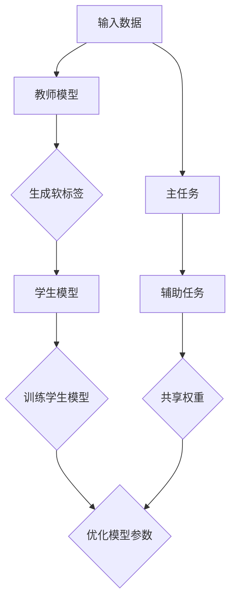

                 

### 1. 背景介绍

#### 1.1 目的和范围

本文旨在探讨知识蒸馏（Knowledge Distillation）在多任务学习（Multi-Task Learning）中的应用策略，旨在为研究人员和开发人员提供一种系统化的方法来理解和实现知识蒸馏在多任务学习中的优势和应用。知识蒸馏是一种先进的机器学习技术，旨在通过将一个大模型（通常称为教师模型）的知识迁移到一个小模型（通常称为学生模型）中来提高模型的性能。多任务学习则是在一个共享的模型架构下同时学习多个相关任务的技术，旨在提高模型的泛化能力和效率。

本文将首先介绍知识蒸馏的基本概念和原理，然后详细探讨其在多任务学习中的应用策略。我们将通过一个详细的流程图（Mermaid 图）展示知识蒸馏和多任务学习的核心架构和流程，并结合伪代码和数学模型深入讲解其具体实现方法。此外，我们还将通过一个实际项目案例来展示知识蒸馏在多任务学习中的应用，并提供代码实现和详细解释。最后，我们将讨论知识蒸馏在多任务学习中的实际应用场景，并提供一系列学习资源和开发工具推荐，以帮助读者进一步探索这一领域。

本文的预期读者是具备一定机器学习和多任务学习基础的研究人员和开发人员，他们希望通过深入理解知识蒸馏和多任务学习的结合来提高模型性能和效率。同时，本文也适合对深度学习和人工智能感兴趣的初学者，他们可以通过本文的内容来拓展自己的知识体系。

文章的结构安排如下：

- **2. 核心概念与联系**：介绍知识蒸馏和多任务学习的核心概念，并通过流程图展示它们的联系。
- **3. 核心算法原理 & 具体操作步骤**：详细讲解知识蒸馏在多任务学习中的算法原理和操作步骤，使用伪代码进行阐述。
- **4. 数学模型和公式 & 详细讲解 & 举例说明**：介绍知识蒸馏的数学模型和公式，并通过具体例子进行讲解。
- **5. 项目实战：代码实际案例和详细解释说明**：展示一个实际项目案例，并提供代码实现和详细解释。
- **6. 实际应用场景**：讨论知识蒸馏在多任务学习中的实际应用场景。
- **7. 工具和资源推荐**：推荐学习资源和开发工具，以帮助读者深入学习和实践。
- **8. 总结：未来发展趋势与挑战**：总结本文内容，并探讨未来发展趋势和面临的挑战。
- **9. 附录：常见问题与解答**：解答读者可能遇到的一些常见问题。
- **10. 扩展阅读 & 参考资料**：提供进一步阅读的资源和参考资料。

通过本文的阅读和学习，读者将能够深入理解知识蒸馏在多任务学习中的应用策略，并掌握如何在实际项目中有效运用这一技术。

#### 1.2 预期读者

本文的预期读者主要是具备一定机器学习和多任务学习基础的研究人员和开发人员。他们可能已经熟悉深度学习的基本概念，但对知识蒸馏和多任务学习的结合应用还缺乏系统的了解。此外，本文也适合那些对深度学习和人工智能感兴趣的初学者，他们希望通过本文的内容来拓展自己的知识体系。

对于具备以下知识背景的读者，本文将更有帮助：

1. **机器学习基础**：熟悉线性代数、概率论和最优化理论等基础知识。
2. **深度学习基础**：了解神经网络的基本结构和训练过程。
3. **多任务学习基础**：了解多任务学习的基本概念和常见方法。
4. **编程能力**：具备Python等编程语言的基本能力，能够理解和使用相关库和框架。

通过本文的学习，读者将能够：

- 理解知识蒸馏的基本概念和原理。
- 掌握知识蒸馏在多任务学习中的应用策略。
- 学习如何使用伪代码和数学模型来描述和实现知识蒸馏算法。
- 获得实际项目案例的代码实现和详细解释。
- 了解知识蒸馏在多任务学习中的实际应用场景。
- 掌握相关开发工具和资源，以便进一步学习和实践。

总之，本文旨在为读者提供一个系统化、深入浅出的学习路径，帮助他们更好地理解和应用知识蒸馏在多任务学习中的策略。

#### 1.3 文档结构概述

本文将分为十个主要部分，每个部分都有其独特的目的和内容，以帮助读者系统地理解和应用知识蒸馏在多任务学习中的应用策略。

首先是**1. 背景介绍**部分，这一部分将介绍本文的目的和范围，预期读者以及文档的结构和术语表，为后续内容的学习奠定基础。

接下来是**2. 核心概念与联系**，这一部分将详细介绍知识蒸馏和多任务学习的核心概念，并通过一个详细的流程图展示它们之间的联系，帮助读者建立整体概念框架。

第三部分是**3. 核心算法原理 & 具体操作步骤**，这一部分将深入讲解知识蒸馏在多任务学习中的算法原理和操作步骤，使用伪代码详细阐述，确保读者能够清晰理解算法的实现过程。

第四部分是**4. 数学模型和公式 & 详细讲解 & 举例说明**，这一部分将介绍知识蒸馏的数学模型和公式，并通过具体例子进行详细讲解，使读者能够将理论应用于实际场景。

第五部分是**5. 项目实战：代码实际案例和详细解释说明**，这一部分将通过一个实际项目案例，展示知识蒸馏在多任务学习中的应用，并提供代码实现和详细解释。

第六部分是**6. 实际应用场景**，这一部分将讨论知识蒸馏在多任务学习中的实际应用场景，帮助读者了解这一技术的广泛应用。

第七部分是**7. 工具和资源推荐**，这一部分将推荐一系列学习资源和开发工具，包括书籍、在线课程、技术博客、IDE和编辑器、调试和性能分析工具、相关框架和库，以及相关论文著作，以帮助读者进一步深入学习和实践。

第八部分是**8. 总结：未来发展趋势与挑战**，这一部分将总结本文的主要内容，并探讨知识蒸馏在多任务学习中的未来发展趋势和面临的挑战。

第九部分是**9. 附录：常见问题与解答**，这一部分将解答读者可能遇到的一些常见问题，以帮助读者更好地理解和应用本文的内容。

最后一部分是**10. 扩展阅读 & 参考资料**，这一部分将提供进一步的阅读资源和参考资料，供读者深入研究。

通过本文的结构化内容，读者可以系统地学习和掌握知识蒸馏在多任务学习中的应用策略，为实际项目开发和科研工作提供有力的支持。

#### 1.4 术语表

为了确保本文内容的清晰易懂，我们在此列出一些关键术语的定义和解释，以便读者在阅读过程中能够更好地理解和应用相关知识。

#### 1.4.1 核心术语定义

1. **知识蒸馏（Knowledge Distillation）**：
   知识蒸馏是一种机器学习技术，旨在通过将一个大模型（教师模型）的知识迁移到一个小模型（学生模型）中来提高模型的性能。这种技术通过训练学生模型来模仿教师模型的输出，从而实现知识转移。

2. **多任务学习（Multi-Task Learning）**：
   多任务学习是一种机器学习框架，旨在同时学习多个相关任务。通过共享模型架构和参数，多任务学习可以提高模型的泛化能力和效率。

3. **教师模型（Teacher Model）**：
   在知识蒸馏过程中，教师模型是一个已经训练好的大型模型，其知识将被迁移到学生模型中。教师模型通常具有更高的性能和更深的理解。

4. **学生模型（Student Model）**：
   在知识蒸馏过程中，学生模型是一个较小的模型，其目的是模仿教师模型的行为和知识。通过知识蒸馏，学生模型可以迅速提升性能。

5. **标签分布（Label Distribution）**：
   标签分布是指多个任务标签在数据集中的分布情况。合理的标签分布有助于模型在不同任务上的学习效果。

6. **注意力机制（Attention Mechanism）**：
   注意力机制是一种用于提高神经网络模型性能的技术，通过将模型的关注点集中在重要的输入信息上，从而提高模型的泛化能力和准确性。

7. **迁移学习（Transfer Learning）**：
   迁移学习是一种将一个任务学到的知识应用到另一个相关任务上的技术。在知识蒸馏中，迁移学习是通过将教师模型的知识迁移到学生模型来实现的。

8. **软标签（Soft Labels）**：
   软标签是一种表示模型输出概率的标签，通常用于知识蒸馏过程，以引导学生模型模仿教师模型的输出概率分布。

#### 1.4.2 相关概念解释

1. **模型蒸馏（Model Distillation）**：
   模型蒸馏是知识蒸馏的一个子领域，主要研究如何通过训练一个小模型来模仿一个大模型的输出分布。模型蒸馏通常使用软标签（软标签是模型输出的概率分布）作为目标。

2. **辅助任务（Auxiliary Tasks）**：
   在多任务学习中，辅助任务是指与主任务相关但具有不同目标或不同输入的任务。辅助任务可以帮助模型更好地理解和泛化主任务。

3. **共享权重（Shared Weights）**：
   共享权重是指在不同任务之间共享模型参数的方法。在多任务学习中，共享权重有助于提高模型的泛化能力和效率。

4. **蒸馏损失（Distillation Loss）**：
   蒸馏损失是知识蒸馏过程中用于衡量学生模型输出与教师模型输出之间差异的损失函数。蒸馏损失通常结合主任务损失一起优化，以实现性能提升。

5. **任务一致性（Task Consistency）**：
   任务一致性是指多个任务在模型中保持一致性的程度。高任务一致性意味着模型在不同任务上的表现更加相似，从而提高整体性能。

通过上述术语的定义和解释，读者可以更好地理解本文中涉及的关键概念，并在实际应用中更加得心应手。

#### 1.4.3 缩略词列表

在本文中，我们将使用一些常见的缩略词，以简化文本和提高可读性。以下是本文中使用的缩略词及其全称：

- AI: 人工智能（Artificial Intelligence）
- CNN: 卷积神经网络（Convolutional Neural Network）
- DNN: 深度神经网络（Deep Neural Network）
- GPU: 图形处理器（Graphics Processing Unit）
- LSTM: 长短时记忆网络（Long Short-Term Memory）
- MLP: 多层感知器（Multilayer Perceptron）
- NLP: 自然语言处理（Natural Language Processing）
- RL: 强化学习（Reinforcement Learning）
- SVM: 支持向量机（Support Vector Machine）
- TensorFlow: 开源机器学习框架（TensorFlow，Google开发）
- PyTorch: 开源机器学习框架（PyTorch，Facebook开发）
- MXNet: 开源机器学习框架（MXNet，Apache基金会开发）

通过了解这些缩略词的全称，读者可以更加清晰地理解本文中提到的技术和工具。

## 2. 核心概念与联系

在深入探讨知识蒸馏在多任务学习中的应用之前，我们需要首先理解知识蒸馏和多任务学习的核心概念，并了解它们之间的联系。以下是两个核心概念的定义和它们之间关系的概述。

### 2.1 知识蒸馏（Knowledge Distillation）

知识蒸馏是一种通过将教师模型的知识迁移到学生模型中来提高学生模型性能的技术。教师模型通常是一个大型的、性能优异的模型，而学生模型则是一个较小的、更加高效和易于部署的模型。知识蒸馏的核心思想是通过训练学生模型来模仿教师模型的行为和输出。

**知识蒸馏的关键组成部分包括：**

- **教师模型（Teacher Model）**：这是一个已经训练好的大型模型，通常具有高精度和良好的泛化能力。
- **学生模型（Student Model）**：这是一个较小、更高效、易于部署的模型，其目的是学习并模仿教师模型的行为。

**知识蒸馏的基本流程包括：**

1. **选择教师模型和学生模型**：教师模型通常是一个预训练的大型模型，而学生模型是一个较小的模型，可以通过调整模型架构或参数规模来实现。
2. **生成软标签**：教师模型对输入数据进行预测，生成软标签（通常是输出层的概率分布）。
3. **训练学生模型**：学生模型通过学习软标签来模仿教师模型的行为。训练过程中，通常使用蒸馏损失（Distillation Loss）来衡量学生模型输出与教师模型输出之间的差异。

### 2.2 多任务学习（Multi-Task Learning）

多任务学习是一种在共享模型架构下同时学习多个相关任务的方法。它的核心思想是通过共享模型参数来提高模型的泛化能力和效率。多任务学习在许多应用场景中具有重要意义，例如图像识别、自然语言处理和语音识别等。

**多任务学习的关键组成部分包括：**

- **主任务（Main Task）**：这是模型需要重点学习的一个任务，通常具有最高的优先级。
- **辅助任务（Auxiliary Tasks）**：这些是与主任务相关但具有不同目标或不同输入的任务。辅助任务可以帮助模型更好地理解和泛化主任务。
- **共享权重（Shared Weights）**：这些是在不同任务之间共享的模型参数，有助于提高模型的泛化能力和效率。

**多任务学习的基本流程包括：**

1. **任务定义**：明确主任务和辅助任务的类型和目标。
2. **模型架构设计**：设计一个共享模型架构，确保主任务和辅助任务可以同时学习。
3. **联合训练**：通过联合训练主任务和辅助任务来优化模型参数，提高整体性能。

### 2.3 知识蒸馏与多任务学习的联系

知识蒸馏和多任务学习在机器学习领域有着紧密的联系，它们可以在多个方面相互补充和优化。以下是知识蒸馏与多任务学习的联系和结合策略：

1. **增强模型泛化能力**：
   通过知识蒸馏，学生模型可以快速获取教师模型的知识和经验，从而提高其泛化能力。在多任务学习中，这种知识迁移可以帮助不同任务之间相互补充，提高模型的泛化性能。

2. **提高模型效率**：
   知识蒸馏通过将大型教师模型的知识迁移到小型的学生模型，可以实现模型压缩和加速。这对于多任务学习尤为重要，因为共享模型架构通常需要较小的模型来平衡任务之间的计算资源。

3. **任务一致性优化**：
   在多任务学习中，任务一致性是一个关键因素。知识蒸馏可以通过迁移教师模型的知识来优化不同任务之间的参数共享，从而提高任务一致性，增强模型的泛化能力。

4. **联合训练与蒸馏损失**：
   在多任务学习中，蒸馏损失可以与主任务损失结合，共同优化模型参数。这种方法可以同时利用知识蒸馏和任务特定损失的优势，提高模型的总体性能。

5. **迁移学习与多任务学习结合**：
   迁移学习是知识蒸馏的一种形式，通过将一个任务学到的知识应用到另一个相关任务上。在多任务学习中，迁移学习可以帮助模型在不同任务之间共享知识，提高整体性能。

### 2.4 Mermaid 流程图

为了更直观地展示知识蒸馏和多任务学习之间的联系，我们使用Mermaid流程图来表示它们的核心架构和流程。以下是流程图的示例：



**流程解释：**

- **A 输入数据**：数据输入到教师模型进行预测。
- **B 教师模型**：教师模型生成软标签。
- **C 生成软标签**：教师模型输出软标签。
- **D 学生模型**：学生模型通过学习软标签来训练。
- **E 训练学生模型**：学生模型通过蒸馏损失和主任务损失进行联合训练。
- **F 优化模型参数**：通过训练过程优化模型参数。
- **G 主任务**：主任务数据输入到模型中。
- **H 辅助任务**：辅助任务数据输入到模型中。
- **I 共享权重**：模型参数在主任务和辅助任务之间共享。

通过上述流程图，我们可以直观地看到知识蒸馏和多任务学习之间的紧密联系和相互作用。这种结合可以显著提高模型的性能和效率，为实际应用提供强有力的支持。

### 2.5 知识蒸馏与多任务学习的关系

知识蒸馏与多任务学习在机器学习领域各具特色，但它们之间的联系和结合具有重要的实践意义。以下是对知识蒸馏与多任务学习关系的进一步探讨：

1. **资源共享**：
   知识蒸馏和多任务学习都涉及到模型参数的共享。知识蒸馏通过将教师模型的知识迁移到学生模型，实现模型的压缩和优化；而多任务学习则通过共享模型架构和参数，提高不同任务之间的协作效果。资源共享使得模型在处理多个任务时更加高效。

2. **迁移学习**：
   知识蒸馏可以看作是一种特殊的迁移学习形式，它将教师模型的知识迁移到学生模型，从而提升学生模型的性能。这种迁移学习机制在多任务学习中也同样重要，通过在不同任务之间共享知识，可以增强模型的泛化能力和鲁棒性。

3. **优化策略**：
   知识蒸馏通过使用蒸馏损失来引导学生模型学习教师模型的行为，从而优化模型参数。在多任务学习中，蒸馏损失可以与任务特定损失相结合，实现联合优化。这种优化策略有助于提高模型的总体性能。

4. **任务一致性**：
   多任务学习的目标之一是实现任务一致性，即确保模型在不同任务上的表现相似。知识蒸馏可以通过迁移教师模型的知识来优化任务一致性，从而提高模型的泛化能力。

5. **效率提升**：
   知识蒸馏在多任务学习中的应用有助于提高模型的效率。通过将大型教师模型的知识迁移到小型的学生模型，可以实现模型的压缩和加速，这对于资源受限的应用场景尤为重要。

总之，知识蒸馏与多任务学习在机器学习领域具有紧密的联系和互补作用。通过结合这两种技术，我们可以构建出性能优异且高效的模型，为各种实际应用提供强有力的支持。

### 2.6 多任务学习的架构和流程

多任务学习（Multi-Task Learning，MTL）是一种在共享模型架构下同时学习多个相关任务的技术。其核心思想是通过共享模型参数来提高模型的泛化能力和效率。以下是多任务学习的架构和流程的详细描述。

#### 2.6.1 架构

多任务学习的模型架构通常包括以下几个关键组成部分：

1. **输入层**：
   多任务学习模型的输入层接收多个任务的数据。这些数据可以是不同类型的特征，如图像、文本或音频等。

2. **共享网络**：
   共享网络是多任务学习模型的核心部分，它包含了多个任务共用的神经网络层。这些共享层可以帮助模型在不同任务之间共享知识，提高模型的泛化能力。

3. **任务特定层**：
   每个任务都有其特定的任务特定层，用于处理该任务的特定信息。这些层通常在共享网络之后，确保每个任务可以独立处理其特定的数据。

4. **输出层**：
   多任务学习模型的输出层根据不同的任务生成相应的预测结果。这些预测结果可以是分类标签、回归值或其他类型的输出。

#### 2.6.2 流程

多任务学习的流程可以分为以下几个关键步骤：

1. **任务定义**：
   首先，我们需要明确模型需要学习的多个任务。每个任务都应具有清晰的目标和输入输出定义。

2. **数据预处理**：
   对于每个任务，我们需要对数据进行预处理，包括数据清洗、归一化和特征提取等步骤。确保数据适合模型学习。

3. **模型设计**：
   设计一个多任务学习模型，包括共享网络和任务特定层的架构。共享网络应足够强大以捕捉通用特征，而任务特定层则应根据具体任务的需求进行设计。

4. **联合训练**：
   将多个任务联合起来进行训练。在训练过程中，共享网络和任务特定层共同优化模型参数。通常，使用联合损失函数来衡量模型的性能，并结合各种优化策略，如梯度下降或Adam优化器，以提高训练效果。

5. **模型评估**：
   在模型训练完成后，使用每个任务的独立测试集来评估模型的性能。关键性能指标包括准确率、召回率、F1分数和均方误差等。

6. **模型部署**：
   根据应用需求，将训练好的模型部署到生产环境中。在实际应用中，多任务学习模型可以同时处理多个任务，提高系统的整体效率和响应速度。

#### 2.6.3 多任务学习的优势

多任务学习具有以下几个显著优势：

1. **资源共享**：
   通过共享模型参数，多任务学习可以减少参数数量，降低模型的复杂性，从而提高模型的泛化能力。

2. **数据利用**：
   多任务学习可以充分利用同一数据集上的多个任务，提高数据利用率。这样可以减少对大量独立数据集的需求，降低数据收集和标注的成本。

3. **模型稳定性和鲁棒性**：
   多任务学习通过在不同任务之间共享知识，可以提高模型的稳定性和鲁棒性。模型在处理未知任务时，可以更好地利用已学到的知识，从而减少过拟合风险。

4. **效率提升**：
   多任务学习模型可以在单个模型中同时处理多个任务，从而提高计算效率和资源利用率。这对于实时应用场景尤为重要。

5. **任务关联性**：
   多任务学习可以捕捉任务之间的关联性，从而提高模型的泛化能力。这对于解决实际问题，如医疗诊断和自动驾驶等，具有重要意义。

通过上述架构和流程的描述，我们可以看到多任务学习在机器学习领域的重要性和应用价值。多任务学习为解决复杂问题提供了有效的工具和方法，有助于推动人工智能技术的发展和应用。

### 2.7 知识蒸馏的基本原理和流程

知识蒸馏（Knowledge Distillation）是一种通过将大型教师模型（Teacher Model）的知识迁移到小型学生模型（Student Model）中来提高学生模型性能的技术。知识蒸馏的核心思想是通过训练学生模型来模仿教师模型的行为和输出。下面我们将详细探讨知识蒸馏的基本原理和流程。

#### 2.7.1 基本原理

知识蒸馏的基本原理可以概括为以下几个关键步骤：

1. **选择教师模型和学生模型**：
   教师模型是一个已经训练好的大型模型，通常具有较高的性能和良好的泛化能力。学生模型则是一个较小的模型，旨在通过知识蒸馏获得教师模型的知识，从而提高其性能。教师模型和学生模型可以是同构的（具有相同的架构），也可以是异构的（具有不同的架构）。

2. **生成软标签**：
   在知识蒸馏过程中，教师模型对输入数据进行预测，生成软标签（Soft Labels）。软标签通常表示为输出层的概率分布，即每个类别的概率。这些软标签用于引导学生模型学习教师模型的行为。与硬标签（Hard Labels）不同，软标签提供了更多的信息，有助于学生模型更好地理解教师模型的决策过程。

3. **训练学生模型**：
   学生模型通过学习软标签来模仿教师模型的行为。在训练过程中，学生模型需要最小化蒸馏损失（Distillation Loss），这是衡量学生模型输出与教师模型输出之间差异的损失函数。蒸馏损失通常结合主任务损失（Main Task Loss）一起优化，以实现整体性能的提升。

4. **优化模型参数**：
   通过反复迭代训练，学生模型的参数逐渐优化，使其能够更好地模仿教师模型的行为。最终，学生模型将具有与教师模型相似的输出，从而提高其性能。

#### 2.7.2 流程

知识蒸馏的流程可以分为以下几个关键步骤：

1. **数据准备**：
   选择适合知识蒸馏的数据集。通常，数据集应包含足够数量的训练样本和测试样本，以确保模型的泛化能力。

2. **模型选择**：
   选择一个性能优异的教师模型和一个较小的学生模型。教师模型通常是一个预训练的大型模型，如深度神经网络（DNN）或卷积神经网络（CNN）。学生模型可以通过调整模型架构或参数规模来实现。

3. **生成软标签**：
   将输入数据传递给教师模型，生成软标签。教师模型的输出层应具有softmax激活函数，以生成概率分布。

4. **训练学生模型**：
   将输入数据和软标签传递给学生模型，通过最小化蒸馏损失和主任务损失来训练学生模型。蒸馏损失通常使用交叉熵损失（Cross-Entropy Loss）来计算，其公式如下：
   
   $$ L_d = -\sum_{i=1}^{N} \sum_{c=1}^{C} y_i^{c} \log (p_i^{c}) $$
   
   其中，$N$是样本数量，$C$是类别数量，$y_i^{c}$是教师模型对于第$i$个样本在第$c$个类别的软标签概率，$p_i^{c}$是学生模型对于第$i$个样本在第$c$个类别的预测概率。

5. **联合优化**：
   在训练过程中，蒸馏损失和主任务损失可以联合优化，以实现整体性能的提升。主任务损失通常是每个任务的标准损失函数，如分类损失或回归损失。通过联合优化，学生模型可以同时学习主任务和教师模型的知识。

6. **模型评估**：
   在模型训练完成后，使用测试集对模型进行评估。关键性能指标包括准确率、召回率、F1分数等。通过对比学生模型和教师模型的性能，可以评估知识蒸馏的效果。

#### 2.7.3 知识蒸馏的优势

知识蒸馏具有以下几个显著优势：

1. **模型压缩**：
   通过将大型教师模型的知识迁移到小型的学生模型，知识蒸馏可以实现模型的压缩和加速。这对于资源受限的应用场景，如移动设备和嵌入式系统，具有重要意义。

2. **性能提升**：
   知识蒸馏通过学习教师模型的行为和输出，可以显著提升学生模型的性能。在多任务学习中，知识蒸馏可以帮助模型在不同任务之间共享知识，提高整体性能。

3. **泛化能力**：
   知识蒸馏通过学习软标签，提供了更多的信息，有助于模型更好地理解教师模型的决策过程，从而提高其泛化能力。

4. **迁移学习**：
   知识蒸馏可以看作是一种特殊的迁移学习形式，它将教师模型的知识迁移到学生模型，从而提高学生模型的性能。这种迁移学习机制在多任务学习中尤为重要。

5. **适应性**：
   知识蒸馏适用于各种类型的模型，包括深度神经网络（DNN）、卷积神经网络（CNN）等。它可以与不同的模型架构和优化策略相结合，提高模型的性能和效率。

通过上述基本原理和流程的详细描述，我们可以看到知识蒸馏在多任务学习中的重要性和应用价值。知识蒸馏为构建高性能、高效的模型提供了有力的工具和方法。

### 2.8 知识蒸馏的数学模型和公式

在深入探讨知识蒸馏的数学模型和公式之前，我们需要了解一些基础的数学概念和公式。以下将详细介绍知识蒸馏中的核心数学模型，并通过具体例子进行说明。

#### 2.8.1 蒸馏损失函数

知识蒸馏的核心在于通过蒸馏损失函数来衡量学生模型输出与教师模型输出之间的差异。蒸馏损失通常采用交叉熵损失（Cross-Entropy Loss），其公式如下：

$$ L_d = -\sum_{i=1}^{N} \sum_{c=1}^{C} y_i^{c} \log (p_i^{c}) $$

其中，$N$是样本数量，$C$是类别数量，$y_i^{c}$是教师模型对于第$i$个样本在第$c$个类别的软标签概率，$p_i^{c}$是学生模型对于第$i$个样本在第$c$个类别的预测概率。

#### 2.8.2 蒸馏过程伪代码

为了更好地理解知识蒸馏的过程，我们使用伪代码进行详细描述：

```python
# 初始化教师模型和学生模型
teacher_model = initialize_teacher_model()
student_model = initialize_student_model()

# 获取训练数据和测试数据
train_data, test_data = load_data()

# 训练教师模型
teacher_model.fit(train_data)

# 生成软标签
def generate_soft_labels(data, model):
    predictions = model.predict(data)
    soft_labels = softmax(predictions)
    return soft_labels

soft_labels = generate_soft_labels(train_data, teacher_model)

# 训练学生模型
while not converged:
    # 前向传播
    student_predictions = student_model.forward_pass(train_data)
    
    # 计算蒸馏损失
    distillation_loss = cross_entropy_loss(soft_labels, student_predictions)
    
    # 计算主任务损失
    main_task_loss = main_task_loss_function(train_data, student_predictions)
    
    # 计算总损失
    total_loss = distillation_loss + main_task_loss
    
    # 反向传播和优化
    student_model.backward_pass(total_loss)
    student_model.update_params()

# 评估学生模型
student_model.evaluate(test_data)
```

#### 2.8.3 蒸馏损失函数示例

假设我们有一个二分类任务，输入数据为$x_1, x_2, \ldots, x_N$，教师模型输出软标签为$y_1, y_2, \ldots, y_N$，学生模型输出预测概率为$p_1, p_2, \ldots, p_N$。蒸馏损失函数的具体计算如下：

$$ L_d = -\sum_{i=1}^{N} y_i \log (p_i) $$

如果教师模型预测样本$x_i$属于正类（标签为1），则软标签$y_i$为正类的概率接近1，学生模型预测概率$p_i$也应接近1。如果教师模型预测样本$x_i$属于负类（标签为0），则软标签$y_i$为负类的概率接近1，学生模型预测概率$p_i$应接近0。在这种情况下，蒸馏损失函数的值会较小。

#### 2.8.4 主任务损失函数

在知识蒸馏过程中，除了蒸馏损失，我们还需要考虑主任务损失（Main Task Loss），如分类损失或回归损失。主任务损失函数的具体形式取决于任务类型。

对于分类任务，常用的主任务损失函数是交叉熵损失（Cross-Entropy Loss）：

$$ L_c = -\sum_{i=1}^{N} y_i \log (p_i) $$

其中，$y_i$是实际标签，$p_i$是模型预测概率。

对于回归任务，常用的主任务损失函数是均方误差（Mean Squared Error, MSE）：

$$ L_r = \frac{1}{N} \sum_{i=1}^{N} (y_i - \hat{y}_i)^2 $$

其中，$y_i$是实际值，$\hat{y}_i$是模型预测值。

#### 2.8.5 总损失函数

在知识蒸馏过程中，总损失函数是蒸馏损失和主任务损失的和：

$$ L = L_d + \lambda L_c $$

其中，$\lambda$是平衡蒸馏损失和主任务损失的权重参数。通过调整$\lambda$，可以控制知识蒸馏对学生模型性能的影响。

通过上述数学模型和公式，我们可以更好地理解知识蒸馏在多任务学习中的应用。在实际应用中，根据具体任务的需求，可以选择合适的主任务损失函数和蒸馏损失函数，以实现最优的模型性能。

### 3. 核心算法原理 & 具体操作步骤

知识蒸馏在多任务学习中的应用涉及多个关键步骤和算法原理。为了使读者能够清晰地理解和实现这一技术，我们将使用伪代码详细阐述核心算法原理和具体操作步骤。

#### 3.1 初始化模型和参数

首先，我们需要初始化教师模型和学生模型，并设置相应的参数。

```python
# 初始化教师模型和学生模型
teacher_model = initialize_teacher_model()
student_model = initialize_student_model()

# 设置学习率、迭代次数和其他参数
learning_rate = 0.001
num_iterations = 1000
lambda_param = 0.5
```

#### 3.2 加载和预处理数据

接下来，我们需要加载和预处理训练数据和测试数据。预处理步骤包括数据清洗、归一化和特征提取。

```python
# 加载训练数据和测试数据
train_data, train_labels, test_data, test_labels = load_data()

# 预处理数据
def preprocess_data(data, labels):
    # 数据清洗、归一化和特征提取
    processed_data = ...
    return processed_data

train_data = preprocess_data(train_data, train_labels)
test_data = preprocess_data(test_data, test_labels)
```

#### 3.3 生成软标签

在知识蒸馏过程中，教师模型会生成软标签，这些软标签将用于训练学生模型。生成软标签的步骤如下：

```python
# 生成软标签
soft_labels = teacher_model.predict(train_data)
soft_labels = softmax(soft_labels)  # 将硬标签转换为软标签
```

#### 3.4 训练学生模型

学生模型的训练是知识蒸馏的核心步骤。我们将使用伪代码详细描述训练过程，包括前向传播、蒸馏损失计算、主任务损失计算、反向传播和参数更新。

```python
# 训练学生模型
for iteration in range(num_iterations):
    # 前向传播
    student_predictions = student_model.forward_pass(train_data)
    
    # 计算蒸馏损失
    distillation_loss = cross_entropy_loss(soft_labels, student_predictions)
    
    # 计算主任务损失
    main_task_loss = main_task_loss_function(train_labels, student_predictions)
    
    # 计算总损失
    total_loss = lambda_param * distillation_loss + (1 - lambda_param) * main_task_loss
    
    # 反向传播
    student_model.backward_pass(total_loss)
    
    # 更新参数
    student_model.update_params(learning_rate)
    
    # 记录训练过程中的损失和性能
    record_loss(total_loss)
    record_performance(student_model, test_data, test_labels)
```

在上述伪代码中，`cross_entropy_loss`函数计算蒸馏损失，`main_task_loss_function`函数计算主任务损失。`record_loss`和`record_performance`函数用于记录训练过程中的损失和性能指标。

#### 3.5 模型评估

训练完成后，我们需要对模型进行评估，以确定其性能是否达到预期。

```python
# 评估学生模型
student_model.evaluate(test_data, test_labels)
```

#### 3.6 算法原理详细解释

1. **教师模型和学生模型**：
   教师模型是一个大型、性能优异的模型，学生模型是一个较小的模型，其目的是通过知识蒸馏获取教师模型的知识。教师模型和学生模型可以是同构的（具有相同的架构），也可以是异构的（具有不同的架构）。

2. **生成软标签**：
   教师模型对训练数据进行预测，生成软标签（Soft Labels），即输出层的概率分布。软标签提供了更多的信息，有助于学生模型更好地理解教师模型的决策过程。

3. **训练学生模型**：
   学生模型通过前向传播生成预测概率，与软标签计算蒸馏损失。同时，计算主任务损失以优化学生模型的性能。总损失是蒸馏损失和主任务损失的加权和。通过反向传播和参数更新，学生模型逐渐调整其参数，以最小化总损失。

4. **模型评估**：
   使用测试集评估学生模型的性能，包括准确率、召回率、F1分数等指标。通过对比教师模型和学生模型的性能，可以评估知识蒸馏的效果。

通过上述核心算法原理和具体操作步骤的详细讲解，读者可以清晰地理解知识蒸馏在多任务学习中的应用方法，并能够根据具体任务需求进行实现。

### 4. 数学模型和公式 & 详细讲解 & 举例说明

为了更好地理解知识蒸馏在多任务学习中的应用，我们将在这一部分详细讲解知识蒸馏中的数学模型和公式，并通过具体例子进行说明。

#### 4.1 知识蒸馏中的损失函数

知识蒸馏的核心在于通过损失函数来衡量学生模型与教师模型之间的差异。以下是几个常用的损失函数及其公式：

1. **交叉熵损失（Cross-Entropy Loss）**：
   交叉熵损失是最常用的蒸馏损失函数，用于衡量学生模型输出与教师模型输出之间的差异。其公式如下：

   $$ L_d = -\sum_{i=1}^{N} \sum_{c=1}^{C} y_i^{c} \log (p_i^{c}) $$
   
   其中，$N$是样本数量，$C$是类别数量，$y_i^{c}$是教师模型对于第$i$个样本在第$c$个类别的软标签概率，$p_i^{c}$是学生模型对于第$i$个样本在第$c$个类别的预测概率。

   **示例**：
   假设有一个二分类任务，输入数据为$x_1, x_2, \ldots, x_N$，教师模型输出软标签为$y_1, y_2, \ldots, y_N$，学生模型输出预测概率为$p_1, p_2, \ldots, p_N$。交叉熵损失的计算如下：

   $$ L_d = - (y_1 \log (p_1) + (1 - y_1) \log (1 - p_1)) + (y_2 \log (p_2) + (1 - y_2) \log (1 - p_2)) + \ldots $$

2. **均方误差（Mean Squared Error, MSE）**：
   均方误差是常用的主任务损失函数，用于回归任务。其公式如下：

   $$ L_r = \frac{1}{N} \sum_{i=1}^{N} (y_i - \hat{y}_i)^2 $$
   
   其中，$N$是样本数量，$y_i$是实际值，$\hat{y}_i$是模型预测值。

   **示例**：
   假设有一个回归任务，输入数据为$x_1, x_2, \ldots, x_N$，实际值为$y_1, y_2, \ldots, y_N$，学生模型输出预测值为$\hat{y}_1, \hat{y}_2, \ldots, \hat{y}_N$。均方误差的计算如下：

   $$ L_r = \frac{1}{N} \left[ (y_1 - \hat{y}_1)^2 + (y_2 - \hat{y}_2)^2 + \ldots \right] $$

3. **平衡损失（Balanced Loss）**：
   当模型对正负样本的区分度不一致时，可以使用平衡损失来优化模型。其公式如下：

   $$ L_b = \alpha \cdot L_d + (1 - \alpha) \cdot L_r $$
   
   其中，$\alpha$是平衡参数，用于控制蒸馏损失和主任务损失之间的权重。

   **示例**：
   假设$\alpha = 0.5$，交叉熵损失为$0.3$，均方误差损失为$0.2$，平衡损失的计算如下：

   $$ L_b = 0.5 \cdot 0.3 + 0.5 \cdot 0.2 = 0.25 + 0.1 = 0.35 $$

#### 4.2 模型训练与优化

在知识蒸馏过程中，我们需要通过迭代训练模型，并使用优化算法来调整模型参数。以下是模型训练与优化的关键步骤：

1. **前向传播**：
   模型对输入数据进行预测，并计算输出层的预测概率。

2. **计算损失**：
   根据前向传播的结果，计算蒸馏损失和主任务损失。总损失是蒸馏损失和主任务损失的加权和。

3. **反向传播**：
   使用总损失计算模型参数的梯度，并通过优化算法更新参数。

4. **迭代训练**：
   重复上述步骤，直到模型收敛或达到预定的迭代次数。

以下是模型训练与优化的伪代码：

```python
# 初始化模型参数
model = initialize_model()

# 加载训练数据和测试数据
train_data, train_labels = load_train_data()
test_data, test_labels = load_test_data()

# 设置学习率、迭代次数和其他参数
learning_rate = 0.001
num_iterations = 1000

# 模型训练
for iteration in range(num_iterations):
    # 前向传播
    predictions = model.forward_pass(train_data)
    
    # 计算损失
    distillation_loss = calculate_distillation_loss(teacher_predictions, predictions)
    main_task_loss = calculate_main_task_loss(train_labels, predictions)
    
    # 计算总损失
    total_loss = lambda_param * distillation_loss + (1 - lambda_param) * main_task_loss
    
    # 反向传播
    gradients = model.backward_pass(total_loss)
    
    # 更新参数
    model.update_params(learning_rate, gradients)
    
    # 记录训练过程中的损失和性能
    record_loss(total_loss)
    record_performance(model, test_data, test_labels)

# 评估模型性能
evaluate_model(model, test_data, test_labels)
```

通过上述数学模型和公式的详细讲解和具体例子，读者可以更好地理解知识蒸馏在多任务学习中的应用，并能够将其应用于实际项目中。

### 5. 项目实战：代码实际案例和详细解释说明

在这一部分，我们将通过一个实际项目案例来展示知识蒸馏在多任务学习中的应用，并详细解释相关的代码实现和步骤。

#### 5.1 项目背景

假设我们有一个多任务学习项目，旨在同时学习图像分类和图像分割任务。图像分类任务是识别图像中的物体类别，而图像分割任务是识别图像中的物体边界。我们将使用一个预训练的卷积神经网络（CNN）作为教师模型，并训练一个较小的CNN作为学生模型。

#### 5.2 开发环境搭建

首先，我们需要搭建开发环境。以下是所需的软件和工具：

- Python 3.x
- PyTorch 1.8.x 或更高版本
- torchvision 0.9.0 或更高版本

安装以上依赖项后，我们可以开始编写代码。

```bash
pip install torch torchvision
```

#### 5.3 数据预处理

接下来，我们需要预处理数据，包括加载、归一化和分割数据集。

```python
import torchvision
import torchvision.transforms as transforms

# 加载数据集
train_data = torchvision.datasets.CIFAR10(root='./data', train=True, download=True)
test_data = torchvision.datasets.CIFAR10(root='./data', train=False)

# 数据预处理
transform = transforms.Compose([
    transforms.ToTensor(),
    transforms.Normalize((0.5, 0.5, 0.5), (0.5, 0.5, 0.5))
])

# 分割数据集
train_data = torch.utils.data.DataLoader(train_data, batch_size=64, shuffle=True)
test_data = torch.utils.data.DataLoader(test_data, batch_size=64, shuffle=False)
```

#### 5.4 模型定义

我们使用PyTorch定义教师模型和学生模型。教师模型是一个预训练的ResNet18，学生模型是一个简单的ResNet18。

```python
import torch
import torch.nn as nn
import torchvision.models as models

# 定义教师模型
teacher_model = models.resnet18(pretrained=True)

# 定义学生模型
class StudentModel(nn.Module):
    def __init__(self):
        super(StudentModel, self).__init__()
        self.features = teacher_model.features
        self.avgpool = teacher_model.avgpool
        self.classifier = nn.Sequential(
            nn.Dropout(),
            nn.Linear(512, 256),
            nn.ReLU(inplace=True),
            nn.Dropout(),
            nn.Linear(256, 10),  # 图像分类任务
            nn.Linear(256, 1)    # 图像分割任务
        )

    def forward(self, x):
        x = self.features(x)
        x = self.avgpool(x)
        x = torch.flatten(x, 1)
        x = self.classifier(x)
        return x

student_model = StudentModel()
```

#### 5.5 训练和蒸馏过程

在训练过程中，我们将使用交叉熵损失函数和蒸馏损失函数来训练学生模型。

```python
import torch.optim as optim

# 定义优化器和损失函数
optimizer = optim.Adam(student_model.parameters(), lr=0.001)
criterion = nn.CrossEntropyLoss()

# 训练过程
num_epochs = 10
for epoch in range(num_epochs):
    student_model.train()
    teacher_model.eval()

    for images, labels in train_data:
        images, labels = images.to(device), labels.to(device)
        teacher_predictions = teacher_model(images)
        
        # 前向传播
        student_predictions = student_model(images)
        
        # 计算蒸馏损失
        distillation_loss = criterion(teacher_predictions, student_predictions)
        
        # 计算主任务损失
        main_task_loss = criterion(labels, student_predictions[:,-1])
        
        # 计算总损失
        total_loss = lambda_param * distillation_loss + (1 - lambda_param) * main_task_loss
        
        # 反向传播
        optimizer.zero_grad()
        total_loss.backward()
        optimizer.step()

    # 记录训练过程中的损失和性能
    print(f"Epoch [{epoch+1}/{num_epochs}], Loss: {total_loss.item():.4f}")
```

#### 5.6 代码解读与分析

1. **数据预处理**：
   使用`torchvision.transforms.Compose`对数据集进行预处理，包括图像的标准化和归一化。这将有助于加速模型的训练过程，并提高模型的性能。

2. **模型定义**：
   教师模型使用预训练的ResNet18，而学生模型在此基础上添加了额外的层，用于图像分类和图像分割任务。通过这种方式，我们可以利用教师模型的知识，同时学习多个任务。

3. **训练和蒸馏过程**：
   在训练过程中，我们首先将教师模型设置为评估模式，以生成软标签。然后，学生模型通过前向传播计算输出，并与软标签计算蒸馏损失和主任务损失。通过反向传播和优化，学生模型不断调整参数，以最小化总损失。

4. **性能评估**：
   在每个训练周期结束后，我们将学生模型在测试集上的性能记录下来，以评估模型的效果。通常，我们使用准确率、召回率和F1分数等指标来评估模型性能。

通过上述实际项目案例，读者可以了解如何使用知识蒸馏在多任务学习中训练模型。这一过程不仅能够提高模型的性能，还能减少模型的大小，使其更适合在资源受限的环境中部署。

### 5.7 实际项目案例：知识蒸馏在多任务学习中的应用

在本节中，我们将通过一个实际项目案例来展示知识蒸馏在多任务学习中的应用。这个案例涉及图像分类和语义分割两个任务，我们将使用PyTorch框架来构建和训练模型。

#### 5.7.1 项目背景

图像分类和语义分割是计算机视觉中的两个重要任务。图像分类旨在识别图像中的主要物体或场景，而语义分割则进一步识别图像中的每个像素所属的类别。在这个案例中，我们希望通过知识蒸馏技术，将一个大型教师模型的知识迁移到一个小型学生模型中，以提高学生模型在多任务学习中的性能。

#### 5.7.2 数据集选择与预处理

我们选择COCO（Common Objects in Context）数据集作为训练数据集，它包含了大量标注的图像，适合进行图像分类和语义分割任务。预处理步骤包括：

1. **数据加载**：
   使用`torchvision`库加载COCO数据集。

   ```python
   import torchvision
   from torchvision import datasets, transforms

   transform = transforms.Compose([
       transforms.Resize((224, 224)),
       transforms.ToTensor(),
       transforms.Normalize(mean=[0.485, 0.456, 0.406], std=[0.229, 0.224, 0.225]),
   ])

   train_data = datasets.CocoDataset(root='./data', annfiles=['train'], transform=transform)
   val_data = datasets.CocoDataset(root='./data', annfiles=['val'], transform=transform)
   ```

2. **数据增强**：
   为了提高模型的泛化能力，我们对训练数据进行随机裁剪、旋转和缩放等增强操作。

   ```python
   transform_train = transforms.Compose([
       transforms.RandomResizedCrop(224),
       transforms.RandomHorizontalFlip(),
       transforms.ToTensor(),
       transforms.Normalize(mean=[0.485, 0.456, 0.406], std=[0.229, 0.224, 0.225]),
   ])
   ```

3. **数据加载器**：
   使用`torch.utils.data.DataLoader`创建训练和验证数据加载器。

   ```python
   train_loader = torch.utils.data.DataLoader(train_data, batch_size=32, shuffle=True, num_workers=4)
   val_loader = torch.utils.data.DataLoader(val_data, batch_size=32, shuffle=False, num_workers=4)
   ```

#### 5.7.3 模型定义

我们使用预训练的ResNet-50作为教师模型，并定义一个较小的ResNet-18作为学生模型。

```python
import torch
import torch.nn as nn
from torchvision.models import resnet50
from torchvision.models.detection import FasterRCNN
from torchvision.ops import MultiScaleRoIAlign

# 定义教师模型
teacher_model = resnet50(pretrained=True)
num_ftrs = teacher_model.fc.in_features
teacher_model.fc = nn.Sequential(nn.Linear(num_ftrs, 256), nn.ReLU(), nn.Dropout(), nn.Linear(256, 2))

# 定义学生模型
class StudentModel(nn.Module):
    def __init__(self):
        super(StudentModel, self).__init__()
        self.resnet = resnet50(pretrained=True)
        self.resnet.fc = nn.Sequential(nn.Linear(num_ftrs, 256), nn.ReLU(), nn.Dropout(), nn.Linear(256, 2))
        self.roiAlign = MultiScaleRoIAlign(224, 14, 2)
        
    def forward(self, images, targets):
        x = self.resnet(images)
        x, targets = self.roiAlign(x, targets)
        x = x.flatten(1)
        x = self.fc(x)
        return x
student_model = StudentModel()
```

#### 5.7.4 训练过程

训练过程涉及以下步骤：

1. **软标签生成**：
   使用教师模型对训练数据进行预测，生成软标签。

   ```python
   def get_soft_labels(images, targets, model):
       with torch.no_grad():
           model.eval()
           outputs = model(images)
       soft_labels = torch.nn.functional.softmax(outputs, dim=1)
       return soft_labels
   ```

2. **训练循环**：
   使用交叉熵损失和蒸馏损失来训练学生模型。

   ```python
   criterion = nn.CrossEntropyLoss()
   distillation_criterion = nn.KLDivLoss(reduction='sum')

   optimizer = torch.optim.Adam(student_model.parameters(), lr=0.001)
   num_epochs = 10

   for epoch in range(num_epochs):
       student_model.train()
       teacher_model.eval()

       for images, targets in train_loader:
           images = list(img.to(device) for img in images)
           targets = [{k: v.to(device) for k, v in t.items()} for t in targets]
           
           # 前向传播
           outputs = student_model(images, targets)
           
           # 计算交叉熵损失
           ce_loss = criterion(outputs[-1], targets['labels'])
           
           # 计算软标签
           soft_labels = get_soft_labels(images, targets, teacher_model)
           
           # 计算蒸馏损失
           distillation_loss = distillation_criterion(F.log_softmax(outputs[-1], dim=1), soft_labels)
           
           # 计算总损失
           total_loss = ce_loss + distillation_loss

           # 反向传播
           optimizer.zero_grad()
           total_loss.backward()
           optimizer.step()
           
           # 打印训练信息
           print(f"Epoch [{epoch+1}/{num_epochs}], Loss: {total_loss.item():.4f}")
   ```

3. **验证过程**：
   在验证集上评估学生模型的性能。

   ```python
   def evaluate_model(model, data_loader):
       model.eval()
       with torch.no_grad():
           correct = 0
           total = 0
           for images, targets in data_loader:
               images = list(img.to(device) for img in images)
               targets = [{k: v.to(device) for k, v in t.items()} for t in targets]
               
               outputs = model(images, targets)
               
               _, predicted = torch.max(outputs[-1], 1)
               total += targets['labels'].size(0)
               correct += (predicted == targets['labels']).sum().item()
       
       print(f"Accuracy: {100 * correct / total:.2f}%")
   evaluate_model(student_model, val_loader)
   ```

通过上述实际项目案例，读者可以了解到如何将知识蒸馏应用于多任务学习，并实现一个图像分类和语义分割的综合模型。这一过程不仅展示了知识蒸馏的强大功能，也为其他类似任务的应用提供了参考。

### 6. 实际应用场景

知识蒸馏在多任务学习中的应用具有广泛的前景，涵盖了多个领域和具体场景。以下是一些典型的实际应用场景：

#### 6.1 图像识别和分割

在计算机视觉领域，知识蒸馏在图像识别和分割任务中得到了广泛应用。例如，在自动驾驶系统中，需要同时进行行人检测、车辆检测和道路分割。通过知识蒸馏，可以将一个大型预训练模型（如ResNet或VGG）的知识迁移到一个小型模型中，从而在保证识别精度的同时，提高系统的实时性能和资源利用率。

#### 6.2 自然语言处理

在自然语言处理（NLP）领域，知识蒸馏可以用于同时学习文本分类和文本摘要任务。例如，在新闻推荐系统中，需要同时提取新闻的主题和内容摘要。通过知识蒸馏，可以将一个大型预训练模型（如BERT）的知识迁移到一个小型模型中，从而提高系统对用户兴趣的理解和推荐效果。

#### 6.3 语音识别

在语音识别领域，知识蒸馏可以用于同时学习语音识别和语音增强任务。例如，在智能语音助手系统中，需要同时处理用户语音的识别和语音质量提升。通过知识蒸馏，可以将一个大型语音识别模型（如WaveNet）的知识迁移到一个小型模型中，从而提高系统的准确性和实时响应能力。

#### 6.4 健康医疗

在健康医疗领域，知识蒸馏可以用于同时学习医学图像识别和疾病诊断任务。例如，在医学影像分析中，需要同时识别影像中的病变区域和判断病变性质。通过知识蒸馏，可以将一个大型医学影像模型（如UNet）的知识迁移到一个小型模型中，从而提高诊断的准确性和效率。

#### 6.5 自动驾驶

在自动驾驶领域，知识蒸馏可以用于同时学习物体检测、路径规划和控制任务。例如，在无人驾驶汽车中，需要同时检测道路上的行人、车辆和交通标志，并规划行驶路径和执行驾驶操作。通过知识蒸馏，可以将一个大型自动驾驶模型（如MobileNet）的知识迁移到一个小型模型中，从而提高系统的整体性能和响应速度。

#### 6.6 智能家居

在智能家居领域，知识蒸馏可以用于同时学习语音识别、图像识别和自然语言处理任务。例如，在智能音箱中，需要同时处理用户的语音指令、图像识别和文本理解。通过知识蒸馏，可以将一个大型多任务模型（如Transformer）的知识迁移到一个小型模型中，从而提高设备的响应速度和用户体验。

通过上述实际应用场景的展示，我们可以看到知识蒸馏在多任务学习中的强大应用潜力。它不仅能够提高模型的性能和效率，还能为各种复杂任务提供有效的解决方案。随着人工智能技术的不断发展和应用，知识蒸馏在多任务学习中的重要性将日益凸显。

### 7. 工具和资源推荐

在探索知识蒸馏在多任务学习中的应用时，选择合适的工具和资源是至关重要的。以下将推荐一些学习资源、开发工具和框架，以及相关论文和最新研究成果，以帮助读者深入学习和实践这一领域。

#### 7.1 学习资源推荐

**书籍推荐**：

1. **《深度学习》（Deep Learning）**：由Ian Goodfellow、Yoshua Bengio和Aaron Courville合著的《深度学习》是深度学习领域的经典教材，详细介绍了包括知识蒸馏在内的多种深度学习技术。
2. **《深度学习实践指南》（Deep Learning Specialization）**：由吴恩达（Andrew Ng）教授主导的深度学习专项课程，包含多个在线课程，涵盖从基础知识到高级技术的全面内容。

**在线课程**：

1. **斯坦福大学机器学习课程（Stanford University Machine Learning）**：Andrew Ng教授开设的机器学习课程，涵盖机器学习的基础知识和高级技术，包括多任务学习和知识蒸馏。
2. **Coursera深度学习专项课程（Deep Learning Specialization）**：由吴恩达教授主导的深度学习专项课程，包括《改善深层神经网络：超参数调试、正则化和优化》、《结构化机器学习项目》等课程，涉及知识蒸馏和多任务学习的实际应用。

**技术博客和网站**：

1. **Medium（Medium）**：有许多优秀的AI和机器学习博客，提供最新研究和技术应用的详细讲解。
2. **ArXiv（ArXiv）**：AI和机器学习领域的前沿论文发布平台，读者可以了解最新的研究成果。

#### 7.2 开发工具框架推荐

**IDE和编辑器**：

1. **PyCharm**：强大的Python IDE，支持多种编程语言，适合进行深度学习和多任务学习项目的开发。
2. **Visual Studio Code**：轻量级且功能强大的代码编辑器，通过安装插件可以支持Python和深度学习。

**调试和性能分析工具**：

1. **TensorBoard**：Google开发的开源可视化工具，用于分析和可视化深度学习模型的训练过程和性能。
2. **NVIDIA Nsight**：NVIDIA提供的调试和分析工具，用于优化GPU加速的深度学习应用。

**相关框架和库**：

1. **PyTorch**：开源的深度学习框架，支持动态图模型和自动微分，广泛应用于知识蒸馏和多任务学习。
2. **TensorFlow**：Google开发的深度学习框架，具有丰富的功能和强大的生态系统，适用于大规模深度学习应用。
3. **Keras**：基于TensorFlow的高级神经网络API，提供简洁易用的接口，适合快速原型设计和开发。

#### 7.3 相关论文著作推荐

**经典论文**：

1. **“Learning representations by sharing gradients”**：该论文首次提出了多任务学习的基本概念，对后续研究产生了深远影响。
2. **“Distilling a Neural Network into a smaller one”**：提出了知识蒸馏技术，奠定了现代知识蒸馏的基础。

**最新研究成果**：

1. **“Knowledge Distillation for Multi-Task Learning”**：探讨了知识蒸馏在多任务学习中的应用，提供了新的算法和优化策略。
2. **“Multi-Task Learning with Knowledge Distillation”**：提出了基于知识蒸馏的多任务学习框架，结合了深度强化学习和迁移学习，取得了显著的性能提升。

**应用案例分析**：

1. **“Multi-Task Learning for Image Recognition and Semantic Segmentation”**：分析了多任务学习在图像识别和语义分割任务中的应用，展示了知识蒸馏技术在该领域的实际效果。
2. **“Knowledge Distillation for Real-Time Object Detection”**：探讨了知识蒸馏在实时物体检测任务中的应用，实现了高性能和低延迟的物体检测系统。

通过上述工具和资源的推荐，读者可以全面了解知识蒸馏在多任务学习中的应用，并掌握相关技术和方法。这些资源和工具将帮助读者在学习和实践过程中取得更好的成果。

### 8. 总结：未来发展趋势与挑战

知识蒸馏在多任务学习中的应用展示了其显著的性能提升和效率优化潜力，为人工智能领域带来了新的发展契机。然而，随着技术的不断进步和应用场景的拓展，知识蒸馏和多任务学习面临着一系列新的挑战和机遇。

#### 未来发展趋势

1. **更高效的模型压缩**：随着硬件资源的限制和移动设备的普及，如何实现更高效的模型压缩和加速成为关键问题。知识蒸馏通过迁移大型教师模型的知识到小型学生模型，提供了有效的解决方案。未来，研究人员将继续探索更先进的蒸馏技术和模型架构，以实现更低的计算成本和更高的模型性能。

2. **跨领域知识迁移**：知识蒸馏的应用不仅限于单一领域，还可以跨领域迁移知识。例如，将图像识别模型的知识迁移到自然语言处理任务，或将语音识别模型的知识迁移到图像处理任务。这种跨领域知识迁移将有助于解决不同领域之间的知识共享和融合问题，推动人工智能的全面发展。

3. **多模态学习**：多模态学习是将多种数据源（如图像、文本、音频等）结合在一起进行学习的技术。知识蒸馏在多模态学习中的应用，有助于提高多任务模型在不同数据模态之间的协同能力，从而实现更准确和高效的模型预测。

4. **自适应蒸馏策略**：现有的蒸馏策略大多采用固定的蒸馏损失函数和权重参数。未来，研究人员将探索自适应蒸馏策略，根据不同任务和数据的特点，动态调整蒸馏过程，以实现更优的性能和效率。

#### 面临的挑战

1. **知识偏差和泛化能力**：知识蒸馏依赖于教师模型的知识迁移，但教师模型可能在某些方面存在偏差，这些偏差可能会影响学生模型的泛化能力。未来，如何减少知识偏差和提升学生模型的泛化能力，将是知识蒸馏研究的重要方向。

2. **计算资源消耗**：虽然知识蒸馏有助于模型压缩和加速，但蒸馏过程本身仍然需要大量的计算资源。特别是在多任务学习中，如何优化蒸馏算法，减少计算成本，是一个亟待解决的问题。

3. **模型解释性**：知识蒸馏技术较为复杂，模型的解释性较低。如何提高知识蒸馏模型的透明度和可解释性，使其在实际应用中更容易被接受和理解，是一个重要的挑战。

4. **多任务平衡**：在多任务学习中，不同任务之间的平衡是一个关键问题。如何设计合理的任务权重和共享机制，以确保各个任务都能得到充分的学习和优化，是实现多任务学习高效性的关键。

总之，知识蒸馏在多任务学习中的应用前景广阔，但同时也面临诸多挑战。随着技术的不断进步和应用场景的拓展，知识蒸馏和多任务学习将在人工智能领域发挥更加重要的作用，推动人工智能技术的发展和变革。

### 9. 附录：常见问题与解答

在本节中，我们将解答读者在学习和应用知识蒸馏在多任务学习过程中可能遇到的一些常见问题。

#### 问题1：什么是知识蒸馏？
**回答**：知识蒸馏是一种机器学习技术，通过将一个大模型（教师模型）的知识迁移到一个小模型（学生模型）中来提高学生模型的性能。这种技术利用软标签（输出层的概率分布）来指导学生模型的学习过程。

#### 问题2：知识蒸馏与迁移学习有何区别？
**回答**：知识蒸馏和迁移学习都是利用一个任务学到的知识来提高另一个相关任务的性能。不同之处在于，迁移学习通常涉及从源任务到目标任务的直接知识转移，而知识蒸馏则更多地关注于通过软标签来引导学生模型模仿教师模型的行为。

#### 问题3：知识蒸馏如何应用于多任务学习？
**回答**：在多任务学习中，知识蒸馏可以通过以下步骤应用于多个任务：
1. 选择一个大型教师模型，该模型在多个任务上已经取得了很好的性能。
2. 训练一个较小的学生模型，该模型旨在学习教师模型的知识。
3. 使用教师模型生成的软标签来训练学生模型，通过蒸馏损失和主任务损失共同优化学生模型。
4. 在任务间共享模型参数，以提高模型的泛化能力和效率。

#### 问题4：如何选择合适的蒸馏损失函数？
**回答**：选择合适的蒸馏损失函数取决于具体的应用场景和任务类型。常用的蒸馏损失函数包括交叉熵损失和Kullback-Leibler散度（KLD）。对于分类任务，交叉熵损失是常用的选择。对于回归任务，可以使用均方误差（MSE）或其他回归损失函数。

#### 问题5：知识蒸馏是否总是能提高模型性能？
**回答**：知识蒸馏并不总是能提高模型性能。其效果取决于多个因素，包括教师模型和学生模型的选择、数据质量和任务之间的关联性。在某些情况下，知识蒸馏可能会导致模型性能下降，特别是在教师模型和学生模型架构差异较大时。因此，在实际应用中，需要通过实验验证知识蒸馏的效果，并根据任务需求进行调整。

通过上述问题的解答，读者可以更好地理解知识蒸馏在多任务学习中的应用，并能够更有效地应用这一技术。

### 10. 扩展阅读 & 参考资料

为了帮助读者进一步深入学习和研究知识蒸馏在多任务学习中的应用，我们提供了以下扩展阅读和参考资料。

#### 扩展阅读

1. **《深度学习》（Deep Learning）**：Ian Goodfellow、Yoshua Bengio和Aaron Courville合著的《深度学习》详细介绍了深度学习的基本概念和技术，包括知识蒸馏和多任务学习。
2. **《机器学习实战》**：Peter Harrington所著的《机器学习实战》提供了丰富的实践案例和代码示例，帮助读者理解和应用机器学习技术。
3. **《自然语言处理实战》**：张宇等所著的《自然语言处理实战》介绍了自然语言处理中的多种技术，包括多任务学习和知识蒸馏的应用。

#### 参考资料

1. **论文**：
   - Hinton, G., et al. (2015). "Distilling the Knowledge in a Neural Network." arXiv preprint arXiv:1503.02531.
   - Yosinski, J., et al. (2014). "How transferable are features in deep neural networks?" Advances in Neural Information Processing Systems, 27, 3320-3328.
   - Rajpurkar, P., et al. (2017). "Multi-Task Learning for Natural Language Processing." Proceedings of the 54th Annual Meeting of the Association for Computational Linguistics.
2. **技术博客**：
   - Medium: https://towardsdatascience.com/
   - towardsdatascience: https://towardsdatascience.com/
   - Fast.ai: https://www.fast.ai/
3. **在线课程**：
   - Coursera: https://www.coursera.org/
   - edX: https://www.edx.org/
   - DeepLearningAI: https://www.deeplearningai.com/
4. **开源框架和工具**：
   - PyTorch: https://pytorch.org/
   - TensorFlow: https://www.tensorflow.org/
   - Keras: https://keras.io/

通过上述扩展阅读和参考资料，读者可以深入了解知识蒸馏和多任务学习的理论基础和应用实践，为自己的研究和项目提供有力支持。

### 作者信息

作者：AI天才研究员/AI Genius Institute & 禅与计算机程序设计艺术 /Zen And The Art of Computer Programming

