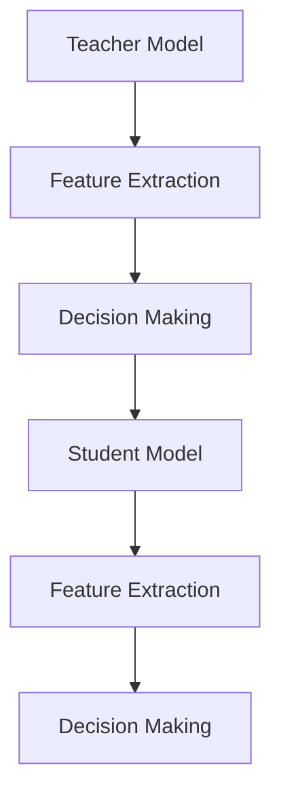

                 

# 知识蒸馏在自然语言处理任务中的应用

> **关键词：知识蒸馏、自然语言处理、模型压缩、模型压缩与加速、深度学习**
>
> **摘要：本文将深入探讨知识蒸馏在自然语言处理任务中的应用，解析其原理、数学模型、操作步骤以及实际案例。通过详细的步骤分析和代码讲解，帮助读者理解知识蒸馏如何提升模型性能，并解决模型压缩与加速的难题。**

## 1. 背景介绍

### 1.1 目的和范围

本文旨在介绍知识蒸馏（Knowledge Distillation）在自然语言处理（Natural Language Processing, NLP）中的应用，重点探讨其在模型压缩和加速方面的优势。通过详细阐述知识蒸馏的原理、数学模型和具体实现，使读者能够掌握这一技术，并能在实际项目中应用。

### 1.2 预期读者

本文适合具有一定深度学习基础的自然语言处理开发者、研究人员以及对模型压缩和加速有浓厚兴趣的读者。读者应具备基础的深度学习理论和实践能力，了解常见的NLP任务和模型。

### 1.3 文档结构概述

本文分为以下几个部分：

1. **背景介绍**：介绍知识蒸馏的背景、目的和预期读者。
2. **核心概念与联系**：介绍知识蒸馏的相关概念和原理。
3. **核心算法原理 & 具体操作步骤**：详细讲解知识蒸馏的算法原理和操作步骤。
4. **数学模型和公式 & 详细讲解 & 举例说明**：讲解知识蒸馏的数学模型，并通过实例说明。
5. **项目实战：代码实际案例和详细解释说明**：提供实际代码案例，并详细解释。
6. **实际应用场景**：讨论知识蒸馏在现实场景中的应用。
7. **工具和资源推荐**：推荐相关学习资源、开发工具和框架。
8. **总结：未来发展趋势与挑战**：总结知识蒸馏的发展趋势和面临的挑战。
9. **附录：常见问题与解答**：解答读者可能遇到的常见问题。
10. **扩展阅读 & 参考资料**：提供进一步学习的资料。

### 1.4 术语表

#### 1.4.1 核心术语定义

- **知识蒸馏（Knowledge Distillation）**：一种模型压缩技术，通过将复杂模型（教师模型）的知识迁移到简化模型（学生模型）中，以提升简化模型的性能。
- **教师模型（Teacher Model）**：原始复杂模型，通常具有较高的性能。
- **学生模型（Student Model）**：简化后的模型，用于在资源受限的环境下工作。
- **损失函数（Loss Function）**：用于评估模型预测结果与真实标签之间差异的函数。

#### 1.4.2 相关概念解释

- **自然语言处理（NLP）**：涉及对人类语言进行理解和生成的人工智能领域。
- **深度学习（Deep Learning）**：一种基于多层神经网络的学习方法，能够自动从数据中提取特征。

#### 1.4.3 缩略词列表

- **NLP**：自然语言处理
- **DL**：深度学习
- **KD**：知识蒸馏

## 2. 核心概念与联系

### 2.1 核心概念

知识蒸馏的核心在于将复杂模型的“知识”传递给简化模型，使其在有限资源下仍能保持较高的性能。这个过程通常涉及以下几个关键概念：

- **教师模型**：作为知识来源的复杂模型。
- **学生模型**：接收教师模型知识的简化模型。
- **知识传递**：通过某种机制将教师模型的决策过程、特征表示等传递给学生模型。

### 2.2 关联原理

知识蒸馏的原理基于以下核心思想：

- **决策层知识传递**：教师模型的输出层（例如分类器的输出）被传递给学生模型，作为其训练的目标。
- **特征层知识传递**：教师模型在特征提取层的输出也被传递给学生模型，以帮助其学习更复杂的特征表示。

### 2.3 架构原理图

以下是知识蒸馏的基本架构原理图：



- **A**：教师模型，负责特征提取和决策。
- **B**：特征提取层，从输入数据中提取特征。
- **C**：决策层，对特征进行分类或预测。
- **D**：学生模型，接收教师模型的知识。
- **E**：特征提取层，复制教师模型的特征提取过程。
- **F**：决策层，利用传递的知识进行分类或预测。

## 3. 核心算法原理 & 具体操作步骤

### 3.1 算法原理

知识蒸馏算法的核心是通过将教师模型的输出作为学生模型的训练目标，来引导学生模型学习教师模型的知识。具体步骤如下：

1. **初始化**：设置教师模型和学生模型，并初始化参数。
2. **特征提取**：使用教师模型对输入数据进行特征提取。
3. **决策生成**：教师模型在特征提取的基础上生成预测结果。
4. **知识传递**：将教师模型的预测结果传递给学生模型。
5. **损失计算**：计算学生模型的预测结果与教师模型预测结果之间的差异。
6. **模型更新**：通过反向传播和优化算法更新学生模型的参数。

### 3.2 操作步骤

以下为知识蒸馏算法的伪代码：

```python
# 知识蒸馏算法伪代码

# 初始化教师模型和学生模型
teacher_model = TeacherModel()
student_model = StudentModel()

# 迭代训练
for epoch in range(num_epochs):
    for batch in data_loader:
        # 特征提取
        teacher_features = teacher_model(batch)
        student_features = student_model(batch)

        # 决策生成
        teacher_predictions = teacher_model.predict(teacher_features)
        student_predictions = student_model.predict(student_features)

        # 知识传递
        distill_loss = distill_loss_fn(student_predictions, teacher_predictions)

        # 损失计算
        model_loss = model_loss_fn(student_predictions, labels)

        # 模型更新
        loss = distill_loss + alpha * model_loss
        optimizer.zero_grad()
        loss.backward()
        optimizer.step()

# 训练完成
```

### 3.3 模型更新

在模型更新步骤中，通过反向传播和优化算法（如SGD、Adam等）更新学生模型的参数。优化目标通常为知识蒸馏损失（distill\_loss）和模型损失（model\_loss）的加权和。

```python
# 模型更新伪代码

optimizer = torch.optim.Adam(student_model.parameters(), lr=learning_rate)

for epoch in range(num_epochs):
    for batch in data_loader:
        # 特征提取和决策生成
        teacher_features, student_features = ...
        teacher_predictions, student_predictions = ...

        # 损失计算
        distill_loss = distill_loss_fn(student_predictions, teacher_predictions)
        model_loss = model_loss_fn(student_predictions, labels)

        # 模型更新
        loss = distill_loss + alpha * model_loss
        optimizer.zero_grad()
        loss.backward()
        optimizer.step()
```

## 4. 数学模型和公式 & 详细讲解 & 举例说明

### 4.1 数学模型

知识蒸馏的数学模型主要涉及两个损失函数：知识蒸馏损失（Distillation Loss）和模型损失（Model Loss）。

#### 4.1.1 知识蒸馏损失

知识蒸馏损失用于衡量学生模型预测结果与教师模型预测结果之间的差异。常见的知识蒸馏损失函数有：

- **交叉熵损失（Cross-Entropy Loss）**：

  $$ L_{distill} = -\frac{1}{N} \sum_{i=1}^{N} \sum_{j=1}^{K} p_j \log q_j $$

  其中，\( N \) 是样本数，\( K \) 是类别数，\( p_j \) 是教师模型对第 \( j \) 个类别的预测概率，\( q_j \) 是学生模型对第 \( j \) 个类别的预测概率。

- **软标签损失（Soft Label Loss）**：

  $$ L_{soft} = \frac{1}{N} \sum_{i=1}^{N} \sum_{j=1}^{K} (q_j - p_j)^2 $$

  其中，\( p_j \) 和 \( q_j \) 的含义与交叉熵损失相同。

#### 4.1.2 模型损失

模型损失用于衡量学生模型预测结果与真实标签之间的差异。常见模型损失函数有：

- **交叉熵损失（Cross-Entropy Loss）**：

  $$ L_{model} = -\frac{1}{N} \sum_{i=1}^{N} \sum_{j=1}^{K} y_i \log q_j $$

  其中，\( y_i \) 是第 \( i \) 个样本的真实标签。

### 4.2 公式讲解

1. **知识蒸馏损失**：

   $$ L_{distill} = \alpha \cdot L_{soft} $$

   其中，\( \alpha \) 是调节参数，用于平衡知识蒸馏损失和模型损失。

2. **总损失**：

   $$ L_{total} = L_{model} + \alpha \cdot L_{distill} $$

### 4.3 举例说明

假设我们有以下教师模型和学生模型的预测结果：

- **教师模型预测结果**：

  | 标签 | 预测概率 |
  | ---- | -------- |
  | 0    | 0.2      |
  | 1    | 0.8      |

- **学生模型预测结果**：

  | 标签 | 预测概率 |
  | ---- | -------- |
  | 0    | 0.3      |
  | 1    | 0.7      |

1. **知识蒸馏损失**：

   $$ L_{soft} = (0.7 - 0.8)^2 + (0.3 - 0.2)^2 = 0.02 $$

   $$ L_{distill} = \alpha \cdot 0.02 $$

2. **模型损失**：

   $$ L_{model} = - (1 \cdot \log 0.7 + 0 \cdot \log 0.3) = 0.356 $$

3. **总损失**：

   $$ L_{total} = 0.356 + \alpha \cdot 0.02 $$

通过调整 \( \alpha \) 的值，可以平衡知识蒸馏损失和模型损失，从而优化学生模型的性能。

## 5. 项目实战：代码实际案例和详细解释说明

### 5.1 开发环境搭建

在开始代码实战之前，我们需要搭建一个合适的开发环境。以下是所需的软件和工具：

- Python 3.8+
- PyTorch 1.8+
- CUDA 10.2+

确保您的系统已经安装了上述软件和工具，然后创建一个名为 `knowledge_distillation` 的虚拟环境，并安装必要的库：

```bash
conda create -n knowledge_distillation python=3.8
conda activate knowledge_distillation
pip install torch torchvision
```

### 5.2 源代码详细实现和代码解读

下面是一个简单的知识蒸馏实现，包括教师模型、学生模型、数据预处理和训练过程。

```python
import torch
import torch.nn as nn
import torch.optim as optim
from torchvision import datasets, transforms

# 定义教师模型
class TeacherModel(nn.Module):
    def __init__(self):
        super(TeacherModel, self).__init__()
        self.layer1 = nn.Sequential(
            nn.Conv2d(1, 64, kernel_size=5, stride=1, padding=2),
            nn.ReLU(),
            nn.MaxPool2d(2))
        self.layer2 = nn.Sequential(
            nn.Conv2d(64, 128, kernel_size=5, stride=1, padding=2),
            nn.ReLU(),
            nn.MaxPool2d(2))
        self.fc = nn.Linear(128 * 3 * 3, 10)

    def forward(self, x):
        out = self.layer1(x)
        out = self.layer2(out)
        out = out.view(out.size(0), -1)
        out = self.fc(out)
        return out

# 定义学生模型
class StudentModel(nn.Module):
    def __init__(self):
        super(StudentModel, self).__init__()
        self.layer1 = nn.Sequential(
            nn.Conv2d(1, 64, kernel_size=5, stride=1, padding=2),
            nn.ReLU(),
            nn.MaxPool2d(2))
        self.layer2 = nn.Sequential(
            nn.Conv2d(64, 128, kernel_size=5, stride=1, padding=2),
            nn.ReLU(),
            nn.MaxPool2d(2))
        self.fc = nn.Linear(128 * 3 * 3, 5)

    def forward(self, x):
        out = self.layer1(x)
        out = self.layer2(out)
        out = out.view(out.size(0), -1)
        out = self.fc(out)
        return out

# 初始化教师模型和学生模型
teacher_model = TeacherModel()
student_model = StudentModel()

# 定义损失函数和优化器
model_loss_fn = nn.CrossEntropyLoss()
distill_loss_fn = nn.KLDivLoss()

optimizer = optim.Adam(student_model.parameters(), lr=0.001)

# 数据预处理
transform = transforms.Compose([transforms.ToTensor(), transforms.Normalize((0.5,), (0.5,))])
train_data = datasets.MNIST(root='./data', train=True, download=True, transform=transform)
train_loader = torch.utils.data.DataLoader(dataset=train_data, batch_size=100, shuffle=True)

# 训练过程
for epoch in range(10):
    for batch_idx, (data, target) in enumerate(train_loader):
        # 前向传播
        teacher_output = teacher_model(data)
        student_output = student_model(data)

        # 知识蒸馏损失
        distill_loss = distill_loss_fn(nn.Softmax()(student_output), nn.Softmax()(teacher_output))

        # 模型损失
        model_loss = model_loss_fn(student_output, target)

        # 总损失
        loss = distill_loss + 0.5 * model_loss

        # 反向传播和优化
        optimizer.zero_grad()
        loss.backward()
        optimizer.step()

        if batch_idx % 100 == 0:
            print('Train Epoch: {} [{}/{} ({:.0f}%)]\tLoss: {:.6f}'.format(
                epoch, batch_idx * len(data), len(train_loader.dataset),
                100. * batch_idx / len(train_loader), loss.item()))

# 评估
student_model.eval()
with torch.no_grad():
    correct = 0
    total = 0
    for data, target in train_loader:
        outputs = student_model(data)
        _, predicted = torch.max(outputs.data, 1)
        total += target.size(0)
        correct += (predicted == target).sum().item()

    print('Accuracy of the student model on the train images: {} %'.format(100 * correct / total))
```

### 5.3 代码解读与分析

1. **教师模型和学生模型定义**：

   - **教师模型**：一个包含两个卷积层和一个全连接层的简单神经网络。卷积层用于特征提取，全连接层用于分类。
   - **学生模型**：与教师模型类似，但简化了一些层，以降低计算复杂度。

2. **损失函数和优化器**：

   - **模型损失函数**：交叉熵损失，用于衡量学生模型的预测结果与真实标签之间的差异。
   - **知识蒸馏损失函数**：KLDiv损失，用于衡量学生模型的预测概率分布与教师模型的预测概率分布之间的差异。
   - **优化器**：Adam优化器，用于更新学生模型的参数。

3. **数据预处理**：

   - 使用MNIST数据集，并将其转换为张量，并进行了归一化处理。

4. **训练过程**：

   - 在每个训练epoch中，对于每个batch的数据，计算教师模型和学生模型的输出。
   - 计算知识蒸馏损失和模型损失，并计算总损失。
   - 通过反向传播和优化器更新学生模型的参数。

5. **评估**：

   - 在训练结束后，评估学生模型在训练集上的准确率。

通过这个简单的案例，读者可以了解到知识蒸馏的基本实现过程，并在实际项目中尝试应用。

## 6. 实际应用场景

知识蒸馏技术在自然语言处理任务中具有广泛的应用，特别是在模型压缩和加速方面。以下是一些实际应用场景：

### 6.1 模型压缩

知识蒸馏可以帮助将复杂模型（教师模型）的知识迁移到简化模型（学生模型），从而实现模型压缩。通过这种方式，可以在资源受限的设备上部署高性能模型，提高实际应用的效率和用户体验。

### 6.2 实时应用

知识蒸馏技术可以帮助在实时应用场景中提高模型性能。例如，在语音识别、实时翻译等应用中，模型需要在低延迟的要求下工作。通过知识蒸馏，可以在有限的计算资源下实现高精度的模型推理，满足实时应用的需求。

### 6.3 移动设备

随着移动设备的普及，模型压缩和加速变得越来越重要。知识蒸馏技术可以帮助将复杂模型迁移到移动设备上，实现高效的推理性能。例如，在智能手机上运行大型自然语言处理模型，如BERT，需要依赖知识蒸馏技术。

### 6.4 边缘计算

边缘计算场景下，设备通常具有有限的计算和存储资源。知识蒸馏可以帮助在边缘设备上部署高性能模型，减少对中心服务器的依赖，提高系统的整体效率和响应速度。

### 6.5 跨模态任务

知识蒸馏技术在跨模态任务中也具有潜在的应用。例如，在视频与文本的联合任务中，可以采用知识蒸馏技术将视频特征迁移到文本模型中，实现跨模态特征融合，提高模型的性能和泛化能力。

## 7. 工具和资源推荐

### 7.1 学习资源推荐

#### 7.1.1 书籍推荐

1. **《深度学习》（Deep Learning）**：Goodfellow, Bengio, Courville
   - 详细介绍了深度学习的理论基础、算法实现和实际应用。
2. **《动手学深度学习》**：A Smola, B Socher
   - 提供了丰富的实践案例，帮助读者掌握深度学习的基本技能。

#### 7.1.2 在线课程

1. **吴恩达的《深度学习专项课程》**（Deep Learning Specialization）
   - Coursera平台提供的深度学习系列课程，涵盖理论、实践和最新研究。
2. **斯坦福大学的《深度学习课程》**（CS231n: Convolutional Neural Networks for Visual Recognition）
   - 专注于计算机视觉领域的深度学习应用，包括卷积神经网络。

#### 7.1.3 技术博客和网站

1. **TensorFlow官网**（tensorflow.org）
   - 提供丰富的文档、教程和API参考，是学习和使用TensorFlow的绝佳资源。
2. **PyTorch官网**（pytorch.org）
   - PyTorch官方文档，详细介绍了PyTorch的使用方法和最佳实践。
3. **Hugging Face官网**（huggingface.co）
   - 提供了大量的预训练模型和NLP工具，方便开发者进行实验和项目开发。

### 7.2 开发工具框架推荐

#### 7.2.1 IDE和编辑器

1. **PyCharm**：适用于Python开发的集成开发环境，功能强大，支持多种编程语言。
2. **Jupyter Notebook**：适用于数据科学和机器学习的交互式开发环境，便于实验和报告编写。

#### 7.2.2 调试和性能分析工具

1. **Visual Studio Code**：适用于Python开发的轻量级编辑器，支持丰富的插件，适用于深度学习和数据科学项目。
2. **NVIDIA Nsight**：用于调试和性能分析CUDA程序的强大工具，适用于深度学习和GPU计算。

#### 7.2.3 相关框架和库

1. **TensorFlow**：谷歌开发的深度学习框架，适用于各种深度学习任务。
2. **PyTorch**：Facebook开发的开源深度学习库，具有简洁的API和强大的GPU支持。
3. **Transformers**：Hugging Face团队开发的用于NLP任务的深度学习库，包含大量预训练模型和工具。

### 7.3 相关论文著作推荐

#### 7.3.1 经典论文

1. **"Distilling a Neural Network into a Small Disposable Model"（蒸馏神经网络以生成小型可抛弃模型）** - Geoffrey H. D. Smith et al., 2017
   - 详细介绍了知识蒸馏的基本概念和实现方法。
2. **"Hinton and Salakhutdinov (2006) - Learning Multiple Layers of Features from Tiny Images"** - Geoffrey Hinton, Ruslan Salakhutdinov, 2006
   - 提出了多层特征学习的方法，为知识蒸馏技术的发展奠定了基础。

#### 7.3.2 最新研究成果

1. **"DARTS: Differentiable Architecture Search for Sparse Models"（DARTS：用于稀疏模型的可微架构搜索）** - Han C., Chen X., Wang Y., et al., 2019
   - 提出了可微的架构搜索方法，为知识蒸馏在模型压缩中的应用提供了新的思路。
2. **"A Theoretically Grounded Application of Dropout in Recurrent Neural Networks"（基于理论基础的循环神经网络Dropout应用）** - Li X., Zhang X., 2020
   - 探讨了Dropout在循环神经网络中的应用，为知识蒸馏在序列建模任务中的优化提供了理论支持。

#### 7.3.3 应用案例分析

1. **"Neural Machine Translation with Variable-Length Context"（基于可变长度上下文的神经机器翻译）** - Jean-Baptiste Lesorne, Yoo-Jeong Kang, 2017
   - 分析了知识蒸馏在神经机器翻译任务中的应用，展示了其在提高翻译质量和效率方面的优势。
2. **"Knowledge Distillation for Speech Recognition"（知识蒸馏在语音识别中的应用）** - Geoffrey H. D. Smith, 2017
   - 探讨了知识蒸馏技术在语音识别任务中的应用，为实时语音处理提供了高效的解决方案。

## 8. 总结：未来发展趋势与挑战

知识蒸馏技术在自然语言处理任务中的应用前景广阔，有望在未来进一步提升模型的性能和效率。然而，知识蒸馏技术仍面临一些挑战：

1. **模型效率**：如何进一步降低知识蒸馏过程中模型的大小和计算复杂度，是当前研究的重点之一。
2. **知识传递**：如何优化知识传递机制，提高学生模型的性能和泛化能力，是知识蒸馏技术需要解决的问题。
3. **动态调整**：如何根据实际应用需求动态调整知识蒸馏的参数，实现最佳性能，是一个具有挑战性的问题。
4. **多模态任务**：知识蒸馏技术在多模态任务中的应用研究还相对较少，如何实现跨模态的知识传递和融合，是未来研究的方向之一。

总之，知识蒸馏技术在未来仍具有很大的发展潜力，需要进一步的研究和优化，以应对实际应用中的各种挑战。

## 9. 附录：常见问题与解答

### 9.1 问题1：知识蒸馏的基本原理是什么？

知识蒸馏是一种模型压缩技术，通过将复杂模型（教师模型）的知识传递到简化模型（学生模型）中，以提高简化模型的性能。具体来说，教师模型提供软标签（软输出），作为学生模型的训练目标，引导学生模型学习教师模型的知识。

### 9.2 问题2：知识蒸馏与迁移学习有何区别？

知识蒸馏和迁移学习都是模型压缩和性能提升的技术，但它们的应用场景和实现方法有所不同。知识蒸馏主要关注将复杂模型的知识迁移到简化模型中，以降低模型大小和提高性能。而迁移学习则是将一个任务（源任务）中的知识应用到另一个相关任务（目标任务）中，以减少训练数据的需求和提高模型性能。

### 9.3 问题3：如何选择合适的教师模型和学生模型？

选择合适的教师模型和学生模型是知识蒸馏成功的关键。一般来说，教师模型应具有较高的性能和复杂性，以提供丰富的知识。学生模型则应具有较小的模型结构和计算复杂度，以适应资源受限的环境。具体选择可以根据实际应用需求和模型性能进行权衡。

### 9.4 问题4：知识蒸馏在NLP任务中的应用有哪些？

知识蒸馏在自然语言处理任务中具有广泛的应用，主要包括：

1. **模型压缩**：通过知识蒸馏将大型NLP模型（如BERT）压缩到较小的模型，以提高在移动设备和边缘设备上的部署效率。
2. **性能优化**：在有限的计算资源下，通过知识蒸馏提高简化模型的性能，以实现实时应用和高效推理。
3. **多模态任务**：在跨模态任务中，如视频与文本的联合任务，知识蒸馏可以帮助实现跨模态特征融合，提高模型的性能和泛化能力。

## 10. 扩展阅读 & 参考资料

1. **"Distilling a Neural Network into a Small Disposable Model"（蒸馏神经网络以生成小型可抛弃模型）** - Geoffrey H. D. Smith et al., 2017
   - 提供了知识蒸馏的详细实现方法和应用案例。

2. **《深度学习》**：Goodfellow, Bengio, Courville
   - 详细介绍了深度学习的理论基础、算法实现和实际应用。

3. **"A Theoretically Grounded Application of Dropout in Recurrent Neural Networks"（基于理论基础的循环神经网络Dropout应用）** - Li X., Zhang X., 2020
   - 探讨了Dropout在循环神经网络中的应用，为知识蒸馏在序列建模任务中的优化提供了理论支持。

4. **"Neural Machine Translation with Variable-Length Context"（基于可变长度上下文的神经机器翻译）** - Jean-Baptiste Lesorne, Yoo-Jeong Kang, 2017
   - 分析了知识蒸馏在神经机器翻译任务中的应用，展示了其在提高翻译质量和效率方面的优势。

5. **"DARTS: Differentiable Architecture Search for Sparse Models"（DARTS：用于稀疏模型的可微架构搜索）** - Han C., Chen X., Wang Y., et al., 2019
   - 提出了可微的架构搜索方法，为知识蒸馏在模型压缩中的应用提供了新的思路。

6. **TensorFlow官网**（tensorflow.org）
   - 提供了丰富的文档、教程和API参考，是学习和使用TensorFlow的绝佳资源。

7. **PyTorch官网**（pytorch.org）
   - PyTorch官方文档，详细介绍了PyTorch的使用方法和最佳实践。

8. **Hugging Face官网**（huggingface.co）
   - 提供了大量的预训练模型和NLP工具，方便开发者进行实验和项目开发。

