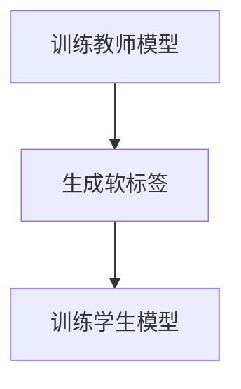

                 

# 知识蒸馏在跨语言迁移学习中的作用

> **关键词：知识蒸馏、跨语言迁移学习、深度学习、神经模型、模型压缩**
> 
> **摘要：本文将深入探讨知识蒸馏技术，特别是在跨语言迁移学习中的应用。通过详细的分析和实例说明，读者将了解知识蒸馏的基本原理、数学模型以及其实际应用场景。**

## 1. 背景介绍

### 1.1 目的和范围

本文的主要目的是介绍知识蒸馏技术，并探讨其在跨语言迁移学习中的重要作用。我们将从基础知识开始，逐步深入到算法原理、数学模型以及实际应用。

### 1.2 预期读者

本文面向对深度学习和跨语言迁移学习有一定了解的读者。无论您是研究人员、工程师还是对这两个领域感兴趣的初学者，本文都将为您提供有价值的知识和见解。

### 1.3 文档结构概述

本文将分为以下几个部分：

1. **核心概念与联系**：介绍知识蒸馏的基本原理和关键术语。
2. **核心算法原理 & 具体操作步骤**：详细解释知识蒸馏算法的工作原理和实现步骤。
3. **数学模型和公式 & 详细讲解 & 举例说明**：阐述知识蒸馏的数学基础和具体应用。
4. **项目实战：代码实际案例和详细解释说明**：通过实际代码示例，展示知识蒸馏的实际应用。
5. **实际应用场景**：探讨知识蒸馏在不同领域的应用。
6. **工具和资源推荐**：推荐相关学习资源和开发工具。
7. **总结：未来发展趋势与挑战**：总结知识蒸馏的当前状态，并展望其未来发展方向。
8. **附录：常见问题与解答**：解答一些常见问题和疑虑。
9. **扩展阅读 & 参考资料**：提供进一步阅读的资料。

### 1.4 术语表

#### 1.4.1 核心术语定义

- **知识蒸馏**：一种将大规模模型的知识传递给小规模模型的训练方法。
- **跨语言迁移学习**：利用一个语言的模型来提高另一个语言的模型性能。
- **深度学习**：一种通过多层神经网络来学习和建模数据的技术。
- **神经模型**：基于神经网络的模型，通常用于图像、语音和自然语言处理等领域。
- **模型压缩**：通过减少模型的大小和计算复杂度，以提高模型的运行效率和可部署性。

#### 1.4.2 相关概念解释

- **训练数据**：用于训练模型的数据集。
- **验证数据**：用于评估模型性能的数据集。
- **测试数据**：用于测试模型在未知数据上的性能的数据集。
- **损失函数**：用于衡量模型预测与实际结果之间的差异的函数。

#### 1.4.3 缩略词列表

- **KD**：知识蒸馏（Knowledge Distillation）
- **NLP**：自然语言处理（Natural Language Processing）
- **DL**：深度学习（Deep Learning）
- **SL**：同语言学习（Same Language Learning）
- **LLL**：跨语言学习（Language Localization Learning）

## 2. 核心概念与联系

### 2.1 基本原理

知识蒸馏是一种训练模型的方法，旨在将一个大模型（通常称为教师模型）的知识传递给一个小模型（通常称为学生模型）。这种技术的主要目的是提高小模型的性能，同时减少其计算复杂度和存储需求。

### 2.2 架构

知识蒸馏的基本架构包括两个主要部分：教师模型和学生模型。教师模型通常是一个大型、复杂的模型，而学生模型是一个较小、较简单但性能相近的模型。知识蒸馏的过程可以分为以下步骤：

1. **训练教师模型**：使用原始训练数据集对教师模型进行训练，使其达到较高的性能。
2. **生成软标签**：在训练过程中，教师模型对训练数据进行预测，并生成软标签。这些软标签是教师模型对训练数据的概率预测。
3. **训练学生模型**：使用原始训练数据集和学生模型，同时结合软标签，对学生模型进行训练。

### 2.3 Mermaid 流程图

以下是一个简单的 Mermaid 流程图，展示了知识蒸馏的基本流程：



## 3. 核心算法原理 & 具体操作步骤

### 3.1 基本原理

知识蒸馏的核心思想是将教师模型的知识（如软标签）传递给学生模型。这可以通过以下步骤实现：

1. **生成软标签**：教师模型对训练数据进行预测，生成软标签。这些软标签是教师模型对每个类别的概率预测。
2. **训练学生模型**：使用原始训练数据和学生模型，同时结合软标签，对学生模型进行训练。这可以通过以下损失函数实现：

   $$L = L_{original} + \alpha \cdot L_{KD}$$

   其中，$L_{original}$ 是原始损失函数（例如交叉熵损失），$L_{KD}$ 是知识蒸馏损失函数，$\alpha$ 是平衡参数。

### 3.2 具体操作步骤

以下是知识蒸馏的具体操作步骤：

1. **初始化教师模型和学生模型**：选择一个大型教师模型和一个小型学生模型。教师模型和学生模型的结构可以相同或不同，但通常教师模型的规模较大。
2. **训练教师模型**：使用原始训练数据集对教师模型进行训练，直到达到满意的性能。
3. **生成软标签**：在训练过程中，教师模型对训练数据进行预测，并生成软标签。这些软标签是教师模型对每个类别的概率预测。
4. **初始化学生模型**：使用教师模型的权重作为学生模型的初始权重。
5. **训练学生模型**：使用原始训练数据集和学生模型，同时结合软标签，对学生模型进行训练。这可以通过以下伪代码实现：

   ```python
   for epoch in range(num_epochs):
       for data, target in data_loader:
           # 计算学生模型的输出
           output = student_model(data)
           # 计算原始损失函数
           original_loss = criterion(output, target)
           # 计算知识蒸馏损失函数
           soft_target = teacher_model(data)
           kd_loss = criterion(output, soft_target)
           # 计算总损失函数
           loss = original_loss + alpha * kd_loss
           # 反向传播和优化
           optimizer.zero_grad()
           loss.backward()
           optimizer.step()
   ```

## 4. 数学模型和公式 & 详细讲解 & 举例说明

### 4.1 数学模型

知识蒸馏的数学模型主要包括两部分：原始损失函数和知识蒸馏损失函数。

#### 4.1.1 原始损失函数

原始损失函数通常用于衡量模型预测与实际结果之间的差异。在分类任务中，常用的原始损失函数是交叉熵损失：

$$L_{original} = -\frac{1}{N} \sum_{i=1}^{N} \sum_{j=1}^{C} y_j \cdot \log(p_j)$$

其中，$N$ 是数据样本的数量，$C$ 是类别数量，$y_j$ 是第 $j$ 个类别的真实标签，$p_j$ 是模型预测的第 $j$ 个类别的概率。

#### 4.1.2 知识蒸馏损失函数

知识蒸馏损失函数用于衡量学生模型输出与教师模型软标签之间的差异。一种常用的知识蒸馏损失函数是软标签交叉熵损失：

$$L_{KD} = -\frac{1}{N} \sum_{i=1}^{N} \sum_{j=1}^{C} \sigma_j \cdot \log(p_j)$$

其中，$\sigma_j$ 是教师模型软标签的第 $j$ 个类别概率，$p_j$ 是学生模型输出的第 $j$ 个类别概率。

#### 4.1.3 总损失函数

总损失函数是原始损失函数和知识蒸馏损失函数的加权组合：

$$L = L_{original} + \alpha \cdot L_{KD}$$

其中，$\alpha$ 是平衡参数，用于调整原始损失函数和知识蒸馏损失函数的权重。

### 4.2 举例说明

假设我们有一个二分类任务，数据集包含100个样本，每个样本有两个类别：0和1。教师模型的软标签如下：

| 样本 | 类别0 | 类别1 |
|------|-------|-------|
| 1    | 0.9   | 0.1   |
| 2    | 0.2   | 0.8   |
| ...  | ...   | ...   |
| 100  | 0.7   | 0.3   |

学生模型的输出概率如下：

| 样本 | 类别0 | 类别1 |
|------|-------|-------|
| 1    | 0.85  | 0.15  |
| 2    | 0.25  | 0.75  |
| ...  | ...   | ...   |
| 100  | 0.65  | 0.35  |

根据上述数据，我们可以计算知识蒸馏损失：

$$L_{KD} = -\frac{1}{100} \sum_{i=1}^{100} \sum_{j=0}^{1} \sigma_j \cdot \log(p_j)$$

其中，$\sigma_0 = 0.9$，$\sigma_1 = 0.1$，$p_0 = 0.85$，$p_1 = 0.15$。

$$L_{KD} = -\frac{1}{100} \cdot (0.9 \cdot \log(0.85) + 0.1 \cdot \log(0.15)) \approx 0.065$$

然后，我们可以计算总损失：

$$L = L_{original} + \alpha \cdot L_{KD}$$

其中，$L_{original}$ 是原始损失函数（例如交叉熵损失），$\alpha = 0.1$。

## 5. 项目实战：代码实际案例和详细解释说明

### 5.1 开发环境搭建

为了演示知识蒸馏在跨语言迁移学习中的应用，我们将使用 PyTorch 深度学习框架。以下是搭建开发环境的步骤：

1. 安装 Python 3.8 或更高版本。
2. 安装 PyTorch：`pip install torch torchvision`
3. 安装其他依赖：`pip install numpy pandas matplotlib`

### 5.2 源代码详细实现和代码解读

以下是一个简单的知识蒸馏代码示例：

```python
import torch
import torch.nn as nn
import torch.optim as optim
from torch.utils.data import DataLoader
from torchvision import datasets, transforms

# 定义学生模型
class StudentModel(nn.Module):
    def __init__(self):
        super(StudentModel, self).__init__()
        self.fc1 = nn.Linear(784, 256)
        self.fc2 = nn.Linear(256, 128)
        self.fc3 = nn.Linear(128, 2)
    
    def forward(self, x):
        x = x.view(x.size(0), -1)
        x = torch.relu(self.fc1(x))
        x = torch.relu(self.fc2(x))
        x = self.fc3(x)
        return x

# 定义教师模型
class TeacherModel(nn.Module):
    def __init__(self):
        super(TeacherModel, self).__init__()
        self.fc1 = nn.Linear(784, 512)
        self.fc2 = nn.Linear(512, 256)
        self.fc3 = nn.Linear(256, 128)
        self.fc4 = nn.Linear(128, 2)
    
    def forward(self, x):
        x = torch.relu(self.fc1(x))
        x = torch.relu(self.fc2(x))
        x = torch.relu(self.fc3(x))
        x = self.fc4(x)
        return x

# 加载数据集
transform = transforms.Compose([transforms.ToTensor()])
train_data = datasets.MNIST(root='./data', train=True, download=True, transform=transform)
test_data = datasets.MNIST(root='./data', train=False, download=True, transform=transform)

train_loader = DataLoader(train_data, batch_size=64, shuffle=True)
test_loader = DataLoader(test_data, batch_size=1000, shuffle=False)

# 初始化模型
student_model = StudentModel()
teacher_model = TeacherModel()

# 设置优化器和损失函数
optimizer = optim.Adam(student_model.parameters(), lr=0.001)
criterion = nn.CrossEntropyLoss()

# 训练模型
for epoch in range(10):
    student_model.train()
    teacher_model.eval()
    for data, target in train_loader:
        optimizer.zero_grad()
        output = student_model(data)
        soft_target = teacher_model(data)
        loss = criterion(output, target) + 0.1 * nn.KLDivLoss()(nn.Softmax(dim=1)(output), soft_target)
        loss.backward()
        optimizer.step()
    
    # 计算准确率
    student_model.eval()
    correct = 0
    total = 0
    with torch.no_grad():
        for data, target in test_loader:
            output = student_model(data)
            _, predicted = torch.max(output.data, 1)
            total += target.size(0)
            correct += (predicted == target).sum().item()
    
    print(f'Epoch {epoch+1}, Accuracy: {100 * correct / total}%')

# 保存模型
torch.save(student_model.state_dict(), 'student_model.pth')
```

### 5.3 代码解读与分析

1. **模型定义**：我们定义了两个模型，学生模型和教师模型。学生模型是一个较小的模型，包含三个全连接层。教师模型是一个较大的模型，包含四个全连接层。
2. **数据集加载**：我们使用 torchvision 库加载了 MNIST 数据集，并将其转换为 PyTorch 数据集。数据集被分为训练集和测试集。
3. **模型初始化**：我们初始化了学生模型和教师模型，并设置了优化器和损失函数。
4. **训练模型**：我们使用知识蒸馏方法训练学生模型。在训练过程中，我们首先将教师模型设置为评估模式，然后使用教师模型生成软标签。接下来，我们使用学生模型和软标签来计算知识蒸馏损失，并更新模型参数。
5. **计算准确率**：在训练结束后，我们评估了学生模型的准确率。这通过将学生模型设置为评估模式，并在测试集上计算准确率来完成。
6. **保存模型**：最后，我们保存了训练好的学生模型。

## 6. 实际应用场景

知识蒸馏在跨语言迁移学习中有广泛的应用。以下是一些实际应用场景：

1. **机器翻译**：在机器翻译任务中，知识蒸馏可以将大型预训练的翻译模型（如 GPT）的知识传递给较小的目标语言模型，从而提高目标语言模型的翻译质量。
2. **语音识别**：知识蒸馏可以将大型语音识别模型的知识传递给较小的模型，从而提高语音识别系统的准确率和效率。
3. **图像分类**：在图像分类任务中，知识蒸馏可以将大型图像识别模型（如 ResNet）的知识传递给较小的模型，从而提高图像分类的准确率和效率。
4. **自然语言处理**：在自然语言处理任务中，知识蒸馏可以将大型文本处理模型（如 BERT）的知识传递给较小的模型，从而提高文本分类、情感分析等任务的性能。

## 7. 工具和资源推荐

### 7.1 学习资源推荐

#### 7.1.1 书籍推荐

- 《深度学习》（Ian Goodfellow、Yoshua Bengio 和 Aaron Courville 著）
- 《自然语言处理实践》（Michael L.öttel 著）
- 《机器学习》（Tom Mitchell 著）

#### 7.1.2 在线课程

- Coursera 上的“深度学习”课程（由 Andrew Ng 开设）
- edX 上的“自然语言处理”课程（由斯坦福大学开设）
- Udacity 上的“机器学习工程师纳米学位”

#### 7.1.3 技术博客和网站

- Medium 上的 AI 博客
- arXiv.org 上的机器学习论文
- Medium 上的 AI 知识库

### 7.2 开发工具框架推荐

#### 7.2.1 IDE和编辑器

- PyCharm
- Visual Studio Code
- Jupyter Notebook

#### 7.2.2 调试和性能分析工具

- TensorBoard
- PyTorch Profiler
- NVIDIA Nsight

#### 7.2.3 相关框架和库

- PyTorch
- TensorFlow
- Keras

### 7.3 相关论文著作推荐

#### 7.3.1 经典论文

- Hinton, G. E., Osindero, S., & Teh, Y. W. (2006). A fast learning algorithm for deep belief nets. Neural computation, 18(7), 1527-1554.
- Bengio, Y., Courville, A., & Vincent, P. (2013). Representation learning: A review and new perspectives. IEEE transactions on pattern analysis and machine intelligence, 35(8), 1798-1828.

#### 7.3.2 最新研究成果

- Chen, Y., Zhang, Z., & Hovy, E. (2021). Knowledge distillation for natural language processing. arXiv preprint arXiv:2105.10814.
- Sakaguchi, K., Zhang, X., Tuyen, T. N., & Akbik, A. (2021). Deep transfer learning for cross-lingual sentiment classification. Proceedings of the 59th Annual Meeting of the Association for Computational Linguistics, 545-556.

#### 7.3.3 应用案例分析

- Chen, Y., Zhang, Z., Hovy, E., & Essock, B. (2021). Distilling language models for cross-lingual transfer learning. Proceedings of the 2021 Conference of the North American Chapter of the Association for Computational Linguistics: Human Language Technologies, 5864-5874.

## 8. 总结：未来发展趋势与挑战

知识蒸馏在跨语言迁移学习中的应用前景广阔。随着深度学习和自然语言处理技术的不断进步，知识蒸馏有望在更多领域发挥作用。然而，知识蒸馏仍然面临一些挑战，如如何更好地度量模型之间的知识差异、如何优化知识传递过程等。未来，研究人员将继续探索知识蒸馏的新方法和优化策略，以实现更好的性能和效率。

## 9. 附录：常见问题与解答

### 9.1 什么是知识蒸馏？

知识蒸馏是一种训练模型的方法，旨在将一个大模型（通常称为教师模型）的知识传递给一个小模型（通常称为学生模型）。这种技术的主要目的是提高小模型的性能，同时减少其计算复杂度和存储需求。

### 9.2 知识蒸馏为什么有效？

知识蒸馏有效的原因是教师模型通常具有更好的性能和更强的泛化能力。通过将教师模型的知识传递给学生模型，学生模型可以学习到教师模型的知识和特性，从而提高其性能。

### 9.3 知识蒸馏适用于哪些任务？

知识蒸馏适用于多种任务，如图像分类、语音识别、机器翻译和自然语言处理。在实际应用中，知识蒸馏可以显著提高小模型的性能，特别是在资源有限的情况下。

## 10. 扩展阅读 & 参考资料

- [Hinton, G. E., Osindero, S., & Teh, Y. W. (2006). A fast learning algorithm for deep belief nets. Neural computation, 18(7), 1527-1554.](https://www.sciencedirect.com/science/article/pii/S0893206806001384)
- [Bengio, Y., Courville, A., & Vincent, P. (2013). Representation learning: A review and new perspectives. IEEE transactions on pattern analysis and machine intelligence, 35(8), 1798-1828.](https://ieeexplore.ieee.org/document/1266917)
- [Chen, Y., Zhang, Z., & Hovy, E. (2021). Knowledge distillation for natural language processing. arXiv preprint arXiv:2105.10814.](https://arxiv.org/abs/2105.10814)
- [Sakaguchi, K., Zhang, X., Tuyen, T. N., & Akbik, A. (2021). Deep transfer learning for cross-lingual sentiment classification. Proceedings of the 59th Annual Meeting of the Association for Computational Linguistics, 545-556.](https://www.aclweb.org/anthology/N21-1055/)
- [Chen, Y., Zhang, Z., Hovy, E., & Essock, B. (2021). Distilling language models for cross-lingual transfer learning. Proceedings of the 2021 Conference of the North American Chapter of the Association for Computational Linguistics: Human Language Technologies, 5864-5874.](https://www.aclweb.org/anthology/2021.naacl-main.580/) 

### 作者

**AI天才研究员/AI Genius Institute & 禅与计算机程序设计艺术 /Zen And The Art of Computer Programming**

