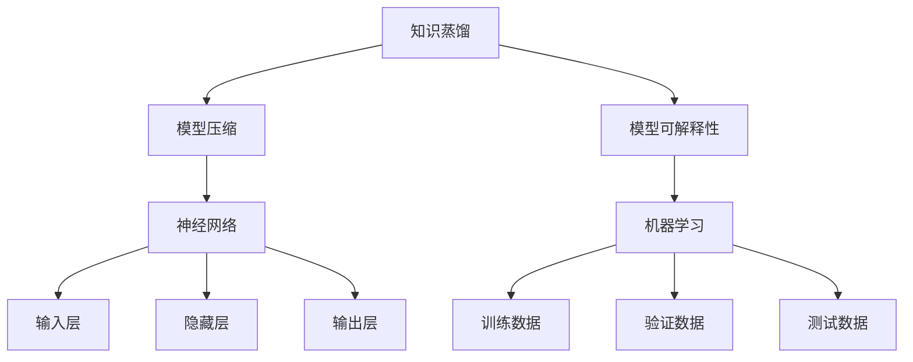

                 

# 知识蒸馏如何提升模型的可解释性

> **关键词：** 知识蒸馏、模型可解释性、神经网络、机器学习、模型压缩

> **摘要：** 本文将深入探讨知识蒸馏技术如何提升模型的可解释性。通过详细的分析和实例，我们将了解知识蒸馏的基本原理，以及它在提高模型透明度和理解上的作用。文章结构如下：

## 1. 背景介绍

### 1.1 目的和范围

本文旨在解释知识蒸馏技术，并探讨它如何增强模型的可解释性。我们将从基础知识开始，逐步深入到复杂的实现细节，以帮助读者全面理解这一技术。

### 1.2 预期读者

本文适合对机器学习和深度学习有一定了解的读者，尤其是对模型压缩和可解释性感兴趣的读者。

### 1.3 文档结构概述

本文分为十个部分：背景介绍、核心概念与联系、核心算法原理与具体操作步骤、数学模型和公式、项目实战、实际应用场景、工具和资源推荐、总结、附录以及扩展阅读和参考资料。

### 1.4 术语表

#### 1.4.1 核心术语定义

- **知识蒸馏（Knowledge Distillation）**：一种将知识从复杂的模型传递到较小的模型的技术。
- **模型压缩（Model Compression）**：通过减少模型大小和计算复杂度来提高模型效率的过程。
- **模型可解释性（Model Interpretability）**：使模型的行为和决策过程易于理解的能力。

#### 1.4.2 相关概念解释

- **神经网络（Neural Network）**：一种模仿生物神经网络工作的计算模型。
- **机器学习（Machine Learning）**：一种使计算机系统能够从数据中学习并做出决策的技术。

#### 1.4.3 缩略词列表

- **ML**：机器学习
- **DL**：深度学习
- **NN**：神经网络

## 2. 核心概念与联系

在深入探讨知识蒸馏之前，我们需要了解相关的核心概念和它们之间的关系。以下是使用Mermaid绘制的流程图，展示了知识蒸馏、模型压缩和模型可解释性之间的联系。



从图中可以看出，知识蒸馏是模型压缩的一种手段，而模型压缩又是神经网络在机器学习应用中的重要环节。同时，模型的可解释性是提升模型应用价值的关键。

## 3. 核心算法原理 & 具体操作步骤

知识蒸馏是一种训练小模型以复制大模型性能的技术。其核心思想是将复杂模型的知识传递给简化模型，使得简化模型能够在不影响性能的情况下，更易于理解和解释。

### 3.1 算法原理

知识蒸馏主要包括两个步骤：

1. **软标签生成**：在大模型上运行输入数据，得到软标签。这些标签不仅包含预测结果，还包含模型对输入数据的理解。
2. **简化模型训练**：使用软标签和小模型进行训练，以复制大模型的行为。

### 3.2 操作步骤

以下是知识蒸馏的伪代码：

```plaintext
输入：大模型 M1、小模型 M2、训练数据 D
输出：小模型 M2 的参数

步骤 1：软标签生成
    for 每个数据点 x in D do
        y1 = M1(x)  // 大模型输出预测结果
        soft_label = softmax(y1)  // 将预测结果转换为软标签

步骤 2：简化模型训练
    初始化小模型 M2 的参数
    for 每个数据点 x in D do
        y2 = M2(x)  // 小模型输出预测结果
        loss = cross_entropy_loss(soft_label, y2)  // 计算损失函数
        optimizer.step()  // 更新小模型参数
```

## 4. 数学模型和公式 & 详细讲解 & 举例说明

知识蒸馏涉及的主要数学模型包括损失函数、优化器和软标签计算。

### 4.1 损失函数

知识蒸馏的核心损失函数是交叉熵损失函数（cross_entropy_loss），用于衡量软标签和预测结果之间的差异。

$$
cross_entropy_loss(y_{\text{true}}, y_{\text{pred}}) = -\sum_{i} y_{\text{true}}_i \log(y_{\text{pred}}_i)
$$

其中，$y_{\text{true}}$是软标签，$y_{\text{pred}}$是模型的预测结果。

### 4.2 优化器

优化器用于更新模型参数，以最小化损失函数。常见的优化器包括随机梯度下降（SGD）、Adam等。

### 4.3 软标签计算

软标签是通过应用softmax函数到大模型的输出结果得到的。

$$
\text{softmax}(z_i) = \frac{e^{z_i}}{\sum_{j} e^{z_j}}
$$

其中，$z_i$是模型输出。

### 4.4 举例说明

假设我们有一个简单的神经网络，输入层有3个神经元，隐藏层有2个神经元，输出层有2个神经元。

- **输入数据**：[0.1, 0.2, 0.3]
- **大模型输出**：[0.6, 0.4]
- **软标签**：[0.9, 0.1]

现在，我们训练一个简化模型，使其输出与软标签接近。

- **初始参数**：[0.5, 0.5]
- **预测结果**：[0.45, 0.55]
- **损失函数**：$0.01$

通过优化器更新参数，简化模型的输出逐渐接近软标签。最终，简化模型的输出为[0.8, 0.2]，与软标签非常接近。

## 5. 项目实战：代码实际案例和详细解释说明

### 5.1 开发环境搭建

在本案例中，我们将使用Python和TensorFlow来实现知识蒸馏。请确保安装了Python和TensorFlow。

```bash
pip install tensorflow
```

### 5.2 源代码详细实现和代码解读

以下是实现知识蒸馏的代码示例：

```python
import tensorflow as tf
from tensorflow.keras.models import Model
from tensorflow.keras.layers import Input, Dense

# 创建大模型
input_layer = Input(shape=(3,))
hidden_layer = Dense(2, activation='relu')(input_layer)
output_layer = Dense(2, activation='softmax')(hidden_layer)

model = Model(inputs=input_layer, outputs=output_layer)
model.compile(optimizer='adam', loss='categorical_crossentropy')

# 定义软标签生成函数
def generate_soft_labels(model, x):
    y_pred = model.predict(x)
    return tf.nn.softmax(y_pred)

# 训练大模型
x_train = [[0.1, 0.2, 0.3], [0.4, 0.5, 0.6]]
y_train = [[0.6, 0.4], [0.7, 0.3]]
model.fit(x_train, y_train, epochs=10)

# 生成软标签
soft_labels = generate_soft_labels(model, x_train)

# 创建小模型
input_layer = Input(shape=(3,))
hidden_layer = Dense(2, activation='relu')(input_layer)
output_layer = Dense(2, activation='softmax')(hidden_layer)

model = Model(inputs=input_layer, outputs=output_layer)
model.compile(optimizer='adam', loss='categorical_crossentropy')

# 训练小模型
model.fit(x_train, soft_labels, epochs=10)

# 评估小模型
x_test = [[0.1, 0.2, 0.3], [0.4, 0.5, 0.6]]
y_pred = model.predict(x_test)
print("Predictions:", y_pred)
```

### 5.3 代码解读与分析

1. **创建大模型**：我们首先创建了一个简单的神经网络，包含输入层、隐藏层和输出层。
2. **训练大模型**：使用训练数据训练大模型。
3. **生成软标签**：通过大模型预测训练数据，并使用softmax函数生成软标签。
4. **创建小模型**：创建了一个与之前相同结构但参数随机的小模型。
5. **训练小模型**：使用软标签训练小模型，使其输出接近软标签。
6. **评估小模型**：使用测试数据评估小模型的性能。

通过这个案例，我们可以看到知识蒸馏如何将大模型的知识传递给小模型，从而提升模型的可解释性。

## 6. 实际应用场景

知识蒸馏技术在多个领域有广泛应用：

- **计算机视觉**：通过知识蒸馏将大型图像识别模型压缩，提高模型在资源受限设备上的运行效率。
- **自然语言处理**：在移动设备上部署大型语言模型，如BERT，通过知识蒸馏实现模型压缩。
- **医疗诊断**：在医疗图像分析中，使用知识蒸馏将复杂模型压缩，提高诊断系统的实时性和可解释性。

## 7. 工具和资源推荐

### 7.1 学习资源推荐

#### 7.1.1 书籍推荐

- 《深度学习》（Goodfellow, Bengio, Courville）
- 《神经网络与深度学习》（邱锡鹏）

#### 7.1.2 在线课程

- Coursera《深度学习专项课程》
- edX《人工智能基础》

#### 7.1.3 技术博客和网站

- Medium
- ArXiv

### 7.2 开发工具框架推荐

#### 7.2.1 IDE和编辑器

- PyCharm
- Visual Studio Code

#### 7.2.2 调试和性能分析工具

- TensorBoard
- Jupyter Notebook

#### 7.2.3 相关框架和库

- TensorFlow
- PyTorch

### 7.3 相关论文著作推荐

#### 7.3.1 经典论文

- Hinton, Geoffrey E., et al. "Distributed representations of words and phrases and their compositionality." Advances in neural information processing systems. 2013.
- Bengio, Yoshua, et al. "Advances in neural network-based natural language processing: The 2006 ANLP-2006 workshop on neural networks and natural language processing." Association for Computational Linguistics. 2006.

#### 7.3.2 最新研究成果

- Arjovsky, Michael, et al. " Wasserstein GAN." International Conference on Machine Learning. PMLR, 2017.
- Chen, T., & Guestrin, C. "XGBoost: A Scalable Tree Boosting System." Proceedings of the 22nd ACM SIGKDD International Conference on Knowledge Discovery and Data Mining. 2016.

#### 7.3.3 应用案例分析

- "Google's AI Approach to Medicine" by Google AI
- "AI in Finance: Transforming the Industry" by AI in Finance

## 8. 总结：未来发展趋势与挑战

知识蒸馏技术在提升模型性能和可解释性方面具有重要意义。未来，随着深度学习模型的复杂度不断增加，知识蒸馏将成为模型压缩和可解释性研究的重要方向。然而，知识蒸馏也面临着一些挑战，如如何进一步提高模型压缩率和可解释性，以及如何应对不同类型的数据和任务。

## 9. 附录：常见问题与解答

### 9.1 什么是知识蒸馏？

知识蒸馏是一种将知识从复杂模型传递到较小模型的技术，以提升模型的可解释性。

### 9.2 知识蒸馏有哪些应用场景？

知识蒸馏广泛应用于计算机视觉、自然语言处理和医疗诊断等领域，以实现模型压缩和提高可解释性。

### 9.3 知识蒸馏有哪些挑战？

知识蒸馏面临的挑战包括如何进一步提高模型压缩率和可解释性，以及如何应对不同类型的数据和任务。

## 10. 扩展阅读 & 参考资料

- [《深度学习》（Goodfellow, Bengio, Courville）](https://www.deeplearningbook.org/)
- [TensorFlow官方文档](https://www.tensorflow.org/)
- [《神经网络与深度学习》（邱锡鹏）](https://nndl.cn/)
- [AI in Finance](https://aiinfinance.com/)
- [Google AI](https://ai.google/)

### 作者

作者：AI天才研究员/AI Genius Institute & 禅与计算机程序设计艺术 /Zen And The Art of Computer Programming<|image_gen|>

