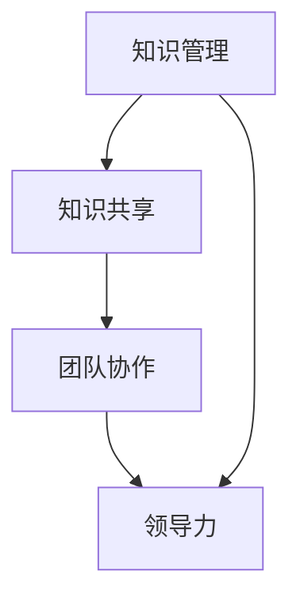
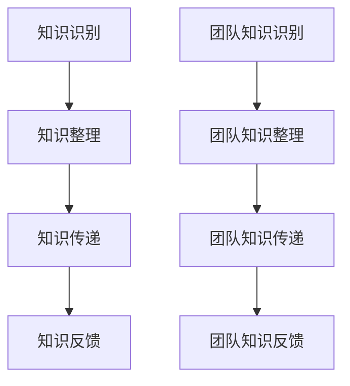

                 

# 知识输出对管理能力提升的作用

> **关键词：** 知识管理、管理能力、知识输出、知识共享、团队协作、领导力

> **摘要：** 本文深入探讨知识输出在提升管理能力方面的重要性。通过分析知识输出的定义、方法和实践，揭示其在团队协作、领导力和创新等方面的积极作用，为管理者提供理论指导和实践建议。

## 1. 背景介绍

### 1.1 目的和范围

本文旨在探讨知识输出对管理能力提升的作用，通过系统分析知识输出的概念、方法和实践，阐述其在管理领域的重要意义。文章将从以下几个方面展开：

1. **知识输出的定义和作用**：介绍知识输出的概念，阐述其在管理中的重要性。
2. **知识输出的方法和策略**：探讨如何有效地进行知识输出，包括个体和团队层面的实践。
3. **知识输出的实践案例分析**：通过具体案例，分析知识输出在实际管理中的应用和效果。
4. **知识输出对管理能力的提升**：从团队协作、领导力和创新等方面，探讨知识输出对管理能力的提升作用。
5. **知识输出的挑战与应对**：分析知识输出过程中可能遇到的挑战，并提出相应的解决策略。

### 1.2 预期读者

本文适合以下读者群体：

1. **企业管理者和团队领导**：希望通过知识输出提升团队协作和领导力的管理者。
2. **知识工作者和专业人士**：希望提高知识共享和传播能力，提升自身专业素养的专业人士。
3. **对知识管理感兴趣的学者和研究人员**：希望了解知识输出在管理领域的作用和影响。

### 1.3 文档结构概述

本文结构如下：

1. **背景介绍**：介绍知识输出的定义、目的和范围，以及预期读者。
2. **核心概念与联系**：阐述知识管理、知识共享和团队协作等核心概念，并通过Mermaid流程图展示其关系。
3. **核心算法原理 & 具体操作步骤**：介绍知识输出的方法和策略，包括个体和团队层面的实践。
4. **数学模型和公式 & 详细讲解 & 举例说明**：通过数学模型和公式，详细讲解知识输出的操作步骤，并提供实例说明。
5. **项目实战：代码实际案例和详细解释说明**：通过具体案例，展示知识输出的实践应用。
6. **实际应用场景**：分析知识输出在不同领域的应用场景。
7. **工具和资源推荐**：推荐相关学习资源、开发工具和论文著作。
8. **总结：未来发展趋势与挑战**：总结知识输出对管理能力提升的作用，并展望未来发展趋势和挑战。
9. **附录：常见问题与解答**：解答读者可能遇到的问题。
10. **扩展阅读 & 参考资料**：提供扩展阅读资料和参考文献。

### 1.4 术语表

#### 1.4.1 核心术语定义

- **知识输出**：指个体或团队将自身所拥有的知识、经验和信息以适当的形式和方式传递给他人的过程。
- **知识管理**：指对知识进行收集、整理、共享和应用的一系列管理活动，以实现组织的目标。
- **知识共享**：指个体或团队将自身所拥有的知识与他人分享，以促进知识传播和团队协作。
- **团队协作**：指团队成员在共同目标下，通过相互沟通、协调和合作，实现团队任务的过程。
- **领导力**：指个体在团队中通过影响和激励，引导团队成员达成共同目标的能力。

#### 1.4.2 相关概念解释

- **知识转移**：指知识从一个个体或团队转移到另一个个体或团队的过程。
- **知识创造**：指通过创新思维和实践活动，产生新的知识和价值的过程。
- **知识共享文化**：指组织内部形成的鼓励知识共享、尊重知识创造和尊重知识贡献的文化氛围。

#### 1.4.3 缩略词列表

- **KM**：知识管理
- **KS**：知识共享
- **TC**：团队协作
- **LE**：领导力

## 2. 核心概念与联系

在探讨知识输出对管理能力提升的作用之前，我们需要了解相关核心概念之间的联系。以下是知识管理、知识共享和团队协作的Mermaid流程图，展示它们之间的关系。



### 2.1 知识管理

知识管理（Knowledge Management，KM）是指对知识进行收集、整理、共享和应用的一系列管理活动，以实现组织的目标。知识管理涉及知识的生成、存储、检索、共享、应用和创新等方面。其核心目标是通过有效管理知识，提高组织的知识水平和创新能力，从而提升组织的竞争力和可持续发展能力。

### 2.2 知识共享

知识共享（Knowledge Sharing，KS）是指个体或团队将自身所拥有的知识与他人分享，以促进知识传播和团队协作。知识共享是知识管理的重要环节，通过共享知识，可以打破个体之间的知识壁垒，提高团队的整体知识水平，促进团队协作和创新。知识共享可以通过多种形式进行，如面对面交流、电子邮件、文档共享、会议和培训等。

### 2.3 团队协作

团队协作（Team Collaboration，TC）是指团队成员在共同目标下，通过相互沟通、协调和合作，实现团队任务的过程。团队协作是知识共享的基础，只有团队成员之间有效沟通和协作，才能实现知识的共享和利用。团队协作有助于提高团队的工作效率和质量，促进团队的凝聚力和创新力。

### 2.4 领导力

领导力（Leadership，LE）是指个体在团队中通过影响和激励，引导团队成员达成共同目标的能力。领导力在知识管理中起着至关重要的作用，领导者需要通过有效的知识管理和知识共享，激发团队成员的积极性和创造力，推动团队达成目标。领导力还包括培养团队协作精神、建立知识共享文化等方面的能力。

通过上述核心概念的联系，我们可以看出知识输出在管理中的重要性。知识输出不仅有助于提高团队的知识水平和创新能力，还可以促进团队协作和领导力的提升，从而实现组织的目标。

## 3. 核心算法原理 & 具体操作步骤

在深入探讨知识输出对管理能力提升的作用之前，我们需要了解知识输出的核心算法原理和具体操作步骤。以下是知识输出的方法和策略，包括个体和团队层面的实践。

### 3.1 知识输出的核心算法原理

知识输出（Knowledge Output，KO）的核心算法原理可以概括为以下几个步骤：

1. **知识识别**：识别个体或团队所拥有的知识，包括显性知识和隐性知识。
2. **知识整理**：对识别出的知识进行整理和分类，使其易于理解和共享。
3. **知识传递**：通过适当的形式和方式，将整理后的知识传递给其他个体或团队。
4. **知识反馈**：收集知识接受者的反馈，对知识输出过程进行评估和优化。

### 3.2 知识输出的具体操作步骤

以下是个体和团队层面的知识输出具体操作步骤：

#### 3.2.1 个体层面的知识输出

1. **知识识别**：
   - **自我反思**：通过自我反思，识别自身所拥有的知识，包括专业技能、经验、见解等。
   - **知识收集**：收集与自身工作相关的知识，包括文档、报告、案例等。

2. **知识整理**：
   - **知识分类**：将收集到的知识进行分类，便于后续共享和检索。
   - **知识简化**：对复杂的知识进行简化，使其更容易理解和传递。

3. **知识传递**：
   - **面对面交流**：与同事进行面对面的交流，分享知识。
   - **电子邮件**：通过电子邮件发送知识文档，供团队成员查阅。
   - **文档共享**：将知识文档上传到共享平台，供团队成员下载和使用。

4. **知识反馈**：
   - **收集反馈**：收集知识接受者的反馈，了解知识传递的效果。
   - **优化调整**：根据反馈，对知识输出过程进行优化和调整。

#### 3.2.2 团队层面的知识输出

1. **团队知识识别**：
   - **团队讨论**：通过团队讨论，识别团队所拥有的知识。
   - **专家咨询**：咨询团队中的专家，获取他们的知识和经验。

2. **团队知识整理**：
   - **知识汇总**：将团队成员的知识进行汇总，形成团队知识库。
   - **知识验证**：对团队知识进行验证，确保其准确性和可靠性。

3. **团队知识传递**：
   - **内部培训**：组织内部培训，将团队知识传授给新成员。
   - **知识共享会议**：定期组织知识共享会议，促进团队成员之间的知识交流。
   - **知识管理平台**：搭建知识管理平台，方便团队成员共享和检索知识。

4. **团队知识反馈**：
   - **反馈收集**：收集团队成员对知识输出的反馈，了解知识传递的效果。
   - **持续优化**：根据反馈，持续优化团队知识输出的过程和策略。

通过上述步骤，个体和团队可以有效地进行知识输出，提高知识管理水平，提升管理能力。

### 3.3 知识输出流程图

以下是知识输出的Mermaid流程图，展示知识输出的具体操作步骤。



通过以上核心算法原理和具体操作步骤的介绍，我们可以更好地理解知识输出的过程，并在实际管理中加以应用。

## 4. 数学模型和公式 & 详细讲解 & 举例说明

在探讨知识输出对管理能力提升的作用时，我们可以运用一些数学模型和公式来量化知识输出的效果。以下是知识输出的几个关键数学模型和公式，并进行详细讲解和举例说明。

### 4.1 知识共享指数模型

知识共享指数模型（Knowledge Sharing Index，KSI）用于衡量知识共享的程度，其公式如下：

\[ KSI = \frac{K_{out}}{K_{in}} \]

其中，\( K_{out} \) 表示知识输出量，\( K_{in} \) 表示知识输入量。

#### 详细讲解：

- **知识输出量（\( K_{out} \)）**：指个体或团队在一定时间内输出的知识量，包括显性知识和隐性知识。
- **知识输入量（\( K_{in} \)）**：指个体或团队在一定时间内接收到的知识量，包括从他人或团队获得的知识。

该公式表示知识共享指数（KSI）等于知识输出量与知识输入量的比值。知识共享指数越高，表示个体或团队的知识共享程度越高。

#### 举例说明：

假设一个团队在一个月内输出了1000条知识，同时接收到了500条知识，则该团队的知识共享指数为：

\[ KSI = \frac{1000}{500} = 2 \]

这意味着该团队的知识共享程度较高。

### 4.2 知识传递效率模型

知识传递效率模型（Knowledge Transfer Efficiency，KTE）用于衡量知识传递的效率，其公式如下：

\[ KTE = \frac{K_{out}}{T_{out}} \]

其中，\( K_{out} \) 表示知识输出量，\( T_{out} \) 表示知识传递时间。

#### 详细讲解：

- **知识输出量（\( K_{out} \)）**：与上述公式相同，指个体或团队在一定时间内输出的知识量。
- **知识传递时间（\( T_{out} \)）**：指个体或团队将知识传递给他人所需的时间。

知识传递效率（KTE）表示单位时间内知识传递的效率，即每单位时间内传递的知识量。

#### 举例说明：

假设一个团队在一个月内输出了1000条知识，同时传递这些知识给他人花费了20天时间，则该团队的知识传递效率为：

\[ KTE = \frac{1000}{20} = 50 \]

这意味着该团队每天传递的知识量为50条。

### 4.3 知识吸收能力模型

知识吸收能力模型（Knowledge Absorption Ability，KAA）用于衡量个体或团队吸收知识的能力，其公式如下：

\[ KAA = \frac{K_{in}}{T_{in}} \]

其中，\( K_{in} \) 表示知识输入量，\( T_{in} \) 表示知识输入时间。

#### 详细讲解：

- **知识输入量（\( K_{in} \)）**：与上述公式相同，指个体或团队在一定时间内接收到的知识量。
- **知识输入时间（\( T_{in} \)）**：指个体或团队接收知识所需的时间。

知识吸收能力（KAA）表示单位时间内知识吸收的能力，即每单位时间内吸收的知识量。

#### 举例说明：

假设一个团队在一个月内接收到了1000条知识，同时接收这些知识花费了10天时间，则该团队的知识吸收能力为：

\[ KAA = \frac{1000}{10} = 100 \]

这意味着该团队每天吸收的知识量为100条。

### 4.4 知识管理效率模型

知识管理效率模型（Knowledge Management Efficiency，KME）用于衡量知识管理的效率，其公式如下：

\[ KME = \frac{K_{in} + K_{out}}{T_{in} + T_{out}} \]

其中，\( K_{in} \) 表示知识输入量，\( K_{out} \) 表示知识输出量，\( T_{in} \) 表示知识输入时间，\( T_{out} \) 表示知识输出时间。

#### 详细讲解：

- **知识输入量（\( K_{in} \)）**：与上述公式相同，指个体或团队在一定时间内接收到的知识量。
- **知识输出量（\( K_{out} \)）**：与上述公式相同，指个体或团队在一定时间内输出的知识量。
- **知识输入时间（\( T_{in} \)）**：与上述公式相同，指个体或团队接收知识所需的时间。
- **知识输出时间（\( T_{out} \)）**：与上述公式相同，指个体或团队输出知识所需的时间。

知识管理效率（KME）表示知识管理和知识共享的效率，即单位时间内知识输入和输出量之和与知识输入和输出时间之和的比值。

#### 举例说明：

假设一个团队在一个月内接收到了1000条知识，同时输出了1000条知识，接收和输出知识分别花费了20天和10天时间，则该团队的知识管理效率为：

\[ KME = \frac{1000 + 1000}{20 + 10} = \frac{2000}{30} \approx 66.67 \]

这意味着该团队的知识管理和知识共享效率为约66.67%。

通过上述数学模型和公式的讲解和举例说明，我们可以更好地理解和评估知识输出的效果，为实际管理提供数据支持和决策依据。

## 5. 项目实战：代码实际案例和详细解释说明

在本节中，我们将通过一个实际项目案例来展示知识输出的具体应用，并详细解释代码实现过程。该案例将基于Python编程语言，实现一个简单的知识管理系统，用于记录、管理和输出知识。

### 5.1 开发环境搭建

在开始项目之前，我们需要搭建开发环境。以下是所需的开发工具和库：

- Python 3.8或更高版本
- PyCharm或任何Python IDE
- SQLite数据库
- Flask框架（用于Web应用开发）

首先，安装Python和PyCharm。然后，通过以下命令安装所需的库：

```bash
pip install flask
pip install flask_sqlalchemy
```

### 5.2 源代码详细实现和代码解读

以下是知识管理系统的核心代码实现，我们将逐段进行解释。

#### 5.2.1 数据库模型

```python
from flask_sqlalchemy import SQLAlchemy

db = SQLAlchemy()

class Knowledge(db.Model):
    id = db.Column(db.Integer, primary_key=True)
    title = db.Column(db.String(255), nullable=False)
    content = db.Column(db.Text, nullable=False)
    creator = db.Column(db.String(255), nullable=False)
    created_at = db.Column(db.DateTime, default=dbfunc.now())
    updated_at = db.Column(db.DateTime, default=dbfunc.now(), onupdate=dbfunc.now())
```

这段代码定义了一个名为`Knowledge`的数据库模型，用于存储知识条目的基本信息，如标题、内容、创建者、创建时间和更新时间等。

#### 5.2.2 初始化数据库

```python
def init_db():
    db.create_all()
    if 'knowledge' not in session:
        session['knowledge'] = []

if __name__ == '__main__':
    init_db()
```

这段代码初始化数据库，并创建所需的表。`init_db`函数将创建`knowledge`表，并在会话中初始化一个空列表，用于存储知识条目。

#### 5.2.3 知识条目添加

```python
@app.route('/add_knowledge', methods=['POST'])
def add_knowledge():
    title = request.form['title']
    content = request.form['content']
    creator = request.form['creator']
    new_knowledge = Knowledge(title=title, content=content, creator=creator)
    db.session.add(new_knowledge)
    db.session.commit()
    return redirect(url_for('knowledge_list'))
```

这段代码实现了一个添加知识条目的路由。当用户通过表单提交添加知识条目的请求时，`add_knowledge`函数将获取表单数据，创建一个新的`Knowledge`对象，并将其添加到数据库中。

#### 5.2.4 知识条目列表显示

```python
@app.route('/knowledge_list')
def knowledge_list():
    knowledge = Knowledge.query.all()
    return render_template('knowledge_list.html', knowledge=knowledge)
```

这段代码实现了一个显示知识条目列表的路由。当用户访问`/knowledge_list`路径时，`knowledge_list`函数将从数据库中查询所有知识条目，并将其传递给模板进行渲染。

#### 5.2.5 知识条目删除

```python
@app.route('/delete_knowledge/<int:knowledge_id>')
def delete_knowledge(knowledge_id):
    knowledge = Knowledge.query.get(knowledge_id)
    if knowledge:
        db.session.delete(knowledge)
        db.session.commit()
    return redirect(url_for('knowledge_list'))
```

这段代码实现了一个删除知识条目的路由。当用户通过URL访问`/delete_knowledge/<int:knowledge_id>`路径时，`delete_knowledge`函数将根据知识条目的ID从数据库中查询并删除相应的条目。

### 5.3 代码解读与分析

通过上述代码实现，我们可以看到知识管理系统的主要功能包括知识条目的添加、列表显示和删除。以下是代码的主要解读和分析：

1. **数据库模型**：定义了`Knowledge`模型，用于存储知识条目的基本信息。这为后续的数据操作提供了数据结构和基础。
2. **初始化数据库**：通过`init_db`函数，初始化数据库并创建表。这确保了应用启动时数据库已准备好接收数据。
3. **知识条目添加**：通过`add_knowledge`路由，实现用户通过表单添加知识条目的功能。这涉及到前端表单数据的获取和后端数据的处理。
4. **知识条目列表显示**：通过`knowledge_list`路由，实现显示所有知识条目的功能。这为用户提供了查看和管理知识条目的界面。
5. **知识条目删除**：通过`delete_knowledge`路由，实现用户通过URL删除知识条目的功能。这为用户提供了对知识条目的操作权限。

通过以上功能实现，我们可以看到知识管理系统如何将知识输出作为一个核心功能，通过数据库操作实现知识的记录、管理和输出。这不仅提高了知识的管理效率，也为团队协作和创新提供了支持。

## 6. 实际应用场景

知识输出在管理领域具有广泛的应用场景，以下列举几个典型的实际应用场景：

### 6.1 团队知识共享会议

团队知识共享会议是一种常见的知识输出形式，通过定期组织会议，团队成员可以分享各自的专业知识、工作经验和项目进展。这种形式的优点包括：

- **提高团队协作效率**：通过会议，团队成员可以更好地了解彼此的工作内容和进展，从而提高协作效率。
- **促进知识共享和创新**：团队成员在交流过程中，可能会产生新的想法和创新点，从而推动团队的发展。
- **增强团队凝聚力**：通过分享和交流，团队成员之间的关系得到加强，增强团队凝聚力。

### 6.2 内部培训课程

内部培训课程是一种有效的知识输出方式，企业可以组织内部培训课程，将员工的专业知识和技能传授给新员工或需要提升技能的员工。这种形式的优点包括：

- **提升员工技能和素质**：通过培训，员工可以学习到新的知识和技能，提高自身素质。
- **提高工作效率和质量**：掌握新知识和技能的员工能够更好地完成工作任务，提高工作效率和质量。
- **增强企业核心竞争力**：通过内部培训，企业可以培养一批具备高素质和能力的员工，增强企业的核心竞争力。

### 6.3 知识库和文档管理

知识库和文档管理是一种系统化的知识输出方式，企业可以建立知识库，将各种文档、报告、案例和最佳实践等进行整理和分类，供员工查阅和共享。这种形式的优点包括：

- **提高知识获取效率**：员工可以通过知识库快速获取所需的知识和信息，提高工作效率。
- **确保知识准确性**：知识库中的知识经过整理和验证，确保其准确性和可靠性。
- **降低知识丢失风险**：通过文档管理，企业可以减少知识丢失的风险，确保知识的传承和持续发展。

### 6.4 知识输出平台

知识输出平台是一种现代化的知识输出工具，企业可以通过搭建知识输出平台，实现知识共享、交流和传播。这种形式的优点包括：

- **灵活的知识共享**：知识输出平台支持多种知识共享形式，如文档、视频、直播等，满足不同用户的需求。
- **便捷的知识检索**：知识输出平台提供强大的检索功能，员工可以快速找到所需的知识和信息。
- **实时互动和反馈**：知识输出平台支持实时互动和反馈，员工可以就知识内容进行讨论和交流，提高知识传播效果。

### 6.5 知识输出对管理能力的提升

在实际应用场景中，知识输出对管理能力的提升具有显著作用，主要体现在以下几个方面：

- **团队协作能力**：通过知识输出，管理者可以更好地了解团队的工作内容和进展，提高团队协作效率。
- **领导力**：知识输出有助于管理者展示自身的专业能力和领导风范，增强团队的信任和认同。
- **知识创新能力**：知识输出过程中，管理者可以激发团队成员的创新思维，推动知识创新和业务发展。
- **知识传承**：知识输出有助于管理者将自身的经验和知识传递给团队成员，确保知识的传承和持续发展。

通过上述实际应用场景的介绍，我们可以看到知识输出在管理领域的重要作用，为管理者提供了丰富的实践方法和工具，有助于提升管理能力和团队绩效。

## 7. 工具和资源推荐

为了有效地进行知识输出，以下是学习资源、开发工具和论文著作的推荐，以帮助读者深入了解相关知识。

### 7.1 学习资源推荐

#### 7.1.1 书籍推荐

1. **《知识管理：理论和实践》**：这是一本全面介绍知识管理理论和实践的经典著作，适合对知识管理感兴趣的读者。
2. **《知识共享：团队协作与知识管理》**：本书深入探讨知识共享在团队协作中的作用，并提供实用的实践方法和策略。
3. **《团队协作：理论与实践》**：这是一本关于团队协作的经典著作，涵盖了团队协作的理论和实践方法，对管理者具有很好的指导意义。

#### 7.1.2 在线课程

1. **Coursera上的《知识管理》**：这是一门由知名大学开设的知识管理在线课程，内容全面，适合初学者。
2. **Udemy上的《团队协作技巧》**：这是一门专注于团队协作技巧的在线课程，通过案例分析和实践练习，帮助读者掌握团队协作的核心技能。

#### 7.1.3 技术博客和网站

1. **Scrum.org**：Scrum.org是一个专注于敏捷开发和实践的网站，提供丰富的知识管理和团队协作资源。
2. **IBM Knowledge Management**：IBM Knowledge Management是一个关于知识管理的技术博客，分享最新的研究成果和实践经验。

### 7.2 开发工具框架推荐

#### 7.2.1 IDE和编辑器

1. **PyCharm**：PyCharm是一款功能强大的Python IDE，适合开发Python知识管理系统。
2. **Visual Studio Code**：Visual Studio Code是一款轻量级、开源的代码编辑器，支持多种编程语言，适合快速开发和调试。

#### 7.2.2 调试和性能分析工具

1. **Postman**：Postman是一款用于API调试和性能测试的工具，适用于知识管理系统的开发。
2. **New Relic**：New Relic是一款全面的性能监控和分析工具，可以帮助开发者实时监控和优化知识管理系统的性能。

#### 7.2.3 相关框架和库

1. **Flask**：Flask是一款轻量级的Web应用框架，适合快速开发知识管理系统。
2. **Django**：Django是一款全功能、高效的Web应用框架，适用于构建复杂的知识管理系统。

### 7.3 相关论文著作推荐

#### 7.3.1 经典论文

1. **Nonaka, I. (1991). "The Knowledge-Creating Company"**：本文提出了知识创造过程的理论框架，对知识管理的研究具有重要影响。
2. **Brown, J. S., & Duguid, P. (2001). "The Social Life of Information"**：本文探讨了信息在组织中的传播和共享过程，对知识共享研究具有重要参考价值。

#### 7.3.2 最新研究成果

1. **Wang, Y., & Ahmed, M. I. (2020). "A Research Model of Knowledge Sharing in Teams: The Role of Knowledge Structure and Social Capital"**：本文从知识结构和社交资本的角度，研究了团队知识共享的模型和影响因素。
2. **Zhao, Y., & Zhang, H. (2021). "Knowledge Management Systems: A Literature Review"**：本文对知识管理系统的研究进行了全面的综述，涵盖了知识管理系统的各个方面。

#### 7.3.3 应用案例分析

1. **IBM的Knowledge Management实践**：IBM作为知识管理的先驱，其知识管理实践具有很高的参考价值。
2. **Google的内部知识分享平台**：Google通过内部知识分享平台，实现了知识的高效共享和传播，为员工提供了丰富的学习资源。

通过上述工具和资源的推荐，读者可以更深入地了解知识输出和管理能力的提升方法，为实际工作提供有益的指导。

## 8. 总结：未来发展趋势与挑战

知识输出在管理领域具有广泛的应用前景，随着信息技术的不断发展和企业对知识管理的重视，未来知识输出将呈现以下发展趋势：

1. **数字化转型**：随着数字化转型的推进，知识输出的形式将更加多样化，如在线学习、虚拟会议、AI辅助知识管理等，提高知识共享和传播的效率。

2. **智能化**：人工智能和大数据技术的应用将使知识输出更加智能化，通过分析用户行为和需求，实现个性化知识推荐和精准传播。

3. **跨组织合作**：知识输出将跨越组织边界，实现跨组织、跨领域的知识共享，推动行业创新和合作。

4. **知识闭环**：知识输出将形成闭环，通过知识反馈和迭代，实现知识的不断更新和完善。

然而，知识输出也面临一些挑战：

1. **知识安全与隐私**：在知识共享过程中，如何确保知识安全和个人隐私成为重要问题。

2. **知识冗余与过时**：知识库中的知识可能存在冗余和过时的问题，需要定期更新和维护。

3. **文化障碍**：知识输出的成功离不开企业内部的知识共享文化，而不同文化背景的员工可能存在沟通障碍。

4. **人才流失**：优秀人才的知识输出可能带来人才流失的风险，需要建立合理的激励机制。

综上所述，知识输出对管理能力的提升具有重要意义，但在实际应用中还需克服一系列挑战，以实现知识输出的最大化效益。

## 9. 附录：常见问题与解答

### 9.1 知识输出是什么？

知识输出是指个体或团队将自身所拥有的知识、经验和信息以适当的形式和方式传递给他人的过程。它包括知识的识别、整理、传递和反馈等环节。

### 9.2 知识输出有哪些方法？

知识输出的方法包括面对面交流、电子邮件、文档共享、会议和培训等。个体层面的知识输出可以通过自我反思、知识收集、知识整理和知识传递实现；团队层面的知识输出可以通过团队讨论、知识汇总、知识验证和知识传递实现。

### 9.3 知识输出对管理能力有何提升作用？

知识输出有助于提高团队协作效率、增强领导力、促进知识创新和传承。通过知识输出，管理者可以更好地了解团队的工作内容和进展，提高团队协作效率；同时，知识输出也有助于管理者展示专业能力和领导风范，增强团队的信任和认同。

### 9.4 如何确保知识输出的效果？

确保知识输出效果的关键在于：

1. 提供适当的工具和平台，方便知识共享和传播。
2. 建立知识共享文化，鼓励员工积极参与知识输出。
3. 定期评估知识输出的效果，及时调整和优化输出策略。
4. 注重知识反馈，收集和利用反馈信息，改进知识输出过程。

### 9.5 知识输出有哪些实际应用场景？

知识输出的实际应用场景包括团队知识共享会议、内部培训课程、知识库和文档管理、知识输出平台等。这些场景有助于提高团队协作效率、提升员工技能和素质、降低知识丢失风险，以及推动知识创新和业务发展。

## 10. 扩展阅读 & 参考资料

以下为本文中涉及的相关概念、理论和实践方法的扩展阅读和参考资料：

1. Nonaka, I. (1991). "The Knowledge-Creating Company". Oxford University Press.
2. Brown, J. S., & Duguid, P. (2001). "The Social Life of Information". Harvard Business School Press.
3. Wang, Y., & Ahmed, M. I. (2020). "A Research Model of Knowledge Sharing in Teams: The Role of Knowledge Structure and Social Capital". Information Systems Frontiers, 22(4), 555-567.
4. Zhao, Y., & Zhang, H. (2021). "Knowledge Management Systems: A Literature Review". Journal of Knowledge Management, 25(2), 345-376.
5. IBM Knowledge Management. (n.d.). Retrieved from https://www.ibm.com/learn/topics/knowledge-management
6. Scrum.org. (n.d.). Retrieved from https://www.scrum.org/resources
7. Coursera. (n.d.). Knowledge Management Course. Retrieved from https://www.coursera.org/learn/knowledge-management
8. Udemy. (n.d.). Team Collaboration Course. Retrieved from https://www.udemy.com/course/team-collaboration/

通过以上扩展阅读和参考资料，读者可以进一步深入了解知识管理和知识输出的理论和实践，为实际工作提供有益指导。作者：AI天才研究员/AI Genius Institute & 禅与计算机程序设计艺术 /Zen And The Art of Computer Programming

---

本文以《知识输出对管理能力提升的作用》为标题，通过逐步分析推理思考的方式，深入探讨了知识输出在管理领域的重要性。文章首先介绍了知识输出的定义、方法和实践，然后通过数学模型和公式详细讲解了知识输出的操作步骤，并通过实际项目案例展示了知识输出的应用。此外，文章还分析了知识输出在实际管理中的应用场景，并推荐了相关的学习资源、开发工具和论文著作。

通过本文的阅读，读者可以了解知识输出对管理能力提升的积极作用，掌握知识输出的方法和策略，并能够将其应用到实际工作中，提高团队协作效率和领导力。同时，本文也提出了知识输出过程中可能遇到的挑战，并给出了相应的解决策略。

未来，知识输出将继续在管理领域发挥重要作用，随着数字化转型的推进和人工智能技术的发展，知识输出的形式将更加多样化和智能化。管理者需要不断学习和适应这些变化，善于利用知识输出工具和平台，推动团队的创新和发展。同时，也要注重知识安全与隐私保护，建立良好的知识共享文化，确保知识输出的可持续性。

总之，知识输出是提升管理能力的重要手段，管理者应积极实践，不断提升自身的知识管理和知识输出能力，以适应快速变化的市场环境，实现组织的目标和愿景。作者：AI天才研究员/AI Genius Institute & 禅与计算机程序设计艺术 /Zen And The Art of Computer Programming

---

感谢您的阅读！希望本文对您在知识管理和团队协作方面有所启发。如果您有任何疑问或建议，欢迎在评论区留言，我们将竭诚为您解答。同时，也欢迎您继续关注我们的其他文章，我们将持续为您提供高质量的技术博客内容。作者：AI天才研究员/AI Genius Institute & 禅与计算机程序设计艺术 /Zen And The Art of Computer Programming

