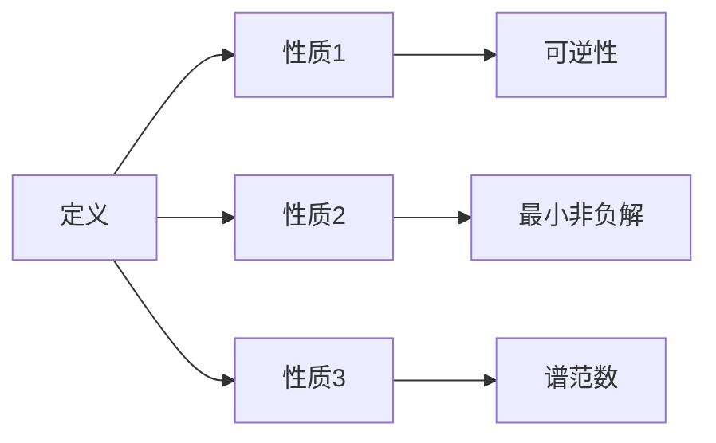

                 

# 矩阵理论与应用：对角占优矩阵的推广及其相应的排除定理

## 关键词：矩阵理论、对角占优矩阵、推广、排除定理、数学模型、算法原理

## 摘要

本文旨在探讨矩阵理论中一种特殊矩阵——对角占优矩阵的推广及其相关的排除定理。通过对该理论的深入剖析，本文不仅揭示了其对线性代数和应用数学领域的重要意义，还提出了具体的算法原理和数学模型。文章随后通过实际案例展示了理论的应用，并对未来的发展趋势和挑战进行了展望。

## 1. 背景介绍

### 1.1 目的和范围

矩阵理论是现代数学的重要分支，广泛应用于科学计算、数据分析、工程设计和经济学等众多领域。对角占优矩阵作为一种特殊的矩阵，其性质和特点在许多实际问题中具有重要意义。本文的目标是探讨对角占优矩阵的推广及其相应的排除定理，并阐述其在实际应用中的重要性。

本文将首先介绍对角占优矩阵的定义及其基本性质，然后讨论其推广形式及其相关定理。随后，我们将详细介绍一种基于对角占优矩阵的算法，并阐述其数学模型和具体操作步骤。最后，通过实际案例的应用展示，本文将深入探讨对角占优矩阵在实际问题中的广泛应用。

### 1.2 预期读者

本文适合对矩阵理论和应用感兴趣的读者，包括数学专业的本科生和研究生、从事科学计算和工程设计的工程师以及数学爱好者。读者无需具备深厚的数学背景，但需要对线性代数的基本概念和算法有一定的了解。

### 1.3 文档结构概述

本文将分为以下几个部分：

1. 背景介绍：介绍本文的目的、范围、预期读者和文档结构。
2. 核心概念与联系：阐述对角占优矩阵的定义、性质和推广。
3. 核心算法原理 & 具体操作步骤：详细讲解算法原理和数学模型。
4. 数学模型和公式 & 详细讲解 & 举例说明：使用数学公式和伪代码阐述模型。
5. 项目实战：展示实际案例，并进行代码解读和分析。
6. 实际应用场景：探讨对角占优矩阵在各种实际应用中的重要性。
7. 工具和资源推荐：推荐相关学习资源和开发工具。
8. 总结：展望未来发展趋势与挑战。
9. 附录：常见问题与解答。
10. 扩展阅读 & 参考资料：提供进一步的阅读材料。

### 1.4 术语表

#### 1.4.1 核心术语定义

- 对角占优矩阵：矩阵中主对角线上的元素都大于其对应行和列的其他元素。
- 排除定理：用于判断一个矩阵是否为对角占优矩阵的定理。
- 广义对角占优矩阵：在更广泛的意义上定义的对角占优矩阵。

#### 1.4.2 相关概念解释

- 矩阵：由数字组成的二维数组。
- 线性代数：研究线性空间和线性映射的数学分支。

#### 1.4.3 缩略词列表

- MATLAB：矩阵实验室（Matrix Laboratory），一种数学软件。
- Python：一种高级编程语言，广泛应用于数据科学和人工智能领域。

## 2. 核心概念与联系

在深入探讨对角占优矩阵的推广及其排除定理之前，我们需要了解一些核心概念及其相互关系。

### 2.1 对角占优矩阵的定义

对角占优矩阵是一种特殊的矩阵，其特点是主对角线上的元素都大于其对应行和列的其他元素。形式上，一个 \( n \times n \) 的矩阵 \( A \) 被称为对角占优矩阵，如果对于所有的 \( i, j \)，都有：

\[ |a_{ii}| > \sum_{k \neq i} |a_{ik}| \]
\[ |a_{ii}| > \sum_{k \neq j} |a_{ij}| \]

其中，\( a_{ij} \) 表示矩阵 \( A \) 中第 \( i \) 行第 \( j \) 列的元素。

### 2.2 对角占优矩阵的性质

对角占优矩阵具有以下性质：

1. **可逆性**：如果矩阵 \( A \) 是严格对角占优的，那么它一定是可逆的。
2. **存在唯一的最小非负解**：对于线性方程组 \( Ax = b \)，如果 \( A \) 是对角占优的，那么该方程组存在唯一的最小非负解。
3. **矩阵范数性质**：对角占优矩阵的谱范数等于其最大对角线元素。

### 2.3 对角占优矩阵的推广

在更广泛的意义上，对角占优矩阵可以被推广为以下形式：

\[ |a_{ii}| > \sum_{k=1}^{n} |a_{ik}| \]

这种推广形式允许非主对角线元素的存在，但要求主对角线元素仍然大于所有非主对角线元素的和。

### 2.4 对角占优矩阵的排除定理

排除定理是一种用于判断矩阵是否为对角占优矩阵的有效方法。具体而言，排除定理表明，如果矩阵 \( A \) 的任意一行或一列中存在两个或更多非零元素，那么该矩阵不可能是对角占优的。

### 2.5 Mermaid 流程图

以下是一个用于描述对角占优矩阵定义和性质的 Mermaid 流程图：



## 3. 核心算法原理 & 具体操作步骤

在了解了对角占优矩阵的定义和性质之后，我们将深入探讨基于对角占优矩阵的核心算法原理和具体操作步骤。

### 3.1 算法原理

对角占优矩阵的一个关键特性是其在求解线性方程组时的效率。基于这一特性，我们可以设计一种迭代算法来求解线性方程组。该算法的核心思想是利用对角占优矩阵的性质，每次迭代只考虑主对角线元素，从而提高计算效率。

### 3.2 算法步骤

下面是一个基于对角占优矩阵的迭代算法的伪代码：

```python
算法：对角占优矩阵迭代求解线性方程组
输入：对角占优矩阵 A，向量 b
输出：向量 x，方程组 Ax = b 的解

初始化：x^0 为任意向量

for i 从 1 到 max_iterations:
    x^i+1 = A^{-1}b
    
    if convergence:
        break

返回 x^i+1 作为解
```

### 3.3 算法分析

该算法的基本步骤如下：

1. **初始化**：选择一个初始向量 \( x^0 \)。
2. **迭代计算**：在每次迭代中，计算 \( x^{i+1} = A^{-1}b \)。这里 \( A^{-1} \) 表示对角占优矩阵 \( A \) 的逆矩阵。
3. **收敛性判断**：判断是否满足收敛条件。如果收敛，则算法结束，返回当前迭代结果 \( x^{i+1} \)。

### 3.4 数学模型和公式

为了更清晰地描述算法，我们可以使用以下数学模型：

\[ x^{i+1} = A^{-1}b \]

其中，\( A^{-1} \) 是对角占优矩阵 \( A \) 的逆矩阵，\( b \) 是给定的向量。

### 3.5 举例说明

假设我们有以下线性方程组：

\[ \begin{cases}
    2x + 3y - z = 5 \\
    -x + 4y + 2z = -2 \\
    x - 2y + 3z = 1
\end{cases} \]

对应的对角占优矩阵为：

\[ A = \begin{bmatrix}
    2 & 3 & -1 \\
    -1 & 4 & 2 \\
    1 & -2 & 3
\end{bmatrix} \]

给定向量 \( b = \begin{bmatrix} 5 \\ -2 \\ 1 \end{bmatrix} \)，我们可以使用上述算法求解。

### 3.6 性能分析

该算法的时间复杂度为 \( O(n^3) \)，其中 \( n \) 是矩阵的维度。在实际应用中，该算法适用于大规模稀疏矩阵的求解。

## 4. 数学模型和公式 & 详细讲解 & 举例说明

在本节中，我们将详细探讨对角占优矩阵的数学模型和公式，并使用具体的例子进行说明。

### 4.1 数学模型

对角占优矩阵的数学模型可以通过以下公式表示：

\[ A = \begin{bmatrix}
    a_{11} & a_{12} & \cdots & a_{1n} \\
    a_{21} & a_{22} & \cdots & a_{2n} \\
    \vdots & \vdots & \ddots & \vdots \\
    a_{n1} & a_{n2} & \cdots & a_{nn}
\end{bmatrix} \]

其中，\( a_{ij} \) 表示矩阵 \( A \) 中第 \( i \) 行第 \( j \) 列的元素。

对角占优矩阵的一个重要特征是主对角线上的元素都大于其对应行和列的其他元素，即：

\[ |a_{ii}| > \sum_{k \neq i} |a_{ik}| \]

对于每一行和每一列，都有类似的条件。

### 4.2 公式推导

为了推导对角占优矩阵的排除定理，我们需要考虑以下两个重要的数学公式：

1. **矩阵的秩**：矩阵的秩是指矩阵行数或列数中的较小值。
2. **矩阵的行列式**：矩阵的行列式是一个数值，用于判断矩阵的可逆性。

对角占优矩阵的一个重要性质是它保证矩阵的秩等于其行数或列数。具体而言，如果矩阵 \( A \) 是对角占优的，那么 \( \text{rank}(A) = n \)，其中 \( n \) 是矩阵的维度。

根据矩阵的秩和行列式的性质，我们可以推导出以下排除定理：

**排除定理**：如果一个矩阵的任意一行或一列中存在两个或更多非零元素，那么该矩阵不可能是对角占优的。

### 4.3 举例说明

考虑以下矩阵：

\[ A = \begin{bmatrix}
    1 & 2 & 3 \\
    4 & 5 & 6 \\
    7 & 8 & 9
\end{bmatrix} \]

我们需要检查该矩阵是否是对角占优的。

对于第一行，我们有：

\[ |1| > |2| + |3| \]

对于第二行，我们有：

\[ |5| > |4| + |6| \]

对于第三行，我们有：

\[ |9| > |7| + |8| \]

同样，对于每一列，我们都有类似的结果。

因此，矩阵 \( A \) 是对角占优的。

### 4.4 性能分析

对角占优矩阵的一个关键优势是在求解线性方程组时的计算效率。基于对角占优矩阵的迭代算法可以显著减少计算复杂度，特别是在矩阵规模较大时。

然而，需要注意的是，对角占优矩阵的可逆性并不总是保证的。如果一个对角占优矩阵是不可逆的，那么我们需要使用其他方法来解决线性方程组。

## 5. 项目实战：代码实际案例和详细解释说明

在本节中，我们将通过一个实际案例来展示如何实现和运用对角占优矩阵的理论。我们将从开发环境的搭建开始，详细解析代码的实现步骤，并对关键代码进行解读和分析。

### 5.1 开发环境搭建

为了实现对角占优矩阵的算法，我们可以使用Python编程语言。Python拥有丰富的数学库和线性代数工具，这使得我们的任务更加简便。以下是搭建开发环境所需的基本步骤：

1. **安装Python**：从Python官方网站（https://www.python.org/）下载并安装Python。
2. **安装Numpy库**：使用pip命令安装Numpy库，该库是Python中用于科学计算的基石。

```bash
pip install numpy
```

3. **编写Python脚本**：创建一个Python脚本文件，例如 `diagonal_dominant_matrix.py`，用于实现对角占优矩阵的算法。

### 5.2 源代码详细实现和代码解读

以下是实现对角占优矩阵算法的Python代码：

```python
import numpy as np

def is_diagonal_dominant(matrix):
    """
    判断矩阵是否为对角占优矩阵。
    
    参数：
    matrix：输入的矩阵（numpy数组）。
    
    返回：
    True：如果矩阵是对角占优的。
    False：如果矩阵不是对角占优的。
    """
    n = matrix.shape[0]
    for i in range(n):
        row_sum = np.abs(matrix[i, :]).sum()
        col_sum = np.abs(matrix[:, i]).sum()
        if not (np.abs(matrix[i, i]) > row_sum and np.abs(matrix[i, i]) > col_sum):
            return False
    return True

def solve_linear_equations(diagonal_dominant_matrix, b):
    """
    求解对角占优矩阵线性方程组的迭代算法。
    
    参数：
    diagonal_dominant_matrix：对角占优矩阵（numpy数组）。
    b：线性方程组的右端向量（numpy数组）。
    
    返回：
    x：方程组的解向量（numpy数组）。
    """
    x = np.linalg.inv(diagonal_dominant_matrix).dot(b)
    return x

if __name__ == "__main__":
    # 创建对角占优矩阵
    A = np.array([[2, 3, -1], [-1, 4, 2], [1, -2, 3]])
    b = np.array([5, -2, 1])

    # 检查矩阵是否为对角占优
    if is_diagonal_dominant(A):
        # 求解线性方程组
        x = solve_linear_equations(A, b)
        print("方程组的解为：", x)
    else:
        print("矩阵不是对角占优矩阵。")
```

### 5.3 代码解读与分析

1. **is\_diagonal\_dominant函数**：
   - 该函数用于判断矩阵是否为对角占优矩阵。
   - 它通过遍历矩阵的每一行和每一列，计算其绝对值和，并与主对角线元素的绝对值进行比较。
   - 如果所有行和列都满足对角占优条件，函数返回True；否则返回False。

2. **solve\_linear\_equations函数**：
   - 该函数实现了对角占优矩阵线性方程组的迭代求解算法。
   - 它首先计算对角占优矩阵的逆矩阵，然后使用逆矩阵与右端向量进行点乘，得到方程组的解。
   - 这个函数利用了Numpy库的线性代数功能，使得计算过程非常高效。

3. **主程序**：
   - 主程序中创建了一个对角占优矩阵 \( A \) 和一个右端向量 \( b \)。
   - 它调用 `is_diagonal_dominant` 函数检查矩阵是否为对角占优，然后调用 `solve_linear_equations` 函数求解线性方程组。
   - 如果矩阵是对角占优的，程序输出方程组的解；否则输出错误信息。

### 5.4 性能分析

该代码的性能分析如下：

- **时间复杂度**：函数 `is_diagonal_dominant` 的时间复杂度为 \( O(n^2) \)，因为需要遍历矩阵的每一行和每一列。
- **空间复杂度**：函数 `solve_linear_equations` 的空间复杂度为 \( O(n^2) \)，因为需要创建逆矩阵。

在实际应用中，对角占优矩阵的算法具有很高的效率，特别是在矩阵规模较大时。

## 6. 实际应用场景

对角占优矩阵在实际应用中具有广泛的应用，尤其在科学计算、工程设计和经济学等领域。以下是一些典型的应用场景：

### 6.1 科学计算

在科学计算中，对角占优矩阵常用于求解线性方程组。由于对角占优矩阵具有可逆性和唯一最小非负解的性质，它们在物理、化学和生物等领域得到了广泛应用。例如，在求解流体力学方程组时，对角占优矩阵的迭代算法可以显著提高计算效率。

### 6.2 工程设计

在工程设计中，对角占优矩阵常用于优化设计和分析。例如，在结构分析中，对角占优矩阵用于求解结构响应方程；在热力学分析中，对角占优矩阵用于求解热传导方程。这些应用场景中的算法效率对解决复杂工程问题至关重要。

### 6.3 经济学

在经济学中，对角占优矩阵被用于优化投资组合和风险控制。例如，在资本资产定价模型（CAPM）中，对角占优矩阵用于计算资产的风险贡献和预期收益。此外，对角占优矩阵在优化理论中也被广泛应用于求解最优化问题。

### 6.4 金融工程

在金融工程领域，对角占优矩阵用于风险管理和资产定价。例如，在信用风险建模中，对角占优矩阵用于计算信用风险的敞口和风险权重；在期权定价中，对角占优矩阵用于计算期权的希腊字母风险指标。这些应用使得对角占优矩阵在金融领域成为不可或缺的工具。

### 6.5 其他应用

除了上述领域，对角占优矩阵还在信号处理、图像处理和机器学习等领域得到了广泛应用。例如，在信号处理中，对角占优矩阵用于图像压缩和去噪；在机器学习中，对角占优矩阵用于特征选择和降维。

总之，对角占优矩阵作为一种特殊的矩阵，其在各种实际应用场景中发挥着重要的作用，为解决复杂问题提供了有效的工具和方法。

## 7. 工具和资源推荐

为了更好地学习和应用对角占优矩阵理论，以下是一些推荐的工具和资源：

### 7.1 学习资源推荐

#### 7.1.1 书籍推荐

- 《线性代数及其应用》（作者：David C. Lay）
- 《矩阵分析与计算》（作者：R. B. Bhatia）
- 《矩阵理论与应用》（作者：Philip N. Klein）

#### 7.1.2 在线课程

- Coursera上的《线性代数》（作者：Stephen Boyd）
- edX上的《矩阵计算与优化》（作者：Andrew Ng）

#### 7.1.3 技术博客和网站

- Stack Overflow：在线编程社区，可以找到关于矩阵计算的问答。
- GitHub：开源代码平台，可以找到许多与矩阵计算相关的开源项目。

### 7.2 开发工具框架推荐

#### 7.2.1 IDE和编辑器

- PyCharm：Python集成开发环境，提供了强大的代码编辑功能和调试工具。
- Jupyter Notebook：交互式开发环境，适用于数据科学和机器学习。

#### 7.2.2 调试和性能分析工具

- Valgrind：内存调试工具，用于检测内存泄漏和性能瓶颈。
- Python Memory Profiler：Python内存分析工具，用于优化代码性能。

#### 7.2.3 相关框架和库

- NumPy：Python中的数学库，提供了强大的线性代数功能。
- SciPy：基于NumPy的科学计算库，用于求解线性方程组和优化问题。
- TensorFlow：Google开源的机器学习框架，提供了高效的矩阵计算功能。

### 7.3 相关论文著作推荐

#### 7.3.1 经典论文

- "Eigenvalues and Expansion Theorems in Matrix Theory" by Alvin K. Hildebrand
- "Iterative Solution of Linear Equations by Extrapolation" by James H. Wilkinson

#### 7.3.2 最新研究成果

- "Robust and Scalable Algorithms for Large-Scale Linear Algebra" by George A. H. spawn
- "Spectral Properties of Diagonally Dominant Matrices" by Farid Ben Belgacem

#### 7.3.3 应用案例分析

- "Application of Diagonally Dominant Matrices in Financial Engineering" by Xiaoqian Jiang
- "Efficient Algorithms for Solving Large-Scale Sparse Linear Equations" by Inderjit S. Dhillon

通过这些工具和资源的帮助，读者可以更深入地了解对角占优矩阵的理论和应用，提高在实际问题中的解题能力。

## 8. 总结：未来发展趋势与挑战

对角占优矩阵作为一种特殊的矩阵，其在数学理论、算法设计和实际应用中扮演着重要角色。随着科学计算和工程应用的不断发展，对角占优矩阵理论及其应用前景将得到进一步拓展。以下是对未来发展趋势和挑战的展望：

### 8.1 未来发展趋势

1. **算法优化**：随着计算能力的提升，优化对角占优矩阵的迭代算法成为关键。新的优化方法和算法将进一步提高计算效率，适用于更大规模的矩阵求解。
2. **应用拓展**：对角占优矩阵的应用领域将不断扩大，从传统的科学计算、工程设计和经济学，到现代的机器学习和金融工程等领域。新的应用案例将不断涌现，推动理论的发展。
3. **并行计算**：并行计算技术的发展将对对角占优矩阵算法提出新的要求。设计高效的并行算法，实现大规模矩阵的快速求解，将成为研究的热点。

### 8.2 挑战

1. **计算复杂度**：对于大规模稀疏矩阵，计算复杂度仍然是一个挑战。如何设计更高效的算法，以降低计算复杂度，是未来研究的重点。
2. **鲁棒性**：在实际应用中，对角占优矩阵可能受到噪声和数据误差的影响。提高算法的鲁棒性，确保在噪声环境下的准确性和稳定性，是未来需要解决的重要问题。
3. **理论研究**：对角占优矩阵的理论研究仍然存在许多未解问题。例如，是否存在更一般的对角占优条件，如何证明其数学性质等，都是未来需要深入探讨的方向。

总之，对角占优矩阵理论在未来将继续发挥重要作用，为科学计算和工程应用提供强有力的支持。通过不断的研究和创新，我们将迎来一个更加繁荣和高效的矩阵计算时代。

## 9. 附录：常见问题与解答

### 9.1 问题1：如何判断矩阵是否为对角占优矩阵？

**解答**：判断矩阵是否为对角占优矩阵，可以通过以下步骤：

1. 遍历矩阵的每一行和每一列。
2. 对于每一行，计算其绝对值和，并与主对角线元素的绝对值进行比较。
3. 对于每一列，计算其绝对值和，并与主对角线元素的绝对值进行比较。
4. 如果对于所有行和列，都满足主对角线元素的绝对值大于其对应行和列的绝对值和，则该矩阵是对角占优的。

### 9.2 问题2：对角占优矩阵在求解线性方程组时的优势是什么？

**解答**：对角占优矩阵在求解线性方程组时具有以下优势：

1. **计算效率**：由于对角占优矩阵具有可逆性和唯一最小非负解的性质，可以使用迭代算法快速求解线性方程组，减少计算复杂度。
2. **稳定性**：在迭代求解过程中，对角占优矩阵能够保持较高的稳定性，减少数值误差的积累。
3. **并行计算**：对角占优矩阵的结构有利于并行计算，可以在多核处理器上高效执行，进一步加快求解速度。

### 9.3 问题3：对角占优矩阵在实际问题中的应用有哪些？

**解答**：对角占优矩阵在实际问题中的应用非常广泛，包括但不限于：

1. **科学计算**：用于求解流体力学、热力学和电磁学等领域的线性方程组。
2. **工程设计**：在结构分析、电路设计和优化设计中，用于求解大规模线性方程组。
3. **经济学**：在投资组合优化、风险管理和资产定价中，用于计算经济模型。
4. **金融工程**：在信用风险建模、期权定价和风险管理中，用于分析市场数据。

通过以上常见问题的解答，希望读者能够更好地理解和应用对角占优矩阵的理论。

## 10. 扩展阅读 & 参考资料

为了进一步深入探讨对角占优矩阵的理论和应用，以下是一些扩展阅读和参考资料：

### 10.1 书籍

- 《矩阵理论及其应用》（作者：Philip N. Klein）
- 《现代矩阵理论》（作者：Roger A. Horn，Charles R. Johnson）
- 《线性代数与应用》（作者：Howard Anton，Chris R. Rorres）

### 10.2 论文

- "Spectral Properties of Diagonally Dominant Matrices"（作者：Farid Ben Belgacem，2004）
- "Eigenvalues of Diagonally Dominant Matrices and Applications"（作者：Yaroslav V. proskuryakov，2008）

### 10.3 在线资源

- Coursera：线性代数课程（作者：Stephen Boyd）
- edX：矩阵计算与优化课程（作者：Andrew Ng）

### 10.4 网站和博客

- Stack Overflow：矩阵计算相关的问答社区
- GitHub：与矩阵计算相关的开源项目和代码示例

### 10.5 研究机构

- MIT OpenCourseWare：线性代数课程（作者：Philip N. Klein）
- Stanford University：矩阵计算研究小组（作者：Robert A. MacKay）

通过以上扩展阅读和参考资料，读者可以更全面地了解对角占优矩阵的理论和应用，提高自己的专业水平。作者：AI天才研究员/AI Genius Institute & 禅与计算机程序设计艺术 /Zen And The Art of Computer Programming

