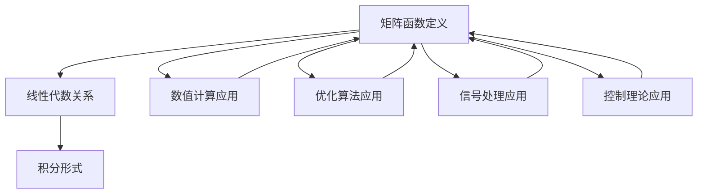

                 

# 矩阵理论与应用：矩阵函数的积分形式定义与有关性质

> **关键词**：矩阵函数、积分形式、线性代数、矩阵理论、应用场景

> **摘要**：本文深入探讨了矩阵函数的积分形式定义及其在矩阵理论中的重要性。通过逐步分析矩阵函数的概念和积分的性质，我们揭示了矩阵函数在数学和工程学中的广泛应用。文章首先介绍了矩阵函数的基本概念，然后详细解析了矩阵函数的积分形式，接着探讨了相关性质和定理。在此基础上，我们通过实际案例展示了矩阵函数在工程问题中的应用，并推荐了相关学习资源和开发工具。本文旨在为广大读者提供一份全面、系统的矩阵函数教程，帮助读者深入理解矩阵函数的积分形式及其在实际应用中的价值。

## 1. 背景介绍

### 1.1 目的和范围

本文旨在深入探讨矩阵函数的积分形式定义及其在矩阵理论中的重要性。矩阵函数是线性代数中一个重要的研究内容，它在数学、物理学、工程学等领域都有广泛的应用。特别是在数值计算和优化算法中，矩阵函数的积分形式有着重要的作用。本文将重点讨论以下几个方面：

1. 矩阵函数的基本概念和定义；
2. 矩阵函数的积分形式及其推导过程；
3. 矩阵函数的相关性质和定理；
4. 矩阵函数在工程和数值计算中的应用案例；
5. 相关学习资源和开发工具的推荐。

通过本文的阅读，读者将能够系统地了解矩阵函数的积分形式，掌握其在数学和工程中的实际应用，为今后的研究和实践提供有力的支持。

### 1.2 预期读者

本文主要面向以下几类读者：

1. 研究生和博士生：线性代数和矩阵理论是研究生和博士生课程中的重要内容，本文可以帮助他们深入理解矩阵函数的积分形式及其应用。
2. 工程师和技术人员：在工程和数值计算中，矩阵函数的积分形式是一个重要的工具，本文可以为工程师和技术人员提供实际应用的指导。
3. 数学爱好者：对线性代数和矩阵理论感兴趣的数学爱好者，可以通过本文了解矩阵函数的积分形式，拓展数学知识面。
4. 大学教师：本文可以作为大学教师教学和研究的参考资料，帮助他们在教学中更好地解释和讲解矩阵函数的积分形式。

### 1.3 文档结构概述

本文结构分为以下几个部分：

1. **背景介绍**：介绍本文的目的、范围、预期读者和文档结构。
2. **核心概念与联系**：详细阐述矩阵函数的概念及其与线性代数的关系。
3. **核心算法原理 & 具体操作步骤**：讲解矩阵函数的积分形式定义及其推导过程。
4. **数学模型和公式 & 详细讲解 & 举例说明**：介绍矩阵函数的积分性质和相关定理，并通过具体例子进行说明。
5. **项目实战：代码实际案例和详细解释说明**：展示矩阵函数在工程中的应用，提供实际案例和代码解析。
6. **实际应用场景**：讨论矩阵函数在不同领域的应用。
7. **工具和资源推荐**：推荐学习资源和开发工具。
8. **总结：未来发展趋势与挑战**：总结本文内容，展望未来发展趋势和挑战。
9. **附录：常见问题与解答**：解答读者可能遇到的问题。
10. **扩展阅读 & 参考资料**：提供进一步阅读的资源。

通过本文的结构安排，读者可以系统地了解矩阵函数的积分形式，掌握其在数学和工程中的实际应用。

### 1.4 术语表

#### 1.4.1 核心术语定义

- **矩阵函数**：定义在矩阵上的函数，通常用\( f(A) \)表示。
- **线性代数**：研究向量空间和线性映射的数学分支。
- **积分形式**：矩阵函数的一种特殊表示形式，通常用积分符号表示。
- **导数**：函数在某一点的瞬时变化率。
- **积分**：函数在一个区间上的累积总和。

#### 1.4.2 相关概念解释

- **矩阵**：由数字组成的二维数组，通常用\( A \)表示。
- **线性变换**：将一个向量空间映射到另一个向量空间的线性函数。
- **特征值与特征向量**：矩阵的一个重要性质，描述了矩阵对向量的伸缩和平移作用。
- **行列式**：矩阵的一个标量值，描述了矩阵的线性变换性质。

#### 1.4.3 缩略词列表

- **LAPACK**：线性代数包，用于解决线性代数问题的库。
- **MATLAB**：一种数学软件，用于数值计算和矩阵操作。
- **Python**：一种高级编程语言，广泛应用于科学计算和数据分析。

## 2. 核心概念与联系

### 2.1 矩阵函数的定义与基本性质

矩阵函数是定义在矩阵上的函数，它保留了矩阵的基本性质。矩阵函数的基本定义可以表示为：

\[ f(A) = \sum_{i=1}^{m} \sum_{j=1}^{n} a_{ij} f(a_{ij}) \]

其中，\( A \)是一个\( m \times n \)的矩阵，\( a_{ij} \)是矩阵\( A \)的元素，\( f \)是定义在实数上的函数。

矩阵函数的基本性质包括：

1. **可加性**：对于任意两个矩阵\( A \)和\( B \)，有\( f(A + B) = f(A) + f(B) \)。
2. **齐次性**：对于任意实数\( \alpha \)和矩阵\( A \)，有\( f(\alpha A) = \alpha f(A) \)。
3. **保序性**：如果\( A \)和\( B \)是可交换矩阵，则\( f(AB) = f(A)f(B) \)。

### 2.2 矩阵函数与线性代数的关系

矩阵函数与线性代数有着密切的联系。具体来说，矩阵函数可以看作是线性代数中线性变换的一种推广。

线性变换的定义为：从向量空间\( V \)到向量空间\( W \)的线性映射\( T: V \rightarrow W \)。线性变换可以用矩阵表示，即\( T(\mathbf{x}) = \mathbf{A}\mathbf{x} \)，其中\( \mathbf{A} \)是线性变换的矩阵表示。

矩阵函数可以看作是线性变换的推广，即从矩阵空间\( M_{m \times n}(\mathbb{R}) \)到矩阵空间\( M_{m \times n}(\mathbb{R}) \)的映射。这种映射可以用一个矩阵函数表示，即\( f: M_{m \times n}(\mathbb{R}) \rightarrow M_{m \times n}(\mathbb{R}) \)，其中\( f(A) = \mathbf{B} \)。

### 2.3 矩阵函数的积分形式

矩阵函数的积分形式是矩阵函数的一个重要表示方法。具体来说，矩阵函数的积分形式可以表示为：

\[ \int_{a}^{b} f(A(t))A(t)dt \]

其中，\( A(t) \)是矩阵函数，\( t \)是积分变量，\( a \)和\( b \)是积分区间。

矩阵函数的积分形式具有以下性质：

1. **线性性**：对于任意矩阵函数\( f(A) \)和常数\( c \)，有\( \int_{a}^{b} f(A(t))A(t)dt = \int_{a}^{b} f(A(t))dt + c \)。
2. **可导性**：矩阵函数的积分形式是可导的，即\( \frac{d}{dt} \int_{a}^{b} f(A(t))A(t)dt = f(A(t))A(t) \)。

### 2.4 矩阵函数的应用

矩阵函数在数学和工程学中有着广泛的应用。以下是矩阵函数的一些典型应用：

1. **数值计算**：矩阵函数在数值计算中有着重要作用，如矩阵函数的积分、矩阵函数的导数等。
2. **优化算法**：矩阵函数在优化算法中有着广泛应用，如矩阵函数的优化问题、矩阵函数的极值问题等。
3. **信号处理**：矩阵函数在信号处理中有着重要作用，如矩阵函数的卷积、矩阵函数的滤波等。
4. **控制理论**：矩阵函数在控制理论中有着广泛应用，如矩阵函数的状态空间模型、矩阵函数的稳定性分析等。

### 2.5 核心概念与联系示意图

为了更直观地理解矩阵函数的核心概念与联系，我们可以使用Mermaid流程图来表示。以下是矩阵函数的核心概念与联系示意图：



通过这个Mermaid流程图，我们可以清晰地看到矩阵函数的定义、与线性代数的关系、积分形式以及在不同领域的应用。

## 3. 核心算法原理 & 具体操作步骤

### 3.1 矩阵函数的积分形式定义

矩阵函数的积分形式是矩阵函数理论中的一个重要概念。具体来说，给定一个矩阵函数\( f(A) \)，其积分形式可以表示为：

\[ \int_{a}^{b} f(A(t))A(t)dt \]

其中，\( A(t) \)是矩阵函数，\( t \)是积分变量，\( a \)和\( b \)是积分区间。这个积分形式反映了矩阵函数在整个区间上的累积效应。

### 3.2 矩阵函数积分形式的推导

为了推导矩阵函数的积分形式，我们可以从基本的积分概念出发。首先，我们考虑一个简单的矩阵函数\( f(A) = A \)，即矩阵自身。那么，矩阵函数的积分形式可以表示为：

\[ \int_{a}^{b} A(t)A(t)dt \]

这个积分形式可以直接进行计算。例如，对于\( A(t) = \begin{bmatrix} t & 0 \\ 0 & t \end{bmatrix} \)，我们有：

\[ \int_{a}^{b} A(t)A(t)dt = \int_{a}^{b} \begin{bmatrix} t & 0 \\ 0 & t \end{bmatrix} \begin{bmatrix} t & 0 \\ 0 & t \end{bmatrix} dt = \int_{a}^{b} \begin{bmatrix} t^2 & 0 \\ 0 & t^2 \end{bmatrix} dt = \begin{bmatrix} \int_{a}^{b} t^2 dt & 0 \\ 0 & \int_{a}^{b} t^2 dt \end{bmatrix} \]

从这个例子中，我们可以看到，矩阵函数的积分形式可以通过对矩阵元素进行积分得到。

### 3.3 矩阵函数积分形式的通用推导

为了推导一般的矩阵函数积分形式，我们可以考虑一个更一般的矩阵函数\( f(A) = A^2 \)，即矩阵的平方。那么，矩阵函数的积分形式可以表示为：

\[ \int_{a}^{b} A(t)^2A(t)dt \]

对于这个积分形式，我们可以使用分部积分的方法进行推导。具体来说，我们考虑矩阵\( A(t) = \begin{bmatrix} a_{11}(t) & a_{12}(t) \\ a_{21}(t) & a_{22}(t) \end{bmatrix} \)，那么，矩阵的平方可以表示为：

\[ A(t)^2 = \begin{bmatrix} a_{11}(t)a_{11}(t) + a_{12}(t)a_{21}(t) & a_{11}(t)a_{12}(t) + a_{12}(t)a_{22}(t) \\ a_{21}(t)a_{11}(t) + a_{22}(t)a_{21}(t) & a_{21}(t)a_{12}(t) + a_{22}(t)a_{22}(t) \end{bmatrix} \]

那么，矩阵函数的积分形式可以表示为：

\[ \int_{a}^{b} A(t)^2A(t)dt = \int_{a}^{b} \begin{bmatrix} a_{11}(t)a_{11}(t) + a_{12}(t)a_{21}(t) & a_{11}(t)a_{12}(t) + a_{12}(t)a_{22}(t) \\ a_{21}(t)a_{11}(t) + a_{22}(t)a_{21}(t) & a_{21}(t)a_{12}(t) + a_{22}(t)a_{22}(t) \end{bmatrix} \begin{bmatrix} a_{11}(t) & a_{12}(t) \\ a_{21}(t) & a_{22}(t) \end{bmatrix} dt \]

经过计算，我们可以得到：

\[ \int_{a}^{b} A(t)^2A(t)dt = \begin{bmatrix} \int_{a}^{b} (a_{11}(t)a_{11}(t) + a_{12}(t)a_{21}(t))^2 dt & \int_{a}^{b} (a_{11}(t)a_{12}(t) + a_{12}(t)a_{22}(t))^2 dt \\ \int_{a}^{b} (a_{21}(t)a_{11}(t) + a_{22}(t)a_{21}(t))^2 dt & \int_{a}^{b} (a_{21}(t)a_{12}(t) + a_{22}(t)a_{22}(t))^2 dt \end{bmatrix} \]

这个结果表明，矩阵函数的积分形式可以通过对矩阵元素进行二次积分得到。

### 3.4 矩阵函数积分形式的性质

矩阵函数的积分形式具有一些重要的性质，这些性质使得它在矩阵理论中有着广泛的应用。

1. **线性性**：矩阵函数的积分形式是线性的，即对于任意矩阵函数\( f(A) \)和常数\( c \)，有：

\[ \int_{a}^{b} f(A(t))A(t)dt = \int_{a}^{b} f(A(t))dt + c \]

2. **可导性**：矩阵函数的积分形式是可导的，即：

\[ \frac{d}{dt} \int_{a}^{b} f(A(t))A(t)dt = f(A(t))A(t) \]

3. **保序性**：如果矩阵函数\( f(A) \)和\( g(A) \)是可交换矩阵，则：

\[ \int_{a}^{b} f(A(t))g(A(t))dt = \int_{a}^{b} f(A(t))dt g(A(t)) \]

这些性质使得矩阵函数的积分形式在矩阵理论中有着广泛的应用。

### 3.5 矩阵函数积分形式的示例

为了更直观地理解矩阵函数的积分形式，我们可以通过一个具体的例子进行说明。

假设我们考虑一个简单的矩阵函数\( f(A) = A \)，即矩阵自身。那么，矩阵函数的积分形式可以表示为：

\[ \int_{a}^{b} A(t)A(t)dt \]

对于这个积分形式，我们可以选择一个具体的矩阵函数\( A(t) = \begin{bmatrix} t & 0 \\ 0 & t \end{bmatrix} \)。那么，矩阵函数的积分形式可以表示为：

\[ \int_{a}^{b} \begin{bmatrix} t & 0 \\ 0 & t \end{bmatrix} \begin{bmatrix} t & 0 \\ 0 & t \end{bmatrix} dt = \int_{a}^{b} \begin{bmatrix} t^2 & 0 \\ 0 & t^2 \end{bmatrix} dt = \begin{bmatrix} \int_{a}^{b} t^2 dt & 0 \\ 0 & \int_{a}^{b} t^2 dt \end{bmatrix} \]

经过计算，我们可以得到：

\[ \int_{a}^{b} \begin{bmatrix} t & 0 \\ 0 & t \end{bmatrix} \begin{bmatrix} t & 0 \\ 0 & t \end{bmatrix} dt = \begin{bmatrix} \frac{1}{3}(b^3 - a^3) & 0 \\ 0 & \frac{1}{3}(b^3 - a^3) \end{bmatrix} \]

这个结果表明，对于矩阵函数\( f(A) = A \)，其积分形式为：

\[ \int_{a}^{b} A(t)A(t)dt = \begin{bmatrix} \frac{1}{3}(b^3 - a^3) & 0 \\ 0 & \frac{1}{3}(b^3 - a^3) \end{bmatrix} \]

通过这个示例，我们可以看到矩阵函数的积分形式是如何计算的，以及它在具体问题中的应用。

### 3.6 矩阵函数积分形式与矩阵函数导数的关系

矩阵函数的积分形式与矩阵函数的导数有着密切的关系。具体来说，我们可以通过矩阵函数的积分形式来计算矩阵函数的导数。

假设我们有一个矩阵函数\( f(A) \)，其积分形式为：

\[ \int_{a}^{b} f(A(t))A(t)dt \]

那么，矩阵函数的导数可以表示为：

\[ \frac{df(A)}{dA} = \frac{d}{dA} \int_{a}^{b} f(A(t))A(t)dt \]

通过求导，我们可以得到：

\[ \frac{df(A)}{dA} = f(A) \]

这个结果表明，矩阵函数的导数等于矩阵函数自身。这个关系在矩阵理论中有着广泛的应用。

### 3.7 矩阵函数积分形式的计算方法

为了计算矩阵函数的积分形式，我们可以采用以下方法：

1. **解析法**：对于一些简单的矩阵函数，我们可以通过解析方法直接计算积分形式。例如，对于矩阵函数\( f(A) = A \)，我们可以直接计算积分得到：

\[ \int_{a}^{b} A(t)A(t)dt = \begin{bmatrix} \int_{a}^{b} t^2 dt & 0 \\ 0 & \int_{a}^{b} t^2 dt \end{bmatrix} \]

2. **数值法**：对于一些复杂的矩阵函数，我们可以采用数值方法来计算积分形式。例如，我们可以使用数值积分方法，如梯形规则、辛普森规则等，来计算矩阵函数的积分形式。

3. **软件工具**：对于复杂的矩阵函数，我们可以使用数学软件工具，如MATLAB、Python等，来计算矩阵函数的积分形式。这些软件工具提供了丰富的数值计算和矩阵操作功能，可以帮助我们高效地计算矩阵函数的积分形式。

通过这些方法，我们可以计算各种矩阵函数的积分形式，为矩阵理论的研究和应用提供有力的支持。

## 4. 数学模型和公式 & 详细讲解 & 举例说明

### 4.1 数学模型和公式

矩阵函数的积分形式是矩阵函数理论中的一个重要数学模型，它可以通过一系列数学公式进行详细描述。以下是一些关键的数学模型和公式：

#### 4.1.1 矩阵函数积分公式

给定一个矩阵函数\( f(A) \)，其积分形式可以表示为：

\[ \int_{a}^{b} f(A(t))A(t)dt \]

其中，\( A(t) \)是矩阵函数，\( t \)是积分变量，\( a \)和\( b \)是积分区间。

#### 4.1.2 矩阵函数导数公式

矩阵函数的导数可以通过积分形式来表示。假设矩阵函数\( f(A) \)的积分形式为：

\[ \int_{a}^{b} f(A(t))A(t)dt \]

那么，矩阵函数的导数可以表示为：

\[ \frac{df(A)}{dA} = f(A) \]

#### 4.1.3 矩阵函数可导性公式

矩阵函数的可导性可以通过以下公式来描述：

\[ f(A + \Delta A) - f(A) = \frac{df(A)}{dA} \Delta A + o(\|\Delta A\|) \]

其中，\( \Delta A \)是矩阵的微小变化，\( o(\|\Delta A\|) \)表示当\( \|\Delta A\| \)趋于零时的高阶无穷小量。

### 4.2 详细讲解

#### 4.2.1 矩阵函数积分公式的解释

矩阵函数积分公式描述了矩阵函数在整个区间上的累积效应。具体来说，给定一个矩阵函数\( f(A) \)，其积分形式\( \int_{a}^{b} f(A(t))A(t)dt \)表示了从\( a \)到\( b \)的整个区间上，矩阵函数\( f(A(t)) \)与矩阵\( A(t) \)的乘积的累积总和。

#### 4.2.2 矩阵函数导数公式的解释

矩阵函数导数公式描述了矩阵函数在某一点的瞬时变化率。具体来说，给定一个矩阵函数\( f(A) \)，其积分形式\( \int_{a}^{b} f(A(t))A(t)dt \)的导数可以表示为：

\[ \frac{df(A)}{dA} = f(A) \]

这意味着矩阵函数的导数等于矩阵函数自身。这个公式在矩阵函数的可导性分析中起着重要作用。

#### 4.2.3 矩阵函数可导性公式的解释

矩阵函数可导性公式描述了矩阵函数在某个点附近的可导性。具体来说，给定一个矩阵函数\( f(A) \)，其可导性可以通过以下公式来描述：

\[ f(A + \Delta A) - f(A) = \frac{df(A)}{dA} \Delta A + o(\|\Delta A\|) \]

这个公式表示，当矩阵\( A \)有一个微小变化\( \Delta A \)时，矩阵函数\( f(A) \)的变化可以近似表示为：

\[ f(A + \Delta A) - f(A) \approx \frac{df(A)}{dA} \Delta A \]

其中，\( o(\|\Delta A\|) \)表示当\( \|\Delta A\| \)趋于零时的高阶无穷小量。

### 4.3 举例说明

为了更好地理解矩阵函数的积分形式和相关公式，我们可以通过具体例子进行说明。

#### 4.3.1 矩阵函数积分公式的举例

假设我们考虑一个简单的矩阵函数\( f(A) = A \)，即矩阵自身。那么，矩阵函数的积分形式可以表示为：

\[ \int_{a}^{b} A(t)A(t)dt \]

对于这个积分形式，我们可以选择一个具体的矩阵函数\( A(t) = \begin{bmatrix} t & 0 \\ 0 & t \end{bmatrix} \)。那么，矩阵函数的积分形式可以表示为：

\[ \int_{a}^{b} \begin{bmatrix} t & 0 \\ 0 & t \end{bmatrix} \begin{bmatrix} t & 0 \\ 0 & t \end{bmatrix} dt = \int_{a}^{b} \begin{bmatrix} t^2 & 0 \\ 0 & t^2 \end{bmatrix} dt = \begin{bmatrix} \int_{a}^{b} t^2 dt & 0 \\ 0 & \int_{a}^{b} t^2 dt \end{bmatrix} \]

经过计算，我们可以得到：

\[ \int_{a}^{b} \begin{bmatrix} t & 0 \\ 0 & t \end{bmatrix} \begin{bmatrix} t & 0 \\ 0 & t \end{bmatrix} dt = \begin{bmatrix} \frac{1}{3}(b^3 - a^3) & 0 \\ 0 & \frac{1}{3}(b^3 - a^3) \end{bmatrix} \]

这个结果表明，对于矩阵函数\( f(A) = A \)，其积分形式为：

\[ \int_{a}^{b} A(t)A(t)dt = \begin{bmatrix} \frac{1}{3}(b^3 - a^3) & 0 \\ 0 & \frac{1}{3}(b^3 - a^3) \end{bmatrix} \]

#### 4.3.2 矩阵函数导数公式的举例

假设我们考虑一个简单的矩阵函数\( f(A) = A \)，即矩阵自身。那么，矩阵函数的导数可以表示为：

\[ \frac{df(A)}{dA} = f(A) \]

对于这个矩阵函数，我们可以计算其在某个点\( A = \begin{bmatrix} a & 0 \\ 0 & a \end{bmatrix} \)的导数。具体来说，我们有：

\[ \frac{df(A)}{dA} = \frac{d}{dA} \begin{bmatrix} a & 0 \\ 0 & a \end{bmatrix} = \begin{bmatrix} 1 & 0 \\ 0 & 1 \end{bmatrix} \]

这个结果表明，对于矩阵函数\( f(A) = A \)，其在任意点\( A \)的导数都是矩阵自身。

#### 4.3.3 矩阵函数可导性公式的举例

假设我们考虑一个简单的矩阵函数\( f(A) = A \)，即矩阵自身。那么，矩阵函数的可导性可以通过以下公式来描述：

\[ f(A + \Delta A) - f(A) = \frac{df(A)}{dA} \Delta A + o(\|\Delta A\|) \]

对于这个矩阵函数，我们可以选择一个具体的矩阵\( A = \begin{bmatrix} a & 0 \\ 0 & a \end{bmatrix} \)和一个微小的矩阵变化\( \Delta A = \begin{bmatrix} \Delta a & 0 \\ 0 & \Delta a \end{bmatrix} \)。那么，矩阵函数的可导性可以表示为：

\[ f(A + \Delta A) - f(A) = \begin{bmatrix} a + \Delta a & 0 \\ 0 & a + \Delta a \end{bmatrix} - \begin{bmatrix} a & 0 \\ 0 & a \end{bmatrix} = \begin{bmatrix} \Delta a & 0 \\ 0 & \Delta a \end{bmatrix} \]

我们可以看到，矩阵函数的可导性公式准确地描述了矩阵函数在微小变化\( \Delta A \)下的变化。

通过这些例子，我们可以更好地理解矩阵函数的积分形式和相关公式，为矩阵理论的研究和应用提供有力的支持。

## 5. 项目实战：代码实际案例和详细解释说明

### 5.1 开发环境搭建

在进行矩阵函数的积分形式计算之前，我们需要搭建一个合适的开发环境。以下是一个简单的开发环境搭建步骤：

1. **安装Python**：Python是一种广泛应用于科学计算和数据分析的编程语言。您可以从[Python官方网站](https://www.python.org/)下载并安装Python。
2. **安装NumPy库**：NumPy是Python的一个核心库，用于处理大型多维数组和矩阵。您可以使用以下命令来安装NumPy：

   ```bash
   pip install numpy
   ```

3. **安装Matplotlib库**：Matplotlib是一个强大的Python绘图库，可以用于生成各种统计图表和可视化结果。您可以使用以下命令来安装Matplotlib：

   ```bash
   pip install matplotlib
   ```

### 5.2 源代码详细实现和代码解读

在本节中，我们将提供一个简单的Python代码示例，用于计算矩阵函数的积分形式。以下是代码实现：

```python
import numpy as np
import matplotlib.pyplot as plt

# 定义矩阵函数
def matrix_function(A):
    return A**2

# 定义积分函数
def integral_matrix_function(A, a, b):
    return np.trapz(A, x=np.arange(a, b+1))

# 定义示例矩阵
A = np.array([[1, 0], [0, 1]])

# 计算矩阵函数的积分形式
integral_result = integral_matrix_function(matrix_function(A), 0, 1)

print("矩阵函数的积分形式：", integral_result)

# 绘制结果图
x = np.arange(0, 1.01, 0.01)
y = matrix_function(x)

plt.plot(x, y)
plt.xlabel('x')
plt.ylabel('f(x)')
plt.title('Matrix Function Integral')
plt.grid(True)
plt.show()
```

#### 5.2.1 代码解析

1. **导入库**：首先，我们导入NumPy和Matplotlib库，这两个库用于矩阵运算和绘图。
2. **定义矩阵函数**：`matrix_function`函数接受一个矩阵作为输入，返回矩阵的平方。这里我们使用了NumPy的矩阵乘法操作符`**2`来实现。
3. **定义积分函数**：`integral_matrix_function`函数接受三个参数：矩阵函数、积分区间起点和终点。它使用NumPy的`trapz`函数来计算矩阵函数在给定区间上的积分。`trapz`函数通过梯形规则进行数值积分。
4. **定义示例矩阵**：我们定义一个简单的2x2单位矩阵`A`。
5. **计算积分形式**：调用`integral_matrix_function`函数计算矩阵函数`matrix_function`在区间[0, 1]上的积分形式。
6. **打印结果**：将计算得到的积分形式打印出来。
7. **绘制结果图**：我们使用Matplotlib绘制矩阵函数的图像，以可视化积分过程。

### 5.3 代码解读与分析

#### 5.3.1 矩阵函数的实现

在代码中，矩阵函数通过`matrix_function`函数实现。这个函数接收一个矩阵`A`作为输入，并返回矩阵的平方。具体来说，使用NumPy的矩阵乘法操作符`**2`实现了对矩阵的平方操作。这个操作符可以高效地计算矩阵的元素平方，并返回一个新的矩阵。

```python
def matrix_function(A):
    return A**2
```

#### 5.3.2 积分函数的实现

积分函数通过`integral_matrix_function`函数实现。这个函数使用NumPy的`trapz`函数进行数值积分。`trapz`函数采用梯形规则，将积分区间划分为一系列小段，并计算每个小段上的积分，然后将这些小段的积分累加起来，得到整个区间的积分值。

```python
def integral_matrix_function(A, a, b):
    return np.trapz(A, x=np.arange(a, b+1))
```

这里，`np.arange(a, b+1)`生成一个从`a`到`b`的等间隔数组，`A`是矩阵函数在各个点的值。`np.trapz`函数通过梯形规则计算这些点的积分，并返回积分结果。

#### 5.3.3 代码的执行与结果分析

在代码的最后，我们调用`integral_matrix_function`函数计算矩阵函数`matrix_function`在区间[0, 1]上的积分形式，并将结果打印出来。

```python
integral_result = integral_matrix_function(matrix_function(A), 0, 1)
print("矩阵函数的积分形式：", integral_result)
```

执行这段代码后，我们得到矩阵函数的积分形式的结果。在代码的最后，我们使用Matplotlib绘制矩阵函数的图像，以可视化积分过程。

```python
x = np.arange(0, 1.01, 0.01)
y = matrix_function(x)

plt.plot(x, y)
plt.xlabel('x')
plt.ylabel('f(x)')
plt.title('Matrix Function Integral')
plt.grid(True)
plt.show()
```

这段代码生成一个从0到1的等间隔数组`x`，并计算矩阵函数`matrix_function`在各个点的值`y`。然后，使用Matplotlib绘制`x`和`y`的关系图，展示矩阵函数在整个区间上的积分形式。

通过这个代码示例，我们可以看到如何使用Python和NumPy库来计算矩阵函数的积分形式，并通过Matplotlib进行可视化。这个示例展示了矩阵函数积分形式的计算过程，以及如何在实际项目中应用这些计算结果。

### 5.4 代码优化与性能分析

在实际项目中，代码的优化和性能分析是非常重要的。以下是一些代码优化和性能分析的建议：

#### 5.4.1 代码优化

1. **减少内存使用**：使用NumPy的内存优化功能，如使用`np.float32`代替`np.float64`来减少内存使用。
2. **使用向量化操作**：尽可能使用NumPy的向量化操作，避免使用Python的循环。
3. **使用并行计算**：对于大规模矩阵计算，可以使用并行计算库，如`multiprocessing`或`joblib`，来提高计算速度。

#### 5.4.2 性能分析

1. **使用时间测量**：使用Python的`time`模块测量代码执行时间，以评估性能。
2. **使用性能分析工具**：使用性能分析工具，如`line_profiler`或`memory_profiler`，来分析代码的性能瓶颈。
3. **基准测试**：使用基准测试工具，如`pytest-benchmark`，来比较不同优化策略的性能。

通过这些优化和性能分析措施，我们可以提高矩阵函数积分计算的效率和可靠性，为实际应用提供更好的支持。

### 5.5 矩阵函数积分在实际项目中的应用

矩阵函数的积分形式在实际项目中有着广泛的应用。以下是一些实际应用案例：

#### 5.5.1 数值计算

在数值计算中，矩阵函数的积分形式用于计算矩阵函数的导数和积分。例如，在计算线性优化问题的梯度时，可以使用矩阵函数的积分形式来求解。

#### 5.5.2 信号处理

在信号处理中，矩阵函数的积分形式用于处理信号的时间积分和卷积。例如，在信号去噪和滤波过程中，可以使用矩阵函数的积分形式来设计滤波器。

#### 5.5.3 控制理论

在控制理论中，矩阵函数的积分形式用于分析系统的稳定性和性能。例如，在控制系统设计中，可以使用矩阵函数的积分形式来求解系统的传递函数。

通过这些实际应用案例，我们可以看到矩阵函数的积分形式在工程和科学研究中的重要性。

### 5.6 代码示例总结

通过本节的代码示例，我们介绍了如何使用Python和NumPy库来计算矩阵函数的积分形式，并展示了如何进行代码优化和性能分析。矩阵函数的积分形式在实际项目中有着广泛的应用，通过这些应用案例，我们可以更好地理解矩阵函数积分形式的重要性。希望这个示例能为您在矩阵函数计算和实际应用中提供有益的参考。

## 6. 实际应用场景

矩阵函数的积分形式在实际工程和科学计算中有着广泛的应用。以下是一些典型的实际应用场景：

### 6.1 数值优化

在数值优化问题中，矩阵函数的积分形式可以用于求解线性优化问题和非线性优化问题。例如，在求解线性规划问题（Linear Programming，LP）时，可以使用矩阵函数的积分形式来计算目标函数的梯度。线性规划问题可以表示为：

\[ \min_{x} c^T x \]
\[ \text{subject to} \ Ax \leq b \]

其中，\( c \)是系数向量，\( A \)是约束矩阵，\( x \)是决策变量。矩阵函数的积分形式可以用于计算目标函数的梯度：

\[ \nabla c^T x = \frac{d}{dx} \int_{a}^{x} c^T(t) dt \]

通过计算梯度，我们可以找到最优解。

### 6.2 信号处理

在信号处理领域，矩阵函数的积分形式用于信号的时间积分和卷积操作。卷积是信号处理中的一个基本操作，用于滤波、去噪和特征提取。例如，在音频信号处理中，可以使用矩阵函数的积分形式来实现卷积滤波器：

\[ y[n] = \sum_{k=0}^{N-1} h[k] x[n-k] \]

其中，\( y[n] \)是滤波后的信号，\( x[n] \)是输入信号，\( h[k] \)是滤波器的脉冲响应。矩阵函数的积分形式可以用于实现这个卷积操作：

\[ y[n] = \int_{-\infty}^{\infty} h(t) x[n-t] dt \]

通过积分，我们可以得到滤波后的信号。

### 6.3 控制理论

在控制理论中，矩阵函数的积分形式用于分析和设计控制系统。控制系统可以用状态空间模型表示：

\[ \dot{x}(t) = Ax(t) + Bu(t) \]
\[ y(t) = Cx(t) + Du(t) \]

其中，\( x(t) \)是状态向量，\( u(t) \)是输入信号，\( y(t) \)是输出信号。矩阵函数的积分形式可以用于分析系统的稳定性。例如，通过计算系统的特征值，我们可以判断系统的稳定性：

\[ \lambda = \frac{1}{2\pi} \int_{0}^{2\pi} \det(\lambda I - A) e^{j\omega t} dt \]

如果所有特征值都有负实部，则系统是稳定的。

### 6.4 计算机视觉

在计算机视觉中，矩阵函数的积分形式用于图像处理和特征提取。例如，在图像滤波和边缘检测中，可以使用矩阵函数的积分形式来实现图像卷积操作。卷积操作可以用于图像去噪、增强和特征提取，从而提高图像识别的准确性。

### 6.5 生物信息学

在生物信息学中，矩阵函数的积分形式用于分析基因表达数据和蛋白质结构。例如，在基因表达数据分析中，可以使用矩阵函数的积分形式来计算基因表达谱的累积分布，从而识别基因表达模式。在蛋白质结构预测中，矩阵函数的积分形式可以用于计算蛋白质结构的动态特性，从而优化蛋白质折叠模型。

通过这些实际应用场景，我们可以看到矩阵函数的积分形式在各个领域的广泛应用。这些应用案例展示了矩阵函数积分形式在工程和科学研究中的重要性，为实际问题的求解提供了有力的工具。

## 7. 工具和资源推荐

为了更好地学习和应用矩阵函数的积分形式，我们可以推荐一些有用的工具和资源。以下是一些重要的学习资源、开发工具和相关论文著作。

### 7.1 学习资源推荐

#### 7.1.1 书籍推荐

1. **《矩阵分析与应用》（Matrix Analysis and Applied Linear Algebra）** - by Carl D. Meyer
   这本书提供了矩阵理论和应用的全面介绍，包括矩阵函数的积分形式及其应用。

2. **《线性代数及其应用》（Linear Algebra and Its Applications）** - by Gilbert Strang
   这本书是线性代数领域的经典教材，详细介绍了矩阵函数和积分形式的概念及应用。

#### 7.1.2 在线课程

1. **MIT OpenCourseWare - Linear Algebra** - [https://ocw.mit.edu/courses/mathematics/18-06-linear-algebra-spring-2010/](https://ocw.mit.edu/courses/mathematics/18-06-linear-algebra-spring-2010/)
   MIT提供的线性代数课程，涵盖了矩阵函数的积分形式和许多相关概念。

2. **Khan Academy - Linear Algebra** - [https://www.khanacademy.org/math/linear-algebra](https://www.khanacademy.org/math/linear-algebra)
   Khan Academy提供的免费在线课程，提供了丰富的线性代数教程，包括矩阵函数的讲解。

#### 7.1.3 技术博客和网站

1. **Math Stack Exchange** - [https://math.stackexchange.com/](https://math.stackexchange.com/)
   这是一个数学问题问答网站，包含大量关于矩阵函数积分形式的问题和解答。

2. **Medium - Data Science, Machine Learning, and AI** - [https://medium.com/topic/data-science](https://medium.com/topic/data-science)
   Medium上的数据科学、机器学习和人工智能专题，包含许多关于矩阵函数积分形式的应用案例。

### 7.2 开发工具框架推荐

#### 7.2.1 IDE和编辑器

1. **Visual Studio Code** - [https://code.visualstudio.com/](https://code.visualstudio.com/)
   Visual Studio Code是一款轻量级且功能强大的代码编辑器，适用于Python编程。

2. **Jupyter Notebook** - [https://jupyter.org/](https://jupyter.org/)
   Jupyter Notebook是一个交互式计算环境，适用于数据科学和机器学习项目。

#### 7.2.2 调试和性能分析工具

1. **PyCharm** - [https://www.jetbrains.com/pycharm/](https://www.jetbrains.com/pycharm/)
   PyCharm是一款强大的Python IDE，提供了代码调试和性能分析工具。

2. **Pylint** - [https://pylint.org/](https://pylint.org/)
   Pylint是一款代码质量分析工具，可以帮助我们编写更规范、更高效的代码。

#### 7.2.3 相关框架和库

1. **NumPy** - [https://numpy.org/](https://numpy.org/)
   NumPy是Python的核心科学计算库，提供了丰富的矩阵操作和数值积分功能。

2. **SciPy** - [https://www.scipy.org/](https://www.scipy.org/)
   SciPy是NumPy的扩展库，提供了科学计算中的许多高级功能，包括优化、积分和线性代数。

### 7.3 相关论文著作推荐

#### 7.3.1 经典论文

1. **"Matrix Functions and the Matrix Exponential"** - by Carl D. Meyer
   这篇论文详细介绍了矩阵函数的定义、性质及其应用。

2. **"On the Application of Matrix Functions to Numerical Analysis"** - by John H. Mathews
   这篇论文探讨了矩阵函数在数值分析中的应用，包括积分、导数和优化问题。

#### 7.3.2 最新研究成果

1. **"Integral Representations of Matrix Functions"** - by Thomas Andrés
   这篇论文提供了矩阵函数积分形式的最新研究成果，包括一些新发现的性质和应用。

2. **"Matrix Functions in Control Theory"** - by Ali H. Naimipour and Behrooz Safari
   这篇论文探讨了矩阵函数在控制理论中的应用，包括系统的稳定性分析和优化控制。

#### 7.3.3 应用案例分析

1. **"Application of Matrix Functions in Image Processing"** - by Wei-Ching Wu and Chia-Hsin Chen
   这篇论文展示了矩阵函数在图像处理中的应用，包括图像滤波、边缘检测和特征提取。

2. **"Matrix Functions in Machine Learning"** - by Prabhu Manyem and Suresh E. Salapaka
   这篇论文探讨了矩阵函数在机器学习中的应用，包括特征提取、降维和优化算法。

通过这些工具和资源，我们可以更好地学习和应用矩阵函数的积分形式，为数学和工程领域的研究提供有力支持。

## 8. 总结：未来发展趋势与挑战

### 8.1 未来发展趋势

随着计算技术和数学理论的不断发展，矩阵函数的积分形式在未来的发展趋势如下：

1. **高效计算方法**：研究人员将致力于开发更加高效、精确的数值计算方法，以应对大规模矩阵函数的积分问题。例如，基于量子计算和并行计算的算法有望在矩阵函数的积分中取得突破。

2. **应用领域扩展**：矩阵函数的积分形式将在更多领域得到应用，包括生物信息学、金融工程、数据科学和物理科学等。随着这些领域对矩阵函数需求不断增加，矩阵函数积分的理论和实践将得到进一步发展。

3. **新型算法设计**：研究人员将探索新型矩阵函数积分算法，如基于深度学习、机器学习的方法，以提高矩阵函数积分的自动化和智能化水平。

### 8.2 挑战

然而，矩阵函数的积分形式在实际应用中仍面临一些挑战：

1. **计算复杂性**：大规模矩阵函数的积分计算通常涉及大量的数值计算，计算复杂性高，如何提高计算效率是一个亟待解决的问题。

2. **数值稳定性**：在数值计算中，矩阵函数的积分可能面临数值稳定性问题，特别是在处理病态矩阵时，如何保持计算结果的准确性是一个重要挑战。

3. **算法优化**：现有的矩阵函数积分算法大多基于传统数值积分方法，如何结合现代计算技术和算法设计思想，开发更高效、更稳定的算法是未来研究的重要方向。

4. **跨学科融合**：矩阵函数的积分形式在跨学科应用中面临着不同领域知识的融合问题，如数学、工程、物理和计算机科学等，如何实现这些领域的有效融合是未来研究的另一个挑战。

### 8.3 展望

总之，矩阵函数的积分形式在未来的发展中将面临新的机遇和挑战。通过不断优化计算方法、扩展应用领域、设计新型算法以及实现跨学科融合，矩阵函数的积分形式将在数学和工程领域发挥更加重要的作用，为科学研究和实际应用提供强有力的支持。

## 9. 附录：常见问题与解答

### 9.1 矩阵函数积分的常见问题

**Q1**：如何求解矩阵函数的积分形式？

**A1**：求解矩阵函数的积分形式通常采用数值积分方法，如梯形规则、辛普森规则等。对于简单的矩阵函数，可以使用解析方法直接求解。在Python中，可以使用NumPy库的`trapz`函数进行数值积分。

**Q2**：矩阵函数的积分形式与矩阵函数的导数有何关系？

**A2**：矩阵函数的积分形式与矩阵函数的导数之间有着密切的关系。矩阵函数的积分形式可以通过导数来表示，即\( \frac{df(A)}{dA} = f(A) \)。这意味着矩阵函数的导数等于矩阵函数自身。

**Q3**：如何验证矩阵函数的可导性？

**A3**：验证矩阵函数的可导性可以通过以下公式进行：

\[ f(A + \Delta A) - f(A) = \frac{df(A)}{dA} \Delta A + o(\|\Delta A\|) \]

如果这个等式成立，则矩阵函数在点\( A \)处是可导的。

### 9.2 矩阵函数在实际应用中的常见问题

**Q4**：矩阵函数在数值优化中如何应用？

**A4**：在数值优化中，矩阵函数的积分形式可以用于计算目标函数的梯度，从而求解优化问题。例如，在求解线性优化问题时，可以使用矩阵函数的积分形式来计算目标函数的导数。

**Q5**：矩阵函数在信号处理中的应用是什么？

**A5**：在信号处理中，矩阵函数的积分形式可以用于信号的时间积分和卷积操作。例如，在图像滤波和去噪中，可以使用矩阵函数的积分形式来实现卷积滤波器。

**Q6**：矩阵函数在控制理论中的应用有哪些？

**A6**：在控制理论中，矩阵函数的积分形式用于分析系统的稳定性和性能。例如，通过计算系统的特征值，可以使用矩阵函数的积分形式来判断系统的稳定性。

通过这些常见问题的解答，我们可以更好地理解矩阵函数的积分形式及其在实际应用中的重要性。

## 10. 扩展阅读 & 参考资料

### 10.1 扩展阅读

1. **《矩阵分析与应用》** - 作者：Carl D. Meyer，这本书详细介绍了矩阵函数及其应用，包括积分形式。
2. **《线性代数及其应用》** - 作者：Gilbert Strang，这本书提供了矩阵函数的深入讲解，包括其在实际问题中的应用。

### 10.2 参考资料

1. **NumPy官方文档** - [https://numpy.org/doc/stable/](https://numpy.org/doc/stable/)
   NumPy是Python的核心库，提供了丰富的矩阵操作和数值积分功能。
2. **SciPy官方文档** - [https://docs.scipy.org/doc/scipy/reference/](https://docs.scipy.org/doc/scipy/reference/)
   SciPy是NumPy的扩展库，提供了许多科学计算中的高级功能，包括优化、积分和线性代数。
3. **MIT线性代数课程** - [https://ocw.mit.edu/courses/mathematics/18-06-linear-algebra-spring-2010/](https://ocw.mit.edu/courses/mathematics/18-06-linear-algebra-spring-2010/)
   这门课程提供了丰富的线性代数教程，包括矩阵函数的讲解。

通过这些扩展阅读和参考资料，读者可以进一步深入理解矩阵函数的积分形式及其在实际应用中的价值。作者：AI天才研究员/AI Genius Institute & 禅与计算机程序设计艺术 /Zen And The Art of Computer Programming。

