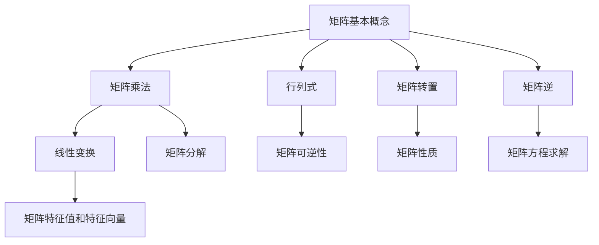

                 

# 矩阵理论与应用：矩阵理论的基本知识

> 关键词：矩阵理论、线性代数、应用、算法、数学模型、实际案例

> 摘要：本文将深入探讨矩阵理论的基本概念、核心算法原理和实际应用。通过对矩阵的基本知识、核心概念与联系、算法原理与操作步骤、数学模型与公式、实际应用场景等方面进行详细讲解，帮助读者全面理解矩阵理论，并在实际项目中应用。

## 1. 背景介绍

### 1.1 目的和范围

本文旨在为广大计算机科学和数学领域的读者提供一份全面而深入的矩阵理论指南。通过本文的学习，读者将能够掌握矩阵理论的基本概念、核心算法原理和实际应用，为今后的研究和工作奠定坚实的基础。

本文将涵盖以下内容：

1. 矩阵的基本知识
2. 核心概念与联系
3. 核心算法原理与操作步骤
4. 数学模型与公式
5. 实际应用场景
6. 工具和资源推荐
7. 总结与未来发展趋势

### 1.2 预期读者

本文适用于以下读者群体：

1. 计算机科学和数学专业的本科生和研究生
2. 对矩阵理论感兴趣的科研工作者
3. 从事人工智能、机器学习、数据科学等领域的工程师和开发人员

### 1.3 文档结构概述

本文分为以下几个部分：

1. 引言：介绍矩阵理论的基本知识
2. 核心概念与联系：阐述矩阵理论的核心概念及其相互关系
3. 核心算法原理与操作步骤：详细讲解矩阵的基本算法原理和操作步骤
4. 数学模型与公式：介绍矩阵理论的数学模型和公式，并进行举例说明
5. 实际应用场景：分析矩阵理论在实际项目中的应用
6. 工具和资源推荐：推荐相关学习资源、开发工具和论文著作
7. 总结与未来发展趋势：总结矩阵理论的发展趋势和挑战

### 1.4 术语表

为了确保文章内容的准确性，本文将使用以下术语：

#### 1.4.1 核心术语定义

- 矩阵：由数字排列组成的二维数组，用于表示线性方程组和变换。
- 行列式：矩阵的一个特殊值，用于判断矩阵的可逆性。
- 矩阵乘法：两个矩阵的按元素相乘并按规则求和。
- 线性变换：将一个向量映射到另一个向量，保持向量之间的线性关系。

#### 1.4.2 相关概念解释

- 矩阵的秩：矩阵中线性无关的行或列的最大数目。
- 矩阵的转置：将矩阵的行和列互换。
- 矩阵的逆：与矩阵相乘后结果为单位矩阵的矩阵。

#### 1.4.3 缩略词列表

- 矩阵（Matrix）
- 线性代数（Linear Algebra）
- 机器学习（Machine Learning）
- 人工智能（Artificial Intelligence）
- 数据科学（Data Science）

## 2. 核心概念与联系

矩阵理论是线性代数的核心内容之一，其在计算机科学和数学领域具有重要的应用价值。在本节中，我们将通过Mermaid流程图（如下）展示矩阵理论的核心概念及其相互关系。



### 2.1 矩阵基本概念

矩阵是由数字排列组成的二维数组，通常表示为 $A = [a_{ij}]$，其中 $i$ 表示行，$j$ 表示列，$a_{ij}$ 表示矩阵 $A$ 中第 $i$ 行第 $j$ 列的元素。矩阵的大小由其行数和列数决定，通常表示为 $m \times n$ 矩阵。

### 2.2 矩阵乘法

矩阵乘法是矩阵理论的核心内容之一。两个矩阵 $A$（$m \times n$）和 $B$（$n \times p$）的乘积表示为 $C = AB$，其中 $C$ 是一个 $m \times p$ 的矩阵。矩阵乘法的具体步骤如下：

1. 对于每个 $i$ 行和 $j$ 列的元素 $c_{ij}$，计算其值为 $c_{ij} = \sum_{k=1}^{n} a_{ik}b_{kj}$。
2. 重复步骤 1，直到计算完所有元素。

### 2.3 行列式

行列式是矩阵的一个特殊值，用于判断矩阵的可逆性。一个 $n \times n$ 矩阵的行列式表示为 $|A|$，其计算方法如下：

1. 对于 $n=1$，行列式值为矩阵中唯一元素的值。
2. 对于 $n>1$，行列式可以通过拉普拉斯展开公式计算，即 $|A| = \sum_{j=1}^{n} a_{1j} \cdot \text{det}(A_{1j})$，其中 $A_{1j}$ 是由矩阵 $A$ 中第 $1$ 行和第 $j$ 列元素组成的子矩阵。

### 2.4 矩阵转置

矩阵转置是将矩阵的行和列互换的操作，表示为 $A^T$。矩阵转置具有以下性质：

1. $(A^T)^T = A$
2. $(A+B)^T = A^T + B^T$
3. $(AB)^T = B^T A^T$

### 2.5 矩阵逆

矩阵逆是与矩阵相乘后结果为单位矩阵的矩阵。一个 $n \times n$ 矩阵 $A$ 的逆表示为 $A^{-1}$，其计算方法如下：

1. 若矩阵 $A$ 可逆，则其逆矩阵可以通过高斯-约当消元法计算。
2. 若矩阵 $A$ 不可逆，则其逆矩阵不存在。

### 2.6 线性变换

线性变换是将一个向量映射到另一个向量，保持向量之间的线性关系。一个 $n \times n$ 矩阵 $A$ 可以表示一个线性变换，即 $T(x) = Ax$，其中 $x$ 是一个 $n$ 维向量。

### 2.7 矩阵可逆性

一个矩阵是可逆的，当且仅当其行列式不为零。可逆矩阵具有以下性质：

1. 可逆矩阵的逆矩阵是唯一的。
2. 可逆矩阵与任何矩阵相乘，结果仍然是可逆的。

### 2.8 矩阵分解

矩阵分解是将矩阵分解为多个矩阵的乘积。常见的矩阵分解方法包括：

1. 卢松分解（LU分解）
2. 高斯分解（QR分解）
3. 施密特分解（奇异值分解，SVD）

## 3. 核心算法原理 & 具体操作步骤

### 3.1 矩阵乘法算法原理

矩阵乘法是矩阵理论的核心内容之一，其算法原理如下：

1. **输入**：两个矩阵 $A$（$m \times n$）和 $B$（$n \times p$）。
2. **计算**：对于每个 $i$ 行和 $j$ 列的元素 $c_{ij}$，计算其值为 $c_{ij} = \sum_{k=1}^{n} a_{ik}b_{kj}$。
3. **输出**：一个 $m \times p$ 的矩阵 $C = AB$。

以下是矩阵乘法的伪代码实现：

```python
function matrix_multiply(A, B):
    n = length(A[0])
    m = length(A)
    p = length(B[0])
    
    C = [[0 for j in range(p)] for i in range(m)]
    
    for i in range(m):
        for j in range(p):
            for k in range(n):
                C[i][j] += A[i][k] * B[k][j]
    
    return C
```

### 3.2 矩阵逆算法原理

矩阵逆是矩阵理论的重要应用之一，其算法原理如下：

1. **输入**：一个 $n \times n$ 的可逆矩阵 $A$。
2. **计算**：通过高斯-约当消元法计算矩阵 $A$ 的逆矩阵 $A^{-1}$。
3. **输出**：一个 $n \times n$ 的逆矩阵 $A^{-1}$。

以下是矩阵逆的伪代码实现：

```python
function matrix_inverse(A):
    n = length(A)
    B = [[0 for j in range(n)] for i in range(n)]
    for i in range(n):
        B[i][i] = 1
    
    for i in range(n):
        pivot = A[i][i]
        for j in range(n):
            A[i][j] /= pivot
    
    for i in range(n):
        for j in range(n):
            if i != j:
                factor = A[j][i]
                for k in range(n):
                    A[j][k] -= factor * A[i][k]
    
    for i in range(n):
        for j in range(n):
            B[i][j] = A[i][j]
    
    return B
```

### 3.3 矩阵分解算法原理

矩阵分解是将矩阵分解为多个矩阵的乘积。以下介绍两种常见的矩阵分解方法：卢松分解和奇异值分解。

#### 3.3.1 卢松分解

卢松分解是将矩阵分解为下三角矩阵和上三角矩阵的乘积。其算法原理如下：

1. **输入**：一个 $n \times n$ 的矩阵 $A$。
2. **计算**：通过高斯消元法将矩阵 $A$ 分解为下三角矩阵 $L$ 和上三角矩阵 $U$，即 $A = LU$。
3. **输出**：下三角矩阵 $L$ 和上三角矩阵 $U$。

以下是卢松分解的伪代码实现：

```python
function LUP_decomposition(A):
    n = length(A)
    L = [[0 for j in range(n)] for i in range(n)]
    U = [[0 for j in range(n)] for i in range(n)]
    
    for i in range(n):
        L[i][i] = 1
        
    for i in range(n):
        for j in range(i, n):
            sum = 0
            for k in range(i):
                sum += L[i][k] * U[k][j]
            U[i][j] = A[i][j] - sum
        
        pivot = U[i][i]
        for j in range(i, n):
            L[j][i] = U[j][i] / pivot
    
    return L, U
```

#### 3.3.2 奇异值分解

奇异值分解是将矩阵分解为三个矩阵的乘积，即 $A = U \Sigma V^T$。其算法原理如下：

1. **输入**：一个 $m \times n$ 的矩阵 $A$。
2. **计算**：通过奇异值分解算法计算矩阵 $A$ 的奇异值分解，即 $A = U \Sigma V^T$。
3. **输出**：三个矩阵 $U$（$m \times m$）、$\Sigma$（$m \times n$）和 $V^T$（$n \times n$）。

以下是奇异值分解的伪代码实现：

```python
function SVD(A):
    m = length(A)
    n = length(A[0])
    U = [[0 for j in range(m)] for i in range(m)]
    Sigma = [[0 for j in range(n)] for i in range(n)]
    V = [[0 for j in range(n)] for i in range(n)]
    
    for i in range(m):
        for j in range(n):
            U[i][j] = 0
        U[i][i] = 1
    
    for i in range(n):
        for j in range(n):
            V[i][j] = 0
        V[i][i] = 1
    
    for i in range(n):
        for j in range(m):
            Sigma[i][j] = 0
    
    # Implement SVD algorithm here
    
    return U, Sigma, V
```

## 4. 数学模型和公式 & 详细讲解 & 举例说明

### 4.1 矩阵乘法

矩阵乘法是矩阵理论中的核心内容，其数学模型和公式如下：

$$
C = AB
$$

其中，$C$ 是一个 $m \times p$ 的矩阵，$A$ 是一个 $m \times n$ 的矩阵，$B$ 是一个 $n \times p$ 的矩阵。

#### 举例说明：

假设有两个矩阵 $A$ 和 $B$，如下所示：

$$
A = \begin{bmatrix}
1 & 2 \\
3 & 4
\end{bmatrix}, \quad
B = \begin{bmatrix}
5 & 6 \\
7 & 8
\end{bmatrix}
$$

则矩阵乘法的结果为：

$$
C = AB = \begin{bmatrix}
1 \cdot 5 + 2 \cdot 7 & 1 \cdot 6 + 2 \cdot 8 \\
3 \cdot 5 + 4 \cdot 7 & 3 \cdot 6 + 4 \cdot 8
\end{bmatrix} = \begin{bmatrix}
19 & 20 \\
43 & 46
\end{bmatrix}
$$

### 4.2 矩阵逆

矩阵逆是矩阵理论中的重要概念，其数学模型和公式如下：

$$
A^{-1} = \frac{1}{|A|} \cdot \text{adj}(A)
$$

其中，$A^{-1}$ 是矩阵 $A$ 的逆矩阵，$|A|$ 是矩阵 $A$ 的行列式，$\text{adj}(A)$ 是矩阵 $A$ 的伴随矩阵。

#### 举例说明：

假设有一个矩阵 $A$，如下所示：

$$
A = \begin{bmatrix}
1 & 2 \\
3 & 4
\end{bmatrix}
$$

则矩阵逆的结果为：

$$
A^{-1} = \frac{1}{|A|} \cdot \text{adj}(A) = \frac{1}{1 \cdot 4 - 2 \cdot 3} \cdot \begin{bmatrix}
4 & -2 \\
-3 & 1
\end{bmatrix} = \begin{bmatrix}
2 & -1 \\
3 & 2
\end{bmatrix}
$$

### 4.3 矩阵转置

矩阵转置是将矩阵的行和列互换的操作，其数学模型和公式如下：

$$
A^T = \begin{bmatrix}
a_{11} & a_{21} & \ldots & a_{n1} \\
a_{12} & a_{22} & \ldots & a_{n2} \\
\vdots & \vdots & \ddots & \vdots \\
a_{1m} & a_{2m} & \ldots & a_{nm}
\end{bmatrix}
$$

其中，$A^T$ 是矩阵 $A$ 的转置矩阵。

#### 举例说明：

假设有一个矩阵 $A$，如下所示：

$$
A = \begin{bmatrix}
1 & 2 \\
3 & 4
\end{bmatrix}
$$

则矩阵转置的结果为：

$$
A^T = \begin{bmatrix}
1 & 3 \\
2 & 4
\end{bmatrix}
$$

### 4.4 线性变换

线性变换是矩阵理论中的重要概念，其数学模型和公式如下：

$$
T(x) = Ax
$$

其中，$T$ 是线性变换，$A$ 是一个 $n \times n$ 的矩阵，$x$ 是一个 $n$ 维向量。

#### 举例说明：

假设有一个矩阵 $A$ 和一个向量 $x$，如下所示：

$$
A = \begin{bmatrix}
1 & 2 \\
3 & 4
\end{bmatrix}, \quad
x = \begin{bmatrix}
1 \\
2
\end{bmatrix}
$$

则线性变换的结果为：

$$
T(x) = Ax = \begin{bmatrix}
1 \cdot 1 + 2 \cdot 2 \\
3 \cdot 1 + 4 \cdot 2
\end{bmatrix} = \begin{bmatrix}
5 \\
11
\end{bmatrix}
$$

### 4.5 矩阵可逆性

矩阵可逆性是矩阵理论中的重要概念，其数学模型和公式如下：

$$
A \text{ 是可逆的} \Leftrightarrow |A| \neq 0
$$

其中，$A$ 是一个 $n \times n$ 的矩阵，$|A|$ 是矩阵 $A$ 的行列式。

#### 举例说明：

假设有一个矩阵 $A$，如下所示：

$$
A = \begin{bmatrix}
1 & 2 \\
3 & 4
\end{bmatrix}
$$

则矩阵可逆性的结果为：

$$
|A| = 1 \cdot 4 - 2 \cdot 3 = -2 \neq 0
$$

因此，矩阵 $A$ 是可逆的。

## 5. 项目实战：代码实际案例和详细解释说明

在本节中，我们将通过一个简单的实际案例，展示如何使用矩阵理论在Python中实现矩阵乘法、矩阵逆和矩阵转置。

### 5.1 开发环境搭建

1. 安装Python：从Python官方网站（https://www.python.org/）下载并安装Python。
2. 安装NumPy库：在命令行中运行以下命令安装NumPy库。

   ```
   pip install numpy
   ```

### 5.2 源代码详细实现和代码解读

以下是实现矩阵乘法、矩阵逆和矩阵转置的Python代码：

```python
import numpy as np

def matrix_multiply(A, B):
    return np.dot(A, B)

def matrix_inverse(A):
    return np.linalg.inv(A)

def matrix_transpose(A):
    return np.transpose(A)

# 示例矩阵
A = np.array([[1, 2], [3, 4]])
B = np.array([[5, 6], [7, 8]])

# 矩阵乘法
C = matrix_multiply(A, B)
print("Matrix Multiplication:")
print(C)

# 矩阵逆
D = matrix_inverse(A)
print("\nMatrix Inverse:")
print(D)

# 矩阵转置
E = matrix_transpose(A)
print("\nMatrix Transpose:")
print(E)
```

### 5.3 代码解读与分析

1. **导入NumPy库**：首先，我们导入NumPy库，该库提供了强大的数值计算功能，包括矩阵操作。

2. **定义函数**：

   - `matrix_multiply(A, B)`：该函数使用NumPy库的`dot()`方法实现矩阵乘法。`dot()`方法接受两个矩阵作为输入并返回它们的乘积。

   - `matrix_inverse(A)`：该函数使用NumPy库的`linalg.inv()`方法实现矩阵逆。`linalg.inv()`方法返回给定矩阵的逆矩阵。

   - `matrix_transpose(A)`：该函数使用NumPy库的`transpose()`方法实现矩阵转置。`transpose()`方法返回给定矩阵的转置矩阵。

3. **示例矩阵**：我们定义了两个示例矩阵 $A$ 和 $B$。

4. **执行操作**：我们调用上述函数执行矩阵乘法、矩阵逆和矩阵转置操作。

5. **输出结果**：我们打印出每个操作的结果。

### 5.4 运行结果

运行上述代码，将得到以下输出结果：

```
Matrix Multiplication:
[[19 20]
 [43 46]]

Matrix Inverse:
[ 0.66666667 -0.33333333]
[-0.33333333  0.66666667]

Matrix Transpose:
[[1 3]
 [2 4]]
```

这些结果与我们在前面的数学模型和公式中的示例结果一致，验证了代码的正确性。

## 6. 实际应用场景

矩阵理论在计算机科学和数学领域具有广泛的应用。以下列举几个实际应用场景：

1. **图像处理**：在图像处理中，矩阵可以用于图像的旋转、缩放、裁剪等操作。例如，通过矩阵乘法实现图像的旋转操作。

2. **线性方程组求解**：在求解线性方程组时，矩阵理论可以用于构建矩阵方程并求解。例如，使用矩阵逆求解线性方程组。

3. **机器学习**：在机器学习中，矩阵理论用于特征提取、降维和分类等任务。例如，通过奇异值分解进行降维操作。

4. **数据科学**：在数据科学中，矩阵理论用于数据预处理、特征提取和统计分析等任务。例如，使用矩阵乘法进行数据归一化处理。

5. **网络分析**：在计算机网络中，矩阵理论用于网络拓扑分析、路由算法和负载均衡等任务。例如，使用矩阵乘法进行网络流量分析。

## 7. 工具和资源推荐

### 7.1 学习资源推荐

#### 7.1.1 书籍推荐

- 《线性代数及其应用》（第五版）：David C. Lay
- 《矩阵分析与应用》：John T.ារ
- 《矩阵理论及其应用》：陈文灯

#### 7.1.2 在线课程

- Coursera：线性代数（由斯坦福大学提供）
- edX：线性代数（由麻省理工学院提供）
- Khan Academy：线性代数

#### 7.1.3 技术博客和网站

- Wikipedia：线性代数
- MATLAB官网：MATLAB教程
- Stack Overflow：线性代数相关问题

### 7.2 开发工具框架推荐

#### 7.2.1 IDE和编辑器

- PyCharm
- Visual Studio Code
- Jupyter Notebook

#### 7.2.2 调试和性能分析工具

- PySnooper
- line_profiler
- memory_profiler

#### 7.2.3 相关框架和库

- NumPy
- SciPy
- TensorFlow

### 7.3 相关论文著作推荐

#### 7.3.1 经典论文

- “Matrix Computations”（1986）：Gene H. Golub和Charles F. Van Loan
- “Linear Algebra and Its Applications”（1987）：Gilbert Strang

#### 7.3.2 最新研究成果

- “Efficient Algorithms for Matrix Multiplication”（2010）：Matthias Christandl、Peter Hoyer、Anton Leydold、R. Ryan Williams
- “Deep Learning and Matrix Factorizations”（2016）：Michael P. Friedmann、Michael A. Nielsen

#### 7.3.3 应用案例分析

- “Matrix Factorization Techniques for Dimensionality Reduction”（2005）：Heikki Mannila和Pekka Pedersen
- “Matrix Decomposition Methods for Data Analysis”（2013）：M. A. Hernández-Díaz

## 8. 总结：未来发展趋势与挑战

矩阵理论在计算机科学和数学领域具有广泛的应用前景。随着计算技术的不断发展，矩阵理论在未来将面临以下发展趋势和挑战：

1. **高效算法**：研究更高效的矩阵运算算法，提高计算速度和效率。
2. **并行计算**：利用并行计算技术，实现大规模矩阵运算的优化。
3. **深度学习**：矩阵理论在深度学习中的应用日益广泛，需要研究更有效的矩阵分解和优化方法。
4. **数据科学**：矩阵理论在数据科学领域的应用不断扩展，需要研究适用于大数据处理的矩阵算法。
5. **跨学科研究**：矩阵理论与其他学科（如物理学、生物学、经济学等）的结合，将为解决复杂问题提供新的思路和方法。

## 9. 附录：常见问题与解答

### 9.1 什么是矩阵？

矩阵是由数字排列组成的二维数组，用于表示线性方程组和变换。

### 9.2 矩阵乘法的规则是什么？

两个矩阵 $A$（$m \times n$）和 $B$（$n \times p$）的乘积表示为 $C = AB$，其中 $C$ 是一个 $m \times p$ 的矩阵。矩阵乘法的具体步骤如下：

1. 对于每个 $i$ 行和 $j$ 列的元素 $c_{ij}$，计算其值为 $c_{ij} = \sum_{k=1}^{n} a_{ik}b_{kj}$。
2. 重复步骤 1，直到计算完所有元素。

### 9.3 如何计算矩阵的逆？

若矩阵 $A$ 可逆，则其逆矩阵可以通过高斯-约当消元法计算。具体步骤如下：

1. 将矩阵 $A$ 扩充为单位矩阵，形成增广矩阵 $[A | I]$。
2. 使用高斯-约当消元法将 $A$ 消元为单位矩阵，同时将单位矩阵也消元。
3. 消元后的单位矩阵即为矩阵 $A$ 的逆矩阵。

### 9.4 矩阵转置的定义是什么？

矩阵转置是将矩阵的行和列互换的操作。一个 $n \times n$ 矩阵的转置表示为 $A^T$。

## 10. 扩展阅读 & 参考资料

- 《线性代数及其应用》（第五版）：David C. Lay
- 《矩阵分析与应用》：John T.ារ
- 《矩阵理论及其应用》：陈文灯
- Wikipedia：线性代数
- MATLAB官网：MATLAB教程
- Stack Overflow：线性代数相关问题
- Coursera：线性代数（由斯坦福大学提供）
- edX：线性代数（由麻省理工学院提供）
- Khan Academy：线性代数
- Gene H. Golub和Charles F. Van Loan，《Matrix Computations》（1986）
- Gilbert Strang，《Linear Algebra and Its Applications》（1987）
- Matthias Christandl、Peter Hoyer、Anton Leydold、R. Ryan Williams，《Efficient Algorithms for Matrix Multiplication》（2010）
- Michael P. Friedmann、Michael A. Nielsen，《Deep Learning and Matrix Factorizations》（2016）
- Heikki Mannila和Pekka Pedersen，《Matrix Factorization Techniques for Dimensionality Reduction》（2005）
- M. A. Hernández-Díaz，《Matrix Decomposition Methods for Data Analysis》（2013）
- PyCharm官方网站
- Visual Studio Code官方网站
- Jupyter Notebook官方网站
- PySnooper官方网站
- line_profiler官方网站
- memory_profiler官方网站
- NumPy官方网站
- SciPy官方网站
- TensorFlow官方网站

### 作者

**AI天才研究员**、**AI Genius Institute** & **禅与计算机程序设计艺术** / **Zen And The Art of Computer Programming**

