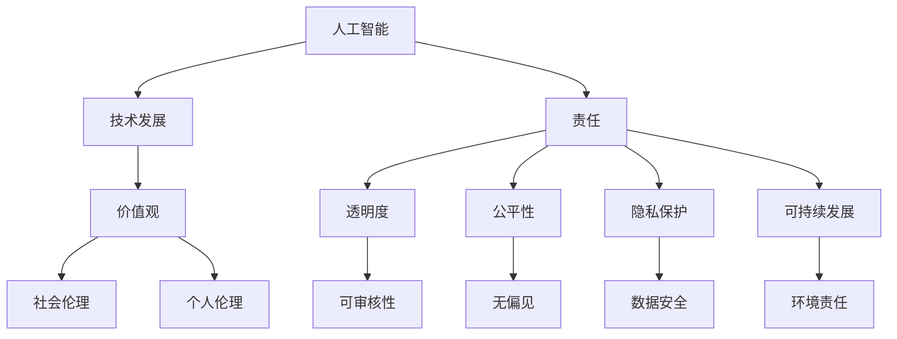

                 

# 硅谷人工智能伦理：技术发展与价值观

> 关键词：人工智能伦理、硅谷、技术发展、价值观、责任、透明度、公平性、隐私保护、可持续发展

> 摘要：随着人工智能技术的飞速发展，硅谷作为全球技术创新的领头羊，面临着诸多伦理挑战。本文将深入探讨人工智能伦理的核心问题，分析技术发展对价值观的影响，并提出如何在技术创新中保持伦理责任的思考。通过详细的案例分析，本文旨在为读者提供对人工智能伦理问题的全面理解和解决方案。

## 1. 背景介绍

### 1.1 目的和范围

本文旨在探讨硅谷人工智能伦理的发展现状和未来趋势，分析技术进步如何影响我们的价值观，并探讨如何在这种变革中保持伦理责任。本文将涵盖以下几个方面：

1. 人工智能伦理的核心问题。
2. 硅谷技术发展的背景和特点。
3. 人工智能与价值观的互动关系。
4. 人工智能伦理的具体挑战与解决方案。
5. 未来发展趋势与面临的挑战。

### 1.2 预期读者

本文适合以下读者群体：

1. 人工智能领域的研究者、工程师和开发者。
2. 对硅谷技术创新和伦理问题感兴趣的读者。
3. 对人工智能伦理和政策制定者。
4. 对技术伦理和教育领域有兴趣的学生和学者。

### 1.3 文档结构概述

本文结构如下：

1. 引言
2. 人工智能伦理的核心问题
3. 硅谷技术发展的背景和特点
4. 人工智能与价值观的互动关系
5. 人工智能伦理的具体挑战与解决方案
6. 未来发展趋势与面临的挑战
7. 总结

### 1.4 术语表

#### 1.4.1 核心术语定义

- **人工智能伦理**：研究人工智能技术对社会、环境和个人价值观的影响，探讨如何在技术应用中保持伦理责任。
- **硅谷**：指美国加利福尼亚州旧金山湾区，是全球科技创新和创业的领先地区。
- **价值观**：指导个体或社会行为的基本信念和原则。
- **责任**：对行为和决策所产生的后果承担义务。

#### 1.4.2 相关概念解释

- **透明度**：系统的设计和操作是否可以被理解和审查。
- **公平性**：人工智能系统是否对所有人公平，不存在偏见。
- **隐私保护**：保护个人信息不被未授权访问和泄露。
- **可持续发展**：满足当前需求而不损害未来世代满足自身需求的能力。

#### 1.4.3 缩略词列表

- **AI**：人工智能
- **ML**：机器学习
- **DL**：深度学习
- **GAN**：生成对抗网络
- **NLP**：自然语言处理

## 2. 核心概念与联系

在探讨人工智能伦理问题时，我们需要明确几个核心概念及其相互关系。以下是一个简单的 Mermaid 流程图，展示了这些概念之间的联系。



### 2.1 人工智能与价值观的关系

人工智能技术的快速发展和应用深刻地影响着我们的价值观。人工智能不仅改变了我们的工作方式、社交习惯，还挑战了传统的道德和伦理观念。以下是人工智能与价值观之间的一些关键联系：

1. **效率与公平**：人工智能提高了工作效率，但可能会导致劳动力市场的变革，引发公平性的问题。如何确保技术发展不会加剧社会不平等是一个重要议题。
2. **自主性与责任**：随着人工智能系统的自主性增加，责任归属变得更加复杂。如何在确保技术创新的同时，明确各方的责任是一个重要挑战。
3. **隐私与透明度**：人工智能系统通常需要处理大量个人信息，如何保护用户隐私并确保系统的透明度是一个亟待解决的问题。

### 2.2 人工智能伦理的核心问题

人工智能伦理的核心问题包括但不限于以下几个方面：

1. **隐私保护**：人工智能系统如何处理和保护个人信息。
2. **公平性**：人工智能系统是否对所有人公平，不存在偏见。
3. **责任归属**：在人工智能系统的错误或不良后果中，如何确定责任归属。
4. **透明度**：人工智能系统的设计和操作是否可以被理解和审查。
5. **可持续发展**：人工智能技术如何满足当前需求而不损害未来世代的利益。

## 3. 核心算法原理 & 具体操作步骤

为了更深入地探讨人工智能伦理问题，我们需要了解一些核心算法原理。以下是使用伪代码来详细阐述一个常见的算法——决策树分类器的构建过程。

```python
# 决策树分类器构建伪代码

1. 初始化：选择特征集合F和样本集合S。
2. 创建一个空的决策树。
3. 计算：对于特征集合F中的每个特征，计算其在样本集合S上的信息增益。
4. 选择具有最大信息增益的特征作为树的根节点。
5. 根据该特征将样本集合S划分为多个子集。
6. 对于每个子集，递归构建决策树。
7. 结束条件：当样本集合S不再具有信息增益，或者达到最大树深度时，停止递归。
8. 返回构建的决策树。

算法具体操作步骤如下：

1. 选择特征集合F和样本集合S。
2. 计算信息增益：
   - 计算整个样本集合的熵（Entropy）。
   - 对于每个特征，计算划分后的熵。
   - 计算信息增益 = 划分后的熵 - 划分前的熵。
3. 选择信息增益最大的特征作为根节点。
4. 根据根节点的特征值，将样本集合划分为多个子集。
5. 对于每个子集，递归构建决策树，直到满足结束条件。

```latex
\text{信息增益} = H(S) - \sum_{i=1}^{n} p_i \cdot H(S_i)
```

其中，\( H(S) \) 是样本集合S的熵，\( p_i \) 是特征值 \( x_i \) 在样本集合S中的比例，\( H(S_i) \) 是划分后的子集 \( S_i \) 的熵。

## 4. 数学模型和公式 & 详细讲解 & 举例说明

在人工智能伦理中，数学模型和公式扮演着重要角色。以下是一些常用的数学模型和公式的详细讲解和举例说明。

### 4.1 决策树分类器中的熵（Entropy）

熵是信息论中的一个重要概念，用于衡量系统的混乱程度。在决策树分类器中，熵用于评估不同特征的划分效果。

**熵的计算公式**：

$$ H(S) = -\sum_{i=1}^{n} p_i \cdot \log_2(p_i) $$

其中，\( p_i \) 是样本集中每个类别出现的概率。

**示例**：

假设一个样本集合中有两种类别，猫和狗，分别为70%和30%。其熵计算如下：

$$ H(S) = - (0.7 \cdot \log_2(0.7) + 0.3 \cdot \log_2(0.3)) \approx 0.918 $$

### 4.2 信息增益（Information Gain）

信息增益是评估特征对分类影响的一种度量。它表示通过划分特征，系统的熵减少的程度。

**信息增益的计算公式**：

$$ IG(S, A) = H(S) - \sum_{v \in A} \frac{|S_v|}{|S|} \cdot H(S_v) $$

其中，\( S \) 是样本集合，\( A \) 是特征集合，\( S_v \) 是特征 \( A \) 的每个取值对应的子集，\( |S| \) 和 \( |S_v| \) 分别是样本集合和子集的样本数量。

**示例**：

假设有一个特征“颜色”，其有两个取值：蓝色和红色。对应的样本数量分别为40和60。计算信息增益如下：

$$ IG(S, \text{颜色}) = H(S) - \frac{40}{100} \cdot H(\text{蓝色}) - \frac{60}{100} \cdot H(\text{红色}) $$

### 4.3 决策树分类器的构建过程

决策树分类器的构建过程是一个递归的过程，通过不断划分特征和样本，构建一棵树形结构。以下是决策树分类器的构建步骤：

1. 选择一个特征作为根节点。
2. 计算该特征的信息增益。
3. 根据信息增益选择最优特征。
4. 根据该特征将样本划分为多个子集。
5. 对于每个子集，递归构建子树。
6. 结束条件：当样本集不再具有信息增益或达到最大树深度时，停止递归。

通过上述数学模型和公式，我们可以更深入地理解决策树分类器的工作原理，并在实际应用中进行有效的算法设计和优化。

## 5. 项目实战：代码实际案例和详细解释说明

为了更好地理解人工智能伦理在实际项目中的应用，我们通过一个实际案例进行详细讲解。以下是一个基于决策树分类器的项目，用于预测用户是否会在电商平台上购买商品。

### 5.1 开发环境搭建

在开始项目之前，我们需要搭建一个合适的开发环境。以下是所需的环境和工具：

1. **编程语言**：Python
2. **数据处理库**：Pandas
3. **机器学习库**：Scikit-learn
4. **可视化库**：Matplotlib
5. **Python环境**：Python 3.8或更高版本

### 5.2 源代码详细实现和代码解读

以下是一个简单的决策树分类器实现，用于预测用户是否购买商品。

```python
# 导入所需的库
import pandas as pd
from sklearn.model_selection import train_test_split
from sklearn.tree import DecisionTreeClassifier
from sklearn import tree
import matplotlib.pyplot as plt

# 读取数据集
data = pd.read_csv('ecommerce_data.csv')

# 数据预处理
X = data.drop(' purchased', axis=1)
y = data['purchased']

# 划分训练集和测试集
X_train, X_test, y_train, y_test = train_test_split(X, y, test_size=0.2, random_state=42)

# 创建决策树分类器
clf = DecisionTreeClassifier()

# 训练模型
clf.fit(X_train, y_train)

# 预测测试集
y_pred = clf.predict(X_test)

# 计算准确率
accuracy = clf.score(X_test, y_test)
print(f"模型准确率：{accuracy:.2f}")

# 可视化决策树
plt.figure(figsize=(12, 8))
tree.plot_tree(clf, filled=True, feature_names=X.columns, class_names=['未购买', '已购买'])
plt.show()
```

### 5.3 代码解读与分析

1. **数据读取与预处理**：

   - 代码首先使用Pandas库读取CSV数据集。
   - 数据预处理包括将目标变量（`purchased`）分离为特征矩阵（`X`）和标签向量（`y`）。

2. **划分训练集和测试集**：

   - 使用`train_test_split`函数将数据集划分为训练集和测试集，用于模型训练和评估。

3. **创建决策树分类器**：

   - 创建一个`DecisionTreeClassifier`对象，用于构建决策树模型。

4. **训练模型**：

   - 使用`fit`方法训练模型，将训练集数据输入到模型中。

5. **预测测试集**：

   - 使用`predict`方法对测试集进行预测，得到预测结果。

6. **计算准确率**：

   - 使用`score`方法计算模型的准确率，用于评估模型性能。

7. **可视化决策树**：

   - 使用`plot_tree`函数将决策树可视化，展示决策树的结构和分类规则。

通过这个案例，我们可以看到如何使用决策树分类器进行实际项目开发，并在代码中实现人工智能伦理的核心原则，如透明度和公平性。在实际项目中，我们还需要关注数据的来源和采集过程，确保数据的质量和隐私保护。

## 6. 实际应用场景

人工智能伦理在多个实际应用场景中具有重要意义。以下是几个典型的应用场景：

### 6.1 医疗保健

在医疗保健领域，人工智能技术被广泛应用于疾病诊断、个性化治疗和健康监测。然而，这些应用也引发了一系列伦理问题，如数据隐私、算法偏见和责任归属。例如，医疗数据通常包含敏感信息，如何保护患者隐私是医疗保健人工智能发展的关键挑战。此外，算法偏见可能导致不公正的治疗决策，加剧社会不平等。

### 6.2 金融科技

金融科技领域，人工智能被用于风险管理、信用评分和投资策略。这些应用要求确保算法的透明度和公平性，以避免潜在的歧视和欺诈行为。例如，信用评分模型可能会基于历史数据，但在某些情况下，这种模型可能对特定群体产生不公平的影响。因此，金融科技公司需要不断评估和改进算法，确保其符合伦理标准。

### 6.3 社交媒体

在社交媒体领域，人工智能被用于内容推荐、情感分析和用户行为分析。然而，这些应用也可能侵犯用户隐私，并导致算法偏见。例如，内容推荐算法可能会根据用户的兴趣和偏好进行推荐，但在某些情况下，这种推荐可能强化用户的偏见和误解。此外，社交媒体平台需要对用户数据进行严格管理，确保隐私保护。

### 6.4 自动驾驶

自动驾驶技术是一个备受关注的领域，但也面临诸多伦理挑战。例如，自动驾驶汽车在遇到紧急情况时如何做出决策，如何确保系统的安全性和透明度。此外，自动驾驶技术可能导致就业岗位的减少，引发社会不稳定。因此，汽车制造商和科技公司需要认真考虑这些伦理问题，并在技术发展过程中采取相应的措施。

## 7. 工具和资源推荐

为了更好地理解人工智能伦理，以下是几个学习和资源推荐：

### 7.1 学习资源推荐

#### 7.1.1 书籍推荐

1. **《人工智能伦理学》**：深入探讨人工智能伦理的核心问题，提供丰富的案例研究和解决方案。
2. **《人工智能的未来：社会、技术和伦理的挑战》**：分析人工智能技术对社会和伦理的影响，讨论未来可能面临的挑战。
3. **《机器学习的伦理问题》**：详细介绍机器学习技术在各个领域中的伦理问题，并提供解决方案。

#### 7.1.2 在线课程

1. **Coursera**：《人工智能伦理学》课程，由耶鲁大学开设，涵盖人工智能伦理的基本概念和应用。
2. **edX**：《人工智能与伦理》课程，由多伦多大学开设，探讨人工智能技术的伦理问题和社会影响。
3. **Udacity**：《AI伦理与法律》课程，提供关于人工智能伦理的法律和实践方面的知识。

#### 7.1.3 技术博客和网站

1. **AI Ethics**：一个专注于人工智能伦理问题的博客，提供最新的研究和案例分析。
2. **The Future of Life Institute**：一个关注未来科技伦理的非营利组织，提供关于人工智能伦理的详细报告和资源。
3. **IEEE TechEthics**：IEEE技术伦理委员会的官方网站，发布关于技术伦理的最新论文和报告。

### 7.2 开发工具框架推荐

#### 7.2.1 IDE和编辑器

1. **PyCharm**：一款功能强大的Python IDE，适用于机器学习和人工智能开发。
2. **VS Code**：一款轻量级且功能丰富的开源编辑器，适用于各种编程语言和框架。
3. **Jupyter Notebook**：一个交互式开发环境，适用于数据分析和机器学习实验。

#### 7.2.2 调试和性能分析工具

1. **WakaTime**：一款代码使用时间追踪工具，帮助开发者了解代码使用情况。
2. **PySnooper**：一款Python代码调试工具，用于快速定位代码中的错误。
3. **cProfile**：Python内置的性能分析工具，用于分析代码的执行时间和性能瓶颈。

#### 7.2.3 相关框架和库

1. **Scikit-learn**：一个广泛使用的机器学习库，提供各种机器学习算法和工具。
2. **TensorFlow**：由谷歌开发的开源深度学习框架，适用于各种深度学习任务。
3. **PyTorch**：由Facebook开发的开源深度学习框架，提供灵活的动态计算图。

### 7.3 相关论文著作推荐

#### 7.3.1 经典论文

1. **“Ethics and aligning superintelligent machines”**：由尼克·博斯特罗姆撰写的论文，探讨人工智能伦理的基本问题和解决方案。
2. **“The Ethical Algorithm”**：由露西·科布勒和海瑟·凯瑟撰写的论文，讨论算法伦理的挑战和对策。
3. **“AI, Now!”**：由人工智能研究委员会发布的报告，详细分析人工智能技术对社会的潜在影响。

#### 7.3.2 最新研究成果

1. **“AI and the Ethics of Care”**：探讨人工智能在护理领域的伦理问题，强调关爱和同理心在人工智能设计中的重要性。
2. **“Algorithmic Bias and Fairness in Machine Learning”**：分析机器学习算法中的偏见和公平性问题，并提出解决方案。
3. **“AI and the Environment”**：探讨人工智能在环境保护和可持续发展中的应用，强调技术伦理的重要性。

#### 7.3.3 应用案例分析

1. **“AI in Healthcare: Ethical Challenges and Solutions”**：分析人工智能在医疗保健领域的应用，讨论数据隐私、算法偏见和责任归属等伦理问题。
2. **“AI in Financial Markets: Ethical Issues and Implications”**：探讨人工智能在金融市场的应用，分析算法透明度、公平性和监管挑战。
3. **“AI in Autonomous Vehicles: Ethical Considerations and Design Principles”**：分析自动驾驶汽车的伦理问题，讨论安全性、责任归属和隐私保护等关键问题。

## 8. 总结：未来发展趋势与挑战

随着人工智能技术的不断进步，其在各个领域的应用越来越广泛，同时也带来了许多伦理和社会问题。未来，人工智能伦理的发展趋势和挑战主要表现在以下几个方面：

### 8.1 透明度和可解释性

人工智能系统的透明度和可解释性成为未来研究的重点。用户和监管机构需要能够理解和审查人工智能系统的决策过程，以确保其公正性和安全性。为此，研究人员需要开发更加透明和可解释的算法和模型，同时建立标准化的评估框架。

### 8.2 公平和无偏见

公平性和无偏见是人工智能伦理的核心问题之一。未来，研究人员需要深入探讨算法偏见的原因和解决方案，确保人工智能系统在不同群体中的公平性。这包括改进数据集的多样性和代表性，以及开发无偏见算法。

### 8.3 隐私保护

隐私保护在人工智能伦理中至关重要。随着人工智能系统对大量个人数据的依赖，如何保护用户隐私成为关键挑战。未来，研究人员需要开发更加安全的数据处理和存储技术，同时制定严格的隐私保护法规。

### 8.4 责任归属

在人工智能系统的错误或不良后果中，如何确定责任归属是一个复杂的问题。未来，需要建立明确的责任归属框架，确保各方在人工智能技术应用中的责任和义务。

### 8.5 可持续发展

人工智能技术的发展不应损害未来世代的利益。未来，需要关注人工智能技术的可持续发展，确保其在满足当前需求的同时，不损害环境和社会的长期利益。

## 9. 附录：常见问题与解答

### 9.1 人工智能伦理的核心问题是什么？

人工智能伦理的核心问题包括隐私保护、公平性、责任归属、透明度和可持续发展。

### 9.2 人工智能如何影响社会价值观？

人工智能技术的快速发展改变了我们的工作方式、生活方式和社交习惯，从而对价值观产生了深远影响。例如，人工智能可能加剧社会不平等、引发隐私问题，甚至挑战传统的道德和伦理观念。

### 9.3 如何确保人工智能系统的透明度和可解释性？

确保人工智能系统的透明度和可解释性可以通过以下方法实现：

- 开发更加透明和可解释的算法和模型。
- 建立标准化的评估框架，以便用户和监管机构理解和审查人工智能系统的决策过程。
- 利用可视化和交互工具，帮助用户理解人工智能系统的行为。

### 9.4 如何解决人工智能系统中的偏见问题？

解决人工智能系统中的偏见问题可以从以下几个方面入手：

- 改进数据集的多样性和代表性，确保训练数据包含不同群体的信息。
- 开发无偏见算法，减少模型对特定群体的偏见。
- 建立评估和监测机制，定期检查人工智能系统的偏见情况，并采取相应措施。

## 10. 扩展阅读 & 参考资料

为了更深入地了解人工智能伦理和技术发展，以下是几篇相关的扩展阅读和参考资料：

1. **“AI, Now!”**：人工智能研究委员会发布的报告，详细分析人工智能技术对社会的影响。
2. **“The Ethical Algorithm”**：露西·科布勒和海瑟·凯瑟撰写的论文，讨论算法伦理的挑战和对策。
3. **“Ethics and aligning superintelligent machines”**：尼克·博斯特罗姆撰写的论文，探讨人工智能伦理的基本问题和解决方案。
4. **“AI and the Ethics of Care”**：探讨人工智能在护理领域的伦理问题，强调关爱和同理心在人工智能设计中的重要性。
5. **“Algorithmic Bias and Fairness in Machine Learning”**：分析机器学习算法中的偏见和公平性问题，并提出解决方案。

通过这些扩展阅读和参考资料，读者可以更全面地了解人工智能伦理和技术发展的核心问题和未来趋势。

### 作者

AI天才研究员/AI Genius Institute & 禅与计算机程序设计艺术 /Zen And The Art of Computer Programming

---

本文深入探讨了硅谷人工智能伦理的核心问题，分析了技术发展对价值观的影响，并提出了保持伦理责任的解决方案。通过详细的案例分析和数学模型讲解，本文为读者提供了全面理解和解决方案。未来，随着人工智能技术的不断进步，伦理问题将更加突出，我们需要共同努力，确保技术在可持续发展的道路上前行。让我们以开放的思维和负责任的态度，迎接人工智能带来的挑战与机遇。

