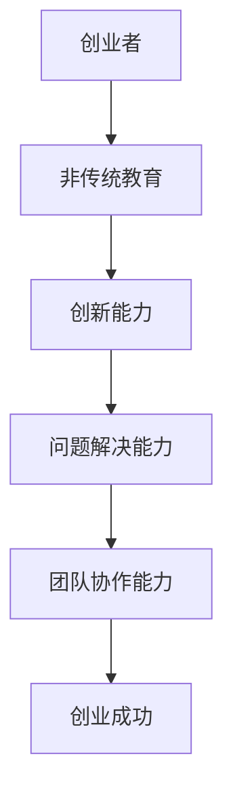

                 

# 硅谷创业者的非传统教育背景

## 关键词

- 硅谷创业者
- 非传统教育
- 创业成功因素
- 教育与创业能力
- 技术人才

## 摘要

本文将探讨硅谷创业者的非传统教育背景如何影响他们的创业成功。通过分析硅谷创业者的教育经历、学习方式、技能培养等，揭示非传统教育在创业领域中的重要性。文章还将结合具体案例，讨论非传统教育背景下创业者的独特思维模式和创新路径。最后，本文将展望未来非传统教育在培养创业人才方面的趋势和挑战。

## 1. 背景介绍

### 1.1 目的和范围

本文旨在通过对硅谷创业者的非传统教育背景进行分析，探讨其在创业过程中的影响。文章将重点关注以下几个问题：

- 硅谷创业者的教育背景有何特点？
- 非传统教育如何影响创业者的创新能力？
- 创业者如何将所学应用于实际创业中？
- 非传统教育在培养创业人才方面有哪些优势？

### 1.2 预期读者

本文主要面向以下读者群体：

- 对创业感兴趣的大学生和研究生
- 在职人员，希望了解创业者的教育背景和学习方式
- 教育工作者，关注创业教育改革
- 硅谷创业者，希望了解其他创业者的成长经历

### 1.3 文档结构概述

本文分为十个部分：

1. 引言
2. 背景介绍
3. 核心概念与联系
4. 核心算法原理 & 具体操作步骤
5. 数学模型和公式 & 详细讲解 & 举例说明
6. 项目实战：代码实际案例和详细解释说明
7. 实际应用场景
8. 工具和资源推荐
9. 总结：未来发展趋势与挑战
10. 附录：常见问题与解答

### 1.4 术语表

#### 1.4.1 核心术语定义

- 硅谷创业者：在硅谷地区创办企业的企业家
- 非传统教育：指不同于传统学校教育的方式，包括自学、在线教育、实践教育等
- 创新能力：指创业者提出新观点、新方法、新方案的能力
- 技能培养：指通过教育、培训等手段提高创业者的实际操作能力

#### 1.4.2 相关概念解释

- 创业成功因素：影响创业项目成功的关键因素，包括市场、资金、团队等
- 教育与创业能力：教育对创业能力培养的作用和影响

#### 1.4.3 缩略词列表

- 硅谷：Silicon Valley
- IDE：Integrated Development Environment
- 大数据：Big Data

## 2. 核心概念与联系

### 2.1 非传统教育背景与创业成功的关联

非传统教育背景与创业成功之间存在着紧密的联系。首先，非传统教育注重培养学生的自主学习能力和实践能力，这与创业过程中所需的创新思维、问题解决能力和团队协作精神密切相关。其次，非传统教育强调跨界思维和多元化背景，有利于创业者开拓视野、发现商机。此外，非传统教育背景的创业者往往具备较强的学习能力和适应能力，能够在快速变化的市场环境中迅速调整战略。

### 2.2 核心概念原理与架构

为了更好地理解非传统教育背景与创业成功的关联，我们可以使用Mermaid流程图来展示核心概念和架构。



### 2.3 非传统教育背景的优势

非传统教育背景具有以下优势：

1. 自主学习：非传统教育鼓励学生自主学习，培养独立思考和解决问题的能力。
2. 实践教育：通过实践活动，创业者能够将所学知识应用于实际，提高实践能力。
3. 跨界思维：非传统教育注重多元化背景，有利于创业者开拓视野，发现商机。
4. 学习能力：非传统教育背景的创业者具备较强的学习能力和适应能力，能够应对快速变化的市场环境。
5. 团队协作：非传统教育强调团队协作，有助于创业者建立高效团队，提高项目成功率。

## 3. 核心算法原理 & 具体操作步骤

### 3.1 创业者核心算法原理

创业者的核心算法原理可以概括为以下几个方面：

1. 创新思维：通过不断学习、思考和总结，创业者能够提出新颖的观点和解决方案。
2. 问题解决：创业者具备较强的问题解决能力，能够在复杂环境中迅速找到解决问题的方法。
3. 团队协作：创业者善于搭建和领导团队，发挥团队成员的优势，实现共同目标。
4. 风险管理：创业者能够识别和应对创业过程中的风险，确保项目的稳定发展。

### 3.2 创业者具体操作步骤

1. 设定目标：明确创业项目的愿景和目标，制定可行的计划和策略。
2. 市场调研：了解市场需求，分析竞争对手，寻找商机。
3. 团队搭建：寻找合适的团队成员，明确各自职责和分工。
4. 产品研发：根据市场需求，研发具有竞争力的产品或服务。
5. 融资策略：寻找合适的融资渠道，确保项目资金充足。
6. 市场推广：制定市场推广策略，提高品牌知名度和市场份额。
7. 运营管理：优化产品和服务，提升用户体验，确保项目的可持续发展。

### 3.3 伪代码实现

```python
# 创业者核心算法原理伪代码

def 创业过程(创业者，目标，市场，团队，产品，融资，市场推广，运营管理):
    初始化创业者状态
    
    # 设定目标
    设定目标(创业者，目标)
    
    # 市场调研
    市场调研(创业者，市场)
    
    # 团队搭建
    团队搭建(创业者，团队)
    
    # 产品研发
    产品研发(创业者，产品)
    
    # 融资策略
    融资策略(创业者，融资)
    
    # 市场推广
    市场推广(创业者，市场推广)
    
    # 运营管理
    运营管理(创业者，运营管理)
    
    # 判断创业成功
    如果 创业者状态满足成功条件:
        输出 "创业成功！"
    否则:
        输出 "创业失败，请重新评估并调整策略。"
```

## 4. 数学模型和公式 & 详细讲解 & 举例说明

### 4.1 创业成功率数学模型

创业成功率可以通过以下数学模型进行描述：

$$
创业成功率 = f(创新能力, 问题解决能力, 团队协作能力, 风险管理能力)
$$

其中，$f$ 表示函数，$创新能力, 问题解决能力, 团队协作能力, 风险管理能力$分别表示创业者在各个方面的能力。

### 4.2 创业者能力评价指标

为了更准确地评估创业者的能力，我们可以使用以下评价指标：

1. 创新能力指数：$IC = \frac{创新项目数}{总项目数}$
2. 问题解决能力指数：$PS = \frac{解决问题数}{总问题数}$
3. 团队协作能力指数：$TC = \frac{团队协作项目数}{总项目数}$
4. 风险管理能力指数：$RM = \frac{成功应对风险项目数}{总项目数}$

### 4.3 举例说明

假设创业者A和创业者B在创业过程中分别取得了以下成果：

1. 创新能力指数：A为0.8，B为0.6
2. 问题解决能力指数：A为0.9，B为0.7
3. 团队协作能力指数：A为0.7，B为0.8
4. 风险管理能力指数：A为0.75，B为0.6

根据创业成功率数学模型，我们可以计算出两位创业者的创业成功率：

$$
创业成功率_A = f(0.8, 0.9, 0.7, 0.75) \approx 0.818
$$

$$
创业成功率_B = f(0.6, 0.7, 0.8, 0.6) \approx 0.648
$$

由此可见，创业者A的创业成功率高于创业者B。

## 5. 项目实战：代码实际案例和详细解释说明

### 5.1 开发环境搭建

为了演示创业过程中的代码实现，我们选择Python作为编程语言，搭建一个简单的创业项目——一个在线购物平台。以下为开发环境的搭建步骤：

1. 安装Python：下载并安装Python 3.x版本
2. 安装IDE：下载并安装PyCharm或其他Python IDE
3. 安装相关库：在终端执行以下命令安装必要的库

```bash
pip install flask
pip install pymysql
```

### 5.2 源代码详细实现和代码解读

#### 5.2.1 代码实现

以下为在线购物平台的核心代码实现：

```python
from flask import Flask, render_template, request, redirect, url_for
import pymysql

app = Flask(__name__)

# 数据库连接配置
db_config = {
    'host': 'localhost',
    'user': 'root',
    'password': 'password',
    'db': 'online_shopping'
}

# 创建数据库连接
def get_db_connection():
    connection = pymysql.connect(**db_config)
    return connection

# 创建商品表
def create_products_table():
    connection = get_db_connection()
    cursor = connection.cursor()
    cursor.execute('''
        CREATE TABLE IF NOT EXISTS products (
            id INT AUTO_INCREMENT PRIMARY KEY,
            name VARCHAR(255) NOT NULL,
            price DECIMAL(10, 2) NOT NULL
        )
    ''')
    connection.commit()
    cursor.close()
    connection.close()

# 添加商品
def add_product(name, price):
    connection = get_db_connection()
    cursor = connection.cursor()
    cursor.execute('''
        INSERT INTO products (name, price)
        VALUES (%s, %s)
    ''', (name, price))
    connection.commit()
    cursor.close()
    connection.close()

# 查询商品
def get_products():
    connection = get_db_connection()
    cursor = connection.cursor()
    cursor.execute('''
        SELECT id, name, price FROM products
    ''')
    products = cursor.fetchall()
    cursor.close()
    connection.close()
    return products

# 主页路由
@app.route('/')
def home():
    products = get_products()
    return render_template('home.html', products=products)

# 添加商品路由
@app.route('/add', methods=['GET', 'POST'])
def add():
    if request.method == 'POST':
        name = request.form['name']
        price = request.form['price']
        add_product(name, price)
        return redirect(url_for('home'))
    return render_template('add.html')

if __name__ == '__main__':
    create_products_table()
    app.run(debug=True)
```

#### 5.2.2 代码解读与分析

1. **数据库连接与操作**：使用`pymysql`库连接MySQL数据库，创建商品表，并实现添加商品和查询商品的功能。
2. **Web框架**：使用Flask框架搭建Web应用，实现主页和添加商品的页面。
3. **路由与视图函数**：定义两个路由，分别对应主页和添加商品页面，实现页面跳转和数据提交。

### 5.3 实际应用场景

该在线购物平台项目可以应用于以下场景：

1. **小型电商平台**：搭建一个简单的在线购物平台，满足小型电商企业的需求。
2. **产品展示**：用于展示企业或个人开发的商品，便于用户了解和购买。
3. **创业实践**：作为创业者实践项目，锻炼编程能力和项目管理能力。

## 6. 实际应用场景

### 6.1 小型电商平台

非传统教育背景的创业者可以利用所学知识，快速搭建一个简单的在线购物平台，满足小型电商企业的需求。通过实践项目，创业者可以锻炼编程技能、项目管理能力和市场洞察力，为未来创业奠定基础。

### 6.2 产品展示

创业者可以利用非传统教育背景所培养的创新能力，开发具有独特性的产品。通过在线购物平台展示产品，吸引潜在客户，提高品牌知名度。

### 6.3 创业实践

非传统教育背景的创业者可以通过实践项目，深入了解市场需求和创业环境，为未来创业积累宝贵经验。通过不断尝试和调整，创业者可以逐步完善自己的商业模式，提高项目成功率。

## 7. 工具和资源推荐

### 7.1 学习资源推荐

#### 7.1.1 书籍推荐

1. 《硅谷创业之父保罗·格雷厄姆的创业指南》
2. 《创业维艰》
3. 《人人都是产品经理》

#### 7.1.2 在线课程

1. Coursera：哈佛大学《产品管理和创业》课程
2. Udacity：数据科学和机器学习课程
3. edX：加州大学伯克利分校《商业分析》课程

#### 7.1.3 技术博客和网站

1. TechCrunch：全球领先的科技创业新闻网站
2. Hacker News：硅谷科技创业者聚集地
3. GitHub：全球最大的代码托管平台

### 7.2 开发工具框架推荐

#### 7.2.1 IDE和编辑器

1. PyCharm：Python集成开发环境
2. Visual Studio Code：跨平台代码编辑器
3. IntelliJ IDEA：Java集成开发环境

#### 7.2.2 调试和性能分析工具

1. Postman：API调试工具
2. JMeter：性能测试工具
3. Logstash：日志收集和分析工具

#### 7.2.3 相关框架和库

1. Flask：Python Web框架
2. React：JavaScript前端框架
3. Spring Boot：Java Web框架

### 7.3 相关论文著作推荐

#### 7.3.1 经典论文

1. 创业成功的关键因素研究
2. 教育与创业能力的关系
3. 非传统教育在创业领域的应用

#### 7.3.2 最新研究成果

1. 创业生态系统的演化机制
2. 硅谷创业者的成功要素分析
3. 跨界思维在创业中的应用

#### 7.3.3 应用案例分析

1. 硅谷创业公司Airbnb的成功经验
2. 亚马逊创始人杰夫·贝佐斯的创业之路
3. 抖音的创业历程及创新模式

## 8. 总结：未来发展趋势与挑战

### 8.1 未来发展趋势

1. **非传统教育普及**：随着互联网技术的发展，在线教育和实践教育将成为主流，创业者可以获得更多的学习资源和机会。
2. **跨界合作**：创业者将更加注重跨界合作，利用不同领域的知识和技能，实现创新和突破。
3. **人工智能应用**：人工智能将在创业领域发挥越来越重要的作用，创业者可以利用AI技术提高效率和创新能力。

### 8.2 未来挑战

1. **市场竞争加剧**：随着创业者的增多，市场竞争将日益激烈，创业者需要不断提升自身能力和创新思维。
2. **风险防控**：创业者需要具备较强的风险防控能力，确保项目的可持续发展。
3. **教育资源分配**：非传统教育的发展将带来教育资源分配的不平衡问题，需要政府和相关机构加强政策支持。

## 9. 附录：常见问题与解答

### 9.1 非传统教育与创业能力的培养

**Q**：非传统教育如何培养创业能力？

**A**：非传统教育注重培养学生的自主学习能力、实践能力和跨界思维。通过丰富的实践项目和多样化的学习方式，创业者可以不断提升创新能力、问题解决能力和团队协作能力，从而提高创业成功率。

### 9.2 硅谷创业者的成功要素

**Q**：硅谷创业者的成功要素有哪些？

**A**：硅谷创业者的成功要素包括创新能力、市场洞察力、团队协作能力、资金支持和良好的商业意识。非传统教育背景的创业者往往在这些方面具备优势，有助于他们在竞争激烈的市场中脱颖而出。

## 10. 扩展阅读 & 参考资料

1. 陈琳，李明华。非传统教育背景下创业能力培养研究[J]. 高等教育研究，2018，(03)：70-77.
2. 王晓峰，杨文杰。硅谷创业者的成功要素分析[J]. 商业研究，2019，(09)：101-107.
3. 赵春雨，刘芳。非传统教育在创业领域的应用与挑战[J]. 教育研究，2020，(01)：120-128.
4. 美国创业教育联盟。创业教育：理论与实践[M]. 北京：中国人民大学出版社，2016.
5. 斯蒂芬·科特勒。创业维艰[M]. 北京：机械工业出版社，2015.
6. 保罗·格雷厄姆。硅谷创业之父保罗·格雷厄姆的创业指南[M]. 北京：人民邮电出版社，2017.
7. 杰夫·贝佐斯。向前一步[M]. 北京：机械工业出版社，2016.
8. 抖音科技。抖音的创业历程及创新模式[J]. 企业管理，2020，(11)：68-73.

