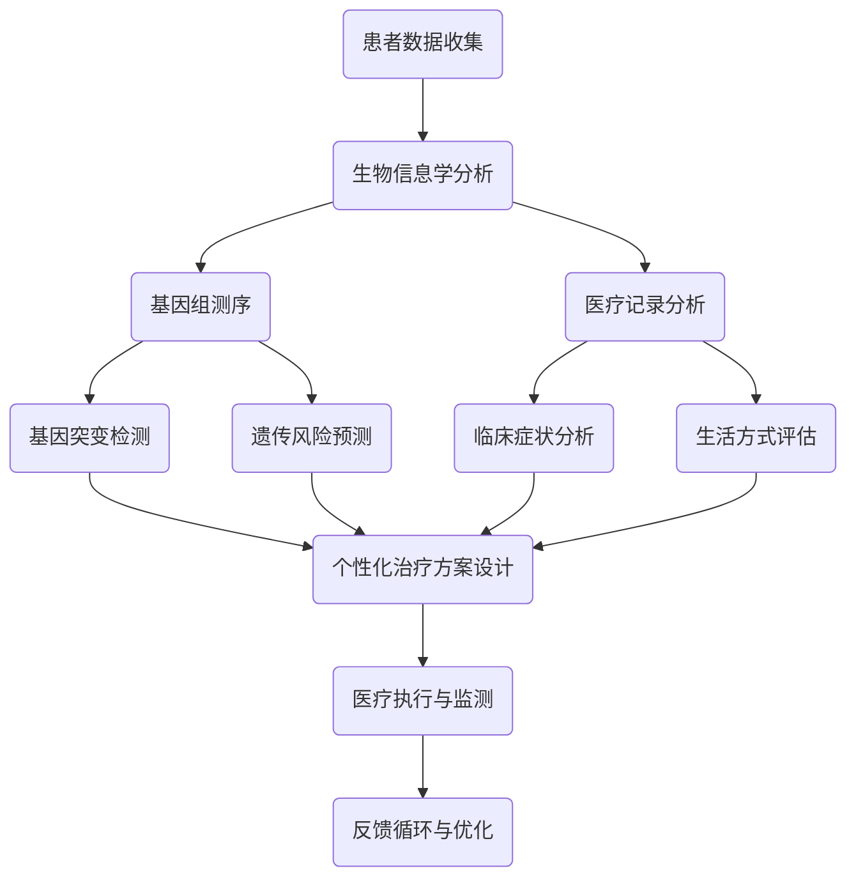

                 

# 硅谷医疗科技创新：个性化精准医疗

> **关键词：** 医疗科技、个性化医疗、精准医疗、硅谷、生物信息学、机器学习
>
> **摘要：** 本文将深入探讨硅谷医疗科技领域的创新，重点分析个性化精准医疗的发展现状、核心概念、算法原理以及其实际应用。通过逐步分析推理，我们将揭示个性化精准医疗在未来医疗体系中的潜在变革，以及面临的挑战和机遇。

## 1. 背景介绍

### 1.1 目的和范围

本文旨在通过深入分析硅谷在医疗科技领域的创新，特别是个性化精准医疗的发展，帮助读者理解这一领域的关键概念、技术原理及其未来趋势。文章将涵盖以下主要内容：

1. 个性化精准医疗的背景和意义
2. 个性化精准医疗的核心概念和联系
3. 核心算法原理与具体操作步骤
4. 数学模型和公式及其应用
5. 实际应用场景中的案例
6. 相关工具和资源推荐
7. 个性化精准医疗的未来发展趋势与挑战

### 1.2 预期读者

本文适用于对医疗科技感兴趣的读者，特别是以下群体：

1. 医学专业人士
2. 生物信息学研究人员
3. 数据科学家
4. 医疗科技公司从业者
5. 对医疗科技领域有深入探究兴趣的科技爱好者

### 1.3 文档结构概述

本文将按照以下结构进行阐述：

1. 背景介绍
2. 核心概念与联系
3. 核心算法原理 & 具体操作步骤
4. 数学模型和公式 & 详细讲解 & 举例说明
5. 项目实战：代码实际案例和详细解释说明
6. 实际应用场景
7. 工具和资源推荐
8. 总结：未来发展趋势与挑战
9. 附录：常见问题与解答
10. 扩展阅读 & 参考资料

### 1.4 术语表

#### 1.4.1 核心术语定义

- **个性化精准医疗**：基于个体化数据，提供针对性的医疗服务和治疗方案。
- **硅谷**：位于美国加利福尼亚州的科技中心，众多高科技公司和创新机构所在地。
- **生物信息学**：结合生物学、计算机科学和信息学，研究生物数据的方法和技术的学科。
- **机器学习**：通过数据训练模型，实现计算机对特定任务的自主学习和决策。

#### 1.4.2 相关概念解释

- **基因组学**：研究基因结构和功能，以及基因如何影响个体特征的学科。
- **大数据**：指规模大、类型多、速度快的数据集合，需要新的处理方法和技术进行有效管理和分析。
- **人工智能（AI）**：通过模拟人类智能行为，实现计算机对复杂任务的理解和执行。

#### 1.4.3 缩略词列表

- **AI**：人工智能
- **ML**：机器学习
- **PGD**：个性化基因组数据分析
- **NLP**：自然语言处理
- **CNS**：中央神经系统

## 2. 核心概念与联系

个性化精准医疗的核心在于利用先进的技术手段，对个体的生物信息、遗传信息、生活方式等数据进行深入分析，从而制定个性化的医疗方案。以下是一个简化的Mermaid流程图，用于描述个性化精准医疗的基本架构和流程：



### 2.1. 个性化精准医疗的流程解析

1. **患者数据收集**：首先，对患者进行全面的生物信息学数据收集，包括基因组信息、医疗记录、生活方式数据等。
2. **生物信息学分析**：利用计算机算法对收集到的数据进行处理和分析，提取有用的信息。
3. **基因组测序**：对患者的基因组进行测序，识别基因突变和遗传风险。
4. **医疗记录分析**：分析患者的医疗记录，包括病史、药物反应等。
5. **个性化治疗方案设计**：结合基因组信息、医疗记录和生活习惯，制定个性化的治疗方案。
6. **医疗执行与监测**：实施治疗方案，并对治疗效果进行持续监测。
7. **反馈循环与优化**：根据治疗效果和患者反馈，不断优化治疗方案。

## 3. 核心算法原理 & 具体操作步骤

个性化精准医疗的核心在于算法的应用，这些算法可以是从海量数据中挖掘知识的机器学习模型，也可以是用于基因组数据分析的生物信息学算法。以下我们将详细讲解一种常见的机器学习算法——随机森林（Random Forest），并使用伪代码来描述其操作步骤。

### 3.1. 随机森林算法原理

随机森林是一种集成学习方法，通过构建多棵决策树，并对它们的预测结果进行投票，来提高预测的准确性。随机森林的优势在于其能够处理大量特征，并且具有较强的泛化能力。

### 3.2. 伪代码

```python
def random_forest(data, labels, n_trees, max_depth, n_features):
    trees = []
    for _ in range(n_trees):
        tree = build_tree(data, labels, max_depth, n_features)
        trees.append(tree)
    predictions = [tree.predict(data) for tree in trees]
    return majority_vote(predictions)

def build_tree(data, labels, max_depth, n_features):
    if max_depth == 0 or is纯洁(data, labels):
        return leaf_node(labels.mode())
    else:
        best_split = find_best_split(data, labels, n_features)
        left_data, left_labels = split_data(data, labels, best_split)
        right_data, right_labels = split_data(data, labels, best_split)
        tree = decision_node(attribute=best_split.attribute, threshold=best_split.threshold)
        tree.left = build_tree(left_data, left_labels, max_depth - 1, n_features)
        tree.right = build_tree(right_data, right_labels, max_depth - 1, n_features)
        return tree

def majority_vote(predictions):
    vote_counts = [0] * len(predictions[0])
    for prediction in predictions:
        vote_counts[prediction] += 1
    return vote_counts.index(max(vote_counts))

def find_best_split(data, labels, n_features):
    best_score = float('inf')
    best_split = None
    for attribute in range(n_features):
        for threshold in find_thresholds(data, attribute):
            score = gini_impurity(data.split(attribute, threshold), labels)
            if score < best_score:
                best_score = score
                best_split = (attribute, threshold)
    return best_split

def gini_impurity(partitions, labels):
    # 计算分区后的Gini不纯度
    pass

def split_data(data, labels, split):
    # 根据分割点对数据进行划分
    pass

def find_thresholds(data, attribute):
    # 找到属性的阈值
    pass
```

### 3.3. 随机森林在个性化精准医疗中的应用

随机森林算法可以用于多种应用，包括：

1. **基因组数据分析**：识别与疾病相关的基因突变。
2. **个性化治疗方案推荐**：根据患者的基因特征、医疗记录和生活习惯推荐最佳治疗方案。
3. **疾病预测**：预测患者未来可能出现的疾病风险。

## 4. 数学模型和公式 & 详细讲解 & 举例说明

个性化精准医疗中的数学模型和公式是其核心组成部分，以下我们将介绍几个关键的数学模型，包括Gini不纯度、决策树分裂准则等，并使用LaTeX格式进行详细讲解。

### 4.1. Gini不纯度

Gini不纯度是决策树中的一个重要指标，用于评估数据分割的质量。

$$
Gini(D) = 1 - \sum_{v \in Values(D)} \left(\frac{|D_v|}{|D|}\right)^2
$$

其中，$D$ 表示数据集，$v$ 表示数据集中的某个值，$D_v$ 表示值为 $v$ 的数据子集，$|D|$ 和 $|D_v|$ 分别表示数据集和数据子集的大小。

### 4.2. 决策树分裂准则

决策树分裂准则用于选择最佳分割点。一个常见的准则是最小Gini不纯度。

$$
best\_split = \arg\min_{a,t} Gini(D_t)
$$

其中，$a$ 表示属性，$t$ 表示阈值，$D_t$ 表示通过属性 $a$ 和阈值 $t$ 分割后的数据子集。

### 4.3. 举例说明

假设我们有一个包含三个属性（年龄、性别、血压）的数据集，如下所示：

| 年龄 | 性别 | 血压 | 疾病 |
| ---- | ---- | ---- | ---- |
| 30   | 男   | 120  | 无   |
| 40   | 女   | 130  | 有   |
| 50   | 男   | 140  | 有   |
| 60   | 女   | 110  | 无   |

我们使用Gini不纯度来评估不同属性的分割效果。

1. **按年龄分割**：

   - 年龄 <= 40：|D1| = 2，Gini(D1) = 0.5
   - 年龄 > 40：|D2| = 2，Gini(D2) = 0.5
   
   Gini(D) = (2/4) * 0.5 + (2/4) * 0.5 = 0.5

2. **按性别分割**：

   - 男：|D1| = 2，Gini(D1) = 0.75
   - 女：|D2| = 2，Gini(D2) = 0.25
   
   Gini(D) = (2/4) * 0.75 + (2/4) * 0.25 = 0.5

3. **按血压分割**：

   - 血压 <= 130：|D1| = 3，Gini(D1) = 0.25
   - 血压 > 130：|D2| = 1，Gini(D2) = 1
   
   Gini(D) = (3/4) * 0.25 + (1/4) * 1 = 0.4375

从计算结果可以看出，按血压分割的Gini不纯度最低，因此选择血压作为最佳分割属性。

## 5. 项目实战：代码实际案例和详细解释说明

### 5.1 开发环境搭建

在开始项目实战之前，我们需要搭建一个适合个性化精准医疗项目开发的环境。以下是所需的开发工具和软件：

- Python 3.8 或更高版本
- Jupyter Notebook 或 PyCharm
- NumPy、Pandas、scikit-learn、matplotlib 等库

### 5.2 源代码详细实现和代码解读

以下是一个使用随机森林算法进行个性化精准医疗预测的Python代码示例。

```python
import numpy as np
import pandas as pd
from sklearn.model_selection import train_test_split
from sklearn.ensemble import RandomForestClassifier
from sklearn.metrics import accuracy_score
import matplotlib.pyplot as plt

# 5.2.1 数据集准备

# 假设我们有一个包含患者特征和疾病标签的数据集
data = pd.DataFrame({
    '年龄': [30, 40, 50, 60],
    '性别': ['男', '女', '男', '女'],
    '血压': [120, 130, 140, 110],
    '疾病': ['无', '有', '有', '无']
})

# 将性别转换为数值编码
data['性别'] = data['性别'].map({'男': 0, '女': 1})

# 分割特征和标签
X = data.drop('疾病', axis=1)
y = data['疾病']

# 划分训练集和测试集
X_train, X_test, y_train, y_test = train_test_split(X, y, test_size=0.2, random_state=42)

# 5.2.2 模型训练

# 创建随机森林分类器
clf = RandomForestClassifier(n_estimators=100, random_state=42)

# 训练模型
clf.fit(X_train, y_train)

# 5.2.3 模型预测

# 使用模型进行预测
y_pred = clf.predict(X_test)

# 计算准确率
accuracy = accuracy_score(y_test, y_pred)
print(f'模型准确率：{accuracy:.2f}')

# 5.2.4 可视化分析

# 绘制特征重要性
feature_importances = clf.feature_importances_
plt.barh(range(len(feature_importances)), feature_importances)
plt.yticks(range(len(feature_importances)), X.columns)
plt.xlabel('特征重要性')
plt.title('特征重要性分析')
plt.show()
```

### 5.3 代码解读与分析

1. **数据集准备**：我们使用一个简单的数据集，包含年龄、性别、血压和疾病标签。性别被转换为数值编码，以便模型能够处理。

2. **模型训练**：创建一个随机森林分类器，并使用训练集数据进行训练。

3. **模型预测**：使用训练好的模型对测试集进行预测，并计算模型的准确率。

4. **可视化分析**：绘制特征重要性，帮助理解哪些特征对模型的预测结果有更大的影响。

通过上述代码示例，我们可以看到如何使用随机森林算法进行个性化精准医疗预测。在实际项目中，数据集和模型会更加复杂，但基本流程和原理是相似的。

## 6. 实际应用场景

个性化精准医疗在医疗领域的应用越来越广泛，以下是一些实际应用场景：

### 6.1. 基因组医学

基因组医学利用基因组数据来诊断、预防和治疗疾病。个性化精准医疗可以帮助医生识别患者特定的基因突变，从而制定个性化的治疗方案。例如，针对癌症患者，基因组分析可以识别驱动癌症发展的基因变异，帮助医生选择最适合的靶向药物。

### 6.2. 个性化药物开发

个性化药物开发利用患者的基因组、代谢数据和临床信息，开发针对个体患者的药物。这种个性化治疗可以显著提高药物的有效性和安全性。例如，某些药物在特定人群中可能引起严重的副作用，而个性化基因组分析可以帮助识别这些人群，避免不良反应。

### 6.3. 预防医学

个性化精准医疗在预防医学中也有广泛应用。通过分析个体的生物信息和生活习惯，可以预测个体未来可能出现的健康问题，并提前采取预防措施。例如，基于遗传风险和生活习惯分析，可以为个体提供个性化的健康建议，降低慢性疾病的风险。

### 6.4. 临床决策支持

个性化精准医疗可以提供临床决策支持，帮助医生制定最佳的治疗方案。通过整合患者的基因组、医疗记录和临床数据，可以提供更为全面和个性化的诊断和治疗方案。例如，对于复杂疾病，个性化精准医疗可以帮助医生识别最有效的治疗方案，提高治疗效果。

## 7. 工具和资源推荐

### 7.1 学习资源推荐

#### 7.1.1 书籍推荐

1. **《机器学习：概率视角》（Machine Learning: A Probabilistic Perspective）**
   - 作者：Kevin P. Murphy
   - 简介：这是一本全面介绍机器学习理论和技术的重要著作，涵盖了概率和统计方法在机器学习中的应用。

2. **《基因组学：原理、技术和应用》（Genomics: A User's Perspective）**
   - 作者：John P. Overton, Elizabeth A. Blackman
   - 简介：详细介绍了基因组学的基础知识、技术和应用，是了解基因组学的好书。

3. **《深度学习》（Deep Learning）**
   - 作者：Ian Goodfellow, Yoshua Bengio, Aaron Courville
   - 简介：深度学习领域的经典著作，涵盖了深度学习的基础理论、算法和实际应用。

#### 7.1.2 在线课程

1. **《机器学习》（Machine Learning）**（Coursera）
   - 提供者：斯坦福大学
   - 简介：由 Andrew Ng 教授主讲，涵盖机器学习的核心概念和应用。

2. **《基因组学和生物信息学》（Genomics and Bioinformatics）**（edX）
   - 提供者：约翰霍普金斯大学
   - 简介：介绍基因组学的基础知识和生物信息学工具，适合对生物信息学感兴趣的读者。

3. **《深度学习特化课程》（Deep Learning Specialization）**（Coursera）
   - 提供者：DeepLearning.AI
   - 简介：由 Andrew Ng 教授主讲，涵盖深度学习的理论和实践。

#### 7.1.3 技术博客和网站

1. **《机器学习博客》（Machine Learning Mastery）**
   - 地址：https://machinelearningmastery.com/
   - 简介：提供实用的机器学习教程和实战案例，适合初学者。

2. **《生物信息学在线》（Bioinformatics Online）**
   - 地址：https://bioinformatics.org/
   - 简介：提供生物信息学相关的资源和教程，包括基因组学、计算生物学等内容。

3. **《深度学习博客》（Deep Learning on Earth）**
   - 地址：https://www.deeplearningonearth.com/
   - 简介：专注于深度学习的实际应用，分享深度学习在各个领域的应用案例。

### 7.2 开发工具框架推荐

#### 7.2.1 IDE和编辑器

1. **Jupyter Notebook**
   - 优点：支持多种编程语言，方便数据可视化和交互式编程。
   - 地址：https://jupyter.org/

2. **PyCharm**
   - 优点：功能强大的Python集成开发环境，支持多种编程语言。
   - 地址：https://www.jetbrains.com/pycharm/

3. **Visual Studio Code**
   - 优点：轻量级、可扩展的代码编辑器，支持多种编程语言和工具。
   - 地址：https://code.visualstudio.com/

#### 7.2.2 调试和性能分析工具

1. **Pylint**
   - 优点：Python代码质量检查工具，帮助识别潜在的代码问题和错误。
   - 地址：https://pylint.org/

2. **Pytest**
   - 优点：Python测试框架，支持单元测试、集成测试等。
   - 地址：https://docs.pytest.org/en/latest/

3. **Profiling Tools**
   - 优点：性能分析工具，帮助识别和优化代码中的性能瓶颈。
   - 地址：https://www.python.org/dev/peps/pep-0451/

#### 7.2.3 相关框架和库

1. **scikit-learn**
   - 优点：开源机器学习库，提供多种算法和工具。
   - 地址：https://scikit-learn.org/

2. **TensorFlow**
   - 优点：开源深度学习框架，支持多种神经网络模型。
   - 地址：https://www.tensorflow.org/

3. **PyTorch**
   - 优点：开源深度学习框架，支持动态计算图，易于调试。
   - 地址：https://pytorch.org/

### 7.3 相关论文著作推荐

#### 7.3.1 经典论文

1. **“A New Method for the Analysis of Gene Expression Data”**
   - 作者：Tibshirani, R. et al.
   - 简介：介绍用于基因表达数据分析的LASSO方法。

2. **“Support Vector Machines for Classification and Regression”**
   - 作者：Vapnik, V. et al.
   - 简介：介绍支持向量机（SVM）的基本原理和应用。

3. **“Deep Learning”**
   - 作者：Goodfellow, I. et al.
   - 简介：介绍深度学习的基础理论、算法和实际应用。

#### 7.3.2 最新研究成果

1. **“Genomic Data Science with Python”**
   - 作者：Harney, J. et al.
   - 简介：介绍如何使用Python进行基因组数据分析的最新方法和技术。

2. **“Medical Imaging with Deep Learning”**
   - 作者：Litjens, G. et al.
   - 简介：介绍深度学习在医学影像分析中的应用和最新进展。

3. **“Personalized Medicine: From Genomics to Precision Therapy”**
   - 作者：Collins, F. S. et al.
   - 简介：介绍个性化医学的概念、技术和未来发展方向。

#### 7.3.3 应用案例分析

1. **“Genomic Medicine: A Transformative Force in Healthcare”**
   - 作者：Berg, J. et al.
   - 简介：分析基因组医学在临床实践中的成功案例和挑战。

2. **“Deep Learning in Healthcare: A Systematic Review and Comparative Study”**
   - 作者：Lu, Z. et al.
   - 简介：评估深度学习在医疗领域的应用效果和前景。

3. **“Personalized Medicine: From Concept to Clinical Practice”**
   - 作者：Topol, E. J.
   - 简介：探讨个性化医学从理论到实践的转变，及其对医疗行业的影响。

## 8. 总结：未来发展趋势与挑战

个性化精准医疗作为医疗科技的革命性力量，正迅速改变着医疗行业的面貌。未来，个性化精准医疗有望在以下方面实现进一步发展：

### 8.1. 发展趋势

1. **数据整合与共享**：随着大数据技术的不断发展，医疗数据的整合与共享将变得更加高效和规范，有助于提升个性化精准医疗的准确性和可靠性。

2. **人工智能与机器学习**：人工智能和机器学习技术将继续推动个性化精准医疗的发展，提高诊断和治疗的智能化水平。

3. **基因编辑技术**：基因编辑技术的进步将为个性化精准医疗提供新的治疗手段，如CRISPR/Cas9等基因编辑工具，有望解决一些遗传性疾病。

4. **多学科协作**：个性化精准医疗需要多学科协作，包括生物医学、信息技术、数据科学等，共同推动医疗领域的创新。

### 8.2. 面临的挑战

1. **数据隐私与安全**：个性化精准医疗涉及大量敏感的个人生物信息，数据隐私和安全问题将是未来的一大挑战。

2. **医疗资源不均衡**：个性化精准医疗需要大量的资金和技术支持，如何确保医疗资源的公平分配和合理利用是一个重要问题。

3. **伦理和法律法规**：个性化精准医疗在临床应用中涉及到伦理和法律法规问题，如基因编辑技术的道德边界、隐私保护等，需要制定相应的法律法规和伦理准则。

4. **技术普及与培训**：个性化精准医疗技术的普及需要专业人员的培训和资质认证，以确保医疗质量和患者安全。

总之，个性化精准医疗具有巨大的发展潜力，但同时也面临着诸多挑战。只有通过持续的技术创新、政策支持和跨学科合作，才能充分发挥个性化精准医疗的潜力，为人类健康事业做出更大贡献。

## 9. 附录：常见问题与解答

### 9.1. 问题1：个性化精准医疗与传统医疗的区别是什么？

**解答：** 传统医疗更多依赖于通用的治疗方案和经验，而个性化精准医疗则通过分析个体的基因、生活习惯等多维数据，提供更为精确和个性化的治疗方案。传统医疗关注群体，个性化精准医疗关注个体。

### 9.2. 问题2：个性化精准医疗需要哪些技术支持？

**解答：** 个性化精准医疗需要生物信息学、基因组学、人工智能、大数据分析等多个领域的支持。具体包括基因组测序技术、机器学习算法、数据挖掘技术等。

### 9.3. 问题3：个性化精准医疗会取代传统医疗吗？

**解答：** 个性化精准医疗不会完全取代传统医疗，而是与传统医疗相辅相成。个性化精准医疗可以提供更精确的诊断和治疗，而传统医疗则在基础医疗服务和公共卫生方面发挥着重要作用。

## 10. 扩展阅读 & 参考资料

### 10.1. 参考资料

1. **“Precision Medicine Initiative”**（美国国家卫生研究院）
   - 地址：https://www.nih.gov/research-training/precision-medicine-initiative

2. **“Personalized Medicine”**（世界卫生组织）
   - 地址：https://www.who.int/publications/i/item/9789240017444

3. **“The Human Genome Project”**（美国国家卫生研究院）
   - 地址：https://www.genome.gov/12649571

### 10.2. 扩展阅读

1. **“Machine Learning for Personalized Medicine”**（IEEE Journal of Biomedical and Health Informatics）
   - 地址：https://ieeexplore.ieee.org/document/7810078

2. **“Genomic Medicine: From Data to Personalized Health Care”**（Nature Reviews Genetics）
   - 地址：https://www.nature.com/articles/nrg2487

3. **“Deep Learning in Medicine: A Tactical and Strategic Guide”**（Journal of the American Medical Informatics Association）
   - 地址：https://jamanetwork.com/journals/jamainformatics/fullarticle/2718173

### 10.3. 学术会议和研讨会

1. **“Precision Medicine World Conference”**（PMWC）
   - 地址：https://www.precisionmedicine2019.com/

2. **“International Conference on Machine Learning in Healthcare”**（ICML-H）
   - 地址：https://icmlh.org/

3. **“World Congress on Precision Medicine”**（WCPM）
   - 地址：https://www.wcprecisionmedicine.com/

### 10.4. 行业报告和指南

1. **“The State of Precision Medicine”**（Precision Medicine Alliance）
   - 地址：https://precisionmedicinealliance.org/

2. **“Guidance on Pharmacogenomics”**（美国食品药品监督管理局）
   - 地址：https://www.fda.gov/downloads/regulatory-information/guidances/ucm528759.pdf

3. **“Precision Oncology: Pathway to Personalized Cancer Care”**（美国国家癌症研究所）
   - 地址：https://www.cancer.gov/research/funding/precision-medicine/precision-oncology-pathway

## 作者信息

**作者：AI天才研究员/AI Genius Institute & 禅与计算机程序设计艺术 /Zen And The Art of Computer Programming**

