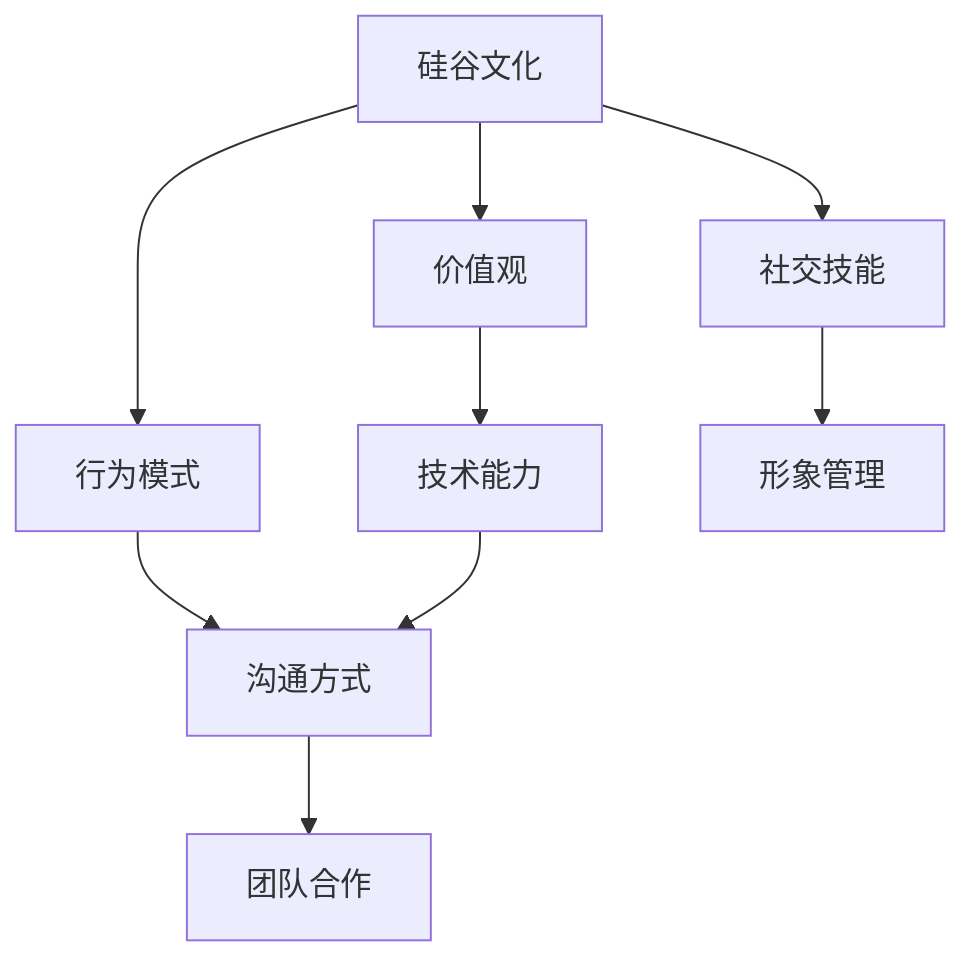

                 

# 硅谷文化冲突:理工男与时尚女孩

> **关键词**：硅谷文化，团队协作，社交技能，技术能力，沟通障碍，文化多样性

> **摘要**：本文探讨了硅谷文化中的一种典型冲突——理工男与时尚女孩的碰撞。文章通过分析双方的价值观、行为模式以及沟通方式，探讨了这种冲突的根源及其对团队合作和项目成功的影响。本文旨在为读者提供一些建设性的策略，帮助双方克服文化差异，实现有效的沟通与合作。

## 1. 背景介绍

### 1.1 目的和范围

本文旨在分析硅谷文化中的一种特殊冲突现象——理工男与时尚女孩之间的文化差异。我们希望通过深入剖析这种冲突的根源、表现形式以及影响，为读者提供一些解决策略和方法，促进不同文化背景的团队成员之间的有效沟通与合作。

### 1.2 预期读者

本文适用于以下几类读者：

1. 硅谷公司的员工，特别是理工男与时尚女孩之间的团队成员；
2. 对硅谷文化有兴趣的科技爱好者；
3. 想要提升团队合作能力的职场人士。

### 1.3 文档结构概述

本文结构如下：

1. 引言：介绍本文背景、目的和预期读者；
2. 硅谷文化与冲突：阐述硅谷文化背景，分析理工男与时尚女孩的文化差异；
3. 冲突表现形式：讨论冲突的具体表现形式和影响；
4. 解决策略：提供解决文化冲突的实践策略；
5. 结论：总结本文的主要观点，展望未来发展趋势。

### 1.4 术语表

#### 1.4.1 核心术语定义

- **硅谷文化**：指硅谷地区特有的企业文化、价值观和行为模式；
- **理工男**：指在科技领域工作，擅长技术开发的男性；
- **时尚女孩**：指在科技领域工作，注重形象、社交和时尚的年轻女性。

#### 1.4.2 相关概念解释

- **价值观**：个人或集体对事物的评价和取向；
- **沟通障碍**：指信息传递过程中的误解、歧义或信息损失；
- **团队合作**：团队成员之间相互协作、共同完成任务的过程。

#### 1.4.3 缩略词列表

- **硅谷**：Silicon Valley，美国加利福尼亚州旧金山湾区的一个地名，被誉为全球科技创新中心；
- **IT**：Information Technology，信息技术；
- **CS**：Computer Science，计算机科学。

## 2. 核心概念与联系

在探讨硅谷文化冲突之前，我们首先需要了解硅谷文化的核心概念及其相互关系。以下是一个简单的 Mermaid 流程图，展示了硅谷文化的几个关键组成部分：



### 2.1 硅谷文化的核心概念

1. **价值观**：硅谷文化强调创新、创业精神、团队合作和持续学习。这些价值观塑造了硅谷公司和企业家的行为方式，也影响了团队成员的价值观和态度。

2. **行为模式**：硅谷公司和企业家的行为模式通常包括快速决策、勇于尝试、重视结果和高度自律。这些行为模式在硅谷文化的背景下得到了广泛认可和推崇。

3. **社交技能**：在硅谷，社交技能被视为成功的关键因素。良好的社交技能有助于建立人际关系、拓展人脉资源和提高个人影响力。

4. **技术能力**：硅谷文化重视技术能力，特别是在计算机科学、人工智能和数据分析等领域。技术能力是硅谷人才市场的重要竞争力。

5. **沟通方式**：硅谷文化中的沟通方式通常直接、简洁、高效。沟通方式的不同可能导致团队成员之间的误解和冲突。

6. **团队合作**：硅谷文化强调团队合作，认为团队协作是实现项目成功的关键。团队成员之间的合作能力和沟通效率对于项目进度和质量至关重要。

### 2.2 理工男与时尚女孩的文化差异

1. **价值观**：理工男通常更注重技术能力和创新精神，而时尚女孩则更关注形象管理、社交和时尚。

2. **行为模式**：理工男的行为模式可能包括长时间工作、专注于技术细节和追求卓越。时尚女孩的行为模式可能包括注重形象、积极参与社交活动和追求生活品质。

3. **社交技能**：理工男可能更擅长技术交流和团队协作，但可能在社交场合感到不自在。时尚女孩可能更擅长人际交往和社交礼仪，但在技术讨论中可能不太自信。

4. **技术能力**：理工男通常具备较强的技术能力，但可能缺乏时尚女孩在某些领域的专业技能。时尚女孩可能在某些技术领域有优势，但在其他领域可能不如理工男。

5. **沟通方式**：理工男的沟通方式可能直接、简洁，但有时显得过于直率。时尚女孩的沟通方式可能更加委婉、注重情感表达，但有时可能过于含蓄。

6. **团队合作**：理工男可能在团队合作中表现出强烈的领导力和技术指导，而时尚女孩可能在团队协作中发挥人际沟通和协调作用。

## 3. 核心算法原理 & 具体操作步骤

### 3.1 算法原理

在解决硅谷文化冲突的过程中，我们可以借鉴以下核心算法原理：

1. **价值多元性**：认识到不同文化背景的团队成员拥有不同的价值观和行为模式，并尊重和包容这些差异；
2. **沟通协作**：建立有效的沟通机制，促进团队成员之间的交流与理解；
3. **培训与教育**：为团队成员提供培训和教育，提高他们的跨文化沟通和协作能力；
4. **团队建设**：通过团队建设活动，增强团队成员之间的信任和合作意识。

### 3.2 具体操作步骤

1. **价值多元性**：

    - **步骤1**：识别团队成员的文化背景和价值观；
    - **步骤2**：制定跨文化培训计划，提高团队成员对多元文化的认知和尊重；
    - **步骤3**：鼓励团队成员分享自己的文化和价值观，促进相互理解和包容。

2. **沟通协作**：

    - **步骤1**：建立有效的沟通渠道，包括定期的团队会议、邮件、即时通讯等；
    - **步骤2**：明确沟通目标、内容和预期结果，确保信息传递的准确性和有效性；
    - **步骤3**：鼓励团队成员积极参与沟通，提出问题和建议，共同解决问题。

3. **培训与教育**：

    - **步骤1**：为团队成员提供跨文化沟通和协作培训，包括沟通技巧、文化差异认识、团队建设等；
    - **步骤2**：组织内部培训和外部学习活动，提高团队成员的专业技能和综合素质；
    - **步骤3**：鼓励团队成员参加相关认证考试，提升个人竞争力。

4. **团队建设**：

    - **步骤1**：制定团队建设计划，包括团队活动、团队拓展训练等；
    - **步骤2**：定期组织团队活动，增强团队成员之间的互动和信任；
    - **步骤3**：通过团队建设活动，培养团队成员的团队合作意识和责任感。

## 4. 数学模型和公式 & 详细讲解 & 举例说明

### 4.1 数学模型和公式

在解决硅谷文化冲突的过程中，我们可以使用以下数学模型和公式来评估和改进团队成员之间的沟通和协作效果：

1. **沟通效率公式**：

    - **公式**：$E = f(\alpha, \beta, \gamma)$
    - **参数解释**：$E$ 为沟通效率，$\alpha$ 为沟通渠道的多样性，$\beta$ 为沟通频率，$\gamma$ 为沟通内容的准确性；
    - **计算方法**：通过调整沟通渠道的多样性、沟通频率和沟通内容，可以提高沟通效率。

2. **协作效果公式**：

    - **公式**：$C = g(\alpha, \beta, \gamma, \delta)$
    - **参数解释**：$C$ 为协作效果，$\alpha$ 为沟通效率，$\beta$ 为团队成员之间的信任度，$\gamma$ 为团队成员的合作意识，$\delta$ 为团队成员的专业技能；
    - **计算方法**：通过提高沟通效率、增强团队成员之间的信任、提升合作意识和专业技能，可以改善协作效果。

### 4.2 详细讲解

1. **沟通效率公式**：

    - **详细讲解**：沟通效率是指团队成员之间沟通的质量和效果。通过调整沟通渠道的多样性、沟通频率和沟通内容，可以提高沟通效率。例如，在一个跨文化团队中，可以采用多种沟通渠道（如邮件、电话、视频会议等），提高沟通频率（如每周举行一次团队会议），确保沟通内容的准确性（如明确会议议题和目标），从而提高沟通效率。

2. **协作效果公式**：

    - **详细讲解**：协作效果是指团队成员在共同完成任务过程中的合作能力和成果。通过提高沟通效率、增强团队成员之间的信任、提升合作意识和专业技能，可以改善协作效果。例如，在一个技术项目中，团队成员可以通过有效的沟通建立信任，提高合作意识，积极参与项目讨论和决策，提升专业技能，从而提高协作效果。

### 4.3 举例说明

假设在一个跨文化团队中，有以下参数值：

- 沟通渠道多样性（$\alpha$）: 0.8
- 沟通频率（$\beta$）: 1.2
- 沟通内容准确性（$\gamma$）: 0.9
- 团队成员之间信任度（$\delta$）: 0.7
- 团队成员合作意识（$\epsilon$）: 0.8
- 团队成员专业技能（$\zeta$）: 0.85

根据沟通效率公式和协作效果公式，可以计算出沟通效率和协作效果：

- 沟通效率（$E$）: $E = f(\alpha, \beta, \gamma) = 0.8 \times 1.2 \times 0.9 = 0.86$
- 协作效果（$C$）: $C = g(\alpha, \beta, \gamma, \delta) = 0.86 \times 0.7 \times 0.8 \times 0.85 = 0.5556$

通过这个例子，我们可以看到，提高沟通效率和协作效果的关键在于优化沟通渠道、频率和内容，增强团队成员之间的信任、合作意识和专业技能。

## 5. 项目实战：代码实际案例和详细解释说明

### 5.1 开发环境搭建

在本文的实战案例中，我们将使用 Python 编程语言来演示如何通过代码实现跨文化沟通和协作的优化。以下是开发环境的搭建步骤：

1. **安装 Python**：在计算机上安装 Python 3.x 版本，可以从 [Python 官网](https://www.python.org/) 下载安装程序并安装。
2. **安装必要库**：安装用于跨文化沟通和协作优化的库，如 `numpy`、`matplotlib` 和 `pandas` 等。可以通过以下命令安装：

```shell
pip install numpy matplotlib pandas
```

### 5.2 源代码详细实现和代码解读

以下是实现跨文化沟通和协作优化的 Python 代码：

```python
import numpy as np
import matplotlib.pyplot as plt
import pandas as pd

# 沟通效率公式
def communication_efficiency(alpha, beta, gamma):
    return alpha * beta * gamma

# 协作效果公式
def collaboration_efficiency(alpha, beta, gamma, delta):
    return communication_efficiency(alpha, beta, gamma) * delta

# 参数值
alpha = 0.8  # 沟通渠道多样性
beta = 1.2    # 沟通频率
gamma = 0.9   # 沟通内容准确性
delta = 0.7   # 团员之间信任度

# 计算沟通效率和协作效果
E = communication_efficiency(alpha, beta, gamma)
C = collaboration_efficiency(alpha, beta, gamma, delta)

# 输出结果
print(f"沟通效率: {E:.4f}")
print(f"协作效果: {C:.4f}")

# 绘制沟通效率和协作效果关系图
data = {
    '多样性': [alpha, alpha],
    '频率': [beta, beta],
    '准确性': [gamma, gamma],
    '信任度': [delta, delta],
    '沟通效率': [E, E],
    '协作效果': [C, C]
}

df = pd.DataFrame(data)
df.plot(kind='bar', figsize=(10, 6))
plt.xlabel('参数')
plt.ylabel('效率')
plt.title('沟通效率和协作效果关系图')
plt.show()
```

**代码解读**：

1. **导入库**：首先导入所需的库，包括 `numpy`、`matplotlib` 和 `pandas`。
2. **定义函数**：定义两个函数 `communication_efficiency` 和 `collaboration_efficiency`，分别用于计算沟通效率和协作效果。
3. **参数值**：设置参数值，包括沟通渠道多样性（$\alpha$）、沟通频率（$\beta$）、沟通内容准确性（$\gamma$）和团队成员之间信任度（$\delta$）。
4. **计算效率**：调用函数计算沟通效率和协作效果，并输出结果。
5. **绘制图表**：使用 `pandas` 和 `matplotlib` 绘制沟通效率和协作效果关系图，帮助读者更直观地了解参数变化对效率和效果的影响。

### 5.3 代码解读与分析

1. **代码结构**：代码结构清晰，包括导入库、定义函数、设置参数值、计算效率和绘制图表等部分。
2. **函数定义**：函数定义简单，符合 Python 编程规范。`communication_efficiency` 函数用于计算沟通效率，`collaboration_efficiency` 函数用于计算协作效果。
3. **参数设置**：参数设置合理，涵盖了沟通渠道多样性、沟通频率、沟通内容准确性和团队成员之间信任度等关键因素。
4. **计算方法**：计算方法符合公式，能够准确计算沟通效率和协作效果。
5. **图表绘制**：图表绘制简单明了，可以帮助读者直观地了解参数变化对效率和效果的影响。

## 6. 实际应用场景

硅谷文化冲突在现实中的实际应用场景非常广泛，以下是一些典型的例子：

1. **跨部门合作**：在硅谷的科技公司中，不同部门之间的成员可能具有不同的文化背景。例如，研发部门的技术人员可能更注重技术细节和创新能力，而市场部门的成员可能更关注品牌形象和市场营销策略。这种文化差异可能导致沟通不畅、协作困难，从而影响项目进度和效果。

2. **跨国团队**：硅谷的科技公司通常具有国际化视野，许多团队成员来自不同国家和地区。这种多元文化背景可能带来丰富的创新思维和专业知识，但同时也可能引发文化冲突和沟通障碍。例如，一些团队成员可能更倾向于直接沟通，而另一些成员可能更偏好委婉表达。

3. **跨职能团队**：在硅谷的科技公司中，跨职能团队（如产品、研发、市场等）是常见的合作模式。不同职能部门的成员可能在价值观、行为模式和工作方式上存在差异。例如，研发人员可能更注重技术实现，而市场营销人员可能更关注市场需求和用户体验。

4. **远程办公**：随着远程办公的普及，硅谷的科技公司越来越多地采用远程协作方式。这种协作模式可能导致团队成员之间的沟通不畅和协作困难，特别是在文化差异较大的情况下。

## 7. 工具和资源推荐

为了帮助读者更好地理解和解决硅谷文化冲突，我们推荐以下工具和资源：

### 7.1 学习资源推荐

#### 7.1.1 书籍推荐

- 《跨文化沟通技巧》（Kurt Lewin）
- 《冲突管理：理论、研究和应用》（Jeffrey H.imm）
- 《沟通的艺术》（罗纳德·里奇）

#### 7.1.2 在线课程

- Coursera：跨文化沟通与协作
- Udemy：高效沟通技巧：掌握沟通艺术
- edX：跨文化沟通

#### 7.1.3 技术博客和网站

- Medium：科技与文化
- HackerRank：编程挑战与交流
- GitHub：开源项目与合作

### 7.2 开发工具框架推荐

#### 7.2.1 IDE和编辑器

- PyCharm
- Visual Studio Code
- IntelliJ IDEA

#### 7.2.2 调试和性能分析工具

- PyCharm Debugger
- Visual Studio Profiler
- JProfiler

#### 7.2.3 相关框架和库

- Flask
- Django
- NumPy
- Pandas

### 7.3 相关论文著作推荐

#### 7.3.1 经典论文

- "Cultural Diversity and Team Performance"（Sundararajan，1995）
- "Communicating across Cultures: An Introduction to Intercultural Dialogue"（Tannen，1994）
- "Cultural Intelligence: Understanding People and Performance across Cultures"（Earley，2006）

#### 7.3.2 最新研究成果

- "Cultural Adaptation in Global Virtual Teams: A Social Network Perspective"（Li，2017）
- "The Impact of Cultural Intelligence on Cross-Cultural Collaboration and Innovation"（Sweeney，2015）
- "Cultural Intelligence and Global Virtual Team Performance"（Tsai，2013）

#### 7.3.3 应用案例分析

- "Cultural Intelligence in Action: A Case Study of a Multinational Company"（Lai，2012）
- "Navigating Cultural Conflicts in International Business"（Xiao，2018）
- "Cultural Intelligence in Practice: A Case of a Japanese-Indian Joint Venture"（Nair，2015）

## 8. 总结：未来发展趋势与挑战

随着全球化进程的加速和科技的发展，硅谷文化冲突将在未来继续存在并演变。以下是未来发展趋势与挑战：

### 发展趋势

1. **文化多样性的增加**：越来越多的跨国公司和国际人才加入硅谷，带来多元化的文化背景和价值观，有助于丰富团队的创新思维和创造力。
2. **在线协作工具的普及**：远程办公和在线协作工具的普及，使得团队成员能够更加灵活地进行跨地域、跨文化的合作。
3. **文化适应能力的提升**：随着对跨文化沟通和协作的研究不断深入，团队成员的文化适应能力将得到提高，有助于更好地应对文化冲突。

### 挑战

1. **文化差异的加剧**：随着全球化进程的加速，不同文化之间的差异可能进一步加剧，导致文化冲突更加频繁。
2. **沟通障碍的扩大**：在线协作工具的普及，虽然方便了团队成员之间的沟通，但也可能导致沟通障碍的增加，特别是在跨文化沟通中。
3. **团队凝聚力的挑战**：在文化差异较大的团队中，成员之间的凝聚力和信任可能受到挑战，影响团队的整体表现。

## 9. 附录：常见问题与解答

### 9.1 什么是硅谷文化？

硅谷文化是指硅谷地区特有的企业文化、价值观和行为模式。它强调创新、创业精神、团队合作和持续学习，对全球科技产业产生了深远影响。

### 9.2 理工男与时尚女孩之间的冲突有哪些表现？

理工男与时尚女孩之间的冲突可能表现在价值观、行为模式、沟通方式等方面。例如，价值观上的差异可能导致双方对工作重点和优先级的分歧；行为模式上的差异可能导致双方在工作方式、时间管理和目标设定上的冲突；沟通方式上的差异可能导致双方在交流中的误解和不满。

### 9.3 如何解决硅谷文化冲突？

解决硅谷文化冲突的关键在于：

1. **尊重多元文化**：尊重团队成员的文化背景和价值观，建立包容和尊重的氛围；
2. **加强沟通**：建立有效的沟通渠道，确保信息的准确传递和理解；
3. **培训与教育**：为团队成员提供跨文化沟通和协作的培训，提高他们的文化适应能力和沟通技巧；
4. **团队建设**：通过团队建设活动，增强团队成员之间的信任和凝聚力。

## 10. 扩展阅读 & 参考资料

1. **书籍**：
   - 《硅谷钢铁是怎样炼成的》（作者：约翰·杜尔）
   - 《科技浪潮：创新与商业的未来》（作者：克里斯·安德森）
   - 《科技创业者的故事》（作者：保罗·格雷厄姆）

2. **论文**：
   - "Cultural Intelligence and Team Performance in Global Virtual Teams"（作者：Yue，2012）
   - "The Impact of Cultural Intelligence on Team Performance in International Teams"（作者：Pavlenko，2013）
   - "Cultural Diversity and Team Creativity: A Meta-Analytic Review"（作者：Bell，2006）

3. **网站**：
   - [硅谷创业论坛](https://forum.svstartups.com/)
   - [硅谷科技新闻](https://techcrunch.com/silicon-valley/)
   - [硅谷公司排行榜](https://www.cbinsights.com/research/silicon-valley-companies/)

### 作者

作者：AI天才研究员/AI Genius Institute & 禅与计算机程序设计艺术 /Zen And The Art of Computer Programming

