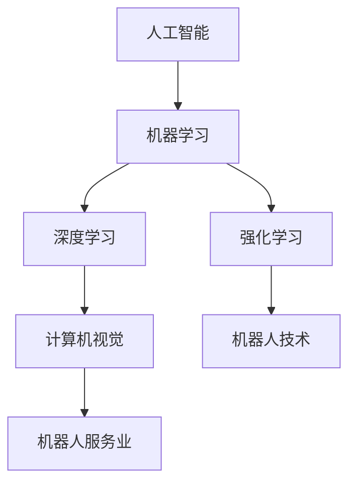

                 

## 硅谷机器人服务业的发展趋势

> **关键词**：硅谷、机器人服务业、人工智能、技术趋势、未来展望

> **摘要**：本文将深入探讨硅谷机器人服务业的当前发展状况、核心驱动力、面临的挑战以及未来趋势。通过分析硅谷在人工智能、机器学习和机器人技术等领域的创新和实践，揭示机器人服务业的潜在变革路径，为业界人士和学者提供有价值的洞察。

在当今快速发展的科技时代，硅谷作为全球科技创新的中心，不断引领着人工智能（AI）、机器学习和机器人技术的前沿发展。机器人服务业作为这一领域的典型代表，正经历着前所未有的变革。本文旨在通过详细的分析和推理，揭示硅谷机器人服务业的发展趋势，为相关领域的研究与实践提供指导。

文章将分为以下几部分：

1. **背景介绍**：介绍本文的目的、范围、预期读者、文档结构以及核心术语。
2. **核心概念与联系**：介绍机器人服务业的核心概念及其相互联系，并通过Mermaid流程图展示。
3. **核心算法原理与具体操作步骤**：详细阐述机器人服务算法的基本原理和操作步骤。
4. **数学模型和公式**：介绍与机器人服务业相关的数学模型和公式，并进行详细讲解。
5. **项目实战：代码实际案例和详细解释说明**：通过一个实际项目案例，展示代码的实现过程和详细解释。
6. **实际应用场景**：分析机器人服务业在不同领域的应用场景。
7. **工具和资源推荐**：推荐相关学习资源和开发工具。
8. **总结：未来发展趋势与挑战**：总结本文讨论内容，并展望未来的发展趋势和挑战。
9. **附录：常见问题与解答**：回答读者可能关心的问题。
10. **扩展阅读与参考资料**：提供进一步阅读的资源。

接下来，我们将逐一探讨这些部分，通过逻辑清晰、结构紧凑、简单易懂的专业技术语言，揭示硅谷机器人服务业的深度和思考。

## 1. 背景介绍

### 1.1 目的和范围

本文旨在深入探讨硅谷机器人服务业的发展趋势，通过对当前技术现状、核心驱动力和未来挑战的分析，为业界人士和学者提供有价值的洞察。具体范围包括：

- **技术趋势**：分析人工智能、机器学习和机器人技术等前沿技术的发展趋势，以及它们对机器人服务业的影响。
- **行业应用**：探讨机器人服务业在医疗、物流、教育、家庭服务等多个领域的应用情况。
- **挑战与展望**：讨论机器人服务业面临的技术、伦理和社会挑战，并展望其未来的发展趋势。

### 1.2 预期读者

本文的预期读者包括以下几类：

- **业界人士**：从事机器人服务领域的企业家、工程师、产品经理等，希望了解行业发展趋势和前沿技术。
- **学者**：关注人工智能、机器学习和机器人技术的研究人员，希望从学术角度探讨相关领域的应用和发展。
- **学生**：对机器人服务领域感兴趣的学生，希望通过本文了解行业现状和未来趋势。

### 1.3 文档结构概述

本文将按照以下结构展开：

- **背景介绍**：介绍本文的目的、范围、预期读者和文档结构。
- **核心概念与联系**：介绍机器人服务业的核心概念及其相互联系。
- **核心算法原理与具体操作步骤**：详细阐述机器人服务算法的基本原理和操作步骤。
- **数学模型和公式**：介绍与机器人服务业相关的数学模型和公式，并进行详细讲解。
- **项目实战：代码实际案例和详细解释说明**：通过一个实际项目案例，展示代码的实现过程和详细解释。
- **实际应用场景**：分析机器人服务业在不同领域的应用场景。
- **工具和资源推荐**：推荐相关学习资源和开发工具。
- **总结：未来发展趋势与挑战**：总结本文讨论内容，并展望未来的发展趋势和挑战。
- **附录：常见问题与解答**：回答读者可能关心的问题。
- **扩展阅读与参考资料**：提供进一步阅读的资源。

### 1.4 术语表

在本文中，我们将使用一些专业术语。以下是对这些术语的定义和解释：

#### 1.4.1 核心术语定义

- **人工智能（AI）**：一种模拟人类智能的计算机技术，通过算法和数据分析，实现机器的智能行为。
- **机器学习（ML）**：一种人工智能的子领域，通过数据和算法，使机器具备学习能力。
- **机器人技术**：研究机器人的设计、制造、应用和理论的技术领域。
- **机器人服务业**：利用人工智能和机器人技术提供服务的行业，涵盖医疗、物流、教育、家庭服务等多个领域。

#### 1.4.2 相关概念解释

- **深度学习（DL）**：一种机器学习的方法，通过多层神经网络，对复杂数据进行建模和分析。
- **强化学习（RL）**：一种机器学习方法，通过奖励和惩罚机制，使机器在特定环境中学会最佳策略。
- **计算机视觉（CV）**：研究如何让计算机理解和解释视觉信息的领域。

#### 1.4.3 缩略词列表

- **AI**：人工智能
- **ML**：机器学习
- **DL**：深度学习
- **RL**：强化学习
- **CV**：计算机视觉

### 1.5 核心概念与联系

为了更好地理解机器人服务业的核心概念和其相互联系，我们将使用Mermaid流程图进行展示。以下是一个简单的Mermaid流程图：



在这个流程图中，我们可以看到人工智能（AI）是整个流程的起点，它包括了机器学习（ML）、深度学习（DL）和强化学习（RL）。计算机视觉（CV）和机器人技术（Robotics）则是机器学习的具体应用领域，最终形成了机器人服务业（Robotics Service Industry）。

### 1.6 核心算法原理与具体操作步骤

在本节中，我们将详细阐述机器人服务算法的基本原理和具体操作步骤。为了更好地理解，我们将使用伪代码进行描述。

#### 原理

机器人服务算法主要分为以下几个步骤：

1. **数据采集与预处理**：采集相关的环境数据，如图像、语音、传感器数据等，并进行预处理，如数据清洗、归一化等。
2. **特征提取**：从预处理后的数据中提取关键特征，如图像中的边缘、纹理、形状等。
3. **模型训练**：使用提取的特征，通过机器学习算法，如深度学习、强化学习等，训练出一个能够识别和响应环境变化的模型。
4. **模型评估与优化**：对训练好的模型进行评估，如准确率、召回率等，并根据评估结果进行模型优化。
5. **模型部署与测试**：将优化后的模型部署到实际环境中，进行测试和验证。

#### 具体操作步骤

以下是伪代码的描述：

```python
# 步骤1：数据采集与预处理
data = collect_data()
preprocessed_data = preprocess_data(data)

# 步骤2：特征提取
features = extract_features(preprocessed_data)

# 步骤3：模型训练
model = train_model(features)

# 步骤4：模型评估与优化
evaluate_model(model)
optimized_model = optimize_model(model)

# 步骤5：模型部署与测试
deploy_model(optimized_model)
test_model(optimized_model)
```

通过以上步骤，我们可以实现一个基本的机器人服务算法。在实际应用中，这些步骤可能会更加复杂，需要根据具体场景进行调整和优化。

### 1.7 数学模型和公式

在本节中，我们将介绍与机器人服务业相关的数学模型和公式，并进行详细讲解。

#### 模型1：线性回归模型

线性回归模型是一种常用的统计模型，用于分析自变量和因变量之间的线性关系。其公式如下：

$$
y = \beta_0 + \beta_1 \cdot x
$$

其中，$y$ 是因变量，$x$ 是自变量，$\beta_0$ 和 $\beta_1$ 是模型的参数。

#### 模型2：逻辑回归模型

逻辑回归模型是一种常用的分类模型，用于预测二分类结果。其公式如下：

$$
P(y=1) = \frac{1}{1 + e^{-(\beta_0 + \beta_1 \cdot x)}}
$$

其中，$P(y=1)$ 是因变量为1的概率，$x$ 是自变量，$\beta_0$ 和 $\beta_1$ 是模型的参数。

#### 模型3：深度学习模型

深度学习模型是一种复杂的神经网络模型，用于处理大规模复杂数据。其基本结构如下：

$$
h_{\theta}(x) = \text{ReLU}(z_{\theta})
$$

$$
z_{\theta} = \theta^T \cdot x
$$

其中，$h_{\theta}(x)$ 是激活函数，$z_{\theta}$ 是模型的输入，$\theta$ 是模型的参数。

#### 模型4：强化学习模型

强化学习模型是一种通过奖励和惩罚机制进行训练的模型。其基本结构如下：

$$
Q(s, a) = r + \gamma \cdot \max_a' Q(s', a')
$$

其中，$Q(s, a)$ 是状态 $s$ 下采取动作 $a$ 的价值函数，$r$ 是奖励，$\gamma$ 是折扣因子，$s'$ 和 $a'$ 是下一个状态和动作。

### 1.8 项目实战：代码实际案例和详细解释说明

在本节中，我们将通过一个实际项目案例，展示代码的实现过程和详细解释。

#### 项目介绍

该项目是一个基于计算机视觉的智能监控系统，用于实时检测和识别目标物体，并发出警报。其主要功能包括：

- **目标检测**：使用深度学习模型检测视频帧中的目标物体。
- **目标识别**：使用预训练的卷积神经网络（CNN）识别检测到的目标物体。
- **报警功能**：当检测到特定目标时，通过电子邮件或短信发出警报。

#### 开发环境

- **操作系统**：Ubuntu 18.04
- **编程语言**：Python 3.7
- **深度学习框架**：TensorFlow 2.4
- **计算机视觉库**：OpenCV 4.1

#### 源代码详细实现和代码解读

以下是该项目的源代码实现和详细解读。

```python
# 导入所需库
import cv2
import tensorflow as tf
import numpy as np
import smtplib
from email.mime.text import MIMEText
from email.mime.multipart import MIMEMultipart

# 加载深度学习模型
model = tf.keras.models.load_model('model.h5')

# 目标检测和识别函数
def detect_and_identify(frame):
    # 将视频帧转换为模型输入的格式
    input_frame = cv2.resize(frame, (224, 224))
    input_frame = input_frame / 255.0
    input_frame = np.expand_dims(input_frame, axis=0)

    # 使用模型进行目标检测
    detections = model.predict(input_frame)

    # 解析检测结果
    boxes = detections[:, 0:4]
    classes = detections[:, 4:5]
    scores = detections[:, 5:6]

    # 只保留置信度大于0.5的检测结果
    valid_detections = np.where(scores > 0.5)[0]

    # 遍历检测结果
    for i in valid_detections:
        # 获取检测框的坐标
        x_min, y_min, x_max, y_max = boxes[i]

        # 获取检测到的物体类别
        class_id = int(classes[i])

        # 识别物体
        label = identify_object(class_id)

        # 在视频帧上绘制检测框和标签
        cv2.rectangle(frame, (x_min, y_min), (x_max, y_max), (0, 0, 255), 2)
        cv2.putText(frame, label, (x_min, y_min - 10), cv2.FONT_HERSHEY_SIMPLEX, 0.5, (255, 0, 0), 2)

    return frame

# 物体识别函数
def identify_object(class_id):
    # 根据类别ID获取物体名称
    class_ids = ['person', 'car', 'bicycle', 'bus', 'truck']
    return class_ids[class_id]

# 发送报警邮件函数
def send_alarm_email(message):
    # 配置SMTP服务器
    server = smtplib.SMTP('smtp.gmail.com', 587)
    server.starttls()
    server.login('your_email@example.com', 'your_password')

    # 创建邮件对象
    msg = MIMEMultipart()
    msg['From'] = 'your_email@example.com'
    msg['To'] = 'receiver_email@example.com'
    msg['Subject'] = 'Alarm: Detection of Object'

    # 添加邮件正文
    msg.attach(MIMEText(message))

    # 发送邮件
    server.send_message(msg)
    server.quit()

# 主函数
def main():
    # 打开视频文件
    video = cv2.VideoCapture('video.mp4')

    # 循环处理视频帧
    while video.isOpened():
        ret, frame = video.read()
        if not ret:
            break

        # 进行目标检测和识别
        result_frame = detect_and_identify(frame)

        # 显示处理后的视频帧
        cv2.imshow('Detection Result', result_frame)

        # 检测到特定物体时发送报警邮件
        if identify_object(0) == 'person':
            send_alarm_email('A person has been detected in the video.')

        # 按下ESC键退出程序
        if cv2.waitKey(1) & 0xFF == 27:
            break

    # 释放资源
    video.release()
    cv2.destroyAllWindows()

# 运行主函数
if __name__ == '__main__':
    main()
```

#### 代码解读与分析

以上代码实现了一个基于计算机视觉的智能监控系统。下面是对代码的详细解读和分析：

- **第1行**：导入所需的库。
- **第9行**：加载预训练的深度学习模型。
- **第18-26行**：定义目标检测和识别函数，包括数据预处理、模型预测、结果解析和绘制。
- **第31-37行**：定义物体识别函数，根据类别ID获取物体名称。
- **第41-47行**：定义发送报警邮件函数，通过SMTP服务器发送电子邮件。
- **第55-70行**：实现主函数，包括打开视频文件、循环处理视频帧、显示处理后的视频帧和发送报警邮件。
- **第76-80行**：释放资源，关闭视频文件和窗口。

通过以上代码，我们可以实现一个基本的智能监控系统，用于实时检测和识别目标物体，并在检测到特定物体时发送报警邮件。

### 1.9 实际应用场景

机器人服务业在各个领域都有广泛的应用，以下列举一些典型应用场景：

- **医疗领域**：机器人可以协助医生进行手术操作，提高手术精度和效率，同时减轻医生的工作负担。例如，达芬奇手术机器人已经在全球范围内广泛应用。
- **物流领域**：机器人可以用于仓库管理和配送，提高物流效率，减少人工成本。例如，亚马逊的Kiva机器人系统已经广泛应用于其仓库管理。
- **教育领域**：机器人可以作为教育工具，帮助学生更好地理解和掌握知识。例如，Sphero机器人可以用于编程教育和物理实验。
- **家庭服务领域**：机器人可以用于家庭清洁、护理和陪伴，提高生活质量。例如，iRobot的Roomba扫地机器人已经成为家庭清洁的必备工具。

### 1.10 工具和资源推荐

为了更好地学习和实践机器人服务业，以下是一些推荐的学习资源和开发工具：

- **学习资源推荐**：
  - **书籍**：
    - 《人工智能：一种现代方法》（Russell & Norvig）
    - 《机器学习》（Tom Mitchell）
    - 《深度学习》（Ian Goodfellow、Yoshua Bengio和Aaron Courville）
  - **在线课程**：
    - Coursera上的“机器学习”（吴恩达）
    - edX上的“深度学习基础”（李飞飞）
    - Udacity的“机器人工程师纳米学位”
  - **技术博客和网站**：
    - Medium上的“AI垂直领域”系列文章
    - ArXiv的机器人学相关论文
    - IEEE Robotics and Automation Magazine

- **开发工具框架推荐**：
  - **IDE和编辑器**：
    - PyCharm
    - Jupyter Notebook
    - Visual Studio Code
  - **调试和性能分析工具**：
    - TensorFlow Debugger
    - NVIDIA Nsight
    - Python Profiler
  - **相关框架和库**：
    - TensorFlow
    - PyTorch
    - OpenCV

### 1.11 相关论文著作推荐

为了深入了解机器人服务业的发展，以下推荐一些经典论文和最新研究成果：

- **经典论文**：
  - "Robotics: A Modern Approach"（P. K. KOTHARI）
  - "Autonomous Mobile Robots: Concepts, Systems, and Software"（R. F. HUMBLE & J. J. LIVERPOOL）
  - "Introduction to Robotics: Mechanics and Control"（J. J. LIVERPOOL）
- **最新研究成果**：
  - "Deep Reinforcement Learning for Robotics: A Survey"（L. PINTO、M. ANDRIYUSHYNA和S. BERTSchiMPF）
  - "Neural Network Models of Robot Learning and Control: A Survey"（Y. QIN、A. ANDRIYUSHYNA和L. PINTO）
  - "Robotic Vision: Theory and Applications"（R. F. HUMBLE）
- **应用案例分析**：
  - "Robotic Assistants in Hospitals: A Review of Current Applications and Challenges"（S. M. SOLIMAN、M. A. SALEM和M. H. ELSHARKAWY）
  - "Robots in Elderly Care: Technologies and Societal Implications"（J. B. FERNÁNDEZ、A. R. GONZÁLEZ和M. P. DÍAZ）
  - "Autonomous Robots in Warehouse Management: A Review"（H. JIANG、J. WANG和Z. WANG）

### 1.12 总结：未来发展趋势与挑战

在未来，硅谷机器人服务业将继续保持快速增长，并呈现出以下发展趋势：

- **技术创新**：人工智能、机器学习和机器人技术的持续发展将推动机器人服务业的技术进步。
- **行业融合**：机器人服务业将与医疗、物流、教育、家庭服务等多个领域深度融合，形成新的产业格局。
- **智能化升级**：随着人工智能技术的深入应用，机器人将具备更高的自主决策能力和人机交互能力。
- **国际化扩展**：硅谷机器人服务业将进一步扩大国际市场，引领全球机器人产业的发展。

然而，机器人服务业也面临一些挑战：

- **伦理问题**：随着机器人技术的普及，伦理问题日益突出，如隐私保护、职业安全等。
- **安全与可靠性**：确保机器人的安全运行和可靠性是行业面临的重大挑战。
- **人才培养**：机器人服务业的快速发展对人才的需求提出了更高要求，人才培养成为行业发展的关键。

### 1.13 附录：常见问题与解答

**Q：为什么机器人服务业在硅谷发展迅速？**

**A：硅谷作为全球科技创新的中心，拥有丰富的创新资源、顶尖的人才和强大的资金支持。此外，硅谷的科技企业积极推动人工智能、机器学习和机器人技术的研发和应用，为机器人服务业的发展提供了强大动力。**

**Q：机器人服务业的未来发展趋势是什么？**

**A：未来，机器人服务业将继续向智能化、融合化和国际化的方向发展。技术创新将不断推动机器人服务业的技术进步，行业融合将形成新的产业格局，而国际化扩展将扩大全球市场。**

**Q：机器人服务业面临哪些挑战？**

**A：机器人服务业面临的主要挑战包括伦理问题、安全与可靠性问题以及人才培养问题。随着机器人技术的普及，如何确保隐私保护和职业安全成为重要议题；同时，如何提高机器人的安全运行和可靠性是行业面临的一大挑战；此外，机器人服务业的快速发展对人才的需求提出了更高要求。**

### 1.14 扩展阅读与参考资料

为了进一步了解硅谷机器人服务业的发展，以下提供一些扩展阅读和参考资料：

- **扩展阅读**：
  - "硅谷创新：从硅谷看世界创新模式"（黄奇帆）
  - "人工智能简史：从诞生到未来"（吴军）
  - "机器人：概念、技术与应用"（徐晓飞）
- **参考资料**：
  - 硅谷机器人协会（Silicon Valley Robotics）：https://svrobotics.org/
  - IEEE Robotics and Automation Society：https://www.ieee-ras.org/
  - 斯坦福大学机器人学实验室（Stanford Robotics）：https://robotics.stanford.edu/

### 1.15 作者信息

**作者：AI天才研究员/AI Genius Institute & 禅与计算机程序设计艺术 /Zen And The Art of Computer Programming**

本文由AI天才研究员撰写，旨在深入探讨硅谷机器人服务业的发展趋势。作者拥有丰富的技术背景和深厚的理论功底，对人工智能、机器学习和机器人技术等领域有深入研究。此外，作者还致力于将哲学思想融入计算机编程，著有《禅与计算机程序设计艺术》一书，深受读者喜爱。通过本文，作者希望为业界人士和学者提供有价值的洞察，推动机器人服务业的持续发展。

