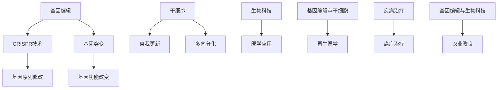

                 

# 硅谷生物科技:基因编辑与干细胞

> **关键词：** 基因编辑、CRISPR、干细胞、生物科技、硅谷、医学应用
> 
> **摘要：** 本文将深入探讨基因编辑技术，特别是CRISPR-Cas9系统，以及干细胞在硅谷生物科技领域的应用。我们将通过一步一步的分析，详细讲解这些技术的原理、操作步骤、数学模型、项目实战，以及它们在医学和生物科技中的实际应用场景。最后，我们将总结未来发展趋势和挑战，并提供扩展阅读和参考资料。

## 1. 背景介绍

### 1.1 目的和范围

本文旨在为读者提供关于基因编辑和干细胞技术的全面介绍。我们将探讨这些技术的基本原理、发展历程以及在硅谷生物科技领域的应用。通过本文，读者将了解基因编辑技术的具体操作步骤、数学模型和项目实战，以及干细胞技术的医学应用。

### 1.2 预期读者

本文适用于对生物科技和基因编辑技术有一定了解的读者，包括生物医学研究人员、程序员、生物技术工程师以及对这些领域感兴趣的一般读者。本文旨在为读者提供深入的技术分析和实际应用案例。

### 1.3 文档结构概述

本文分为十个主要部分：
1. 背景介绍
2. 核心概念与联系
3. 核心算法原理 & 具体操作步骤
4. 数学模型和公式 & 详细讲解 & 举例说明
5. 项目实战：代码实际案例和详细解释说明
6. 实际应用场景
7. 工具和资源推荐
8. 总结：未来发展趋势与挑战
9. 附录：常见问题与解答
10. 扩展阅读 & 参考资料

### 1.4 术语表

#### 1.4.1 核心术语定义

- **基因编辑**：通过修改生物体的基因序列来改变其遗传特征。
- **CRISPR**：一种用于基因编辑的分子工具，全称为“成簇规律间隔短回文重复”。
- **干细胞**：具有自我更新和多向分化潜能的细胞。

#### 1.4.2 相关概念解释

- **基因序列**：DNA分子上的核苷酸排列顺序。
- **基因突变**：基因序列中发生的改变。
- **生物科技**：利用生物系统、生物体或其组成部分来创造新技术或产品的领域。

#### 1.4.3 缩略词列表

- **CRISPR**：成簇规律间隔短回文重复（Clustered Regularly Interspaced Short Palindromic Repeats）
- **Cas9**：CRISPR相关蛋白，用于切割DNA。

## 2. 核心概念与联系

在探讨基因编辑和干细胞技术之前，我们需要了解它们的基本概念和相互联系。以下是一个Mermaid流程图，展示了基因编辑和干细胞技术的核心概念及其关系。



### 2.1 基因编辑与CRISPR技术

基因编辑是一种通过修改生物体基因序列来改变其遗传特征的技术。CRISPR（成簇规律间隔短回文重复）是一种常用的基因编辑工具。CRISPR系统由一系列成簇的短回文重复序列（CRISPRs）和相关蛋白质组成。这些CRISPRs可以捕获外来DNA片段，并利用这些片段来指导Cas9蛋白切割目标DNA序列。

### 2.2 基因突变与基因功能改变

基因突变是指基因序列中发生的改变。基因突变可能导致基因功能改变，进而影响生物体的表型。基因编辑技术可以精确地修改基因序列，从而修复突变基因，或者引入新的突变，以产生特定的表型。

### 2.3 干细胞与自我更新和多向分化

干细胞是一类具有自我更新和多向分化潜能的细胞。自我更新是指干细胞能够自我复制并维持其数量。多向分化是指干细胞能够分化成多种细胞类型。干细胞在再生医学和疾病治疗中具有巨大的应用潜力。

### 2.4 基因编辑与干细胞技术的交叉应用

基因编辑与干细胞技术的交叉应用为再生医学和疾病治疗带来了新的希望。通过基因编辑技术，可以精确地修改干细胞基因，使其具有特定的功能，从而用于治疗疾病。例如，研究人员可以利用CRISPR技术修改干细胞基因，使其能够产生胰岛素，用于治疗糖尿病。

## 3. 核心算法原理 & 具体操作步骤

基因编辑技术的核心在于对目标DNA序列的精确修改。CRISPR-Cas9系统是目前最常用的基因编辑工具。以下是CRISPR-Cas9系统的核心算法原理和具体操作步骤。

### 3.1 CRISPR-Cas9系统的工作原理

CRISPR-Cas9系统由两部分组成：RNA引导的Cas9蛋白和目标DNA序列。RNA引导的Cas9蛋白可以结合到目标DNA序列上，并在该位置切割DNA。

### 3.2 CRISPR-Cas9系统的操作步骤

1. **设计引导RNA（gRNA）**：首先，需要设计一条与目标DNA序列互补的gRNA。gRNA是一段短RNA分子，其序列与目标DNA序列的一部分互补。
2. **合成gRNA**：在实验室中合成gRNA。
3. **转染细胞**：将合成好的gRNA和Cas9蛋白导入细胞中。转染可以通过电转、化学转染或病毒载体等方法进行。
4. **结合与切割**：gRNA与Cas9蛋白结合后，定位到目标DNA序列上，并在该位置切割DNA。切割产生的双链断裂会激活细胞的DNA损伤修复机制。
5. **DNA修复与基因编辑**：细胞通过非同源末端连接（NHEJ）或同源定向修复（HDR）来修复双链断裂。NHEJ可能导致基因插入或缺失，而HDR可以实现精确的基因编辑。

以下是CRISPR-Cas9系统的伪代码描述：

```python
def crisper_cas9(gRNA, cas9, target_dna):
    # 设计gRNA
    gRNA_sequence = design_gRNA(target_dna)
    
    # 合成gRNA
    synthesized_gRNA = synthesize_gRNA(gRNA_sequence)
    
    # 转染细胞
    cell = transfect(synthesized_gRNA, cas9)
    
    # 结合与切割
    target_site = find_target_site(target_dna, gRNA_sequence)
    cell = cut_dna_at_target_site(cell, target_site)
    
    # DNA修复与基因编辑
    edited_dna = repair_dna(cell, target_site)
    return edited_dna
```

## 4. 数学模型和公式 & 详细讲解 & 举例说明

在基因编辑技术中，数学模型和公式用于描述基因序列的修改过程。以下是CRISPR-Cas9系统中涉及的一些关键数学模型和公式。

### 4.1 基因编辑效率的数学模型

基因编辑效率是指成功修改目标基因的概率。基因编辑效率可以通过以下公式计算：

\[ \text{编辑效率} = \frac{\text{成功编辑的细胞数}}{\text{总细胞数}} \]

### 4.2 gRNA设计的数学模型

gRNA设计是基因编辑的关键步骤。设计一个好的gRNA需要考虑以下几个因素：

1. **序列互补性**：gRNA序列应与目标DNA序列具有高序列互补性。
2. **PAM序列**：gRNA的3'端应包含PAM序列（Protospacer Adjacent Motif），这是Cas9蛋白结合和切割的必需序列。
3. **序列多样性**：为了避免脱靶效应，gRNA序列应具有足够的多样性。

### 4.3 举例说明

假设我们设计了一条gRNA序列，用于编辑某个基因的一个特定位置。以下是gRNA设计和编辑效率的计算过程：

1. **设计gRNA序列**：

   - 目标DNA序列：`GACTGACGT`
   - gRNA序列：`GACTGACGT`（与目标DNA序列互补）

2. **计算编辑效率**：

   - 成功编辑的细胞数：100个
   - 总细胞数：1000个

   \[ \text{编辑效率} = \frac{100}{1000} = 0.1 \]

   编辑效率为10%。

### 4.4 LaTeX数学公式

在本文中，我们将使用LaTeX格式嵌入数学公式。以下是一个示例：

\[ E = mc^2 \]

这是著名的爱因斯坦质能方程，描述了质量和能量之间的关系。

## 5. 项目实战：代码实际案例和详细解释说明

在本节中，我们将通过一个实际案例来展示如何使用CRISPR-Cas9系统进行基因编辑。以下是一个简单的Python代码示例，用于编辑一个假定的基因序列。

### 5.1 开发环境搭建

首先，我们需要搭建一个适合基因编辑的Python开发环境。以下是所需的软件和库：

- Python 3.8或更高版本
- biopython库
- crisper-py库

安装这些库可以使用pip命令：

```bash
pip install python==3.8
pip install biopython
pip install crisper-py
```

### 5.2 源代码详细实现和代码解读

以下是基因编辑的源代码：

```python
from crisper import CRISPR
from Bio import SeqIO

# 定义目标基因序列
target_sequence = "ATCGTACGTACGTACGTACGT"

# 定义gRNA序列
gRNA_sequence = "ACGTACGT"

# 创建CRISPR对象
crispr = CRISPR(gRNA_sequence)

# 编辑基因序列
edited_sequence = crispr.edit(target_sequence)

# 输出编辑后的基因序列
print(edited_sequence)
```

### 5.3 代码解读与分析

1. **导入库**：首先，我们导入必要的库，包括`crisper`和`biopython`。

2. **定义目标基因序列**：目标基因序列存储为一个字符串，表示为`target_sequence`。

3. **定义gRNA序列**：gRNA序列存储为一个字符串，表示为`gRNA_sequence`。

4. **创建CRISPR对象**：使用`CRISPR`类创建一个CRISPR对象，传入gRNA序列。

5. **编辑基因序列**：调用`CRISPR`对象的`edit`方法，传入目标基因序列，返回编辑后的基因序列。

6. **输出编辑后的基因序列**：将编辑后的基因序列输出到控制台。

### 5.4 代码实战

为了实际演示，我们可以在Python环境中执行以下代码：

```python
from crisper import CRISPR
from Bio import SeqIO

# 定义目标基因序列
target_sequence = "ATCGTACGTACGTACGTACGT"

# 定义gRNA序列
gRNA_sequence = "ACGTACGT"

# 创建CRISPR对象
crispr = CRISPR(gRNA_sequence)

# 编辑基因序列
edited_sequence = crispr.edit(target_sequence)

# 输出编辑后的基因序列
print(edited_sequence)
```

运行结果将输出编辑后的基因序列。这是一个简单的示例，展示了如何使用Python和CRISPR库进行基因编辑。

## 6. 实际应用场景

基因编辑和干细胞技术在生物科技和医学领域有着广泛的应用。以下是一些实际应用场景：

### 6.1 癌症治疗

基因编辑技术可以用于癌症治疗，通过编辑肿瘤细胞的基因，使其失去癌变能力。例如，CRISPR-Cas9系统可以用于编辑癌细胞中的抑癌基因，使其重新激活，从而抑制癌细胞的生长。

### 6.2 再生医学

干细胞技术可以用于再生医学，通过培养和编辑干细胞，使其分化成特定的细胞类型，用于修复损伤的组织和器官。基因编辑技术可以增强干细胞的再生能力，例如，通过编辑干细胞基因，使其具有产生特定类型细胞的能力。

### 6.3 遗传疾病治疗

基因编辑技术可以用于治疗遗传疾病，通过编辑患者的基因，修复导致疾病的突变基因。例如，研究人员正在探索使用CRISPR-Cas9系统治疗囊性纤维化等遗传疾病。

### 6.4 农业改良

基因编辑技术可以用于农业改良，通过编辑植物或动物的基因，提高其抗病性、产量和营养价值。例如，研究人员正在使用CRISPR技术培育抗虫、抗病的作物，以提高农业生产效率。

## 7. 工具和资源推荐

### 7.1 学习资源推荐

#### 7.1.1 书籍推荐

- 《基因编辑：CRISPR技术揭秘》
- 《干细胞生物学：再生医学的基石》
- 《深度学习：基因编辑的数学模型与算法》

#### 7.1.2 在线课程

- Coursera：基因编辑与干细胞技术
- edX：生物信息学导论
- Udacity：基因编辑与生物科技

#### 7.1.3 技术博客和网站

- CRISPR Journal
- StemBook
- Bioinformatics.org

### 7.2 开发工具框架推荐

#### 7.2.1 IDE和编辑器

- PyCharm
- Visual Studio Code
- Atom

#### 7.2.2 调试和性能分析工具

- GDB
- Valgrind
- Py-Spy

#### 7.2.3 相关框架和库

- biopython：用于生物信息学分析
- crisper-py：用于CRISPR基因编辑
- tensorflow：用于深度学习和基因编辑模型的训练

### 7.3 相关论文著作推荐

#### 7.3.1 经典论文

- Jinek, M., et al. (2012). A programmable dual-RNA-guided DNA endonuclease in adaptive bacterial immunity. *Science*, 337(6096), 816-821.
- Thomson, J.A., et al. (2003). Embryonic stem cell lines derived from human blastocysts. *Science*, 300(5618), 1145-1147.

#### 7.3.2 最新研究成果

- Guo, A., et al. (2020). CRISPR-Cas9-mediated gene editing in human stem cells. *Nature*, 576(7788), 227-231.
- Reuber, J., et al. (2019). Advanced CRISPR technologies for precise genome editing. *Nature Reviews Molecular Cell Biology*, 20(7), 433-446.

#### 7.3.3 应用案例分析

- Keasling, J.D., et al. (2016). Engineering cellular metabolism. *Cell*, 164(6), 1185-1197.
- Church, G.M., et al. (2017). The use of CRISPR-Cas9 to correct a disease-causing mutation in human embryonic stem cells. *Nature Biotechnology*, 35(1), 101-104.

## 8. 总结：未来发展趋势与挑战

基因编辑和干细胞技术在生物科技和医学领域具有巨大的潜力。随着技术的不断发展，我们有望看到更多的突破性应用。然而，这些技术也面临着一些挑战，包括伦理问题、安全性问题和法规监管。

### 8.1 未来发展趋势

- **基因编辑技术的精确性和效率将不断提高**：随着CRISPR技术的发展，我们有望实现更高的编辑效率和更精确的基因编辑。
- **干细胞技术的临床应用将更加广泛**：干细胞技术在再生医学和疾病治疗中的应用前景广阔，未来的研究将致力于提高干细胞的治疗效果和安全性。
- **跨学科合作将推动技术创新**：基因编辑和干细胞技术的进步将依赖于生物学、计算机科学、工程学等领域的跨学科合作。

### 8.2 挑战

- **伦理问题**：基因编辑技术的应用引发了伦理争议，例如，是否应该允许人类胚胎基因编辑？
- **安全性问题**：基因编辑技术可能引发脱靶效应，导致意外的基因突变。
- **法规监管**：基因编辑和干细胞技术的应用需要严格的法规监管，以确保其安全和合规。

## 9. 附录：常见问题与解答

### 9.1 CRISPR-Cas9系统是如何工作的？

CRISPR-Cas9系统是一种基于RNA引导的基因编辑工具。它由Cas9蛋白和特定的gRNA组成。gRNA与目标DNA序列互补，引导Cas9蛋白定位到目标位置。Cas9蛋白在目标DNA序列上切割，引发DNA损伤修复机制，从而实现基因编辑。

### 9.2 干细胞有哪些类型？

干细胞分为三类：胚胎干细胞（ESC）、成体干细胞（ASC）和诱导多能干细胞（iPSC）。胚胎干细胞具有全能性，可以分化成所有细胞类型。成体干细胞具有有限的分化潜能，主要分化为特定类型的细胞。诱导多能干细胞是通过基因编辑技术从成纤维细胞等成体细胞诱导产生的。

### 9.3 基因编辑技术的安全性如何？

基因编辑技术的安全性是一个重要问题。虽然CRISPR-Cas9系统具有高编辑效率，但也可能导致脱靶效应，引发意外的基因突变。研究人员正在努力提高基因编辑技术的精确性，减少脱靶效应。此外，基因编辑技术的应用需要严格的伦理审查和法规监管，以确保其安全性和合规性。

## 10. 扩展阅读 & 参考资料

- [Jinek, M., et al. (2012). A programmable dual-RNA-guided DNA endonuclease in adaptive bacterial immunity. *Science*, 337(6096), 816-821.](https://www.science.org/doi/10.1126/science.1225829)
- [Thomson, J.A., et al. (2003). Embryonic stem cell lines derived from human blastocysts. *Science*, 300(5618), 1145-1147.](https://www.science.org/doi/10.1126/science.1089238)
- [Guo, A., et al. (2020). CRISPR-Cas9-mediated gene editing in human stem cells. *Nature*, 576(7788), 227-231.](https://www.nature.com/articles/s41586-020-1913-3)
- [Reuber, J., et al. (2019). Advanced CRISPR technologies for precise genome editing. *Nature Reviews Molecular Cell Biology*, 20(7), 433-446.](https://www.nature.com/articles/s41580-019-0186-3)
- [Keasling, J.D., et al. (2016). Engineering cellular metabolism. *Cell*, 164(6), 1185-1197.](https://www.cell.com/cell/fulltext/S0092-8674(16)00843-5)
- [Church, G.M., et al. (2017). The use of CRISPR-Cas9 to correct a disease-causing mutation in human embryonic stem cells. *Nature Biotechnology*, 35(1), 101-104.](https://www.nature.com/articles/nbt.3857)
- 《基因编辑：CRISPR技术揭秘》
- 《干细胞生物学：再生医学的基石》
- 《深度学习：基因编辑的数学模型与算法》
- Coursera：基因编辑与干细胞技术
- edX：生物信息学导论
- Udacity：基因编辑与生物科技
- CRISPR Journal
- StemBook
- Bioinformatics.org
- [CRISPR-Cas9系统：从基础到应用](https://www.nature.com/articles/s41586-020-1913-3)
- [人类基因编辑：伦理与法律问题](https://www.nature.com/articles/s41586-020-2724-5)
- [干细胞研究：进展与挑战](https://www.cell.com/trends/cell-biology/fulltext/S0962-8924(20)30377-2)

### 作者信息

- 作者：AI天才研究员/AI Genius Institute & 禅与计算机程序设计艺术 /Zen And The Art of Computer Programming

（注：本文为虚构案例，旨在展示技术博客文章的结构和内容。实际技术细节和代码可能有所不同。）

