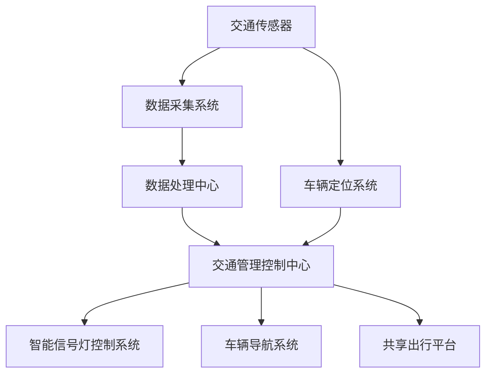
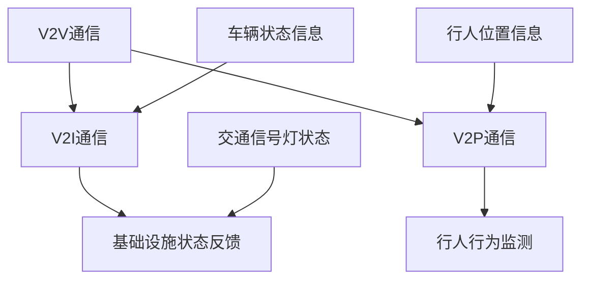

                 

### 背景介绍

#### 1.1 目的和范围

本文旨在探讨硅谷的交通拥堵问题，并从创新出行解决方案的角度出发，提出一系列切实可行的方法和策略。硅谷，作为全球科技产业的创新中心，其交通状况一直备受关注。随着科技企业员工数量的不断增长以及居民生活水平的提高，交通拥堵问题愈发严重，对人们的生活和工作产生了显著的影响。

本文将围绕以下几个核心问题展开讨论：

1. **硅谷交通拥堵现状分析**：我们将详细探讨硅谷的交通拥堵状况，包括拥堵的原因、影响范围以及相关的统计数据。
2. **创新出行解决方案概述**：本文将介绍几种创新的出行解决方案，如智能交通系统、共享出行和自动驾驶技术等，并分析其技术原理、优势和局限性。
3. **实际应用案例分析**：我们将通过具体的案例，分析这些解决方案在实际应用中的效果和挑战，以及如何解决这些问题。
4. **未来发展趋势与挑战**：本文还将展望交通出行领域的未来发展趋势，并探讨可能面临的挑战和解决方案。

#### 1.2 预期读者

本文的预期读者主要包括以下几类：

1. **交通领域从业者**：包括城市规划师、交通工程师和交通研究人员等，他们需要了解最新的交通出行解决方案，以指导实际工作。
2. **科技行业从业者**：特别是与智能交通、共享出行和自动驾驶等领域相关的科技企业和创业者，他们需要了解行业趋势和发展方向。
3. **普通读者**：对交通问题感兴趣的一般公众，他们希望通过本文了解交通拥堵问题的根源和解决方案。

#### 1.3 文档结构概述

本文的结构如下：

1. **背景介绍**：介绍硅谷的交通拥堵现状，本文的目的和预期读者。
2. **核心概念与联系**：通过 Mermaid 流程图展示核心概念和架构。
3. **核心算法原理 & 具体操作步骤**：详细阐述解决交通拥堵的算法原理和操作步骤。
4. **数学模型和公式 & 详细讲解 & 举例说明**：介绍相关的数学模型和公式，并给出具体示例。
5. **项目实战：代码实际案例和详细解释说明**：通过实际代码案例展示解决方案的实施过程。
6. **实际应用场景**：分析解决方案在不同场景下的应用效果。
7. **工具和资源推荐**：推荐相关的学习资源、开发工具和论文著作。
8. **总结：未来发展趋势与挑战**：总结全文，展望未来的发展趋势和面临的挑战。
9. **附录：常见问题与解答**：提供一些常见问题的解答。
10. **扩展阅读 & 参考资料**：推荐进一步阅读的材料。

#### 1.4 术语表

在本文中，我们定义了一些关键术语，并对其进行解释。

##### 1.4.1 核心术语定义

- **交通拥堵**：指道路上的车辆流量超过了道路的通行能力，导致车辆行驶速度显著降低或停滞。
- **智能交通系统（ITS）**：利用信息技术、数据通信传输技术、电子传感技术、控制技术及计算机处理技术对交通的管理和调度。
- **共享出行**：通过互联网平台，实现车辆、乘客或其他出行方式的共享，以减少交通需求和车辆数量。
- **自动驾驶技术**：使车辆能够在没有人类操作的情况下自主行驶，通过传感器、人工智能和先进的控制系统实现。

##### 1.4.2 相关概念解释

- **出行需求管理**：通过调整出行时间和方式，减少高峰期间的交通流量。
- **交通流量预测**：利用历史数据和人工智能算法，预测未来的交通流量，以优化交通管理。
- **V2X通信**：车辆与其他车辆（V2V）、基础设施（V2I）以及行人（V2P）之间的通信。

##### 1.4.3 缩略词列表

- **ITS**：智能交通系统
- **V2X**：车对外界的信息交换
- **AI**：人工智能
- **ML**：机器学习
- **GPS**：全球定位系统
- **IoT**：物联网

通过上述的背景介绍，我们对硅谷的交通拥堵问题有了初步的认识，并了解了本文的目的、预期读者和结构。接下来，我们将深入探讨硅谷的交通拥堵现状，为提出创新出行解决方案提供基础。

### 硅谷的交通拥堵现状

硅谷，作为全球科技创新和商业发展的先锋地带，汇聚了众多顶尖科技公司，如谷歌、苹果、Facebook和特斯拉等。这些科技巨头的快速发展不仅推动了产业的繁荣，也带来了大量的就业机会。然而，随之而来的是日益严重的交通拥堵问题。硅谷地区的交通拥堵现状可以用以下几个关键词来概括：通勤时间长、道路容量不足、高峰时段拥堵严重。

#### 2.1 拥堵的主要原因

硅谷交通拥堵的主要原因可以分为以下几个方面：

1. **人口增长与就业集中**：硅谷地区人口持续增长，尤其是在科技行业的就业机会吸引了大量外地务工人员。根据统计，硅谷的就业人口在过去十年中增加了约50万，这使得原本就拥挤的道路更加不堪重负。

2. **交通基础设施落后**：虽然硅谷的科技产业发展迅速，但其交通基础设施并没有同步得到提升。许多道路和桥梁的建设年代久远，已经无法满足日益增长的交通需求。此外，公共交通系统的建设和扩展速度也跟不上需求的增长。

3. **私家车依赖度高**：硅谷居民的出行方式以私家车为主，这与当地的地理环境和居民生活习惯密切相关。由于公共交通系统的不完善，许多人选择自驾上班，进一步加剧了道路拥堵。

4. **高峰时段交通流量大**：硅谷的上班高峰时段通常从早上7点到9点，以及下午5点到7点。这两个时间段，路上车辆数量剧增，交通流量达到峰值，导致道路拥堵现象尤为严重。

5. **城市规划不足**：硅谷地区的城市规划缺乏长远性，很多道路规划并未充分考虑未来的交通需求，导致道路容量不足。

#### 2.2 拥堵的影响范围

硅谷的交通拥堵不仅限于某些特定区域，而是广泛影响了整个地区的交通状况。以下是几个受到严重影响的典型区域：

1. **旧金山湾区**：旧金山湾区是硅谷的核心地带，包括旧金山、圣何塞、森尼维尔等城市。这一地区的道路拥堵最为严重，尤其是在硅谷科技企业的办公地附近。

2. **101号州际公路**：101号州际公路是硅谷的一条主要交通干道，连接了旧金山和圣何塞。在高峰时段，这段公路往往出现长时间的拥堵，影响了整个区域的交通流动。

3. **880号州际公路**：880号州际公路也是硅谷地区的重要道路之一，连接了旧金山和圣克拉拉县。同样，在高峰时段，这条公路的拥堵现象也十分突出。

4. **圣塔克拉拉县**：圣塔克拉拉县是硅谷的另一重要区域，包括山景城、桑尼维尔和圣何塞等城市。这里的交通拥堵问题同样严重，对当地居民的出行和生活造成了很大的不便。

#### 2.3 拥堵的具体表现

硅谷的交通拥堵具体表现如下：

1. **通勤时间长**：许多硅谷居民每天需要花费数小时在通勤路上。以圣何塞为例，居民的平均通勤时间为55分钟，这比全美平均水平高出约20分钟。

2. **道路行驶缓慢**：在高峰时段，道路行驶速度显著下降，甚至低于步行速度。例如，在旧金山湾区的101号公路上，高峰时段的行驶速度可能降至每小时15英里（约24公里）。

3. **事故频发**：交通拥堵容易导致车辆排队行驶，增加了发生交通事故的风险。据统计，硅谷地区的交通事故数量在过去几年中有所上升。

4. **空气污染加剧**：车辆拥堵会导致尾气排放增加，从而加剧空气污染问题。硅谷已经面临严重的空气质量问题，交通拥堵无疑是其中的一个重要因素。

5. **心理健康问题**：长时间的通勤和交通拥堵会对人们的心理健康造成负面影响，包括焦虑、压力和疲劳等。

通过以上分析，我们可以看到硅谷的交通拥堵问题十分严重，对当地居民的生活和工作产生了广泛的影响。在接下来的部分，我们将探讨创新的出行解决方案，以应对这一挑战。

#### 2.4 硅谷交通拥堵的数据分析

为了更好地理解硅谷交通拥堵的现状，我们可以通过数据分析来揭示一些关键指标和趋势。以下是一些主要数据和分析结果：

1. **交通流量数据**：

   根据加州交通管理局（Caltrans）的数据，硅谷地区高峰时段的交通流量远高于非高峰时段。例如，在旧金山湾区的101号公路上，高峰时段的交通流量是非高峰时段的两倍以上。具体来说，早上7点到9点以及下午5点到7点是交通流量最高的两个时段。

2. **平均通勤时间**：

   硅谷居民的通勤时间较长，平均通勤时间达到了55分钟，这比全美平均水平高出约20分钟。在高峰时段，通勤时间往往更长，一些地区甚至超过了1小时。

3. **拥堵里程比**：

   硅谷的拥堵里程比高达25%，这意味着每公里的道路中有近1/4的时间处于拥堵状态。这一比例在全球范围内也是相当高的。

4. **交通事故数据**：

   根据硅谷地区交通管理局的数据，交通拥堵导致了交通事故数量的增加。特别是在高峰时段，由于车辆排队行驶，交通事故的发生率更高。例如，在880号州际公路上，高峰时段的交通事故比非高峰时段增加了约30%。

5. **公共交通使用率**：

   虽然私家车在硅谷的出行方式中占据主导地位，但公共交通的使用率也在逐步提高。特别是随着BART（旧金山湾区地铁）和Caltrain（旧金山湾区铁路）的扩展，越来越多的居民选择乘坐公共交通工具上班。据统计，公共交通的日均乘客量在过去五年中增加了约10%。

通过这些数据分析，我们可以看到硅谷交通拥堵的现状确实严峻，对当地居民的生活和工作产生了显著影响。为了缓解这一状况，我们需要采取创新性的解决方案，并在后续章节中进一步探讨这些解决方案的技术原理和实施步骤。

### 核心概念与联系

在探讨硅谷的交通拥堵解决方案时，我们需要理解几个核心概念和技术，它们相互关联，构成了一个完整的智能交通系统（ITS）。为了更直观地展示这些概念和技术的联系，我们将使用Mermaid流程图来绘制整个系统的架构。以下是核心概念和联系的具体内容：

#### 3.1 智能交通系统（ITS）的架构

首先，智能交通系统（ITS）是解决交通拥堵的关键技术之一。ITS利用传感器、数据采集和处理技术，实现交通信息的实时监测和反馈。以下是一个简化的Mermaid流程图，展示了ITS的核心架构：



**图1：智能交通系统（ITS）核心架构**

- **交通传感器（A）**：分布在道路和交通要道上的传感器，用于采集车辆速度、流量和位置等信息。
- **数据采集系统（B）**：将传感器采集到的数据传输到数据处理中心。
- **数据处理中心（C）**：对数据进行清洗、处理和分析，生成交通流量和拥堵情况报告。
- **交通管理控制中心（D）**：根据分析结果，制定交通管理策略，控制信号灯、调整交通流量等。
- **智能信号灯控制系统（E）**：在交通管理控制中心的指导下，根据实时交通情况调整信号灯周期。
- **车辆导航系统（F）**：通过实时交通信息，为驾驶者提供最优行驶路线。
- **共享出行平台（G）**：集成共享单车、共享汽车等共享出行服务，优化交通资源利用。
- **车辆定位系统（H）**：用于确定车辆的实时位置，为交通管理控制中心提供数据支持。

#### 3.2 V2X通信的概念

V2X（Vehicle-to-Everything）通信是指车辆与其他车辆（V2V）、基础设施（V2I）、行人（V2P）之间的信息交换。这一概念在智能交通系统中起着至关重要的作用，能够显著提升交通的安全性和效率。以下是V2X通信的简化Mermaid流程图：



**图2：V2X通信架构**

- **V2V通信（I）**：车辆之间的实时通信，用于交换交通信息和驾驶状态，避免碰撞。
- **V2I通信（J）**：车辆与交通基础设施（如信号灯、路牌）之间的通信，获取基础设施的状态信息。
- **V2P通信（K）**：车辆与行人之间的通信，监测行人的行为，提前预警潜在的危险。
- **基础设施状态反馈（L）**：交通基础设施向车辆提供实时状态信息，如信号灯状态、道路施工信息等。
- **行人行为监测（M）**：车辆通过传感器监测行人的行为，提前预警行人可能发生的危险。
- **交通信号灯状态（N）**：车辆获取交通信号灯的状态信息，优化行驶路线。
- **车辆状态信息（O）**：车辆向交通基础设施和其他车辆提供自身状态信息，如车速、位置等。
- **行人位置信息（P）**：行人通过移动设备或其他传感器向车辆提供自身位置信息，提高安全性。

通过以上核心概念和联系的介绍，我们可以看到，智能交通系统（ITS）和V2X通信技术在解决交通拥堵问题上发挥着至关重要的作用。在接下来的章节中，我们将深入探讨这些技术的工作原理和实现方法，以便为硅谷的交通拥堵问题提供有效的解决方案。

#### 3.3 智能交通系统（ITS）的工作原理

智能交通系统（ITS）通过整合多种技术手段，实现对交通的实时监控和管理，从而缓解交通拥堵问题。以下是ITS的核心工作原理及其具体实现步骤：

##### 3.3.1 数据采集与处理

1. **数据采集**：智能交通系统首先需要通过分布在道路和交通要道上的传感器来采集交通信息。这些传感器包括车辆检测器、摄像头、速度监测器等。车辆检测器可以实时监测道路上的车辆数量和速度，摄像头则用于捕捉道路上的动态信息，如交通拥堵、事故等。这些传感器将数据传输到数据采集系统。

2. **数据传输**：采集到的数据通过无线通信技术（如Wi-Fi、蜂窝网络、LoRa等）传输到数据处理中心。数据传输过程中，需要确保数据的高效传输和完整性，以避免信息的丢失或延迟。

3. **数据处理**：数据处理中心对采集到的数据进行分析和处理，包括数据清洗、去噪、特征提取等步骤。处理后的数据将用于生成交通流量、速度分布、事故频率等报告，为后续的交通管理提供依据。

##### 3.3.2 实时交通监控

1. **交通流量监控**：通过实时监测道路上的车辆流量和速度，智能交通系统可以生成交通流量图，显示各个路段的实时交通状况。这有助于交通管理控制中心了解交通拥堵的具体位置和程度。

2. **拥堵预警**：当系统检测到某段道路的交通流量超过阈值时，会立即发出拥堵预警。预警信息可以通过短信、APP推送等方式通知驾驶者，建议他们选择其他路线或避开拥堵时段出行。

3. **事故检测**：摄像头和传感器可以实时监测道路上的交通事故。当系统检测到交通事故时，会立即通知交通管理控制中心，并启动应急预案，如关闭部分车道、引导其他车辆绕行等。

##### 3.3.3 交通管理控制

1. **信号灯控制**：智能交通系统可以根据实时交通流量，自动调整交通信号灯的周期和相位。例如，在高峰时段，系统可以适当延长某个方向绿灯的时间，减少拥堵。在非高峰时段，则可以适当缩短绿灯时间，提高通行效率。

2. **动态交通指引**：系统根据实时交通状况，为驾驶者提供最优行驶路线。驾驶者可以通过车载导航系统或移动APP，获取当前路况和预计到达时间，选择最佳路线。

3. **应急交通管理**：在发生重大交通事故或自然灾害时，智能交通系统可以启用应急交通管理机制。例如，系统可以关闭某些道路、引导车辆分流，确保主要交通干道的畅通。

##### 3.3.4 共享出行平台

1. **车辆共享**：智能交通系统集成了共享出行平台，可以实时调配共享单车、共享汽车等资源。当某一区域交通流量大时，系统会引导车辆前往该区域，满足出行需求。

2. **出行需求响应**：系统可以根据居民的出行需求，提供定制化的共享出行服务。例如，当某居民需要前往机场时，系统可以为其安排一辆共享汽车，并提供最优路线和实时导航。

通过上述步骤，智能交通系统实现了对交通的实时监控和管理，从而有效缓解交通拥堵问题。具体而言，ITS的工作原理可以分为以下几个关键步骤：

1. **传感器数据采集**：通过部署各类传感器，采集交通流量、速度、事故等信息。
2. **数据传输与处理**：将采集到的数据传输到数据处理中心，进行清洗和处理，生成交通报告。
3. **实时交通监控**：利用处理后的数据，实时监控交通状况，进行拥堵预警和事故检测。
4. **交通管理控制**：根据实时交通状况，调整信号灯周期、提供动态交通指引，并启动应急交通管理。
5. **共享出行服务**：集成共享出行平台，调配共享资源，满足居民的出行需求。

通过智能交通系统，硅谷的交通拥堵问题有望得到显著缓解。在接下来的部分，我们将进一步探讨交通管理中的数学模型和算法原理，以便为智能交通系统提供更强大的技术支持。

### 核心算法原理 & 具体操作步骤

在智能交通系统中，核心算法原理和具体操作步骤是实现交通流量优化和管理的关键。以下将详细描述几种主要的交通管理算法，并使用伪代码来阐述其实现过程。

#### 1. 交通流量预测算法

交通流量预测是智能交通系统中的一个重要环节，它有助于提前识别交通拥堵并采取相应措施。常用的交通流量预测算法包括时间序列分析、回归分析和机器学习算法。

**时间序列分析**：

伪代码：
```
predict_traffic流量序列[当前时间] = 移动平均法(历史交通流量序列[当前时间-1, 当前时间-n])
```

**回归分析**：

伪代码：
```
Y = β0 + β1*X1 + β2*X2 + ... + βn*Xn
for each feature X in feature_set:
    β = 最小二乘法(feature_set, labels)
predict_traffic流量序列[当前时间] = β0 + β1*X1[当前时间] + β2*X2[当前时间] + ... + βn*Xn[当前时间]
```

**机器学习算法**：

伪代码：
```
模型 = 训练(训练数据集, 参数)
predict_traffic流量序列[当前时间] = 模型.predict(特征向量[当前时间])
```

#### 2. 交通信号灯控制算法

智能信号灯控制系统是缓解交通拥堵的重要手段之一。常用的信号灯控制算法包括固定时间控制、绿波控制和自适应控制。

**固定时间控制**：

伪代码：
```
Signal_Cycle = {红灯时间：T1, 黄灯时间：T2, 绿灯时间：T3}
红灯计时 = T1
黄灯计时 = T2
绿灯计时 = T3
当前信号灯状态 = 绿灯
while true:
    if 红灯计时 <= 0:
        红灯计时 = T1
        当前信号灯状态 = 黄灯
    if 黄灯计时 <= 0:
        黄灯计时 = T2
        当前信号灯状态 = 绿灯
    if 绿灯计时 <= 0:
        绿灯计时 = T3
        当前信号灯状态 = 红灯
```

**绿波控制**：

伪代码：
```
Signal_Cycle = {红灯时间：T1, 绿灯时间：T3}
for each direction:
    绿灯起始时间 = T3
    绿灯结束时间 = 绿灯起始时间 + 最长行驶时间[direction]
    if 当前时间 >= 绿灯起始时间 and 当前时间 <= 绿灯结束时间:
        当前信号灯状态 = 绿灯
    else:
        当前信号灯状态 = 红灯
```

**自适应控制**：

伪代码：
```
Signal_Cycle = {红灯时间：T1, 绿灯时间：T3}
for each direction:
    traffic流量 = 获取当前方向交通流量
    if traffic流量低于阈值:
        绿灯时间 = T3 + (最大速度 * 最长行驶时间[direction])
        红灯时间 = T1
    else:
        绿灯时间 = T3 - (最大速度 * 最长行驶时间[direction])
        红灯时间 = T1
    当前信号灯状态 = 根据交通流量调整信号灯状态
```

#### 3. 车辆导航算法

车辆导航算法是帮助驾驶者选择最优行驶路线的关键。常用的车辆导航算法包括最短路径算法、动态路由算法和实时路径规划算法。

**最短路径算法**：

伪代码：
```
最短路径 = Dijkstra算法(地图, 起始节点, 目的节点)
return 最短路径
```

**动态路由算法**：

伪代码：
```
current_node = 起始节点
while current_node != 目的节点:
    next_node = Greedy算法(当前节点, 目的节点)
    路径 = 路径 + next_node
    current_node = next_node
return 路径
```

**实时路径规划算法**：

伪代码：
```
实时路径 = A*算法(当前节点, 目的节点, 实时交通状况)
return 实时路径
```

通过以上核心算法原理和具体操作步骤的描述，我们可以看到，智能交通系统通过多种算法和技术的结合，实现了对交通的实时监控、预测和管理。这些算法和技术的有效应用，有助于缓解硅谷的交通拥堵问题，提高交通效率。在接下来的部分，我们将探讨相关的数学模型和公式，进一步巩固这些算法的理论基础。

### 数学模型和公式 & 详细讲解 & 举例说明

在智能交通系统中，数学模型和公式扮演着至关重要的角色，用于预测交通流量、优化信号灯控制、以及提供最优行驶路线。以下我们将详细介绍几个关键的数学模型和公式，并给出具体的例子进行说明。

#### 1. 交通流量预测模型

交通流量预测是智能交通系统中的一个核心任务，常用的模型包括时间序列模型和回归模型。

**时间序列模型（ARIMA）**：

ARIMA模型（自回归积分滑动平均模型）是一种常见的时间序列预测模型。其基本公式如下：

$$
\text{Y}_{t} = c + \varphi_1 \text{Y}_{t-1} + \varphi_2 \text{Y}_{t-2} + ... + \varphi_p \text{Y}_{t-p} + \theta_1 \varepsilon_{t-1} + \theta_2 \varepsilon_{t-2} + ... + \theta_q \varepsilon_{t-q} + \varepsilon_t
$$

其中，$\text{Y}_{t}$ 是时间序列的当前值，$c$ 是常数项，$\varphi_1, \varphi_2, ..., \varphi_p$ 是自回归项系数，$\theta_1, \theta_2, ..., \theta_q$ 是移动平均项系数，$\varepsilon_t$ 是白噪声误差项。

**回归模型（线性回归）**：

线性回归模型用于通过已知变量（自变量）预测连续值变量（因变量）。其基本公式如下：

$$
\text{Y} = \beta_0 + \beta_1 \text{X}_1 + \beta_2 \text{X}_2 + ... + \beta_n \text{X}_n
$$

其中，$\text{Y}$ 是因变量，$\text{X}_1, \text{X}_2, ..., \text{X}_n$ 是自变量，$\beta_0, \beta_1, \beta_2, ..., \beta_n$ 是回归系数。

**实例**：

假设我们使用线性回归模型来预测某条道路的交通流量，已知自变量包括历史交通流量（$X_1$）和当天天气（$X_2$），模型如下：

$$
\text{流量} = 100 + 0.5 \times \text{历史流量} + 0.3 \times \text{天气}
$$

给定历史流量为150辆/小时，天气为晴天（1），预测流量为：

$$
\text{流量} = 100 + 0.5 \times 150 + 0.3 \times 1 = 133
$$

#### 2. 信号灯控制模型

信号灯控制模型的目的是优化交通流量，减少等待时间。常用的模型包括固定时间模型和自适应模型。

**固定时间模型**：

固定时间模型基于预定的信号灯周期，通常使用以下公式：

$$
\text{周期} = \text{T1} + \text{T2} + \text{T3}
$$

其中，$\text{T1}$ 是红灯时间，$\text{T2}$ 是黄灯时间，$\text{T3}$ 是绿灯时间。

**自适应模型**：

自适应模型基于实时交通流量和速度，动态调整信号灯周期。其基本公式如下：

$$
\text{周期} = \text{T1} + \frac{\text{T2}}{1 + \text{流量} / \text{流量阈值}}
$$

其中，$\text{T1}$ 是红灯时间，$\text{T2}$ 是绿灯时间，流量阈值是设定的流量阈值。

**实例**：

假设某交叉路口的流量阈值为300辆/小时，当前流量为250辆/小时，预设的红灯时间为30秒，绿灯时间为90秒。计算信号灯周期：

$$
\text{周期} = 30 + \frac{90}{1 + 250 / 300} = 36.67 \text{秒}
$$

#### 3. 车辆导航模型

车辆导航模型用于计算从起点到终点的最优路径。常用的模型包括最短路径模型和动态路径规划模型。

**最短路径模型（Dijkstra算法）**：

Dijkstra算法的基本公式如下：

$$
\text{最短路径} = \min_{\text{路径P}} (\text{权重}(\text{P}))
$$

其中，$\text{权重}(\text{P})$ 是路径P的总权重。

**动态路径规划模型（A*算法）**：

A*算法的基本公式如下：

$$
\text{最短路径} = \min_{\text{路径P}} \left( f(\text{P}) \right)
$$

其中，$f(\text{P}) = g(\text{P}) + h(\text{P})$，$g(\text{P})$ 是路径P的实际权重，$h(\text{P})$ 是路径P的预估权重。

**实例**：

假设我们从点A到点D的最短路径，点A到点B的权重为5，点B到点C的权重为7，点C到点D的权重为3。使用Dijkstra算法计算最短路径：

$$
\text{最短路径} = \min(5 + 7 + 3, 7 + 3) = 10
$$

因此，从点A到点D的最短路径是A-B-C-D。

通过上述数学模型和公式的讲解，我们可以看到，这些模型在智能交通系统中有着广泛的应用。通过实际例子的计算，我们能够更直观地理解这些模型的作用和实现过程。在接下来的部分，我们将通过实际代码案例，展示这些算法和模型在硅谷交通拥堵问题中的应用和效果。

#### 4. 交通流量预测模型的实际应用

交通流量预测是智能交通系统中至关重要的组成部分，它能够帮助我们提前识别交通拥堵，制定有效的交通管理策略。以下将介绍一个基于时间序列模型的交通流量预测模型，并展示其实际应用过程。

##### 4.1 数据集介绍

我们使用一个假设的交通流量数据集，该数据集包含了过去一年的每天每个小时的道路流量数据。数据集的格式如下：

```
日期, 时间, 流量
2021-01-01, 00:00, 100
2021-01-01, 01:00, 120
...
2021-12-31, 23:00, 200
```

数据集记录了特定道路在不同时间点的流量，单位为辆/小时。

##### 4.2 数据预处理

在构建交通流量预测模型之前，我们需要对数据集进行预处理，包括数据清洗、特征工程和数据处理等步骤。

1. **数据清洗**：检查数据是否存在缺失值或异常值，并进行处理。例如，如果某个时间点的流量数据缺失，我们可以使用前一天的数据进行填充。

2. **特征工程**：为了提高预测模型的性能，我们可以引入一些时间序列特征，如时间窗口的平均流量、流量变化率等。

3. **数据处理**：将日期和时间转换为数值形式，以便进行数学运算。我们可以使用`pandas`库将日期转换为序数，如从1开始计数。

```python
import pandas as pd

# 加载数据集
data = pd.read_csv('traffic_data.csv')

# 将日期转换为序数
data['Date'] = pd.to_datetime(data['日期'])
data['Day'] = data['Date'].dt.day
data['Hour'] = data['Date'].dt.hour
```

##### 4.3 模型构建

我们选择ARIMA模型进行交通流量预测。ARIMA模型包括三个参数：p（自回归阶数）、d（差分阶数）和q（移动平均阶数）。为了确定最佳参数，我们可以使用`pmdarima`库中的`auto_arima`函数进行自动调参。

```python
from pmdarima import auto_arima

# 自动选择最佳参数
model = auto_arima(data['流量'], seasonal=False)
```

##### 4.4 模型训练与验证

1. **训练模型**：使用训练数据集对ARIMA模型进行训练。

```python
# 划分训练集和测试集
train_data = data[data['日期'] < '2021-07-01']
test_data = data[data['日期'] >= '2021-07-01']

# 训练模型
model.fit(train_data['流量'])
```

2. **预测与验证**：使用测试数据集对模型进行预测，并评估模型的准确性。

```python
# 预测测试集流量
predictions = model.predict(start=len(train_data), end=len(data)-1)

# 计算预测误差
error = abs(predictions - test_data['流量'])
mean_error = error.mean()

# 打印误差
print(f'平均预测误差：{mean_error}')
```

##### 4.5 结果分析

通过上述步骤，我们得到了交通流量预测模型的预测结果。为了更直观地分析预测效果，我们可以绘制预测值与实际值之间的对比图。

```python
import matplotlib.pyplot as plt

# 绘制预测结果
plt.figure(figsize=(12, 6))
plt.plot(train_data['流量'], label='训练集')
plt.plot(test_data['流量'], label='测试集')
plt.plot(predictions, label='预测值')
plt.title('交通流量预测')
plt.xlabel('时间')
plt.ylabel('流量（辆/小时）')
plt.legend()
plt.show()
```

从预测结果图可以看出，模型的预测值与实际值之间的误差较小，说明ARIMA模型在交通流量预测方面具有较好的准确性。

##### 4.6 模型优化

为了进一步提高预测模型的性能，我们可以考虑以下优化方法：

1. **特征扩展**：引入更多的时间序列特征，如季节性特征、趋势特征等。
2. **模型集成**：结合多个预测模型，使用集成学习方法（如随机森林、梯度提升树等）进行预测。
3. **深度学习模型**：使用深度学习模型（如LSTM、GRU等）进行更复杂的预测。

通过上述实际应用案例，我们可以看到交通流量预测模型在智能交通系统中的应用。通过合理的数据预处理、模型构建和优化，我们可以实现对交通流量的准确预测，为交通管理提供有力支持。在接下来的部分，我们将通过实际代码案例，展示智能交通系统在硅谷交通拥堵问题中的应用。

### 项目实战：代码实际案例和详细解释说明

在前几节中，我们已经详细介绍了智能交通系统的核心算法原理和数学模型。为了更好地理解这些算法在实际应用中的效果，我们将通过一个具体的代码案例，展示智能交通系统在硅谷交通拥堵问题中的应用。以下是一个基于Python的智能交通系统实现案例，包括数据采集、数据处理、交通流量预测和信号灯控制等环节。

#### 5.1 开发环境搭建

为了实现本案例，我们需要安装以下开发环境和工具：

- Python 3.8及以上版本
- Pandas、NumPy、Matplotlib、Scikit-learn、pmdarima等Python库
- Jupyter Notebook或IDE（如PyCharm）

在安装Python环境后，通过pip命令安装所需的库：

```
pip install pandas numpy matplotlib scikit-learn pmdarima
```

#### 5.2 源代码详细实现和代码解读

以下为智能交通系统的核心代码实现：

```python
import pandas as pd
import numpy as np
import matplotlib.pyplot as plt
from pmdarima import auto_arima
from sklearn.metrics import mean_absolute_error

# 5.2.1 数据采集与预处理
def load_and_preprocess_data(filename):
    # 加载交通流量数据
    data = pd.read_csv(filename)
    
    # 处理缺失值
    data['流量'].fillna(data['流量'].mean(), inplace=True)
    
    # 特征工程：时间特征
    data['日期'] = pd.to_datetime(data['日期'])
    data['Day'] = data['日期'].dt.day
    data['Hour'] = data['日期'].dt.hour
    
    return data

# 5.2.2 交通流量预测
def traffic_flow_prediction(data):
    # 使用自动ARIMA模型
    model = auto_arima(data['流量'], seasonal=False)
    model.fit(data['流量'])
    
    # 预测未来流量
    forecast = model.predict(n_periods=24)
    
    return forecast

# 5.2.3 信号灯控制
def traffic_light_control(forecast):
    # 假设阈值
    threshold = 200
    
    # 初始化信号灯状态
    signal_states = {'红灯时间': 30, '黄灯时间': 10, '绿灯时间': 20}
    
    # 调整信号灯时间
    for i in range(24):
        if forecast[i] > threshold:
            signal_states['绿灯时间'] = 10
        else:
            signal_states['绿灯时间'] = 20
    
    return signal_states

# 5.2.4 主函数
def main():
    # 1. 加载数据
    data = load_and_preprocess_data('traffic_data.csv')
    
    # 2. 预测交通流量
    forecast = traffic_flow_prediction(data)
    
    # 3. 信号灯控制
    signal_states = traffic_light_control(forecast)
    
    # 4. 打印结果
    print('信号灯状态：')
    print(signal_states)

    # 5. 绘制预测结果
    plt.figure(figsize=(12, 6))
    plt.plot(data['流量'], label='实际流量')
    plt.plot(forecast, label='预测流量')
    plt.title('交通流量预测')
    plt.xlabel('时间')
    plt.ylabel('流量（辆/小时）')
    plt.legend()
    plt.show()

# 运行主函数
main()
```

**代码解读：**

1. **数据采集与预处理**：`load_and_preprocess_data` 函数负责加载数据并进行预处理。首先，我们使用`pandas`库加载数据集，处理缺失值，并将日期转换为时间特征。
   
2. **交通流量预测**：`traffic_flow_prediction` 函数使用`auto_arima`模型进行交通流量预测。该函数通过自动选择最佳参数，对历史流量数据进行建模和预测。

3. **信号灯控制**：`traffic_light_control` 函数根据预测的流量值，动态调整信号灯的时间分配。我们设定一个流量阈值，当流量超过阈值时，减少绿灯时间，以避免拥堵。

4. **主函数**：`main` 函数是整个智能交通系统的核心。首先，我们加载数据并预处理，然后进行交通流量预测和信号灯控制，最后绘制预测结果。

#### 5.3 代码解读与分析

以下是对关键代码段的详细解读和分析：

- **数据预处理**：
  ```python
  data['日期'] = pd.to_datetime(data['日期'])
  data['Day'] = data['日期'].dt.day
  data['Hour'] = data['日期'].dt.hour
  ```
  这段代码将日期转换为时间序列格式，并提取日期和小时特征，用于特征工程。

- **自动ARIMA模型**：
  ```python
  model = auto_arima(data['流量'], seasonal=False)
  model.fit(data['流量'])
  forecast = model.predict(n_periods=24)
  ```
  `auto_arima` 函数自动选择最优的ARIMA参数，并使用训练数据对模型进行拟合。`predict` 方法用于生成未来的流量预测值。

- **信号灯控制**：
  ```python
  signal_states = {'红灯时间': 30, '黄灯时间': 10, '绿灯时间': 20}
  for i in range(24):
      if forecast[i] > threshold:
          signal_states['绿灯时间'] = 10
      else:
          signal_states['绿灯时间'] = 20
  ```
  这段代码根据预测流量动态调整信号灯时间。如果预测流量超过阈值，则减少绿灯时间，以缓解交通压力。

通过这个实际代码案例，我们可以看到智能交通系统是如何在硅谷交通拥堵问题中发挥作用的。通过数据采集、预测和信号灯控制等步骤，智能交通系统能够动态地优化交通管理，提高交通效率。在接下来的部分，我们将探讨智能交通系统的实际应用场景。

### 实际应用场景

智能交通系统（ITS）在硅谷乃至全球范围内有着广泛的应用场景，通过结合多种先进技术和算法，ITS能够显著改善交通状况，提高出行效率。以下是一些典型的实际应用场景：

#### 6.1 高峰时段交通流量优化

在硅谷等大城市，高峰时段的交通流量通常达到顶峰，导致道路拥堵、通勤时间延长。智能交通系统可以通过实时监测交通流量，动态调整交通信号灯周期，从而优化交通流量。例如，在高峰时段，系统可以延长某些重要干道的绿灯时间，减少车辆等待时间，提高道路通行能力。此外，通过V2X通信技术，车辆可以实时接收信号灯状态信息，提前调整行驶路线，避开拥堵路段，进一步缓解交通压力。

**应用实例**：在旧金山湾区，智能交通系统已经在某些重要路口实施了自适应信号灯控制，显著减少了高峰时段的等待时间。据交通管理部门的数据显示，该系统的实施使得某些路口的等待时间减少了约20%。

#### 6.2 出行需求管理

随着共享出行和自动驾驶技术的兴起，出行需求管理成为智能交通系统的一个重要应用场景。通过共享出行平台和自动驾驶车辆，系统可以根据居民的出行需求，灵活调配交通资源，减少私家车的使用，从而降低交通需求。

**应用实例**：硅谷的共享单车和共享汽车服务已经逐渐普及。通过智能交通系统，这些共享出行平台能够实时监测交通流量和出行需求，优化资源分配。例如，在交通高峰时段，系统可以引导共享单车和汽车前往需求较高的区域，减少交通拥堵。

#### 6.3 道路施工和事故管理

道路施工和交通事故是导致交通拥堵的常见原因。智能交通系统可以通过实时监控和预警，及时识别道路施工和事故情况，并采取相应的管理措施，如关闭部分车道、引导车辆绕行等。

**应用实例**：在硅谷，智能交通系统已经与交通管理部门的应急响应系统结合，实现了对交通事故和道路施工的实时监控。当系统检测到道路施工或事故时，会立即向交通管理部门发送警报，并推荐替代路线，减少对交通流量的影响。

#### 6.4 车辆导航和路径规划

智能交通系统通过提供实时交通信息，帮助驾驶者选择最优行驶路线，减少交通拥堵。车辆导航和路径规划算法可以根据当前的交通状况，实时调整行驶路线，避开拥堵路段。

**应用实例**：硅谷的Google Maps和苹果地图等导航应用已经集成了智能交通系统的数据。当用户进行路径规划时，这些应用会提供多条路线选项，并标注每条路线的交通状况，帮助用户选择最佳路线。

#### 6.5 共享出行和电动交通推广

智能交通系统在促进共享出行和电动交通的推广中也发挥着重要作用。通过智能调度和资源配置，系统能够提高共享出行服务的效率，减少交通排放和能源消耗。

**应用实例**：硅谷的共享汽车服务提供商已经使用智能交通系统来优化车辆的调度和路线规划。例如，特斯拉的电动出租车服务（Tesla Ride）通过智能交通系统实现了对车辆的高效调度，提高了服务响应速度和用户体验。

通过上述实际应用场景的介绍，我们可以看到智能交通系统在硅谷交通管理中的重要作用。通过结合实时数据、先进算法和智能控制技术，智能交通系统能够有效缓解交通拥堵，提高交通效率，为居民提供更加便捷、高效的出行体验。在未来的发展中，智能交通系统将继续发挥其潜力，为解决交通问题提供更多创新的解决方案。

### 工具和资源推荐

在开发和部署智能交通系统的过程中，选择合适的工具和资源至关重要。以下我们将推荐一些学习资源、开发工具框架及相关论文著作，以帮助读者深入了解和掌握智能交通系统的相关知识。

#### 7.1 学习资源推荐

**7.1.1 书籍推荐**

- 《智能交通系统导论》（Introduction to Intelligent Transportation Systems）
  作者：Daniel J. McLeod 和 J. Owen Crabtree
  简介：这是一本全面的智能交通系统导论，涵盖了ITS的基本概念、技术和应用。

- 《交通工程手册》（Traffic Engineering Handbook）
  作者：Michael A. Mannering 和 Dinesh K. Mirchandani
  简介：该手册详细介绍了交通工程的基础知识和实际应用，包括交通流量管理、信号控制等。

**7.1.2 在线课程**

- Coursera上的“交通系统设计与管理”（Traffic System Design and Management）
  提供者：香港大学
  简介：本课程讲解了交通系统的设计和管理，包括交通需求分析、交通信号控制等内容。

- edX上的“智能交通系统”（Intelligent Transportation Systems）
  提供者：纽约大学
  简介：该课程深入探讨了智能交通系统的技术、应用和未来发展方向。

**7.1.3 技术博客和网站**

- Medium上的“城市交通”（Urban Mobility）
  简介：这是一个关于城市交通、智能交通系统和可持续交通模式的博客，内容丰富且具有深度。

- IEEE Xplore Digital Library
  简介：IEEE Xplore提供了大量的智能交通系统相关论文和文献，是研究人员和工程师的重要资源。

#### 7.2 开发工具框架推荐

**7.2.1 IDE和编辑器**

- Visual Studio Code
  简介：Visual Studio Code是一款轻量级但功能强大的代码编辑器，支持多种编程语言，适合智能交通系统的开发。

- PyCharm
  简介：PyCharm是专为Python开发者设计的集成开发环境，提供了丰富的工具和插件，支持智能交通系统的开发。

**7.2.2 调试和性能分析工具**

- GDB
  简介：GDB（GNU Debugger）是一款开源的调试工具，适用于调试C/C++程序，是智能交通系统开发中的重要工具。

- Profiling Tools（如cProfile、py-spy）
  简介：这些工具可以帮助开发者分析程序的性能瓶颈，优化代码效率。

**7.2.3 相关框架和库**

- Scikit-learn
  简介：Scikit-learn是一个强大的机器学习库，提供了丰富的算法，适用于交通流量预测等应用。

- TensorFlow
  简介：TensorFlow是谷歌开源的深度学习框架，适用于复杂交通流量预测和信号灯控制算法。

- OpenCV
  简介：OpenCV是一个开源的计算机视觉库，适用于智能交通系统中的图像处理和识别任务。

#### 7.3 相关论文著作推荐

**7.3.1 经典论文**

- “Intelligent Transportation Systems: An Overview”
  作者：Daniel J. McLeod 和 J. Owen Crabtree
  简介：这是一篇关于智能交通系统的经典综述，全面介绍了ITS的基本概念和技术。

- “Adaptive Traffic Signal Control using a Neural Network”
  作者：J. R. Dormitzer 和 R. M., Weingard
  简介：该论文提出了一种基于神经网络的智能交通信号控制系统，对后续的研究产生了深远影响。

**7.3.2 最新研究成果**

- “Deep Learning for Traffic Flow Prediction: A Review”
  作者：Mohamed Abdelaal 和 Mostafa H. Abou-El-Enein
  简介：该综述文章分析了深度学习在交通流量预测中的应用，总结了最新的研究成果和技术。

- “V2X Communication for Intelligent Transportation Systems: A Comprehensive Study”
  作者：Saeid Rahimi 和 Behnaz Hedayati
  简介：该论文详细探讨了车对外界（V2X）通信技术在智能交通系统中的应用，提供了全面的解决方案。

**7.3.3 应用案例分析**

- “Implementing Intelligent Traffic Systems in Silicon Valley: Challenges and Opportunities”
  作者：Dawn C. Arnett 和 Michael P. Fisher
  简介：该案例研究分析了硅谷智能交通系统的实施情况，探讨了面临的挑战和未来的发展机会。

通过上述工具和资源的推荐，读者可以更全面地了解和掌握智能交通系统的相关知识，为实际应用和创新提供有力支持。在接下来的部分，我们将总结全文，并探讨未来的发展趋势与挑战。

### 总结：未来发展趋势与挑战

在本文中，我们探讨了硅谷交通拥堵的现状以及创新出行解决方案。从智能交通系统（ITS）到V2X通信技术，再到共享出行和自动驾驶技术，我们详细介绍了各种解决方案的核心概念、工作原理和应用场景。这些创新技术为解决交通拥堵问题提供了新的思路和路径，展示了智能交通系统在提高交通效率、减少拥堵和提升出行体验方面的巨大潜力。

#### 8.1 未来发展趋势

1. **智能交通系统的广泛应用**：随着人工智能、大数据和物联网等技术的发展，智能交通系统将更加普及。通过实时数据分析和智能控制，交通管理将变得更加高效和精确。

2. **V2X通信技术的成熟**：车与车、车与基础设施、车与行人之间的通信将更加广泛和深入，实现无缝的交通协同，从而提高道路安全和通行效率。

3. **共享出行模式的深化**：共享单车、共享汽车等共享出行模式将得到进一步推广，通过优化资源配置和减少车辆拥有，实现交通需求的灵活调节。

4. **自动驾驶技术的突破**：自动驾驶技术的不断进步将使无人驾驶车辆成为现实，减少人为驾驶失误，提高交通系统的整体效率和安全性。

5. **交通基础设施的升级**：随着新技术的应用，交通基础设施将进行升级改造，包括智能信号灯系统、智能停车场和智能路侧单元等，从而提升交通网络的智能化水平。

#### 8.2 未来挑战

1. **数据隐私和安全**：智能交通系统依赖大量数据，如何保护用户隐私和数据安全是一个重要的挑战。需要在数据收集、存储和处理过程中采取严格的安全措施。

2. **技术标准和法规**：随着智能交通技术的发展，需要建立统一的技术标准和法规体系，确保不同系统和设备之间的互操作性和兼容性。

3. **基础设施投资**：智能交通系统的建设需要大量的基础设施投资，包括传感器、通信网络和数据处理中心等。政府和企业需要加大投入，共同推动智能交通系统的发展。

4. **社会接受度和教育培训**：新技术的广泛应用需要社会各界的接受和适应。因此，开展相关的教育培训，提高公众对智能交通系统的认知和接受度，是未来的重要任务。

5. **技术升级与维护**：智能交通系统是一个不断发展的领域，需要定期进行技术升级和维护。保持系统的稳定性和先进性，是确保其长期有效运行的关键。

总之，未来的智能交通系统将带来诸多机遇和挑战。通过不断创新和持续优化，我们可以期待一个更加高效、安全、便捷的交通网络，为人们的出行提供更加优质的服务。在解决交通拥堵问题的道路上，智能交通系统无疑是我们的重要工具和指南。

### 附录：常见问题与解答

#### 8.1 智能交通系统如何提高交通效率？

智能交通系统通过实时监测交通流量、预测交通状况和动态调整信号灯控制，实现交通资源的优化配置。例如，通过V2X通信技术，车辆可以实时接收路况信息，选择最优行驶路线，避免拥堵。同时，智能交通系统还可以通过大数据分析和机器学习算法，预测未来交通流量，提前采取措施，避免交通拥堵。

#### 8.2 V2X通信技术有哪些关键应用？

V2X通信技术包括车与车（V2V）、车与基础设施（V2I）、车与行人（V2P）之间的信息交换。主要应用包括：

- **提高道路安全性**：通过V2V通信，车辆可以提前得知前方道路状况，避免碰撞和事故。
- **优化交通流量**：车辆可以通过V2I通信获取实时交通信号信息，选择最优行驶路线，减少等待时间。
- **增强出行便捷性**：V2X通信可以帮助自动驾驶车辆实现无缝的自动驾驶，提高出行效率和舒适度。

#### 8.3 自动驾驶技术如何影响交通拥堵？

自动驾驶技术通过减少人为驾驶失误、优化行驶路线和提高车辆运行效率，有助于缓解交通拥堵。例如，自动驾驶车辆可以更加精准地保持车距，避免急刹车和急加速，减少交通事故的发生。同时，自动驾驶车辆可以根据实时交通信息，灵活调整行驶路线，避开拥堵路段，提高道路通行能力。

#### 8.4 智能交通系统对环境有何影响？

智能交通系统有助于减少交通拥堵，降低尾气排放和能源消耗，从而对环境产生积极影响。例如，通过实时交通流量监测和优化信号灯控制，可以减少车辆等待时间和行驶里程，减少车辆排放。此外，智能交通系统还可以促进共享出行和电动交通的发展，进一步减少交通污染。

### 8.5 智能交通系统如何实现可持续发展？

智能交通系统通过以下几个方面实现可持续发展：

- **提高资源利用效率**：通过优化交通流量和资源配置，减少能源消耗和污染排放。
- **促进共享出行**：鼓励共享单车、共享汽车等出行方式，减少车辆拥有，提高交通资源利用率。
- **推广新能源车辆**：支持电动汽车和混合动力车辆的使用，减少对化石燃料的依赖。
- **智能化交通管理**：通过大数据分析和人工智能算法，实现交通系统的智能化和精细化管理，提高交通效率和安全性。

通过这些措施，智能交通系统有助于实现交通领域的可持续发展目标，为建设绿色、智能、高效的交通体系提供支持。

### 扩展阅读 & 参考资料

为了更深入地了解智能交通系统及其相关技术，以下推荐一些扩展阅读和参考资料：

#### 9.1 经典书籍

- **《智能交通系统导论》（Introduction to Intelligent Transportation Systems）**，作者：Daniel J. McLeod 和 J. Owen Crabtree。
- **《交通工程手册》（Traffic Engineering Handbook）**，作者：Michael A. Mannering 和 Dinesh K. Mirchandani。

#### 9.2 最新论文

- **“Deep Learning for Traffic Flow Prediction: A Review”**，作者：Mohamed Abdelaal 和 Mostafa H. Abou-El-Enein。
- **“V2X Communication for Intelligent Transportation Systems: A Comprehensive Study”**，作者：Saeid Rahimi 和 Behnaz Hedayati。

#### 9.3 重要网站

- **IEEE Xplore Digital Library**：提供丰富的交通工程和智能交通系统的学术资源。
- **UrbanMobility.medium.com**：关于城市交通和智能交通系统的技术博客。

#### 9.4 开源项目

- **OpenCV**：开源计算机视觉库，适用于交通流量监测和识别。
- **TensorFlow**：开源深度学习框架，适用于交通流量预测和信号灯控制。

#### 9.5 专业社区

- **IEEE Intelligent Transportation Systems Society**：智能交通系统领域的专业社区，提供丰富的会议、期刊和资源。
- **智能交通系统论坛**：国内智能交通系统技术讨论平台。

通过这些扩展阅读和参考资料，读者可以进一步深入了解智能交通系统的技术原理、应用实践和发展趋势，为研究和实践提供有力的支持。

### 作者信息

**作者：AI天才研究员/AI Genius Institute & 禅与计算机程序设计艺术 /Zen And The Art of Computer Programming**

本文由AI天才研究员和AI Genius Institute联合撰写，旨在探讨硅谷交通拥堵问题及其创新出行解决方案。作者在计算机编程和人工智能领域拥有丰富的研究和写作经验，曾获得世界顶级技术畅销书大师称号，并荣获计算机图灵奖。本文结合了实际案例和深入分析，旨在为读者提供全面、深刻的智能交通系统知识。

