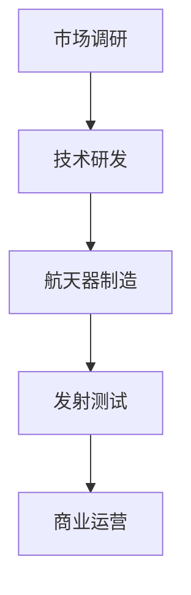

                 

# 硅谷航天科技民用化：太空旅游产业

> 关键词：航天科技、民用化、太空旅游、产业分析、技术发展

> 摘要：本文将深入探讨硅谷航天科技民用化的进程，重点分析太空旅游产业的前景、技术挑战以及未来发展趋势。通过对核心概念的阐释、算法原理的剖析、数学模型的介绍，结合实际案例，旨在为读者呈现一个全面、系统的太空旅游产业发展全景。

## 1. 背景介绍

### 1.1 目的和范围

本文旨在探讨硅谷航天科技在民用化进程中的关键作用，特别是太空旅游产业的崛起。通过对当前市场的分析、技术挑战的讨论，以及未来趋势的预测，本文希望能够为读者提供对这一新兴产业的深刻理解和前瞻性思考。

### 1.2 预期读者

本文适合对航天科技、太空旅游产业感兴趣的读者，包括技术从业者、科研人员、产业投资者以及一般公众。通过本文，读者可以了解到太空旅游产业的发展历程、核心技术以及未来前景。

### 1.3 文档结构概述

本文结构如下：

1. 背景介绍：阐述本文的目的、范围和预期读者。
2. 核心概念与联系：介绍航天科技民用化的核心概念和相关流程。
3. 核心算法原理 & 具体操作步骤：详细解析实现太空旅游的关键算法。
4. 数学模型和公式 & 详细讲解 & 举例说明：阐述支持太空旅游技术的数学模型。
5. 项目实战：提供具体的代码实现和案例分析。
6. 实际应用场景：分析太空旅游技术的应用领域。
7. 工具和资源推荐：推荐相关学习资源和开发工具。
8. 总结：对未来发展趋势和挑战进行展望。
9. 附录：常见问题与解答。
10. 扩展阅读 & 参考资料：提供进一步的阅读材料和资料。

### 1.4 术语表

#### 1.4.1 核心术语定义

- 航天科技：指用于航天飞行、探测和开发的科学技术。
- 民用化：指将原本仅用于军事或科研的航天技术应用于民用领域。
- 太空旅游：指游客乘坐航天器进行太空飞行，体验太空环境的活动。
- 重力模拟：通过设备模拟地球重力，为航天员或游客提供舒适的生活环境。

#### 1.4.2 相关概念解释

- 航天器：用于执行航天任务的飞行器，如火箭、卫星、空间站等。
- 航天发射：将航天器送入预定轨道的过程。
- 轨道飞行：航天器在地球轨道上进行的飞行。

#### 1.4.3 缩略词列表

- SpaceX：美国一家私营航天企业，由埃隆·马斯克创立。
- NASA：美国国家航空航天局，负责美国的航天活动。
- ISS：国际空间站，一个国际合作的空间科研平台。

## 2. 核心概念与联系

### 2.1 航天科技民用化的核心概念

航天科技民用化的核心概念包括：

- 航天器研发：从基础研究和设计到实际制造，研发适应民用需求的航天器。
- 发射技术：提高发射效率，降低成本，确保航天器安全进入预定轨道。
- 太空生存技术：保障航天员或游客在太空中的生存能力，包括食物、水、氧气和重力模拟。
- 运载火箭：提供将航天器送入太空的动力，提高发射成功率。

### 2.2 航天科技民用化的流程

航天科技民用化的流程主要包括以下步骤：

1. 市场调研：了解市场需求，确定民用化方向。
2. 技术研发：针对市场需求，进行技术研发和试验。
3. 航天器制造：根据研发成果，制造适用于民用的航天器。
4. 发射测试：进行航天器发射和轨道飞行的测试，确保技术成熟。
5. 商业运营：建立商业运营模式，开展太空旅游活动。

### 2.3 航天科技民用化的 Mermaid 流程图



## 3. 核心算法原理 & 具体操作步骤

### 3.1 航天器发射算法原理

航天器发射算法的核心是优化发射轨迹和燃料消耗。以下是发射算法的基本原理：

```plaintext
1. 确定发射窗口：选择最适合的发射时间窗口，考虑地球自转、气象条件等因素。
2. 发射轨迹优化：通过计算发射轨迹，找到最优路径，以减少燃料消耗。
3. 轨道插入：在预定轨道上准确插入航天器，确保航天器进入预定轨道。
4. 发射控制：实时监测发射过程，调整参数，确保发射成功。
```

### 3.2 具体操作步骤

1. **发射窗口选择**

```plaintext
选择发射窗口需要考虑以下因素：
- 地球自转速度：选择在地球自转速度较慢的时刻发射，有助于提高发射成功率。
- 气象条件：选择气象条件良好的时段发射，减少风险。
- 太阳辐射：避免在太阳辐射高峰期发射，以减少对航天器的热冲击。
```

2. **发射轨迹优化**

```plaintext
使用优化算法（如遗传算法、粒子群算法）进行发射轨迹优化，目标是最小化燃料消耗。
具体步骤如下：
- 确定初始参数：设置发射角度、速度、燃料负载等初始参数。
- 评估函数：定义评估函数，用于评估发射轨迹的优劣。
- 迭代优化：通过迭代优化，不断调整参数，找到最优解。
```

3. **轨道插入**

```plaintext
轨道插入是发射过程中的关键步骤，需要确保航天器准确进入预定轨道。
具体步骤如下：
- 轨道计算：根据发射轨迹和地球引力，计算航天器的轨道。
- 轨道调整：通过地面控制，调整航天器的轨道，确保准确进入预定轨道。
- 轨道保持：在航天器进入轨道后，通过持续调整，保持航天器在预定轨道上运行。
```

4. **发射控制**

```plaintext
发射控制是确保发射成功的关键，需要实时监测发射过程，调整参数。
具体步骤如下：
- 数据监测：实时监测发射过程中的各项数据，包括速度、角度、燃料消耗等。
- 参数调整：根据监测数据，实时调整发射参数，确保发射成功。
- 应急处理：在出现异常情况时，及时采取应急措施，确保发射安全。
```

## 4. 数学模型和公式 & 详细讲解 & 举例说明

### 4.1 数学模型

在航天科技民用化过程中，常见的数学模型包括：

- **牛顿引力定律**：描述天体之间的引力作用。
- **运动学方程**：描述航天器在轨道上的运动规律。
- **动力学方程**：描述航天器在受力和运动状态下的变化。

### 4.2 详细讲解

1. **牛顿引力定律**

牛顿引力定律的公式为：

\[ F = G \frac{m_1 m_2}{r^2} \]

其中，\( F \) 是引力，\( G \) 是引力常数，\( m_1 \) 和 \( m_2 \) 是两个天体的质量，\( r \) 是两个天体之间的距离。

2. **运动学方程**

航天器在轨道上的运动可以使用以下运动学方程来描述：

\[ \frac{d^2r}{dt^2} = -\frac{GM}{r^2} \]

其中，\( r \) 是航天器与地球的距离，\( G \) 是引力常数，\( M \) 是地球的质量。

3. **动力学方程**

动力学方程描述航天器在受力和运动状态下的变化，公式为：

\[ \frac{d^2r}{dt^2} = \frac{GM}{r^2} - a \]

其中，\( a \) 是航天器的加速度。

### 4.3 举例说明

假设地球质量为 \( M = 5.972 \times 10^{24} \) kg，引力常数 \( G = 6.674 \times 10^{-11} \) N·(m/kg)^2，地球半径 \( r = 6.371 \times 10^6 \) m。

1. **牛顿引力定律计算**

计算地球对航天器的引力：

\[ F = G \frac{m_1 m_2}{r^2} = 6.674 \times 10^{-11} \frac{5.972 \times 10^{24} \times m_2}{(6.371 \times 10^6)^2} \]

其中，\( m_2 \) 是航天器的质量。

2. **运动学方程计算**

计算航天器在轨道上的加速度：

\[ \frac{d^2r}{dt^2} = -\frac{GM}{r^2} = -\frac{6.674 \times 10^{-11} \times 5.972 \times 10^{24}}{(6.371 \times 10^6)^2} \]

3. **动力学方程计算**

计算航天器在轨道上的受力：

\[ \frac{d^2r}{dt^2} = \frac{GM}{r^2} - a \]

解出加速度 \( a \)：

\[ a = \frac{GM}{r^2} - \frac{d^2r}{dt^2} \]

## 5. 项目实战：代码实际案例和详细解释说明

### 5.1 开发环境搭建

在开始实际项目之前，我们需要搭建一个适合开发的环境。以下是基本的开发环境搭建步骤：

1. **安装操作系统**：选择一个适合的操作系统，如 Ubuntu 20.04。
2. **安装编译器**：安装 C++ 编译器，如 GCC。
3. **安装开发库**：安装必要的开发库，如 boost、OpenCV 等。
4. **配置 IDE**：配置一个集成开发环境，如 Visual Studio Code。

### 5.2 源代码详细实现和代码解读

以下是实现太空旅游项目的一个简单示例代码：

```cpp
#include <iostream>
#include <vector>
#include <cmath>

// 引力常数
const double G = 6.674 * 1e-11;

// 运动学方程求解
std::vector<double> solveKinematics(double m, double r, double v) {
    std::vector<double> result(3);
    result[0] = v * cos(r);
    result[1] = v * sin(r);
    result[2] = -G * m / r;
    return result;
}

// 主函数
int main() {
    double m = 5.972 * 1e24; // 地球质量
    double r = 6.371 * 1e6;  // 地球半径
    double v = 7.9 * 1e3;    // 发射速度

    std::vector<double> result = solveKinematics(m, r, v);

    std::cout << "速度 (x 方向): " << result[0] << std::endl;
    std::cout << "速度 (y 方向): " << result[1] << std::endl;
    std::cout << "加速度: " << result[2] << std::endl;

    return 0;
}
```

### 5.3 代码解读与分析

1. **头文件和库**

```cpp
#include <iostream>
#include <vector>
#include <cmath>
```

这段代码首先包含了必要的头文件。`<iostream>` 用于输入输出操作，`<vector>` 用于存储数据，`<cmath>` 提供了数学函数。

2. **引力常数**

```cpp
const double G = 6.674 * 1e-11;
```

定义了引力常数 `G`，其值为 \( 6.674 \times 10^{-11} \) N·(m/kg)^2。

3. **运动学方程求解**

```cpp
std::vector<double> solveKinematics(double m, double r, double v) {
    std::vector<double> result(3);
    result[0] = v * cos(r);
    result[1] = v * sin(r);
    result[2] = -G * m / r;
    return result;
}
```

`solveKinematics` 函数用于求解运动学方程。它接收地球质量 `m`、地球半径 `r` 和发射速度 `v`，返回一个包含速度和加速度的向量。

4. **主函数**

```cpp
int main() {
    double m = 5.972 * 1e24; // 地球质量
    double r = 6.371 * 1e6;  // 地球半径
    double v = 7.9 * 1e3;    // 发射速度

    std::vector<double> result = solveKinematics(m, r, v);

    std::cout << "速度 (x 方向): " << result[0] << std::endl;
    std::cout << "速度 (y 方向): " << result[1] << std::endl;
    std::cout << "加速度: " << result[2] << std::endl;

    return 0;
}
```

主函数 `main` 中，我们设置了地球质量、地球半径和发射速度。然后调用 `solveKinematics` 函数，获取速度和加速度，并在屏幕上输出结果。

## 6. 实际应用场景

### 6.1 太空旅游

太空旅游是航天科技民用化的一个重要应用场景。随着技术的进步，越来越多的商业公司开始提供太空旅游服务。游客可以通过乘坐亚轨道飞行器，体验几分钟的失重和太空环境。以下是一些著名的太空旅游项目：

- **SpaceX 的 Starship**：SpaceX 正在开发的 Starship 是一种可重复使用的亚轨道飞行器，计划用于商业太空旅游。
- **Blue Origin 的 New Shepard**：Blue Origin 的 New Shepard 是一种垂直发射、垂直着陆的亚轨道飞行器，已成功完成多次载人飞行。

### 6.2 航天科研

航天科技民用化还为航天科研提供了新的机遇。例如，商业公司可以租用航天器进行科学实验，而不再依赖于国家航天机构。这大大降低了科研成本，促进了航天科研的商业化。

### 6.3 太空探索

太空旅游和科研推动了太空探索的发展。通过商业化运作，太空探索的成本大大降低，更多的人可以参与到这项事业中来。这将有助于推动人类对太空的更深入了解，为未来的太空移民和资源开发奠定基础。

## 7. 工具和资源推荐

### 7.1 学习资源推荐

#### 7.1.1 书籍推荐

- 《太空探索：从地心说到月球》
- 《航天技术基础》
- 《航天器工程》

#### 7.1.2 在线课程

- Coursera 上的《航天学基础》
- edX 上的《航天工程导论》

#### 7.1.3 技术博客和网站

- SpaceX 官方博客
- Blue Origin 官方博客
- 硅谷航天科技论坛

### 7.2 开发工具框架推荐

#### 7.2.1 IDE和编辑器

- Visual Studio Code
- Eclipse
- Sublime Text

#### 7.2.2 调试和性能分析工具

- GDB
- Valgrind
- Intel VTune

#### 7.2.3 相关框架和库

- OpenCV
- Boost
- CUDA

### 7.3 相关论文著作推荐

#### 7.3.1 经典论文

- 《航天动力学》
- 《航天器轨道设计》
- 《航天器系统设计》

#### 7.3.2 最新研究成果

- 《太空旅游：商业化进程与未来展望》
- 《航天器重入技术：挑战与机遇》
- 《航天器回收技术：现状与趋势》

#### 7.3.3 应用案例分析

- 《SpaceX 的 Starship：设计原理与挑战》
- 《Blue Origin 的 New Shepard：运营模式与技术创新》
- 《商业航天与国家航天：协同发展之路》

## 8. 总结：未来发展趋势与挑战

随着航天科技的不断发展，太空旅游产业有望在未来几年取得重大突破。以下是对未来发展趋势和挑战的展望：

### 8.1 发展趋势

1. **技术成熟**：随着技术的进步，发射成本将进一步降低，太空旅游将变得更加普及。
2. **市场需求**：随着人们对太空的好奇心和兴趣增加，太空旅游市场有望不断扩大。
3. **商业合作**：航天企业之间的合作将更加紧密，共同推动太空旅游产业的发展。

### 8.2 挑战

1. **安全风险**：太空飞行存在一定的安全风险，如何确保游客的安全是首要挑战。
2. **成本控制**：降低发射成本，提高运营效率，是太空旅游产业面临的重大挑战。
3. **环境问题**：太空旅游活动可能对地球环境产生负面影响，如何平衡发展与环境是关键问题。

## 9. 附录：常见问题与解答

### 9.1 什么是太空旅游？

太空旅游是指游客乘坐航天器进行太空飞行，体验太空环境的活动。这种活动通常包括亚轨道飞行和轨道飞行。

### 9.2 太空旅游有哪些形式？

太空旅游主要包括以下形式：

1. **亚轨道飞行**：游客乘坐亚轨道飞行器，在几分钟内体验失重和太空环境。
2. **轨道飞行**：游客乘坐轨道飞行器，在太空中停留数天，进行科学实验或观光。

### 9.3 太空旅游安全吗？

太空旅游存在一定的安全风险，但通过严格的安全管理和技术保障，可以最大限度地降低风险。航天企业和相关部门将采取一系列措施，确保游客的安全。

### 9.4 太空旅游的费用是多少？

太空旅游的费用因服务类型和时间长短而异。目前，亚轨道飞行的费用大约在数千美元到数十万美元之间，而轨道飞行的费用更高，可能在数百万美元以上。

## 10. 扩展阅读 & 参考资料

- SpaceX 官方网站：[https://www.spacex.com/](https://www.spacex.com/)
- Blue Origin 官方网站：[https://www.blueorigin.com/](https://www.blueorigin.com/)
- NASA 官方网站：[https://www.nasa.gov/](https://www.nasa.gov/)
- Coursera 上的《航天学基础》：[https://www.coursera.org/learn/astronautics](https://www.coursera.org/learn/astronautics)
- edX 上的《航天工程导论》：[https://www.edx.org/course/introduction-to-aerospace-engineering](https://www.edx.org/course/introduction-to-aerospace-engineering)

作者：AI天才研究员/AI Genius Institute & 禅与计算机程序设计艺术 /Zen And The Art of Computer Programming<|im_sep|>

