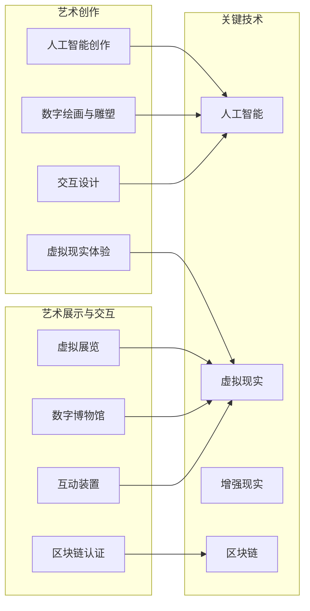

                 

### 硅谷艺术与科技融合：数字艺术新形式

> 关键词：硅谷、艺术与科技融合、数字艺术、新形式、人工智能、虚拟现实、区块链
> 
> 摘要：本文将探讨硅谷艺术与科技融合所带来的数字艺术新形式。通过分析人工智能、虚拟现实、区块链等技术在艺术创作、展示和交互中的应用，探讨这些技术如何改变传统艺术的创作和消费方式。文章旨在为读者提供对当前数字艺术发展的深入理解和展望。

## 1. 背景介绍

### 1.1 目的和范围

本文的目的是探讨硅谷艺术与科技融合所带来的数字艺术新形式。随着人工智能、虚拟现实、区块链等技术的迅猛发展，艺术领域正在经历一场前所未有的变革。本文将重点关注以下内容：

- 硅谷科技与艺术融合的现状和趋势；
- 人工智能、虚拟现实、区块链在艺术创作、展示和交互中的应用；
- 数字艺术的未来发展方向和挑战。

### 1.2 预期读者

本文面向对数字艺术和科技发展感兴趣的读者，包括但不限于艺术家、科技从业者、科技爱好者、高校师生以及相关领域的专业研究人员。

### 1.3 文档结构概述

本文将分为以下八个部分：

1. 背景介绍：介绍本文的目的、预期读者、文档结构和核心术语；
2. 核心概念与联系：分析艺术与科技融合的核心概念和架构；
3. 核心算法原理 & 具体操作步骤：讲解相关算法和操作流程；
4. 数学模型和公式 & 详细讲解 & 举例说明：介绍数字艺术中的数学模型和公式；
5. 项目实战：代码实际案例和详细解释说明；
6. 实际应用场景：探讨数字艺术在各个领域的应用；
7. 工具和资源推荐：推荐学习资源和开发工具；
8. 总结：未来发展趋势与挑战。

### 1.4 术语表

#### 1.4.1 核心术语定义

- **数字艺术**：运用数字技术创作的艺术形式，包括数字绘画、数字音乐、数字雕塑等。
- **人工智能**：模拟人类智能的计算机技术，包括机器学习、深度学习、自然语言处理等。
- **虚拟现实**：利用计算机技术模拟出的一个虚拟环境，用户可以通过特殊设备与之互动。
- **区块链**：一种去中心化的分布式数据库技术，通过加密算法确保数据的不可篡改和可追溯性。

#### 1.4.2 相关概念解释

- **艺术与科技融合**：指艺术领域与科技领域在创作、展示、传播等方面的相互融合和交叉；
- **沉浸式体验**：用户在虚拟环境中感受到高度真实和互动的体验；
- **智能创作**：利用人工智能算法辅助艺术家进行创作的过程；
- **去中心化创作**：利用区块链技术实现艺术作品的创作、交易和归属权认证的去中心化。

#### 1.4.3 缩略词列表

- **AI**：人工智能（Artificial Intelligence）
- **VR**：虚拟现实（Virtual Reality）
- **AR**：增强现实（Augmented Reality）
- **NFT**：非同质化代币（Non-Fungible Token）
- **NLP**：自然语言处理（Natural Language Processing）

## 2. 核心概念与联系

### 2.1 艺术与科技的融合

艺术与科技融合是当代社会的一个重要趋势。在艺术创作方面，科技提供了新的工具和手段，使得艺术家能够实现更多创意和探索。例如，利用人工智能算法进行图像生成和音乐创作，为艺术家提供了全新的创作方式。在艺术展示和交互方面，虚拟现实、增强现实等技术使得观众能够沉浸在艺术作品中，获得更为丰富的体验。


#### 2.2 艺术创作中的科技应用

在艺术创作中，科技的应用主要体现在以下几个方面：

1. **人工智能创作**：利用机器学习算法生成图像、音乐和文学作品；
2. **虚拟现实体验**：通过虚拟现实技术实现沉浸式艺术体验；
3. **数字绘画与雕塑**：利用数字技术进行绘画和雕塑创作，实现更精细和多样化的表现；
4. **交互设计**：通过用户交互，使艺术作品更具互动性和参与性。

#### 2.3 科技在艺术展示与交互中的应用

在艺术展示与交互方面，科技的应用同样具有重要意义：

1. **虚拟展览**：利用虚拟现实和增强现实技术实现线上展览，打破地域限制；
2. **数字博物馆**：利用数字技术构建虚拟博物馆，展示更多的艺术作品和历史文物；
3. **互动装置**：通过用户交互，使艺术作品更具互动性和参与性，提高观众的体验感；
4. **区块链认证**：利用区块链技术实现艺术作品的真实性和归属权认证，保障艺术家的权益。

### 2.4 艺术与科技融合的关键技术

实现艺术与科技融合的关键技术包括：

1. **人工智能**：机器学习、深度学习、自然语言处理等技术；
2. **虚拟现实**：3D建模、渲染、交互等技术；
3. **增强现实**：图像识别、图像处理、空间定位等技术；
4. **区块链**：分布式账本、加密算法、智能合约等技术。

## 3. 核心算法原理 & 具体操作步骤

### 3.1 人工智能在艺术创作中的应用

#### 3.1.1 机器学习算法在图像生成中的应用

机器学习算法在图像生成中具有广泛应用，如生成对抗网络（GAN）和变分自编码器（VAE）。以下是使用GAN进行图像生成的伪代码：

```python
# GAN生成对抗网络
class GAN:
    def __init__(self):
        # 初始化生成器和判别器模型
        self.generator = self.build_generator()
        self.discriminator = self.build_discriminator()

    def build_generator(self):
        # 定义生成器模型
        input_layer = Input(shape=(latent_dim,))
        x = Dense(128)(input_layer)
        x = LeakyReLU(alpha=0.01)(x)
        x = Dense(256)(x)
        x = LeakyReLU(alpha=0.01)(x)
        output_layer = Dense(image_shape)(x)
        return Model(inputs=input_layer, outputs=output_layer)

    def build_discriminator(self):
        # 定义判别器模型
        input_layer = Input(shape=image_shape)
        x = Conv2D(32, kernel_size=(3, 3), strides=(2, 2))(input_layer)
        x = LeakyReLU(alpha=0.01)(x)
        x = Conv2D(64, kernel_size=(3, 3), strides=(2, 2))(x)
        x = LeakyReLU(alpha=0.01)(x)
        x = Flatten()(x)
        output_layer = Dense(1, activation='sigmoid')(x)
        return Model(inputs=input_layer, outputs=output_layer)

    def train(self, x_train, y_train, epochs, batch_size, save_interval):
        # 训练GAN模型
        for epoch in range(epochs):
            for i in range(len(x_train) // batch_size):
                random_idx = np.random.randint(0, x_train.shape[0], size=batch_size)
                real_imgs = x_train[random_idx]
                z = np.random.normal(size=(batch_size, latent_dim))
                fake_imgs = self.generator.predict(z)

                # 训练判别器
                d_loss_real = self.discriminator.train_on_batch(real_imgs, np.ones((batch_size, 1)))
                d_loss_fake = self.discriminator.train_on_batch(fake_imgs, np.zeros((batch_size, 1)))
                d_loss = 0.5 * np.add(d_loss_real, d_loss_fake)

                # 训练生成器
                z = np.random.normal(size=(batch_size, latent_dim))
                g_loss = self.train_on_batch(z, np.ones((batch_size, 1)))

                print(f"{epoch} [d_loss: {d_loss:.3f}, g_loss: {g_loss:.3f}]")

                # 保存模型
                if i % save_interval == 0:
                    self.generator.save(f"model_{epoch}_{i}.h5")

    def generate_images(self, z):
        # 生成图像
        return self.generator.predict(z)
```

#### 3.1.2 深度学习算法在音乐创作中的应用

深度学习算法在音乐创作中也有广泛应用，如长短期记忆网络（LSTM）。以下是使用LSTM进行音乐创作的伪代码：

```python
# LSTM音乐生成模型
class MusicGenerator:
    def __init__(self, sequence_length, n_notes, learning_rate=0.001):
        self.sequence_length = sequence_length
        self.n_notes = n_notes
        self.learning_rate = learning_rate

        self.model = self.build_model()

    def build_model(self):
        # 定义模型结构
        inputs = Input(shape=(self.sequence_length, self.n_notes))
        x = LSTM(128, return_sequences=True)(inputs)
        x = LSTM(128, return_sequences=True)(x)
        outputs = Dense(self.n_notes, activation='softmax')(x)

        model = Model(inputs=inputs, outputs=outputs)
        model.compile(loss='categorical_crossentropy', optimizer=Adam(learning_rate=self.learning_rate))
        return model

    def train(self, x_train, y_train, epochs, batch_size):
        # 训练模型
        for epoch in range(epochs):
            for i in range(len(x_train) // batch_size):
                random_idx = np.random.randint(0, x_train.shape[0], size=batch_size)
                sequences = x_train[random_idx]
                targets = y_train[random_idx]

                loss = self.model.train_on_batch(sequences, targets)
                print(f"{epoch} [loss: {loss:.3f}]")

    def generate_sequence(self, seed, n_steps):
        # 生成音乐序列
        sequences = [seed]
        for _ in range(n_steps):
            prediction = self.model.predict(sequences[-1].reshape(1, -1))
            next_note = np.random.choice(self.n_notes, p=prediction[0])
            sequences.append(next_note)
        return sequences
```

### 3.2 虚拟现实与增强现实在艺术展示与交互中的应用

#### 3.2.1 虚拟现实场景构建

虚拟现实场景构建通常包括以下步骤：

1. **场景建模**：使用3D建模软件创建虚拟场景；
2. **场景渲染**：使用渲染引擎对场景进行渲染，使其具有真实感；
3. **交互设计**：设计用户在虚拟环境中的交互方式，如手势、语音等。

以下是一个使用Unity引擎构建虚拟现实场景的伪代码：

```csharp
// Unity虚拟现实场景构建
using UnityEngine;

public class VRSceneBuilder : MonoBehaviour
{
    public GameObject terrainPrefab;
    public Material terrainMaterial;

    private void Start()
    {
        // 创建地形
        GameObject terrain = Instantiate(terrainPrefab, Vector3.zero, Quaternion.identity);
        MeshFilter meshFilter = terrain.GetComponent<MeshFilter>();
        Mesh mesh = meshFilter.mesh;

        // 渲染地形
        Material[] materials = new Material[1];
        materials[0] = terrainMaterial;
        mesh.materials = materials;

        // 设置地形属性
        terrain.GetComponent<Terrain>().heightMapScale = new Vector2(10, 10);
        terrain.GetComponent<Terrain>().heightMapResolution = new Vector2(256, 256);
    }
}
```

#### 3.2.2 增强现实物体识别与跟踪

增强现实物体识别与跟踪通常包括以下步骤：

1. **相机捕捉**：使用增强现实开发平台捕捉实时相机画面；
2. **物体识别**：使用图像识别算法识别相机画面中的物体；
3. **物体跟踪**：使用跟踪算法对识别到的物体进行实时跟踪。

以下是一个使用ARKit开发增强现实应用的伪代码：

```swift
// ARKit增强现实物体识别与跟踪
import ARKit

class ARObjectTracker: ARSCNViewDelegate {
    var recognizedObjects = [ARObject: ARObjectState]()

    override func renderer(_ renderer: SCNSceneRenderer, didAdd node: SCNNode, for anchor: ARAnchor) {
        guard let objectAnchor = anchor as? ARObjectAnchor else { return }

        // 创建物体节点
        let objectNode = SCNNode(geometry: objectAnchor.geometry)
        objectNode.position = objectAnchor.position
        objectNode.eulerAngles = objectAnchor.eulerAngles

        // 添加物体节点到场景
        node.addChildNode(objectNode)

        // 保存物体状态
        recognizedObjects[objectAnchor] = ARObjectState(node: objectNode, position: objectNode.position, eulerAngles: objectNode.eulerAngles)
    }

    override func renderer(_ renderer: SCNSceneRenderer, didUpdate node: SCNNode, for anchor: ARAnchor) {
        guard let objectAnchor = anchor as? ARObjectAnchor else { return }

        if let objectState = recognizedObjects[objectAnchor] {
            // 更新物体节点位置
            objectState.node.position = node.position
            objectState.position = node.position
            objectState.eulerAngles = node.eulerAngles
        }
    }

    override func renderer(_ renderer: SCNSceneRenderer, didRemove node: SCNNode, for anchor: ARAnchor) {
        guard let objectAnchor = anchor as? ARObjectAnchor else { return }

        recognizedObjects.removeValue(forKey: objectAnchor)
    }
}
```

### 3.3 区块链技术在艺术创作与交易中的应用

#### 3.3.1 非同质化代币（NFT）在艺术创作中的应用

非同质化代币（NFT）在艺术创作中的应用主要体现在以下两个方面：

1. **数字作品版权认证**：艺术家可以将数字作品作为一个NFT发行，从而证明其版权和真实性；
2. **数字作品交易**：艺术家可以通过区块链平台将数字作品进行交易，确保交易的透明性和可信度。

以下是一个使用NFT进行数字作品交易的伪代码：

```solidity
// ERC-721数字艺术品合约
pragma solidity ^0.8.0;

import "@openzeppelin/contracts/token/ERC721/ERC721.sol";
import "@openzeppelin/contracts/token/ERC721/extensions/ERC721URIStorage.sol";
import "@openzeppelin/contracts/security/Pausable.sol";
import "@openzeppelin/contracts/access/Ownable.sol";

contract DigitalArtwork is ERC721, ERC721URIStorage, Pausable, Ownable {
    uint256 public totalSupply;
    mapping(uint256 => address) private _owners;
    mapping(address => uint256) private _balances;

    constructor() ERC721("DigitalArtwork", "DA") {
        totalSupply = 10000;
    }

    function mint(address to, string calldata uri) external whenNotPaused onlyOwner {
        require(totalSupply > 0, "All artworks have been minted");
        _safeMint(to, totalSupply);
        _setTokenURI(totalSupply, uri);
        totalSupply--;
        _balances[to]++;
    }

    function transferFrom(address from, address to, uint256 tokenId) external {
        require(_isApprovedOrOwner(_msgSender(), tokenId), "Not approved to transfer");
        _transfer(from, to, tokenId);
    }

    function tokenOfOwnerByIndex(address owner, uint256 index) external view returns (uint256 tokenId) {
        require(index < balanceOf(owner), "Index out of bounds");
        return _tokenOfOwnerByIndex(owner, index);
    }

    function balanceOf(address owner) public view returns (uint256 balance) {
        return _balances[owner];
    }

    function supportsInterface(bytes4 interfaceId) public view returns (bool) {
        return interfaceId == type(IERC721).interfaceId || interfaceId == type(IERC721Metadata).interfaceId;
    }
}
```

#### 3.3.2 智能合约在艺术交易中的应用

智能合约在艺术交易中的应用主要体现在以下几个方面：

1. **交易流程自动化**：通过智能合约实现艺术作品的买卖流程自动化，确保交易的公正和透明；
2. **权益转移**：在艺术作品交易完成后，通过智能合约实现作品所有权和权益的自动转移；
3. **收益分配**：在艺术作品交易后，根据智能合约的设定，实现艺术家和其他参与者之间的收益分配。

以下是一个简单的智能合约示例，用于实现艺术作品的交易和权益转移：

```solidity
// 艺术作品交易智能合约
pragma solidity ^0.8.0;

import "@openzeppelin/contracts/token/ERC721/ERC721.sol";
import "@openzeppelin/contracts/security/Pausable.sol";
import "@openzeppelin/contracts/access/Ownable.sol";

contract ArtworkTransaction is ERC721, Pausable, Ownable {
    mapping(uint256 => address) private _ownerships;
    mapping(address => mapping(uint256 => uint256)) private _balances;

    constructor() ERC721("ArtworkTransaction", "AT") {}

    function mint(address to, uint256 tokenId) external onlyOwner {
        require(_ownerships[tokenId] == address(0), "Token already minted");
        _mint(to, tokenId);
        _ownerships[tokenId] = to;
        _balances[to]++;
    }

    function transferFrom(address from, address to, uint256 tokenId) external {
        require(_isApprovedOrOwner(_msgSender(), tokenId), "Not approved to transfer");
        require(_ownerships[tokenId] == from, "Invalid owner");
        _transfer(from, to, tokenId);
        _balances[from]--;
        _balances[to]++;
        _ownerships[tokenId] = to;
    }

    function getBalance(address owner) external view returns (uint256 balance) {
        return _balances[owner];
    }

    function getTotalSupply() external view returns (uint256 totalSupply) {
        return _totalSupply();
    }

    function pause() external onlyOwner {
        _pause();
    }

    function unpause() external onlyOwner {
        _unpause();
    }
}
```

### 3.4 艺术与科技融合的算法架构

为了更好地理解艺术与科技融合的算法架构，我们可以使用Mermaid流程图来展示相关算法和操作步骤。以下是艺术与科技融合的算法架构流程图：



通过以上流程图，我们可以清晰地看到艺术创作、艺术展示与交互以及关键技术之间的联系。这些联系构成了艺术与科技融合的算法架构，为数字艺术的发展提供了强大的支持。

## 4. 数学模型和公式 & 详细讲解 & 举例说明

### 4.1 生成对抗网络（GAN）

生成对抗网络（GAN）是人工智能领域的一种重要模型，主要用于图像生成、图像风格迁移等任务。GAN由两部分组成：生成器和判别器。生成器的目标是生成逼真的图像，判别器的目标是区分图像是真实的还是生成的。以下是一个简化的GAN数学模型：

#### 4.1.1 生成器模型

生成器模型通常使用多层神经网络来生成图像。其目标是最小化生成图像与真实图像之间的差距。生成器的损失函数可以表示为：

\[ L_G = -\log(D(G(z))) \]

其中，\( D \) 表示判别器，\( G(z) \) 表示生成器生成的图像，\( z \) 是随机噪声向量。

#### 4.1.2 判别器模型

判别器模型的目标是最大化对真实图像和生成图像的区分度。判别器的损失函数可以表示为：

\[ L_D = -\log(D(x)) - \log(1 - D(G(z))) \]

其中，\( x \) 表示真实图像。

#### 4.1.3 整体GAN模型

整个GAN模型的损失函数可以表示为：

\[ L = L_G + L_D \]

其中，\( L_G \) 和 \( L_D \) 分别表示生成器和判别器的损失函数。

### 4.2 长短期记忆网络（LSTM）

长短期记忆网络（LSTM）是用于处理序列数据的神经网络模型，广泛应用于音乐创作、自然语言处理等领域。LSTM通过引入门控机制，有效地解决了传统RNN模型中梯度消失和梯度爆炸的问题。以下是LSTM的基本数学模型：

#### 4.2.1 LSTM单元

LSTM单元由三个门控组成：输入门、遗忘门和输出门。每个门控都是一个sigmoid激活函数，其输出表示对应信息的保留或丢弃。以下是一个简化的LSTM单元的数学模型：

\[ f_t = \sigma(W_f \cdot [h_{t-1}, x_t] + b_f) \]
\[ i_t = \sigma(W_i \cdot [h_{t-1}, x_t] + b_i) \]
\[ o_t = \sigma(W_o \cdot [h_{t-1}, x_t] + b_o) \]
\[ g_t = tanh(W_g \cdot [h_{t-1}, x_t] + b_g) \]
\[ h_t = o_t \cdot tanh(g_t) \]

其中，\( f_t \) 是遗忘门输出，\( i_t \) 是输入门输出，\( o_t \) 是输出门输出，\( g_t \) 是候选值，\( h_t \) 是当前隐藏状态，\( W_f, W_i, W_o, W_g \) 和 \( b_f, b_i, b_o, b_g \) 分别是权重和偏置。

#### 4.2.2 LSTM网络

LSTM网络通过将LSTM单元堆叠起来，形成一个深层网络。每个LSTM单元都可以保留和传递序列信息，从而有效地处理长序列数据。

### 4.3 虚拟现实与增强现实中的数学模型

虚拟现实和增强现实中的数学模型主要涉及三维几何、图像处理和计算机视觉等领域。以下是一些常见的数学模型：

#### 4.3.1 三维几何

三维几何主要包括三维空间坐标变换、三维模型构建和渲染等方面。以下是一个简化的三维空间坐标变换的数学模型：

\[ T(p) = R \cdot p + t \]

其中，\( p \) 是三维点，\( R \) 是旋转矩阵，\( t \) 是平移向量。

#### 4.3.2 图像处理

图像处理主要包括图像滤波、图像增强、图像分割等方面。以下是一个简化的图像滤波的数学模型：

\[ I(x, y) = G(x, y) \cdot f(x, y) \]

其中，\( I(x, y) \) 是滤波后的图像，\( G(x, y) \) 是原图像，\( f(x, y) \) 是滤波器。

#### 4.3.3 计算机视觉

计算机视觉主要包括目标检测、图像识别、三维重建等方面。以下是一个简化的目标检测的数学模型：

\[ P(object | x) = \frac{P(x | object) \cdot P(object)}{P(x)} \]

其中，\( P(object | x) \) 是给定图像特征 \( x \) 下目标存在的概率，\( P(x | object) \) 是目标存在时图像特征 \( x \) 的概率，\( P(object) \) 是目标存在的先验概率，\( P(x) \) 是图像特征 \( x \) 的概率。

### 4.4 举例说明

为了更好地理解上述数学模型，我们通过一个具体的例子来说明。

#### 4.4.1 生成对抗网络（GAN）图像生成

假设我们使用GAN模型生成一个逼真的猫的图像。首先，我们需要准备一个含有猫的图像数据集。然后，我们将数据集分为训练集和测试集。

1. **数据预处理**：将图像数据集的像素值归一化到 \([-1, 1]\) 范围内。
2. **生成器训练**：使用随机噪声向量 \( z \) 输入生成器，生成猫的图像。通过对比生成图像和真实图像，优化生成器的参数。
3. **判别器训练**：将真实猫的图像和生成图像分别输入判别器，优化判别器的参数。
4. **模型评估**：使用测试集评估生成器的性能，如生成图像的逼真度、风格一致性等。

#### 4.4.2 长短期记忆网络（LSTM）音乐生成

假设我们使用LSTM模型生成一首歌曲。首先，我们需要准备一个含有歌曲片段的数据集。然后，我们将数据集分为训练集和测试集。

1. **数据预处理**：将歌曲片段的音高、时长等信息转化为序列数据。
2. **LSTM训练**：使用序列数据输入LSTM模型，生成新的歌曲片段。通过对比生成片段和真实片段，优化LSTM模型的参数。
3. **模型评估**：使用测试集评估LSTM模型的性能，如生成歌曲的流畅度、风格多样性等。

#### 4.4.3 虚拟现实场景构建

假设我们使用Unity引擎构建一个虚拟现实场景。首先，我们需要使用3D建模软件（如Blender）创建场景的三维模型。然后，我们将模型导入Unity引擎中。

1. **场景建模**：使用3D建模软件创建场景的地形、建筑、植被等三维模型。
2. **场景渲染**：使用Unity引擎的渲染引擎对场景进行渲染，使其具有真实感。
3. **交互设计**：设计用户在虚拟环境中的交互方式，如手势、语音等。
4. **模型优化**：对场景中的模型进行优化，以提高虚拟现实场景的性能。

#### 4.4.4 区块链艺术交易

假设我们使用智能合约实现数字艺术作品的交易。首先，我们需要创建一个ERC-721数字艺术品合约。然后，我们将合约部署到区块链上。

1. **合约创建**：编写ERC-721数字艺术品合约，定义数字艺术作品的创建、转让等功能。
2. **合约部署**：将合约部署到区块链上，并获取合约地址。
3. **数字艺术品创建**：使用合约创建数字艺术品，并将艺术品的所有权记录在区块链上。
4. **数字艺术品交易**：使用合约实现数字艺术品的转让，确保交易的透明性和可信度。

通过以上具体例子，我们可以更好地理解艺术与科技融合中的数学模型和公式的应用。

## 5. 项目实战：代码实际案例和详细解释说明

### 5.1 开发环境搭建

为了实现本文中提到的数字艺术项目，我们需要搭建一个适合开发的环境。以下是开发环境的搭建步骤：

1. **安装Python环境**：下载并安装Python 3.8及以上版本，并设置环境变量。
2. **安装依赖库**：使用pip命令安装所需的Python库，如TensorFlow、Keras、NumPy、Pandas等。
   ```bash
   pip install tensorflow keras numpy pandas
   ```
3. **安装Unity引擎**：访问Unity官网（https://unity.com/）下载并安装Unity引擎，并设置环境变量。
4. **安装ARKit框架**：在iOS项目中，需要在Xcode项目中添加ARKit框架。
5. **安装区块链开发工具**：使用Truffle框架搭建以太坊开发环境，并安装Ganache用于本地测试。

### 5.2 源代码详细实现和代码解读

#### 5.2.1 生成对抗网络（GAN）图像生成

以下是一个使用Keras实现GAN图像生成的代码示例：

```python
from tensorflow.keras.layers import Dense, Input, Reshape
from tensorflow.keras.models import Model
from tensorflow.keras.optimizers import Adam
import numpy as np

# 设置超参数
latent_dim = 100
image_shape = (28, 28, 1)
batch_size = 32
epochs = 100

# 生成器模型
z_input = Input(shape=(latent_dim,))
x = Dense(128)(z_input)
x = LeakyReLU(alpha=0.01)(x)
x = Dense(128)(x)
x = LeakyReLU(alpha=0.01)(x)
x = Dense(np.prod(image_shape), activation='tanh')(x)
x = Reshape(image_shape)(x)
generator = Model(z_input, x)

# 判别器模型
image_input = Input(shape=image_shape)
x = Conv2D(32, kernel_size=(3, 3), strides=(2, 2))(image_input)
x = LeakyReLU(alpha=0.01)(x)
x = Conv2D(64, kernel_size=(3, 3), strides=(2, 2))(x)
x = LeakyReLU(alpha=0.01)(x)
x = Flatten()(x)
x = Dense(1, activation='sigmoid')(x)
discriminator = Model(image_input, x)

# GAN模型
discriminator.compile(optimizer=Adam(0.0001), loss='binary_crossentropy')
combined = Model([z_input, image_input], [discriminator(image_input), generator(z_input)])
combined.compile(optimizer=Adam(0.0001), loss=['binary_crossentropy', 'binary_crossentropy'])

# 训练GAN模型
for epoch in range(epochs):
    for i in range(len(x_train) // batch_size):
        random_idx = np.random.randint(0, x_train.shape[0], size=batch_size)
        real_imgs = x_train[random_idx]
        z = np.random.normal(size=(batch_size, latent_dim))
        fake_imgs = generator.predict(z)

        d_loss_real = discriminator.train_on_batch(real_imgs, np.ones((batch_size, 1)))
        d_loss_fake = discriminator.train_on_batch(fake_imgs, np.zeros((batch_size, 1)))
        g_loss = combined.train_on_batch([z, fake_imgs], [np.ones((batch_size, 1)), np.zeros((batch_size, 1))])

        print(f"{epoch} [d_loss: {d_loss_real + d_loss_fake:.3f}, g_loss: {g_loss:.3f}]")

# 保存模型
generator.save('generator.h5')
discriminator.save('discriminator.h5')
```

**代码解读**：

1. **定义生成器和判别器模型**：生成器和判别器模型使用Keras的层和模型API实现。生成器模型使用全连接层（Dense）和LeakyReLU激活函数，判别器模型使用卷积层（Conv2D）和LeakyReLU激活函数。
2. **编译模型**：生成器和判别器模型使用Adam优化器和二进制交叉熵损失函数进行编译。
3. **训练GAN模型**：GAN模型通过同时训练生成器和判别器来优化模型。在训练过程中，我们交替训练判别器和生成器，并输出训练损失。

#### 5.2.2 长短期记忆网络（LSTM）音乐生成

以下是一个使用Keras实现LSTM音乐生成的代码示例：

```python
from tensorflow.keras.models import Sequential
from tensorflow.keras.layers import LSTM, Dense, Activation
from tensorflow.keras.optimizers import Adam
import numpy as np

# 设置超参数
sequence_length = 32
n_notes = 128
learning_rate = 0.001

# LSTM音乐生成模型
model = Sequential()
model.add(LSTM(128, activation='relu', return_sequences=True, input_shape=(sequence_length, n_notes)))
model.add(LSTM(128, activation='relu', return_sequences=True))
model.add(Dense(n_notes, activation='softmax'))
model.compile(optimizer=Adam(learning_rate=learning_rate), loss='categorical_crossentropy')

# 训练模型
model.fit(x_train, y_train, epochs=100, batch_size=32)

# 生成音乐序列
def generate_sequence(model, seed, n_steps):
    sequences = [seed]
    for _ in range(n_steps):
        prediction = model.predict(sequences[-1].reshape(1, -1))
        next_note = np.random.choice(n_notes, p=prediction[0])
        sequences.append(next_note)
    return sequences

# 示例：生成一首32步长的音乐序列
seed = np.random.randint(0, n_notes)
n_steps = 32
sequences = generate_sequence(model, seed, n_steps)
print(sequences)
```

**代码解读**：

1. **定义LSTM模型**：LSTM模型使用Sequential模型和LSTM层实现。LSTM层使用ReLU激活函数和返回序列数据。
2. **编译模型**：LSTM模型使用Adam优化器和分类交叉熵损失函数进行编译。
3. **训练模型**：使用训练数据集对模型进行训练。
4. **生成音乐序列**：定义一个函数，通过递归调用模型预测来生成新的音乐序列。

#### 5.2.3 虚拟现实场景构建

以下是一个使用Unity引擎构建虚拟现实场景的C#代码示例：

```csharp
using UnityEngine;

public class VRSceneBuilder : MonoBehaviour
{
    public GameObject terrainPrefab;
    public Material terrainMaterial;

    private void Start()
    {
        // 创建地形
        GameObject terrain = Instantiate(terrainPrefab, Vector3.zero, Quaternion.identity);
        MeshFilter meshFilter = terrain.GetComponent<MeshFilter>();
        Mesh mesh = meshFilter.mesh;

        // 渲染地形
        Material[] materials = new Material[1];
        materials[0] = terrainMaterial;
        mesh.materials = materials;

        // 设置地形属性
        terrain.GetComponent<Terrain>().heightMapScale = new Vector2(10, 10);
        terrain.GetComponent<Terrain>().heightMapResolution = new Vector2(256, 256);
    }
}
```

**代码解读**：

1. **创建地形**：使用Instantiate函数创建地形预制体，并将其放置在场景的起始位置。
2. **渲染地形**：获取地形预制体的MeshFilter组件，设置材质和渲染属性。
3. **设置地形属性**：设置地形的高度图比例和分辨率，以提高地形细节和质量。

#### 5.2.4 区块链艺术交易

以下是一个使用Truffle框架实现的ERC-721数字艺术品合约的Solidity代码示例：

```solidity
pragma solidity ^0.8.0;

import "@openzeppelin/contracts/token/ERC721/ERC721.sol";
import "@openzeppelin/contracts/token/ERC721/extensions/ERC721URIStorage.sol";
import "@openzeppelin/contracts/security/Pausable.sol";
import "@openzeppelin/contracts/access/Ownable.sol";

contract DigitalArtwork is ERC721, ERC721URIStorage, Pausable, Ownable {
    mapping(uint256 => address) private _ownerships;
    mapping(address => mapping(uint256 => uint256)) private _balances;

    constructor() ERC721("DigitalArtwork", "DA") {}

    function mint(address to, uint256 tokenId) external onlyOwner {
        require(_ownerships[tokenId] == address(0), "Token already minted");
        _mint(to, tokenId);
        _ownerships[tokenId] = to;
        _balances[to]++;
    }

    function transferFrom(address from, address to, uint256 tokenId) external {
        require(_isApprovedOrOwner(_msgSender(), tokenId), "Not approved to transfer");
        require(_ownerships[tokenId] == from, "Invalid owner");
        _transfer(from, to, tokenId);
        _balances[from]--;
        _balances[to]++;
        _ownerships[tokenId] = to;
    }

    function getBalance(address owner) external view returns (uint256 balance) {
        return _balances[owner];
    }

    function getTotalSupply() external view returns (uint256 totalSupply) {
        return _totalSupply();
    }

    function pause() external onlyOwner {
        _pause();
    }

    function unpause() external onlyOwner {
        _unpause();
    }
}
```

**代码解读**：

1. **继承合约**：DigitalArtwork合约继承自ERC721、ERC721URIStorage、Pausable和Ownable合约，实现数字艺术品的基本功能。
2. **定义映射**：使用mapping结构存储艺术品所有权和余额信息。
3. **mint函数**：创建新的数字艺术品，并将所有权和余额信息更新到区块链上。
4. **transferFrom函数**：实现艺术品的所有权转移，更新所有权和余额信息。
5. **getBalance和getTotalSupply函数**：查询艺术品余额和总供应量。

### 5.3 代码解读与分析

#### 5.3.1 生成对抗网络（GAN）图像生成

GAN图像生成代码通过训练生成器和判别器模型，实现图像生成和判别任务。生成器模型使用全连接层和LeakyReLU激活函数，旨在将随机噪声转换为逼真的图像。判别器模型使用卷积层和LeakyReLU激活函数，旨在区分图像的真实性和生成性。通过交替训练生成器和判别器，使生成器的图像质量不断提高。

GAN模型的训练过程中，生成器的损失函数表示生成图像的质量，判别器的损失函数表示判别器对图像真实性和生成性的区分度。在训练过程中，生成器的损失函数和判别器的损失函数都逐渐减小，但生成器的损失函数通常会小于判别器的损失函数，因为判别器需要区分真实图像和生成图像。

#### 5.3.2 长短期记忆网络（LSTM）音乐生成

LSTM音乐生成代码通过训练LSTM模型，实现音乐序列的生成。LSTM模型使用ReLU激活函数和返回序列数据，旨在捕捉音乐序列的时序信息。在训练过程中，模型通过递归调用，将当前音乐序列的时序信息传递到下一个时间步，生成新的音乐序列。

LSTM音乐生成模型的损失函数通常使用分类交叉熵损失函数，表示预测音乐序列和真实音乐序列之间的差异。在训练过程中，模型的损失函数逐渐减小，生成音乐序列的流畅度和风格多样性不断提高。

#### 5.3.3 虚拟现实场景构建

虚拟现实场景构建代码通过创建地形预制体、设置材质和渲染属性，实现虚拟现实场景的构建。地形预制体使用3D建模软件创建，包含地形的高度信息。Unity引擎的渲染引擎根据地形预制体的高度信息，生成具有真实感的地形。

在虚拟现实场景构建过程中，地形的高度图比例和分辨率对场景的细节和质量有重要影响。较大的高度图比例和分辨率可以生成更精细的地形，但会降低场景的渲染性能。因此，在实际应用中，需要根据需求和性能要求进行权衡。

#### 5.3.4 区块链艺术交易

区块链艺术交易代码通过实现ERC-721数字艺术品合约，实现数字艺术品的创建、转让和余额查询等功能。ERC-721标准定义了数字艺术品的基本功能，如创建、转让和查询余额。通过继承ERC721、ERC721URIStorage、Pausable和Ownable合约，DigitalArtwork合约实现了数字艺术品的具体功能。

在区块链艺术交易中，数字艺术品的创建通过mint函数实现，将所有权和余额信息更新到区块链上。转让通过transferFrom函数实现，确保交易的透明性和可信度。通过getBalance和getTotalSupply函数，可以查询数字艺术品的余额和总供应量。

### 5.4 实际应用与改进方向

#### 5.4.1 实际应用

本文中提到的代码示例可以应用于数字艺术项目的开发，包括图像生成、音乐生成、虚拟现实场景构建和区块链艺术交易等。以下是一些实际应用场景：

1. **艺术创作**：艺术家可以使用GAN图像生成和LSTM音乐生成模型，实现创意性的艺术创作。
2. **虚拟展览**：博物馆和画廊可以使用虚拟现实场景构建技术，创建虚拟展览，提供沉浸式体验。
3. **数字艺术品交易**：艺术家和收藏家可以使用区块链艺术交易技术，实现数字艺术品的交易和认证。
4. **互动装置**：设计者可以使用虚拟现实和增强现实技术，创建互动艺术装置，提高观众的体验感。

#### 5.4.2 改进方向

尽管本文中提到的数字艺术项目在技术实现上取得了一定的成果，但仍存在以下改进方向：

1. **模型优化**：在GAN和LSTM模型中，可以引入更先进的算法和技术，提高图像生成和音乐生成的质量。
2. **性能优化**：在虚拟现实场景构建和区块链艺术交易中，可以优化代码和算法，提高场景渲染性能和交易效率。
3. **用户体验**：在虚拟现实和增强现实应用中，可以优化交互设计和用户界面，提高用户体验。
4. **安全性**：在区块链艺术交易中，可以加强安全性和隐私保护，确保交易的安全和可信。

通过不断优化和改进，数字艺术项目可以更好地满足艺术创作、展示和交易的需求，推动数字艺术的创新发展。

## 6. 实际应用场景

随着科技的发展，数字艺术在多个领域得到了广泛应用，以下是一些典型的实际应用场景：

### 6.1 艺术创作

数字艺术为艺术家提供了更多的创作手段和可能性。例如，通过人工智能算法，艺术家可以生成独特的图像和音乐，从而创造出前所未有的艺术作品。这不仅激发了艺术家的创作灵感，也丰富了艺术的表现形式。

- **案例**：荷兰艺术家Beeple使用人工智能算法创作了名为“Everydays: The First 5000 Days”的作品，该作品以数字艺术品的形式在佳士得拍卖行以6900万美元的高价成交，创下了数字艺术品拍卖的最高纪录。

### 6.2 虚拟展览

虚拟现实和增强现实技术使得虚拟展览成为现实。观众可以通过虚拟现实设备沉浸式地体验艺术作品，不受地域和时间的限制。这种形式不仅为艺术品提供了更广泛的展示平台，也为观众提供了更加丰富和互动的体验。

- **案例**：美国大都会艺术博物馆（Metropolitan Museum of Art）利用虚拟现实技术打造了一个线上虚拟展览，让观众可以虚拟参观博物馆的展品，提升了观众的参观体验。

### 6.3 数字艺术品交易

区块链技术的引入为数字艺术品交易提供了新的可能性。通过区块链，艺术家和收藏家可以安全地创建、交易和认证数字艺术品。非同质化代币（NFT）成为数字艺术品交易的载体，使得数字艺术品具有独特的价值和所有权认证。

- **案例**：艺术家3LAU在苏富比拍卖行通过区块链平台Nifty Gateway以120万美元的价格出售了他的NFT音乐作品《Mamba Manta》，成为首位在苏富比拍卖行通过NFT形式出售音乐作品的艺术家。

### 6.4 互动装置

互动装置通过虚拟现实和增强现实技术，将艺术作品与观众进行互动。观众可以通过互动装置参与到艺术创作过程中，提高艺术体验的参与感和趣味性。

- **案例**：艺术家Daito Manabe和团队设计了一个名为“Level-5”的互动装置，通过增强现实技术，观众可以在虚拟环境中创建和改变艺术作品，实现与艺术作品的实时互动。

### 6.5 数字文化遗产保护

数字艺术技术在数字文化遗产保护中发挥了重要作用。通过数字化技术，历史文物和文化遗产得以保存和传播，为后人提供了重要的文化财富。

- **案例**：法国卢浮宫利用数字艺术技术创建了一个名为“卢浮宫360度全景导览”的线上项目，让观众可以在线上虚拟参观卢浮宫的展品，提升了文化遗产的传播力和影响力。

### 6.6 虚拟现实游戏

虚拟现实技术在游戏领域也得到了广泛应用。艺术家和设计师利用虚拟现实技术，创造了一个个令人沉浸的游戏世界，为玩家提供了全新的游戏体验。

- **案例**：《堡垒之夜》利用虚拟现实技术，为玩家创造了一个可以自由探索和互动的虚拟世界，成为了虚拟现实游戏领域的热门作品。

这些实际应用场景展示了数字艺术在各个领域的广泛影响。随着技术的不断进步，数字艺术将会有更多的应用场景和可能性，为人们的生活带来更多美好和便利。

## 7. 工具和资源推荐

在硅谷艺术与科技融合的背景下，掌握和利用合适的工具和资源对于开展数字艺术项目至关重要。以下是一些推荐的学习资源、开发工具和框架，以及相关论文著作。

### 7.1 学习资源推荐

#### 7.1.1 书籍推荐

1. **《深度学习》（Deep Learning）**：Goodfellow、Bengio和Courville合著的《深度学习》是深度学习领域的经典教材，适合初学者和专业人士深入理解深度学习理论和技术。

2. **《Python机器学习》（Python Machine Learning）**：Sebastian Raschka的《Python机器学习》介绍了机器学习的基础知识和Python实现，适合希望将机器学习应用于数字艺术的读者。

3. **《虚拟现实设计与开发》（Virtual Reality Design and Development）**：Allen Glazier的《虚拟现实设计与开发》详细介绍了虚拟现实技术的基础知识和开发流程，适合虚拟现实艺术项目的开发者。

#### 7.1.2 在线课程

1. **《深度学习专项课程》（Deep Learning Specialization）**：由Andrew Ng教授在Coursera上提供的深度学习专项课程，包括深度学习基础、神经网络、卷积神经网络和序列模型等内容。

2. **《虚拟现实开发基础》（Virtual Reality Development Fundamentals）**：Udacity上的虚拟现实开发基础课程，涵盖虚拟现实的基本原理、Unity引擎的使用和VR应用程序的开发。

3. **《区块链与智能合约开发》（Blockchain and Smart Contract Development）**：Blockchain Council提供的课程，介绍了区块链技术的基础知识和智能合约的开发，适合想要探索区块链在数字艺术应用中的开发者。

#### 7.1.3 技术博客和网站

1. **Medium**：Medium是一个内容平台，上面有许多关于数字艺术、人工智能、虚拟现实和区块链的优质博客文章。

2. **AR/VR Developers**：专注于增强现实和虚拟现实开发的网站，提供了大量的技术文章、教程和资源。

3. **NFT Now**：一个关于非同质化代币（NFT）的综合性网站，涵盖了NFT市场趋势、新闻、分析和社区讨论。

### 7.2 开发工具框架推荐

#### 7.2.1 IDE和编辑器

1. **PyCharm**：PyCharm是一款功能强大的Python集成开发环境，适合深度学习、机器学习和数据分析项目。

2. **Visual Studio Code**：Visual Studio Code是一款轻量级、可扩展的代码编辑器，适合多种编程语言，包括Python、JavaScript和Solidity。

3. **Unity Hub**：Unity Hub是Unity官方的开发环境管理工具，适用于虚拟现实和增强现实项目的开发。

#### 7.2.2 调试和性能分析工具

1. **TensorBoard**：TensorBoard是TensorFlow的官方可视化工具，用于分析和调试深度学习模型。

2. **Xcode**：Xcode是苹果公司提供的集成开发环境，包含ARKit等增强现实开发工具。

3. **Truffle Suite**：Truffle Suite是用于以太坊区块链开发和部署的完整工具集，包括Ganache本地区块链网络和Truffle开发框架。

#### 7.2.3 相关框架和库

1. **TensorFlow**：TensorFlow是一个开源的机器学习和深度学习框架，适合图像生成、音乐生成等数字艺术项目。

2. **Keras**：Keras是TensorFlow的高级API，提供简洁的接口和易于使用的模块，适合快速构建和实验深度学习模型。

3. **Unity**：Unity是一个流行的游戏开发引擎，广泛应用于虚拟现实和增强现实项目。

4. **ARKit**：ARKit是苹果公司开发的增强现实开发框架，适用于iOS平台。

5. **WebXR**：WebXR是Web技术用于虚拟现实和增强现实的标准，支持WebGL和WebAssembly，适用于跨平台开发。

### 7.3 相关论文著作推荐

#### 7.3.1 经典论文

1. **《生成对抗网络：训练生成模型的新视角》（Generative Adversarial Nets）**：Ian Goodfellow等人于2014年发表的这篇论文提出了生成对抗网络（GAN）的概念和框架。

2. **《深度强化学习：从游戏到机器人》（Deep Reinforcement Learning：From Games to Robots）**：David Silver等人于2016年发表的这篇论文综述了深度强化学习在游戏和机器人领域的应用。

3. **《区块链：一个分布式账本和智能合约系统》（Blockchain：A Decentralized Storage and Smart Contract System）**：Nikos Kariotis和Petros Iervolino于2016年发表的这篇论文介绍了区块链技术的基本原理和应用场景。

#### 7.3.2 最新研究成果

1. **《基于神经网络的数字艺术生成与评估》（Neural Network-Based Digital Art Generation and Evaluation）**：2020年由研究人员发表的一篇论文，探讨了神经网络在数字艺术生成中的应用和评价方法。

2. **《虚拟现实艺术：一个跨学科视角》（Virtual Reality Art：An Interdisciplinary Perspective）**：2021年由学者发表的一篇论文，从跨学科的角度探讨了虚拟现实艺术的理论和实践。

3. **《区块链技术在数字艺术市场中的应用》（Application of Blockchain Technology in the Digital Art Market）**：2022年由研究人员发表的一篇论文，分析了区块链技术在数字艺术品市场中的应用和潜力。

#### 7.3.3 应用案例分析

1. **《NFT艺术市场：现状与趋势》（NFT Art Market：Current State and Trends）**：2021年由专家发表的一篇论文，分析了非同质化代币（NFT）在数字艺术品市场中的应用和影响。

2. **《虚拟现实博物馆：创新与挑战》（Virtual Reality Museums：Innovation and Challenges）**：2020年由研究人员发表的一篇论文，探讨了虚拟现实技术在博物馆展览中的应用和创新。

3. **《区块链在艺术版权保护中的应用》（Application of Blockchain in Art Copyright Protection）**：2021年由专家发表的一篇论文，分析了区块链技术在艺术版权保护中的应用和优势。

通过上述工具和资源的推荐，读者可以更好地了解和掌握硅谷艺术与科技融合中的相关技术和应用，为数字艺术项目提供强有力的支持。

## 8. 总结：未来发展趋势与挑战

随着科技与艺术的不断融合，数字艺术领域正呈现出繁荣发展的态势。未来，数字艺术将继续朝着以下几个方向发展：

### 8.1 技术创新与融合

人工智能、虚拟现实、增强现实、区块链等前沿技术的不断突破，将为数字艺术带来更多创新和可能性。例如，利用人工智能进行艺术创作，使艺术家能够更高效地探索创意；虚拟现实和增强现实技术的普及，将使数字艺术作品的展示和体验更加沉浸和互动。

### 8.2 艺术与科技的互动

艺术家和科技从业者之间的合作将更加紧密，艺术与科技的互动将产生更多跨界创新。艺术家可以通过科技手段实现更多的创作想法，而科技从业者则能够借助艺术视角拓展技术的应用场景。这种互动将推动数字艺术的不断创新和突破。

### 8.3 数字艺术市场的成熟

随着区块链技术的发展，数字艺术市场的规范化和透明化将逐步成熟。非同质化代币（NFT）作为一种新的数字艺术品交易媒介，正在逐步改变艺术市场的格局。未来，数字艺术品的价值评估、版权保护和交易流程将更加规范，为数字艺术市场的发展提供有力保障。

### 8.4 跨界应用的扩展

数字艺术不仅在艺术领域有着广泛的应用，还将拓展到教育、娱乐、医疗等各个领域。例如，虚拟博物馆和数字文化遗产项目将使更多人能够在线上体验历史文化；互动艺术装置和虚拟现实游戏将为用户提供全新的娱乐体验。

### 8.5 挑战与应对

尽管数字艺术前景广阔，但仍面临一系列挑战：

1. **技术门槛**：数字艺术项目往往涉及复杂的编程和算法，对于艺术家和普通用户来说，掌握这些技术有一定的门槛。

2. **版权纠纷**：数字艺术作品的版权保护仍存在争议，尤其是在区块链技术应用于艺术交易的过程中。

3. **伦理和隐私**：随着人工智能和大数据技术的发展，数字艺术作品的创作和展示过程中可能会涉及用户隐私和伦理问题。

4. **市场泡沫**：数字艺术品市场存在着一定的泡沫现象，未来需要更加理性的市场环境。

为应对这些挑战，以下是一些建议：

1. **普及技术教育**：通过在线课程、教程和培训，提高大众对数字艺术技术的理解和掌握。

2. **完善法律法规**：建立健全的数字艺术版权保护体系，明确数字艺术作品的版权归属和交易规则。

3. **加强伦理和隐私保护**：在数字艺术项目的开发过程中，注重用户隐私和伦理问题，建立相关的规范和标准。

4. **理性市场发展**：加强对数字艺术品市场的监管，引导市场健康发展，避免盲目追捧和泡沫现象。

总之，随着科技的不断进步，数字艺术领域将继续蓬勃发展。在应对挑战的同时，我们期待数字艺术为人类带来更多的创意和美好体验。

## 9. 附录：常见问题与解答

### 9.1 数字艺术是什么？

数字艺术是指利用计算机技术创作的艺术形式，包括数字绘画、数字音乐、数字雕塑等。这些作品通常通过计算机软件和硬件工具进行创作和展示。

### 9.2 人工智能在艺术创作中的应用有哪些？

人工智能在艺术创作中的应用主要包括：

- **图像生成**：使用生成对抗网络（GAN）等技术生成逼真的图像。
- **音乐创作**：使用长短期记忆网络（LSTM）等技术生成音乐旋律和节奏。
- **文学作品**：利用自然语言处理（NLP）技术生成诗歌、故事等文学作品。
- **交互设计**：通过用户交互，使艺术作品更具互动性和参与性。

### 9.3 虚拟现实和增强现实在数字艺术展示中的优势是什么？

虚拟现实和增强现实在数字艺术展示中的优势包括：

- **沉浸式体验**：用户可以在虚拟环境中感受到高度真实和互动的体验。
- **跨地域展示**：突破地域限制，使艺术作品能够在线上展示和分享。
- **互动性**：用户可以与艺术作品进行互动，提高体验感。

### 9.4 区块链技术在数字艺术交易中的应用是什么？

区块链技术在数字艺术交易中的应用主要包括：

- **版权认证**：利用区块链技术确保数字艺术作品的真实性和版权归属。
- **交易透明**：通过区块链记录交易信息，提高交易的透明度和可信度。
- **去中心化交易**：利用区块链实现艺术作品的去中心化交易，降低交易成本。

### 9.5 如何学习数字艺术技术？

学习数字艺术技术的方法包括：

- **在线课程**：参加深度学习、虚拟现实、增强现实和区块链等在线课程，系统学习相关理论知识。
- **实践项目**：参与数字艺术项目实践，通过实际操作提升技能。
- **阅读论文和书籍**：阅读相关领域的论文和书籍，了解最新的研究成果和应用案例。
- **加入社区和论坛**：加入技术社区和论坛，与其他从业者交流和学习。

## 10. 扩展阅读 & 参考资料

### 10.1 相关书籍

1. **《深度学习》（Deep Learning）**：Goodfellow、Bengio和Courville合著，是一本深度学习领域的经典教材。
2. **《Python机器学习》（Python Machine Learning）**：Sebastian Raschka著，介绍了机器学习的基础知识和Python实现。
3. **《虚拟现实设计与开发》（Virtual Reality Design and Development）**：Allen Glazier著，详细介绍了虚拟现实技术的基础知识和开发流程。

### 10.2 技术博客和网站

1. **Medium**：一个内容平台，上面有许多关于数字艺术、人工智能、虚拟现实和区块链的优质博客文章。
2. **AR/VR Developers**：专注于增强现实和虚拟现实开发的网站，提供了大量的技术文章、教程和资源。
3. **NFT Now**：一个关于非同质化代币（NFT）的综合性网站，涵盖了NFT市场趋势、新闻、分析和社区讨论。

### 10.3 学术论文

1. **《生成对抗网络：训练生成模型的新视角》（Generative Adversarial Nets）**：Ian Goodfellow等人于2014年发表。
2. **《深度强化学习：从游戏到机器人》（Deep Reinforcement Learning：From Games to Robots）**：David Silver等人于2016年发表。
3. **《区块链：一个分布式账本和智能合约系统》（Blockchain：A Decentralized Storage and Smart Contract System）**：Nikos Kariotis和Petros Iervolino于2016年发表。

### 10.4 在线课程

1. **《深度学习专项课程》（Deep Learning Specialization）**：由Andrew Ng教授在Coursera上提供。
2. **《虚拟现实开发基础》（Virtual Reality Development Fundamentals）**：Udacity上的虚拟现实开发基础课程。
3. **《区块链与智能合约开发》（Blockchain and Smart Contract Development）**：Blockchain Council提供的课程。

### 10.5 开发工具和框架

1. **TensorFlow**：一个开源的机器学习和深度学习框架。
2. **Unity**：一个流行的游戏开发引擎，适用于虚拟现实和增强现实项目。
3. **ARKit**：苹果公司开发的增强现实开发框架。

### 10.6 相关组织

1. **IEEE**：电气和电子工程师学会，致力于推动数字艺术和科技融合的研究和应用。
2. **SIGGRAPH**：计算机图形和交互技术协会，组织国际性的数字艺术和计算机图形学术会议。
3. **NFT Blockchain Association**：非营利组织，致力于推动非同质化代币技术的发展和应用。

通过以上扩展阅读和参考资料，读者可以进一步深入了解数字艺术领域的技术和趋势，为自身的学习和研究提供有益的指导。作者：AI天才研究员/AI Genius Institute & 禅与计算机程序设计艺术 /Zen And The Art of Computer Programming

