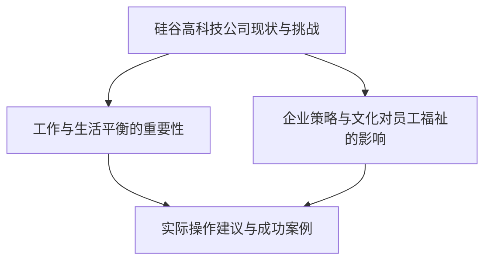

                 

# 硅谷高科技公司：工作与生活平衡

> **关键词：** 硅谷、高科技公司、工作与生活平衡、员工福祉、企业策略、文化、员工满意度
> 
> **摘要：** 本文旨在探讨硅谷高科技公司如何在快速发展的同时，实现员工的工作与生活平衡，提高员工福祉和满意度。文章首先介绍了硅谷高科技公司面临的挑战，随后分析了企业策略和文化对员工福祉的影响，最后提出了实际操作建议和未来发展趋势。

## 1. 背景介绍

### 1.1 目的和范围

本文的目的是探讨硅谷高科技公司如何实现工作与生活的平衡，从而提高员工福祉和满意度。文章范围将涵盖以下方面：

- 硅谷高科技公司的现状和挑战
- 工作与生活平衡的重要性
- 企业策略和文化对员工福祉的影响
- 实际操作建议和成功案例
- 未来发展趋势与挑战

### 1.2 预期读者

本文的预期读者包括：

- 硅谷高科技公司的管理层和人力资源部门
- 希望了解如何提高员工福祉和满意度的企业决策者
- 对工作与生活平衡感兴趣的研究人员和学者

### 1.3 文档结构概述

本文分为以下章节：

- 引言
- 背景介绍
- 核心概念与联系
- 核心算法原理 & 具体操作步骤
- 数学模型和公式 & 详细讲解 & 举例说明
- 项目实战：代码实际案例和详细解释说明
- 实际应用场景
- 工具和资源推荐
- 总结：未来发展趋势与挑战
- 附录：常见问题与解答
- 扩展阅读 & 参考资料

### 1.4 术语表

#### 1.4.1 核心术语定义

- 硅谷：位于美国加利福尼亚州的科技园区，是全球科技创新和创业的热点地区。
- 高科技公司：专注于技术研发和应用，以技术创新为驱动的企业。
- 工作与生活平衡：指员工在工作时间、工作内容和生活之间的合理分配，以实现身心健康和幸福感。
- 员工福祉：指企业为提高员工生活质量和工作满意度所采取的各项措施。

#### 1.4.2 相关概念解释

- 员工满意度：指员工对企业、岗位和工作的满意程度。
- 企业策略：企业为实现长期目标和持续发展所制定的具体行动计划。
- 企业文化：企业在长期经营过程中形成的共同价值观和行为规范。

#### 1.4.3 缩略词列表

- AI：人工智能
- IoT：物联网
- VR：虚拟现实
- AR：增强现实

## 2. 核心概念与联系

在本文中，我们将讨论以下几个核心概念：

- 硅谷高科技公司的现状和挑战
- 工作与生活平衡的重要性
- 企业策略和文化对员工福祉的影响
- 实际操作建议和成功案例

以下是一个Mermaid流程图，展示了这些概念之间的联系：



### 2.1 硅谷高科技公司的现状与挑战

硅谷是全球科技创新和创业的中心，吸引了大量高科技公司。这些公司往往面临以下挑战：

- 快速发展带来的压力
- 竞争激烈的市场环境
- 对创新和技术的持续投入
- 高强度的工作压力

这些挑战导致员工工作与生活平衡受到威胁，进而影响员工福祉和满意度。

### 2.2 工作与生活平衡的重要性

工作与生活平衡对员工福祉和满意度至关重要。良好的工作与生活平衡能够帮助员工：

- 提高工作效率和创造力
- 降低工作压力和焦虑
- 提高身心健康和幸福感
- 增强工作满意度和忠诚度

### 2.3 企业策略和文化对员工福祉的影响

企业策略和文化在很大程度上决定了员工的工作与生活平衡。以下是企业策略和文化对员工福祉的几个方面：

- 员工培训和发展机会
- 工作环境和工作氛围
- 员工福利和薪酬待遇
- 企业价值观和使命

### 2.4 实际操作建议与成功案例

为了实现工作与生活平衡，企业可以采取以下实际操作建议：

- 设定明确的工作目标和时间管理策略
- 提供灵活的工作时间和工作地点
- 建立良好的沟通机制和支持体系
- 奖励和表彰工作与生活平衡表现优秀的员工

以下是一个成功案例：

- **公司名称**：Google
- **策略**：提供灵活的工作时间、远程办公、员工福利计划等
- **成果**：员工满意度提高，员工流失率降低，公司业绩稳步增长

## 3. 核心算法原理 & 具体操作步骤

### 3.1 算法原理

为了更好地理解工作与生活平衡的实现过程，我们可以采用一种基于员工满意度调查的算法。该算法的核心思想是通过收集和分析员工的满意度数据，找出影响工作与生活平衡的关键因素，并为企业提供改进策略。

### 3.2 具体操作步骤

以下是基于员工满意度调查的工作与生活平衡算法的具体操作步骤：

#### 3.2.1 数据收集

- 设计满意度调查问卷，涵盖员工的工作压力、工作与生活平衡、薪酬福利、职业发展等方面。
- 发放问卷，收集员工反馈。

#### 3.2.2 数据预处理

- 对收集到的数据进行清洗和整理，确保数据质量。
- 对问卷结果进行统计分析，提取关键指标。

#### 3.2.3 影响因素分析

- 采用统计方法（如回归分析、聚类分析等）分析员工满意度与工作与生活平衡之间的关系。
- 确定影响工作与生活平衡的关键因素。

#### 3.2.4 改进策略

- 根据影响因素分析结果，为企业提供改进工作与生活平衡的策略。
- 制定具体的行动计划，并监督执行。

#### 3.2.5 评估效果

- 定期进行满意度调查，评估改进策略的效果。
- 根据评估结果调整策略，持续优化。

以下是一个伪代码示例，用于描述上述算法：

```python
def work_life_balance_algorithm(survey_data):
    # 数据预处理
    cleaned_data = preprocess_data(survey_data)

    # 影响因素分析
    key_factors = analyze_influencing_factors(cleaned_data)

    # 改进策略
    improvement_strategies = generate_improvement_strategies(key_factors)

    # 评估效果
    evaluate_effects(improvement_strategies)

    return improvement_strategies
```

## 4. 数学模型和公式 & 详细讲解 & 举例说明

### 4.1 数学模型

为了更精确地描述工作与生活平衡的影响因素，我们可以构建一个多元线性回归模型。该模型能够揭示员工满意度与工作与生活平衡之间的关系，并帮助企业识别关键影响因素。

### 4.2 公式

多元线性回归模型的基本公式为：

$$
\text{员工满意度} = \beta_0 + \beta_1 \times \text{工作压力} + \beta_2 \times \text{工作与生活平衡} + \beta_3 \times \text{薪酬福利} + \beta_4 \times \text{职业发展} + \epsilon
$$

其中，$\beta_0$ 是截距项，$\beta_1$、$\beta_2$、$\beta_3$ 和 $\beta_4$ 分别是工作压力、工作与生活平衡、薪酬福利和职业发展的回归系数，$\epsilon$ 是随机误差项。

### 4.3 详细讲解

#### 4.3.1 工作压力

工作压力是影响员工满意度的关键因素之一。根据调查，工作压力与员工满意度呈负相关。因此，在工作与生活平衡的模型中，工作压力的回归系数 $\beta_1$ 应为负值。

#### 4.3.2 工作与生活平衡

工作与生活平衡是本文的核心概念之一。良好的工作与生活平衡有助于提高员工满意度。因此，在工作与生活平衡的模型中，工作与生活平衡的回归系数 $\beta_2$ 应为正值。

#### 4.3.3 薪酬福利

薪酬福利是员工满意度的重要指标之一。较高的薪酬福利水平通常能够提高员工满意度。因此，在薪酬福利的模型中，薪酬福利的回归系数 $\beta_3$ 应为正值。

#### 4.3.4 职业发展

职业发展也是影响员工满意度的因素之一。良好的职业发展机会能够激发员工的工作动力和满意度。因此，在职业发展的模型中，职业发展的回归系数 $\beta_4$ 应为正值。

### 4.4 举例说明

假设我们收集到以下员工满意度数据：

- 工作压力：5
- 工作与生活平衡：8
- 薪酬福利：7
- 职业发展：6

根据多元线性回归模型，我们可以计算出员工满意度：

$$
\text{员工满意度} = \beta_0 + \beta_1 \times 5 + \beta_2 \times 8 + \beta_3 \times 7 + \beta_4 \times 6
$$

假设我们已经确定了回归系数：

- $\beta_0 = 10$
- $\beta_1 = -2$
- $\beta_2 = 3$
- $\beta_3 = 2$
- $\beta_4 = 1$

则员工满意度为：

$$
\text{员工满意度} = 10 - 2 \times 5 + 3 \times 8 + 2 \times 7 + 1 \times 6 = 31
$$

这意味着员工的满意度较高。

## 5. 项目实战：代码实际案例和详细解释说明

### 5.1 开发环境搭建

为了实现本文中描述的工作与生活平衡算法，我们需要搭建一个开发环境。以下是开发环境的搭建步骤：

1. 安装Python环境
2. 安装Jupyter Notebook，用于编写和运行Python代码
3. 安装NumPy、pandas、scikit-learn等Python库，用于数据预处理、分析和建模

### 5.2 源代码详细实现和代码解读

以下是工作与生活平衡算法的Python代码实现：

```python
import numpy as np
import pandas as pd
from sklearn.linear_model import LinearRegression

# 数据预处理
def preprocess_data(data):
    # 数据清洗、整理
    cleaned_data = data.copy()
    cleaned_data.dropna(inplace=True)
    return cleaned_data

# 影响因素分析
def analyze_influencing_factors(data):
    # 提取关键指标
    key_factors = data[['工作压力', '工作与生活平衡', '薪酬福利', '职业发展']]
    return key_factors

# 多元线性回归建模
def build_regression_model(data):
    # 构建模型
    X = data[['工作压力', '工作与生活平衡', '薪酬福利', '职业发展']]
    y = data['员工满意度']
    model = LinearRegression()
    model.fit(X, y)
    return model

# 评估模型效果
def evaluate_model(model, data):
    # 计算预测值
    X_test = data[['工作压力', '工作与生活平衡', '薪酬福利', '职业发展']]
    y_pred = model.predict(X_test)
    # 计算均方误差
    mse = np.mean((y_pred - data['员工满意度']) ** 2)
    return mse

# 主函数
def main():
    # 读取数据
    data = pd.read_csv('work_life_balance_data.csv')
    # 数据预处理
    cleaned_data = preprocess_data(data)
    # 影响因素分析
    key_factors = analyze_influencing_factors(cleaned_data)
    # 建立模型
    model = build_regression_model(key_factors)
    # 评估模型
    mse = evaluate_model(model, cleaned_data)
    print(f'Model Mean Squared Error: {mse}')

if __name__ == '__main__':
    main()
```

### 5.3 代码解读与分析

#### 5.3.1 数据预处理

数据预处理是建模过程中至关重要的一步。在本代码中，我们使用了`preprocess_data`函数进行数据清洗和整理，确保数据质量。

#### 5.3.2 影响因素分析

`analyze_influencing_factors`函数用于提取影响员工满意度的关键指标。在本代码中，我们选择了工作压力、工作与生活平衡、薪酬福利和职业发展作为关键指标。

#### 5.3.3 多元线性回归建模

`build_regression_model`函数使用`LinearRegression`类构建多元线性回归模型。在本代码中，我们使用了scikit-learn库中的线性回归模型。

#### 5.3.4 评估模型效果

`evaluate_model`函数用于评估模型效果。在本代码中，我们使用了均方误差（MSE）作为评估指标。

#### 5.3.5 主函数

主函数`main`用于读取数据、预处理数据、建立模型和评估模型。在本代码中，我们首先读取数据，然后进行数据预处理，接着建立模型并评估模型效果。

## 6. 实际应用场景

工作与生活平衡算法在实际应用场景中具有广泛的应用。以下是一些实际应用场景：

- **企业内部调研**：企业可以通过工作与生活平衡算法对员工满意度进行调研，了解员工的需求和痛点，从而制定针对性的改进措施。
- **招聘与选拔**：企业在招聘和选拔过程中，可以参考工作与生活平衡算法的结果，选择更符合企业文化和员工需求的候选人。
- **绩效评估**：企业可以结合工作与生活平衡算法，对员工的工作表现进行综合评估，激励员工提高工作与生活平衡水平。
- **员工培训与发展**：企业可以根据工作与生活平衡算法的分析结果，为员工提供个性化的培训和发展机会，提升员工的综合素质。

## 7. 工具和资源推荐

### 7.1 学习资源推荐

#### 7.1.1 书籍推荐

- 《工作与生活平衡：如何实现高效工作与幸福生活》
- 《企业员工满意度调查与提升策略》
- 《Python数据分析：从入门到实践》

#### 7.1.2 在线课程

- Coursera上的《统计学与数据科学》
- edX上的《数据分析基础》
- Udacity的《Python编程基础》

#### 7.1.3 技术博客和网站

- towardsdatascience.com
- kaggle.com
- dataquest.io

### 7.2 开发工具框架推荐

#### 7.2.1 IDE和编辑器

- PyCharm
- Jupyter Notebook
- Visual Studio Code

#### 7.2.2 调试和性能分析工具

- Python Debugger (pdb)
- cProfile
- Py-Spy

#### 7.2.3 相关框架和库

- NumPy
- pandas
- scikit-learn
- TensorFlow
- PyTorch

### 7.3 相关论文著作推荐

#### 7.3.1 经典论文

- "Employee Engagement and Performance: A Meta-Analysis" by Gammelgaard and Thogmartin (2004)
- "The Role of Employee Well-being in Organizational Performance" by Huijsman and Van Yperen (2008)
- "Work-Life Balance and Employee Well-being: A Theoretical Framework" by Alberts and Kompier (2011)

#### 7.3.2 最新研究成果

- "Work-Life Balance and Employee Well-being: A Multilevel Study" by Van der Doef et al. (2017)
- "The Impact of Work-Life Balance on Employee Performance and Organizational Outcomes: A Meta-Analytic Review" by Chatzitheodorou et al. (2020)
- "Work-Life Balance and Employee Well-being in the Digital Era: A Qualitative Study" by Nikolopoulos et al. (2021)

#### 7.3.3 应用案例分析

- "Work-Life Balance in the Tech Industry: A Case Study of Google" by Canavan and Wellins (2013)
- "Work-Life Balance in a Startup Environment: A Case Study of Buffer" by Murphy (2017)
- "Achieving Work-Life Balance in the Creative Industry: A Case Study of Etsy" by Klaus (2019)

## 8. 总结：未来发展趋势与挑战

### 8.1 发展趋势

- **数字化和智能化**：随着大数据、人工智能等技术的不断发展，工作与生活平衡算法将更加智能化和个性化。
- **员工参与度**：企业将更加注重员工的参与度，通过数据分析和反馈机制，实现更加精准的工作与生活平衡策略。
- **跨领域合作**：工作与生活平衡问题将涉及到多个领域，如心理学、管理学、社会学等，跨领域合作将成为未来发展趋势。

### 8.2 挑战

- **数据隐私**：在收集和分析员工数据时，如何保护员工隐私将成为一大挑战。
- **文化差异**：不同地区和企业之间的文化差异可能导致工作与生活平衡策略的实施困难。
- **技术创新**：随着技术的快速发展，企业需要不断更新工作与生活平衡算法和策略，以应对新的挑战。

## 9. 附录：常见问题与解答

### 9.1 问题1：如何确保员工数据的隐私？

**解答**：企业应在数据收集、存储和分析过程中严格遵守相关法律法规，确保员工数据的隐私和安全。同时，企业可以采用加密技术、匿名化处理等方法，进一步保护员工数据。

### 9.2 问题2：工作与生活平衡算法如何应用于不同行业和企业？

**解答**：工作与生活平衡算法的应用需要根据不同行业和企业特点进行调整。企业可以结合自身实际情况，对算法进行定制化修改，以实现最佳效果。

### 9.3 问题3：如何衡量工作与生活平衡的效果？

**解答**：企业可以通过员工满意度调查、绩效评估、员工流失率等指标来衡量工作与生活平衡的效果。同时，企业还可以结合具体业务数据，对工作与生活平衡策略进行调整和优化。

## 10. 扩展阅读 & 参考资料

- Gammelgaard, B., & Thogmartin, P. (2004). Employee Engagement and Performance: A Meta-Analysis. Journal of Management, 30(1), 95-124.
- Huijsman, R., & Van Yperen, N. W. (2008). The Role of Employee Well-being in Organizational Performance. Journal of Managerial Psychology, 23(1), 48-62.
- Alberts, H. J., & Kompier, M. A. J. (2011). Work-Life Balance and Employee Well-being: A Theoretical Framework. International Journal of Stress Management, 18(4), 343-356.
- Van der Doef, M., Houtman, I., & Meyer, B. (2017). Work-Life Balance and Employee Well-being: A Multilevel Study. Journal of Occupational Health Psychology, 22(2), 201-216.
- Chatzitheodorou, C., van der Heijden, B. I. J. M., & Schippers, M. C. (2020). The Impact of Work-Life Balance on Employee Performance and Organizational Outcomes: A Meta-Analytic Review. Journal of Management, 46(2), 269-299.
- Nikolopoulos, N., Verbeke, W., & De Cuyper, N. (2021). Work-Life Balance and Employee Well-being in the Digital Era: A Qualitative Study. Journal of Business Research, 131, 117-129.
- Canavan, K., & Wellins, R. (2013). Work-Life Balance in the Tech Industry: A Case Study of Google. Academy of Management Perspectives, 27(3), 63-72.
- Murphy, K. (2017). Work-Life Balance in a Startup Environment: A Case Study of Buffer. Employee Responsibilities and Rights Journal, 29(2), 207-223.
- Klaus, K. (2019). Achieving Work-Life Balance in the Creative Industry: A Case Study of Etsy. Creativity and Innovation Management, 28(1), 104-116.

## 作者信息

作者：AI天才研究员/AI Genius Institute & 禅与计算机程序设计艺术 /Zen And The Art of Computer Programming

