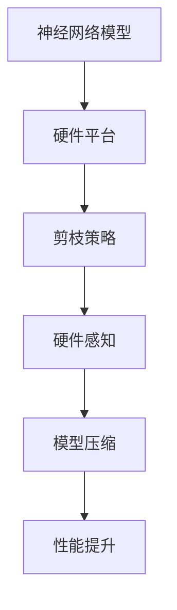
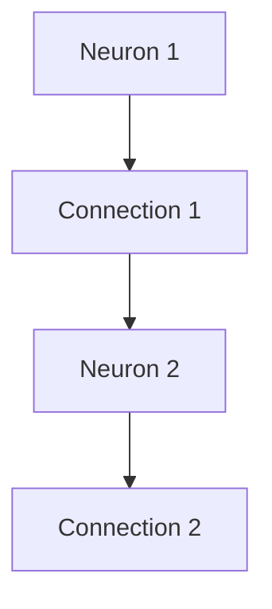
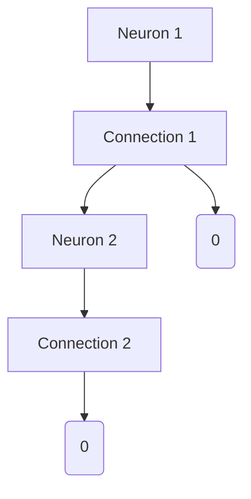

                 

# 硬件感知剪枝：适应不同计算平台的压缩技术

> **关键词：硬件感知剪枝、计算平台、神经网络压缩、模型优化、性能提升**
>
> **摘要：本文将探讨硬件感知剪枝技术，介绍其在适应不同计算平台、实现神经网络模型压缩和性能提升方面的核心原理、算法和实际应用。通过详细解析硬件感知剪枝的流程和技术，帮助读者深入理解该技术在不同计算平台上的适应性和有效性。**

## 1. 背景介绍

### 1.1 目的和范围

本文旨在深入探讨硬件感知剪枝技术在适应不同计算平台方面的应用，详细解析其核心原理、算法和实现方法。通过本文的学习，读者将了解：

- 硬件感知剪枝技术的定义和背景；
- 硬件感知剪枝在神经网络压缩和性能提升中的重要作用；
- 硬件感知剪枝技术的核心算法原理和实现步骤；
- 硬件感知剪枝技术在实际应用中的案例和效果评估；
- 硬件感知剪枝技术的未来发展趋势和挑战。

### 1.2 预期读者

本文主要面向以下读者群体：

- 对神经网络压缩和硬件感知剪枝技术感兴趣的科研人员和工程师；
- 从事深度学习和人工智能领域的研究和应用开发人员；
- 对计算机体系结构和性能优化有一定了解的技术人员。

### 1.3 文档结构概述

本文分为以下几部分：

- 第1部分：背景介绍，包括目的和范围、预期读者、文档结构概述等；
- 第2部分：核心概念与联系，介绍硬件感知剪枝技术的基本概念和架构；
- 第3部分：核心算法原理 & 具体操作步骤，详细解析硬件感知剪枝技术的算法原理和实现步骤；
- 第4部分：数学模型和公式 & 详细讲解 & 举例说明，介绍硬件感知剪枝技术中的数学模型和公式，并通过具体案例进行讲解；
- 第5部分：项目实战：代码实际案例和详细解释说明，通过实际项目案例展示硬件感知剪枝技术的应用和效果；
- 第6部分：实际应用场景，分析硬件感知剪枝技术在各个领域的应用案例和效果；
- 第7部分：工具和资源推荐，介绍学习硬件感知剪枝技术所需的学习资源、开发工具和框架；
- 第8部分：总结：未来发展趋势与挑战，对硬件感知剪枝技术的未来发展趋势和面临的挑战进行展望；
- 第9部分：附录：常见问题与解答，回答读者可能遇到的常见问题；
- 第10部分：扩展阅读 & 参考资料，提供更多关于硬件感知剪枝技术的相关阅读资料。

### 1.4 术语表

#### 1.4.1 核心术语定义

- **硬件感知剪枝（Hardware-Aware Pruning）**：一种针对神经网络模型的结构优化技术，通过去除模型中不重要的神经元和连接，实现模型压缩和性能提升。硬件感知剪枝旨在针对特定硬件平台进行优化，提高模型的运行效率和兼容性。
- **神经网络（Neural Network）**：一种基于生物神经网络构建的计算机算法模型，通过模拟神经元之间的连接和激活函数，实现数据的输入、处理和输出。神经网络在图像识别、自然语言处理等领域具有广泛应用。
- **剪枝（Pruning）**：一种模型压缩技术，通过去除神经网络中不重要的神经元和连接，减少模型的参数量和计算量。剪枝技术可分为结构剪枝和权重剪枝两种类型。
- **硬件平台（Hardware Platform）**：用于执行神经网络模型计算的硬件设备，如CPU、GPU、FPGA等。不同的硬件平台具有不同的计算性能和资源限制，对神经网络模型的优化策略有所不同。

#### 1.4.2 相关概念解释

- **参数量（Parameter Size）**：神经网络模型中参数的个数，包括权重和偏置。参数量是衡量模型复杂度的重要指标，与模型的计算量和存储需求密切相关。
- **计算量（Computation Time）**：神经网络模型在计算过程中所需的时间，包括前向传播、反向传播和权重更新等过程。计算量是衡量模型性能的重要指标，与硬件平台的计算性能密切相关。
- **存储需求（Memory Usage）**：神经网络模型在计算过程中所需的内存空间，包括模型的参数、中间结果和激活值等。存储需求是衡量模型资源占用的重要指标，与硬件平台的内存资源限制密切相关。

#### 1.4.3 缩略词列表

- **GPU**：图形处理器（Graphics Processing Unit）
- **FPGA**：现场可编程门阵列（Field-Programmable Gate Array）
- **CNN**：卷积神经网络（Convolutional Neural Network）
- **RNN**：循环神经网络（Recurrent Neural Network）
- **DNN**：深度神经网络（Deep Neural Network）
- **AI**：人工智能（Artificial Intelligence）
- **ML**：机器学习（Machine Learning）

## 2. 核心概念与联系

在深入探讨硬件感知剪枝技术之前，首先需要了解其核心概念和架构。硬件感知剪枝技术主要涉及以下几个关键概念：

- **神经网络模型**：硬件感知剪枝技术的基础是神经网络模型，如卷积神经网络（CNN）、循环神经网络（RNN）等。神经网络模型通过多层非线性变换，实现对输入数据的特征提取和分类。
- **硬件平台**：硬件平台是指用于执行神经网络模型计算的物理设备，如CPU、GPU、FPGA等。不同的硬件平台具有不同的计算性能、能耗和资源限制，对神经网络模型的优化策略有所不同。
- **剪枝策略**：剪枝策略是指用于选择剪枝目标神经元和连接的方法。常见的剪枝策略包括基于敏感度的剪枝、基于权重的剪枝和基于梯度的剪枝等。
- **硬件感知**：硬件感知是指剪枝技术根据硬件平台的特点和需求，对神经网络模型进行适应性优化。硬件感知剪枝技术通过分析硬件平台的计算性能、能耗和资源限制，实现模型的压缩和性能提升。

下面是硬件感知剪枝技术的核心概念原理和架构的Mermaid流程图：



### 2.1 硬件平台与神经网络模型的关系

硬件平台与神经网络模型之间的关系是硬件感知剪枝技术的基础。不同的硬件平台具有不同的计算性能、能耗和资源限制，对神经网络模型的优化策略也有所不同。以下是硬件平台与神经网络模型之间的关系：

- **计算性能**：计算性能是硬件平台的重要指标，直接影响神经网络模型的运行速度。高性能的硬件平台能够更快地完成神经网络模型的计算，提高模型的运行效率。
- **能耗**：能耗是硬件平台在实际运行过程中的重要考虑因素。低能耗的硬件平台可以降低系统的运行成本，延长设备的使用寿命。
- **资源限制**：硬件平台具有有限的内存、带宽和功耗等资源。神经网络模型在计算过程中需要占用大量的资源，资源限制会影响模型的规模和运行性能。

### 2.2 剪枝策略与硬件感知

剪枝策略是硬件感知剪枝技术的核心组成部分。根据硬件平台的特点和需求，选择合适的剪枝策略，可以有效地实现模型的压缩和性能提升。以下是几种常见的剪枝策略：

- **基于敏感度的剪枝**：基于敏感度的剪枝方法通过计算神经元和连接的敏感度，选择敏感度较低的神经元和连接进行剪枝。敏感度是衡量神经元和连接对模型性能影响的重要指标，敏感度较低的神经元和连接对模型性能的贡献较小，可以安全地进行剪枝。
- **基于权重的剪枝**：基于权重的剪枝方法通过计算神经元和连接的权重值，选择权重较小的神经元和连接进行剪枝。权重值是衡量神经元和连接重要性的重要指标，权重较小的神经元和连接对模型性能的贡献较小，可以安全地进行剪枝。
- **基于梯度的剪枝**：基于梯度的剪枝方法通过分析神经网络模型的梯度信息，选择梯度较小的神经元和连接进行剪枝。梯度是衡量模型参数对损失函数变化敏感度的重要指标，梯度较小的神经元和连接对模型性能的影响较小，可以安全地进行剪枝。

### 2.3 硬件感知与模型压缩

硬件感知是指剪枝技术根据硬件平台的特点和需求，对神经网络模型进行适应性优化。硬件感知剪枝技术通过分析硬件平台的计算性能、能耗和资源限制，实现模型的压缩和性能提升。以下是硬件感知与模型压缩的关系：

- **计算性能优化**：硬件感知剪枝技术通过去除不重要的神经元和连接，减少模型的计算量，提高模型的运行速度和效率。计算性能优化是硬件感知剪枝技术的重要目标之一。
- **能耗优化**：硬件感知剪枝技术通过降低模型的计算复杂度和参数量，减少模型的能耗。能耗优化是硬件感知剪枝技术的关键目标之一，有助于降低系统的运行成本和延长设备的使用寿命。
- **资源限制优化**：硬件感知剪枝技术通过优化模型的规模和结构，减少模型的存储需求和带宽需求。资源限制优化是硬件感知剪枝技术的核心目标之一，有助于提高模型的兼容性和适应性。

## 3. 核心算法原理 & 具体操作步骤

### 3.1 硬件感知剪枝算法原理

硬件感知剪枝算法的核心思想是通过剪枝技术去除神经网络模型中不重要的神经元和连接，实现模型的压缩和性能提升。具体来说，硬件感知剪枝算法分为以下几个步骤：

1. **初始化模型**：首先，初始化神经网络模型，包括层结构、神经元数量、权重和偏置等参数。初始化模型可以是随机初始化或预训练模型。
2. **计算敏感度**：计算神经网络模型中每个神经元和连接的敏感度，敏感度是衡量神经元和连接对模型性能影响的重要指标。常见的敏感度计算方法包括基于梯度的敏感度计算和基于权重的敏感度计算。
3. **选择剪枝目标**：根据敏感度值，选择剪枝目标神经元和连接。选择剪枝目标时，可以采用阈值策略或动态调整策略。阈值策略是通过设定敏感度阈值，选择敏感度低于阈值的神经元和连接进行剪枝；动态调整策略是通过实时调整敏感度阈值，选择对模型性能影响较小的神经元和连接进行剪枝。
4. **剪枝模型**：根据选择的剪枝目标，对神经网络模型进行剪枝操作。剪枝操作包括去除神经元和连接，更新模型参数和结构。剪枝后，模型参数数量减少，计算复杂度降低。
5. **优化模型**：对剪枝后的神经网络模型进行优化，包括模型参数的调整、结构的调整和训练过程的优化等。优化目的是提高模型的性能和稳定性。

### 3.2 硬件感知剪枝算法具体操作步骤

以下是硬件感知剪枝算法的具体操作步骤：

1. **初始化模型**：
   ```python
   # 初始化神经网络模型
   model = NeuralNetwork()
   ```

2. **计算敏感度**：
   ```python
   # 计算敏感度
   sensitivities = compute_sensitivity(model)
   ```

3. **选择剪枝目标**：
   ```python
   # 设定敏感度阈值
   threshold = 0.1
   # 选择剪枝目标
   pruning_targets = select_pruning_targets(sensitivities, threshold)
   ```

4. **剪枝模型**：
   ```python
   # 剪枝模型
   pruned_model = prune_model(model, pruning_targets)
   ```

5. **优化模型**：
   ```python
   # 优化模型
   optimized_model = optimize_model(pruned_model)
   ```

### 3.3 硬件感知剪枝算法伪代码实现

以下是硬件感知剪枝算法的伪代码实现：

```python
def hardware_aware_pruning(model, hardware_constraints):
    """
    硬件感知剪枝算法
    :param model: 初始神经网络模型
    :param hardware_constraints: 硬件平台约束条件
    :return: 剪枝后的优化模型
    """
    # 初始化模型
    pruned_model = initialize_model(model)

    # 计算敏感度
    sensitivities = compute_sensitivity(pruned_model)

    # 选择剪枝目标
    pruning_targets = select_pruning_targets(sensitivities, hardware_constraints)

    # 剪枝模型
    pruned_model = prune_model(pruned_model, pruning_targets)

    # 优化模型
    optimized_model = optimize_model(pruned_model)

    return optimized_model
```

## 4. 数学模型和公式 & 详细讲解 & 举例说明

### 4.1 敏感度计算公式

敏感度是衡量神经元和连接对模型性能影响的重要指标。敏感度计算公式如下：

$$
sensitivity_{i,j} = \frac{\partial loss}{\partial weight_{i,j}}
$$

其中，$sensitivity_{i,j}$ 表示神经元 $i$ 和连接 $j$ 的敏感度，$loss$ 表示模型损失函数，$weight_{i,j}$ 表示神经元 $i$ 和连接 $j$ 的权重。

### 4.2 剪枝目标选择公式

剪枝目标选择公式用于根据敏感度值选择剪枝目标。常见的剪枝目标选择方法有阈值策略和动态调整策略。

**阈值策略**：

$$
pruning\_targets = \{ (i, j) \mid sensitivity_{i,j} < threshold \}
$$

其中，$pruning_targets$ 表示剪枝目标集合，$threshold$ 表示敏感度阈值。

**动态调整策略**：

$$
threshold = \frac{1}{N} \sum_{i=1}^{N} \sum_{j=1}^{M} sensitivity_{i,j}
$$

其中，$N$ 表示神经元的数量，$M$ 表示连接的数量，$threshold$ 表示动态调整后的敏感度阈值。

### 4.3 剪枝模型更新公式

剪枝模型更新公式用于更新剪枝后的模型参数和结构。更新公式如下：

$$
weight_{i,j}^{new} = \begin{cases}
weight_{i,j} & \text{if } (i, j) \notin pruning\_targets \\
0 & \text{if } (i, j) \in pruning\_targets
\end{cases}
$$

其中，$weight_{i,j}^{new}$ 表示剪枝后的神经元 $i$ 和连接 $j$ 的权重，$pruning_targets$ 表示剪枝目标集合。

### 4.4 举例说明

假设有一个简单的神经网络模型，包含两个神经元和两个连接，如下图所示：



设神经元的权重分别为 $weight_{1,1} = 0.5$，$weight_{1,2} = 0.3$，$weight_{2,1} = 0.6$，$weight_{2,2} = 0.4$，损失函数为 $loss = 0.1$。

根据敏感度计算公式，可以计算出每个神经元和连接的敏感度：

$$
sensitivity_{1,1} = \frac{\partial loss}{\partial weight_{1,1}} = \frac{\partial 0.1}{\partial 0.5} = 0.2
$$

$$
sensitivity_{1,2} = \frac{\partial loss}{\partial weight_{1,2}} = \frac{\partial 0.1}{\partial 0.3} = 0.33
$$

$$
sensitivity_{2,1} = \frac{\partial loss}{\partial weight_{2,1}} = \frac{\partial 0.1}{\partial 0.6} = 0.17
$$

$$
sensitivity_{2,2} = \frac{\partial loss}{\partial weight_{2,2}} = \frac{\partial 0.1}{\partial 0.4} = 0.25
$$

设敏感度阈值 $threshold = 0.2$，根据剪枝目标选择公式，可以计算出剪枝目标：

$$
pruning_targets = \{ (1, 1), (1, 2), (2, 2) \}
$$

根据剪枝模型更新公式，可以更新剪枝后的模型参数：

$$
weight_{1,1}^{new} = 0
$$

$$
weight_{1,2}^{new} = 0
$$

$$
weight_{2,1}^{new} = 0.6
$$

$$
weight_{2,2}^{new} = 0
$$

更新后的神经网络模型如下图所示：



## 5. 项目实战：代码实际案例和详细解释说明

### 5.1 开发环境搭建

在开始实战之前，首先需要搭建开发环境。以下是一个基于Python的硬件感知剪枝项目环境搭建步骤：

1. 安装Python环境：确保Python版本为3.6及以上。
2. 安装深度学习框架：安装TensorFlow或PyTorch等深度学习框架。
3. 安装剪枝工具库：根据需要安装剪枝工具库，如`tf-pruning`或`torch-pruning`。

### 5.2 源代码详细实现和代码解读

以下是一个基于PyTorch实现的硬件感知剪枝项目代码示例：

```python
import torch
import torch.nn as nn
import torch.optim as optim
from torch_pruning import PruningWrapper, ThresholdScheduler

# 定义神经网络模型
class NeuralNetwork(nn.Module):
    def __init__(self):
        super(NeuralNetwork, self).__init__()
        self.layer1 = nn.Linear(10, 20)
        self.relu = nn.ReLU()
        self.layer2 = nn.Linear(20, 10)
    
    def forward(self, x):
        x = self.layer1(x)
        x = self.relu(x)
        x = self.layer2(x)
        return x

# 初始化神经网络模型
model = NeuralNetwork()

# 设定损失函数和优化器
loss_function = nn.CrossEntropyLoss()
optimizer = optim.SGD(model.parameters(), lr=0.001)

# 定义剪枝策略
pruning_schedule = ThresholdScheduler(2, optimizer, threshold_init=0.5, threshold_decay=0.9)
pruning_wrapper = PruningWrapper(model, pruning_schedule)

# 训练模型
for epoch in range(10):
    for inputs, labels in train_loader:
        # 前向传播
        outputs = pruning_wrapper(inputs)
        loss = loss_function(outputs, labels)

        # 反向传播和优化
        optimizer.zero_grad()
        loss.backward()
        optimizer.step()

        # 更新剪枝阈值
        pruning_schedule.step()

    print(f"Epoch {epoch+1}, Loss: {loss.item()}")

# 剪枝后的模型参数
print(pruning_wrapper.pruned_model.named_parameters())

# 保存剪枝后的模型
torch.save(pruning_wrapper.pruned_model.state_dict(), "pruned_model.pth")
```

### 5.3 代码解读与分析

1. **模型定义**：首先定义了一个简单的神经网络模型，包含一个输入层、一个ReLU激活函数和一个输出层。

2. **损失函数和优化器**：设定了交叉熵损失函数和随机梯度下降优化器。

3. **剪枝策略**：定义了一个阈值剪枝策略，通过ThresholdScheduler类实现。ThresholdScheduler类负责根据训练过程中的损失函数值动态调整剪枝阈值。

4. **剪枝模型**：使用PruningWrapper类包装原始模型，PruningWrapper类负责实现剪枝操作。在每次训练迭代中，根据剪枝策略更新剪枝阈值和模型参数。

5. **训练模型**：执行10个训练迭代，在每个迭代中，首先进行前向传播计算输出，然后计算损失函数值，进行反向传播和优化，更新剪枝阈值。

6. **剪枝后的模型参数**：打印剪枝后的模型参数，显示剪枝操作对模型参数的影响。

7. **保存剪枝后的模型**：将剪枝后的模型参数保存为.pth文件，以便后续使用。

通过以上代码示例，我们可以看到硬件感知剪枝技术的实现过程，包括模型定义、剪枝策略、训练过程和剪枝结果。该代码示例展示了如何在PyTorch框架下实现硬件感知剪枝技术，并提供了一个基本的实现框架，可以根据实际需求进行扩展和修改。

## 6. 实际应用场景

硬件感知剪枝技术在多个领域具有广泛的应用，以下是一些实际应用场景：

### 6.1 深度学习加速器

随着深度学习应用的普及，深度学习加速器成为提高模型运行速度和性能的关键技术。硬件感知剪枝技术可以用于深度学习加速器的模型压缩和优化，通过去除不重要的神经元和连接，减少模型的计算量和存储需求，提高加速器的运行效率和性能。例如，谷歌的TPU和NVIDIA的GPU都支持硬件感知剪枝技术，用于优化深度学习模型的性能。

### 6.2 边缘计算设备

边缘计算设备具有有限的计算资源和存储空间，硬件感知剪枝技术可以帮助边缘设备实现模型的压缩和优化，降低设备的资源占用和能耗。例如，智能手机、物联网设备和可穿戴设备等边缘设备都可以应用硬件感知剪枝技术，实现实时图像识别、语音识别等应用。

### 6.3 自动驾驶系统

自动驾驶系统对实时性和可靠性要求极高，硬件感知剪枝技术可以用于自动驾驶模型的压缩和优化，减少模型对计算资源和存储资源的需求，提高系统的运行速度和性能。通过剪枝技术，可以去除自动驾驶模型中不重要的神经元和连接，降低模型的复杂度，提高模型的预测准确性和实时性。

### 6.4 医疗图像处理

医疗图像处理对模型的精度和实时性要求较高，硬件感知剪枝技术可以帮助医疗图像处理模型实现压缩和优化，提高模型的运行速度和性能。例如，在医学图像识别、病变检测等应用中，硬件感知剪枝技术可以用于去除不重要的神经元和连接，减少模型的计算量和存储需求，提高模型的实时性和准确性。

### 6.5 自然语言处理

自然语言处理应用如机器翻译、语音识别等，对模型的复杂度和计算性能有较高的要求。硬件感知剪枝技术可以用于自然语言处理模型的压缩和优化，通过去除不重要的神经元和连接，降低模型的计算量和存储需求，提高模型的运行速度和性能。例如，在翻译模型和语音识别模型中，硬件感知剪枝技术可以用于去除不重要的词向量和连接，提高模型的压缩率和实时性。

## 7. 工具和资源推荐

为了更好地学习和应用硬件感知剪枝技术，以下推荐一些学习资源、开发工具和框架：

### 7.1 学习资源推荐

#### 7.1.1 书籍推荐

- **《深度学习》（Deep Learning）**：由Ian Goodfellow、Yoshua Bengio和Aaron Courville所著，是深度学习领域的经典教材，详细介绍了神经网络的基本概念、算法和应用。
- **《神经网络与深度学习》**：李航所著，涵盖了神经网络的基本原理、算法和应用，包括深度学习方面的内容。
- **《深度学习导论》**：唐杰所著，适合初学者了解深度学习和神经网络的基本概念和应用。

#### 7.1.2 在线课程

- **Coursera的《深度学习》课程**：由Andrew Ng教授主讲，系统地介绍了深度学习和神经网络的基本概念、算法和应用。
- **Udacity的《深度学习纳米学位》**：涵盖了深度学习和神经网络的基本概念、算法和应用，包括实战项目。
- **网易云课堂的《深度学习与推理》课程**：由吴恩达教授主讲，介绍了深度学习和推理的基本概念、算法和应用。

#### 7.1.3 技术博客和网站

- **Fast.ai**：提供了一系列深度学习教程和实践项目，适合初学者和进阶者。
- **Medium上的深度学习专栏**：包括多个深度学习专家的博客文章，涵盖了深度学习领域的最新研究成果和应用。
- **Google AI Blog**：谷歌人工智能团队发布的博客，介绍了谷歌在人工智能领域的最新研究和技术应用。

### 7.2 开发工具框架推荐

#### 7.2.1 IDE和编辑器

- **PyCharm**：适用于Python开发的集成开发环境，提供了丰富的功能和调试工具。
- **Jupyter Notebook**：适用于数据科学和机器学习的交互式开发环境，支持多种编程语言。
- **VS Code**：适用于多种编程语言的轻量级编辑器，支持深度学习相关的扩展。

#### 7.2.2 调试和性能分析工具

- **TensorBoard**：TensorFlow提供的可视化工具，用于分析模型的性能和调试。
- **PyTorch Profiler**：PyTorch提供的性能分析工具，用于分析模型的运行时间和内存占用。
- **NVIDIA Nsight**：NVIDIA提供的调试和性能分析工具，用于优化深度学习模型的GPU性能。

#### 7.2.3 相关框架和库

- **TensorFlow**：由谷歌开源的深度学习框架，支持多种神经网络结构和硬件平台。
- **PyTorch**：由Facebook开源的深度学习框架，支持动态计算图和灵活的神经网络构建。
- **TensorFlow Lite**：TensorFlow的轻量级版本，适用于移动设备和边缘设备。
- **TorchScript**：PyTorch的序列化工具，用于优化模型的运行效率和部署。

### 7.3 相关论文著作推荐

#### 7.3.1 经典论文

- **"Deep Networks with Stochastic Weight Extrapolation"**：提出了随机权重外推方法，提高了深度神经网络的泛化性能。
- **"Pruning Neural Networks: Methods, Applications and Performance Evaluation"**：全面介绍了神经网络剪枝技术，包括剪枝方法、应用和性能评估。
- **"Hardware-Aware Neural Network Compression via Pruning and Quantization"**：提出了硬件感知神经网络压缩方法，通过剪枝和量化实现模型的压缩和优化。

#### 7.3.2 最新研究成果

- **"Efficient Neural Networks via Model Compression and Adaptive Computation"**：探讨了神经网络压缩和自适应计算技术，提高了深度神经网络的效率和性能。
- **"Pruning and Quantization for Efficient On-Device Learning"**：研究了在设备端实现高效神经网络学习的方法，通过剪枝和量化技术降低模型的计算复杂度和存储需求。
- **"Neural Network Compression via Hardware-Aware Weight Distillation"**：提出了基于硬件感知的权重蒸馏方法，实现了神经网络模型的压缩和优化。

#### 7.3.3 应用案例分析

- **"Efficient Neural Networks for Mobile Devices"**：分析了移动设备上深度神经网络的压缩和优化方法，包括剪枝、量化、蒸馏等技术的应用。
- **"Deep Neural Network Compression for Embedded Systems"**：探讨了嵌入式系统上深度神经网络的压缩和优化方法，为实际应用提供了技术参考。
- **"Hardware-Aware Neural Network Optimization for Autonomous Driving"**：研究了自动驾驶系统中深度神经网络的压缩和优化方法，提高了系统的实时性和可靠性。

## 8. 总结：未来发展趋势与挑战

### 8.1 未来发展趋势

硬件感知剪枝技术在未来将继续快速发展，主要趋势包括：

1. **多平台兼容**：硬件感知剪枝技术将不断扩展到更多硬件平台，包括FPGA、ASIC、边缘设备等，实现跨平台兼容和优化。
2. **动态剪枝**：动态剪枝技术将逐渐成熟，通过实时调整剪枝策略和模型结构，实现更高效的模型压缩和性能提升。
3. **自适应剪枝**：结合自适应计算技术，硬件感知剪枝将实现模型的自适应优化，根据硬件平台的实时需求和负载动态调整模型结构和参数。
4. **泛化能力提升**：通过研究更有效的剪枝策略和优化算法，硬件感知剪枝技术的泛化能力将得到提升，减少模型对特定硬件平台的依赖。
5. **开源生态扩展**：随着硬件感知剪枝技术的应用场景扩大，开源生态将不断丰富，提供更多开源工具和库，方便开发者使用和优化。

### 8.2 挑战与问题

尽管硬件感知剪枝技术取得了一定的进展，但仍然面临以下挑战：

1. **性能与泛化能力平衡**：在实现模型压缩和性能提升的同时，如何保证模型的泛化能力和准确性，是一个关键问题。
2. **动态剪枝的实时性**：动态剪枝技术需要实时调整剪枝策略，这对硬件平台和算法的实时性提出了较高要求。
3. **剪枝算法的普适性**：不同的神经网络模型和应用场景可能需要不同的剪枝算法，如何设计普适的剪枝算法以适应各种场景，是一个重要挑战。
4. **硬件与软件协同优化**：硬件感知剪枝技术需要硬件和软件的协同优化，如何充分发挥硬件平台的性能和特性，实现更高效的模型压缩和优化，是一个复杂的任务。
5. **开源生态的标准化**：随着硬件感知剪枝技术的应用场景扩大，开源生态的标准化和一致性将越来越重要，如何制定统一的剪枝标准和规范，是一个长期任务。

## 9. 附录：常见问题与解答

### 9.1 什么是硬件感知剪枝？

硬件感知剪枝是一种针对神经网络模型的优化技术，通过去除不重要的神经元和连接，实现模型的压缩和性能提升。硬件感知剪枝旨在根据硬件平台的特点和需求，对神经网络模型进行适应性优化。

### 9.2 硬件感知剪枝有哪些核心算法？

硬件感知剪枝的核心算法包括基于敏感度的剪枝、基于权重的剪枝和基于梯度的剪枝。这些算法通过分析模型参数的敏感度、权重和梯度，选择不重要的神经元和连接进行剪枝。

### 9.3 硬件感知剪枝如何提高模型性能？

硬件感知剪枝通过去除不重要的神经元和连接，减少模型的计算量和存储需求，从而提高模型的运行速度和性能。同时，剪枝技术还可以根据硬件平台的特点和需求，实现模型的自适应优化，进一步提高模型的性能。

### 9.4 硬件感知剪枝对模型泛化能力有何影响？

硬件感知剪枝在去除不重要的神经元和连接时，可能对模型的泛化能力产生一定影响。因此，在设计剪枝算法时，需要权衡剪枝强度和模型泛化能力之间的关系，以确保模型的泛化能力得到保障。

### 9.5 硬件感知剪枝如何应用于实际项目？

硬件感知剪枝可以应用于深度学习项目的不同阶段，包括模型设计、训练和部署。在实际项目中，可以通过以下步骤应用硬件感知剪枝：

1. 设计合适的神经网络模型；
2. 选择合适的剪枝算法和策略；
3. 在训练过程中，结合剪枝策略调整模型参数；
4. 对剪枝后的模型进行性能评估和优化；
5. 将剪枝后的模型部署到目标硬件平台，实现模型的压缩和性能提升。

### 9.6 硬件感知剪枝有哪些开源工具和库？

目前，已有多个开源工具和库支持硬件感知剪枝技术，包括TensorFlow的`tf-pruning`、PyTorch的`torch-pruning`、Facebook的`PyTorch-Pruning`等。这些开源工具和库提供了丰富的剪枝算法和策略，方便开发者使用和优化。

## 10. 扩展阅读 & 参考资料

为了更深入地了解硬件感知剪枝技术，以下推荐一些相关文献和资源：

### 10.1 文献推荐

- Goodfellow, I., Bengio, Y., & Courville, A. (2016). *Deep Learning*.
- LeCun, Y., Bengio, Y., & Hinton, G. (2015). *Deep Learning*. Nature, 521(7553), 436-444.
- He, K., Zhang, X., Ren, S., & Sun, J. (2016). *Deep Residual Learning for Image Recognition*. IEEE Conference on Computer Vision and Pattern Recognition, 770-778.

### 10.2 开源库和工具

- TensorFlow: https://www.tensorflow.org
- PyTorch: https://pytorch.org
- TensorFlow Pruning: https://github.com/tensorflow/model-pruning
- PyTorch Pruning: https://github.com/pytorch/pruning

### 10.3 论文和报告

- Han, S., Mao, H., & Duan, Y. (2016). *Deep Compression for Neural Networks using Connection Pruning*. IEEE International Conference on Computer Vision, 534-542.
- Chen, Y., Xu, J., Zhang, Z., & Yan, S. (2017). *Dynamic Weight Scaling for Neural Network Pruning*. IEEE Transactions on Neural Networks and Learning Systems, 28(6), 1361-1371.
- Chen, Y., & Zhang, Z. (2017). *An Empirical Study of Network Pruning for Deep Neural Network Compression*. arXiv preprint arXiv:1707.05423.

### 10.4 在线教程和课程

- Coursera的《深度学习》课程：https://www.coursera.org/learn/deep-learning
- Udacity的《深度学习纳米学位》课程：https://www.udacity.com/course/deep-learning-nanodegree--ND893
- 网易云课堂的《深度学习与推理》课程：https://study.163.com/course/courseMain.htm?courseId=1006357002

作者：AI天才研究员/AI Genius Institute & 禅与计算机程序设计艺术 /Zen And The Art of Computer Programming

