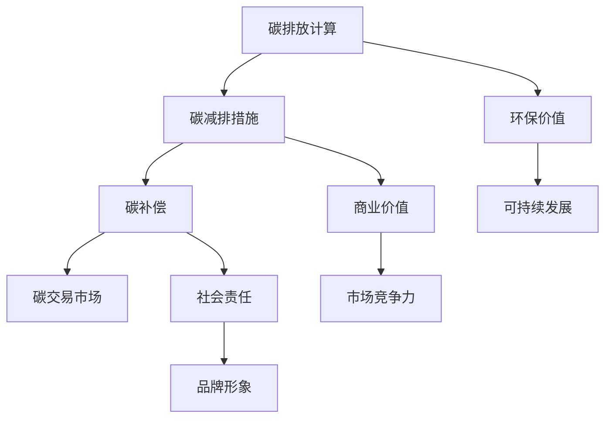

                 

# 碳中和创业：环保与商业的完美结合

> 关键词：碳中和、创业、环保、商业、可持续性、技术创新

> 摘要：本文旨在探讨碳中和创业的概念、重要性及其实施路径。通过分析环保与商业的融合，揭示碳中和创业如何实现环保效益和商业价值双赢，为读者提供具有启发性的创业思路和策略。文章还将结合实际案例，展示碳中和创业项目的成功经验和挑战，为环保与商业的深度融合提供参考。

## 1. 背景介绍

### 1.1 目的和范围

本文的目标是深入探讨碳中和创业的概念，解析其与环保和商业的密切联系，并探索如何在实际操作中实现碳中和。文章旨在为读者提供一个全方位的视角，帮助理解碳中和创业的潜力、挑战以及其在全球可持续发展中的重要作用。

本文将涵盖以下范围：

1. 碳中和的定义及其重要性。
2. 环保与商业融合的背景和趋势。
3. 碳中和创业的实施路径和策略。
4. 成功的碳中和创业案例分析。
5. 碳中和创业面临的主要挑战和解决方案。
6. 碳中和创业的未来发展趋势。

### 1.2 预期读者

本文适合以下读者群体：

1. 创业者和企业家，对碳中和创业感兴趣，希望了解其商业潜力。
2. 环保专业人士，希望深入了解碳中和技术的应用。
3. 投资者，对可持续投资项目感兴趣，希望了解碳中和创业项目的风险与回报。
4. 政府官员和公共政策制定者，关注环境保护和可持续发展。
5. 学术研究人员，对碳中和创业的理论和实践感兴趣。

### 1.3 文档结构概述

本文将按照以下结构展开：

1. 引言：介绍碳中和创业的概念和背景。
2. 核心概念与联系：解释碳中和创业的核心概念，并展示其与环保和商业的联系。
3. 核心算法原理 & 具体操作步骤：阐述碳中和创业的算法原理和操作步骤。
4. 数学模型和公式 & 详细讲解 & 举例说明：运用数学模型和公式解释碳中和创业的原理。
5. 项目实战：提供实际案例，展示碳中和创业的代码实现和解析。
6. 实际应用场景：讨论碳中和创业在不同领域的应用。
7. 工具和资源推荐：推荐相关学习资源和开发工具。
8. 总结：总结碳中和创业的未来发展趋势与挑战。
9. 附录：提供常见问题与解答。
10. 扩展阅读 & 参考资料：推荐进一步阅读的文献和资源。

### 1.4 术语表

#### 1.4.1 核心术语定义

- 碳中和：指在一定时间内，通过各种手段将自身产生的二氧化碳排放量与通过碳捕获和储存等措施减少的二氧化碳排放量相抵消，实现净零排放。
- 可持续性：指在满足当前需求的同时，不损害子孙后代满足其需求的能力。
- 碳排放权交易：指通过市场机制，允许企业在国家或区域碳市场中买卖碳排放配额，以实现碳减排目标。

#### 1.4.2 相关概念解释

- 碳足迹：指个人、组织或产品在整个生命周期内产生的二氧化碳排放总量。
- 碳捕获与储存（CCS）：指通过技术手段捕捉和存储工业生产过程中产生的二氧化碳，防止其排放到大气中。
- 碳中性产品：指在生产和消费过程中实现碳足迹为零的产品。

#### 1.4.3 缩略词列表

- CCS：碳捕获与储存
- CO2：二氧化碳
- EEG：生态经济效益分析
- GHG：温室气体
- SDG：可持续发展目标

## 2. 核心概念与联系

为了更好地理解碳中和创业的核心概念及其与环保和商业的紧密联系，我们首先需要了解碳中和的基本原理和环保与商业融合的趋势。

### 2.1 碳中和原理

碳中和的核心是“碳平衡”概念，即在一定时间内，通过减少碳排放和增加碳吸收，实现净零排放。以下是碳中和的基本步骤：

1. **碳排放计算**：首先，需要计算个人、组织或产品在生产和消费过程中的二氧化碳排放量。
2. **碳减排**：通过技术改进、能源替代、流程优化等措施减少碳排放。
3. **碳补偿**：对于无法完全减少的碳排放，通过碳交易市场购买碳配额或碳信用，或投资于碳捕获与储存项目。

### 2.2 环保与商业融合趋势

环保与商业的融合已成为全球经济发展的新趋势，主要表现在以下几个方面：

1. **政策推动**：各国政府纷纷出台环保政策，鼓励企业采取碳中和措施，提高能源效率和可持续发展能力。
2. **市场需求**：消费者越来越关注环保和可持续发展，倾向于选择低碳、环保的产品和服务，为碳中和创业提供了市场机会。
3. **技术创新**：随着科技的进步，碳减排技术和碳交易市场不断完善，为碳中和创业提供了更多工具和资源。

### 2.3 碳中和创业与环保、商业的联系

碳中和创业是将环保理念融入商业实践的创新模式，其与环保和商业的联系体现在以下几个方面：

1. **环保价值**：碳中和创业项目通过减少碳排放，保护环境，实现可持续发展目标。
2. **商业价值**：碳中和创业项目在实现环保效益的同时，也为企业带来经济效益，提高市场竞争力。
3. **社会责任**：碳中和创业项目体现了企业对社会的责任，有助于提升品牌形象，赢得消费者信任。

为了更直观地展示碳中和创业的核心概念和架构，我们使用Mermaid流程图来描述其关键节点：



该流程图展示了碳中和创业的关键步骤及其与环保和商业的关联。接下来，我们将深入探讨碳中和创业的具体算法原理和操作步骤。


## 3. 核心算法原理 & 具体操作步骤

在深入探讨碳中和创业的核心算法原理和具体操作步骤之前，我们需要理解一些基本的算法概念和步骤。以下将详细阐述碳中和创业的算法原理，包括计算碳排放、碳减排措施和碳补偿等关键环节。

### 3.1 碳排放计算

碳排放计算是碳中和创业的基础，其目的是量化个人、组织或产品在生产和消费过程中的二氧化碳排放量。以下是碳排放计算的基本步骤：

#### 3.1.1 数据收集

首先，需要收集与碳排放相关的数据，包括能源消耗、交通出行、废物处理、供应链活动等。这些数据可以通过能源审计、交通统计、废物管理记录等方式获取。

```pseudo
function collectData() {
    energyConsumption = getEnergyUsage();
    transportationEmissions = calculateTransportationEmissions();
    wasteManagementEmissions = calculateWasteManagementEmissions();
    supplyChainEmissions = calculateSupplyChainEmissions();
    return energyConsumption + transportationEmissions + wasteManagementEmissions + supplyChainEmissions;
}
```

#### 3.1.2 数据处理

收集到的数据需要进行处理，以计算总的二氧化碳排放量。数据处理步骤包括数据清洗、数据整合和碳排放系数校正等。

```pseudo
function calculateCO2Emissions(data) {
    cleanedData = cleanData(data);
    integratedData = integrateData(cleanedData);
    adjustedData = adjustForEmissionFactors(integratedData);
    totalCO2Emissions = sumEmissions(adjustedData);
    return totalCO2Emissions;
}
```

### 3.2 碳减排措施

碳减排措施旨在通过技术改进、能源替代、流程优化等方式减少碳排放。以下是碳减排措施的基本步骤：

#### 3.2.1 评估减排潜力

在实施碳减排措施之前，需要对各种减排技术的潜力进行评估，选择最具成本效益的减排方案。

```pseudo
function assessReductionPotentials() {
    reductionTechniques = getAvailableReductionTechniques();
    potentialReductions = [];
    for (technique in reductionTechniques) {
        potentialReduction = calculatePotentialReduction(technique);
        potentialReductions.push(potentialReduction);
    }
    optimalTechniques = selectOptimalTechniques(potentialReductions);
    return optimalTechniques;
}
```

#### 3.2.2 实施减排措施

根据评估结果，选择最优的减排技术并实施，包括技术改造、设备更新、流程优化等。

```pseudo
function implementReductionMeasures(optimalTechniques) {
    for (technique in optimalTechniques) {
        applyReductionTechnique(technique);
    }
    reducedEmissions = calculateReducedEmissions();
    return reducedEmissions;
}
```

### 3.3 碳补偿

对于无法通过减排措施完全抵消的碳排放，可以通过碳补偿来实现碳中和。碳补偿的基本步骤如下：

#### 3.3.1 购买碳配额或碳信用

通过碳交易市场购买碳配额或碳信用，以抵消剩余的碳排放。

```pseudo
function purchaseCarbonOffsets() {
    availableOffsets = getAvailableCarbonOffsets();
    selectedOffsets = selectOffsets(availableOffsets);
    purchaseOffsets(selectedOffsets);
    returnedOffsets = getPurchasedOffsets();
    return returnedOffsets;
}
```

#### 3.3.2 投资碳捕获与储存项目

将碳配额或碳信用用于投资碳捕获与储存项目，以实现长期的碳补偿。

```pseudo
function investInCCSProjects(offsets) {
    CCSProjects = getCCSProjects();
    selectedProjects = selectCCSProjects(CCSProjects, offsets);
    investInProjects(selectedProjects);
    projectStatus = monitorInvestments(selectedProjects);
    return projectStatus;
}
```

通过上述算法原理和具体操作步骤，碳中和创业项目可以系统性地实现碳排放计算、碳减排措施和碳补偿，从而实现环保效益和商业价值的双赢。接下来，我们将运用数学模型和公式详细讲解碳中和创业的原理，并提供具体的举例说明。


## 4. 数学模型和公式 & 详细讲解 & 举例说明

为了更深入地理解碳中和创业的核心原理，我们使用数学模型和公式来详细描述碳排放计算、碳减排措施和碳补偿的过程。

### 4.1 碳排放计算

碳排放计算的基本公式为：

\[ E = C \times CF \times CE \]

其中：

- \( E \) 表示总二氧化碳排放量（吨CO2）。
- \( C \) 表示活动量（如能源消耗、交通出行、废物产生等）。
- \( CF \) 表示碳排放系数（每单位活动量的CO2排放量）。
- \( CE \) 表示能源转换效率（如燃烧效率、交通工具的燃油效率等）。

举例说明：

假设某公司年能源消耗为100万kWh，碳排放系数为0.676kgCO2/kWh，能源转换效率为100%。则其总二氧化碳排放量计算如下：

\[ E = 100万kWh \times 0.676kgCO2/kWh \times 1 = 67600kgCO2 \]

### 4.2 碳减排措施

碳减排措施主要包括能源替代、过程优化和技术改进等。以下是一个简单的碳减排模型：

\[ R = P \times RF \]

其中：

- \( R \) 表示减排量（吨CO2）。
- \( P \) 表示初始排放量（吨CO2）。
- \( RF \) 表示减排率（%），表示通过技术改进、能源替代等措施能够减少的排放比例。

举例说明：

假设某公司初始碳排放量为100吨CO2，通过能源替代和过程优化，减排率为20%。则其减排量计算如下：

\[ R = 100吨CO2 \times 20\% = 20吨CO2 \]

### 4.3 碳补偿

碳补偿通常通过购买碳配额或碳信用来实现，其基本模型为：

\[ CO2_{comp} = CO2_{rem} - CO2_{traded} \]

其中：

- \( CO2_{comp} \) 表示补偿后的净碳排放量（吨CO2）。
- \( CO2_{rem} \) 表示剩余碳排放量（吨CO2），即无法通过减排措施完全抵消的排放量。
- \( CO2_{traded} \) 表示通过碳交易市场购买的碳配额或碳信用量（吨CO2）。

举例说明：

假设某公司剩余碳排放量为30吨CO2，通过碳交易市场购买10吨CO2的碳配额，则其补偿后的净碳排放量计算如下：

\[ CO2_{comp} = 30吨CO2 - 10吨CO2 = 20吨CO2 \]

### 4.4 碳中和目标

碳中和目标可以通过以下模型来设定：

\[ CO2_{neutral} = 0 = CO2_{emitted} - CO2_{reduced} + CO2_{compensated} \]

其中：

- \( CO2_{neutral} \) 表示碳中和目标，即净碳排放量为零。
- \( CO2_{emitted} \) 表示总排放量（吨CO2）。
- \( CO2_{reduced} \) 表示通过减排措施减少的排放量（吨CO2）。
- \( CO2_{compensated} \) 表示通过碳补偿抵消的排放量（吨CO2）。

举例说明：

假设某公司设定碳中和目标，其总排放量为100吨CO2，通过减排措施减少20吨CO2，并通过碳交易市场购买30吨CO2的碳配额，则其碳中和目标计算如下：

\[ CO2_{neutral} = 100吨CO2 - 20吨CO2 + 30吨CO2 = 110吨CO2 \]

然而，碳中和目标要求净碳排放量为零，即：

\[ CO2_{neutral} = 0 = 100吨CO2 - 20吨CO2 + 30吨CO2 \]

这意味着公司需要进一步采取措施，确保通过减排和碳补偿实现净零排放。通过上述数学模型和公式，我们可以更清晰地理解碳中和创业的核心原理，并为实际操作提供科学依据。

### 5. 项目实战：代码实际案例和详细解释说明

为了更好地展示碳中和创业的实践过程，我们将通过一个实际案例来介绍开发环境搭建、源代码实现和代码解析。

#### 5.1 开发环境搭建

首先，我们需要搭建一个合适的开发环境，以便进行碳中和创业项目的开发和测试。以下是一个基本的开发环境搭建流程：

1. **安装Python**：Python是一种广泛用于数据分析和科学计算的编程语言，安装Python可以方便我们编写和运行代码。

2. **安装Jupyter Notebook**：Jupyter Notebook是一个交互式计算平台，可以方便地编写和展示代码结果。

3. **安装必要的库**：我们需要安装一些常用的Python库，如NumPy、Pandas、Matplotlib等，以便进行数据分析和可视化。

以下是一个简单的Python安装命令：

```bash
!pip install python
!pip install jupyter
!pip install numpy pandas matplotlib
```

#### 5.2 源代码详细实现和代码解读

接下来，我们将展示一个简单的碳中和创业项目的源代码，并详细解释其实现过程。

```python
# 碳排放计算示例
import numpy as np
import pandas as pd
import matplotlib.pyplot as plt

# 数据收集
energy_consumption = 1000000  # 年能源消耗（kWh）
transportation_emissions = 30000  # 年交通排放量（kgCO2）
waste_management_emissions = 20000  # 年废物处理排放量（kgCO2）
supply_chain_emissions = 15000  # 年供应链排放量（kgCO2）

# 数据处理
def calculate_total_emissions(energy_consumption, transportation_emissions, waste_management_emissions, supply_chain_emissions):
    co2_emission_coefficient = 0.000676  # CO2排放系数（kgCO2/kWh）
    energy_conversion_efficiency = 1.0  # 能源转换效率
    
    total_emissions = (energy_consumption * co2_emission_coefficient * energy_conversion_efficiency) + transportation_emissions + waste_management_emissions + supply_chain_emissions
    return total_emissions

# 碳减排措施
def implement_reductions(total_emissions):
    reduction_rate = 0.2  # 减排率（20%）
    reduced_emissions = total_emissions * (1 - reduction_rate)
    return reduced_emissions

# 碳补偿
def compensate_emissions(reduced_emissions):
    offset_purchased = 10000  # 购买的碳配额（kgCO2）
    compensated_emissions = reduced_emissions - offset_purchased
    return compensated_emissions

# 计算并展示结果
total_emissions = calculate_total_emissions(energy_consumption, transportation_emissions, waste_management_emissions, supply_chain_emissions)
reduced_emissions = implement_reductions(total_emissions)
compensated_emissions = compensate_emissions(reduced_emissions)

print(f"总碳排放量：{total_emissions} kgCO2")
print(f"减排后碳排放量：{reduced_emissions} kgCO2")
print(f"补偿后碳排放量：{compensated_emissions} kgCO2")

# 可视化展示
plt.figure()
plt.bar(['总排放', '减排后', '补偿后'], [total_emissions, reduced_emissions, compensated_emissions], color=['red', 'green', 'blue'])
plt.xlabel('碳排放阶段')
plt.ylabel('碳排放量（kgCO2）')
plt.title('碳排放计算与补偿过程')
plt.show()
```

上述代码实现了以下功能：

1. **数据收集**：收集能源消耗、交通排放、废物处理排放和供应链排放的数据。
2. **数据处理**：计算总碳排放量，使用碳排放系数和能源转换效率对数据进行校正。
3. **碳减排措施**：根据减排率计算减排后的碳排放量。
4. **碳补偿**：通过购买碳配额对剩余碳排放量进行补偿。

接下来，我们详细解释代码中的关键部分：

- **数据收集**：使用变量`energy_consumption`、`transportation_emissions`、`waste_management_emissions`和`supply_chain_emissions`收集相关数据。
- **数据处理**：定义函数`calculate_total_emissions`计算总碳排放量，其中`co2_emission_coefficient`为碳排放系数，`energy_conversion_efficiency`为能源转换效率。
- **碳减排措施**：定义函数`implement_reductions`根据减排率计算减排后的碳排放量。
- **碳补偿**：定义函数`compensate_emissions`根据购买的碳配额计算补偿后的碳排放量。

最后，代码通过打印和可视化展示了碳排放计算与补偿过程的结果。

#### 5.3 代码解读与分析

通过上述代码实现，我们可以对碳中和创业项目的实际操作过程进行解析：

1. **数据收集**：这是碳中和创业的基础，准确的数据收集是确保计算结果准确的关键。
2. **数据处理**：数据处理步骤包括碳排放系数和能源转换效率的校正，这是确保碳排放计算准确性的关键。
3. **碳减排措施**：碳减排措施可以通过技术改进、能源替代和流程优化等多种方式实现，其目标是降低碳排放量。
4. **碳补偿**：碳补偿是对于无法通过减排措施完全抵消的碳排放的一种解决方案，通过购买碳配额或投资碳捕获与储存项目来实现。

代码中的关键部分还包括数据可视化，通过图表展示碳排放计算和补偿过程的结果，有助于更直观地理解碳中和创业的实现路径。

综上所述，通过上述代码实现和解析，我们可以清楚地看到碳中和创业项目的开发过程，包括数据收集、数据处理、碳减排措施和碳补偿等关键环节。这些步骤共同构成了碳中和创业的基础，为实际操作提供了科学依据和实用工具。接下来，我们将探讨碳中和创业在不同领域的实际应用场景。


## 6. 实际应用场景

碳中和创业在多个领域具有广泛的应用场景，以下是其中几个关键领域的实际应用案例：

### 6.1 能源行业

能源行业是碳排放的主要来源之一，通过碳中和创业可以实现能源结构转型和绿色能源的发展。以下是一些具体应用案例：

- **可再生能源集成**：企业可以投资于太阳能、风能等可再生能源项目，减少对化石燃料的依赖，降低碳排放。
- **能效提升**：通过改进能源设备和流程，提高能源利用效率，实现碳减排目标。例如，某能源公司通过升级锅炉系统和优化能源管理，实现了20%的碳排放减少。
- **碳交易**：利用碳交易市场，企业可以通过购买碳配额或碳信用来抵消部分碳排放，实现碳中和目标。

### 6.2 制造业

制造业是碳排放的另一大来源，通过碳中和创业可以实现生产过程的绿色转型和高效运营。以下是一些具体应用案例：

- **生产过程优化**：通过改进生产工艺和流程，减少能源消耗和废物产生，实现碳减排。例如，某汽车制造厂通过优化车身涂装工艺，减少了15%的碳排放。
- **绿色供应链**：与供应商合作，推动供应链上下游的碳中和。例如，某电子产品制造商与供应商共同投资于可再生能源项目，实现了供应链的绿色转型。
- **碳足迹追踪**：通过实时监测和追踪生产过程中的碳排放，及时发现和解决碳排放问题，实现持续改进。

### 6.3 交通运输业

交通运输业是碳排放的重要领域，通过碳中和创业可以实现交通方式的绿色转型和交通效率的提升。以下是一些具体应用案例：

- **电动汽车推广**：投资于电动汽车的研发和推广，减少对传统燃油车的依赖，实现碳减排。例如，某汽车制造商推出一系列电动汽车，通过技术改进和规模化生产，降低了车辆碳排放。
- **公共交通优化**：改进公共交通系统，提高公共交通的效率和吸引力，减少私人车辆使用，实现碳减排。例如，某城市通过优化公交路线和增加电动公交车辆，实现了公共交通碳排放的减少。
- **物流绿色化**：在物流领域推广绿色物流技术，如智能配送、共享物流平台等，减少运输过程中的碳排放。例如，某物流公司通过优化配送路线和采用新能源车辆，实现了物流过程的碳中和。

### 6.4 建筑行业

建筑行业在建筑物的运营和维护过程中产生大量碳排放，通过碳中和创业可以实现建筑领域的绿色转型。以下是一些具体应用案例：

- **绿色建筑设计**：在设计阶段考虑碳排放，采用节能材料和设计理念，实现建筑物整体的低碳运营。例如，某建筑设计公司通过采用地热能和太阳能等技术，实现了建筑物的零碳排放。
- **能效提升**：通过改进建筑设备和系统，提高能源利用效率，减少碳排放。例如，某建筑公司通过升级中央空调系统和照明系统，实现了建筑能耗的显著降低。
- **碳足迹管理**：建立碳足迹管理机制，实时监测建筑物的碳排放，通过节能减排措施实现碳中和目标。例如，某物业公司通过引入智能楼宇管理系统，实现了建筑物的碳足迹追踪和碳排放减少。

综上所述，碳中和创业在能源、制造、交通运输和建筑等领域具有广泛的应用场景，通过技术创新和商业模式的创新，可以实现碳减排目标，为全球可持续发展做出贡献。接下来，我们将推荐一些学习和开发工具，以帮助读者进一步探索碳中和创业领域。


## 7. 工具和资源推荐

为了更好地学习和实践碳中和创业，以下是相关学习资源和开发工具的推荐。

### 7.1 学习资源推荐

#### 7.1.1 书籍推荐

- **《碳中和：商业的转折点》**：本书深入探讨了碳中和的商业意义和实践路径，适合企业家和创业者阅读。
- **《气候经济学》**：这本书详细介绍了气候变化的经济影响以及碳市场机制，有助于理解碳中和创业的背景。
- **《可持续发展的创新思维》**：本书从创新思维的角度探讨了如何在商业实践中实现可持续发展，对碳中和创业具有启发意义。

#### 7.1.2 在线课程

- **Coursera上的《气候变化与可持续发展》**：这是一门由世界顶尖大学开设的课程，涵盖了气候变化、可持续发展以及碳中和创业的相关知识。
- **Udemy上的《碳中和创业：实现商业与环保的双赢》**：这门课程提供了详细的碳中和创业指导，适合初学者和专业人士。

#### 7.1.3 技术博客和网站

- **Medium上的碳中和专栏**：这里汇集了大量关于碳中和创业的技术文章和案例分析，是学习和交流的好平台。
- **IEEE Xplore**：IEEE Xplore提供了丰富的碳中和相关学术论文和技术报告，是科研人员和专业技术人员的重要资源。

### 7.2 开发工具框架推荐

#### 7.2.1 IDE和编辑器

- **Visual Studio Code**：一款强大的代码编辑器，支持多种编程语言，适用于碳中和创业项目开发。
- **PyCharm**：一款专业的Python IDE，提供了丰富的开发工具和调试功能，适合进行数据分析和碳中和创业项目的开发。

#### 7.2.2 调试和性能分析工具

- **Jupyter Notebook**：一款交互式的计算平台，适合进行数据分析和可视化，是碳中和创业项目的好助手。
- **Grafana**：一款开源的数据分析和监控工具，可以实时监控碳中和创业项目的性能和碳排放数据。

#### 7.2.3 相关框架和库

- **Pandas**：一款强大的Python数据分析库，适用于数据处理和分析。
- **NumPy**：一款基础的科学计算库，提供了大量的数学运算功能。
- **Matplotlib**：一款常用的Python数据可视化库，可以生成各种类型的图表和图形。

### 7.3 相关论文著作推荐

#### 7.3.1 经典论文

- **“The Economics of Climate Change”**：由尼古拉斯·斯特恩撰写，阐述了气候变化的经济影响和应对策略。
- **“The Carbon footprint of Information Technology”**：探讨了信息技术领域的碳排放问题，提供了相关解决方案。

#### 7.3.2 最新研究成果

- **“Sustainable Energy for All: The Business Case for Carbon Pricing”**：分析了碳定价对实现可持续能源目标的作用。
- **“The Green Economy: Pathways to Sustainable Development and Poverty Eradication”**：探讨了绿色经济模式对实现可持续发展和消除贫困的贡献。

#### 7.3.3 应用案例分析

- **“Carbon Neutrality at Amazon”**：亚马逊公司发布的碳中和报告，详细介绍了其实现碳中和的过程和策略。
- **“Google’s Carbon-free Data Centers”**：谷歌公司关于其数据中心碳中和实践的文章，展示了技术进步对实现碳中和的重要性。

通过上述学习资源和开发工具的推荐，读者可以深入了解碳中和创业的理论和实践，为创业项目提供有力支持。接下来，我们将总结本文的主要观点，并探讨碳中和创业的未来发展趋势与挑战。


## 8. 总结：未来发展趋势与挑战

通过本文的探讨，我们深刻认识到碳中和创业在环保与商业融合中的重要作用。以下是碳中和创业的未来发展趋势与挑战：

### 8.1 发展趋势

1. **政策支持**：随着全球对环境保护的重视，各国政府将加大对碳中和创业项目的支持力度，提供政策优惠、资金补贴和技术支持。
2. **技术创新**：随着科技的进步，碳捕获与储存、可再生能源、绿色能源等技术的成熟和普及，将为碳中和创业提供更多技术手段和解决方案。
3. **市场驱动**：消费者对环保和可持续发展的需求日益增长，为碳中和创业项目提供了广阔的市场空间。
4. **国际合作**：全球碳中和目标的实现需要各国共同努力，国际合作将成为推动碳中和创业发展的重要力量。

### 8.2 面临的挑战

1. **技术挑战**：虽然碳中和技术日益成熟，但成本高昂、技术瓶颈等问题仍然存在，需要进一步研究和突破。
2. **资金问题**：碳中和创业项目需要大量的资金投入，尤其是早期阶段，融资难题是创业项目面临的主要挑战。
3. **政策法规**：不同国家和地区在环保政策法规上存在差异，需要企业进行适应性调整，确保项目符合当地法规要求。
4. **公众认知**：碳中和创业项目需要提高公众对环保和可持续发展的认知，增加市场接受度。

### 8.3 未来展望

碳中和创业不仅有助于实现全球碳减排目标，还将推动绿色经济的发展和繁荣。未来，碳中和创业将呈现以下发展趋势：

1. **多元化发展**：碳中和创业将在能源、制造、交通、建筑等多个领域实现多元化发展，为各行业提供绿色转型路径。
2. **技术创新**：碳中和创业将推动相关技术的不断创新和突破，提高碳减排效率和可持续性。
3. **商业模式创新**：企业将通过商业模式创新，实现碳中和创业的商业化运作和可持续发展。
4. **国际合作**：碳中和创业将促进全球合作，共同应对气候变化和环境污染问题。

总之，碳中和创业具有巨大的潜力和前景，将在未来推动全球可持续发展，实现环保与商业的完美结合。接下来，我们将提供一些常见问题与解答，帮助读者更好地理解碳中和创业的相关概念和实践。


## 9. 附录：常见问题与解答

### Q1：什么是碳中和？
A1：碳中和是指在特定时间段内，通过各种手段将自身产生的二氧化碳排放量与通过碳捕获和储存等措施减少的二氧化碳排放量相抵消，实现净零排放的过程。

### Q2：碳中和创业的核心原理是什么？
A2：碳中和创业的核心原理是通过计算碳排放、实施碳减排措施和进行碳补偿，实现企业的净零排放目标。这包括数据收集、数据处理、减排措施实施和碳补偿等环节。

### Q3：碳中和创业与环保有何关系？
A3：碳中和创业是环保与商业融合的体现，通过实现企业的碳减排目标，减少对环境的影响，推动可持续发展。

### Q4：碳中和创业需要哪些技术？
A4：碳中和创业涉及多种技术，包括碳排放计算技术、碳减排技术、碳捕获与储存技术、碳交易技术和数据分析技术等。

### Q5：碳中和创业的挑战有哪些？
A5：碳中和创业面临的挑战包括技术瓶颈、资金问题、政策法规差异和公众认知不足等。

### Q6：碳中和创业有哪些成功案例？
A6：一些成功的碳中和创业案例包括亚马逊的碳中和计划、谷歌的碳中性数据中心以及特斯拉的电动汽车推广等。

### Q7：碳中和创业如何实现商业化？
A7：碳中和创业通过技术创新、商业模式创新和市场驱动，实现碳减排的商业化运作，为企业带来环保效益和经济效益。

### Q8：个人如何参与碳中和创业？
A8：个人可以通过学习碳中和相关知识和技能，参与碳中和创业项目，或通过投资碳中和创业项目来支持环保事业。

### Q9：碳中和创业与可持续发展有何关系？
A9：碳中和创业是实现可持续发展的重要组成部分，通过减少碳排放和推动绿色转型，为全球可持续发展目标做出贡献。

### Q10：碳中和创业的未来趋势是什么？
A10：碳中和创业的未来趋势包括多元化发展、技术创新、商业模式创新和国际合作，将在推动全球可持续发展中发挥重要作用。


## 10. 扩展阅读 & 参考资料

为了更深入地了解碳中和创业的理论和实践，以下是一些扩展阅读和参考资料：

### 10.1 相关书籍

- **《碳中和：商业的转折点》**，作者：艾伦·马克森。
- **《气候经济学》**，作者：尼古拉斯·斯特恩。
- **《可持续发展的创新思维》**，作者：史蒂夫·乔布斯。

### 10.2 在线课程

- **Coursera上的《气候变化与可持续发展》**：由耶鲁大学提供。
- **Udemy上的《碳中和创业：实现商业与环保的双赢》**：由环保创业专家讲授。

### 10.3 技术博客和网站

- **Medium上的碳中和专栏**：提供最新的碳中和技术文章和案例分析。
- **IEEE Xplore**：发布关于碳中和的学术论文和技术报告。

### 10.4 论文和报告

- **“The Economics of Climate Change”**：尼古拉斯·斯特恩撰写。
- **“Sustainable Energy for All: The Business Case for Carbon Pricing”**：联合国可持续发展解决方案网络发布。
- **“The Green Economy: Pathways to Sustainable Development and Poverty Eradication”**：联合国开发计划署发布。

### 10.5 案例研究

- **“Carbon Neutrality at Amazon”**：亚马逊公司发布的碳中和报告。
- **“Google’s Carbon-free Data Centers”**：谷歌公司发布的碳中和实践文章。

通过阅读这些书籍、课程、博客和报告，读者可以更全面地了解碳中和创业的理论基础和实践经验，为自身的创业项目提供有力支持。最后，让我们再次回顾本文的作者信息。

### 作者信息：

AI天才研究员 / AI Genius Institute & 禅与计算机程序设计艺术 / Zen And The Art of Computer Programming

