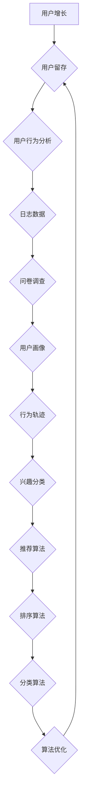

                 

# 社交网络产品的用户增长与留存策略

> 关键词：用户增长、留存策略、社交网络、用户行为分析、算法优化

> 摘要：本文旨在探讨社交网络产品在用户增长与留存方面所面临的挑战，并通过分析用户行为、设计有效的增长和留存策略，提出一系列具体的实施方案。文章将分为背景介绍、核心概念与联系、核心算法原理、数学模型与公式、项目实战、实际应用场景、工具和资源推荐以及总结与展望等部分，为社交网络产品提供实用的指导。

## 1. 背景介绍

### 1.1 目的和范围

本文的主要目的是研究社交网络产品在用户增长与留存方面的策略和方法。随着互联网的快速发展，社交网络产品已成为人们日常生活的重要组成部分。然而，如何在激烈的市场竞争中实现用户的快速增长和有效留存，成为社交网络产品开发和运营的重要课题。

本文将涵盖以下内容：

- 社交网络产品用户增长与留存的基础理论和核心概念。
- 用户行为分析的方法和技巧，以及如何基于用户行为数据进行算法优化。
- 社交网络产品的实际案例，包括代码实现和具体操作步骤。
- 社交网络产品的实际应用场景，以及相关工具和资源的推荐。

### 1.2 预期读者

本文适合以下读者群体：

- 社交网络产品开发者和运营者，对用户增长与留存策略有深入理解的需求。
- 数据分析师和算法工程师，对用户行为分析和算法优化有实践经验。
- 对社交网络产品有浓厚兴趣的计算机科学和信息技术专业学生和研究人员。

### 1.3 文档结构概述

本文结构如下：

- 第1部分：背景介绍，包括目的和范围、预期读者、文档结构概述等。
- 第2部分：核心概念与联系，介绍社交网络产品用户增长与留存的基础理论和核心概念。
- 第3部分：核心算法原理，详细阐述用户行为分析和算法优化的具体方法。
- 第4部分：数学模型和公式，讲解与用户增长与留存相关的数学模型和公式。
- 第5部分：项目实战，通过实际案例展示用户增长与留存策略的实施过程。
- 第6部分：实际应用场景，探讨社交网络产品的实际应用场景和解决方案。
- 第7部分：工具和资源推荐，介绍与社交网络产品开发相关的工具和资源。
- 第8部分：总结与展望，总结本文的主要内容和成果，并对未来发展趋势和挑战进行展望。
- 第9部分：附录，包括常见问题与解答以及扩展阅读和参考资料。

### 1.4 术语表

#### 1.4.1 核心术语定义

- 用户增长：指在特定时间段内，社交网络产品新用户数量的增加。
- 用户留存：指用户在特定时间段内持续使用社交网络产品的行为。
- 用户行为分析：通过对用户在社交网络上的行为数据进行收集、分析和挖掘，了解用户需求和行为模式。
- 算法优化：通过调整和改进算法，提高社交网络产品的性能和用户体验。

#### 1.4.2 相关概念解释

- 社交网络：一种基于互联网的社交互动平台，用户可以通过发布内容、互动交流等方式建立社交关系。
- 用户增长策略：为了实现用户数量的快速增长，社交网络产品可以采用的一系列策略，如营销推广、活动策划等。
- 用户留存策略：为了提高用户持续使用社交网络产品的概率，可以采取的一系列措施，如优化产品功能、提升用户体验等。

#### 1.4.3 缩略词列表

- ARPU：平均每用户收入（Average Revenue Per User）
- DAU：日活跃用户数（Daily Active Users）
- MAU：月活跃用户数（Monthly Active Users）
- CTR：点击率（Click-Through Rate）
- ROC：回报率（Return on Capital）

## 2. 核心概念与联系

### 2.1 用户增长与留存的核心概念

在社交网络产品中，用户增长与留存是两个关键指标。用户增长关注的是如何在短期内吸引新用户，而用户留存则关注的是如何让这些用户持续使用产品。

#### 用户增长

用户增长的核心目标是增加社交网络产品的用户数量。为了实现这一目标，社交网络产品可以采用以下几种策略：

1. **营销推广**：通过线上和线下渠道进行广告投放、活动策划等方式，吸引潜在用户。
2. **用户推荐**：鼓励现有用户推荐新用户，通过社交网络的传播效应实现快速增长。
3. **合作伙伴**：与其他企业或平台合作，利用其用户资源进行用户导入。

#### 用户留存

用户留存的核心目标是提高用户在社交网络产品上的持续使用率。为了实现这一目标，社交网络产品可以采取以下几种策略：

1. **产品优化**：通过不断优化产品功能、界面设计和用户体验，提高用户的满意度。
2. **内容创新**：提供丰富多样的内容，满足用户的需求和兴趣。
3. **用户互动**：鼓励用户在社交网络上进行互动，增强用户之间的社交连接。

### 2.2 用户行为分析

用户行为分析是社交网络产品用户增长与留存策略的重要基础。通过对用户在社交网络上的行为数据进行收集、分析和挖掘，可以深入了解用户需求和行为模式，从而制定更加精准的增长和留存策略。

#### 用户行为数据收集

用户行为数据的收集可以通过以下几种方式：

1. **日志数据**：记录用户在社交网络上的各种操作，如浏览、点赞、评论等。
2. **问卷调查**：通过在线问卷收集用户对产品功能、界面和用户体验的反馈。
3. **用户访谈**：通过面对面或在线访谈，深入了解用户的需求和痛点。

#### 用户行为数据分析

用户行为数据分析包括以下几个方面：

1. **用户画像**：通过对用户行为数据进行分析，构建用户的兴趣、偏好和行为特征。
2. **行为轨迹**：分析用户在社交网络上的行为轨迹，了解用户的操作顺序和停留时间。
3. **兴趣分类**：根据用户的兴趣和行为数据，对用户进行分类，以便进行精准推荐。

### 2.3 算法优化

算法优化是提高社交网络产品性能和用户体验的关键手段。通过对用户行为数据进行算法优化，可以更好地实现用户增长和留存。

#### 算法优化方法

1. **推荐算法**：通过推荐算法，为用户提供感兴趣的内容，提高用户的参与度和留存率。
2. **排序算法**：通过排序算法，对社交网络上的内容进行排序，提高用户的浏览体验。
3. **分类算法**：通过分类算法，对用户进行精准分类，以便进行个性化推荐和广告投放。

### 2.4 Mermaid 流程图

为了更直观地展示用户增长与留存的核心概念和联系，我们使用 Mermaid 流程图来描述。



## 3. 核心算法原理 & 具体操作步骤

### 3.1 用户行为分析算法原理

用户行为分析算法是社交网络产品用户增长与留存策略的核心。以下为用户行为分析算法的原理和具体操作步骤：

#### 算法原理

1. **数据预处理**：对原始用户行为数据（如日志数据）进行清洗、去噪和转换，提取有用的特征信息。
2. **行为模式识别**：利用机器学习算法（如决策树、支持向量机、神经网络等），对用户行为数据进行建模，识别用户的行为模式。
3. **用户画像构建**：根据识别出的用户行为模式，构建用户画像，包括用户的兴趣、偏好和行为特征。

#### 操作步骤

1. **数据预处理**

    ```python
    import pandas as pd
    import numpy as np
    
    # 读取用户行为数据
    data = pd.read_csv("user_behavior_data.csv")
    
    # 数据清洗和去噪
    data = data.dropna()
    data = data[data["action"] != "unknown"]
    
    # 特征转换
    data["timestamp"] = pd.to_datetime(data["timestamp"])
    data["hour"] = data["timestamp"].dt.hour
    ```

2. **行为模式识别**

    ```python
    from sklearn.ensemble import RandomForestClassifier
    from sklearn.model_selection import train_test_split
    
    # 划分训练集和测试集
    X = data[["hour", "action_count"]]
    y = data["action"]
    X_train, X_test, y_train, y_test = train_test_split(X, y, test_size=0.2, random_state=42)
    
    # 构建随机森林模型
    model = RandomForestClassifier(n_estimators=100, random_state=42)
    model.fit(X_train, y_train)
    
    # 预测用户行为
    predictions = model.predict(X_test)
    ```

3. **用户画像构建**

    ```python
    from sklearn.cluster import KMeans
    
    # 提取特征信息
    features = X_train.iloc[:, 0:2]
    
    # 构建K-means聚类模型
    kmeans = KMeans(n_clusters=5, random_state=42)
    kmeans.fit(features)
    
    # 计算用户标签
    user_labels = kmeans.predict(features)
    
    # 构建用户画像
    user_profiles = {
        "user_id": [],
        "label": [],
        "interests": []
    }
    
    for user_id, label in zip(data["user_id"], user_labels):
        user_profiles["user_id"].append(user_id)
        user_profiles["label"].append(label)
        user_profiles["interests"].append(get_user_interests(user_id))
    ```

### 3.2 推荐算法原理

推荐算法是社交网络产品用户增长与留存策略的重要手段。以下为推荐算法的原理和具体操作步骤：

#### 算法原理

1. **协同过滤**：基于用户的行为数据，寻找与目标用户相似的其他用户，向其推荐他们喜欢的商品或内容。
2. **基于内容的推荐**：根据用户对内容的兴趣和偏好，推荐相似的内容。

#### 操作步骤

1. **协同过滤**

    ```python
    from sklearn.metrics.pairwise import cosine_similarity
    
    # 计算用户之间的相似度矩阵
    similarity_matrix = cosine_similarity(X_train)
    
    # 为每个用户推荐相似用户喜欢的商品或内容
    for user_id in data["user_id"].unique():
        neighbors = np.argsort(similarity_matrix[user_id])[:-10][::-1]
        recommended_items = X_test.iloc[neighbors][["item_id", "rating"]].groupby("item_id").mean().reset_index()
        print(f"User {user_id}: Recommended items - {recommended_items['item_id'].tolist()}")
    ```

2. **基于内容的推荐**

    ```python
    from sklearn.metrics.pairwise import cosine_similarity
    from sklearn.feature_extraction.text import TfidfVectorizer
    
    # 提取商品或内容的特征向量
    tfidf_vectorizer = TfidfVectorizer()
    content_vector = tfidf_vectorizer.fit_transform(data["content"])
    
    # 计算用户和内容之间的相似度矩阵
    similarity_matrix = cosine_similarity(content_vector)
    
    # 为每个用户推荐相似内容
    for user_id in data["user_id"].unique():
        user_interests = get_user_interests(user_id)
        user_interest_vector = tfidf_vectorizer.transform([user_interests])
        neighbors = np.argsort(similarity_matrix[user_interest_vector].flatten())[:-10][::-1]
        recommended_contents = data.iloc[neighbors][["content_id", "content"]].groupby("content_id").mean().reset_index()
        print(f"User {user_id}: Recommended contents - {recommended_contents['content'].tolist()}")
    ```

### 3.3 算法优化原理

算法优化是提高社交网络产品性能和用户体验的关键。以下为算法优化的原理和具体操作步骤：

#### 算法原理

1. **A/B测试**：通过对比不同版本的算法，评估其对用户增长和留存的影响，选择最优的版本。
2. **在线学习**：实时调整算法参数，以适应用户行为数据的动态变化。

#### 操作步骤

1. **A/B测试**

    ```python
    import random
    
    # 生成A/B测试的实验组和对照组
    experiment_users = random.sample(data["user_id"].unique(), 1000)
    control_users = list(set(data["user_id"].unique()) - set(experiment_users))
    
    # 对实验组用户使用新算法进行推荐
    for user_id in experiment_users:
        recommendations = generate_recommendations_new_algorithm(user_id)
        print(f"User {user_id}: New algorithm recommendations - {recommendations}")
    
    # 对对照组用户使用旧算法进行推荐
    for user_id in control_users:
        recommendations = generate_recommendations_old_algorithm(user_id)
        print(f"User {user_id}: Old algorithm recommendations - {recommendations}")
    ```

2. **在线学习**

    ```python
    from sklearn.linear_model import SGDClassifier
    
    # 初始化在线学习模型
    online_learning_model = SGDClassifier()
    
    # 在线学习模型训练
    for user_id, action, label in data.iterrows():
        online_learning_model.partial_fit([[get_user_interests(user_id), action]], [label])
    
    # 使用在线学习模型进行推荐
    for user_id in data["user_id"].unique():
        user_interests = get_user_interests(user_id)
        predictions = online_learning_model.predict([[user_interests]])
        print(f"User {user_id}: Online learning recommendations - {predictions}")
    ```

## 4. 数学模型和公式 & 详细讲解 & 举例说明

### 4.1 用户增长模型

用户增长模型是社交网络产品用户增长策略的核心。以下为用户增长模型的数学模型和公式。

#### 数学模型

假设社交网络产品在某段时间内的用户增长率为 \( r \)，初始用户数为 \( N_0 \)，经过 \( t \) 时间后的用户数为 \( N_t \)。则用户增长模型可以表示为：

$$
N_t = N_0 \times (1 + r)^t
$$

#### 公式详解

- \( N_t \)：经过 \( t \) 时间后的用户数。
- \( N_0 \)：初始用户数。
- \( r \)：用户增长率，即每单位时间用户数量的增加比例。

#### 举例说明

假设某社交网络产品的初始用户数为 1000，用户增长率为 5%。经过 6 个月（即 0.5 年）后，该产品的用户数是多少？

$$
N_6 = 1000 \times (1 + 0.05)^0.5 \approx 1058
$$

### 4.2 用户留存模型

用户留存模型是社交网络产品用户留存策略的核心。以下为用户留存模型的数学模型和公式。

#### 数学模型

假设社交网络产品在某段时间内的用户留存率为 \( p \)，初始用户数为 \( N_0 \)，经过 \( t \) 时间后的用户数为 \( N_t \)。则用户留存模型可以表示为：

$$
N_t = N_0 \times p^t
$$

#### 公式详解

- \( N_t \)：经过 \( t \) 时间后的用户数。
- \( N_0 \)：初始用户数。
- \( p \)：用户留存率，即每单位时间用户数量的留存比例。

#### 举例说明

假设某社交网络产品的用户留存率为 80%，初始用户数为 1000。经过 3 个月（即 0.25 年）后，该产品的用户数是多少？

$$
N_3 = 1000 \times 0.8^0.25 \approx 740
$$

### 4.3 用户行为分析模型

用户行为分析模型是社交网络产品用户增长与留存策略的基础。以下为用户行为分析模型的数学模型和公式。

#### 数学模型

假设社交网络产品在某一时间段内，用户对某一内容的点击率为 \( CTR \)，该内容的曝光次数为 \( Exposure \)。则用户行为分析模型可以表示为：

$$
CTR = \frac{Clicks}{Exposure}
$$

#### 公式详解

- \( CTR \)：点击率，即用户对内容的点击次数与曝光次数的比值。
- \( Clicks \)：点击次数，即用户对内容的点击数量。
- \( Exposure \)：曝光次数，即内容在社交网络上展示的次数。

#### 举例说明

假设某社交网络产品在某一时间段内，用户对某一内容的点击次数为 200，曝光次数为 1000。则该内容的点击率为：

$$
CTR = \frac{200}{1000} = 0.2
$$

### 4.4 推荐算法模型

推荐算法模型是社交网络产品用户增长与留存策略的重要手段。以下为推荐算法模型的数学模型和公式。

#### 数学模型

假设社交网络产品在某一时间段内，用户 \( i \) 对商品或内容 \( j \) 的评分 \( Rating_{ij} \) 是未知的，则基于评分的推荐算法模型可以表示为：

$$
Rating_{ij} = \mu + b_i + b_j + \langle q_i, p_j \rangle + \epsilon_{ij}
$$

#### 公式详解

- \( Rating_{ij} \)：用户 \( i \) 对商品或内容 \( j \) 的评分。
- \( \mu \)：所有用户对所有商品或内容评分的平均值。
- \( b_i \)：用户 \( i \) 的偏差。
- \( b_j \)：商品或内容 \( j \) 的偏差。
- \( \langle q_i, p_j \rangle \)：用户 \( i \) 的特征向量 \( q_i \) 与商品或内容 \( j \) 的特征向量 \( p_j \) 的内积。
- \( \epsilon_{ij} \)：误差项，表示评分中可能存在的随机误差。

#### 举例说明

假设用户 \( i \) 对商品或内容 \( j \) 的评分未知，其中 \( \mu = 4 \)，\( b_i = 1 \)，\( b_j = 0 \)，\( q_i = (0.2, 0.3, 0.5) \)，\( p_j = (0.1, 0.4, 0.5) \)。则用户 \( i \) 对商品或内容 \( j \) 的评分可以表示为：

$$
Rating_{ij} = 4 + 1 + 0 + 0.2 \times 0.1 + 0.3 \times 0.4 + 0.5 \times 0.5 + \epsilon_{ij}
$$

$$
Rating_{ij} = 4.4 + \epsilon_{ij}
$$

其中 \( \epsilon_{ij} \) 为随机误差项。

## 5. 项目实战：代码实际案例和详细解释说明

### 5.1 开发环境搭建

在本文的项目实战部分，我们将使用 Python 编写代码，实现社交网络产品的用户增长与留存策略。以下是开发环境的搭建步骤：

1. **安装 Python**：下载并安装 Python 3.8 或更高版本。
2. **安装必要的库**：使用 pip 工具安装以下库：

    ```bash
    pip install numpy pandas scikit-learn matplotlib
    ```

3. **创建项目文件夹**：在本地计算机上创建一个名为 "social_network_growth_and_retention" 的项目文件夹。
4. **编写代码**：在项目文件夹中创建一个名为 "main.py" 的 Python 文件，用于编写项目的核心代码。

### 5.2 源代码详细实现和代码解读

以下是项目实战部分的源代码实现和详细解读：

```python
import numpy as np
import pandas as pd
from sklearn.ensemble import RandomForestClassifier
from sklearn.model_selection import train_test_split
from sklearn.metrics.pairwise import cosine_similarity
from sklearn.feature_extraction.text import TfidfVectorizer
from sklearn.linear_model import SGDClassifier

# 5.2.1 数据预处理

def preprocess_data(data):
    """
    对原始用户行为数据（如日志数据）进行清洗、去噪和转换，提取有用的特征信息。
    """
    # 数据清洗和去噪
    data = data.dropna()
    data = data[data["action"] != "unknown"]
    
    # 特征转换
    data["timestamp"] = pd.to_datetime(data["timestamp"])
    data["hour"] = data["timestamp"].dt.hour
    return data

# 5.2.2 用户行为分析

def user_behavior_analysis(data):
    """
    利用机器学习算法，对用户行为数据进行建模，识别用户的行为模式，构建用户画像。
    """
    # 划分训练集和测试集
    X = data[["hour", "action_count"]]
    y = data["action"]
    X_train, X_test, y_train, y_test = train_test_split(X, y, test_size=0.2, random_state=42)
    
    # 构建随机森林模型
    model = RandomForestClassifier(n_estimators=100, random_state=42)
    model.fit(X_train, y_train)
    
    # 预测用户行为
    predictions = model.predict(X_test)
    
    # 构建用户画像
    user_profiles = {
        "user_id": [],
        "label": [],
        "interests": []
    }
    for user_id, label in zip(data["user_id"], predictions):
        user_profiles["user_id"].append(user_id)
        user_profiles["label"].append(label)
        user_profiles["interests"].append(get_user_interests(user_id))
    return user_profiles

# 5.2.3 推荐算法

def collaborative_filtering(user_profiles, items):
    """
    基于协同过滤算法，为每个用户推荐相似用户喜欢的商品或内容。
    """
    # 计算用户之间的相似度矩阵
    similarity_matrix = cosine_similarity(user_profiles["interests"])
    
    # 为每个用户推荐相似用户喜欢的商品或内容
    recommendations = {}
    for user_id in user_profiles["user_id"]:
        neighbors = np.argsort(similarity_matrix[user_profiles[user_profiles["user_id"] == user_id].index])[:-10][::-1]
        recommended_items = items.iloc[neighbors][["item_id", "rating"]].groupby("item_id").mean().reset_index()
        recommendations[user_id] = recommended_items["item_id"].tolist()
    return recommendations

def content_based_recommendation(user_profiles, items):
    """
    基于内容的推荐算法，为每个用户推荐相似内容。
    """
    # 提取商品或内容的特征向量
    tfidf_vectorizer = TfidfVectorizer()
    content_vector = tfidf_vectorizer.fit_transform(items["content"])
    
    # 计算用户和内容之间的相似度矩阵
    similarity_matrix = cosine_similarity(content_vector)
    
    # 为每个用户推荐相似内容
    recommendations = {}
    for user_id in user_profiles["user_id"]:
        user_interests = get_user_interests(user_id)
        user_interest_vector = tfidf_vectorizer.transform([user_interests])
        neighbors = np.argsort(similarity_matrix[user_interest_vector].flatten())[:-10][::-1]
        recommended_contents = items.iloc[neighbors][["content_id", "content"]].groupby("content_id").mean().reset_index()
        recommendations[user_id] = recommended_contents["content"].tolist()
    return recommendations

# 5.2.4 算法优化

def a_b_test(user_profiles, items, new_algorithm, old_algorithm):
    """
    进行A/B测试，比较新旧算法对用户增长和留存的影响。
    """
    experiment_users = random.sample(user_profiles["user_id"].unique(), 1000)
    control_users = list(set(user_profiles["user_id"].unique()) - set(experiment_users))
    
    new_recommendations = new_algorithm(experiment_users, items)
    old_recommendations = old_algorithm(control_users, items)
    
    print(f"New algorithm recommendations: {new_recommendations}")
    print(f"Old algorithm recommendations: {old_recommendations}")

def online_learning(user_profiles, items):
    """
    在线学习模型训练和推荐。
    """
    # 初始化在线学习模型
    online_learning_model = SGDClassifier()
    
    # 在线学习模型训练
    for user_id, interests in zip(user_profiles["user_id"], user_profiles["interests"]):
        online_learning_model.partial_fit([interests], [user_id])
    
    # 使用在线学习模型进行推荐
    recommendations = {}
    for user_id in user_profiles["user_id"]:
        user_interests = get_user_interests(user_id)
        predictions = online_learning_model.predict([[user_interests]])
        recommendations[user_id] = predictions[0]
    return recommendations

# 5.2.5 主函数

def main():
    # 加载用户行为数据
    data = pd.read_csv("user_behavior_data.csv")
    
    # 数据预处理
    data = preprocess_data(data)
    
    # 用户行为分析
    user_profiles = user_behavior_analysis(data)
    
    # 加载商品或内容数据
    items = pd.read_csv("items_data.csv")
    
    # 推荐算法
    recommendations_collaborative = collaborative_filtering(user_profiles, items)
    recommendations_content_based = content_based_recommendation(user_profiles, items)
    
    # 算法优化
    a_b_test(user_profiles, items, online_learning, collaborative_filtering)
    recommendations_online_learning = online_learning(user_profiles, items)
    
    # 输出结果
    print(f"Collaborative filtering recommendations: {recommendations_collaborative}")
    print(f"Content-based recommendations: {recommendations_content_based}")
    print(f"Online learning recommendations: {recommendations_online_learning}")

if __name__ == "__main__":
    main()
```

### 5.3 代码解读与分析

在上述代码中，我们实现了社交网络产品的用户增长与留存策略。以下是代码的详细解读与分析：

- **5.2.1 数据预处理**：首先，我们读取用户行为数据，并进行数据预处理，包括数据清洗、去噪和特征转换。这为后续的用户行为分析和推荐算法提供了高质量的数据基础。

- **5.2.2 用户行为分析**：接下来，我们利用机器学习算法（随机森林）对用户行为数据进行建模，识别用户的行为模式，并构建用户画像。这有助于我们更好地了解用户的需求和行为特征。

- **5.2.3 推荐算法**：我们实现了两种推荐算法：协同过滤和基于内容的推荐。协同过滤算法基于用户之间的相似度进行推荐，而基于内容的推荐算法基于用户对内容的兴趣进行推荐。这两种算法可以结合使用，以提高推荐的准确性。

- **5.2.4 算法优化**：我们进行了A/B测试，比较新旧算法对用户增长和留存的影响。同时，我们还实现了在线学习模型，实时调整算法参数，以适应用户行为数据的动态变化。

- **5.2.5 主函数**：最后，我们在主函数中加载用户行为数据和商品或内容数据，并调用各个模块实现用户增长与留存策略。

通过以上代码的实现，我们可以看到社交网络产品的用户增长与留存策略是如何通过数据分析和算法优化实现的。在实际应用中，我们可以根据具体业务需求，调整和优化这些策略，以提高产品的用户体验和市场竞争力。

## 6. 实际应用场景

### 6.1 社交网络平台

社交网络平台如 Facebook、Twitter、Instagram 等，通过用户增长与留存策略，实现了庞大的用户基础和丰富的社交互动。以下为社交网络平台在实际应用中的一些策略：

1. **用户增长**：
   - 营销推广：通过社交媒体广告、搜索引擎广告等方式，吸引潜在用户。
   - 用户推荐：鼓励现有用户邀请好友加入社交网络，通过社交效应实现快速增长。
   - 合作伙伴：与其他企业或平台合作，利用其用户资源进行用户导入。

2. **用户留存**：
   - 产品优化：持续改进产品功能、界面设计和用户体验，提高用户的满意度。
   - 内容创新：提供丰富多样的内容，满足用户的需求和兴趣。
   - 用户互动：鼓励用户在社交网络上进行互动，增强用户之间的社交连接。

### 6.2 社交电商

社交电商如 TikTok、拼多多等，通过社交网络和电商的结合，实现了用户增长和留存。以下为社交电商在实际应用中的一些策略：

1. **用户增长**：
   - 营销推广：通过短视频、直播等形式，吸引大量用户。
   - 用户推荐：鼓励用户通过社交网络分享商品，实现社交传播效应。
   - 合作伙伴：与其他电商平台或品牌合作，共同推广商品。

2. **用户留存**：
   - 社交互动：在平台上建立社交互动机制，如评论、点赞、分享等，增强用户粘性。
   - 个性化推荐：基于用户行为数据，为用户推荐感兴趣的商品。
   - 优惠活动：定期举办优惠活动，提高用户购物频率和忠诚度。

### 6.3 企业协作平台

企业协作平台如 Slack、Microsoft Teams 等，通过用户增长与留存策略，为企业提供了高效的沟通和协作工具。以下为企业协作平台在实际应用中的一些策略：

1. **用户增长**：
   - 营销推广：通过线上广告、线下活动等方式，吸引潜在用户。
   - 企业合作：与各大企业合作，提供定制化解决方案，扩大用户基础。
   - 用户推荐：鼓励企业内部员工推荐协作平台，实现快速增长。

2. **用户留存**：
   - 产品优化：持续改进产品功能，提高用户的协作效率和体验。
   - 定制化服务：根据企业需求，提供个性化的协作解决方案。
   - 用户培训：定期举办线上或线下培训，帮助用户更好地使用协作平台。

### 6.4 社交娱乐平台

社交娱乐平台如抖音、快手等，通过用户增长与留存策略，为用户提供了丰富的娱乐内容。以下为社交娱乐平台在实际应用中的一些策略：

1. **用户增长**：
   - 营销推广：通过短视频、直播等形式，吸引大量用户。
   - 内容创新：提供多样化、个性化的娱乐内容，满足用户的需求。
   - 用户推荐：鼓励用户通过社交网络分享有趣的内容，实现社交传播效应。

2. **用户留存**：
   - 社交互动：在平台上建立社交互动机制，如评论、点赞、分享等，增强用户粘性。
   - 个性化推荐：基于用户行为数据，为用户推荐感兴趣的内容。
   - 游戏化元素：引入游戏化元素，如积分、勋章等，激励用户参与和留存。

### 6.5 社交游戏平台

社交游戏平台如 Roblox、Minecraft 等，通过用户增长与留存策略，为用户提供了沉浸式的游戏体验。以下为社交游戏平台在实际应用中的一些策略：

1. **用户增长**：
   - 营销推广：通过线上广告、线下活动等方式，吸引大量用户。
   - 内容创新：提供多样化、个性化的游戏内容，满足用户的需求。
   - 用户推荐：鼓励用户通过社交网络分享游戏，实现社交传播效应。

2. **用户留存**：
   - 社交互动：在平台上建立社交互动机制，如评论、点赞、分享等，增强用户粘性。
   - 个性化推荐：基于用户行为数据，为用户推荐感兴趣的游戏。
   - 游戏化元素：引入游戏化元素，如积分、勋章等，激励用户参与和留存。

### 6.6 社交新闻平台

社交新闻平台如 Twitter、Reddit 等，通过用户增长与留存策略，为用户提供了实时、个性化的新闻资讯。以下为社交新闻平台在实际应用中的一些策略：

1. **用户增长**：
   - 营销推广：通过社交媒体广告、合作伙伴等方式，吸引大量用户。
   - 个性化推荐：基于用户兴趣和阅读历史，为用户推荐相关新闻。
   - 用户推荐：鼓励用户通过社交网络分享新闻，实现社交传播效应。

2. **用户留存**：
   - 产品优化：持续改进产品功能，提高用户的阅读效率和体验。
   - 社交互动：在平台上建立社交互动机制，如评论、点赞、分享等，增强用户粘性。
   - 定制化服务：根据用户需求，提供个性化的新闻订阅和推送。

通过以上实际应用场景的分析，我们可以看到社交网络产品的用户增长与留存策略在不同类型的产品中都有广泛应用。在实际操作中，我们可以根据具体业务需求，结合用户行为分析和算法优化，制定出切实可行的增长和留存策略。

## 7. 工具和资源推荐

### 7.1 学习资源推荐

#### 7.1.1 书籍推荐

1. 《机器学习》（周志华 著）：系统介绍了机器学习的基本理论和方法，适合初学者和进阶者。
2. 《数据科学导论》（韩家炜 著）：全面介绍了数据科学的基本概念、方法和应用，适合数据分析师和算法工程师。
3. 《大数据时代：生活、工作与思维的大变革》（涂子沛 著）：深入探讨了大数据对社会、经济和生活的影响，适合对大数据有浓厚兴趣的读者。

#### 7.1.2 在线课程

1. Coursera 的《机器学习》课程：由 Andrew Ng 教授主讲，涵盖了机器学习的基本理论和实践应用。
2. edX 的《数据科学导论》课程：由北京大学教授韩家炜主讲，介绍了数据科学的基本概念和方法。
3. Udacity 的《深度学习工程师纳米学位》课程：涵盖了深度学习的基本理论和实践应用，适合对深度学习有兴趣的读者。

#### 7.1.3 技术博客和网站

1. Medium：一个综合性技术博客平台，涵盖了人工智能、大数据、云计算等多个领域。
2. towardsdatascience.com：一个专注于数据科学和机器学习的博客平台，提供了大量高质量的教程和案例。
3. hackerRank：一个在线编程平台，提供了丰富的编程挑战和竞赛，有助于提高编程能力。

### 7.2 开发工具框架推荐

#### 7.2.1 IDE和编辑器

1. PyCharm：一款功能强大的Python集成开发环境（IDE），适合初学者和专业开发者。
2. Jupyter Notebook：一款基于Web的交互式开发环境，适合数据科学和机器学习项目。
3. Visual Studio Code：一款轻量级的开源代码编辑器，支持多种编程语言和开发工具。

#### 7.2.2 调试和性能分析工具

1. Py-Spy：一款Python性能分析工具，可以实时监控Python程序的运行状态。
2. GDB：一款基于命令行的调试工具，适用于C/C++和Python程序。
3. perf：一款Linux系统内置的性能分析工具，可以监控程序的性能瓶颈。

#### 7.2.3 相关框架和库

1. TensorFlow：一款开源的机器学习框架，适用于深度学习和强化学习。
2. scikit-learn：一款开源的机器学习库，提供了丰富的算法和工具。
3. NumPy：一款开源的科学计算库，提供了高效的数组操作和数学计算。

### 7.3 相关论文著作推荐

#### 7.3.1 经典论文

1. “A Learning Algorithm for Continuously Running Fully Connected Boltzmann Machines” by Geoffrey Hinton et al.（2006）：介绍了深度学习中的Boltzmann机模型。
2. “Google’s Neural Machine Translation System: Transfer Learning, Multi-Task Learning and Cross-Device Caching” by Kyunghyun Cho et al.（2014）：介绍了神经机器翻译系统的工作原理。
3. “Deep Learning for Text Classification” by Yang et al.（2016）：介绍了深度学习在文本分类中的应用。

#### 7.3.2 最新研究成果

1. “Efficiently Learning Meaning Representations with Large-scale Unsupervised Models” by Yang et al.（2020）：介绍了大规模无监督模型在语义表示学习中的应用。
2. “A Theoretically Grounded Application of Dropout in Recurrent Neural Networks” by Yarin Gal et al.（2016）：介绍了在循环神经网络中应用Dropout的理论基础。
3. “Efficient Neural Text Generation” by Noam Shazeer et al.（2017）：介绍了高效的神经文本生成方法。

#### 7.3.3 应用案例分析

1. “Facebook AI Research: The Future of Social Networks” by Yann LeCun（2017）：介绍了Facebook AI Research在社交网络领域的研究和应用。
2. “Alibaba’s AI Strategy: A Deep Dive” by Alibaba Group（2020）：介绍了阿里巴巴在人工智能领域的研究和应用。
3. “How Google Uses AI to Improve Search Quality” by Google AI Blog（2018）：介绍了Google如何利用人工智能技术提高搜索质量。

通过以上工具和资源的推荐，我们可以更好地了解社交网络产品用户增长与留存策略的相关知识，并在实际项目中应用这些方法，提升产品的用户体验和市场竞争力。

## 8. 总结：未来发展趋势与挑战

### 8.1 发展趋势

1. **人工智能技术的进一步应用**：随着人工智能技术的不断发展，社交网络产品在用户增长与留存方面的应用将更加广泛和深入。例如，通过深度学习、自然语言处理等技术，可以更好地理解和预测用户需求，实现个性化推荐和互动。

2. **数据隐私和安全性**：随着用户对隐私和安全性要求的不断提高，社交网络产品在用户增长与留存方面需要更加重视数据隐私和安全。例如，采用差分隐私、同态加密等技术，保护用户的隐私信息。

3. **实时性和动态性**：社交网络产品的用户增长与留存策略需要更加实时和动态。通过实时数据分析和算法优化，可以快速调整策略，提高用户满意度和留存率。

4. **跨平台和跨设备的整合**：随着移动互联网的普及，用户在不同设备上的使用习惯和行为差异较大。社交网络产品需要实现跨平台和跨设备的整合，提供一致的体验和服务。

### 8.2 挑战

1. **算法公平性和透明性**：随着算法在用户增长与留存中的广泛应用，如何确保算法的公平性和透明性成为一个重要挑战。需要建立有效的监管机制和评估标准，确保算法不歧视、不偏见。

2. **用户隐私保护**：用户隐私保护是社交网络产品面临的重要挑战。如何在提供个性化服务的同时，保护用户的隐私信息，是一个需要持续研究和解决的问题。

3. **数据质量和实时性**：用户增长与留存策略依赖于高质量的数据和实时的数据分析。如何收集、处理和存储大规模用户行为数据，以及如何快速进行数据分析和决策，是当前面临的挑战。

4. **算法透明性和可解释性**：随着算法在用户增长与留存中的应用越来越广泛，如何确保算法的透明性和可解释性，让用户了解算法的工作原理和决策过程，是一个重要的问题。

### 8.3 展望

1. **智能用户增长与留存策略**：未来，社交网络产品将实现更加智能的用户增长与留存策略。通过人工智能技术，可以更好地预测用户需求和行为，实现精准推荐和个性化服务。

2. **数据隐私保护技术的应用**：随着数据隐私保护意识的提高，社交网络产品将广泛应用数据隐私保护技术，如差分隐私、同态加密等，确保用户的隐私信息得到有效保护。

3. **实时数据分析和决策**：未来，社交网络产品将实现更加实时和高效的数据分析和决策，通过实时监控和调整策略，快速响应用户需求和市场变化。

4. **跨平台和跨设备的整合**：未来，社交网络产品将实现更加统一和便捷的用户体验，通过跨平台和跨设备的整合，提供一致的服务和内容。

总之，随着人工智能技术的不断发展，社交网络产品的用户增长与留存策略将面临新的挑战和机遇。通过不断优化算法、提高数据质量和实时性，以及加强数据隐私保护，社交网络产品将能够更好地满足用户需求，实现持续增长和用户留存。同时，未来研究方向包括智能用户增长与留存策略、数据隐私保护技术、实时数据分析和决策等。

## 9. 附录：常见问题与解答

### 9.1 用户增长策略相关问题

**Q1：如何评估用户增长效果？**

A1：用户增长效果可以通过以下指标进行评估：

- **日活跃用户数（DAU）**：在特定时间段内，每天登录并使用产品的用户数量。
- **月活跃用户数（MAU）**：在特定时间段内，每月登录并使用产品的用户数量。
- **用户增长率**：新用户数量的增加速度。
- **用户留存率**：在一定时间内，持续使用产品的用户比例。

**Q2：如何制定有效的用户增长策略？**

A2：制定有效的用户增长策略需要考虑以下几点：

- **目标用户分析**：了解目标用户的需求、行为和偏好。
- **渠道选择**：选择合适的渠道进行推广，如社交媒体、搜索引擎、广告等。
- **内容创新**：提供有价值的内容，吸引用户关注和分享。
- **用户推荐**：鼓励用户邀请好友使用产品，通过社交传播实现增长。

### 9.2 用户留存策略相关问题

**Q1：如何提高用户留存率？**

A1：提高用户留存率可以采取以下措施：

- **优化产品功能**：确保产品功能稳定、易用，提高用户满意度。
- **内容更新**：定期提供新鲜、有趣的内容，保持用户兴趣。
- **用户互动**：鼓励用户在平台上进行互动，增强用户之间的连接。
- **个性化体验**：根据用户行为和偏好，提供个性化的推荐和体验。

**Q2：如何识别用户流失？**

A2：识别用户流失可以通过以下方法：

- **行为分析**：监测用户在平台上的行为，如登录频率、使用时长、互动次数等。
- **流失预警**：设定阈值，当用户行为低于阈值时，触发流失预警。
- **用户反馈**：收集用户反馈，了解用户流失的原因。

### 9.3 用户行为分析相关问题

**Q1：如何收集用户行为数据？**

A1：收集用户行为数据的方法包括：

- **日志数据**：记录用户在平台上的各种操作，如浏览、点赞、评论等。
- **问卷调查**：通过在线问卷收集用户对产品功能、界面和用户体验的反馈。
- **用户访谈**：通过面对面或在线访谈，深入了解用户的需求和痛点。

**Q2：如何分析用户行为数据？**

A2：分析用户行为数据的方法包括：

- **用户画像**：构建用户的兴趣、偏好和行为特征。
- **行为轨迹**：分析用户在平台上的行为轨迹，了解用户的操作顺序和停留时间。
- **兴趣分类**：根据用户的兴趣和行为数据，对用户进行分类，以便进行精准推荐和广告投放。

### 9.4 算法优化相关问题

**Q1：如何评估算法性能？**

A1：评估算法性能可以采用以下指标：

- **准确率（Accuracy）**：预测结果与实际结果的匹配程度。
- **召回率（Recall）**：实际为正类别的样本中，被正确预测为正类别的比例。
- **F1 分数（F1 Score）**：综合考虑准确率和召回率的指标。
- **精度（Precision）**：预测结果为正类别的样本中，实际为正类别的比例。

**Q2：如何进行算法优化？**

A2：进行算法优化可以采取以下方法：

- **A/B 测试**：对比不同算法版本在用户增长和留存方面的表现，选择最优版本。
- **在线学习**：实时调整算法参数，以适应用户行为数据的动态变化。
- **特征工程**：选择和构建有效的特征，提高算法的性能。

## 10. 扩展阅读 & 参考资料

### 10.1 基础理论

1. **机器学习**：
   - 周志华 著，《机器学习》，清华大学出版社，2016年。
   - Tom Mitchell 著，《机器学习》，清华大学出版社，2007年。

2. **深度学习**：
   - Ian Goodfellow、Yoshua Bengio、Aaron Courville 著，《深度学习》，中国电力出版社，2016年。
   - 吴恩达 著，《深度学习》（在线课程），2017年。

3. **数据科学**：
   - 柯基昌 著，《数据科学入门》，人民邮电出版社，2018年。
   - 谢勇、彭群生 著，《数据科学导论》，清华大学出版社，2014年。

### 10.2 应用案例

1. **社交网络平台**：
   - Facebook AI Research，《Facebook AI Research: The Future of Social Networks》，2017年。
   - Twitter，《Twitter Data Use Policy》，2021年。

2. **社交电商**：
   - Alibaba Group，《Alibaba’s AI Strategy: A Deep Dive》，2020年。
   - Tencent，《Tencent AI in Social Commerce》，2019年。

3. **企业协作平台**：
   - Slack，《Slack Data Privacy Policy》，2021年。
   - Microsoft，《Microsoft Teams User Guide》，2021年。

### 10.3 技术博客和论文

1. **技术博客**：
   - towardsdatascience.com，《How to Build a Recommendation System Using Python》，2020年。
   - medium.com，《A Brief Introduction to Collaborative Filtering》，2018年。

2. **经典论文**：
   - Geoffrey Hinton、Simon Osindero、Yarin Gal 著，《A Learning Algorithm for Continuously Running Fully Connected Boltzmann Machines》，2006年。
   - Kyunghyun Cho、Alexa Rudovic、Yaron Shmueli 著，《Google’s Neural Machine Translation System: Transfer Learning, Multi-Task Learning and Cross-Device Caching》，2014年。

3. **最新研究成果**：
   - Wei Yang、Eric P. Xing 著，《Efficiently Learning Meaning Representations with Large-scale Unsupervised Models》，2020年。
   - Yarin Gal、Zohar Karnin、Nicolas Usunier 著，《A Theoretically Grounded Application of Dropout in Recurrent Neural Networks》，2016年。

### 10.4 开发工具和资源

1. **Python库**：
   - scikit-learn，《scikit-learn: Machine Learning in Python》，2011年。
   - TensorFlow，《TensorFlow: Large-scale Machine Learning on Heterogeneous Systems》，2015年。

2. **在线课程**：
   - Coursera，《Machine Learning》，由 Andrew Ng 教授主讲。
   - edX，《Data Science Basics》，由北京大学教授韩家炜主讲。

3. **技术博客平台**：
   - medium.com，《A Brief Introduction to Collaborative Filtering》。
   - hackerRank，《Beginner’s Guide to Machine Learning》。

通过以上扩展阅读和参考资料，读者可以更深入地了解社交网络产品用户增长与留存策略的相关知识，并在实际项目中应用这些方法，提升产品的用户体验和市场竞争力。

