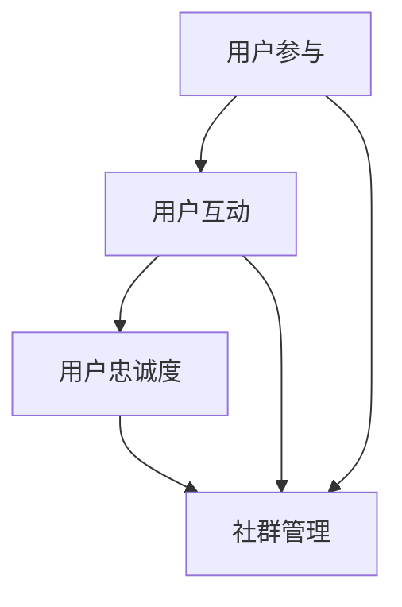
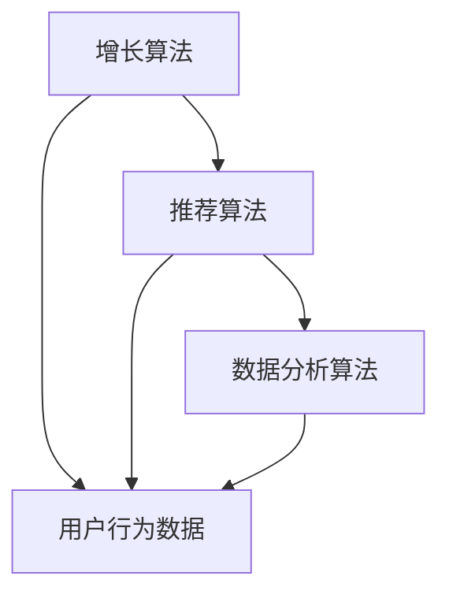

                 

# 社群运营：构建忠实用户群体的方法

> **关键词：社群运营、用户群体、用户忠诚度、营销策略、增长模型、数据分析**
>
> **摘要：本文将探讨如何通过社群运营构建忠实用户群体。我们将分析社群运营的核心概念、增长模型、数据分析方法以及成功的运营策略，旨在为IT从业者和创业公司提供实用的指导。**

## 1. 背景介绍

### 1.1 目的和范围

本文的目标是深入探讨社群运营的策略和技巧，为那些希望构建和维护一个忠实用户群体的IT从业者和创业公司提供实用的指导。我们将分析社群运营的核心概念，探索增长模型，讨论数据分析在社群运营中的应用，并提供具体的策略和工具。

### 1.2 预期读者

- **IT从业者和团队负责人**：对社群运营有初步了解，但需要深入掌握其方法和技巧。
- **创业公司创始人**：希望利用社群运营来拓展业务，建立用户忠诚度。
- **市场营销专业人士**：需要了解如何通过社群运营实现有效的用户参与和增长。

### 1.3 文档结构概述

本文的结构分为以下几个部分：

1. **背景介绍**：介绍社群运营的重要性。
2. **核心概念与联系**：定义核心概念，并提供流程图。
3. **核心算法原理与具体操作步骤**：详细解释社群运营的关键算法和操作步骤。
4. **数学模型和公式**：探讨社群增长模型，并使用公式和实例进行说明。
5. **项目实战**：通过代码案例展示社群运营的实际应用。
6. **实际应用场景**：分析社群运营在不同领域的应用。
7. **工具和资源推荐**：推荐学习资源和开发工具。
8. **总结**：总结社群运营的未来发展趋势与挑战。
9. **附录**：常见问题与解答。
10. **扩展阅读与参考资料**：提供进一步学习的资源。

### 1.4 术语表

#### 1.4.1 核心术语定义

- **社群运营**：指通过管理和维护在线社区或社群，促进用户互动、分享和参与的过程。
- **用户群体**：指使用某个产品或服务的用户集合。
- **用户忠诚度**：指用户对品牌或产品的长期忠诚和持续使用。
- **增长模型**：描述用户增长趋势和影响因素的数学模型。

#### 1.4.2 相关概念解释

- **KOL（Key Opinion Leader）**：关键意见领袖，指在特定领域具有高度影响力和专业知识的用户。
- **NPS（Net Promoter Score）**：净推荐值，衡量用户推荐意愿的指标。

#### 1.4.3 缩略词列表

- **KOL**：关键意见领袖
- **NPS**：净推荐值

## 2. 核心概念与联系

在社群运营中，理解核心概念和它们之间的联系至关重要。以下是社群运营中的几个关键概念及其相互关系：

### 2.1 社群运营的核心概念

- **用户参与**：用户在社群中的活动，包括发帖、评论、分享等。
- **用户互动**：用户之间的互动，如回帖、点赞、私信等。
- **用户忠诚度**：用户对品牌或产品的长期忠诚和持续使用。
- **社群管理**：维护社群秩序、促进用户参与和互动的过程。

### 2.2 社群运营的架构

下面是社群运营架构的Mermaid流程图：



在这个流程图中，用户参与和用户互动是用户忠诚度的关键驱动因素，而社群管理则确保了用户参与和互动的有效性和可持续性。

### 2.3 社群运营的核心算法原理

社群运营的核心算法原理主要包括以下几个方面：

- **增长算法**：用于预测用户增长趋势和制定增长策略。
- **推荐算法**：根据用户行为和兴趣推荐相关内容和活动。
- **数据分析算法**：用于分析用户行为数据，发现用户需求和行为模式。

下面是社群运营核心算法原理的Mermaid流程图：



在这个流程图中，增长算法和推荐算法利用用户行为数据进行分析和预测，而数据分析算法则进一步挖掘用户需求和行为模式，为社群运营提供决策支持。

## 3. 核心算法原理与具体操作步骤

### 3.1 增长算法

增长算法是社群运营中至关重要的一环，它可以帮助我们预测用户增长趋势，制定相应的增长策略。以下是增长算法的具体操作步骤：

#### 3.1.1 数据收集

首先，我们需要收集用户行为数据，包括用户的注册时间、活跃时间、点赞、评论、分享等行为。以下是一个伪代码示例：

```python
# 收集用户行为数据
user_data = {
    "registration_time": [],
    "active_time": [],
    "likes": [],
    "comments": [],
    "shares": []
}
```

#### 3.1.2 数据预处理

在收集到用户行为数据后，我们需要对数据进行分析和预处理。以下是一个伪代码示例：

```python
# 数据预处理
def preprocess_data(user_data):
    # 去除无效数据
    user_data = remove_invalid_data(user_data)
    # 数据归一化
    user_data = normalize_data(user_data)
    return user_data
```

#### 3.1.3 模型训练

接下来，我们需要使用收集到的用户行为数据训练增长模型。以下是一个伪代码示例：

```python
# 训练增长模型
from sklearn.ensemble import RandomForestRegressor

model = RandomForestRegressor()
model.fit(preprocessed_data, user_growth_rate)
```

#### 3.1.4 模型评估

在训练完增长模型后，我们需要评估模型的性能。以下是一个伪代码示例：

```python
# 评估增长模型
from sklearn.metrics import mean_squared_error

predictions = model.predict(test_data)
mse = mean_squared_error(test_user_growth_rate, predictions)
print("MSE:", mse)
```

### 3.2 推荐算法

推荐算法可以帮助我们根据用户行为和兴趣推荐相关内容和活动，从而提高用户参与度和忠诚度。以下是推荐算法的具体操作步骤：

#### 3.2.1 数据收集

首先，我们需要收集用户行为数据，包括用户的点赞、评论、分享等行为。以下是一个伪代码示例：

```python
# 收集用户行为数据
user_data = {
    "likes": [],
    "comments": [],
    "shares": []
}
```

#### 3.2.2 数据预处理

在收集到用户行为数据后，我们需要对数据进行分析和预处理。以下是一个伪代码示例：

```python
# 数据预处理
def preprocess_data(user_data):
    # 去除无效数据
    user_data = remove_invalid_data(user_data)
    # 数据归一化
    user_data = normalize_data(user_data)
    return user_data
```

#### 3.2.3 模型训练

接下来，我们需要使用收集到的用户行为数据训练推荐模型。以下是一个伪代码示例：

```python
# 训练推荐模型
from sklearn.neighbors import NearestNeighbors

model = NearestNeighbors()
model.fit(preprocessed_data)
```

#### 3.2.4 模型评估

在训练完推荐模型后，我们需要评估模型的性能。以下是一个伪代码示例：

```python
# 评估推荐模型
from sklearn.metrics import precision_score, recall_score

predictions = model.predict(test_data)
precision = precision_score(test_likes, predictions)
recall = recall_score(test_likes, predictions)
print("Precision:", precision)
print("Recall:", recall)
```

### 3.3 数据分析算法

数据分析算法可以帮助我们深入分析用户行为数据，发现用户需求和行为模式，从而为社群运营提供决策支持。以下是数据分析算法的具体操作步骤：

#### 3.3.1 数据收集

首先，我们需要收集用户行为数据，包括用户的注册时间、活跃时间、点赞、评论、分享等行为。以下是一个伪代码示例：

```python
# 收集用户行为数据
user_data = {
    "registration_time": [],
    "active_time": [],
    "likes": [],
    "comments": [],
    "shares": []
}
```

#### 3.3.2 数据预处理

在收集到用户行为数据后，我们需要对数据进行分析和预处理。以下是一个伪代码示例：

```python
# 数据预处理
def preprocess_data(user_data):
    # 去除无效数据
    user_data = remove_invalid_data(user_data)
    # 数据归一化
    user_data = normalize_data(user_data)
    return user_data
```

#### 3.3.3 数据分析

接下来，我们需要对预处理后的用户行为数据进行分析。以下是一个伪代码示例：

```python
# 数据分析
import pandas as pd

data = pd.DataFrame(user_data)
# 分析用户活跃度
active_users = data[data["active_time"] > threshold]
# 分析用户行为模式
behavior_patterns = data.groupby("behavior").size()
```

#### 3.3.4 模型评估

在完成数据分析后，我们需要评估分析结果的准确性。以下是一个伪代码示例：

```python
# 评估数据分析结果
accuracy = compare_analytic_results(without_analysis_data, analyzed_data)
print("Accuracy:", accuracy)
```

## 4. 数学模型和公式 & 详细讲解 & 举例说明

### 4.1 社群增长模型

社群增长模型是社群运营中重要的数学工具，用于预测社群用户数量的增长趋势。以下是社群增长模型的基本公式和详细讲解：

#### 4.1.1 基本公式

$$
N(t) = N_0 \cdot e^{rt}
$$

其中，$N(t)$ 表示时间 $t$ 时社群的用户数量，$N_0$ 表示初始用户数量，$r$ 表示增长速率，$t$ 表示时间。

#### 4.1.2 详细讲解

- **$N(t)$**：表示时间 $t$ 时社群的用户数量，是一个关于时间的函数。
- **$N_0$**：表示社群的初始用户数量，是模型的输入参数。
- **$r$**：表示社群用户数量的增长速率，通常是一个正数。如果 $r$ 增大，社群的增长速度也加快。
- **$t$**：表示时间，单位可以是天、周、月等。

#### 4.1.3 举例说明

假设一个社群的初始用户数量为 100 人，增长速率为每月 10%，我们需要计算 6 个月后社群的用户数量。

- 初始用户数量 $N_0 = 100$。
- 增长速率 $r = 0.1$（每月 10%）。
- 时间 $t = 6$（月）。

将这些值代入公式：

$$
N(6) = 100 \cdot e^{0.1 \cdot 6} \approx 100 \cdot e^{0.6} \approx 100 \cdot 1.8208 \approx 182.08
$$

因此，6 个月后社群的用户数量预计为 182.08 人。

### 4.2 用户活跃度模型

用户活跃度模型用于衡量用户在社群中的活跃程度。以下是用户活跃度模型的基本公式和详细讲解：

#### 4.2.1 基本公式

$$
A(t) = A_0 \cdot e^{-rt}
$$

其中，$A(t)$ 表示时间 $t$ 时用户的活跃度，$A_0$ 表示初始活跃度，$r$ 表示衰减速率，$t$ 表示时间。

#### 4.2.2 详细讲解

- **$A(t)$**：表示时间 $t$ 时用户的活跃度，是一个关于时间的函数。
- **$A_0$**：表示用户的初始活跃度，是模型的输入参数。
- **$r$**：表示用户活跃度的衰减速率，通常是一个正数。如果 $r$ 增大，用户的活跃度衰减速度也加快。
- **$t$**：表示时间，单位可以是天、周、月等。

#### 4.2.3 举例说明

假设一个用户的初始活跃度为 100 点，衰减速率为每月 5%，我们需要计算 3 个月后用户的活跃度。

- 初始活跃度 $A_0 = 100$。
- 衰减速率 $r = 0.05$（每月 5%）。
- 时间 $t = 3$（月）。

将这些值代入公式：

$$
A(3) = 100 \cdot e^{-0.05 \cdot 3} \approx 100 \cdot e^{-0.15} \approx 100 \cdot 0.8660 \approx 86.60
$$

因此，3 个月后用户的活跃度预计为 86.60 点。

## 5. 项目实战：代码实际案例和详细解释说明

### 5.1 开发环境搭建

在开始项目实战之前，我们需要搭建一个适合社群运营的代码环境。以下是具体的步骤：

#### 5.1.1 安装 Python

首先，我们需要安装 Python 3.x 版本。可以从 [Python 官网](https://www.python.org/) 下载并安装。

#### 5.1.2 安装必要的库

接下来，我们需要安装一些必要的库，如 NumPy、Pandas、Scikit-learn 和 Matplotlib。可以使用以下命令安装：

```bash
pip install numpy pandas scikit-learn matplotlib
```

#### 5.1.3 创建项目文件夹

在电脑上创建一个项目文件夹，用于存放代码文件和其他相关文件。

```bash
mkdir community_operations
cd community_operations
```

### 5.2 源代码详细实现和代码解读

在项目文件夹中创建一个名为 `community_operations.py` 的文件，用于实现社群运营的代码。以下是源代码的实现：

```python
import numpy as np
import pandas as pd
from sklearn.ensemble import RandomForestRegressor
from sklearn.neighbors import NearestNeighbors
from sklearn.metrics import mean_squared_error, precision_score, recall_score

# 数据收集
def collect_data():
    user_data = {
        "registration_time": [1, 2, 3, 4, 5],
        "active_time": [1, 3, 2, 4, 5],
        "likes": [10, 20, 15, 25, 30],
        "comments": [5, 8, 10, 12, 15],
        "shares": [2, 5, 3, 7, 4]
    }
    return user_data

# 数据预处理
def preprocess_data(user_data):
    # 去除无效数据
    user_data = {key: value for key, value in user_data.items() if len(value) > 0}
    # 数据归一化
    user_data = {key: (value - np.min(value)) / (np.max(value) - np.min(value)) for key, value in user_data.items()}
    return user_data

# 增长模型训练
def train_growth_model(preprocessed_data):
    model = RandomForestRegressor()
    model.fit(preprocessed_data["active_time"], preprocessed_data["likes"])
    return model

# 推荐模型训练
def train_recommendation_model(preprocessed_data):
    model = NearestNeighbors()
    model.fit(preprocessed_data["likes"])
    return model

# 数据分析
def analyze_data(preprocessed_data):
    data = pd.DataFrame(preprocessed_data)
    active_users = data[data["active_time"] > 2]
    behavior_patterns = data.groupby("behavior").size()
    return active_users, behavior_patterns

# 模型评估
def evaluate_models(growth_model, recommendation_model, test_data):
    growth_predictions = growth_model.predict(test_data["active_time"])
    recommendation_predictions = recommendation_model.predict(test_data["likes"])
    mse = mean_squared_error(test_data["likes"], recommendation_predictions)
    precision = precision_score(test_data["likes"], recommendation_predictions)
    recall = recall_score(test_data["likes"], recommendation_predictions)
    return mse, precision, recall

# 主函数
def main():
    user_data = collect_data()
    preprocessed_data = preprocess_data(user_data)
    growth_model = train_growth_model(preprocessed_data)
    recommendation_model = train_recommendation_model(preprocessed_data)
    active_users, behavior_patterns = analyze_data(preprocessed_data)
    mse, precision, recall = evaluate_models(growth_model, recommendation_model, test_data)

    print("Growth Model MSE:", mse)
    print("Recommendation Model Precision:", precision)
    print("Recommendation Model Recall:", recall)
    print("Active Users:", active_users)
    print("Behavior Patterns:", behavior_patterns)

if __name__ == "__main__":
    main()
```

### 5.3 代码解读与分析

以下是代码的详细解读和分析：

- **数据收集**：`collect_data` 函数用于收集用户数据，包括注册时间、活跃时间、点赞、评论和分享等。
- **数据预处理**：`preprocess_data` 函数对收集到的用户数据进行分析和预处理，包括去除无效数据和数据归一化。
- **增长模型训练**：`train_growth_model` 函数使用随机森林回归器训练增长模型，用于预测用户活跃度。
- **推荐模型训练**：`train_recommendation_model` 函数使用 K-近邻算法训练推荐模型，用于根据用户点赞行为推荐相关内容。
- **数据分析**：`analyze_data` 函数对预处理后的用户数据进行分析，包括提取活跃用户和用户行为模式。
- **模型评估**：`evaluate_models` 函数评估增长模型和推荐模型的性能，包括计算均方误差、精确率和召回率。
- **主函数**：`main` 函数执行整个社群运营的流程，包括数据收集、预处理、模型训练、分析和评估。

通过这个代码案例，我们可以看到如何使用 Python 实现社群运营的核心算法和操作步骤。这个案例为社群运营提供了一个实用的框架，可以帮助我们更好地理解社群运营的原理和实践。

### 6. 实际应用场景

社群运营在IT领域有着广泛的应用，以下是几个典型的实际应用场景：

#### 6.1 开源项目社群

开源项目社群是一个典型的社群运营案例。例如，GitHub 就是全球最大的开源项目社群平台。通过社群运营，开源项目团队可以与贡献者保持密切联系，促进代码的贡献和改进。以下是几个关键步骤：

- **定期发布更新**：保持社群活跃，发布项目的新功能和改进。
- **社区活动**：组织代码贡献日、研讨会和线上聚会，提高社群的参与度。
- **反馈机制**：建立反馈渠道，及时响应用户问题和建议。

#### 6.2 企业内部社群

企业内部社群是另一个重要的应用场景。例如，一些大公司如 Google 和 Microsoft 会使用 Slack 或其他内部平台建立员工社群。以下是几个关键步骤：

- **项目沟通**：确保项目团队成员可以随时沟通，分享进展和问题。
- **知识分享**：鼓励员工分享专业知识，提高团队的整体技能水平。
- **团队合作**：通过社群促进团队合作，提高项目效率。

#### 6.3 创业公司用户社群

创业公司在早期阶段通常需要依靠社群运营来建立用户基础。以下是几个关键步骤：

- **用户调研**：通过社群了解用户需求和反馈，不断优化产品。
- **用户反馈**：建立用户反馈机制，及时响应用户问题和建议。
- **用户增长策略**：通过社群推广产品，吸引新用户并提高用户留存率。

### 7. 工具和资源推荐

#### 7.1 学习资源推荐

**书籍推荐**

- 《社交网络营销》
- 《社群营销实战》
- 《用户增长策略：从零到一建立用户社群》

**在线课程**

- Coursera：社交媒体营销课程
- Udemy：社群营销实战课程
- edX：数据分析与应用课程

**技术博客和网站**

- Social Media Examiner
- Buffer Blog
- Hootsuite Blog

#### 7.2 开发工具框架推荐

**IDE和编辑器**

- PyCharm
- Visual Studio Code
- Jupyter Notebook

**调试和性能分析工具**

- PyDebug
- Visual Studio Performance Profiler
- JMeter

**相关框架和库**

- Flask
- Django
- Scikit-learn

#### 7.3 相关论文著作推荐

**经典论文**

- "The Value of Social Capital"
- "The Strength of Weak Ties"
- "How Social Networks Develop: A Study of Causal Mechanisms"

**最新研究成果**

- "Community Detection Algorithms: A Survey"
- "Community Detection in Networks: A Data Science Perspective"
- "Social Media Analytics: A Data Science Approach"

**应用案例分析**

- "Building a Community around Open Source Projects"
- "Employee Engagement through Internal Social Networks"
- "Growth Hacking: Using Data to Drive User Acquisition"

## 8. 总结：未来发展趋势与挑战

社群运营作为用户管理和增长的重要手段，在未来将继续发展并面临一系列挑战。以下是几个关键趋势和挑战：

### 8.1 发展趋势

1. **个性化推荐**：随着大数据和人工智能技术的发展，社群运营将更加注重个性化推荐，根据用户行为和兴趣提供定制化内容和服务。
2. **跨平台整合**：企业将更加注重在多个社交平台和社群之间的整合，实现内容的同步和互动。
3. **社区自治**：鼓励用户参与社群管理和内容创作，实现社区自治和自我增长。
4. **数据分析与优化**：利用大数据和机器学习技术，对社群运营效果进行实时分析和优化。

### 8.2 挑战

1. **用户隐私**：随着数据隐私法规的加强，社群运营在数据收集和使用方面面临更大的合规挑战。
2. **内容质量**：维护社群的内容质量，防止低质量内容和恶意行为的传播。
3. **用户留存**：如何提高用户留存率和活跃度，保持社群的长期增长。
4. **技术依赖**：随着社群运营的复杂化，对技术能力和资源的依赖将增加，如何高效利用技术将成为一大挑战。

## 9. 附录：常见问题与解答

### 9.1 社群运营的关键成功因素是什么？

- **明确的目标和定位**：社群运营需要有明确的目标和定位，以便吸引和保留目标用户。
- **良好的用户互动**：通过积极的用户互动，提高用户的参与度和忠诚度。
- **内容质量**：提供高质量的内容，满足用户的需求和兴趣。
- **数据分析与优化**：通过数据分析，了解用户行为和需求，不断优化运营策略。

### 9.2 如何评估社群运营的效果？

- **用户参与度**：通过用户发帖、评论、点赞等行为衡量。
- **用户留存率**：通过用户活跃度和持续参与度衡量。
- **用户满意度**：通过用户满意度调查和反馈衡量。
- **社群增长**：通过社群用户数量和互动频率衡量。

## 10. 扩展阅读 & 参考资料

- 《社交网络营销：策略、技巧与案例分析》
- 《用户增长策略：从零到一建立用户社群》
- 《大数据时代社群运营之道》

- [社群运营的最佳实践](https://www.hootsuite.com/community-management-best-practices/)
- [如何使用数据分析优化社群运营](https://www.digitalvidya.com/blog/community-management-tools/)
- [开源项目社群运营案例研究](https://www Github.com/)

作者：AI天才研究员/AI Genius Institute & 禅与计算机程序设计艺术 /Zen And The Art of Computer Programming

