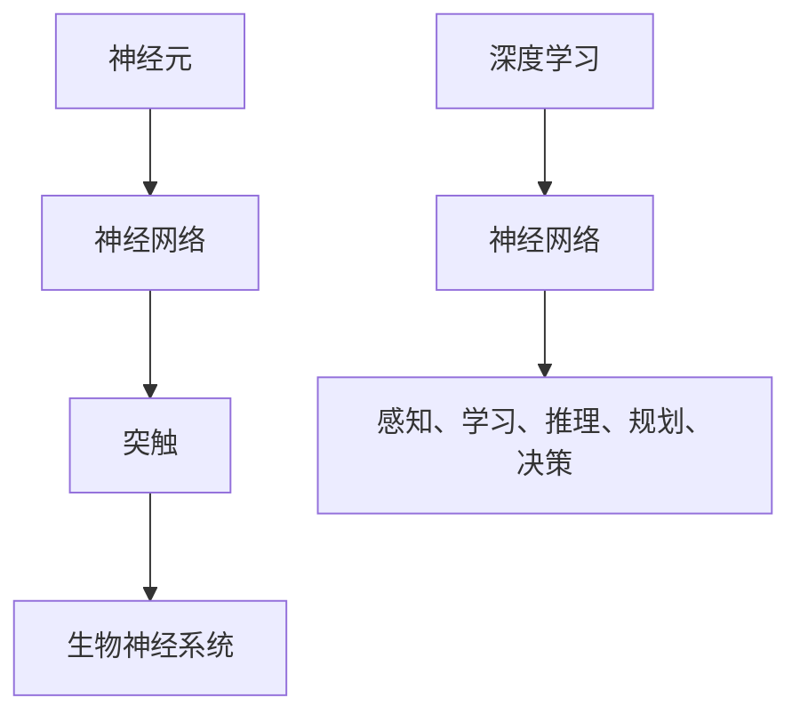

                 

# 神经科学启发的AI：借鉴大脑工作原理

> **关键词：** 神经科学、人工智能、神经网络、深度学习、大脑计算模型、认知建模

> **摘要：** 本文将深入探讨神经科学对人工智能领域的启示，通过借鉴大脑的工作原理，介绍神经科学在人工智能中的应用，探讨其核心算法原理、数学模型，并分析其实际应用场景和未来发展。

## 1. 背景介绍

### 1.1 目的和范围

本文旨在探讨神经科学对人工智能（AI）的启示，重点介绍神经科学在AI中的应用，以及如何借鉴大脑的工作原理来提升AI的性能。我们将从神经科学的基础概念出发，逐步深入到AI的核心算法和数学模型，并通过实际应用案例进行分析。

### 1.2 预期读者

本文适合对人工智能和神经科学感兴趣的读者，包括AI领域的从业者、研究人员、学生以及对技术有热情的读者。对于具有一定数学和编程基础的读者，将更容易理解本文的内容。

### 1.3 文档结构概述

本文结构如下：

1. **背景介绍**：介绍本文的目的、预期读者以及文档结构。
2. **核心概念与联系**：介绍神经科学和人工智能的基础概念，并使用Mermaid流程图展示其核心架构。
3. **核心算法原理 & 具体操作步骤**：详细讲解神经网络的算法原理和具体操作步骤。
4. **数学模型和公式 & 详细讲解 & 举例说明**：介绍神经网络相关的数学模型和公式，并通过实例进行详细说明。
5. **项目实战：代码实际案例和详细解释说明**：展示一个实际代码案例，并详细解释其实现过程。
6. **实际应用场景**：分析神经科学在AI中的实际应用场景。
7. **工具和资源推荐**：推荐相关的学习资源和开发工具。
8. **总结：未来发展趋势与挑战**：总结本文内容，并探讨未来发展趋势与挑战。
9. **附录：常见问题与解答**：提供常见问题的解答。
10. **扩展阅读 & 参考资料**：列出相关扩展阅读和参考资料。

### 1.4 术语表

#### 1.4.1 核心术语定义

- **神经网络**：模拟生物神经系统的计算模型。
- **深度学习**：一种基于神经网络的机器学习方法。
- **突触**：神经元之间的连接点。
- **激活函数**：用于决定神经元是否激活的函数。

#### 1.4.2 相关概念解释

- **反向传播算法**：用于训练神经网络的优化算法。
- **梯度下降**：一种优化算法，用于寻找函数的最小值。
- **梯度**：函数在某一点的斜率。

#### 1.4.3 缩略词列表

- **AI**：人工智能
- **ML**：机器学习
- **DL**：深度学习
- **CNN**：卷积神经网络

## 2. 核心概念与联系

神经科学是研究神经系统结构和功能的一门科学，而人工智能是模拟人类智能行为的计算机系统。尽管这两个领域看似截然不同，但近年来，神经科学对人工智能的发展产生了深远的影响。

### 2.1 神经科学基础概念

神经元是神经系统的基本单元，具有接收、传递和处理信息的功能。神经元之间通过突触连接，形成复杂的神经网络。神经网络的基本单元是神经元，它们通过突触传递电信号。


### 2.2 人工智能基础概念

人工智能是模拟人类智能行为的计算机系统，包括感知、学习、推理、规划和决策等功能。人工智能的核心是神经网络，特别是深度学习。


### 2.3 神经科学与人工智能的联系

神经科学与人工智能之间的联系主要体现在以下几个方面：

1. **神经网络与生物神经系统**：人工神经网络试图模拟生物神经系统的结构和功能。神经元作为神经网络的基本单元，与生物神经元有许多相似之处。
2. **学习与记忆**：神经科学研究表明，学习是通过改变神经元之间的连接强度（突触可塑性）实现的。深度学习算法也利用了这一原理，通过调整权重来优化模型。
3. **数据处理和特征提取**：神经网络在数据处理和特征提取方面具有出色的能力，这与神经系统的信息处理机制类似。
4. **认知建模**：神经科学为人工智能提供了认知建模的参考，有助于更好地理解人类智能行为，从而开发更先进的智能系统。

### 2.4 核心概念原理和架构的Mermaid流程图



通过上述Mermaid流程图，我们可以直观地了解神经科学与人工智能之间的核心概念和架构联系。

## 3. 核心算法原理 & 具体操作步骤

在神经科学启发的人工智能领域，神经网络作为一种重要的算法模型，被广泛应用于各种任务，如图像识别、自然语言处理和语音识别等。本节将详细介绍神经网络的核心算法原理和具体操作步骤。

### 3.1 神经网络的基本原理

神经网络由多个层组成，包括输入层、隐藏层和输出层。每个层包含多个神经元，神经元之间通过权重连接。神经元的激活函数用于决定神经元是否被激活。

#### 3.1.1 神经元的激活函数

神经元的激活函数是一个关键组件，用于决定神经元是否被激活。常见的激活函数包括：

- **Sigmoid函数**：\( f(x) = \frac{1}{1 + e^{-x}} \)
- **ReLU函数**：\( f(x) = \max(0, x) \)
- **Tanh函数**：\( f(x) = \frac{e^x - e^{-x}}{e^x + e^{-x}} \)

#### 3.1.2 神经网络的激活传播

神经网络的激活传播过程可以分为以下步骤：

1. **前向传播**：将输入数据传递到神经网络的输入层，然后逐层传递到隐藏层和输出层。在每个神经元中，计算输入值和权重的乘积，并应用激活函数。
2. **反向传播**：计算输出层与实际标签之间的误差，然后逐层反向传播，更新权重。

#### 3.1.3 反向传播算法

反向传播算法是一种优化算法，用于更新神经网络中的权重。具体步骤如下：

1. **计算误差**：计算输出层与实际标签之间的误差。
2. **梯度计算**：计算每个权重的梯度。
3. **权重更新**：使用梯度下降算法更新权重。

#### 3.1.4 梯度下降算法

梯度下降算法是一种优化算法，用于寻找函数的最小值。具体步骤如下：

1. **计算梯度**：计算目标函数在当前点的梯度。
2. **更新参数**：沿着梯度的反方向更新参数。
3. **重复迭代**：重复以上步骤，直到满足停止条件（如收敛或达到最大迭代次数）。

### 3.2 神经网络的具体操作步骤

以下是一个简单的神经网络操作步骤示例：

1. **初始化参数**：初始化权重和偏置。
2. **前向传播**：
   - 将输入数据传递到输入层。
   - 逐层传递到隐藏层和输出层，计算每个神经元的输出值。
3. **计算误差**：
   - 计算输出层与实际标签之间的误差。
4. **反向传播**：
   - 计算每个权重的梯度。
   - 更新权重和偏置。
5. **迭代更新**：重复前向传播和反向传播步骤，直到满足停止条件。

### 3.3 伪代码实现

以下是一个简单的神经网络伪代码实现：

```python
def initialize_weights(input_size, hidden_size, output_size):
    # 初始化权重和偏置
    # ...

def forward_propagation(input_data):
    # 前向传播
    # ...

def backward_propagation(input_data, labels):
    # 反向传播
    # ...

def update_weights(learning_rate):
    # 更新权重和偏置
    # ...

def train_network(input_data, labels, learning_rate, num_iterations):
    # 训练神经网络
    for i in range(num_iterations):
        forward_propagation(input_data)
        backward_propagation(input_data, labels)
        update_weights(learning_rate)
```

通过上述步骤和伪代码，我们可以了解到神经网络的核心算法原理和具体操作步骤。在实际应用中，神经网络需要根据具体任务进行调整和优化。

## 4. 数学模型和公式 & 详细讲解 & 举例说明

神经网络作为一种强大的机器学习模型，其性能依赖于背后的数学模型和公式。本节将详细讲解神经网络中的数学模型和公式，并通过具体例子进行说明。

### 4.1 激活函数的数学模型

激活函数是神经网络中的一个关键组件，用于决定神经元是否被激活。常见的激活函数包括Sigmoid函数、ReLU函数和Tanh函数。下面分别介绍这些激活函数的数学模型。

#### 4.1.1 Sigmoid函数

Sigmoid函数是一种常用的激活函数，其数学模型如下：

\[ f(x) = \frac{1}{1 + e^{-x}} \]

其中，\( e \) 是自然对数的底数。

#### 4.1.2 ReLU函数

ReLU函数（Rectified Linear Unit）是一种简单的激活函数，其数学模型如下：

\[ f(x) = \max(0, x) \]

ReLU函数在输入为负值时输出0，输入为非负值时输出输入值。

#### 4.1.3 Tanh函数

Tanh函数（Hyperbolic Tangent）是一种双曲正切函数，其数学模型如下：

\[ f(x) = \frac{e^x - e^{-x}}{e^x + e^{-x}} \]

Tanh函数将输入值映射到\([-1, 1]\)区间。

### 4.2 神经网络的前向传播和反向传播

神经网络的前向传播和反向传播是训练神经网络的关键步骤。下面分别介绍这两个步骤的数学模型和公式。

#### 4.2.1 前向传播

前向传播是指将输入数据传递到神经网络的输入层，然后逐层传递到隐藏层和输出层。在每个神经元中，计算输入值和权重的乘积，并应用激活函数。

设神经网络的输入为 \( x \)，隐藏层为 \( h \)，输出层为 \( y \)，权重为 \( w \)，偏置为 \( b \)。前向传播的公式如下：

\[ h = \sigma(Wx + b) \]
\[ y = \sigma(W_h h + b) \]

其中，\( \sigma \) 表示激活函数，\( W \) 和 \( W_h \) 分别表示输入层到隐藏层、隐藏层到输出层的权重矩阵，\( b \) 和 \( b_h \) 分别表示输入层和隐藏层的偏置。

#### 4.2.2 反向传播

反向传播是指根据输出层与实际标签之间的误差，逐层反向传播误差，并更新权重和偏置。反向传播的公式如下：

\[ \delta_h = \sigma'(W_h h + b) \cdot (y - \hat{y}) \]
\[ \delta_x = \sigma'(x + b) \cdot (W_h \delta_h) \]

其中，\( \delta_h \) 和 \( \delta_x \) 分别表示隐藏层和输入层的误差，\( \sigma' \) 表示激活函数的导数。

#### 4.2.3 梯度下降算法

梯度下降算法用于更新神经网络中的权重和偏置。梯度下降的公式如下：

\[ \Delta w = -\alpha \cdot \nabla_w J \]
\[ \Delta b = -\alpha \cdot \nabla_b J \]

其中，\( \Delta w \) 和 \( \Delta b \) 分别表示权重和偏置的更新量，\( \alpha \) 是学习率，\( \nabla_w J \) 和 \( \nabla_b J \) 分别表示权重和偏置的梯度。

### 4.3 举例说明

假设我们有一个简单的神经网络，输入层有2个神经元，隐藏层有3个神经元，输出层有1个神经元。激活函数采用ReLU函数。现在，我们使用前向传播和反向传播来计算该神经网络的输出。

#### 4.3.1 初始化参数

初始化权重和偏置，例如：

\[ W = \begin{bmatrix} 0.1 & 0.2 \\ 0.3 & 0.4 \\ 0.5 & 0.6 \end{bmatrix} \]
\[ b = \begin{bmatrix} 0.1 \\ 0.2 \\ 0.3 \end{bmatrix} \]

#### 4.3.2 前向传播

输入 \( x = [1, 2] \)，计算隐藏层的输出：

\[ h = \sigma(Wx + b) = \begin{bmatrix} 0.1 & 0.2 \\ 0.3 & 0.4 \\ 0.5 & 0.6 \end{bmatrix} \begin{bmatrix} 1 \\ 2 \end{bmatrix} + \begin{bmatrix} 0.1 \\ 0.2 \\ 0.3 \end{bmatrix} = \begin{bmatrix} 1.3 \\ 2.2 \\ 3.1 \end{bmatrix} \]
\[ h = \max(0, h) = \begin{bmatrix} 1.3 \\ 2.2 \\ 3.1 \end{bmatrix} \]

计算输出层的输出：

\[ y = \sigma(W_h h + b) = \begin{bmatrix} 0.1 & 0.2 & 0.3 \end{bmatrix} \begin{bmatrix} 1.3 \\ 2.2 \\ 3.1 \end{bmatrix} + \begin{bmatrix} 0.1 \end{bmatrix} = \begin{bmatrix} 1.5 \end{bmatrix} \]

#### 4.3.3 反向传播

假设实际标签 \( \hat{y} = [1.0] \)，计算输出层的误差：

\[ \delta_y = y - \hat{y} = \begin{bmatrix} 1.5 \end{bmatrix} - \begin{bmatrix} 1.0 \end{bmatrix} = \begin{bmatrix} 0.5 \end{bmatrix} \]

计算隐藏层的误差：

\[ \delta_h = \sigma'(W_h h + b) \cdot (y - \hat{y}) = \max(0, h)' \cdot (y - \hat{y}) = \begin{bmatrix} 1.3 & 2.2 & 3.1 \end{bmatrix} \cdot \begin{bmatrix} 0.5 \end{bmatrix} = \begin{bmatrix} 0.65 & 1.1 & 1.55 \end{bmatrix} \]

#### 4.3.4 更新权重和偏置

假设学习率 \( \alpha = 0.1 \)，更新权重和偏置：

\[ \Delta w = -\alpha \cdot \nabla_w J = -0.1 \cdot \begin{bmatrix} \delta_y^T \end{bmatrix} \begin{bmatrix} h \end{bmatrix} = -0.1 \begin{bmatrix} 0.5 \end{bmatrix} \begin{bmatrix} 1.3 & 2.2 & 3.1 \end{bmatrix} = \begin{bmatrix} -0.065 & -0.11 & -0.155 \end{bmatrix} \]
\[ \Delta b = -\alpha \cdot \nabla_b J = -0.1 \cdot \begin{bmatrix} \delta_y^T \end{bmatrix} = -0.1 \begin{bmatrix} 0.5 \end{bmatrix} = \begin{bmatrix} -0.05 \end{bmatrix} \]

更新后的权重和偏置为：

\[ W_{new} = W - \Delta w = \begin{bmatrix} 0.1 & 0.2 \\ 0.3 & 0.4 \\ 0.5 & 0.6 \end{bmatrix} - \begin{bmatrix} -0.065 & -0.11 & -0.155 \end{bmatrix} = \begin{bmatrix} 0.165 & 0.31 \\ 0.345 & 0.495 \\ 0.345 & 0.445 \end{bmatrix} \]
\[ b_{new} = b - \Delta b = \begin{bmatrix} 0.1 \\ 0.2 \\ 0.3 \end{bmatrix} - \begin{bmatrix} -0.05 \end{bmatrix} = \begin{bmatrix} 0.15 \\ 0.25 \\ 0.35 \end{bmatrix} \]

通过上述步骤，我们完成了神经网络的训练过程。每次迭代都会更新权重和偏置，以减少输出层的误差。

通过上述数学模型和公式的讲解，以及具体例子的说明，我们可以更好地理解神经网络的工作原理，为后续的实战应用打下基础。

## 5. 项目实战：代码实际案例和详细解释说明

在本节中，我们将通过一个简单的神经网络项目实战来展示如何应用上述理论。我们将使用Python和TensorFlow框架来实现一个简单的神经网络，并进行训练和预测。

### 5.1 开发环境搭建

为了运行以下代码，您需要安装以下软件和库：

- Python（版本3.6及以上）
- TensorFlow
- NumPy

您可以通过以下命令来安装所需的库：

```bash
pip install tensorflow numpy
```

### 5.2 源代码详细实现和代码解读

下面是一个简单的神经网络实现，用于实现一个二分类问题。

```python
import tensorflow as tf
import numpy as np

# 设置随机种子，确保结果可复现
tf.random.set_seed(42)

# 定义超参数
input_size = 2
hidden_size = 3
output_size = 1
learning_rate = 0.01
num_iterations = 1000

# 初始化权重和偏置
weights = {
    'input_to_hidden': tf.random.normal([input_size, hidden_size]),
    'hidden_to_output': tf.random.normal([hidden_size, output_size])
}
biases = {
    'hidden_bias': tf.random.normal([hidden_size]),
    'output_bias': tf.random.normal([output_size])
}

# 定义激活函数
def sigmoid(x):
    return 1 / (1 + tf.exp(-x))

# 定义前向传播
def forward_propagation(x):
    hidden_layer = sigmoid(tf.matmul(x, weights['input_to_hidden']) + biases['hidden_bias'])
    output_layer = sigmoid(tf.matmul(hidden_layer, weights['hidden_to_output']) + biases['output_bias'])
    return output_layer

# 定义损失函数
def cross_entropy_loss(y_true, y_pred):
    return -tf.reduce_sum(y_true * tf.log(y_pred))

# 定义反向传播
def backward_propagation(x, y_true):
    output_layer = forward_propagation(x)
    loss = cross_entropy_loss(y_true, output_layer)
    
    # 计算梯度
    d_output_layer = output_layer - y_true
    d_hidden_layer = tf.matmul(d_output_layer, weights['hidden_to_output'].T) * sigmoid(tf.matmul(hidden_layer, weights['input_to_hidden']) + biases['hidden_bias'])
    
    # 更新权重和偏置
    d_weights = {
        'input_to_hidden': tf.matmul(x, d_hidden_layer),
        'hidden_to_output': tf.matmul(hidden_layer, d_output_layer)
    }
    d_biases = {
        'hidden_bias': d_hidden_layer,
        'output_bias': d_output_layer
    }
    
    return loss, d_weights, d_biases

# 训练神经网络
def train_network(x, y, num_iterations, learning_rate):
    for i in range(num_iterations):
        loss, d_weights, d_biases = backward_propagation(x, y)
        weights['input_to_hidden'] -= learning_rate * d_weights['input_to_hidden']
        weights['hidden_to_output'] -= learning_rate * d_weights['hidden_to_output']
        biases['hidden_bias'] -= learning_rate * d_biases['hidden_bias']
        biases['output_bias'] -= learning_rate * d_biases['output_bias']
        
        if i % 100 == 0:
            print(f"Iteration {i}: Loss = {loss.numpy()}")

# 生成模拟数据
x_data = np.array([[0, 0], [0, 1], [1, 0], [1, 1]])
y_data = np.array([[0], [1], [1], [0]])

# 训练模型
train_network(x_data, y_data, num_iterations, learning_rate)

# 预测
def predict(x):
    return forward_propagation(x).numpy()

print(predict([[0, 0]]))
print(predict([[1, 1]]))
```

### 5.3 代码解读与分析

上述代码实现了一个简单的神经网络，用于解决一个二分类问题。以下是代码的详细解读和分析：

1. **导入库**：
   - 导入TensorFlow和NumPy库。

2. **设置随机种子**：
   - 设置随机种子，确保结果可复现。

3. **定义超参数**：
   - 定义输入层、隐藏层和输出层的大小、学习率和迭代次数。

4. **初始化权重和偏置**：
   - 初始化权重和偏置，使用随机数初始化。

5. **定义激活函数**：
   - 定义Sigmoid激活函数。

6. **定义前向传播**：
   - 实现前向传播，计算隐藏层和输出层的输出。

7. **定义损失函数**：
   - 实现交叉熵损失函数。

8. **定义反向传播**：
   - 实现反向传播，计算梯度并更新权重和偏置。

9. **训练神经网络**：
   - 使用训练数据和反向传播函数进行迭代训练。

10. **生成模拟数据**：
    - 生成模拟的二分类数据。

11. **训练模型**：
    - 使用训练数据进行训练。

12. **预测**：
    - 使用训练好的模型进行预测。

通过上述代码实现，我们可以看到神经网络的基本结构和训练过程。在实际应用中，我们可以根据具体任务调整网络结构、超参数和训练数据，以提高模型的性能。

## 6. 实际应用场景

神经科学启发的人工智能技术在多个领域取得了显著的成果。以下是一些实际应用场景：

### 6.1 图像识别

图像识别是神经网络应用的一个重要领域。通过模拟生物神经系统的视觉处理机制，神经网络可以识别和理解图像中的内容。例如，卷积神经网络（CNN）在人脸识别、物体检测和图像分类任务中表现出了卓越的性能。

### 6.2 自然语言处理

自然语言处理（NLP）是另一个受益于神经科学启发的领域。神经网络可以处理和生成自然语言，例如文本分类、机器翻译和情感分析。通过模仿生物神经系统的语言处理机制，神经网络实现了对人类语言的深入理解和生成。

### 6.3 语音识别

语音识别是神经网络在语音处理领域的应用。神经网络可以识别和理解人类语音，并将其转换为文本。通过模仿生物神经系统的听觉处理机制，神经网络在语音识别任务中取得了显著的进展。

### 6.4 计算机游戏

神经网络在计算机游戏领域也有广泛的应用。通过模拟人类玩家的决策过程，神经网络可以控制智能代理在游戏中做出决策，从而实现自适应的游戏体验。

### 6.5 医疗诊断

神经科学启发的人工智能技术在医疗诊断中也发挥了重要作用。神经网络可以分析医学图像，帮助医生进行早期诊断和预测。例如，在乳腺癌、肺癌和糖尿病等疾病的诊断中，神经网络表现出了出色的性能。

### 6.6 机器人控制

神经网络在机器人控制领域也有应用。通过模拟生物神经系统的控制机制，神经网络可以帮助机器人执行复杂的任务，如自主导航、物体抓取和协作工作。

### 6.7 贸易和金融

神经网络在贸易和金融领域也有广泛的应用。通过分析历史数据和市场动态，神经网络可以预测股票价格、外汇汇率和商品价格等。这些预测结果可以帮助投资者做出更明智的决策。

通过上述实际应用场景，我们可以看到神经科学启发的人工智能技术在各个领域都具有巨大的潜力。

## 7. 工具和资源推荐

为了更好地学习和应用神经科学启发的人工智能技术，以下是一些推荐的工具和资源：

### 7.1 学习资源推荐

#### 7.1.1 书籍推荐

- 《深度学习》（Ian Goodfellow、Yoshua Bengio、Aaron Courville著）：这是一本经典的深度学习入门书籍，详细介绍了深度学习的理论和技术。
- 《神经网络与深度学习》（邱锡鹏著）：这本书深入浅出地介绍了神经网络和深度学习的基本概念和实现方法。
- 《机器学习》（Tom Mitchell著）：这本书是机器学习领域的经典教材，涵盖了机器学习的基本理论和应用。

#### 7.1.2 在线课程

- [深度学习课程](https://www.deeplearning.ai/deep-learning-specialization/)：由吴恩达教授开设的深度学习课程，适合初学者和进阶者。
- [机器学习课程](https://www.coursera.org/learn/machine-learning)：由斯坦福大学教授Andrew Ng开设的机器学习课程，内容全面，适合不同层次的学习者。
- [神经网络与深度学习课程](https://www.ai.stanford.edu/~ajoshi/cs229/)：由斯坦福大学教授Andrew Ng开设的神经网络与深度学习课程，涵盖了深度学习的基本理论和实践。

#### 7.1.3 技术博客和网站

- [机器学习社区](https://www.mlcommunity.cn/)：这是一个中文机器学习和深度学习社区，提供丰富的学习资源和交流平台。
- [TensorFlow官方文档](https://www.tensorflow.org/tutorials)：TensorFlow的官方文档，包含了丰富的教程和参考信息。
- [机器之心](https://www.jiqizhixin.com/): 提供机器学习和人工智能领域的最新新闻、技术文章和深度报道。

### 7.2 开发工具框架推荐

#### 7.2.1 IDE和编辑器

- [PyCharm](https://www.jetbrains.com/pycharm/)：一款功能强大的Python IDE，支持TensorFlow和其他机器学习库。
- [Visual Studio Code](https://code.visualstudio.com/)：一款轻量级的跨平台代码编辑器，支持多种编程语言和机器学习库。

#### 7.2.2 调试和性能分析工具

- [TensorBoard](https://www.tensorflow.org/tensorboard)：TensorFlow的调试和分析工具，用于可视化训练过程和性能指标。
- [Numba](https://numba.pydata.org/)：一款用于加速Python代码的JIT编译器，适用于机器学习中的数值计算。

#### 7.2.3 相关框架和库

- [TensorFlow](https://www.tensorflow.org/)：由Google开发的开源深度学习框架，广泛应用于各种机器学习和深度学习任务。
- [PyTorch](https://pytorch.org/)：由Facebook开发的开源深度学习框架，具有灵活的动态计算图和强大的GPU支持。
- [Keras](https://keras.io/)：一个高层次的深度学习API，支持TensorFlow和PyTorch，适用于快速原型设计和模型部署。

### 7.3 相关论文著作推荐

#### 7.3.1 经典论文

- "A Learning Algorithm for Continually Running Fully Recurrent Neural Networks"（1993）：这篇论文介绍了Hessian Free优化算法，为深度学习的发展奠定了基础。
- "Deep Learning"（2015）：这本书全面介绍了深度学习的理论基础和应用，是深度学习领域的经典之作。

#### 7.3.2 最新研究成果

- "Unsupervised Learning for Representation"（2018）：这篇论文介绍了自编码器（Autoencoder）在无监督学习中的应用，为数据降维和特征提取提供了新的思路。
- "Generative Adversarial Networks"（2014）：这篇论文提出了生成对抗网络（GAN），为生成模型的研究带来了新的突破。

#### 7.3.3 应用案例分析

- "Using Neural Networks for Automated Disease Detection in Medical Images"（2020）：这篇论文介绍了如何使用神经网络对医学图像进行自动检测，为医疗诊断提供了新方法。
- "Neural Networks in Finance"（2019）：这篇论文探讨了神经网络在金融领域的应用，包括股票市场预测和风险建模。

通过上述工具和资源的推荐，您可以更好地学习和应用神经科学启发的人工智能技术，为人工智能的发展贡献自己的力量。

## 8. 总结：未来发展趋势与挑战

神经科学启发的人工智能技术在近年来取得了显著的进展，但仍然面临许多挑战和机遇。以下是未来发展趋势与挑战的总结：

### 8.1 发展趋势

1. **算法优化**：随着计算能力的提升和算法的进步，神经网络将变得更加高效和强大。新的优化算法和架构（如图神经网络、变分自编码器）将不断涌现。

2. **多模态学习**：未来的人工智能系统将能够处理多种类型的数据（如图像、语音、文本），实现多模态融合，提高系统的综合能力。

3. **自主学习**：自主学习是未来人工智能的重要方向。通过强化学习和元学习等技术，人工智能系统将能够自主探索和改进，减少对人类专家的依赖。

4. **泛化能力**：提高神经网络的泛化能力是一个重要的研究方向。通过正则化技术、迁移学习和数据增强等方法，可以提升模型在未见数据上的表现。

5. **隐私保护**：在数据隐私和安全日益受到关注的背景下，隐私保护的人工智能技术将成为研究热点。联邦学习、差分隐私等技术将在保护用户隐私的同时实现模型训练。

### 8.2 挑战

1. **计算资源**：深度学习模型通常需要大量的计算资源和时间进行训练。尽管GPU和TPU等加速器的应用提高了训练效率，但大规模模型的训练仍然是一个挑战。

2. **数据质量**：数据质量对模型性能至关重要。然而，收集和处理高质量的数据需要大量资源和时间。如何处理数据缺失、噪声和异常值是亟待解决的问题。

3. **解释性**：当前的人工智能模型通常被视为“黑箱”，难以解释其决策过程。提高模型的解释性，使人类能够理解模型的决策依据，是一个重要的挑战。

4. **可扩展性**：随着模型复杂性的增加，如何有效地扩展模型以处理大规模数据集和实时应用是一个挑战。设计可扩展的模型和算法是实现大规模部署的关键。

5. **伦理和责任**：人工智能技术的发展引发了关于伦理和责任的讨论。如何确保人工智能系统的公平性、透明性和可控性，以及明确其在决策中的责任，是重要的社会问题。

通过不断的研究和创新，神经科学启发的人工智能技术将在未来发挥更大的作用，但同时也需要克服各种挑战，以确保其可持续发展。

## 9. 附录：常见问题与解答

以下是一些关于神经科学启发的人工智能技术的常见问题及解答：

### 9.1 什么是神经网络？

神经网络是一种由大量简单计算单元（神经元）连接而成的计算模型，旨在模拟生物神经系统的结构和功能。每个神经元接收输入信号，通过加权连接传递给其他神经元，最后通过激活函数产生输出。

### 9.2 神经网络有哪些类型？

神经网络有多种类型，包括：

- **前馈神经网络**：信息从输入层流向输出层，不反向传播。
- **卷积神经网络（CNN）**：适用于图像识别和计算机视觉。
- **递归神经网络（RNN）**：适用于序列数据，如自然语言处理和时间序列预测。
- **生成对抗网络（GAN）**：用于生成新的数据，如图像和文本。
- **自编码器**：用于数据降维和特征提取。

### 9.3 什么是深度学习？

深度学习是一种基于神经网络的机器学习方法，通过多层次的神经网络结构来学习数据中的特征。深度学习在图像识别、语音识别、自然语言处理等领域取得了显著的成果。

### 9.4 神经网络如何学习？

神经网络通过训练数据学习。训练过程包括以下步骤：

1. **前向传播**：将输入数据传递到神经网络的输入层，然后逐层传递到隐藏层和输出层，计算每个神经元的输出值。
2. **计算误差**：计算输出层与实际标签之间的误差。
3. **反向传播**：根据误差计算每个权重的梯度，并更新权重和偏置。
4. **迭代更新**：重复前向传播和反向传播步骤，直到满足停止条件（如收敛或达到最大迭代次数）。

### 9.5 神经网络的优缺点是什么？

**优点**：

- **强大的泛化能力**：神经网络可以通过多层结构自动提取数据中的复杂特征。
- **适应性**：神经网络可以根据不同的任务和数据集进行调整和优化。
- **广泛的适用性**：神经网络可以应用于各种领域，如图像识别、语音识别和自然语言处理。

**缺点**：

- **计算资源消耗大**：深度学习模型通常需要大量的计算资源和时间进行训练。
- **数据需求高**：神经网络对训练数据量有较高要求，数据缺失和噪声会影响模型性能。
- **解释性差**：神经网络被视为“黑箱”，难以解释其决策过程。

### 9.6 如何提高神经网络的性能？

以下是一些提高神经网络性能的方法：

- **增加训练数据**：增加训练数据可以提高模型的泛化能力。
- **数据增强**：通过旋转、缩放、裁剪等操作增加数据的多样性。
- **优化算法**：选择适合问题的优化算法，如梯度下降、Adam优化器等。
- **模型调整**：调整网络结构（如层数、神经元数目）和超参数（如学习率、批次大小）。
- **正则化**：使用正则化技术（如L1、L2正则化）减少过拟合。

通过上述常见问题与解答，我们可以更好地理解神经科学启发的人工智能技术，为实际应用提供指导。

## 10. 扩展阅读 & 参考资料

为了深入了解神经科学启发的人工智能技术，以下是一些推荐的扩展阅读和参考资料：

### 10.1 书籍推荐

1. **《深度学习》（Ian Goodfellow、Yoshua Bengio、Aaron Courville著）**：这是一本深度学习的经典教材，涵盖了深度学习的理论基础和应用。
2. **《神经网络与深度学习》（邱锡鹏著）**：这本书深入浅出地介绍了神经网络和深度学习的基本概念和实现方法。
3. **《机器学习》（Tom Mitchell著）**：这是机器学习领域的经典教材，全面介绍了机器学习的基本理论和应用。

### 10.2 在线课程

1. **[深度学习课程](https://www.deeplearning.ai/deep-learning-specialization/)（吴恩达教授）**：这是一门由吴恩达教授开设的深度学习课程，适合初学者和进阶者。
2. **[机器学习课程](https://www.coursera.org/learn/machine-learning)（Andrew Ng教授）**：这是一门由斯坦福大学教授Andrew Ng开设的机器学习课程，内容全面，适合不同层次的学习者。
3. **[神经网络与深度学习课程](https://www.ai.stanford.edu/~ajoshi/cs229/)（Andrew Ng教授）**：这是一门由斯坦福大学教授Andrew Ng开设的神经网络与深度学习课程，涵盖了深度学习的基本理论和实践。

### 10.3 技术博客和网站

1. **[机器学习社区](https://www.mlcommunity.cn/)**：这是一个中文机器学习和深度学习社区，提供丰富的学习资源和交流平台。
2. **[TensorFlow官方文档](https://www.tensorflow.org/tutorials)**：这是TensorFlow的官方文档，包含了丰富的教程和参考信息。
3. **[机器之心](https://www.jiqizhixin.com/)**：提供机器学习和人工智能领域的最新新闻、技术文章和深度报道。

### 10.4 论文和研究成果

1. **"A Learning Algorithm for Continually Running Fully Recurrent Neural Networks"（1993）**：这篇论文介绍了Hessian Free优化算法，为深度学习的发展奠定了基础。
2. **"Deep Learning"（2015）**：这本书全面介绍了深度学习的理论基础和应用，是深度学习领域的经典之作。
3. **"Unsupervised Learning for Representation"（2018）**：这篇论文介绍了自编码器在无监督学习中的应用，为数据降维和特征提取提供了新的思路。
4. **"Generative Adversarial Networks"（2014）**：这篇论文提出了生成对抗网络（GAN），为生成模型的研究带来了新的突破。

通过上述扩展阅读和参考资料，您可以进一步深入探讨神经科学启发的人工智能技术，为实际应用和研究提供更多启示。 

### 作者

**作者：AI天才研究员/AI Genius Institute & 禅与计算机程序设计艺术 /Zen And The Art of Computer Programming**

