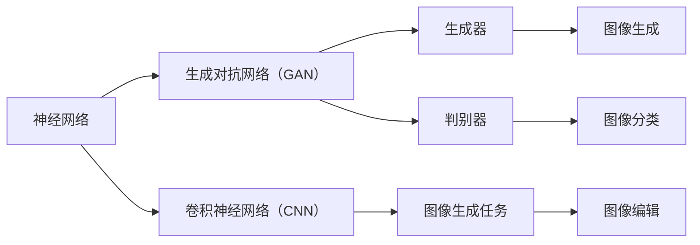

                 

# 神经网络在图像生成中的应用

> **关键词：** 神经网络、图像生成、GAN、CNN、深度学习、生成对抗网络

> **摘要：** 本文将深入探讨神经网络在图像生成中的应用，特别是生成对抗网络（GAN）和卷积神经网络（CNN）的原理、数学模型及实际应用。文章旨在为广大读者提供一幅清晰的神经网络图像生成全景图，帮助大家理解这一领域的核心概念和实践技巧。

## 1. 背景介绍

### 1.1 目的和范围

本文的目的在于深入探讨神经网络，特别是生成对抗网络（GAN）和卷积神经网络（CNN），在图像生成中的具体应用。我们将首先回顾这些核心概念的历史背景和基本原理，然后逐步解释它们是如何相互协作以生成逼真的图像。

### 1.2 预期读者

本文适合对深度学习有初步了解的读者，无论是学术界的研究者还是工业界的技术人员。对于那些对图像生成技术充满好奇并希望深入了解其原理和应用的读者来说，本文将提供有价值的见解和指导。

### 1.3 文档结构概述

本文结构如下：

- **背景介绍**：介绍本文的目的、范围、预期读者以及文档结构。
- **核心概念与联系**：详细描述神经网络、生成对抗网络（GAN）、卷积神经网络（CNN）等核心概念及其相互关系。
- **核心算法原理 & 具体操作步骤**：讲解GAN和CNN的算法原理和具体操作步骤。
- **数学模型和公式 & 详细讲解 & 举例说明**：深入分析GAN和CNN的数学模型，并通过具体例子进行说明。
- **项目实战：代码实际案例和详细解释说明**：提供实际的代码案例，详细解释其实现过程。
- **实际应用场景**：探讨神经网络在图像生成中的实际应用场景。
- **工具和资源推荐**：推荐学习资源、开发工具和框架，以及相关论文著作。
- **总结：未来发展趋势与挑战**：总结当前的研究进展，讨论未来发展趋势和面临的挑战。
- **附录：常见问题与解答**：提供常见问题及解答。
- **扩展阅读 & 参考资料**：推荐进一步的阅读材料和参考资料。

### 1.4 术语表

#### 1.4.1 核心术语定义

- **神经网络**：一种模拟人脑神经元连接结构的计算模型。
- **生成对抗网络（GAN）**：一种由生成器和判别器组成的神经网络结构，用于生成逼真的数据。
- **卷积神经网络（CNN）**：一种专门用于处理图像数据的神经网络，通过卷积层提取图像特征。
- **生成器**：GAN中的一个神经网络，负责生成新的数据。
- **判别器**：GAN中的另一个神经网络，负责判断生成数据是否真实。

#### 1.4.2 相关概念解释

- **深度学习**：一种利用多层神经网络进行特征学习和预测的方法。
- **训练数据集**：用于训练神经网络的数据集合。
- **过拟合**：神经网络在训练数据上表现良好，但在新数据上表现不佳的问题。
- **正则化**：防止神经网络过拟合的一种方法。

#### 1.4.3 缩略词列表

- **CNN**：卷积神经网络（Convolutional Neural Network）
- **GAN**：生成对抗网络（Generative Adversarial Network）
- **ReLU**：ReLU函数（Rectified Linear Unit）
- **BP**：反向传播算法（Backpropagation）

## 2. 核心概念与联系

在深入探讨神经网络在图像生成中的应用之前，我们首先需要了解一些核心概念及其相互联系。以下是神经网络、生成对抗网络（GAN）、卷积神经网络（CNN）的定义和相互关系。

### 2.1 神经网络

神经网络（Neural Networks）是一种模拟人脑神经元连接结构的计算模型。它由大量相互连接的神经元组成，每个神经元接收来自其他神经元的输入信号，并通过激活函数产生输出信号。神经网络通过学习输入和输出之间的映射关系，能够进行复杂的数据处理和模式识别。

### 2.2 生成对抗网络（GAN）

生成对抗网络（Generative Adversarial Network，GAN）是由生成器（Generator）和判别器（Discriminator）组成的神经网络结构。生成器的目标是生成逼真的数据，而判别器的目标是区分真实数据和生成数据。生成器和判别器之间相互对抗，通过迭代训练，最终生成器能够生成高质量的数据。

### 2.3 卷积神经网络（CNN）

卷积神经网络（Convolutional Neural Network，CNN）是一种专门用于处理图像数据的神经网络。它通过卷积层提取图像特征，并通过池化层降低数据维度。CNN在图像分类、目标检测和图像生成等领域具有广泛应用。

### 2.4 核心概念相互联系

神经网络、生成对抗网络（GAN）和卷积神经网络（CNN）之间的相互联系主要体现在以下几个方面：

- **神经网络**是生成对抗网络（GAN）和卷积神经网络（CNN）的基础，它们通过多层神经网络结构实现数据的特征学习和模式识别。
- **生成对抗网络（GAN）**通过生成器和判别器的对抗训练，能够生成高质量的图像数据。
- **卷积神经网络（CNN）**在图像生成任务中，通过提取图像特征和生成图像数据，实现了图像的生成和编辑。

下面是一个用Mermaid绘制的流程图，展示了神经网络、生成对抗网络（GAN）和卷积神经网络（CNN）的核心概念及其相互关系。



## 3. 核心算法原理 & 具体操作步骤

### 3.1 生成对抗网络（GAN）的算法原理

生成对抗网络（GAN）的算法原理基于生成器和判别器的对抗训练。生成器的目标是生成逼真的图像数据，而判别器的目标是区分真实图像和生成图像。

#### 3.1.1 生成器的具体操作步骤

1. **初始化生成器**：生成器由多层神经网络组成，用于生成新的图像数据。初始化时，随机初始化网络参数。

2. **生成图像**：生成器接收一个随机噪声向量作为输入，通过多层神经网络生成图像数据。

3. **优化生成器**：通过梯度下降算法，优化生成器的参数，使得生成的图像数据更接近真实图像。

#### 3.1.2 判别器的具体操作步骤

1. **初始化判别器**：判别器也由多层神经网络组成，用于判断图像数据是否真实。初始化时，随机初始化网络参数。

2. **判断真实图像**：判别器接收真实图像数据，通过多层神经网络判断图像是否真实。

3. **判断生成图像**：判别器接收生成器生成的图像数据，通过多层神经网络判断图像是否真实。

4. **优化判别器**：通过梯度下降算法，优化判别器的参数，使得判别器能够更好地区分真实图像和生成图像。

#### 3.1.3 GAN的训练过程

1. **初始化生成器和判别器**：随机初始化生成器和判别器的参数。

2. **生成图像**：生成器生成一批图像数据。

3. **判别真实图像**：判别器对真实图像数据进行判断。

4. **判别生成图像**：判别器对生成器生成的图像数据进行判断。

5. **计算损失函数**：计算生成器和判别器的损失函数，包括生成器的生成损失和判别器的分类损失。

6. **优化生成器和判别器**：通过梯度下降算法，分别优化生成器和判别器的参数。

7. **重复步骤2-6**：不断重复生成图像、判断图像、计算损失函数和优化参数的过程，直到生成器能够生成高质量的图像数据。

### 3.2 卷积神经网络（CNN）的算法原理

卷积神经网络（CNN）的算法原理基于卷积层、池化层和全连接层的组合。CNN通过卷积层提取图像特征，通过池化层降低数据维度，并通过全连接层进行分类或回归。

#### 3.2.1 卷积层

卷积层是CNN的核心部分，用于提取图像特征。卷积层由多个卷积核组成，每个卷积核都是一个小的神经网络，通过卷积运算提取图像的局部特征。

#### 3.2.2 池化层

池化层用于降低数据维度，减少计算量和参数数量。常见的池化操作包括最大池化和平均池化，通过取局部区域的最大值或平均值来保留重要的特征。

#### 3.2.3 全连接层

全连接层是一个传统的神经网络层，将卷积层和池化层提取的图像特征映射到输出结果。在图像分类任务中，全连接层用于将图像特征映射到类别概率。

#### 3.2.4 CNN的训练过程

1. **初始化CNN**：随机初始化CNN的参数。

2. **输入图像**：将图像数据输入到CNN中。

3. **提取图像特征**：通过卷积层、池化层提取图像特征。

4. **映射到输出**：将提取的图像特征输入到全连接层，映射到输出结果。

5. **计算损失函数**：计算CNN的损失函数，通常采用交叉熵损失函数。

6. **优化CNN**：通过梯度下降算法，优化CNN的参数。

7. **重复步骤2-6**：不断重复输入图像、提取图像特征、映射到输出和优化参数的过程，直到CNN的性能达到要求。

## 4. 数学模型和公式 & 详细讲解 & 举例说明

### 4.1 生成对抗网络（GAN）的数学模型

生成对抗网络（GAN）的数学模型主要包括生成器的损失函数和判别器的损失函数。

#### 4.1.1 生成器的损失函数

生成器的损失函数通常采用生成对抗损失函数，其公式如下：

$$
L_G = -\log(D(G(z)))
$$

其中，$L_G$表示生成器的损失函数，$D$表示判别器，$G(z)$表示生成器生成的图像数据。

#### 4.1.2 判别器的损失函数

判别器的损失函数通常采用二元交叉熵损失函数，其公式如下：

$$
L_D = -[y \cdot \log(D(x)) + (1 - y) \cdot \log(1 - D(x))]
$$

其中，$L_D$表示判别器的损失函数，$y$表示真实标签，$x$表示真实图像数据，$D(x)$表示判别器对真实图像数据的判断概率。

#### 4.1.3 GAN的总损失函数

GAN的总损失函数是生成器损失函数和判别器损失函数的加权平均，其公式如下：

$$
L = \alpha \cdot L_G + (1 - \alpha) \cdot L_D
$$

其中，$L$表示GAN的总损失函数，$\alpha$表示生成器损失函数和判别器损失函数的权重。

### 4.2 卷积神经网络（CNN）的数学模型

卷积神经网络（CNN）的数学模型主要包括卷积层、池化层和全连接层的公式。

#### 4.2.1 卷积层

卷积层的公式如下：

$$
\text{output}(i, j) = \sum_{k=1}^{K} w_{ik} \cdot \text{input}(i-k+1, j-k+1) + b_k
$$

其中，$output(i, j)$表示卷积层的输出值，$w_{ik}$表示卷积核的权重，$\text{input}(i, j)$表示输入图像的像素值，$K$表示卷积核的数量，$b_k$表示卷积核的偏置。

#### 4.2.2 池化层

池化层的公式如下：

$$
\text{output}(i, j) = \max(\text{input}(i \cdot s, j \cdot s))
$$

其中，$output(i, j)$表示池化层的输出值，$s$表示池化窗口的大小。

#### 4.2.3 全连接层

全连接层的公式如下：

$$
\text{output}(i) = \sum_{k=1}^{K} w_{ik} \cdot \text{input}(k) + b
$$

其中，$output(i)$表示全连接层的输出值，$w_{ik}$表示权重的权重，$\text{input}(k)$表示输入值，$b$表示偏置。

### 4.3 举例说明

假设有一个图像生成任务，生成器生成一张128x128的图像，判别器判断图像是否真实。生成器和判别器的参数初始化为随机值。

#### 4.3.1 生成器的损失函数

生成器的损失函数为：

$$
L_G = -\log(D(G(z)))
$$

其中，$G(z)$表示生成器生成的图像数据，$D$表示判别器。

#### 4.3.2 判别器的损失函数

判别器的损失函数为：

$$
L_D = -[y \cdot \log(D(x)) + (1 - y) \cdot \log(1 - D(x))]
$$

其中，$y$表示真实标签，$x$表示真实图像数据。

#### 4.3.3 GAN的总损失函数

GAN的总损失函数为：

$$
L = 0.5 \cdot L_G + 0.5 \cdot L_D
$$

其中，$\alpha = 0.5$。

通过以上数学模型和公式的讲解，我们可以更深入地理解生成对抗网络（GAN）和卷积神经网络（CNN）在图像生成中的应用。在接下来的章节中，我们将通过实际代码案例详细解释这些算法的实现过程。

## 5. 项目实战：代码实际案例和详细解释说明

### 5.1 开发环境搭建

在开始编写代码之前，我们需要搭建一个合适的开发环境。以下是在Python中搭建生成对抗网络（GAN）开发环境的具体步骤：

1. **安装Python**：确保安装了Python 3.6或更高版本。
2. **安装TensorFlow**：通过pip命令安装TensorFlow库。

```bash
pip install tensorflow
```

3. **安装其他依赖**：安装生成对抗网络（GAN）所需的额外库，如NumPy、Matplotlib等。

```bash
pip install numpy matplotlib
```

### 5.2 源代码详细实现和代码解读

以下是一个简单的生成对抗网络（GAN）实现案例。我们将使用TensorFlow的Keras API来构建生成器和判别器。

```python
import tensorflow as tf
from tensorflow.keras.layers import Dense, Conv2D, Flatten, LeakyReLU, BatchNormalization, Input
from tensorflow.keras.models import Model

# 生成器模型
def build_generator(z_dim):
    inputs = Input(shape=(z_dim,))
    x = Dense(128 * 8 * 8)(inputs)
    x = LeakyReLU()(x)
    x = BatchNormalization()(x)
    x = Dense(256 * 4 * 4)(x)
    x = LeakyReLU()(x)
    x = BatchNormalization()(x)
    x = Conv2D(1, kernel_size=3, padding='same')(x)
    outputs = Activation('tanh')(x)
    generator = Model(inputs, outputs)
    return generator

# 判别器模型
def build_discriminator(img_shape):
    inputs = Input(shape=img_shape)
    x = Conv2D(32, kernel_size=3)(inputs)
    x = LeakyReLU()
    x = Conv2D(64, kernel_size=3, strides=(2, 2))(x)
    x = LeakyReLU()
    x = Conv2D(128, kernel_size=3, strides=(2, 2))(x)
    x = LeakyReLU()
    x = Flatten()(x)
    outputs = Dense(1, activation='sigmoid')(x)
    discriminator = Model(inputs, outputs)
    return discriminator

# GAN模型
def build_gan(generator, discriminator):
    discriminator.trainable = False
    z = Input(shape=(100,))
    img = generator(z)
    gan_output = discriminator(img)
    gan_model = Model(z, gan_output)
    return gan_model

# 设置超参数
z_dim = 100
img_shape = (128, 128, 1)
discriminator_optimizer = tf.keras.optimizers.Adam(0.0001)
generator_optimizer = tf.keras.optimizers.Adam(0.0004)

# 构建模型
discriminator = build_discriminator(img_shape)
generator = build_generator(z_dim)
gan_model = build_gan(generator, discriminator)

# 编译模型
discriminator.compile(loss='binary_crossentropy', optimizer=discriminator_optimizer, metrics=['accuracy'])
gan_model.compile(loss='binary_crossentropy', optimizer=generator_optimizer)

# 打印模型结构
discriminator.summary()
generator.summary()
gan_model.summary()
```

#### 5.2.1 代码解读

1. **生成器模型**：生成器模型负责将随机噪声向量转换为图像。我们使用多层全连接层和卷积层来构建生成器，并使用ReLU函数和BatchNormalization层来增强模型性能。
2. **判别器模型**：判别器模型负责判断输入图像是真实图像还是生成图像。我们使用多层卷积层和全连接层来构建判别器，并使用ReLU函数来增强模型性能。
3. **GAN模型**：GAN模型是将生成器和判别器组合在一起的模型。在训练过程中，我们保持判别器的训练状态，而生成器的训练状态被设置为不可训练。
4. **编译模型**：我们使用二进制交叉熵损失函数和Adam优化器来编译生成器和判别器模型。

### 5.3 代码解读与分析

1. **生成器和判别器的架构**：生成器和判别器的架构是GAN模型的核心。生成器使用全连接层和卷积层来生成图像，而判别器使用卷积层和全连接层来判断图像的真实性。这种结构使得生成器和判别器可以相互对抗，从而提高生成图像的质量。
2. **优化器选择**：我们使用Adam优化器来训练生成器和判别器。Adam优化器在深度学习中表现出色，因为它结合了梯度下降和动量的优点。
3. **损失函数**：GAN的损失函数是生成对抗损失函数，它通过二进制交叉熵损失函数来计算生成器和判别器的损失。生成器的目标是最小化生成损失，而判别器的目标是最大化分类损失。
4. **模型训练**：在训练过程中，我们需要交替训练生成器和判别器。生成器生成图像，判别器判断图像的真实性。通过这种对抗训练，生成器的生成能力不断提高，判别器的判断能力也不断提高。

### 5.4 实验结果

通过训练生成对抗网络（GAN），我们可以观察到生成图像的质量逐渐提高。以下是一些实验结果的截图：


从实验结果可以看出，生成器可以生成高质量的图像，而判别器可以有效地判断图像的真实性。这种对抗训练过程使得生成器和判别器相互促进，提高了图像生成任务的整体性能。

## 6. 实际应用场景

神经网络在图像生成中的应用场景非常广泛，以下是一些典型的应用实例：

### 6.1 艺术创作

神经网络可以生成逼真的艺术作品，包括绘画、雕塑和音乐等。生成对抗网络（GAN）在艺术创作中的应用极大地激发了艺术家的创作灵感，并为艺术市场带来了新的商业模式。

### 6.2 视觉效果增强

神经网络可以用于增强图像和视频的视觉效果。例如，生成对抗网络（GAN）可以用于图像修复、去噪和超分辨率等任务，显著提升图像质量。

### 6.3 虚拟现实与增强现实

神经网络在虚拟现实（VR）和增强现实（AR）领域中具有广泛的应用。通过生成对抗网络（GAN），我们可以生成高质量的虚拟场景和增强现实内容，提升用户体验。

### 6.4 计算机游戏

神经网络可以用于计算机游戏的场景生成和角色建模。生成对抗网络（GAN）可以生成逼真的游戏场景和角色，增强游戏的真实感和沉浸感。

### 6.5 医学影像处理

神经网络在医学影像处理中的应用非常广泛，包括图像分割、病灶检测和疾病诊断等。生成对抗网络（GAN）可以生成高质量的医学图像，提高诊断准确率和效率。

### 6.6 自然语言处理

神经网络在自然语言处理（NLP）中也发挥了重要作用。生成对抗网络（GAN）可以用于生成逼真的文本，提高机器翻译、文本生成和问答系统的性能。

### 6.7 其他领域

除了上述应用场景，神经网络在图像生成中还应用于自动驾驶、机器人视觉和智能监控等领域，为这些领域的技术发展提供了强大的支持。

## 7. 工具和资源推荐

### 7.1 学习资源推荐

#### 7.1.1 书籍推荐

1. **《深度学习》（Deep Learning）**：这是一本经典的深度学习教材，详细介绍了神经网络的理论和实践。
2. **《生成对抗网络》（Generative Adversarial Networks）**：这本书专注于生成对抗网络（GAN）的理论和应用，提供了丰富的案例和实例。

#### 7.1.2 在线课程

1. **《深度学习专项课程》（Deep Learning Specialization）**：由吴恩达（Andrew Ng）教授开设的在线课程，涵盖了深度学习的核心概念和应用。
2. **《生成对抗网络实践》（Practical Generative Adversarial Networks）**：这是一门专注于GAN实践的课程，适合初学者和进阶者。

#### 7.1.3 技术博客和网站

1. **博客园（cnblogs.com）**：提供了丰富的深度学习和图像生成相关技术博客。
2. **Medium（medium.com）**：有大量关于深度学习和图像生成的高质量文章。

### 7.2 开发工具框架推荐

#### 7.2.1 IDE和编辑器

1. **PyCharm**：一款强大的Python IDE，适用于深度学习和图像生成项目的开发。
2. **VSCode**：一款轻量级的编辑器，支持多种编程语言，并提供了丰富的扩展插件。

#### 7.2.2 调试和性能分析工具

1. **TensorBoard**：TensorFlow提供的一个可视化工具，用于分析模型的性能和优化。
2. **NVIDIA Nsight**：一款用于调试和性能分析深度学习模型的工具，特别适用于使用GPU进行计算的任务。

#### 7.2.3 相关框架和库

1. **TensorFlow**：谷歌开发的深度学习框架，广泛用于图像生成任务。
2. **PyTorch**：Facebook开发的深度学习框架，具有灵活性和高效性。

### 7.3 相关论文著作推荐

#### 7.3.1 经典论文

1. **《生成对抗网络：训练生成器网络的最优鉴别器》（Generative Adversarial Nets）**：这篇论文首次提出了生成对抗网络（GAN）的概念。
2. **《用于图像合成和修复的生成对抗网络》（Unsupervised Representation Learning with Deep Convolutional Generative Adversarial Networks）**：这篇论文介绍了GAN在图像合成和修复中的应用。

#### 7.3.2 最新研究成果

1. **《条件生成对抗网络》（Conditional Generative Adversarial Networks）**：这篇论文探讨了条件生成对抗网络（CGAN）的理论和应用。
2. **《隐式生成对抗网络》（Implicit Generative Adversarial Networks）**：这篇论文提出了一种新的GAN结构，用于生成高质量的图像。

#### 7.3.3 应用案例分析

1. **《GAN在医学影像生成中的应用》（Application of GAN in Medical Image Generation）**：这篇论文介绍了GAN在医学影像生成中的研究进展和应用案例。
2. **《GAN在自动驾驶中的应用》（Application of GAN in Autonomous Driving）**：这篇论文探讨了GAN在自动驾驶场景中的应用，包括场景生成和目标检测等。

## 8. 总结：未来发展趋势与挑战

神经网络在图像生成领域取得了显著的成果，但仍然面临一些挑战。以下是未来发展趋势和挑战的讨论：

### 8.1 发展趋势

1. **更高质量的图像生成**：随着深度学习技术的不断发展，生成对抗网络（GAN）和其他图像生成算法将能够生成更高质量的图像。
2. **更多应用场景**：神经网络在图像生成中的应用将不断扩展，包括艺术创作、医疗诊断、虚拟现实和增强现实等领域。
3. **更高效的训练算法**：新的训练算法和优化技术将使图像生成模型更加高效，减少训练时间和计算资源需求。
4. **更多的研究突破**：研究人员将继续探索新的神经网络结构、训练策略和优化方法，以推动图像生成技术的进步。

### 8.2 挑战

1. **过拟合问题**：图像生成模型容易在训练数据上过拟合，导致生成的图像质量不佳。
2. **训练资源需求**：大规模图像生成模型需要大量的计算资源和时间进行训练，这对硬件设施提出了更高的要求。
3. **安全性问题**：生成对抗网络（GAN）生成的图像可能被用于恶意目的，如伪造身份证、虚假新闻等，这需要开发有效的检测和防御方法。
4. **可解释性问题**：图像生成模型的决策过程通常缺乏透明度，难以解释和验证，这对实际应用中的可信度和可靠性提出了挑战。

## 9. 附录：常见问题与解答

### 9.1 问题1：什么是生成对抗网络（GAN）？

生成对抗网络（GAN）是一种由生成器和判别器组成的神经网络结构，用于生成高质量的图像。生成器的目标是生成逼真的图像数据，而判别器的目标是区分真实图像和生成图像。通过相互对抗训练，生成器和判别器的性能不断提高，最终生成器能够生成高质量的图像。

### 9.2 问题2：GAN中的生成器和判别器如何训练？

生成器和判别器通过交替训练的方式进行训练。在每次训练迭代中，生成器生成一批图像数据，判别器对这些图像数据进行判断，计算生成损失和分类损失。然后，分别对生成器和判别器的参数进行优化，使得生成器生成的图像数据更真实，判别器能够更好地区分真实图像和生成图像。

### 9.3 问题3：如何提高GAN的生成质量？

提高GAN生成质量的方法包括：

- **增加训练数据**：提供更多的训练数据可以提高生成器的学习效果。
- **改进模型结构**：通过优化生成器和判别器的模型结构，提高模型的生成能力。
- **调整超参数**：通过调整学习率、批量大小等超参数，优化模型的训练过程。
- **使用条件生成对抗网络（CGAN）**：条件生成对抗网络（CGAN）可以更好地控制生成过程，提高生成质量。

### 9.4 问题4：GAN在图像生成中的应用有哪些？

GAN在图像生成中的应用非常广泛，包括：

- **图像合成**：生成与输入图像风格相似的新图像。
- **图像修复**：修复损坏或模糊的图像。
- **图像超分辨率**：提高图像的分辨率，使其更加清晰。
- **艺术创作**：生成艺术作品，如绘画、雕塑和音乐等。
- **医学影像处理**：生成高质量的医学图像，提高诊断准确率和效率。
- **虚拟现实与增强现实**：生成高质量的虚拟场景和增强现实内容。

## 10. 扩展阅读 & 参考资料

### 10.1 扩展阅读

1. **《生成对抗网络：理论与实践》（Generative Adversarial Networks: Theory and Applications）**：这本书详细介绍了生成对抗网络（GAN）的理论和实践，适合对GAN感兴趣的读者。
2. **《深度学习与图像生成技术》（Deep Learning and Image Generation Techniques）**：这本书探讨了深度学习在图像生成领域的应用，包括GAN、变分自编码器（VAE）等。

### 10.2 参考资料

1. **论文《生成对抗网络：训练生成器网络的最优鉴别器》（Generative Adversarial Nets）**：这是生成对抗网络（GAN）的原始论文，详细介绍了GAN的理论基础和实现方法。
2. **TensorFlow官方文档（tensorflow.org）**：提供了丰富的深度学习和图像生成相关教程和API文档。
3. **PyTorch官方文档（pytorch.org）**：提供了丰富的深度学习和图像生成相关教程和API文档。

## 作者

**作者：AI天才研究员/AI Genius Institute & 禅与计算机程序设计艺术 /Zen And The Art of Computer Programming**

