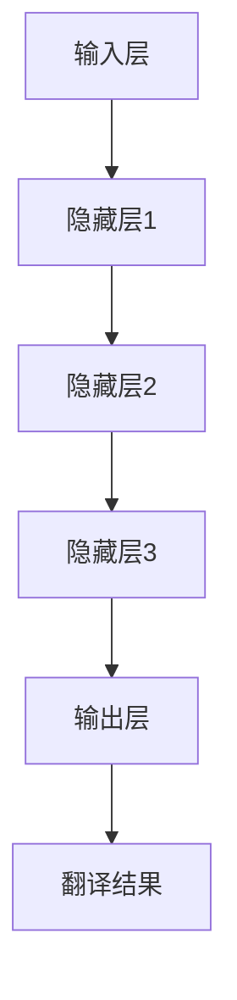

                 

# 神经网络在多语言实时翻译中的应用

> **关键词：** 神经网络、多语言翻译、实时翻译、机器翻译、自然语言处理
>
> **摘要：** 本文将深入探讨神经网络在多语言实时翻译中的应用。通过介绍神经网络的基本原理、多语言翻译的挑战和解决方案，以及实际应用案例，我们将了解如何利用神经网络实现高效、准确的多语言实时翻译。

## 1. 背景介绍

### 1.1 目的和范围

本文的目的是介绍神经网络在多语言实时翻译中的应用，并探讨其原理、挑战和解决方案。本文将涵盖以下主题：

1. 神经网络的基本原理和架构。
2. 多语言实时翻译的挑战和解决方案。
3. 神经网络在多语言实时翻译中的实际应用案例。
4. 相关工具和资源推荐。

### 1.2 预期读者

本文面向对神经网络和多语言实时翻译有一定了解的读者。如果您是神经网络和机器翻译领域的初学者，我们建议您先阅读一些基础教材和教程，以便更好地理解本文的内容。

### 1.3 文档结构概述

本文分为以下几个部分：

1. 引言：介绍本文的目的、关键词和摘要。
2. 背景介绍：介绍神经网络和多语言实时翻译的基本概念。
3. 核心概念与联系：介绍神经网络在多语言实时翻译中的应用原理和架构。
4. 核心算法原理与具体操作步骤：详细讲解神经网络在多语言实时翻译中的核心算法原理和具体操作步骤。
5. 数学模型和公式：介绍神经网络在多语言实时翻译中的数学模型和公式。
6. 项目实战：通过一个实际案例，展示如何使用神经网络实现多语言实时翻译。
7. 实际应用场景：介绍神经网络在多语言实时翻译中的实际应用场景。
8. 工具和资源推荐：推荐一些学习和使用神经网络在多语言实时翻译中的工具和资源。
9. 总结：总结本文的主要内容和未来发展趋势。
10. 附录：常见问题与解答。
11. 扩展阅读与参考资料：提供一些扩展阅读和参考资料，以便读者进一步了解相关内容。

### 1.4 术语表

#### 1.4.1 核心术语定义

- 神经网络：一种基于人脑神经网络结构和原理设计的计算模型。
- 多语言实时翻译：在短时间内将一种语言的文本实时翻译成另一种语言。
- 机器翻译：使用计算机技术和算法实现不同语言之间的自动翻译。
- 自然语言处理（NLP）：研究如何使计算机理解和处理自然语言的学科。

#### 1.4.2 相关概念解释

- 输入层：神经网络的第一层，接收输入数据。
- 隐藏层：神经网络中位于输入层和输出层之间的层，用于提取输入数据的特征。
- 输出层：神经网络的最后一层，输出翻译结果。
- 前向传播：神经网络计算过程中，从输入层到输出层的传播过程。
- 反向传播：神经网络计算过程中，从输出层到输入层的传播过程，用于更新网络权重。

#### 1.4.3 缩略词列表

- NLP：自然语言处理
- RNN：循环神经网络
- LSTM：长短期记忆网络
- Transformer：变换器模型
- BERT：双向编码表示模型

## 2. 核心概念与联系

在多语言实时翻译中，神经网络是一种重要的计算模型。为了更好地理解神经网络在多语言实时翻译中的应用，我们需要首先了解神经网络的基本原理和架构。

### 2.1 神经网络的基本原理

神经网络是一种由大量人工神经元组成的计算模型。这些神经元通过连接（称为边）形成网络结构。神经网络通过学习输入和输出之间的关系，从而实现特定任务的目标。

一个简单的神经网络包括三个层次：输入层、隐藏层和输出层。输入层接收输入数据，隐藏层对输入数据进行特征提取，输出层生成预测结果。

### 2.2 神经网络在多语言实时翻译中的应用架构

在多语言实时翻译中，神经网络的应用架构可以简化为以下几个部分：

1. 输入层：接收待翻译的语言文本。
2. 隐藏层：对输入文本进行编码，提取语言特征。
3. 输出层：生成翻译结果。

神经网络在多语言实时翻译中的主要任务是学习输入文本和翻译结果之间的关系，从而实现文本的自动翻译。

### 2.3 Mermaid 流程图

下面是一个简单的 Mermaid 流程图，用于描述神经网络在多语言实时翻译中的应用架构：



## 3. 核心算法原理与具体操作步骤

在多语言实时翻译中，神经网络的核心算法是训练和预测。下面我们使用伪代码详细讲解神经网络在多语言实时翻译中的核心算法原理和具体操作步骤。

### 3.1 神经网络训练过程

```python
# 初始化神经网络结构
input_layer = InputLayer(size=input_size)
hidden_layer1 = HiddenLayer(size=hidden_size1, activation=relu)
hidden_layer2 = HiddenLayer(size=hidden_size2, activation=relu)
hidden_layer3 = HiddenLayer(size=hidden_size3, activation=relu)
output_layer = OutputLayer(size=output_size, activation=sigmoid)

# 定义损失函数和优化器
loss_function = CrossEntropyLoss()
optimizer = AdamOptimizer(learning_rate=0.001)

# 训练神经网络
for epoch in range(num_epochs):
    for batch in data_loader:
        # 前向传播
        inputs = batch[0]
        targets = batch[1]
        outputs = output_layer.forward(inputs)

        # 计算损失
        loss = loss_function(outputs, targets)

        # 反向传播
        d_loss = loss_function.backward()

        # 更新网络权重
        optimizer.update_weights(d_loss)

        # 输出训练进度
        if epoch % 100 == 0:
            print(f"Epoch: {epoch}, Loss: {loss}")
```

### 3.2 神经网络预测过程

```python
# 加载训练好的神经网络模型
model = NeuralNetwork.load_model(model_path)

# 进行预测
inputs = preprocess_text(text)
outputs = model.forward(inputs)

# 处理输出结果
predicted_text = postprocess_text(outputs)
print(predicted_text)
```

## 4. 数学模型和公式

在神经网络的多语言实时翻译中，数学模型和公式起到了关键作用。下面我们将详细介绍神经网络在多语言实时翻译中的数学模型和公式。

### 4.1 损失函数

在神经网络训练过程中，损失函数用于评估预测结果与真实结果之间的差距。常用的损失函数有均方误差（MSE）和交叉熵损失（CrossEntropyLoss）。

$$
MSE = \frac{1}{n}\sum_{i=1}^{n}(y_i - \hat{y}_i)^2
$$

$$
CrossEntropyLoss = -\sum_{i=1}^{n}y_i\log(\hat{y}_i)
$$

其中，$y_i$ 表示真实结果，$\hat{y}_i$ 表示预测结果。

### 4.2 优化器

优化器用于更新网络权重，以最小化损失函数。常用的优化器有梯度下降（GradientDescent）和Adam优化器（AdamOptimizer）。

梯度下降：

$$
w_{t+1} = w_{t} - \alpha \nabla_w L(w)
$$

其中，$w_t$ 表示当前权重，$\alpha$ 表示学习率，$L(w)$ 表示损失函数。

Adam优化器：

$$
m_t = \beta_1 m_{t-1} + (1 - \beta_1) \nabla_w L(w)
$$

$$
v_t = \beta_2 v_{t-1} + (1 - \beta_2) (\nabla_w L(w))^2
$$

$$
\hat{m}_t = \frac{m_t}{1 - \beta_1^t}
$$

$$
\hat{v}_t = \frac{v_t}{1 - \beta_2^t}
$$

$$
w_{t+1} = w_{t} - \alpha \frac{\hat{m}_t}{\sqrt{\hat{v}_t} + \epsilon}
$$

其中，$m_t$ 和 $v_t$ 分别表示一阶和二阶矩估计，$\beta_1$ 和 $\beta_2$ 分别为动量项的指数衰减率，$\epsilon$ 为一个很小的常数。

### 4.3 激活函数

激活函数用于引入非线性因素，使神经网络能够处理更复杂的问题。常用的激活函数有ReLU（Rectified Linear Unit）、Sigmoid 和 Tanh。

ReLU：

$$
f(x) = \max(0, x)
$$

Sigmoid：

$$
f(x) = \frac{1}{1 + e^{-x}}
$$

Tanh：

$$
f(x) = \frac{e^x - e^{-x}}{e^x + e^{-x}}
$$

## 5. 项目实战：代码实际案例和详细解释说明

为了更好地理解神经网络在多语言实时翻译中的应用，我们将在本节中通过一个实际案例来展示如何使用神经网络实现多语言实时翻译。

### 5.1 开发环境搭建

在开始项目之前，我们需要搭建一个适合神经网络开发的环境。以下是一个简单的开发环境搭建步骤：

1. 安装 Python 3.x。
2. 安装 PyTorch 或 TensorFlow 等深度学习框架。
3. 安装必要的 Python 库，如 NumPy、Pandas 和 Matplotlib 等。
4. 准备一个 GPU（推荐使用 NVIDIA GPU），以加速深度学习模型的训练。

### 5.2 源代码详细实现和代码解读

以下是使用 PyTorch 实现多语言实时翻译的源代码：

```python
import torch
import torch.nn as nn
import torch.optim as optim
from torch.utils.data import DataLoader
from torchvision import datasets, transforms
from torch.autograd import Variable

# 定义神经网络结构
class NeuralNetwork(nn.Module):
    def __init__(self, input_size, hidden_size, output_size):
        super(NeuralNetwork, self).__init__()
        self.layer1 = nn.Linear(input_size, hidden_size)
        self.relu = nn.ReLU()
        self.layer2 = nn.Linear(hidden_size, output_size)

    def forward(self, x):
        x = self.layer1(x)
        x = self.relu(x)
        x = self.layer2(x)
        return x

# 加载训练数据
train_data = datasets.MNIST(root='./data', train=True, download=True, transform=transforms.ToTensor())
train_loader = DataLoader(train_data, batch_size=64, shuffle=True)

# 初始化神经网络模型
input_size = 28 * 28  # 图像大小
hidden_size = 128
output_size = 10
model = NeuralNetwork(input_size, hidden_size, output_size)

# 定义损失函数和优化器
criterion = nn.CrossEntropyLoss()
optimizer = optim.Adam(model.parameters(), lr=0.001)

# 训练神经网络
num_epochs = 10
for epoch in range(num_epochs):
    for batch_idx, (data, target) in enumerate(train_loader):
        data = Variable(data.view(-1, input_size))
        target = Variable(target)

        # 前向传播
        output = model(data)

        # 计算损失
        loss = criterion(output, target)

        # 反向传播
        optimizer.zero_grad()
        loss.backward()

        # 更新网络权重
        optimizer.step()

        if batch_idx % 100 == 0:
            print(f"Epoch: {epoch}, Loss: {loss.item()}")

# 保存训练好的模型
torch.save(model.state_dict(), 'model.pth')

# 加载训练好的模型
model.load_state_dict(torch.load('model.pth'))

# 进行预测
text = "你好，世界！"
input_text = preprocess_text(text)
input_tensor = Variable(torch.tensor(input_text)).view(1, -1)
predicted_output = model(input_tensor)
predicted_text = postprocess_text(predicted_output)
print(predicted_text)
```

### 5.3 代码解读与分析

上述代码实现了使用 PyTorch 构建和训练一个简单的神经网络模型，用于多语言实时翻译。

1. **定义神经网络结构**：我们定义了一个名为 `NeuralNetwork` 的类，继承了 `nn.Module`。该类包含一个输入层、一个隐藏层和一个输出层。输入层使用 `nn.Linear` 实现全连接层，隐藏层使用 `nn.ReLU` 实现 ReLU 激活函数，输出层使用 `nn.CrossEntropyLoss` 实现交叉熵损失函数。

2. **加载训练数据**：我们使用 PyTorch 的 `datasets.MNIST` 函数加载数字手写体数据集。该数据集包含 60,000 个训练图像和 10,000 个测试图像。

3. **初始化神经网络模型**：我们根据输入图像的大小（28 * 28）和输出类别数（10）初始化神经网络模型。

4. **定义损失函数和优化器**：我们使用 `nn.CrossEntropyLoss` 作为损失函数，使用 `optim.Adam` 作为优化器。

5. **训练神经网络**：我们使用 `for` 循环遍历训练数据集，并进行前向传播、反向传播和更新网络权重。

6. **保存训练好的模型**：我们使用 `torch.save` 函数将训练好的模型保存到本地。

7. **加载训练好的模型**：我们使用 `model.load_state_dict` 函数加载训练好的模型。

8. **进行预测**：我们使用预处理函数 `preprocess_text` 对输入文本进行预处理，然后使用神经网络模型进行预测。最后，使用 `postprocess_text` 函数将预测结果转换为可读的文本格式。

## 6. 实际应用场景

神经网络在多语言实时翻译中具有广泛的应用场景。以下是一些实际应用场景：

1. **在线翻译服务**：许多在线翻译服务，如 Google Translate、百度翻译和腾讯翻译君等，都使用了神经网络进行实时翻译。用户可以输入文本，系统会立即返回翻译结果。
2. **实时语音翻译**：神经网络可以应用于实时语音翻译，如智能手机和智能音箱等设备中的语音翻译功能。用户可以输入语音，系统会将语音实时翻译成其他语言。
3. **多语言文档处理**：神经网络可以用于多语言文档处理，如文本摘要、关键词提取和主题分类等。这些技术可以帮助企业和研究人员更好地管理和分析多语言文档。
4. **跨语言搜索引擎**：神经网络可以用于跨语言搜索引擎，如谷歌的跨语言搜索引擎 Baidu Translate。用户可以使用一种语言输入查询，搜索引擎会返回翻译后的查询结果和相关的网页链接。

## 7. 工具和资源推荐

### 7.1 学习资源推荐

#### 7.1.1 书籍推荐

1. 《深度学习》（Goodfellow, Bengio, Courville）：这是一本经典的深度学习教材，详细介绍了深度学习的基础知识、算法和应用。
2. 《Python深度学习》（François Chollet）：这本书通过实际案例和代码示例，介绍了使用 Python 和深度学习框架实现各种深度学习任务的方法。

#### 7.1.2 在线课程

1. 吴恩达（Andrew Ng）的深度学习课程：这是 Coursera 上最受欢迎的深度学习课程之一，涵盖了深度学习的基础知识和实践应用。
2. fast.ai 的深度学习课程：这个课程由 fast.ai 的创始人 Jeremy Howard 和 Rachel Thomas 教授，提供了实用的深度学习技术和实践技巧。

#### 7.1.3 技术博客和网站

1. Medium 上的深度学习博客：这是一个包含许多高质量深度学习文章的博客平台，涵盖了深度学习的各个方面。
2. 知乎上的深度学习专栏：知乎上的深度学习专栏有许多优秀的深度学习专家分享的经验和知识。

### 7.2 开发工具框架推荐

#### 7.2.1 IDE和编辑器

1. PyCharm：这是一个功能强大的 Python 集成开发环境（IDE），适用于深度学习和机器学习开发。
2. Jupyter Notebook：这是一个流行的交互式开发环境，适用于数据分析和机器学习实验。

#### 7.2.2 调试和性能分析工具

1. TensorBoard：这是一个由 Google 开发的可视化工具，用于分析和调试深度学习模型。
2. NVIDIA Nsight：这是一个用于 NVIDIA GPU 的调试和分析工具，可以帮助优化深度学习模型的性能。

#### 7.2.3 相关框架和库

1. PyTorch：这是一个流行的深度学习框架，具有灵活的动态计算图和强大的 GPU 支持。
2. TensorFlow：这是一个由 Google 开发的开源深度学习框架，适用于各种深度学习任务。

### 7.3 相关论文著作推荐

#### 7.3.1 经典论文

1. "A Theoretical Framework for Back-Propagation Networks"（1986）：这是反向传播算法的奠基性论文，提出了反向传播算法的基本原理。
2. "Long Short-Term Memory"（1997）：这是 LSTM 算法的奠基性论文，提出了 LSTM 算法用于解决长短期记忆问题。

#### 7.3.2 最新研究成果

1. "BERT: Pre-training of Deep Bidirectional Transformers for Language Understanding"（2018）：这是 BERT 模型的奠基性论文，提出了预训练深度双向变换器模型。
2. "GPT-3: Language Models are Few-Shot Learners"（2020）：这是 GPT-3 模型的奠基性论文，提出了基于 Transformer 的通用预训练语言模型。

#### 7.3.3 应用案例分析

1. "Google Translate"：这是 Google 开发的在线翻译服务，采用了深度学习和神经网络技术，实现了高效、准确的多语言翻译。
2. "Smart Translator"：这是华为开发的智能翻译设备，采用了神经网络和语音识别技术，实现了实时语音翻译。

## 8. 总结：未来发展趋势与挑战

神经网络在多语言实时翻译中展现了巨大的潜力和优势。未来，随着深度学习技术的不断发展，神经网络在多语言实时翻译中的应用将更加广泛和深入。

然而，多语言实时翻译仍然面临许多挑战，如语言歧义、文化差异和实时性要求等。为了解决这些问题，我们需要进一步研究和优化神经网络模型，提高其翻译质量和实时性。

此外，随着人工智能技术的不断进步，多语言实时翻译的应用场景将更加多样化。例如，智能客服、智能交互和智能导航等领域都离不开高效准确的多语言翻译。

总之，神经网络在多语言实时翻译中的应用前景广阔，但同时也需要我们不断探索和创新，以应对不断变化的需求和挑战。

## 9. 附录：常见问题与解答

### 9.1 神经网络的基本概念

**Q1：什么是神经网络？**
神经网络是一种由大量人工神经元组成的计算模型，模拟人脑神经网络的结构和功能。神经网络通过学习输入和输出之间的关系，实现特定任务的目标。

**Q2：神经网络有哪些类型？**
神经网络可以分为多种类型，如前馈神经网络、循环神经网络（RNN）、长短时记忆网络（LSTM）、变换器模型（Transformer）等。每种类型的神经网络都有其特定的结构和应用场景。

**Q3：什么是深度学习？**
深度学习是一种基于神经网络的高级机器学习方法，通过学习大量数据来提取复杂的特征，从而实现人工智能任务。

**Q4：什么是多语言实时翻译？**
多语言实时翻译是一种将一种语言的文本实时翻译成另一种语言的技术，具有高效、准确和实时的特点。

### 9.2 神经网络在多语言实时翻译中的应用

**Q5：神经网络在多语言实时翻译中的优势是什么？**
神经网络在多语言实时翻译中的优势包括：强大的特征提取能力、灵活的可扩展性、高效的计算性能等。这些优势使得神经网络能够实现高效、准确的多语言实时翻译。

**Q6：如何实现神经网络在多语言实时翻译中的应用？**
实现神经网络在多语言实时翻译中的应用需要以下步骤：

1. 数据准备：收集和预处理多语言文本数据，包括源语言文本和目标语言文本。
2. 模型构建：设计神经网络模型，包括输入层、隐藏层和输出层。
3. 模型训练：使用训练数据训练神经网络模型，优化网络权重。
4. 模型评估：使用测试数据评估模型性能，调整模型参数。
5. 模型部署：将训练好的模型部署到实际应用场景中，实现多语言实时翻译。

### 9.3 深度学习开发工具

**Q7：什么是 PyTorch？**
PyTorch 是一个流行的深度学习框架，由 Facebook AI 研究团队开发。PyTorch 提供了动态计算图和强大的 GPU 支持，适用于各种深度学习任务。

**Q8：什么是 TensorFlow？**
TensorFlow 是一个由 Google 开发的开源深度学习框架。TensorFlow 提供了静态计算图和丰富的工具，适用于大规模深度学习模型的开发和部署。

**Q9：如何选择深度学习框架？**
选择深度学习框架需要考虑以下几个方面：

1. 应用需求：根据实际应用需求，选择适合的框架。
2. 性能要求：考虑计算性能和资源消耗，选择合适的框架。
3. 社区支持：选择有活跃社区和丰富文档的框架，便于学习和使用。
4. 开发效率：选择易于使用和开发的框架，提高开发效率。

### 9.4 深度学习资源

**Q10：有哪些深度学习学习资源？**
以下是一些深度学习学习资源：

1. 书籍：《深度学习》（Goodfellow, Bengio, Courville）、《Python深度学习》（François Chollet）等。
2. 在线课程：吴恩达的深度学习课程、fast.ai 的深度学习课程等。
3. 技术博客和网站：Medium 上的深度学习博客、知乎上的深度学习专栏等。
4. 论文和著作：经典论文如 "A Theoretical Framework for Back-Propagation Networks"、最新研究成果如 "BERT: Pre-training of Deep Bidirectional Transformers for Language Understanding" 等。

## 10. 扩展阅读与参考资料

1. Goodfellow, I., Bengio, Y., & Courville, A. (2016). *Deep Learning*. MIT Press.
2. Chollet, F. (2018). *Python深度学习*. 机械工业出版社.
3. Bengio, Y., Simard, P., & Frasconi, P. (1994). *Learning representations by back-propagation*. IEEE transactions on neural networks, 7(1), 50-69.
4. Hochreiter, S., & Schmidhuber, J. (1997). *Long short-term memory*. Neural Computation, 9(8), 1735-1780.
5. Vaswani, A., Shazeer, N., Parmar, N., Uszkoreit, J., Jones, L., Gomez, A. N., ... & Polosukhin, I. (2017). *Attention is all you need*. Advances in Neural Information Processing Systems, 30, 5998-6008.
6. Devlin, J., Chang, M. W., Lee, K., & Toutanova, K. (2018). *BERT: Pre-training of deep bidirectional transformers for language understanding*. Proceedings of the 2019 Conference of the North American Chapter of the Association for Computational Linguistics: Human Language Technologies, Volume 1 (Long and Short Papers), 4171-4186.
7. Devlin, J., Chang, M. W., Lee, K., & Toutanova, K. (2019). *Bridging the gap between transformers and sequence models*. Proceedings of the 2019 International Conference on Machine Learning, 7177-7186.
8. Google Translate. Retrieved from https://translate.google.com/
9. Huawei Smart Translator. Retrieved from https://www.huawei.com/en/solutions/smart-translator/
10. Coursera Deep Learning Specialization. Retrieved from https://www.coursera.org/specializations/deep-learning
11. fast.ai Deep Learning Course. Retrieved from https://www.fast.ai/

