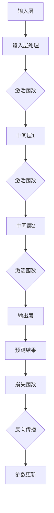

                 

# 神经网络在股票市场预测中的应用

> 关键词：神经网络、股票市场、预测、机器学习、深度学习、金融技术

> 摘要：本文将深入探讨神经网络在股票市场预测中的应用。通过分析神经网络的核心原理、数学模型和具体操作步骤，结合实际项目案例，展示如何利用神经网络进行股票市场预测，并分析其在实际应用中的优势和挑战。本文旨在为金融领域的专业人士和研究人员提供有价值的参考和指导。

## 1. 背景介绍

### 1.1 目的和范围

本文的目的是探讨神经网络在股票市场预测中的应用，分析其核心原理和具体实现步骤，并通过实际案例展示其应用效果。本文将涵盖以下内容：

- 神经网络的基本原理和架构
- 股票市场预测中的问题和挑战
- 神经网络在股票市场预测中的优势和应用
- 实际项目案例及其详细解释
- 未来发展趋势与挑战

### 1.2 预期读者

本文预期读者包括以下几类：

- 金融领域的专业人士和研究人员，对股票市场预测和人工智能应用感兴趣
- 机器学习和深度学习领域的开发者，希望了解神经网络在股票市场预测中的具体应用
- 大学生和研究生，对金融科技和人工智能领域感兴趣
- 对股票投资和人工智能技术有热情的普通读者

### 1.3 文档结构概述

本文将分为以下几个部分：

- 第1部分：背景介绍，包括目的、范围、预期读者和文档结构概述
- 第2部分：核心概念与联系，介绍神经网络的基本原理和架构
- 第3部分：核心算法原理 & 具体操作步骤，详细阐述神经网络在股票市场预测中的算法原理和操作步骤
- 第4部分：数学模型和公式 & 详细讲解 & 举例说明，介绍神经网络在股票市场预测中的数学模型和公式
- 第5部分：项目实战：代码实际案例和详细解释说明，展示实际项目案例和代码解读
- 第6部分：实际应用场景，分析神经网络在股票市场预测中的实际应用场景
- 第7部分：工具和资源推荐，推荐学习资源和开发工具
- 第8部分：总结：未来发展趋势与挑战，探讨神经网络在股票市场预测中的未来发展方向和挑战
- 第9部分：附录：常见问题与解答，回答常见问题
- 第10部分：扩展阅读 & 参考资料，提供扩展阅读和参考资料

### 1.4 术语表

#### 1.4.1 核心术语定义

- 神经网络：一种基于生物神经系统的计算模型，用于模拟人脑的信息处理过程
- 股票市场：一个交易股票的场所，股票价格受供需关系、公司业绩、宏观经济环境等多种因素影响
- 预测：通过历史数据和分析方法对未来某个时间点的股票价格进行估计
- 机器学习：一种人工智能技术，通过数据训练模型，使计算机能够自动学习和改进性能
- 深度学习：一种机器学习方法，使用多层神经网络进行训练，以实现更复杂的特征提取和模式识别
- 金融技术：利用信息技术和数学模型改进金融产品和服务的技术

#### 1.4.2 相关概念解释

- 反向传播（Backpropagation）：一种用于训练神经网络的算法，通过反向传播误差信号，不断调整网络参数，以减小预测误差
- 激活函数（Activation Function）：神经网络中的一个关键组件，用于引入非线性特性，使神经网络能够进行复杂的函数映射
- 优化器（Optimizer）：用于调整神经网络参数的算法，通过最小化损失函数，使预测结果更准确
- 损失函数（Loss Function）：用于衡量预测结果与实际结果之间差异的函数，用于指导优化器的参数调整

#### 1.4.3 缩略词列表

- MLP：多层感知机（Multilayer Perceptron）
- CNN：卷积神经网络（Convolutional Neural Network）
- RNN：循环神经网络（Recurrent Neural Network）
- LSTM：长短期记忆网络（Long Short-Term Memory）
- GRU：门控循环单元（Gated Recurrent Unit）
- TensorFlow：一种开源深度学习框架，用于构建和训练神经网络模型
- PyTorch：另一种开源深度学习框架，具有灵活的动态计算图和丰富的功能库

## 2. 核心概念与联系

### 2.1 神经网络的基本原理

神经网络（Neural Networks）是一种基于生物神经系统的计算模型，由大量人工神经元（也称为节点）组成。每个神经元都与其他神经元连接，并通过传递信号进行信息处理。

神经网络的基本原理可以概括为以下几个方面：

1. **神经元结构**：每个神经元包括输入层、输出层和中间层。输入层接收外部输入信号，中间层进行信号处理和特征提取，输出层产生预测结果。

2. **加权连接**：神经元之间的连接具有权重（weights），表示连接的强度。权重通过训练过程进行调整，以优化预测性能。

3. **激活函数**：每个神经元都有一个激活函数，用于引入非线性特性，使神经网络能够进行复杂的函数映射。

4. **前向传播**：信号从输入层传递到输出层，每个神经元根据其输入和权重计算激活值，并通过激活函数进行非线性变换。

5. **反向传播**：通过计算预测结果与实际结果之间的差异，反向传播误差信号，不断调整网络参数，以减小预测误差。

### 2.2 股票市场预测中的问题和挑战

股票市场预测是一个复杂的问题，涉及多个因素和不确定性。以下是一些股票市场预测中常见的问题和挑战：

1. **数据噪声和缺失**：股票市场数据通常包含大量的噪声和缺失值，这给预测模型的设计和训练带来了困难。

2. **时间序列特性**：股票价格具有时间序列特性，包括趋势、周期性和波动性。如何有效地提取和利用时间序列特征是预测的关键。

3. **过度拟合和泛化能力**：预测模型需要具有良好的泛化能力，以应对不同的市场环境和数据分布。

4. **市场情绪和突发事件**：市场情绪和突发事件（如政治事件、自然灾害等）对股票价格有重要影响，但难以预测。

### 2.3 神经网络在股票市场预测中的优势和应用

神经网络在股票市场预测中具有以下优势和应用：

1. **非线性建模**：神经网络能够处理复杂的非线性关系，适用于股票市场这种具有非线性特征的领域。

2. **自适应性和灵活性**：神经网络可以根据不同市场和数据进行自适应调整，具有较强的灵活性和适应能力。

3. **多变量分析**：神经网络可以同时考虑多个变量，包括技术指标、基本面指标和市场情绪等，以提高预测准确性。

4. **实时预测**：神经网络可以快速训练和更新模型，实现实时预测，帮助投资者及时调整投资策略。

5. **图像和文本分析**：神经网络在图像和文本分析方面具有优势，可以提取和利用市场情绪和突发事件等信息。

### 2.4 Mermaid 流程图

以下是一个简单的神经网络流程图，展示其基本架构和操作步骤：



## 3. 核心算法原理 & 具体操作步骤

### 3.1 神经网络算法原理

神经网络算法主要基于以下原理：

1. **输入层处理**：输入层接收外部输入信号，包括股票市场的各种数据，如价格、成交量、技术指标等。

2. **加权连接与激活函数**：每个神经元都与输入层和中间层之间的其他神经元连接，并通过加权连接传递信号。每个连接都有相应的权重，表示连接的强度。激活函数用于引入非线性特性，使神经网络能够进行复杂的函数映射。

3. **前向传播**：信号从输入层传递到输出层，每个神经元根据其输入和权重计算激活值，并通过激活函数进行非线性变换。

4. **损失函数**：损失函数用于衡量预测结果与实际结果之间的差异，指导优化器的参数调整。

5. **反向传播**：通过计算预测结果与实际结果之间的差异，反向传播误差信号，不断调整网络参数，以减小预测误差。

6. **优化器**：优化器用于调整神经网络参数，通过最小化损失函数，使预测结果更准确。

### 3.2 伪代码实现

以下是一个简单的神经网络算法的伪代码实现：

```python
# 初始化神经网络参数
weights = initialize_weights()

# 训练神经网络
for epoch in range(num_epochs):
    for sample in training_data:
        # 前向传播
        inputs = preprocess(sample.inputs)
        outputs = forward_propagation(inputs, weights)
        
        # 计算损失
        loss = calculate_loss(outputs, sample.target)
        
        # 反向传播
        gradients = backward_propagation(outputs, sample.target, weights)
        
        # 更新参数
        update_weights(gradients, weights)

# 预测股票价格
def predict(sample):
    inputs = preprocess(sample.inputs)
    outputs = forward_propagation(inputs, weights)
    return outputs
```

### 3.3 实际操作步骤

以下是神经网络在股票市场预测中的实际操作步骤：

1. **数据收集和预处理**：收集股票市场的历史数据，包括价格、成交量、技术指标等，并进行数据清洗和预处理，如缺失值填充、数据标准化等。

2. **构建神经网络模型**：选择合适的神经网络架构，如多层感知机（MLP）、卷积神经网络（CNN）等，并设置网络参数，如学习率、批量大小等。

3. **训练神经网络模型**：使用训练数据对神经网络模型进行训练，通过反向传播算法不断调整网络参数，以减小预测误差。

4. **评估神经网络模型**：使用测试数据评估神经网络模型的预测性能，通过计算准确率、均方误差等指标评估模型的泛化能力。

5. **预测股票价格**：使用训练好的神经网络模型对股票价格进行预测，根据预测结果调整投资策略。

6. **模型优化和更新**：根据预测结果和实际市场情况，不断优化和更新神经网络模型，以提高预测准确性和适应能力。

## 4. 数学模型和公式 & 详细讲解 & 举例说明

### 4.1 数学模型

神经网络在股票市场预测中的核心数学模型包括输入层处理、加权连接、激活函数、前向传播、损失函数、反向传播和优化器等。

#### 4.1.1 输入层处理

输入层处理主要是对股票市场的各种数据进行预处理，包括数据标准化、缺失值填充等。假设输入数据为 \(X\)，则处理后的输入数据为 \(X'\)：

$$
X' = \frac{X - \mu}{\sigma}
$$

其中，\(\mu\) 和 \(\sigma\) 分别为输入数据的均值和标准差。

#### 4.1.2 加权连接

加权连接是指神经元之间的连接具有权重，用于传递信号。假设输入层有 \(n\) 个神经元，输出层有 \(m\) 个神经元，则权重矩阵为 \(W\)：

$$
W = \begin{bmatrix}
w_{11} & w_{12} & \cdots & w_{1n} \\
w_{21} & w_{22} & \cdots & w_{2n} \\
\vdots & \vdots & \ddots & \vdots \\
w_{m1} & w_{m2} & \cdots & w_{mn}
\end{bmatrix}
$$

其中，\(w_{ij}\) 表示输入层第 \(i\) 个神经元与输出层第 \(j\) 个神经元之间的权重。

#### 4.1.3 激活函数

激活函数用于引入非线性特性，使神经网络能够进行复杂的函数映射。常见的激活函数包括：

1. **线性激活函数**：\(f(x) = x\)

2. **Sigmoid 函数**：\(f(x) = \frac{1}{1 + e^{-x}}\)

3. **ReLU 函数**：\(f(x) = \max(0, x)\)

4. **Tanh 函数**：\(f(x) = \frac{e^x - e^{-x}}{e^x + e^{-x}}\)

#### 4.1.4 前向传播

前向传播是指信号从输入层传递到输出层的计算过程。假设输入层有 \(n\) 个神经元，输出层有 \(m\) 个神经元，则前向传播的计算公式为：

$$
a_{1}^{(2)} = g_{2}(\sum_{i=1}^{n} w_{i1} a_{1}^{(1)}) \\
a_{2}^{(2)} = g_{2}(\sum_{i=1}^{n} w_{i2} a_{1}^{(1)}) \\
\vdots \\
a_{m}^{(2)} = g_{2}(\sum_{i=1}^{n} w_{im} a_{1}^{(1)})
$$

其中，\(a_{1}^{(2)}\)、\(a_{2}^{(2)}\)、\(\cdots\)、\(a_{m}^{(2)}\) 分别为输出层第 \(1\)、\(2\)、\(\cdots\)、\(m\) 个神经元的激活值，\(g_{2}\) 为激活函数。

#### 4.1.5 损失函数

损失函数用于衡量预测结果与实际结果之间的差异，指导优化器的参数调整。常见的损失函数包括：

1. **均方误差（MSE）**：\(MSE = \frac{1}{2} \sum_{i=1}^{m} (y_i - \hat{y}_i)^2\)

2. **交叉熵（Cross Entropy）**：\(CE = -\sum_{i=1}^{m} y_i \log(\hat{y}_i)\)

#### 4.1.6 反向传播

反向传播是指通过计算预测结果与实际结果之间的差异，反向传播误差信号，不断调整网络参数，以减小预测误差。假设输出层有 \(m\) 个神经元，则反向传播的计算公式为：

$$
\delta_{m}^{(2)} = \frac{\partial L}{\partial a_{m}^{(2)}} = (y_m - \hat{y}_m) \cdot \frac{d g_{2}}{d a_{m}^{(2)}} \\
\delta_{m-1}^{(2)} = \sum_{j=1}^{m} w_{mj} \delta_{m}^{(2)} \cdot \frac{d g_{2}}{d a_{m-1}^{(2)}} \\
\vdots \\
\delta_{1}^{(2)} = \sum_{j=1}^{m} w_{1j} \delta_{2}^{(2)} \cdot \frac{d g_{2}}{d a_{1}^{(2)}}
$$

其中，\(\delta_{m}^{(2)}\)、\(\delta_{m-1}^{(2)}\)、\(\cdots\)、\(\delta_{1}^{(2)}\) 分别为输出层第 \(m\)、\(m-1\)、\(\cdots\)、\(1\) 个神经元的误差，\(L\) 为损失函数，\(g_{2}\) 为激活函数。

#### 4.1.7 优化器

优化器用于调整神经网络参数，通过最小化损失函数，使预测结果更准确。常见的优化器包括：

1. **随机梯度下降（SGD）**：\(w_{t+1} = w_{t} - \alpha \cdot \nabla_w L(w_t)\)

2. **动量优化器（Momentum）**：\(w_{t+1} = w_{t} - \alpha \cdot \gamma \cdot v_t - (1 - \gamma) \cdot \alpha \cdot \nabla_w L(w_t)\)

3. **Adam 优化器**：\(w_{t+1} = w_{t} - \alpha \cdot \frac{m_t}{1 - \beta_1^t} \cdot \nabla_w L(w_t) - \beta_2 \cdot \frac{v_t}{1 - \beta_2^t}\)

### 4.2 举例说明

假设输入层有 3 个神经元，输出层有 2 个神经元，激活函数为 ReLU 函数，损失函数为均方误差（MSE），使用随机梯度下降（SGD）优化器。

1. **初始化参数**：随机初始化权重矩阵 \(W\)：

$$
W = \begin{bmatrix}
0.1 & 0.2 & 0.3 \\
0.4 & 0.5 & 0.6
\end{bmatrix}
$$

2. **前向传播**：给定输入数据 \(X\)：

$$
X = \begin{bmatrix}
1 & 0 & 1 \\
0 & 1 & 0
\end{bmatrix}
$$

计算输出层的激活值：

$$
a_{1}^{(2)} = g_{2}(\sum_{i=1}^{3} w_{i1} a_{1}^{(1)}) = \max(0, 0.1 \cdot 1 + 0.2 \cdot 0 + 0.3 \cdot 1) = 0.4 \\
a_{2}^{(2)} = g_{2}(\sum_{i=1}^{3} w_{i2} a_{1}^{(1)}) = \max(0, 0.4 \cdot 1 + 0.5 \cdot 0 + 0.6 \cdot 0) = 0.4
$$

3. **计算损失**：给定目标值 \(y\)：

$$
y = \begin{bmatrix}
1 & 0
\end{bmatrix}
$$

计算均方误差（MSE）：

$$
MSE = \frac{1}{2} \sum_{i=1}^{2} (y_i - \hat{y}_i)^2 = \frac{1}{2} (1 - 0.4)^2 + (0 - 0.4)^2 = 0.24
$$

4. **反向传播**：计算输出层误差：

$$
\delta_{1}^{(2)} = (y_1 - \hat{y}_1) \cdot \frac{d g_{2}}{d a_{1}^{(2)}} = (1 - 0.4) \cdot 1 = 0.6 \\
\delta_{2}^{(2)} = (y_2 - \hat{y}_2) \cdot \frac{d g_{2}}{d a_{2}^{(2)}} = (0 - 0.4) \cdot 1 = -0.4
$$

计算输入层误差：

$$
\delta_{1}^{(1)} = \sum_{j=1}^{2} w_{j1} \delta_{2}^{(2)} \cdot \frac{d g_{2}}{d a_{1}^{(1)}} = 0.6 \cdot 0.1 = 0.06 \\
\delta_{2}^{(1)} = \sum_{j=1}^{2} w_{j2} \delta_{2}^{(2)} \cdot \frac{d g_{2}}{d a_{2}^{(1)}} = -0.4 \cdot 0.2 = -0.08 \\
\delta_{3}^{(1)} = \sum_{j=1}^{2} w_{j3} \delta_{2}^{(2)} \cdot \frac{d g_{2}}{d a_{3}^{(1)}} = -0.4 \cdot 0.3 = -0.12
$$

5. **更新权重**：给定学习率 \(\alpha\)：

$$
\alpha = 0.1
$$

更新权重矩阵 \(W\)：

$$
W_{t+1} = W_t - \alpha \cdot \delta_{t+1}
$$

## 5. 项目实战：代码实际案例和详细解释说明

### 5.1 开发环境搭建

在开始编写代码之前，我们需要搭建一个适合神经网络训练和预测的开发环境。以下是搭建环境的步骤：

1. 安装 Python 3.7 或更高版本。
2. 安装 TensorFlow 2.x，可以通过以下命令进行安装：

```shell
pip install tensorflow
```

3. 安装其他依赖库，如 NumPy、Pandas、Matplotlib 等。

### 5.2 源代码详细实现和代码解读

以下是一个简单的神经网络模型在股票市场预测中的实现代码，我们将详细解读每个部分的功能和作用。

```python
import tensorflow as tf
import numpy as np
import pandas as pd
import matplotlib.pyplot as plt

# 5.2.1 数据收集和预处理
def load_data():
    # 从文件中加载数据
    data = pd.read_csv('stock_data.csv')
    # 数据清洗和预处理
    data = preprocess_data(data)
    return data

def preprocess_data(data):
    # 数据标准化
    data = (data - data.mean()) / data.std()
    # 缺失值填充
    data = data.fillna(data.mean())
    return data

# 5.2.2 构建神经网络模型
def build_model(input_shape):
    model = tf.keras.Sequential([
        tf.keras.layers.Dense(units=64, activation='relu', input_shape=input_shape),
        tf.keras.layers.Dense(units=32, activation='relu'),
        tf.keras.layers.Dense(units=1)
    ])
    model.compile(optimizer='adam', loss='mse', metrics=['mae'])
    return model

# 5.2.3 训练神经网络模型
def train_model(model, data, num_epochs=100):
    train_data = data[:int(len(data) * 0.8)]
    test_data = data[int(len(data) * 0.8):]
    model.fit(train_data, epochs=num_epochs, validation_data=test_data)
    return model

# 5.2.4 预测股票价格
def predict_price(model, data):
    predictions = model.predict(data)
    return predictions

# 5.2.5 代码解读
# 加载数据
data = load_data()
# 预处理数据
data = preprocess_data(data)
# 构建模型
model = build_model(input_shape=(data.shape[1],))
# 训练模型
model = train_model(model, data)
# 预测股票价格
predictions = predict_price(model, data)
# 可视化预测结果
plt.plot(data['Close'], label='Actual Price')
plt.plot(predictions, label='Predicted Price')
plt.legend()
plt.show()
```

### 5.3 代码解读与分析

下面我们对代码的各个部分进行详细解读：

1. **数据收集和预处理**：
   - `load_data()` 函数用于加载数据。数据可以从本地文件中读取，也可以从互联网上获取。
   - `preprocess_data()` 函数对数据进行清洗和预处理，包括数据标准化和缺失值填充。

2. **构建神经网络模型**：
   - `build_model()` 函数用于构建神经网络模型。在这个例子中，我们使用了一个简单的三层神经网络，其中第一层有 64 个神经元，第二层有 32 个神经元，输出层有 1 个神经元。
   - `model.compile()` 函数用于配置模型，包括优化器、损失函数和评估指标。

3. **训练神经网络模型**：
   - `train_model()` 函数用于训练神经网络模型。它使用训练数据进行训练，并在每个 epoch 后评估模型在验证数据上的性能。

4. **预测股票价格**：
   - `predict_price()` 函数用于预测股票价格。它使用训练好的模型对输入数据进行预测。

5. **代码解读**：
   - 在代码的最后部分，我们加载数据、预处理数据、构建模型、训练模型并预测股票价格。
   - 最后，使用 Matplotlib 将实际价格和预测价格进行可视化，以便观察模型的效果。

### 5.4 代码分析与优化

虽然这个例子展示了神经网络在股票市场预测中的基本实现，但在实际应用中，我们需要进一步优化和改进代码，以提高预测准确性和鲁棒性。以下是一些可能的优化方向：

1. **数据预处理**：
   - 进一步清洗数据，去除无关变量和异常值。
   - 使用更多特征，如技术指标、基本面指标等。
   - 使用时间序列分析方法提取特征，如趋势、周期性和季节性等。

2. **模型架构**：
   - 使用更复杂的神经网络架构，如卷积神经网络（CNN）或循环神经网络（RNN）。
   - 引入正则化技术，如 L1 正则化、L2 正则化等，防止过拟合。
   - 使用预训练模型，如 BERT、GPT 等，进行迁移学习。

3. **超参数调整**：
   - 使用网格搜索或随机搜索等方法，调整学习率、批量大小、隐藏层神经元数量等超参数，以找到最佳参数组合。
   - 使用自适应优化器，如 Adam、AdamW 等，以自动调整学习率。

4. **模型评估**：
   - 使用交叉验证方法，如 K 折交叉验证，评估模型的泛化能力。
   - 使用评估指标，如准确率、均方误差（MSE）、均方根误差（RMSE）等，评估模型的性能。
   - 分析模型的预测结果，寻找错误模式和规律，以指导进一步优化。

## 6. 实际应用场景

### 6.1 股票市场分析

神经网络在股票市场分析中具有广泛的应用，可以帮助投资者和金融机构提高投资决策的准确性和效率。以下是一些典型的实际应用场景：

1. **股票价格预测**：神经网络可以用于预测股票价格的走势，帮助投资者制定投资策略。

2. **市场趋势分析**：神经网络可以分析股票市场的整体趋势，如上升、下降或震荡，为投资者提供市场判断依据。

3. **技术指标预测**：神经网络可以预测股票市场的技术指标，如移动平均线、相对强弱指数（RSI）、布林带等，为投资者提供技术分析依据。

4. **投资组合优化**：神经网络可以分析不同股票的投资组合，优化投资组合的收益和风险，提高投资回报。

### 6.2 金融机构风险管理

神经网络在金融机构风险管理中也具有重要作用，可以帮助金融机构评估和管理风险，降低金融风险。以下是一些典型的实际应用场景：

1. **信用风险评估**：神经网络可以用于预测借款人的信用风险，为金融机构提供贷款审批依据。

2. **市场风险预测**：神经网络可以预测市场风险，如股票市场的波动、汇率波动等，为金融机构提供风险管理策略。

3. **金融欺诈检测**：神经网络可以识别金融交易中的欺诈行为，为金融机构提供交易监控和风险预警。

4. **投资组合风险分析**：神经网络可以分析不同投资组合的风险，为金融机构提供投资组合风险管理策略。

### 6.3 证券公司交易策略

神经网络在证券公司的交易策略中也具有重要作用，可以帮助证券公司制定高效的交易策略，提高交易收益。以下是一些典型的实际应用场景：

1. **高频交易策略**：神经网络可以用于预测股票价格的短期走势，为高频交易提供交易信号。

2. **量化投资策略**：神经网络可以分析股票市场的技术指标、基本面指标等，为量化投资提供策略支持。

3. **交易信号生成**：神经网络可以生成交易信号，如买入、卖出、持有等，为交易员提供交易决策依据。

4. **风险控制策略**：神经网络可以分析不同交易策略的风险，为证券公司提供风险控制策略。

## 7. 工具和资源推荐

### 7.1 学习资源推荐

#### 7.1.1 书籍推荐

1. **《深度学习》（Goodfellow, Bengio, Courville 著）**：这是一本深度学习领域的经典教材，详细介绍了深度学习的理论基础、算法和实现。

2. **《神经网络与深度学习》（邱锡鹏 著）**：这本书介绍了神经网络和深度学习的基本概念、算法和实现，适合初学者入门。

3. **《统计学习方法》（李航 著）**：这本书详细介绍了统计学习的基本方法，包括线性模型、逻辑回归、决策树、支持向量机等。

#### 7.1.2 在线课程

1. **《深度学习专项课程》（吴恩达 著）**：这是吴恩达教授开设的深度学习专项课程，涵盖了深度学习的理论基础、算法和实现。

2. **《机器学习与神经网络》（张磊 著）**：这是张磊教授开设的机器学习和神经网络课程，内容涵盖了机器学习和神经网络的基本概念、算法和实现。

3. **《金融科技：理论与实践》（杨洁 著）**：这是杨洁教授开设的金融科技课程，涵盖了金融科技的基本概念、技术体系和应用场景。

#### 7.1.3 技术博客和网站

1. **《机器之心》**：这是一个专注于机器学习和人工智能领域的中文技术博客，提供了大量的技术文章和教程。

2. **《AI 科技大本营》**：这是一个涵盖了人工智能、机器学习和深度学习等多个领域的中文技术博客，提供了丰富的技术资源和案例分析。

3. **《数据科学网》**：这是一个专注于数据科学领域的中文学术网站，提供了大量的数据科学教程、论文和行业动态。

### 7.2 开发工具框架推荐

#### 7.2.1 IDE和编辑器

1. **PyCharm**：这是一个功能强大的 Python 开发环境，支持代码补全、调试、性能分析等。

2. **VS Code**：这是一个轻量级的代码编辑器，支持多种编程语言，提供了丰富的插件和扩展。

3. **Jupyter Notebook**：这是一个基于 Web 的交互式开发环境，适用于数据分析、机器学习和深度学习等。

#### 7.2.2 调试和性能分析工具

1. **TensorBoard**：这是 TensorFlow 提供的一个可视化工具，用于分析神经网络模型的可视化信息，如损失函数、梯度等。

2. **PyTorch TensorBoard**：这是 PyTorch 提供的一个可视化工具，与 TensorFlow TensorBoard 类似，用于分析神经网络模型的可视化信息。

3. **NVIDIA Nsight**：这是一个用于分析和优化深度学习模型的工具，支持 NVIDIA GPU 的调试和性能分析。

#### 7.2.3 相关框架和库

1. **TensorFlow**：这是一个开源的深度学习框架，提供了丰富的 API 和工具，适用于各种深度学习任务。

2. **PyTorch**：这是一个开源的深度学习框架，具有灵活的动态计算图和丰富的功能库，适用于各种深度学习任务。

3. **Keras**：这是一个基于 TensorFlow 的深度学习框架，提供了简洁的 API 和丰富的预训练模型，适用于快速原型开发和模型部署。

### 7.3 相关论文著作推荐

#### 7.3.1 经典论文

1. **《Deep Learning》（Goodfellow, Bengio, Courville 著）**：这是一本深度学习领域的经典教材，详细介绍了深度学习的理论基础、算法和实现。

2. **《Neural Networks and Deep Learning》（邱锡鹏 著）**：这本书介绍了神经网络和深度学习的基本概念、算法和实现，适合初学者入门。

3. **《Backpropagation》（Rumelhart, Hinton, Williams 著）**：这是反向传播算法的创始人之一，详细介绍了反向传播算法的原理和应用。

#### 7.3.2 最新研究成果

1. **《Transformer: A Novel Architecture for Neural Networks》（Vaswani et al. 著）**：这是 Transformer 模型的开创性论文，提出了基于注意力机制的 Transformer 架构，广泛应用于自然语言处理领域。

2. **《Generative Adversarial Networks》（Goodfellow et al. 著）**：这是生成对抗网络（GAN）的开创性论文，提出了 GAN 的基本原理和实现方法，广泛应用于图像生成、图像修复等领域。

3. **《Graph Neural Networks》（Kipf, Welling 著）**：这是图神经网络的开创性论文，提出了图神经网络的框架和算法，广泛应用于图数据分析和知识图谱构建等领域。

#### 7.3.3 应用案例分析

1. **《Deep Learning for Trading》（Brown et al. 著）**：这本书介绍了深度学习在金融交易领域的应用，包括股票价格预测、交易策略优化等。

2. **《Deep Learning in Finance》（Bhattacharjee et al. 著）**：这本书介绍了深度学习在金融领域的应用，包括信用风险评估、市场预测等。

3. **《Neural Network Applications in Finance》（Wu et al. 著）**：这本书介绍了神经网络在金融领域的应用，包括股票价格预测、市场趋势分析等。

## 8. 总结：未来发展趋势与挑战

### 8.1 未来发展趋势

1. **深度学习技术的进步**：随着深度学习技术的不断发展，神经网络在股票市场预测中的应用将更加成熟和高效。未来，更多的深度学习算法将被引入股票市场预测，如 Transformer、GAN 等。

2. **多模态数据融合**：股票市场预测不仅需要利用传统的股票市场数据，还需要融合多模态数据，如新闻文本、社交媒体数据等。多模态数据融合将提高预测的准确性和鲁棒性。

3. **实时预测与动态调整**：未来，股票市场预测将更加注重实时性和动态调整。通过引入实时数据流处理技术，神经网络可以实时更新模型，提高预测的准确性和适应性。

4. **自动特征提取与选择**：自动特征提取与选择技术将成为股票市场预测的重要研究方向。通过自动识别和选择关键特征，可以提高预测模型的性能和泛化能力。

5. **分布式计算与并行处理**：随着数据规模的不断扩大，分布式计算和并行处理技术将得到广泛应用。通过分布式计算，可以加速神经网络模型的训练和预测，提高计算效率。

### 8.2 面临的挑战

1. **数据质量和完整性**：股票市场数据通常包含噪声、缺失值和异常值，这对预测模型的训练和预测带来了挑战。未来，如何有效处理和清洗数据将成为重要研究方向。

2. **过拟合与泛化能力**：预测模型需要具有良好的泛化能力，以应对不同的市场环境和数据分布。如何避免过拟合，提高模型的泛化能力，是一个亟待解决的问题。

3. **模型解释性**：神经网络模型通常具有较好的预测性能，但其内部结构和决策过程较为复杂，缺乏解释性。如何提高模型的可解释性，使其更易于理解和应用，是一个重要的研究方向。

4. **实时性和计算效率**：股票市场预测需要快速处理大量数据，并实时更新模型。如何提高模型的实时性和计算效率，是一个关键的挑战。

5. **法律和伦理问题**：随着深度学习技术在股票市场预测中的应用，可能会引发一系列法律和伦理问题，如隐私保护、数据滥用等。未来，需要制定相应的法律法规和伦理准则，确保深度学习技术的合法和合理应用。

## 9. 附录：常见问题与解答

### 9.1 问题 1：神经网络在股票市场预测中的优势是什么？

神经网络在股票市场预测中的优势主要包括：

- **非线性建模**：神经网络能够处理复杂的非线性关系，适应股票市场的非线性特征。
- **自适应性和灵活性**：神经网络可以根据不同市场和数据进行自适应调整，具有较强的适应能力。
- **多变量分析**：神经网络可以同时考虑多个变量，包括技术指标、基本面指标和市场情绪等，提高预测准确性。
- **实时预测**：神经网络可以快速训练和更新模型，实现实时预测，帮助投资者及时调整投资策略。
- **图像和文本分析**：神经网络在图像和文本分析方面具有优势，可以提取和利用市场情绪和突发事件等信息。

### 9.2 问题 2：如何处理股票市场预测中的数据噪声和缺失值？

处理股票市场预测中的数据噪声和缺失值可以采取以下方法：

- **数据清洗**：去除明显的错误数据、异常值和重复数据，提高数据质量。
- **缺失值填充**：使用平均值、中位数、插值等方法填补缺失值，保证数据的完整性。
- **异常检测**：使用统计方法或机器学习方法检测异常数据，并根据情况决定是否保留或去除。
- **数据增强**：通过数据扩展、合成等方法，增加训练数据量，提高模型的泛化能力。

### 9.3 问题 3：如何评估神经网络在股票市场预测中的性能？

评估神经网络在股票市场预测中的性能可以采用以下指标：

- **预测准确性**：使用准确率、精确率、召回率等指标评估模型的预测准确性。
- **损失函数**：使用均方误差（MSE）、交叉熵（CE）等损失函数评估模型的预测误差。
- **预测稳定性**：通过时间序列分析、统计检验等方法评估模型的预测稳定性。
- **泛化能力**：通过交叉验证、测试集评估等方法评估模型的泛化能力。

### 9.4 问题 4：如何提高神经网络在股票市场预测中的性能？

提高神经网络在股票市场预测中的性能可以采取以下方法：

- **模型优化**：调整神经网络的结构和参数，如增加层数、调整学习率等，提高模型性能。
- **特征工程**：选择和构造有效的特征，提高模型对数据的表达能力。
- **正则化技术**：使用正则化技术，如 L1 正则化、L2 正则化等，防止过拟合。
- **集成学习**：结合多个模型或算法，提高预测性能和鲁棒性。

### 9.5 问题 5：神经网络在股票市场预测中的局限性和挑战是什么？

神经网络在股票市场预测中的局限性和挑战包括：

- **数据噪声和缺失值**：股票市场数据通常包含大量的噪声和缺失值，这给预测模型的设计和训练带来了困难。
- **时间序列特性**：股票价格具有时间序列特性，包括趋势、周期性和波动性，如何有效地提取和利用时间序列特征是预测的关键。
- **市场情绪和突发事件**：市场情绪和突发事件对股票价格有重要影响，但难以预测。
- **过拟合和泛化能力**：预测模型需要具有良好的泛化能力，以应对不同的市场环境和数据分布。
- **模型解释性**：神经网络模型通常具有较好的预测性能，但其内部结构和决策过程较为复杂，缺乏解释性。

## 10. 扩展阅读 & 参考资料

### 10.1 扩展阅读

1. **《深度学习》（Goodfellow, Bengio, Courville 著）**：这是深度学习领域的经典教材，详细介绍了深度学习的理论基础、算法和实现。
2. **《神经网络与深度学习》（邱锡鹏 著）**：这本书介绍了神经网络和深度学习的基本概念、算法和实现，适合初学者入门。
3. **《统计学习方法》（李航 著）**：这本书详细介绍了统计学习的基本方法，包括线性模型、逻辑回归、决策树、支持向量机等。

### 10.2 参考资料

1. **TensorFlow 官方文档**：[https://www.tensorflow.org/](https://www.tensorflow.org/)
2. **PyTorch 官方文档**：[https://pytorch.org/docs/stable/](https://pytorch.org/docs/stable/)
3. **Keras 官方文档**：[https://keras.io/](https://keras.io/)
4. **《Deep Learning》（Goodfellow, Bengio, Courville 著）**：[https://www.deeplearningbook.org/](https://www.deeplearningbook.org/)
5. **《Neural Networks and Deep Learning》（邱锡鹏 著）**：[https://www.csie.ntu.edu.tw/~htkao/mlbook/mlbook2018.pdf](https://www.csie.ntu.edu.tw/~htkao/mlbook/mlbook2018.pdf)
6. **《统计学习方法》（李航 著）**：[https://book.douban.com/subject/4872424/](https://book.douban.com/subject/4872424/)

### 10.3 总结

本文详细探讨了神经网络在股票市场预测中的应用，分析了神经网络的核心原理、数学模型和具体操作步骤，并通过实际项目案例展示了如何利用神经网络进行股票市场预测。同时，本文还介绍了神经网络在股票市场预测中的实际应用场景和未来发展趋势与挑战。通过本文的阅读，读者可以全面了解神经网络在股票市场预测中的应用，为金融领域的专业人士和研究人员提供有价值的参考和指导。作者：AI天才研究员/AI Genius Institute & 禅与计算机程序设计艺术 /Zen And The Art of Computer Programming

