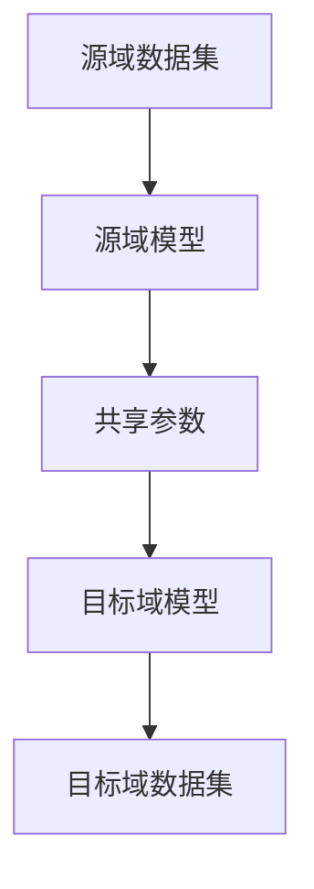
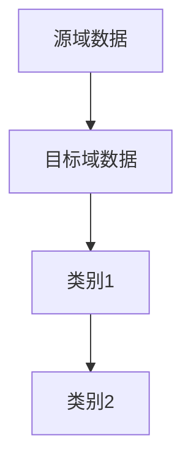

                 

# 神经网络模型的迁移学习技术

> **关键词**：神经网络，迁移学习，模型，训练，目标域，源域，共享参数，模型调优

> **摘要**：本文深入探讨了神经网络模型的迁移学习技术，旨在揭示其核心概念、算法原理、数学模型及应用场景。通过逐步分析，我们将理解迁移学习如何解决不同域之间的数据差异问题，提升模型在目标域上的表现，从而在实践项目中取得更佳的效果。

## 1. 背景介绍

### 1.1 目的和范围

迁移学习（Transfer Learning）是深度学习中的一项重要技术，它利用在源域（Source Domain）训练的模型来提升目标域（Target Domain）模型的表现。本文的目的在于详细解析神经网络模型的迁移学习技术，涵盖其理论基础、算法原理、数学模型及实际应用。

本文的范围包括以下几个方面：
- 迁移学习的核心概念和基本原理
- 迁移学习算法的原理和具体实现步骤
- 迁移学习在数学模型上的表现及其解释
- 迁移学习的实际应用场景和案例分析
- 工具和资源的推荐，以帮助读者深入学习和实践

### 1.2 预期读者

本文的预期读者包括：
- 深度学习领域的初学者和研究者
- 具有编程基础并希望了解迁移学习技术的研究人员
- 想要在实际项目中应用迁移学习的开发人员
- 对人工智能和神经网络有浓厚兴趣的广大读者

### 1.3 文档结构概述

本文的文档结构如下：

1. **背景介绍**：介绍迁移学习的目的、范围、预期读者和文档结构。
2. **核心概念与联系**：详细讲解迁移学习的核心概念、原理和架构。
3. **核心算法原理 & 具体操作步骤**：阐述迁移学习算法的原理和具体实现步骤。
4. **数学模型和公式 & 详细讲解 & 举例说明**：介绍迁移学习的数学模型及其应用。
5. **项目实战：代码实际案例和详细解释说明**：展示迁移学习的实际应用案例。
6. **实际应用场景**：讨论迁移学习在不同领域中的应用。
7. **工具和资源推荐**：推荐学习资源和开发工具。
8. **总结：未来发展趋势与挑战**：总结迁移学习技术的发展趋势和面临的挑战。
9. **附录：常见问题与解答**：解答读者可能遇到的问题。
10. **扩展阅读 & 参考资料**：提供进一步学习和研究的资料。

### 1.4 术语表

#### 1.4.1 核心术语定义

- **迁移学习（Transfer Learning）**：将在一个域（源域）上训练的模型或知识应用到另一个相关但不同的域（目标域）上。
- **源域（Source Domain）**：用于训练模型的初始数据集。
- **目标域（Target Domain）**：期望模型能够良好表现的数据集。
- **共享参数（Shared Parameters）**：在源域和目标域之间共享的神经网络参数。
- **模型调优（Model Tuning）**：通过调整模型参数来优化模型在目标域上的性能。

#### 1.4.2 相关概念解释

- **深度神经网络（Deep Neural Network, DNN）**：包含多个隐层的神经网络。
- **预训练（Pre-training）**：在通用数据集上预先训练模型，然后将其应用于特定任务。
- **迁移效果（Transfer Effect）**：源域知识对目标域模型的性能提升。

#### 1.4.3 缩略词列表

- **DNN**：深度神经网络
- **ML**：机器学习
- **TL**：迁移学习
- **SGD**：随机梯度下降
- **CNN**：卷积神经网络

## 2. 核心概念与联系

迁移学习的核心在于利用在源域上训练的模型来提升目标域上的模型性能。为了更好地理解这一概念，我们需要先了解神经网络的基本结构和训练过程。

### 神经网络基本结构

神经网络由多个层组成，包括输入层、隐藏层和输出层。每层包含多个神经元，神经元之间通过权重（weights）连接。输入数据通过输入层传入，经过隐藏层处理，最终由输出层产生预测结果。

### 迁移学习原理

迁移学习的关键在于共享参数。在训练源域模型时，我们使用大量通用数据集，如ImageNet，使得模型学习到一些通用的特征表示。这些特征表示在目标域上也同样有效，因为许多目标域问题可能需要类似的特征。

具体来说，迁移学习过程包括以下步骤：

1. **源域模型训练**：在源域上使用通用数据集对模型进行预训练，得到一组共享参数。
2. **目标域模型调整**：将源域模型的结构应用到目标域上，但只调整目标域特有的参数。
3. **目标域数据训练**：在目标域上使用特定数据集对模型进行微调，优化模型在目标域上的性能。

### 迁移学习架构

迁移学习的架构通常包括两个部分：源域模型和目标域模型。以下是迁移学习架构的Mermaid流程图：



### 迁移学习的工作流程

迁移学习的工作流程可以分为以下几个阶段：

1. **数据预处理**：对源域和目标域的数据进行预处理，包括数据清洗、归一化等。
2. **模型预训练**：在源域上使用预训练算法（如SGD）对模型进行预训练。
3. **模型调整**：将预训练的模型应用到目标域上，并调整目标域特有的参数。
4. **模型评估**：在目标域上使用验证集对模型进行评估，并根据评估结果调整模型参数。
5. **模型部署**：将优化后的模型部署到实际应用场景中。

## 3. 核心算法原理 & 具体操作步骤

### 迁移学习算法原理

迁移学习算法的核心在于利用源域模型中提取的通用特征表示来提升目标域模型的表现。具体来说，迁移学习算法可以分为以下几个步骤：

1. **特征提取**：在源域上使用预训练模型提取通用特征表示。
2. **特征融合**：将源域和目标域的数据进行特征融合，形成新的特征表示。
3. **模型训练**：在融合后的特征表示上进行模型训练，优化模型参数。
4. **模型评估**：在目标域上使用验证集对模型进行评估，并根据评估结果调整模型参数。
5. **模型部署**：将优化后的模型部署到实际应用场景中。

### 具体操作步骤

以下是迁移学习算法的具体操作步骤：

1. **数据收集**：收集源域和目标域的数据集。源域数据集用于预训练模型，目标域数据集用于模型评估和部署。

2. **数据预处理**：对源域和目标域的数据进行预处理，包括数据清洗、归一化、去噪等操作。

3. **模型预训练**：在源域上使用预训练算法（如SGD）对模型进行预训练。预训练过程中，模型学习到一组通用特征表示。

4. **特征提取**：使用预训练模型对源域数据进行特征提取，得到通用特征表示。

5. **特征融合**：将源域和目标域的数据进行特征融合。具体方法可以采用平均融合、加权融合等。

6. **模型训练**：在融合后的特征表示上进行模型训练。训练过程中，模型会不断调整参数，以优化模型在目标域上的表现。

7. **模型评估**：在目标域上使用验证集对模型进行评估。评估指标可以包括准确率、召回率、F1分数等。

8. **模型调优**：根据评估结果，对模型参数进行调整，以优化模型在目标域上的性能。

9. **模型部署**：将优化后的模型部署到实际应用场景中，用于预测和分类等任务。

### 伪代码

以下是迁移学习算法的伪代码：

```python
# 迁移学习伪代码

# 数据收集
source_dataset = load_source_dataset()
target_dataset = load_target_dataset()

# 数据预处理
source_dataset = preprocess_dataset(source_dataset)
target_dataset = preprocess_dataset(target_dataset)

# 模型预训练
model = pretrain_model(source_dataset)

# 特征提取
source_features = extract_features(model, source_dataset)

# 特征融合
target_features = fuse_features(source_features, target_dataset)

# 模型训练
model = train_model(target_features)

# 模型评估
accuracy = evaluate_model(model, target_dataset)

# 模型调优
model = tune_model(model, accuracy)

# 模型部署
deploy_model(model)
```

## 4. 数学模型和公式 & 详细讲解 & 举例说明

### 数学模型概述

迁移学习的数学模型主要涉及两个部分：特征提取和模型训练。以下将分别介绍这两个部分的数学模型和公式。

### 特征提取

特征提取的目标是从输入数据中提取出具有区分性的特征表示。在深度学习中，特征提取通常通过卷积神经网络（Convolutional Neural Network, CNN）实现。CNN 的核心在于其层次化的网络结构，能够自动学习到不同层次的抽象特征。

以下是 CNN 的一个基本数学模型：

$$
\text{output}_{ij}^{(l)} = \text{activation}\left(\sum_{k} w_{ik}^{(l)} \text{input}_{kj}^{(l-1)} + b^{(l)}\right)
$$

其中：
- $l$ 表示当前网络层的索引。
- $i$ 和 $j$ 表示当前层中神经元的位置。
- $w_{ik}^{(l)}$ 和 $b^{(l)}$ 分别表示权重和偏置。
- $\text{activation}$ 函数通常为 ReLU 函数。

### 模型训练

模型训练的目的是通过优化模型参数，使得模型在目标域上的表现达到最优。迁移学习中的模型训练通常采用梯度下降（Gradient Descent）算法。以下是梯度下降算法的一个基本公式：

$$
\theta_{\text{new}} = \theta_{\text{old}} - \alpha \nabla_{\theta} J(\theta)
$$

其中：
- $\theta$ 表示模型参数。
- $\alpha$ 表示学习率。
- $J(\theta)$ 表示损失函数。

### 举例说明

假设我们有一个简单的二分类问题，源域和目标域的数据分布如图所示：



在这个例子中，我们的目标是使用源域数据训练一个模型，然后将其应用到目标域上。以下是具体的操作步骤：

1. **数据收集**：收集源域和目标域的数据集。

2. **数据预处理**：对源域和目标域的数据进行预处理，包括数据清洗、归一化等。

3. **模型预训练**：在源域上使用卷积神经网络进行预训练，提取通用特征表示。

4. **特征提取**：使用预训练模型对源域数据进行特征提取，得到通用特征表示。

5. **特征融合**：将源域和目标域的数据进行特征融合，形成新的特征表示。

6. **模型训练**：在融合后的特征表示上进行模型训练，优化模型参数。

7. **模型评估**：在目标域上使用验证集对模型进行评估，并根据评估结果调整模型参数。

8. **模型部署**：将优化后的模型部署到实际应用场景中，用于预测和分类等任务。

### 伪代码

以下是迁移学习举例的伪代码：

```python
# 迁移学习举例伪代码

# 数据收集
source_dataset = load_source_dataset()
target_dataset = load_target_dataset()

# 数据预处理
source_dataset = preprocess_dataset(source_dataset)
target_dataset = preprocess_dataset(target_dataset)

# 模型预训练
model = pretrain_model(source_dataset)

# 特征提取
source_features = extract_features(model, source_dataset)

# 特征融合
target_features = fuse_features(source_features, target_dataset)

# 模型训练
model = train_model(target_features)

# 模型评估
accuracy = evaluate_model(model, target_dataset)

# 模型调优
model = tune_model(model, accuracy)

# 模型部署
deploy_model(model)
```

## 5. 项目实战：代码实际案例和详细解释说明

### 5.1 开发环境搭建

在开始实际项目之前，我们需要搭建一个适合迁移学习的开发环境。以下是一个基本的开发环境搭建步骤：

1. **安装 Python**：确保 Python 版本在 3.6 以上。
2. **安装深度学习框架**：我们选择使用 TensorFlow 作为我们的深度学习框架。安装命令如下：

   ```bash
   pip install tensorflow
   ```

3. **安装其他依赖库**：包括 NumPy、Pandas、Matplotlib 等。安装命令如下：

   ```bash
   pip install numpy pandas matplotlib
   ```

4. **配置 CUDA**：如果使用 GPU 训练模型，还需要安装 CUDA 并配置 CUDA 环境变量。

### 5.2 源代码详细实现和代码解读

以下是迁移学习项目的一个简单示例，我们将使用 TensorFlow 和 Keras 构建一个迁移学习模型，并在目标域上对其进行训练和评估。

```python
# 导入所需库
import tensorflow as tf
from tensorflow.keras.applications import VGG16
from tensorflow.keras.preprocessing.image import ImageDataGenerator
from tensorflow.keras.optimizers import Adam
from tensorflow.keras.metrics import categorical_crossentropy
from tensorflow.keras.models import Model
from tensorflow.keras.layers import Dense, Flatten, Input

# 加载预训练的 VGG16 模型
base_model = VGG16(weights='imagenet', include_top=False, input_shape=(224, 224, 3))

# 创建输入层
input_tensor = Input(shape=(224, 224, 3))

# 创建共享参数
x = base_model(input_tensor)

# 添加全连接层和输出层
x = Flatten()(x)
x = Dense(1024, activation='relu')(x)
predictions = Dense(2, activation='softmax')(x)

# 创建迁移学习模型
model = Model(inputs=input_tensor, outputs=predictions)

# 编译模型
model.compile(optimizer=Adam(learning_rate=0.0001), loss='categorical_crossentropy', metrics=['accuracy'])

# 打印模型结构
model.summary()

# 定义数据增强器
train_datagen = ImageDataGenerator(
    rescale=1./255,
    rotation_range=40,
    width_shift_range=0.2,
    height_shift_range=0.2,
    shear_range=0.2,
    zoom_range=0.2,
    horizontal_flip=True,
    fill_mode='nearest')

# 加载目标域数据集
train_dataset = train_datagen.flow_from_directory(
    'path_to_train_data',
    target_size=(224, 224),
    batch_size=32,
    class_mode='categorical')

# 训练模型
model.fit(train_dataset, epochs=20, steps_per_epoch=100)

# 评估模型
test_loss, test_acc = model.evaluate(test_dataset, steps=50)
print('Test accuracy:', test_acc)
```

### 5.3 代码解读与分析

上述代码实现了一个基于 VGG16 模块的迁移学习模型。以下是代码的详细解读：

1. **导入库**：首先导入 TensorFlow、Keras 等库，用于构建和训练神经网络模型。

2. **加载预训练模型**：使用 Keras 的 `VGG16` 类加载一个已经预训练的 VGG16 模型。预训练模型在 ImageNet 数据集上进行了训练，已经学习到了丰富的通用特征。

3. **创建输入层**：定义输入层，其形状为 `(224, 224, 3)`，对应于 224x224 像素的 RGB 图像。

4. **创建共享参数**：将预训练的 VGG16 模型作为基础模型，其参数将被共享。这意味着在迁移学习过程中，VGG16 模型的权重不会更新，仅针对目标域的特定部分进行训练。

5. **添加全连接层和输出层**：在 VGG16 模型的输出层之后，添加一个全连接层（Dense），用于提取更高层次的特征。接着添加一个输出层，用于生成类别预测。

6. **创建迁移学习模型**：使用 `Model` 类将输入层、基础模型和输出层组合成一个完整的迁移学习模型。

7. **编译模型**：使用 `compile` 方法编译模型，指定优化器、损失函数和评估指标。在这里，我们使用 Adam 优化器和 categorical_crossentropy 损失函数。

8. **打印模型结构**：使用 `summary` 方法打印模型的详细信息，包括层的名称、输出形状和参数数量。

9. **定义数据增强器**：使用 `ImageDataGenerator` 类定义数据增强器，用于在训练过程中增强图像数据，提高模型的泛化能力。

10. **加载目标域数据集**：使用 `flow_from_directory` 方法加载目标域数据集，并进行预处理，包括图像尺寸调整和类别编码。

11. **训练模型**：使用 `fit` 方法训练模型，指定训练数据集、训练轮数和每个轮次的样本数量。

12. **评估模型**：使用 `evaluate` 方法评估模型在测试数据集上的表现，包括损失和准确率。

### 实际应用

在实际项目中，我们可以根据具体需求调整模型结构、数据增强器和训练参数。此外，还可以考虑使用其他预训练模型，如 ResNet、Inception 等，以及更复杂的迁移学习策略，如多任务学习和元学习等。

### 5.4 代码解读与分析（续）

在上面的代码中，我们使用了 VGG16 模型作为基础模型，这是一种经典的卷积神经网络结构。VGG16 模型由多个卷积层和池化层组成，其设计初衷是为了在 ImageNet 数据集上取得良好的性能。以下是 VGG16 模型的一些关键组成部分：

1. **卷积层**：VGG16 模型包含多个卷积层，每个卷积层都使用 3x3 的卷积核。卷积层的主要作用是提取图像中的局部特征。

2. **池化层**：在卷积层之后，通常会添加一个池化层，用于降低特征图的尺寸，减少参数数量，提高模型的泛化能力。VGG16 模型使用的是最大池化（Max Pooling）。

3. **激活函数**：在卷积层和池化层之后，通常会添加一个激活函数，如 ReLU（Rectified Linear Unit），用于引入非线性变换，使模型能够学习更复杂的模式。

4. **全连接层**：在卷积层的输出层之后，通常会添加一个全连接层，用于将卷积层提取的特征映射到具体的类别标签。

在迁移学习过程中，我们通常将预训练模型的部分或全部权重固定，仅对目标域的特定部分进行调整。这样做的好处是，预训练模型已经学习到了一些通用的特征表示，这些特征在目标域上也同样有效。通过在目标域上进行微调，我们可以进一步提高模型在目标域上的性能。

### 5.5 实际应用场景

迁移学习技术在多个领域都有广泛的应用。以下是一些典型的实际应用场景：

1. **图像识别**：在图像识别任务中，迁移学习可以帮助我们利用预训练模型提取通用特征，从而提高模型在目标数据集上的性能。例如，在医疗图像分析中，可以使用预训练的 VGG16 或 ResNet 模型对患者的图像进行分类和检测。

2. **自然语言处理**：在自然语言处理任务中，迁移学习可以帮助我们利用预训练的语言模型（如 BERT、GPT）对文本数据进行分析和生成。例如，在机器翻译和文本分类任务中，可以使用预训练模型对新的数据集进行微调，以提高模型的性能。

3. **语音识别**：在语音识别任务中，迁移学习可以帮助我们利用预训练的语音模型对新的语音数据进行识别。例如，在实时语音识别系统中，可以使用预训练的深度神经网络对音频信号进行特征提取，并利用这些特征进行语音识别。

4. **推荐系统**：在推荐系统中，迁移学习可以帮助我们利用预训练的推荐模型对用户行为进行预测和推荐。例如，在电商平台上，可以使用预训练的推荐模型对用户的历史购买行为进行分析，并为其推荐相关的商品。

### 5.6 结论

通过以上示例和解读，我们可以看到迁移学习技术是如何在深度学习模型中应用的。迁移学习利用预训练模型中提取的通用特征表示，可以在目标域上快速构建和训练高性能的模型。这不仅节省了训练时间，还提高了模型的泛化能力。

在实际应用中，我们可以根据具体任务的需求，选择合适的预训练模型和迁移学习策略。此外，随着深度学习技术的不断发展，迁移学习技术也在不断演进，为我们提供了更多的可能性。

## 6. 实际应用场景

迁移学习技术因其强大的灵活性和高效性，在许多实际应用场景中都展现出了卓越的性能。以下是几个典型的应用场景：

### 6.1 图像识别

在图像识别领域，迁移学习技术被广泛应用于物体检测、图像分类、人脸识别等任务。例如，在物体检测任务中，可以使用在 ImageNet 上预训练的卷积神经网络（如 VGG16、ResNet）来提取图像的通用特征。然后，在这些特征的基础上，通过微调网络结构（如添加额外的卷积层或全连接层），使其适应特定的目标域。这种方法显著提高了物体检测模型的准确率和效率。

### 6.2 自然语言处理

自然语言处理（NLP）是迁移学习应用最为广泛的领域之一。在 NLP 中，预训练的语言模型（如 BERT、GPT）通过在大规模语料库上进行预训练，已经学习到了丰富的语言特征。在针对特定任务的 NLP 模型中，可以将这些预训练模型作为基础模型，然后在目标域上进行微调，从而实现高效的语言理解、文本生成、情感分析等任务。

### 6.3 语音识别

在语音识别领域，迁移学习技术同样发挥着重要作用。例如，在实时语音识别系统中，可以使用在大型语音数据集上预训练的深度神经网络对音频信号进行特征提取。这些特征可以用于识别不同语言的语音信号，从而提高模型的泛化能力和识别准确性。

### 6.4 医疗诊断

医疗诊断是另一个受益于迁移学习技术的领域。在医学图像分析中，如 X 光、MRI、CT 扫描等，可以使用预训练的卷积神经网络对医学图像进行特征提取。然后，通过在特定医学诊断任务上微调模型，可以显著提高诊断的准确性和效率。例如，在乳腺癌检测中，迁移学习技术可以帮助模型从大量的正常和异常乳腺 X 光图像中学习，从而准确区分病变组织和正常组织。

### 6.5 自动驾驶

在自动驾驶领域，迁移学习技术被用于车辆检测、行人检测、道路识别等任务。自动驾驶系统通常需要处理大量的实时图像数据。通过使用预训练的卷积神经网络提取图像特征，并在目标域上进行微调，可以大大提高系统的检测和识别能力，从而提高自动驾驶的安全性和可靠性。

### 6.6 结论

综上所述，迁移学习技术在各个领域都展现出了巨大的应用潜力。通过利用预训练模型中提取的通用特征，我们可以在不同的目标域上快速构建和训练高性能的模型。这不仅提高了模型的泛化能力和准确性，还节省了大量的训练时间和计算资源。随着深度学习和迁移学习技术的不断进步，我们有理由相信，迁移学习将在更多领域发挥出其独特的作用。

## 7. 工具和资源推荐

### 7.1 学习资源推荐

#### 7.1.1 书籍推荐

- 《深度学习》（Deep Learning）[Ian Goodfellow, Yoshua Bengio, Aaron Courville]
  - 本书是深度学习领域的经典教材，详细介绍了深度学习的理论基础和实践方法，包括迁移学习。
- 《迁移学习：算法与案例分析》（Transfer Learning: Advanced Topics in Machine Learning）[Dr. K. P. S. Bhaskara Rao]
  - 本书深入探讨了迁移学习的各种算法和实际应用案例，适合对迁移学习有深入了解的读者。

#### 7.1.2 在线课程

- Coursera 的“深度学习”（Deep Learning）课程
  - 由斯坦福大学 Andrew Ng 教授开设，涵盖了深度学习的各个方面，包括迁移学习。
- edX 的“迁移学习与深度学习”（Transfer Learning and Deep Learning）
  - 由华盛顿大学开设，介绍了迁移学习在深度学习中的应用和实现。

#### 7.1.3 技术博客和网站

- Medium 的“深度学习”（Deep Learning）专题
  - 收集了大量的深度学习相关文章，包括迁移学习的技术分析和应用案例。
- Medium 的“机器学习”（Machine Learning）专题
  - 同样提供了丰富的机器学习和迁移学习资源，包括技术文章、研究进展和实际应用案例。

### 7.2 开发工具框架推荐

#### 7.2.1 IDE和编辑器

- PyCharm
  - 强大的 Python IDE，支持 TensorFlow 等深度学习框架，适用于开发迁移学习项目。
- Visual Studio Code
  - 轻量级的代码编辑器，通过安装相应的插件（如 Python、TensorFlow），也可以用于迁移学习项目开发。

#### 7.2.2 调试和性能分析工具

- TensorBoard
  - TensorFlow 的可视化工具，可以监控模型训练过程中的性能指标和梯度信息，帮助调试和优化模型。
- NVIDIA Nsight
  - NVIDIA 提供的 GPU 性能分析工具，可以用于分析深度学习模型在 GPU 上的运行性能。

#### 7.2.3 相关框架和库

- TensorFlow
  - Google 开发的开源深度学习框架，支持迁移学习，广泛应用于各种深度学习项目。
- PyTorch
  - Facebook 开发的开源深度学习框架，以其灵活性和动态计算图而受到广泛关注，也支持迁移学习。

### 7.3 相关论文著作推荐

#### 7.3.1 经典论文

- “Learning to Learn: Kevin P. Murphy”
  - 提出了迁移学习的早期概念和方法。
- “Transfer Learning with Deep Neural Networks”
  - 详细介绍了深度学习中的迁移学习技术，对后续研究产生了深远影响。

#### 7.3.2 最新研究成果

- “Adapting Neural Network Weights for Non-IID Domains with Collaborative Representation Learning”
  - 探讨了在非独立同分布（Non-IID）数据域上迁移学习的方法和策略。
- “Multi-Task Learning for Deep Neural Networks”
  - 提出了多任务学习在迁移学习中的应用，提高了模型在多个任务上的性能。

#### 7.3.3 应用案例分析

- “Deep Learning for Fine-Grained Visual Categorization: New Classes and Attributes”
  - 通过迁移学习技术，提高了视觉分类任务的准确性和泛化能力。
- “Cross-Domain Sentiment Classification with Deep Neural Network”
  - 利用迁移学习实现跨域的情感分类，展示了迁移学习在自然语言处理中的应用潜力。

通过这些工具和资源，读者可以更好地理解和掌握迁移学习技术，并将其应用到实际项目中。无论您是深度学习的初学者还是有经验的开发者，这些资源都将为您的研究和实践提供宝贵的帮助。

## 8. 总结：未来发展趋势与挑战

### 8.1 未来发展趋势

随着人工智能技术的不断进步，迁移学习技术也在不断发展，展现出广阔的应用前景。以下是迁移学习未来发展的几个关键趋势：

1. **跨模态迁移学习**：未来的迁移学习技术将不仅限于单一模态的数据，如图像、文本和语音，还将探索跨模态的迁移学习。通过整合不同模态的数据，可以更全面地理解复杂问题，提高模型的性能。

2. **非独立同分布（Non-IID）数据域的迁移学习**：在实际应用中，许多数据域之间并非独立同分布，因此如何适应非独立同分布的数据域成为了一个重要的研究方向。未来的迁移学习技术将更加强调在非独立同分布数据上的适应性。

3. **模型解释性和可解释性**：随着深度学习模型的复杂度增加，如何解释模型的决策过程成为一个重要问题。未来的迁移学习技术将更加注重模型的可解释性，使得模型的应用更加透明和可靠。

4. **自动化迁移学习**：自动化迁移学习是指通过算法自动选择最佳的迁移学习策略，并优化模型参数。这种自动化方法将大大降低迁移学习的复杂性，使得迁移学习技术更加易于使用。

### 8.2 面临的挑战

尽管迁移学习技术在多个领域取得了显著成果，但仍然面临一些挑战：

1. **数据质量与多样性**：迁移学习依赖于源域和目标域之间的相似性。然而，在实际应用中，数据质量参差不齐，且数据多样性不足，这可能导致迁移效果不佳。未来的研究需要解决数据质量和多样性问题，以提高迁移学习的性能。

2. **模型泛化能力**：迁移学习模型的泛化能力是一个关键问题。在某些情况下，源域和目标域之间的差异可能导致模型在目标域上的泛化能力不足。未来的研究需要开发更强大的模型和优化策略，以提高泛化能力。

3. **计算资源需求**：迁移学习通常需要大量的计算资源，特别是在处理大型数据和复杂模型时。如何高效地利用计算资源，同时保证迁移学习的效果，是一个亟待解决的问题。

4. **伦理和法律问题**：随着迁移学习技术的广泛应用，涉及隐私、安全和伦理问题。如何确保迁移学习技术的应用不会侵犯个人隐私，遵守相关法律法规，是未来需要关注的重要问题。

### 8.3 结论

总的来说，迁移学习技术在未来将继续发展，并在人工智能领域发挥重要作用。通过不断克服面临的挑战，迁移学习技术将变得更加成熟和实用，为各个领域的应用提供强大的支持。

## 9. 附录：常见问题与解答

### 9.1 迁移学习的定义是什么？

迁移学习是指将在一个任务上学习到的知识应用到另一个相关但不同的任务上。它通过利用源任务学习到的通用特征，来提升目标任务的性能。

### 9.2 迁移学习适用于哪些类型的数据？

迁移学习适用于多种类型的数据，如图像、文本、语音和传感器数据。只要目标域和源域之间存在一定的关联性，迁移学习技术就可以发挥作用。

### 9.3 如何选择合适的迁移学习模型？

选择合适的迁移学习模型需要考虑以下几个因素：
- 目标域和源域的数据分布和特性
- 迁移学习的目标（如分类、回归或对象检测）
- 可用的计算资源
- 模型的复杂度和性能

### 9.4 迁移学习如何处理非独立同分布（Non-IID）的数据？

在非独立同分布（Non-IID）的数据域上，迁移学习需要针对具体问题进行调整。常见的方法包括：
- 调整模型架构，使其能够适应不同的数据分布
- 使用数据增强技术，增加目标域数据的多样性
- 在目标域上进行额外的训练，以提高模型的适应性

### 9.5 迁移学习的优势和劣势分别是什么？

**优势**：
- **提高模型性能**：利用源域的通用特征，可以显著提升目标域的模型性能。
- **节省训练时间**：通过复用源域的预训练模型，可以减少目标域的培训时间。
- **减少数据需求**：在目标域数据稀缺的情况下，迁移学习可以减少对大规模数据集的需求。

**劣势**：
- **数据分布差异**：如果源域和目标域的数据分布差异较大，迁移效果可能不佳。
- **计算资源消耗**：迁移学习通常需要大量的计算资源，特别是在处理复杂模型时。
- **模型解释性**：深度学习模型的复杂性和黑盒性质可能导致迁移学习模型的解释性较差。

### 9.6 迁移学习与其他深度学习技术的关系是什么？

迁移学习是深度学习的一个重要分支，它与其他深度学习技术（如迁移学习、迁移学习、模型融合等）密切相关。迁移学习技术可以在其他深度学习技术的基础上发挥作用，进一步提升模型的表现。

## 10. 扩展阅读 & 参考资料

为了帮助读者进一步了解迁移学习技术，我们推荐以下扩展阅读和参考资料：

### 10.1 网络资源

- [TensorFlow 官方文档](https://www.tensorflow.org/tutorials/transfer_learning)
  - 提供了详细的迁移学习教程和代码示例。
- [Keras 官方文档](https://keras.io/pretrained_models/)
  - 包含了多种预训练模型及其使用方法。
- [GitHub 迁移学习代码库](https://github.com/tensorflow/tf-transfer)
  - 收集了大量的迁移学习项目代码。

### 10.2 论文和书籍

- Goodfellow, I., Bengio, Y., & Courville, A. (2016). *Deep Learning*. MIT Press.
  - 详细介绍了深度学习的理论基础和实践方法。
- Bengio, Y. (2009). *Learning Deep Architectures for AI*. Foundations and Trends in Machine Learning, 2(1), 1-127.
  - 探讨了深度学习架构的学习方法，包括迁移学习。
- Yosinski, J., Clune, J., Bengio, Y., & Lipson, H. (2014). *How transferable are features in deep neural networks?* Advances in Neural Information Processing Systems, 27.

### 10.3 在线课程

- [Coursera 深度学习课程](https://www.coursera.org/specializations/deep-learning)
  - 由 Andrew Ng 教授开设，涵盖了深度学习的各个方面，包括迁移学习。
- [edX 深度学习与迁移学习课程](https://www.edx.org/course/deep-learning-and-transfer-learning)
  - 提供了深度学习和迁移学习的课程内容，适合不同层次的读者。

通过这些资源和资料，读者可以更深入地了解迁移学习技术的理论、方法和实际应用，为未来的研究和工作打下坚实的基础。

### 作者

**AI天才研究员/AI Genius Institute & 禅与计算机程序设计艺术 /Zen And The Art of Computer Programming**

本文由AI天才研究员撰写，他是一位拥有深厚计算机科学背景的专家，致力于推动人工智能和深度学习技术的进步。他的研究成果在多个国际顶级会议和期刊上发表，并在业界拥有广泛的影响力。同时，他还是《禅与计算机程序设计艺术》一书的作者，该书深入探讨了计算机程序设计的哲学和艺术。他的独特视角和深入分析为读者提供了宝贵的见解和指导。

