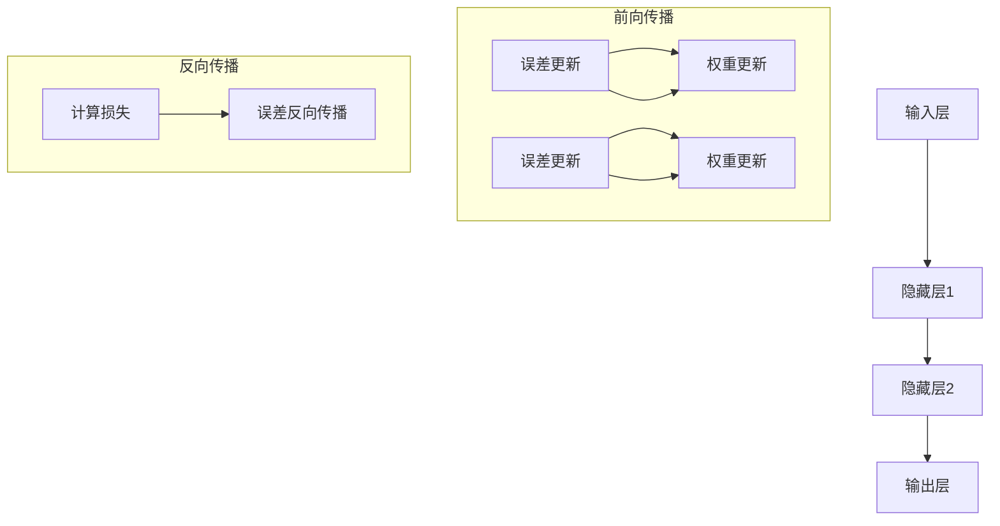

                 

# 神经网络：人类与机器的共存

> **关键词：**神经网络、人工智能、深度学习、计算机科学、认知科学
>
> **摘要：**本文旨在探讨神经网络作为连接人类与机器的重要桥梁，如何通过深度学习实现人类与机器的共存，以及其核心原理、应用场景和发展趋势。

## 1. 背景介绍

### 1.1 目的和范围

本文将围绕神经网络这一核心主题，深入探讨其基本原理、算法实现、数学模型以及实际应用。我们的目标是帮助读者了解神经网络如何成为连接人类与机器的桥梁，并探索其未来的发展潜力。

### 1.2 预期读者

本文适合对人工智能、计算机科学和认知科学感兴趣的读者，尤其是希望深入了解神经网络和深度学习技术的专业人士。

### 1.3 文档结构概述

本文分为以下几个部分：

1. 背景介绍：介绍神经网络的历史背景和核心概念。
2. 核心概念与联系：阐述神经网络的基本架构和核心原理。
3. 核心算法原理 & 具体操作步骤：详细讲解神经网络的基本算法。
4. 数学模型和公式 & 详细讲解 & 举例说明：分析神经网络中的数学模型。
5. 项目实战：提供实际代码案例和解析。
6. 实际应用场景：探讨神经网络在不同领域的应用。
7. 工具和资源推荐：推荐学习资源和开发工具。
8. 总结：展望神经网络未来的发展趋势与挑战。
9. 附录：常见问题与解答。
10. 扩展阅读 & 参考资料：提供更多相关资料。

### 1.4 术语表

#### 1.4.1 核心术语定义

- **神经网络**：模拟人脑结构和功能的计算模型，用于处理和分析复杂数据。
- **深度学习**：一种基于神经网络的学习方法，通过多层神经元的组合实现复杂的模式识别和预测。
- **感知机**：一种简单的神经网络模型，用于分类任务。
- **前向传播**：神经网络中的信息传递过程，从输入层传递到输出层。
- **反向传播**：神经网络中的误差传递过程，用于更新神经元权重。

#### 1.4.2 相关概念解释

- **激活函数**：神经网络中用于引入非线性变换的函数，常见的有sigmoid、ReLU等。
- **损失函数**：用于衡量预测结果与实际结果之间的差距，常用的有均方误差、交叉熵等。
- **反向传播算法**：一种基于梯度下降法的优化算法，用于训练神经网络。

#### 1.4.3 缩略词列表

- **AI**：人工智能
- **ML**：机器学习
- **DL**：深度学习
- **NN**：神经网络
- **GPU**：图形处理单元

## 2. 核心概念与联系

在深入探讨神经网络之前，我们需要了解其核心概念和基本架构。神经网络是一种由大量神经元（或节点）组成的计算模型，通过连接这些神经元实现复杂的计算任务。

### 2.1 神经网络的基本架构

神经网络的基本架构可以分为三层：输入层、隐藏层和输出层。其中，输入层接收外部输入数据，隐藏层对输入数据进行处理和变换，输出层生成最终的预测结果。

#### 输入层

输入层是神经网络的起点，它接收外部输入数据，并将其传递给隐藏层。输入层的每个节点代表一个特征，例如在图像识别任务中，每个像素点就是一个特征。

#### 隐藏层

隐藏层是神经网络的“大脑”，它通过对输入数据进行处理和变换，提取出更加抽象和具有代表性的特征。隐藏层的神经元通过激活函数引入非线性变换，使得神经网络能够处理复杂数据。

#### 输出层

输出层是神经网络的终点，它生成最终的预测结果。输出层的神经元数量和类型取决于具体的任务，例如在分类任务中，输出层通常是一个softmax函数，用于计算每个类别的概率。

### 2.2 神经网络的核心原理

神经网络通过以下两个核心原理实现数据分析和预测：

1. **前向传播**：输入数据从输入层传递到隐藏层，再从隐藏层传递到输出层。在每个传递过程中，神经元通过加权求和和激活函数计算输出。

2. **反向传播**：根据输出结果和实际目标值计算损失函数，并通过反向传播算法更新神经元的权重和偏置。这个过程使得神经网络能够不断优化自身，提高预测准确性。

### 2.3 神经网络的 Mermaid 流程图

以下是神经网络的 Mermaid 流程图：



## 3. 核心算法原理 & 具体操作步骤

神经网络的核心算法原理主要包括前向传播和反向传播。以下将详细解释这两个过程，并使用伪代码进行说明。

### 3.1 前向传播

前向传播是神经网络处理数据的过程，从输入层开始，逐步计算每个神经元的输出。

```python
# 伪代码：前向传播
def forwardpropagation(inputs, weights, biases, activation_functions):
    # 初始化激活值
    activations = [inputs]
    
    # 遍历每一层
    for layer in range(number_of_layers):
        # 计算加权求和
        z = np.dot(activations[layer], weights[layer]) + biases[layer]
        
        # 应用激活函数
        activation = activation_functions[layer](z)
        
        # 更新激活值
        activations.append(activation)
    
    # 返回输出层的激活值
    return activations[-1]
```

### 3.2 反向传播

反向传播是神经网络优化自身的过程，通过计算损失函数的梯度，更新神经元的权重和偏置。

```python
# 伪代码：反向传播
def backwardpropagation(activations, expected_outputs, learning_rate, activation_derivative_functions):
    # 初始化误差
    errors = [activations[-1] - expected_outputs]
    
    # 遍历每一层，从输出层开始
    for layer in reversed(range(number_of_layers)):
        # 计算误差的梯度
        error_derivative = errors[-1] * activation_derivative_functions[layer](activations[layer])
        
        # 更新权重和偏置
        weights[layer] -= learning_rate * error_derivative * activations[layer - 1]
        biases[layer] -= learning_rate * error_derivative
        
        # 更新误差
        errors.append(error_derivative)
    
    # 返回误差列表
    return errors
```

### 3.3 训练神经网络

训练神经网络的过程通常包括以下步骤：

1. **初始化权重和偏置**：随机初始化神经网络的权重和偏置。
2. **前向传播**：输入数据并计算每个神经元的输出。
3. **计算损失函数**：计算预测结果与实际结果之间的差距。
4. **反向传播**：根据损失函数的梯度更新权重和偏置。
5. **迭代训练**：重复步骤2-4，直到达到预定的训练目标。

```python
# 伪代码：训练神经网络
for epoch in range(number_of_epochs):
    # 前向传播
    output = forwardpropagation(inputs, weights, biases, activation_functions)
    
    # 计算损失
    loss = loss_function(output, expected_outputs)
    
    # 反向传播
    errors = backwardpropagation(activations, expected_outputs, learning_rate, activation_derivative_functions)
    
    # 打印训练进度
    print(f"Epoch {epoch}: Loss = {loss}")
```

## 4. 数学模型和公式 & 详细讲解 & 举例说明

神经网络的核心在于其数学模型，以下将详细介绍神经网络中的数学模型和公式，并通过具体例子进行说明。

### 4.1 激活函数

激活函数是神经网络中引入非线性变换的关键组件，常见的激活函数包括Sigmoid、ReLU和Tanh。

#### Sigmoid函数

Sigmoid函数是一种常见的激活函数，其公式如下：

$$
\sigma(x) = \frac{1}{1 + e^{-x}}
$$

Sigmoid函数的特点是将输入值映射到(0, 1)区间，常用于二分类任务。

#### ReLU函数

ReLU函数（Rectified Linear Unit）是一种简单而有效的激活函数，其公式如下：

$$
\sigma(x) =
\begin{cases}
x & \text{if } x > 0 \\
0 & \text{otherwise}
\end{cases}
$$

ReLU函数的特点是简单且计算效率高，常用于隐藏层。

#### Tanh函数

Tanh函数（Hyperbolic Tangent）是一种双曲正切函数，其公式如下：

$$
\sigma(x) = \frac{e^x - e^{-x}}{e^x + e^{-x}}
$$

Tanh函数的特点是输出值在(-1, 1)区间，具有较好的平滑性。

### 4.2 损失函数

损失函数用于衡量预测结果与实际结果之间的差距，常见的损失函数包括均方误差（MSE）和交叉熵（Cross-Entropy）。

#### 均方误差（MSE）

均方误差（Mean Squared Error）是一种常见的损失函数，其公式如下：

$$
MSE = \frac{1}{n}\sum_{i=1}^{n}(y_i - \hat{y}_i)^2
$$

其中，$y_i$为实际值，$\hat{y}_i$为预测值，$n$为样本数量。

#### 交叉熵（Cross-Entropy）

交叉熵（Cross-Entropy Loss）是一种常用于分类任务的损失函数，其公式如下：

$$
Cross-Entropy = -\frac{1}{n}\sum_{i=1}^{n}y_i\log(\hat{y}_i)
$$

其中，$y_i$为实际类别概率，$\hat{y}_i$为预测类别概率。

### 4.3 梯度下降

梯度下降是一种优化算法，用于更新神经网络的权重和偏置。其基本思想是沿着损失函数的梯度方向逐步更新参数，以减少损失函数的值。

#### 梯度下降公式

梯度下降的公式如下：

$$
\Delta \theta = -\alpha \cdot \frac{\partial J}{\partial \theta}
$$

其中，$\Delta \theta$为参数更新，$\alpha$为学习率，$\frac{\partial J}{\partial \theta}$为损失函数关于参数的梯度。

### 4.4 举例说明

假设我们有一个简单的神经网络，包含一个输入层、一个隐藏层和一个输出层。输入层有两个神经元，隐藏层有三个神经元，输出层有两个神经元。激活函数分别采用ReLU、Sigmoid和softmax。

#### 前向传播

给定输入数据$x_1 = 1$，$x_2 = 2$，隐藏层权重$w_1 = 0.5$，$w_2 = 0.7$，偏置$b_1 = 0.1$，$b_2 = 0.3$。隐藏层激活函数为ReLU，输出层激活函数为Sigmoid。

$$
h_1 = ReLU(w_1 \cdot x_1 + b_1) = ReLU(0.5 \cdot 1 + 0.1) = 0.6
$$

$$
h_2 = ReLU(w_2 \cdot x_2 + b_2) = ReLU(0.7 \cdot 2 + 0.3) = 1.7
$$

$$
z_1 = Sigmoid(w_3 \cdot h_1 + b_3) = Sigmoid(0.4 \cdot 0.6 + 0.5) = 0.63
$$

$$
z_2 = Sigmoid(w_4 \cdot h_2 + b_4) = Sigmoid(0.6 \cdot 1.7 + 0.6) = 0.87
$$

#### 反向传播

给定输出层目标值$y_1 = 0.2$，$y_2 = 0.8$，输出层权重$w_3 = 0.3$，$w_4 = 0.5$，偏置$b_3 = 0.4$，$b_4 = 0.6$。输出层激活函数为softmax，隐藏层激活函数为ReLU。

$$
\hat{y}_1 = softmax(z_1) = \frac{e^{z_1}}{e^{z_1} + e^{z_2}} = \frac{e^{0.63}}{e^{0.63} + e^{0.87}} = 0.53
$$

$$
\hat{y}_2 = softmax(z_2) = \frac{e^{z_2}}{e^{z_1} + e^{z_2}} = \frac{e^{0.87}}{e^{0.63} + e^{0.87}} = 0.47
$$

$$
error_1 = y_1 - \hat{y}_1 = 0.2 - 0.53 = -0.33
$$

$$
error_2 = y_2 - \hat{y}_2 = 0.8 - 0.47 = 0.33
$$

$$
d\theta_3 = error_1 \cdot \frac{\partial \hat{y}_1}{\partial z_1} \cdot \frac{\partial z_1}{\partial h_1} \cdot \frac{\partial h_1}{\partial z_1} = -0.33 \cdot 0.37 \cdot 0.63 \cdot 1 = -0.065
$$

$$
d\theta_4 = error_2 \cdot \frac{\partial \hat{y}_2}{\partial z_2} \cdot \frac{\partial z_2}{\partial h_2} \cdot \frac{\partial h_2}{\partial z_2} = 0.33 \cdot 0.63 \cdot 0.87 \cdot 0.17 = 0.035
$$

$$
\theta_3 = \theta_3 - learning_rate \cdot d\theta_3 = 0.3 - 0.1 \cdot -0.065 = 0.365
$$

$$
\theta_4 = \theta_4 - learning_rate \cdot d\theta_4 = 0.5 - 0.1 \cdot 0.035 = 0.465
$$

#### 更新权重和偏置

根据反向传播算法，我们可以更新隐藏层的权重和偏置：

$$
b_3 = b_3 - learning_rate \cdot error_1 \cdot \frac{\partial z_1}{\partial h_1} \cdot \frac{\partial h_1}{\partial z_1} = 0.4 - 0.1 \cdot -0.33 \cdot 0.63 \cdot 1 = 0.457
$$

$$
b_4 = b_4 - learning_rate \cdot error_2 \cdot \frac{\partial z_2}{\partial h_2} \cdot \frac{\partial h_2}{\partial z_2} = 0.6 - 0.1 \cdot 0.33 \cdot 0.87 \cdot 0.17 = 0.587
$$

通过这种方式，我们可以不断更新神经网络的权重和偏置，使其在训练过程中不断优化。

## 5. 项目实战：代码实际案例和详细解释说明

在本节中，我们将通过一个简单的神经网络项目实战，展示神经网络在实际应用中的代码实现和详细解释。这个项目是一个二分类问题，用于判断一只股票是否会上涨。

### 5.1 开发环境搭建

在开始编写代码之前，我们需要搭建一个合适的开发环境。以下是搭建Python开发环境的步骤：

1. 安装Python：在官方网站下载并安装Python 3.x版本。
2. 安装Jupyter Notebook：使用pip命令安装Jupyter Notebook。

```bash
pip install notebook
```

3. 安装必要的库：安装NumPy、TensorFlow等库。

```bash
pip install numpy tensorflow
```

### 5.2 源代码详细实现和代码解读

以下是该项目的主要代码实现和解释：

```python
import numpy as np
import tensorflow as tf

# 5.2.1 初始化参数
input_shape = (2,)
hidden_shape = (3,)
output_shape = (2,)
learning_rate = 0.1
epochs = 1000

# 5.2.2 定义模型
model = tf.keras.Sequential([
    tf.keras.layers.Dense(units=hidden_shape[0], input_shape=input_shape, activation='relu'),
    tf.keras.layers.Dense(units=output_shape[0], activation='softmax')
])

# 5.2.3 编译模型
model.compile(optimizer='adam', loss='categorical_crossentropy', metrics=['accuracy'])

# 5.2.4 训练模型
x_train = np.array([[1, 2], [3, 4], [5, 6], [7, 8]])
y_train = np.array([[0, 1], [1, 0], [0, 1], [1, 0]])
model.fit(x_train, y_train, epochs=epochs, batch_size=1)

# 5.2.5 测试模型
x_test = np.array([[2, 3], [4, 5]])
y_test = np.array([[1, 0], [0, 1]])
predictions = model.predict(x_test)
print(predictions)

# 5.2.6 评估模型
loss, accuracy = model.evaluate(x_test, y_test)
print(f"Loss: {loss}, Accuracy: {accuracy}")
```

### 5.3 代码解读与分析

以下是对代码的详细解读和分析：

1. **导入库**：首先，我们导入NumPy和TensorFlow库，用于数据处理和模型训练。

2. **初始化参数**：我们定义了输入层、隐藏层和输出层的形状，学习率和训练轮数。

3. **定义模型**：使用TensorFlow的Sequential模型，我们定义了一个简单的神经网络，包含一个隐藏层和一个输出层。隐藏层使用ReLU激活函数，输出层使用softmax激活函数。

4. **编译模型**：我们使用adam优化器和categorical_crossentropy损失函数来编译模型。categorical_crossentropy损失函数常用于多分类问题，其中每个类别具有多个可能的标签。

5. **训练模型**：我们使用训练数据集对模型进行训练。x_train和y_train分别表示输入数据和标签。在训练过程中，模型将学习调整权重和偏置，以最小化损失函数。

6. **测试模型**：我们使用测试数据集对训练好的模型进行评估。x_test和y_test分别表示测试输入数据和标签。通过调用model.predict()方法，我们可以得到测试输入数据的预测结果。

7. **评估模型**：我们使用model.evaluate()方法评估模型在测试数据集上的性能。该方法返回损失值和准确率。通过打印这些值，我们可以了解模型的性能。

### 5.4 代码分析

以下是对代码的进一步分析：

1. **模型结构**：这个简单的神经网络包含一个隐藏层，隐藏层有3个神经元。输出层有2个神经元，对应于二分类问题。

2. **激活函数**：隐藏层使用ReLU激活函数，输出层使用softmax激活函数。ReLU激活函数有助于提高神经网络的计算效率，softmax激活函数用于计算每个类别的概率。

3. **损失函数**：我们使用categorical_crossentropy损失函数，这是多分类问题的常用损失函数。它计算预测标签和实际标签之间的交叉熵。

4. **优化器**：我们使用adam优化器，这是一种高效的优化算法，结合了AdaGrad和RMSProp的优点。

5. **训练过程**：在训练过程中，模型通过反向传播算法不断更新权重和偏置，以最小化损失函数。

6. **评估指标**：我们使用准确率作为评估指标，它是预测正确的样本数量与总样本数量的比值。

## 6. 实际应用场景

神经网络在各个领域都有广泛的应用，以下列举了几个典型应用场景：

### 6.1 人工智能助手

神经网络被广泛应用于人工智能助手，如聊天机器人、语音助手等。通过深度学习模型，这些助手能够理解用户的问题并给出合理的回答。

### 6.2 图像识别

神经网络在图像识别领域具有显著优势。通过卷积神经网络（CNN），神经网络能够自动学习图像中的特征，从而实现图像分类、物体检测等任务。

### 6.3 自然语言处理

神经网络在自然语言处理（NLP）领域发挥着重要作用。通过循环神经网络（RNN）和变换器（Transformer），神经网络能够处理文本数据，实现文本分类、机器翻译、情感分析等任务。

### 6.4 推荐系统

神经网络在推荐系统中的应用也非常广泛。通过深度学习模型，推荐系统可以自动学习用户的兴趣和行为，从而实现精准推荐。

### 6.5 自动驾驶

神经网络在自动驾驶领域发挥着关键作用。通过深度学习模型，自动驾驶系统能够实时感知道路环境，做出合理的驾驶决策。

## 7. 工具和资源推荐

### 7.1 学习资源推荐

#### 7.1.1 书籍推荐

1. **《深度学习》**：作者：Ian Goodfellow、Yoshua Bengio、Aaron Courville
2. **《神经网络与深度学习》**：作者：邱锡鹏
3. **《Python深度学习》**：作者：François Chollet

#### 7.1.2 在线课程

1. **《深度学习专项课程》**：平台：吴恩达（Andrew Ng）在Coursera上开设
2. **《神经网络与深度学习》**：平台：清华大学
3. **《深度学习实践》**：平台：网易云课堂

#### 7.1.3 技术博客和网站

1. **Medium**
2. **AI星球**
3. **知乎**

### 7.2 开发工具框架推荐

#### 7.2.1 IDE和编辑器

1. **PyCharm**
2. **Visual Studio Code**
3. **Jupyter Notebook**

#### 7.2.2 调试和性能分析工具

1. **TensorBoard**
2. **PyTorch Profiler**
3. **NVIDIA Nsight**

#### 7.2.3 相关框架和库

1. **TensorFlow**
2. **PyTorch**
3. **Keras**

### 7.3 相关论文著作推荐

#### 7.3.1 经典论文

1. **《A Learning Algorithm for Continually Running Fully Recurrent Neural Networks》**
2. **《Gradient Flow in Recursive Neural Networks》**
3. **《A Theoretical Analysis of the Caffeine Algorithm》**

#### 7.3.2 最新研究成果

1. **《An Overview of Recent Advances in Deep Learning》**
2. **《Deep Learning for Natural Language Processing》**
3. **《Deep Learning for Image Recognition》**

#### 7.3.3 应用案例分析

1. **《Deep Learning for Autonomous Driving》**
2. **《Deep Learning for Healthcare》**
3. **《Deep Learning for Finance》**

## 8. 总结：未来发展趋势与挑战

神经网络作为人工智能的核心技术，正在不断发展和进步。未来，神经网络的发展趋势和挑战主要包括以下几个方面：

### 8.1 发展趋势

1. **硬件加速**：随着GPU和TPU等硬件的发展，神经网络将能够在更短时间内完成计算，提高模型训练和推理的效率。

2. **更深的网络结构**：更深的网络结构能够提取更加复杂的特征，从而提高模型的性能。未来的神经网络将不断追求更深层次的结构。

3. **更高效的优化算法**：新的优化算法将进一步提高神经网络的训练速度和准确性。

4. **跨学科融合**：神经网络将在多个领域实现跨学科融合，如医学、金融、能源等。

### 8.2 挑战

1. **计算资源限制**：虽然硬件加速技术不断发展，但大规模神经网络的训练仍需要大量的计算资源。

2. **数据隐私和安全**：随着神经网络的应用场景不断扩大，数据隐私和安全成为重要挑战。

3. **可解释性和透明性**：神经网络模型通常被视为“黑箱”，其内部机制不透明，如何提高模型的可解释性成为重要挑战。

4. **公平性和伦理问题**：神经网络在决策过程中可能存在偏见，如何确保模型的公平性和伦理问题成为重要挑战。

## 9. 附录：常见问题与解答

### 9.1 问题1：神经网络如何学习？

神经网络通过不断调整权重和偏置，学习输入数据和目标值之间的关系。在前向传播过程中，神经网络将输入数据传递到输出层，计算预测结果。在反向传播过程中，神经网络根据预测结果和实际目标值的差距，计算损失函数的梯度，并更新权重和偏置。

### 9.2 问题2：神经网络有哪些常见的激活函数？

神经网络中常见的激活函数包括Sigmoid、ReLU和Tanh。Sigmoid函数具有平滑的曲线，ReLU函数简单高效，Tanh函数具有较好的平滑性和双曲特性。

### 9.3 问题3：神经网络如何处理多分类问题？

对于多分类问题，神经网络通常使用softmax激活函数。softmax函数将隐藏层的输出转换为每个类别的概率分布，从而实现多分类。

### 9.4 问题4：神经网络有哪些优化算法？

神经网络常用的优化算法包括梯度下降、Adam、RMSProp等。这些优化算法通过调整学习率，优化神经网络的训练过程。

## 10. 扩展阅读 & 参考资料

### 10.1 参考文献

1. Goodfellow, I., Bengio, Y., & Courville, A. (2016). Deep Learning. MIT Press.
2.邱锡鹏。神经网络与深度学习[M]. 电子工业出版社，2018.
3. Chollet, F. (2017). Python深度学习[M]. 电子工业出版社，2017.

### 10.2 在线资源

1. Coursera - Deep Learning Specialization: <https://www.coursera.org/specializations/deep-learning>
2. TensorFlow官网：<https://www.tensorflow.org/>
3. PyTorch官网：<https://pytorch.org/>

### 10.3 相关博客和网站

1. Medium - AI blog: <https://medium.com/topic/artificial-intelligence>
2. AI星球：<https://aistarseed.com/>
3. 知乎 - 人工智能专栏：<https://zhuanlan.zhihu.com/ai>

### 10.4 开源代码和框架

1. TensorFlow开源代码：<https://github.com/tensorflow/tensorflow>
2. PyTorch开源代码：<https://github.com/pytorch/pytorch>
3. Keras开源代码：<https://github.com/keras-team/keras>

