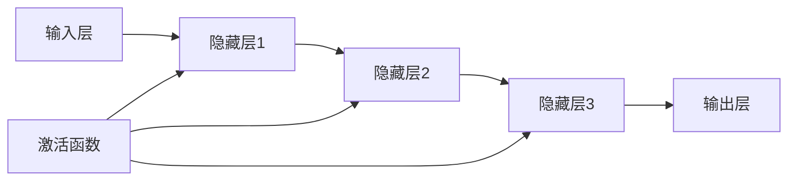

                 

# 神经网络：人类智慧的延伸

> **关键词**：神经网络、机器学习、人工智能、深度学习、模型训练、推理与预测

> **摘要**：本文旨在深入探讨神经网络作为人工智能领域的核心技术，如何通过模拟人类大脑的结构和功能，实现智能决策与知识获取。本文将逐步分析神经网络的核心概念、算法原理、数学模型及其在现实世界的应用，探讨神经网络技术的未来发展趋势与挑战。

## 1. 背景介绍

### 1.1 目的和范围

本文的目的是为读者提供一个全面而深入的神经网络技术导论，帮助读者理解神经网络的原理、实现和应用。本文涵盖了从基础概念到高级应用的各个方面，旨在为不同层次的读者提供有价值的见解。

### 1.2 预期读者

本文适合对人工智能、机器学习和神经网络有一定基础的读者。无论是研究人员、开发者还是对人工智能技术感兴趣的一般读者，都能从本文中获益。

### 1.3 文档结构概述

本文将分为以下几个部分：

1. **背景介绍**：简要介绍神经网络的历史背景和技术基础。
2. **核心概念与联系**：通过Mermaid流程图展示神经网络的基本结构和运作原理。
3. **核心算法原理 & 具体操作步骤**：详细讲解神经网络的核心算法，使用伪代码进行描述。
4. **数学模型和公式 & 详细讲解 & 举例说明**：介绍神经网络的数学模型和公式，并通过实际案例进行解释。
5. **项目实战：代码实际案例和详细解释说明**：提供实际代码示例，解释神经网络的应用。
6. **实际应用场景**：探讨神经网络在不同领域的应用。
7. **工具和资源推荐**：推荐学习资源、开发工具和最新研究成果。
8. **总结：未来发展趋势与挑战**：总结神经网络技术的发展趋势和面临的挑战。
9. **附录：常见问题与解答**：回答读者可能关心的问题。
10. **扩展阅读 & 参考资料**：提供进一步阅读的参考资料。

### 1.4 术语表

#### 1.4.1 核心术语定义

- **神经网络**：由大量人工神经元组成的计算模型，能够通过学习数据自动提取特征并作出决策。
- **前向传播**：神经网络处理输入数据的过程，将数据通过网络传递，最终得到输出。
- **反向传播**：神经网络调整内部参数（权重和偏置）的过程，以减少预测误差。
- **激活函数**：神经元输出前的非线性变换，用于引入非线性特性。
- **梯度下降**：一种常用的优化算法，用于调整神经网络参数，以最小化损失函数。

#### 1.4.2 相关概念解释

- **深度学习**：一种机器学习方法，使用多层神经网络进行学习，能够自动提取复杂特征。
- **卷积神经网络（CNN）**：专门用于图像识别和处理的神经网络结构。
- **循环神经网络（RNN）**：能够处理序列数据的神经网络结构，广泛应用于自然语言处理和时间序列分析。
- **损失函数**：衡量模型预测结果与真实结果之间差异的函数，用于指导神经网络的学习过程。

#### 1.4.3 缩略词列表

- **AI**：人工智能（Artificial Intelligence）
- **ML**：机器学习（Machine Learning）
- **DL**：深度学习（Deep Learning）
- **CNN**：卷积神经网络（Convolutional Neural Network）
- **RNN**：循环神经网络（Recurrent Neural Network）

## 2. 核心概念与联系

神经网络的核心理念来源于人类大脑的结构和功能，通过模拟神经元和神经网络的连接方式，实现数据的自动学习和特征提取。下面通过Mermaid流程图展示神经网络的基本结构和运作原理。



在上图中，`A` 表示输入层，`E` 表示输出层，`B`、`C`、`D` 表示隐藏层。每个节点代表一个神经元，连接线代表神经元之间的连接，权重。激活函数 `F` 用于引入非线性特性，使神经网络能够学习复杂的模式。

### 2.1 神经网络的基本结构

神经网络由以下几个主要部分组成：

- **输入层**：接收外部输入数据，每个输入对应一个神经元。
- **隐藏层**：多层隐藏层可以提取更高层次的特征，每一层神经元接收前一层的输出，并传递给下一层。
- **输出层**：生成最终的输出结果，可以是分类标签、数值预测等。

### 2.2 神经网络的激活函数

激活函数是神经网络中的一个关键组成部分，它引入了非线性的特性，使得神经网络能够学习复杂的数据分布。常见的激活函数包括：

- **Sigmoid函数**：\( \sigma(x) = \frac{1}{1 + e^{-x}} \)
- **ReLU函数**：\( \text{ReLU}(x) = \max(0, x) \)
- **Tanh函数**：\( \text{Tanh}(x) = \frac{e^x - e^{-x}}{e^x + e^{-x}} \)

不同的激活函数适用于不同的场景，选择合适的激活函数能够提高神经网络的性能。

## 3. 核心算法原理 & 具体操作步骤

神经网络的核心算法是前向传播和反向传播。下面将详细讲解这两个步骤，并通过伪代码进行描述。

### 3.1 前向传播

前向传播是神经网络处理输入数据的过程。输入数据经过输入层传递到隐藏层，然后逐层传递到输出层，最终生成输出结果。具体步骤如下：

```python
# 前向传播伪代码
def forward_propagation(inputs, weights, biases, activation_functions):
    # 初始化输出和激活值
    outputs = []
    activations = []

    # 遍历每一层
    for layer in range(num_layers):
        # 处理输入层
        if layer == 0:
            inputs = inputs

        # 计算当前层的输出和激活值
        z = np.dot(inputs, weights[layer]) + biases[layer]
        activation = activation_functions[layer](z)
        outputs.append(activation)

        # 传递到下一层
        inputs = activation

    # 返回最终输出
    return outputs[-1]
```

### 3.2 反向传播

反向传播是神经网络调整内部参数（权重和偏置）的过程，以减少预测误差。具体步骤如下：

```python
# 反向传播伪代码
def backward_propagation(outputs, expected_outputs, weights, biases, activation_derivatives, learning_rate):
    # 初始化误差和梯度
    errors = []
    gradients = []

    # 遍历每一层，从输出层开始
    for layer in reversed(range(num_layers)):
        # 计算当前层的误差
        error = outputs[layer] - expected_outputs

        # 计算当前层的梯度
        gradient = error * activation_derivatives[layer]

        # 更新当前层的权重和偏置
        biases[layer] -= learning_rate * gradient
        weights[layer] -= learning_rate * gradient

        # 传递到下一层
        if layer > 0:
            errors.append(gradient)

    # 返回误差和梯度
    return errors, gradients
```

通过前向传播和反向传播，神经网络可以不断调整内部参数，以最小化预测误差，从而实现模型的训练。

## 4. 数学模型和公式 & 详细讲解 & 举例说明

神经网络的数学模型主要包括输入层、隐藏层和输出层的计算。下面将详细讲解这些计算过程，并通过实际案例进行说明。

### 4.1 输入层的计算

输入层的计算相对简单，直接将输入数据传递到下一层。具体公式如下：

$$
z^{[l]} = \sum_{i} x_i \cdot w_{i}^{[l]} + b^{[l]}
$$

其中，$z^{[l]}$ 表示第 $l$ 层的输入，$x_i$ 表示第 $i$ 个输入特征，$w_{i}^{[l]}$ 表示第 $i$ 个输入特征与第 $l$ 层神经元的权重，$b^{[l]}$ 表示第 $l$ 层的偏置。

### 4.2 隐藏层的计算

隐藏层的计算包括输入层的计算和激活函数的应用。具体公式如下：

$$
a^{[l]} = \sigma(z^{[l]})
$$

其中，$a^{[l]}$ 表示第 $l$ 层的输出，$\sigma$ 表示激活函数（如Sigmoid函数、ReLU函数等），$z^{[l]}$ 表示第 $l$ 层的输入。

### 4.3 输出层的计算

输出层的计算与隐藏层类似，只是输出层的激活函数可能不同。具体公式如下：

$$
y = \sigma(z^{[L]})
$$

其中，$y$ 表示输出层的输出，$\sigma$ 表示激活函数（如Softmax函数、Sigmoid函数等），$z^{[L]}$ 表示输出层的输入。

### 4.4 案例说明

假设我们有一个简单的一层神经网络，用于实现二分类任务。输入特征有3个，隐藏层有2个神经元，输出层有1个神经元。激活函数使用ReLU函数。现在给定一个输入向量 $[1, 2, 3]$，要求计算输出结果。

#### 步骤 1：计算输入层的输出

$$
z^{[1]} = \sum_{i} x_i \cdot w_{i}^{[1]} + b^{[1]}
$$

其中，$w_{i}^{[1]}$ 和 $b^{[1]}$ 是待定的权重和偏置。假设 $w_{1}^{[1]} = 0.5$，$w_{2}^{[1]} = 0.5$，$b^{[1]} = 1$，则：

$$
z^{[1]} = 1 \cdot 0.5 + 2 \cdot 0.5 + 3 \cdot 0.5 + 1 = 4
$$

#### 步骤 2：计算隐藏层的输出

$$
a^{[1]} = \text{ReLU}(z^{[1]})
$$

由于 ReLU 函数的特点，当输入小于0时，输出为0；当输入大于等于0时，输出为输入。因此：

$$
a^{[1]} = \text{ReLU}(4) = 4
$$

#### 步骤 3：计算输出层的输出

$$
z^{[2]} = \sum_{i} a_i^{[1]} \cdot w_{i}^{[2]} + b^{[2]}
$$

假设 $w_{1}^{[2]} = 0.5$，$w_{2}^{[2]} = 0.5$，$b^{[2]} = 1$，则：

$$
z^{[2]} = 4 \cdot 0.5 + 4 \cdot 0.5 + 1 = 5
$$

$$
y = \text{ReLU}(5) = 5
$$

最终输出结果为 $y = 5$。这个结果表示分类为正类。

通过以上案例，我们可以看到神经网络的计算过程是如何通过数学模型来实现的。在实际应用中，我们需要根据具体的任务和数据调整网络结构和参数，以达到更好的性能。

## 5. 项目实战：代码实际案例和详细解释说明

在本节中，我们将通过一个实际项目案例，展示如何使用神经网络进行手写数字识别任务。我们将使用Python编程语言和TensorFlow库来实现这个项目。

### 5.1 开发环境搭建

在开始项目之前，我们需要搭建合适的开发环境。以下是搭建开发环境所需的步骤：

1. 安装Python（推荐版本3.6及以上）。
2. 安装TensorFlow库：`pip install tensorflow`。
3. 安装其他依赖库（如NumPy、Pandas等）。

### 5.2 源代码详细实现和代码解读

下面是手写数字识别项目的完整代码实现，并附带详细解释。

```python
import tensorflow as tf
from tensorflow.keras import layers, models
import numpy as np

# 5.2.1 数据准备
# 加载MNIST数据集
(x_train, y_train), (x_test, y_test) = tf.keras.datasets.mnist.load_data()

# 数据预处理
x_train = x_train / 255.0
x_test = x_test / 255.0

# 将输入数据扩展到批次维度
x_train = np.expand_dims(x_train, -1)
x_test = np.expand_dims(x_test, -1)

# 5.2.2 构建模型
# 定义输入层
inputs = tf.keras.Input(shape=(28, 28))

# 定义隐藏层
x = layers.Conv2D(32, (3, 3), activation='relu')(inputs)
x = layers.MaxPooling2D((2, 2))(x)
x = layers.Conv2D(64, (3, 3), activation='relu')(x)
x = layers.MaxPooling2D((2, 2))(x)
x = layers.Conv2D(64, (3, 3), activation='relu')(x)

# 定义输出层
outputs = layers.Flatten()(x)
outputs = layers.Dense(64, activation='relu')(outputs)
outputs = layers.Dense(10, activation='softmax')(outputs)

# 创建模型
model = models.Model(inputs=inputs, outputs=outputs)

# 5.2.3 编译模型
model.compile(optimizer='adam',
              loss='sparse_categorical_crossentropy',
              metrics=['accuracy'])

# 5.2.4 训练模型
model.fit(x_train, y_train, epochs=5, batch_size=64)

# 5.2.5 评估模型
test_loss, test_acc = model.evaluate(x_test, y_test, verbose=2)
print(f"Test accuracy: {test_acc:.4f}")

# 5.2.6 预测
predictions = model.predict(x_test[:10])
predicted_classes = np.argmax(predictions, axis=1)

for i, prediction in enumerate(predictions[:10]):
    print(f"Predicted class for image {i+1}: {predicted_classes[i]}, True class: {y_test[i]}")
```

#### 5.2.1 数据准备

首先，我们加载MNIST数据集，并进行数据预处理。我们将图像数据缩放到[0, 1]的范围内，并扩展输入数据的批次维度。

```python
(x_train, y_train), (x_test, y_test) = tf.keras.datasets.mnist.load_data()

x_train = x_train / 255.0
x_test = x_test / 255.0

x_train = np.expand_dims(x_train, -1)
x_test = np.expand_dims(x_test, -1)
```

#### 5.2.2 构建模型

接下来，我们使用TensorFlow的Keras API构建一个简单的卷积神经网络模型。模型包含两个卷积层，每个卷积层后接一个ReLU激活函数和一个MaxPooling层。最后，模型通过一个全连接层进行分类。

```python
inputs = tf.keras.Input(shape=(28, 28))

x = layers.Conv2D(32, (3, 3), activation='relu')(inputs)
x = layers.MaxPooling2D((2, 2))(x)
x = layers.Conv2D(64, (3, 3), activation='relu')(x)
x = layers.MaxPooling2D((2, 2))(x)
x = layers.Conv2D(64, (3, 3), activation='relu')(x)

outputs = layers.Flatten()(x)
outputs = layers.Dense(64, activation='relu')(outputs)
outputs = layers.Dense(10, activation='softmax')(outputs)

model = models.Model(inputs=inputs, outputs=outputs)
```

#### 5.2.3 编译模型

在构建模型后，我们需要编译模型。在这里，我们选择Adam优化器和稀疏分类交叉熵损失函数，并监控模型的准确率。

```python
model.compile(optimizer='adam',
              loss='sparse_categorical_crossentropy',
              metrics=['accuracy'])
```

#### 5.2.4 训练模型

接下来，我们使用训练数据集训练模型。在这里，我们设置训练轮数为5，批次大小为64。

```python
model.fit(x_train, y_train, epochs=5, batch_size=64)
```

#### 5.2.5 评估模型

训练完成后，我们使用测试数据集评估模型的性能。输出结果包括测试损失和测试准确率。

```python
test_loss, test_acc = model.evaluate(x_test, y_test, verbose=2)
print(f"Test accuracy: {test_acc:.4f}")
```

#### 5.2.6 预测

最后，我们使用训练好的模型对测试数据集的前10个图像进行预测，并输出预测结果和真实标签。

```python
predictions = model.predict(x_test[:10])
predicted_classes = np.argmax(predictions, axis=1)

for i, prediction in enumerate(predictions[:10]):
    print(f"Predicted class for image {i+1}: {predicted_classes[i]}, True class: {y_test[i]}")
```

通过以上代码，我们实现了一个简单的手写数字识别项目。这个项目展示了如何使用神经网络进行图像分类任务，并提供了详细的代码解读。在实际应用中，我们可以根据具体需求调整模型结构、训练参数和预测策略，以提高模型的性能。

## 6. 实际应用场景

神经网络在众多领域取得了显著的成果，以下是神经网络在实际应用中的几个典型场景：

### 6.1 图像识别

神经网络在图像识别领域取得了突破性进展，尤其是在深度学习技术的推动下。卷积神经网络（CNN）通过学习图像的局部特征，能够准确识别各种物体和场景。例如，CNN被广泛应用于人脸识别、车牌识别、医疗影像分析等领域。

### 6.2 自然语言处理

神经网络在自然语言处理（NLP）领域也有着广泛应用。循环神经网络（RNN）及其变体，如长短时记忆网络（LSTM）和门控循环单元（GRU），能够处理序列数据，并在文本分类、机器翻译、语音识别等任务中表现出色。

### 6.3 自动驾驶

自动驾驶技术的核心之一是计算机视觉，而神经网络在图像识别和目标检测方面的强大能力使其成为自动驾驶系统的关键技术。自动驾驶系统通过神经网络分析摄像头和激光雷达获取的数据，实现车辆环境感知和路径规划。

### 6.4 金融服务

神经网络在金融服务领域也有广泛应用，如股票市场预测、风险管理、客户信用评估等。通过学习历史数据，神经网络能够发现市场规律和潜在风险，为金融机构提供决策支持。

### 6.5 医疗诊断

神经网络在医疗诊断领域具有巨大潜力，如疾病预测、图像诊断等。通过学习大量的医学影像数据，神经网络能够辅助医生进行早期诊断和疾病分类，提高诊断准确率。

## 7. 工具和资源推荐

### 7.1 学习资源推荐

#### 7.1.1 书籍推荐

- 《深度学习》（Goodfellow, Bengio, Courville）：经典教材，全面介绍了深度学习的基础知识和应用。
- 《Python深度学习》（François Chollet）：针对Python和TensorFlow的深度学习教程，适合初学者。

#### 7.1.2 在线课程

- Coursera的“机器学习”课程（吴恩达教授）：介绍了机器学习和深度学习的基础知识。
- edX的“深度学习专项课程”（吴恩达教授）：深度学习的进阶课程，涵盖神经网络和深度学习模型。

#### 7.1.3 技术博客和网站

- Medium上的“Deep Learning”专题：介绍深度学习的最新技术和应用案例。
- arXiv：发布最新研究成果的学术预印本平台，包含大量深度学习领域的论文。

### 7.2 开发工具框架推荐

#### 7.2.1 IDE和编辑器

- PyCharm：强大的Python IDE，支持多种编程语言和框架。
- Jupyter Notebook：适合数据分析和交互式编程的Web应用。

#### 7.2.2 调试和性能分析工具

- TensorBoard：TensorFlow提供的可视化工具，用于监控模型训练过程和性能分析。
- Profiling Tools：如Python的cProfile和py-spy，用于分析代码性能瓶颈。

#### 7.2.3 相关框架和库

- TensorFlow：Google开发的深度学习框架，支持多种模型和算法。
- PyTorch：Facebook开发的深度学习框架，具有灵活的动态图操作。

### 7.3 相关论文著作推荐

#### 7.3.1 经典论文

- “Backpropagation” (Rumelhart, Hinton, Williams)：介绍了反向传播算法的基本原理。
- “A Learning Algorithm for Continually Running Fully Recurrent Neural Networks” (Williams, Zipser)：提出了长短时记忆网络（LSTM）的概念。

#### 7.3.2 最新研究成果

- “Attention Is All You Need” (Vaswani et al.)：提出了Transformer模型，彻底改变了自然语言处理领域。
- “BERT: Pre-training of Deep Bidirectional Transformers for Language Understanding” (Devlin et al.)：介绍了BERT模型，在多种NLP任务中取得了优异表现。

#### 7.3.3 应用案例分析

- “Facebook AI Research：Facebook AI Research在图像识别、自然语言处理等领域的大量应用案例。
- “Google Brain：Google Brain团队在深度学习技术研究和应用方面的成果和案例。

## 8. 总结：未来发展趋势与挑战

随着深度学习技术的不断进步，神经网络在未来将继续发挥重要作用。以下是一些未来发展趋势和面临的挑战：

### 8.1 发展趋势

- **更加高效和灵活的模型**：研究者们将继续探索新的神经网络结构和优化算法，以提高模型的性能和效率。
- **跨领域应用**：神经网络将在更多领域得到应用，如医疗、金融、制造业等。
- **数据隐私和安全性**：随着数据量的增加，保护用户隐私和确保模型安全性将成为重要挑战。

### 8.2 挑战

- **计算资源需求**：深度学习模型通常需要大量的计算资源，这对硬件和算法优化提出了更高要求。
- **数据质量和标注**：高质量的数据和准确的标注对于训练有效模型至关重要，但在实际应用中往往难以获得。
- **模型解释性**：神经网络模型的解释性较低，这对于需要解释性的应用场景（如医疗诊断）提出了挑战。

## 9. 附录：常见问题与解答

### 9.1 问题1：什么是神经网络？

神经网络是一种通过模拟人类大脑神经元连接方式来处理数据和进行决策的计算模型。

### 9.2 问题2：神经网络是如何工作的？

神经网络通过前向传播和反向传播两个步骤来处理数据和调整内部参数，从而实现预测和分类任务。

### 9.3 问题3：如何选择合适的神经网络结构？

选择合适的神经网络结构需要根据具体任务和数据特点进行权衡，包括层数、每层的神经元数量、激活函数等。

### 9.4 问题4：如何提高神经网络模型的性能？

可以通过调整网络结构、优化算法、增加训练数据、调整超参数等方法来提高神经网络模型的性能。

## 10. 扩展阅读 & 参考资料

- [Goodfellow, Ian, Yann LeCun, and Aaron Courville. "Deep learning." MIT press, 2016.
- [Chollet, François. "Deep learning with Python." Manning Publications, 2017.
- [TensorFlow官方网站](https://www.tensorflow.org/)
- [PyTorch官方网站](https://pytorch.org/)
- [arXiv论文数据库](https://arxiv.org/)

