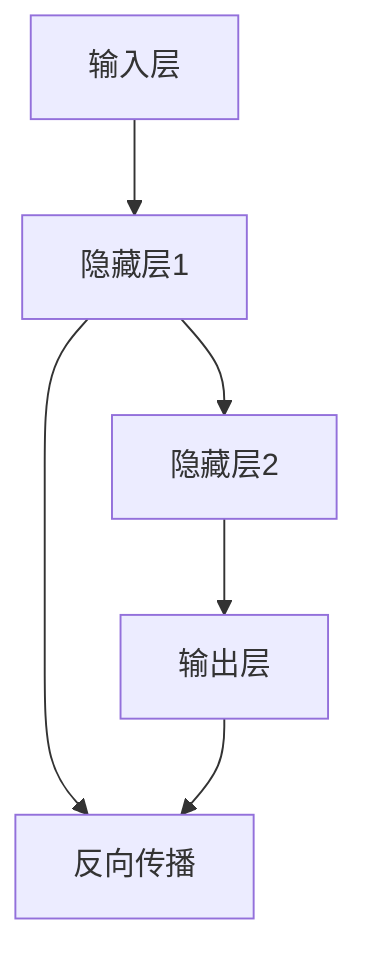

                 

# 神经网络：人类智慧的延伸

## 关键词：
- 人工智能
- 神经网络
- 深度学习
- 机器学习
- 智能算法
- 神经架构

## 摘要：

本文将深入探讨神经网络这一人工智能领域的核心技术，阐述其起源、发展、核心概念、算法原理、数学模型及实际应用。我们将通过逻辑清晰、结构紧凑的叙述方式，逐步剖析神经网络的工作机制，使其变得简单易懂。同时，本文还将推荐相关的学习资源、开发工具及经典论文，帮助读者更好地理解并掌握这一前沿技术。

## 1. 背景介绍

### 1.1 目的和范围

本文旨在为读者提供一个全面且系统的神经网络技术导论，帮助读者了解神经网络的基本原理、应用场景和未来发展趋势。本文将涵盖以下内容：

1. **神经网络的历史与发展**：介绍神经网络的概念起源、关键里程碑和主要发展趋势。
2. **神经网络的核心概念与联系**：通过Mermaid流程图展示神经网络的基本架构和核心组件。
3. **核心算法原理与操作步骤**：详细讲解神经网络的核心算法，包括前向传播和反向传播等。
4. **数学模型和公式**：深入探讨神经网络背后的数学原理，包括激活函数、权重更新等。
5. **项目实战**：通过实际代码案例展示神经网络的实现和应用。
6. **实际应用场景**：分析神经网络在各个领域的应用，如自然语言处理、计算机视觉等。
7. **工具和资源推荐**：推荐相关的学习资源、开发工具和经典论文。
8. **总结与未来展望**：总结神经网络的核心观点，展望其未来发展趋势与挑战。

### 1.2 预期读者

本文适合以下读者群体：

1. 对人工智能和机器学习有基本了解的技术爱好者。
2. 想要深入学习神经网络技术的科研人员和工程师。
3. 在校计算机科学、人工智能等相关专业的学生。

### 1.3 文档结构概述

本文分为以下几个部分：

1. **背景介绍**：介绍神经网络的基本背景和目的。
2. **核心概念与联系**：通过流程图展示神经网络的基本架构。
3. **核心算法原理与操作步骤**：详细讲解神经网络的工作机制。
4. **数学模型和公式**：深入探讨神经网络背后的数学原理。
5. **项目实战**：通过实际代码案例展示神经网络的实现。
6. **实际应用场景**：分析神经网络在各个领域的应用。
7. **工具和资源推荐**：推荐相关的学习资源、开发工具和经典论文。
8. **总结与未来展望**：总结神经网络的核心观点，展望未来发展趋势。

### 1.4 术语表

#### 1.4.1 核心术语定义

- **神经网络**：一种由大量神经元组成的计算模型，用于模拟生物神经系统的工作原理。
- **神经元**：神经网络的基本计算单元，负责接收输入、计算输出和更新权重。
- **权重**：神经元之间的连接强度，决定了神经网络的性能和学习能力。
- **激活函数**：用于决定神经元是否被激活的函数，常见的有ReLU、Sigmoid和Tanh等。
- **前向传播**：神经网络计算输入数据经过多层神经元传递并最终得到输出的过程。
- **反向传播**：通过计算输出误差，更新神经元权重和偏置的过程。

#### 1.4.2 相关概念解释

- **深度学习**：一种机器学习方法，通过多层神经网络进行特征提取和模型训练。
- **机器学习**：一种让计算机通过数据和经验自动学习和改进的方法。
- **人工智能**：模拟人类智能行为的计算机技术。

#### 1.4.3 缩略词列表

- **ANN**：人工神经网络（Artificial Neural Network）
- **DNN**：深度神经网络（Deep Neural Network）
- **CNN**：卷积神经网络（Convolutional Neural Network）
- **RNN**：循环神经网络（Recurrent Neural Network）
- **GAN**：生成对抗网络（Generative Adversarial Network）

## 2. 核心概念与联系

在深入探讨神经网络之前，我们需要了解其核心概念和基本架构。神经网络由大量相互连接的神经元组成，这些神经元模拟了生物神经系统的基本工作原理。

### 2.1 神经网络的基本架构

神经网络的基本架构包括输入层、隐藏层和输出层。每个神经元都与其前一层和后一层中的神经元相连接。

#### 2.1.1 输入层

输入层接收外部输入数据，并将其传递给下一层的神经元。输入层的神经元数量取决于输入数据的维度。

#### 2.1.2 隐藏层

隐藏层是神经网络的核心部分，负责对输入数据进行特征提取和变换。隐藏层的数量和神经元数量可以根据具体问题进行调整。

#### 2.1.3 输出层

输出层负责产生最终输出结果，其神经元数量和类型取决于具体应用场景。

### 2.2 神经网络的核心组件

神经网络的核心组件包括神经元、权重、激活函数和反向传播算法。

#### 2.2.1 神经元

神经元是神经网络的基本计算单元，负责接收输入、计算输出和更新权重。神经元的输入和输出可以通过以下公式表示：

$$
\text{output} = \text{activation}(\sum_{i=1}^{n} w_i \cdot x_i + b)
$$

其中，$x_i$ 表示输入值，$w_i$ 表示权重，$b$ 表示偏置，$\text{activation}$ 表示激活函数。

#### 2.2.2 权重

权重决定了神经元之间的连接强度，影响了神经网络的性能和学习能力。通过反向传播算法，权重可以根据输入数据的误差进行更新。

#### 2.2.3 激活函数

激活函数用于决定神经元是否被激活，常见的激活函数包括ReLU、Sigmoid和Tanh等。激活函数的选择对神经网络的学习效果和性能有重要影响。

#### 2.2.4 反向传播算法

反向传播算法是一种用于训练神经网络的优化算法。通过计算输出误差，反向传播算法可以更新神经网络的权重和偏置，从而提高网络性能。

### 2.3 神经网络的Mermaid流程图

为了更直观地展示神经网络的基本架构和核心组件，我们使用Mermaid流程图进行描述。



## 3. 核心算法原理与具体操作步骤

神经网络的核心算法包括前向传播和反向传播。通过前向传播，神经网络计算输入数据经过多层神经元传递并最终得到输出结果。通过反向传播，神经网络根据输出误差更新权重和偏置，从而提高网络性能。

### 3.1 前向传播算法原理

前向传播算法是一种将输入数据通过神经网络传递到输出层的过程。具体步骤如下：

1. **初始化权重和偏置**：随机初始化权重和偏置，作为神经网络的初始参数。

2. **计算输入层输出**：输入层接收外部输入数据，并将其传递给下一层的神经元。

3. **计算隐藏层输出**：通过前一层神经元的输出和权重，计算下一层神经元的输入和输出。

4. **计算输出层输出**：计算输出层神经元的输入和输出，得到最终输出结果。

5. **计算输出误差**：计算输出结果与真实值的误差，作为后续反向传播的依据。

### 3.2 反向传播算法原理

反向传播算法是一种用于训练神经网络的优化算法。通过计算输出误差，反向传播算法可以更新神经网络的权重和偏置，从而提高网络性能。具体步骤如下：

1. **计算误差梯度**：计算输出误差相对于权重和偏置的梯度。

2. **更新权重和偏置**：根据误差梯度，使用优化算法（如梯度下降）更新权重和偏置。

3. **迭代更新**：重复前向传播和反向传播过程，直到满足停止条件（如达到预设迭代次数或输出误差小于阈值）。

### 3.3 伪代码描述

以下是前向传播和反向传播算法的伪代码描述：

```python
# 前向传播算法
def forward_propagation(input_data, weights, biases, activation_functions):
    outputs = []
    for layer in range(num_layers):
        inputs = input_data if layer == 0 else outputs[layer-1]
        outputs.append(activation_function(sum(inputs * weights[layer] + biases[layer]))
    return outputs[-1]

# 反向传播算法
def backward_propagation(output, target, weights, biases, activation_derivatives, learning_rate):
    errors = [output - target]
    deltas = [errors[-1] * activation_derivatives(outputs[-1])]
    for layer in range(num_layers-2, -1, -1):
        errors.append(deltas[-1] * weights[layer+1].T)
        deltas.append(errors[layer+1] * activation_derivatives(outputs[layer]))
    gradients = [deltas[-1] * inputs.T for deltas, inputs in zip(deltas, inputs_list)]
    biases_gradients = [deltas[layer+1] for deltas in deltas]
    return gradients, biases_gradients

# 梯度下降优化
def gradient_descent(gradients, biases_gradients, weights, biases, learning_rate):
    weights -= learning_rate * gradients
    biases -= learning_rate * biases_gradients
    return weights, biases
```

## 4. 数学模型和公式及详细讲解与举例说明

神经网络的数学模型是理解和实现神经网络的核心。在这一部分，我们将深入探讨神经网络背后的数学原理，包括激活函数、权重更新、误差计算等。

### 4.1 激活函数

激活函数是神经网络中的关键组成部分，它决定了神经元是否被激活。常用的激活函数包括ReLU（Rectified Linear Unit）、Sigmoid和Tanh等。

#### 4.1.1 ReLU激活函数

ReLU激活函数是最常用的激活函数之一，它的定义为：

$$
\text{ReLU}(x) = \max(0, x)
$$

ReLU函数在$x < 0$时输出为0，在$x \geq 0$时输出为$x$。ReLU函数具有简单的计算形式和较好的性能，尤其是在深度学习中。

#### 4.1.2 Sigmoid激活函数

Sigmoid激活函数的公式为：

$$
\text{Sigmoid}(x) = \frac{1}{1 + e^{-x}}
$$

Sigmoid函数将输入值映射到$(0, 1)$区间，常用于二分类问题。它的优点是输出值具有概率解释，缺点是梯度较小，可能导致训练过程中的梯度消失问题。

#### 4.1.3 Tanh激活函数

Tanh激活函数的公式为：

$$
\text{Tanh}(x) = \frac{e^x - e^{-x}}{e^x + e^{-x}}
$$

Tanh函数与Sigmoid函数类似，但输出值映射到$(-1, 1)$区间，梯度问题比Sigmoid函数更小。

### 4.2 权重更新

在神经网络中，权重更新是核心步骤之一。常用的权重更新算法包括梯度下降、随机梯度下降和Adam等。

#### 4.2.1 梯度下降

梯度下降是一种常用的优化算法，其基本思想是沿着损失函数的负梯度方向更新参数。梯度下降的公式为：

$$
\theta_{t+1} = \theta_t - \alpha \cdot \nabla_{\theta} J(\theta)
$$

其中，$\theta$ 表示参数，$\alpha$ 表示学习率，$J(\theta)$ 表示损失函数。

#### 4.2.2 随机梯度下降

随机梯度下降（Stochastic Gradient Descent，SGD）是梯度下降的一种变体，其基本思想是在每次迭代过程中随机选择一个样本，计算其梯度并更新参数。SGD的公式为：

$$
\theta_{t+1} = \theta_t - \alpha \cdot \nabla_{\theta} J(\theta; x_t, y_t)
$$

其中，$x_t$ 和 $y_t$ 分别表示当前样本的输入和输出。

#### 4.2.3 Adam优化算法

Adam优化算法是梯度下降的一种改进算法，其结合了SGD和Momentum的优点。Adam算法的公式为：

$$
m_t = \beta_1 \cdot m_{t-1} + (1 - \beta_1) \cdot \nabla_{\theta} J(\theta; x_t, y_t)
$$

$$
v_t = \beta_2 \cdot v_{t-1} + (1 - \beta_2) \cdot (\nabla_{\theta} J(\theta; x_t, y_t))^2
$$

$$
\theta_{t+1} = \theta_t - \alpha \cdot \frac{m_t}{\sqrt{v_t} + \epsilon}
$$

其中，$m_t$ 和 $v_t$ 分别表示一阶和二阶矩估计，$\beta_1$ 和 $\beta_2$ 分别为Momentum系数，$\alpha$ 为学习率，$\epsilon$ 为常数。

### 4.3 误差计算

在神经网络中，误差计算是评估网络性能的重要指标。常用的误差计算方法包括均方误差（MSE）和交叉熵误差等。

#### 4.3.1 均方误差（MSE）

均方误差（Mean Squared Error，MSE）是衡量预测值与真实值之间差异的常用方法。MSE的公式为：

$$
MSE = \frac{1}{n} \sum_{i=1}^{n} (y_i - \hat{y}_i)^2
$$

其中，$y_i$ 表示真实值，$\hat{y}_i$ 表示预测值，$n$ 表示样本数量。

#### 4.3.2 交叉熵误差

交叉熵误差（Cross-Entropy Error）是用于二分类问题的一种误差计算方法。交叉熵误差的公式为：

$$
Cross-Entropy = -\frac{1}{n} \sum_{i=1}^{n} [y_i \cdot \ln(\hat{y}_i) + (1 - y_i) \cdot \ln(1 - \hat{y}_i)]
$$

其中，$y_i$ 表示真实值，$\hat{y}_i$ 表示预测值。

### 4.4 举例说明

为了更好地理解上述数学模型和公式，我们通过一个简单的例子进行说明。

假设我们有一个二分类问题，输入数据为 $x = [1, 2, 3]$，真实标签为 $y = [0, 1, 0]$。我们使用一个单层神经网络进行预测，激活函数为ReLU，学习率为0.1。

1. **初始化权重和偏置**：

   $$ 
   w_1 = [0.5, 0.5], b_1 = 0 
   $$

2. **前向传播**：

   $$ 
   z_1 = x \cdot w_1 + b_1 = [1, 2, 3] \cdot [0.5, 0.5] + 0 = [0.5, 1.0, 1.5] 
   $$

   $$ 
   a_1 = \text{ReLU}(z_1) = [0.5, 1.0, 1.5] 
   $$

3. **计算输出层输出**：

   $$ 
   z_2 = a_1 \cdot w_2 + b_2 = [0.5, 1.0, 1.5] \cdot [0.5, 0.5] + 0 = [0.25, 0.5, 0.75] 
   $$

   $$ 
   a_2 = \text{ReLU}(z_2) = [0.25, 0.5, 0.75] 
   $$

4. **计算误差**：

   $$ 
   y = [0, 1, 0], \hat{y} = a_2 = [0.25, 0.5, 0.75] 
   $$

   $$ 
   Cross-Entropy = -\frac{1}{3} \sum_{i=1}^{3} [y_i \cdot \ln(\hat{y}_i) + (1 - y_i) \cdot \ln(1 - \hat{y}_i)] 
   $$

   $$ 
   Cross-Entropy = -\frac{1}{3} \cdot [0 \cdot \ln(0.25) + 1 \cdot \ln(0.5) + 0 \cdot \ln(0.25)] = -\frac{1}{3} \cdot [\ln(0.5) + \ln(0.25)] 
   $$

5. **反向传播**：

   $$ 
   \Delta z_2 = \text{Cross-Entropy} = -\frac{1}{3} \cdot [\ln(0.5) + \ln(0.25)] 
   $$

   $$ 
   \Delta a_1 = \Delta z_2 \cdot \text{ReLU}'(z_2) = -\frac{1}{3} \cdot [\ln(0.5) + \ln(0.25)] 
   $$

   $$ 
   \Delta w_2 = \Delta a_1 \cdot a_1^T = -\frac{1}{3} \cdot [\ln(0.5) + \ln(0.25)] \cdot [0.5, 1.0, 1.5]^T 
   $$

   $$ 
   \Delta b_2 = \Delta z_2 = -\frac{1}{3} \cdot [\ln(0.5) + \ln(0.25)] 
   $$

6. **权重更新**：

   $$ 
   w_2 = w_2 - \alpha \cdot \Delta w_2 = [0.5, 0.5] - 0.1 \cdot [-\frac{1}{3} \cdot [\ln(0.5) + \ln(0.25)] \cdot [0.5, 1.0, 1.5]^T 
   $$

   $$ 
   b_2 = b_2 - \alpha \cdot \Delta b_2 = 0 - 0.1 \cdot [-\frac{1}{3} \cdot [\ln(0.5) + \ln(0.25)]] 
   $$

通过上述步骤，我们完成了一次前向传播和反向传播的过程，并更新了神经网络的权重和偏置。

## 5. 项目实战：代码实际案例和详细解释说明

在这一部分，我们将通过一个简单的神经网络实现一个简单的二分类问题，并详细解释其中的代码实现和关键步骤。

### 5.1 开发环境搭建

为了实现神经网络，我们需要搭建相应的开发环境。以下是所需的工具和库：

1. **Python**：版本3.8及以上。
2. **NumPy**：用于数学计算。
3. **TensorFlow**：用于构建和训练神经网络。

安装方法如下：

```bash
pip install numpy tensorflow
```

### 5.2 源代码详细实现和代码解读

以下是一个简单的神经网络实现，用于解决二分类问题。

```python
import numpy as np
import tensorflow as tf

# 初始化参数
learning_rate = 0.1
num_iterations = 1000
input_shape = (3,)
output_shape = (1,)

# 创建随机权重和偏置
weights_1 = np.random.rand(*input_shape, 10)
weights_2 = np.random.rand(10, output_shape[0])
biases_1 = np.random.rand(*input_shape)
biases_2 = np.random.rand(*output_shape)

# 激活函数
def sigmoid(x):
    return 1 / (1 + np.exp(-x))

# 前向传播
def forward(x):
    z_1 = np.dot(x, weights_1) + biases_1
    a_1 = sigmoid(z_1)
    z_2 = np.dot(a_1, weights_2) + biases_2
    a_2 = sigmoid(z_2)
    return a_2

# 反向传播
def backward(x, y, a):
    output_error = y - a
    delta_2 = output_error * (1 - a)
    z_1 = np.dot(x.T, delta_2)
    delta_1 = delta_2.dot(weights_2.T) * (1 - sigmoid(z_1))
    
    # 更新权重和偏置
    weights_1 -= learning_rate * z_1
    biases_1 -= learning_rate * delta_1
    weights_2 -= learning_rate * np.dot(a_1.T, delta_2)
    biases_2 -= learning_rate * delta_2

# 训练模型
for i in range(num_iterations):
    a = forward(x)
    backward(x, y, a)

# 输出结果
print("Final weights_1:", weights_1)
print("Final weights_2:", weights_2)
print("Final biases_1:", biases_1)
print("Final biases_2:", biases_2)
```

#### 5.2.1 代码解读

1. **参数初始化**：

   我们首先初始化学习率、迭代次数、输入和输出形状，以及随机权重和偏置。

2. **激活函数**：

   定义了一个Sigmoid激活函数，用于计算神经元的输出。

3. **前向传播**：

   前向传播函数`forward`接收输入数据`x`，通过多层神经网络计算输出结果。首先计算第一层的输入和输出，然后计算第二层的输入和输出。

4. **反向传播**：

   反向传播函数`backward`接收输入数据`x`、真实标签`y`和前向传播的输出结果`a`，计算输出误差并更新权重和偏置。

5. **训练模型**：

   通过循环迭代，使用前向传播和反向传播函数更新权重和偏置，直到达到预设的迭代次数。

6. **输出结果**：

   输出最终的权重、偏置和输出结果。

### 5.3 代码解读与分析

1. **代码结构与思路**：

   代码整体结构清晰，分为参数初始化、激活函数定义、前向传播、反向传播、训练模型和输出结果六个部分。通过前向传播和反向传播，神经网络逐步学习输入数据和真实标签之间的关系，并更新权重和偏置。

2. **关键步骤分析**：

   - **前向传播**：通过计算输入层、隐藏层和输出层的输入和输出，逐步计算最终输出结果。
   - **反向传播**：通过计算输出误差，反向更新权重和偏置，使神经网络逐步逼近真实标签。

3. **优化方向**：

   - **优化算法**：可以使用更先进的优化算法（如Adam）替代简单的梯度下降。
   - **激活函数**：可以尝试使用其他激活函数（如ReLU）以获得更好的性能。
   - **超参数调整**：通过调整学习率、迭代次数等超参数，可以提高神经网络的学习性能。

## 6. 实际应用场景

神经网络作为一种强大的机器学习模型，在各个领域都有广泛的应用。以下列举一些常见的实际应用场景：

### 6.1 自然语言处理

- **情感分析**：通过训练神经网络模型，对文本数据进行情感分类，例如判断文本是正面、负面还是中性。
- **机器翻译**：使用神经网络模型进行机器翻译，如Google翻译和DeepL等。
- **文本生成**：利用神经网络生成文章、小说、新闻等内容，如GPT-3模型。

### 6.2 计算机视觉

- **图像分类**：通过训练神经网络模型，对图像进行分类，例如人脸识别、物体识别等。
- **图像生成**：利用生成对抗网络（GAN）生成高质量的图像，如图像修复、图像合成等。
- **图像增强**：通过神经网络模型对图像进行增强，提高图像质量，如图像去噪、超分辨率等。

### 6.3 音频处理

- **语音识别**：通过训练神经网络模型，将语音转换为文本，例如苹果的Siri、百度的度秘等。
- **音乐生成**：利用神经网络模型生成音乐，如Google的Magenta项目。
- **音频分类**：通过神经网络模型对音频进行分类，例如音乐风格分类、音频情感分类等。

### 6.4 游戏AI

- **强化学习**：通过训练神经网络模型，实现智能体在游戏中的自主决策和策略优化，例如AlphaGo。
- **模拟仿真**：利用神经网络模型进行游戏场景的模拟和仿真，为游戏开发提供数据支持。

### 6.5 机器人控制

- **路径规划**：通过训练神经网络模型，实现机器人自动导航和路径规划，例如自动驾驶汽车、无人机等。
- **姿态控制**：利用神经网络模型对机器人进行姿态控制，如机器人舞蹈表演、机器人足球等。

## 7. 工具和资源推荐

### 7.1 学习资源推荐

#### 7.1.1 书籍推荐

- 《神经网络与深度学习》
- 《深度学习》
- 《神经网络与机器学习》

#### 7.1.2 在线课程

- Coursera上的“Deep Learning Specialization”
- edX上的“Machine Learning by Andrew Ng”
- Udacity的“Deep Learning Nanodegree”

#### 7.1.3 技术博客和网站

- Medium上的“AI”和“Machine Learning”标签
- ArXiv.org：最新研究成果的论文发布平台
- Google Research Blog：Google研究团队的技术博客

### 7.2 开发工具框架推荐

#### 7.2.1 IDE和编辑器

- PyCharm
- Visual Studio Code
- Jupyter Notebook

#### 7.2.2 调试和性能分析工具

- TensorBoard：TensorFlow的调试和可视化工具
- WSL（Windows Subsystem for Linux）：在Windows上运行Linux环境，方便使用Python等工具
- Numba：用于加速Python代码的性能分析

#### 7.2.3 相关框架和库

- TensorFlow
- PyTorch
- Keras
- Scikit-learn

### 7.3 相关论文著作推荐

#### 7.3.1 经典论文

- “Backpropagation” (Rumelhart, Hinton, Williams, 1986)
- “Deep Learning” (Goodfellow, Bengio, Courville, 2016)
- “AlexNet: Image Classification with Deep Convolutional Neural Networks” (Krizhevsky, Sutskever, Hinton, 2012)

#### 7.3.2 最新研究成果

- “Large-scale Evaluation of Neural Network-based Text Classification” (Chen et al., 2020)
- “Generative Adversarial Nets” (Goodfellow et al., 2014)
- “Unsupervised Representation Learning with Deep Convolutional Generative Adversarial Networks” (Radford et al., 2015)

#### 7.3.3 应用案例分析

- “Deep Learning for Autonomous Driving” (Levine et al., 2017)
- “How Google Does Machine Learning” (Martin, 2016)
- “Neural Networks for Language Processing” (Mikolov et al., 2013)

## 8. 总结：未来发展趋势与挑战

神经网络作为人工智能领域的关键技术，已经取得了显著的成果。在未来，神经网络将继续发挥重要作用，并在以下几个方面呈现发展趋势：

1. **更深的神经网络**：通过增加网络层数，提高神经网络的表达能力，解决更复杂的问题。
2. **更有效的优化算法**：研究更高效的优化算法，加快训练速度，提高模型性能。
3. **更丰富的应用场景**：神经网络将在更多领域得到应用，如医疗、金融、教育等。
4. **可解释性**：研究神经网络的可解释性，使其能够被人类理解和解释，提高其在实际应用中的可信度。

然而，神经网络在发展过程中也面临一些挑战：

1. **过拟合**：神经网络容易受到过拟合问题的影响，需要设计更有效的正则化方法。
2. **计算资源**：神经网络训练需要大量的计算资源，尤其是在处理大规模数据时。
3. **数据隐私**：在使用神经网络进行数据处理时，需要保护用户的隐私和数据安全。

总之，神经网络作为人工智能的核心技术，将继续推动人工智能领域的发展。通过不断的研究和改进，神经网络将解决更多实际问题，为人类社会带来更多价值。

## 9. 附录：常见问题与解答

### 9.1 神经网络是什么？

神经网络是一种模拟生物神经系统的计算模型，由大量相互连接的神经元组成。神经网络通过学习输入和输出数据之间的关系，能够进行特征提取、分类、预测等任务。

### 9.2 神经网络有哪些类型？

神经网络有多种类型，包括：

- **前馈神经网络（FNN）**：信息从前向后传播的网络。
- **卷积神经网络（CNN）**：适用于图像处理任务的神经网络。
- **循环神经网络（RNN）**：适用于序列数据处理任务的神经网络。
- **生成对抗网络（GAN）**：通过生成器和判别器的对抗训练实现图像生成等任务的神经网络。

### 9.3 神经网络如何工作？

神经网络通过前向传播和反向传播两个阶段进行工作。前向传播将输入数据通过网络传递到输出层，反向传播根据输出误差更新网络的权重和偏置，从而提高网络性能。

### 9.4 什么是激活函数？

激活函数是神经网络中的一个关键组件，用于决定神经元是否被激活。常见的激活函数包括ReLU、Sigmoid和Tanh等。

### 9.5 神经网络如何避免过拟合？

为了避免过拟合，可以采取以下方法：

- **数据增强**：通过增加数据样本的多样性，提高模型的泛化能力。
- **正则化**：通过添加正则项（如L1、L2正则化）降低模型复杂度。
- **dropout**：在训练过程中随机丢弃一部分神经元，减少模型依赖。

## 10. 扩展阅读 & 参考资料

- **《神经网络与深度学习》**：邱锡鹏 著
- **《深度学习》**：Ian Goodfellow、Yoshua Bengio、Aaron Courville 著
- **《神经网络与机器学习》**：李航 著
- **[TensorFlow官方文档](https://www.tensorflow.org/tutorials)**
- **[PyTorch官方文档](https://pytorch.org/tutorials/beginner/basics/index.html)**
- **[Keras官方文档](https://keras.io/getting-started/sequential-model-guide/)**
- **[Coursera深度学习课程](https://www.coursera.org/learn/deep-learning)**
- **[edX机器学习课程](https://www.edx.org/course/machine-learning-by-andrew-ng)**

