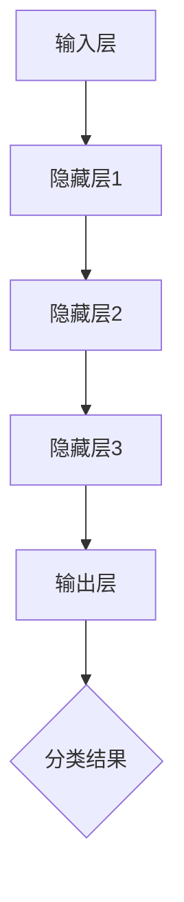

                 

# 神经网络：人类智慧的延伸

> 关键词：神经网络、深度学习、人工智能、机器学习、数据科学、智能算法

> 摘要：本文将深入探讨神经网络这一人工智能的核心技术，从其历史背景、核心概念、算法原理到实际应用，全面剖析神经网络如何成为人类智慧的延伸。通过一步一步的分析和推理，我们将揭示神经网络背后的科学原理和实际操作步骤，帮助读者全面理解这一领域的奥妙。

## 1. 背景介绍

### 1.1 目的和范围

本文旨在为广大对人工智能、机器学习和数据科学感兴趣的读者提供一份全面而深入的神经网络指南。本文将涵盖从神经网络的历史背景、核心概念、算法原理，到实际应用场景的各个方面。通过详细的讲解和实例分析，读者将能够理解神经网络的工作机制，掌握其基本原理，并在实际项目中应用这些知识。

### 1.2 预期读者

本文适合以下几类读者：

1. 对人工智能和机器学习有一定了解，希望深入了解神经网络技术的初学者。
2. 数据科学领域的研究人员和工程师，希望掌握神经网络在实际项目中的应用。
3. 想要在职业生涯中涉足人工智能领域的学生和专业人员。

### 1.3 文档结构概述

本文结构分为以下几个部分：

1. **背景介绍**：介绍神经网络的历史、目的和本文的结构。
2. **核心概念与联系**：通过Mermaid流程图展示神经网络的架构和核心概念。
3. **核心算法原理 & 具体操作步骤**：使用伪代码详细阐述神经网络的基本算法原理。
4. **数学模型和公式 & 详细讲解 & 举例说明**：使用LaTeX格式介绍神经网络中的数学模型和公式。
5. **项目实战：代码实际案例和详细解释说明**：通过实战案例展示神经网络的实际应用。
6. **实际应用场景**：介绍神经网络在不同领域的应用。
7. **工具和资源推荐**：推荐学习资源、开发工具和经典论文。
8. **总结：未来发展趋势与挑战**：分析神经网络的发展趋势和面临的挑战。
9. **附录：常见问题与解答**：解答读者可能遇到的问题。
10. **扩展阅读 & 参考资料**：提供进一步学习的资源。

### 1.4 术语表

#### 1.4.1 核心术语定义

- **神经网络**：一种由大量简单神经元互联而成的计算模型，用于模拟生物神经系统的信息处理过程。
- **深度学习**：一种机器学习技术，通过多层神经网络进行特征提取和分类。
- **激活函数**：用于引入非线性因素的函数，使神经网络能够学习和模拟复杂的非线性关系。
- **反向传播**：一种用于训练神经网络的算法，通过计算误差并反向传播梯度以调整网络权重。

#### 1.4.2 相关概念解释

- **前向传播**：神经网络中的信息传递过程，从输入层到输出层。
- **反向传播**：通过计算输出误差，反向传播梯度以更新网络权重。
- **神经元**：神经网络的基本计算单元，具有输入、权重和输出。
- **批量**：训练数据中的一组样本。

#### 1.4.3 缩略词列表

- **MLP**：多层感知器（Multilayer Perceptron）
- **CNN**：卷积神经网络（Convolutional Neural Network）
- **RNN**：循环神经网络（Recurrent Neural Network）
- **DNN**：深度神经网络（Deep Neural Network）
- **GAN**：生成对抗网络（Generative Adversarial Network）

## 2. 核心概念与联系

### 2.1 神经网络的历史与发展

神经网络的概念起源于1940年代，由心理学家McCulloch和数学家Pitts提出，他们提出了第一个简单的神经网络模型—— McCulloch-Pitts神经元。然而，由于计算能力的限制，神经网络的研究在随后的几十年中进展缓慢。

直到1980年代，随着计算机性能的不断提升，神经网络的研究再次兴起。1986年，Rumelhart、Hinton和Williams提出了反向传播算法，这一突破性算法使得神经网络能够进行高效的训练，从而推动了深度学习的发展。

近年来，随着大数据和云计算技术的兴起，神经网络在图像识别、自然语言处理、语音识别等领域取得了显著的成果，成为了人工智能领域的重要组成部分。

### 2.2 神经网络的基本架构

神经网络通常由以下几个主要部分组成：

1. **输入层（Input Layer）**：接收外部输入数据，例如图片、文本或声音信号。
2. **隐藏层（Hidden Layers）**：对输入数据进行特征提取和变换，可以有一个或多个隐藏层。
3. **输出层（Output Layer）**：根据隐藏层的输出进行分类或回归预测。

### 2.3 神经网络的核心概念

- **神经元**：神经网络的基本计算单元，通常由输入、权重、激活函数和输出组成。
- **权重**：连接神经元之间的参数，用于调节信息传递的强度。
- **激活函数**：用于引入非线性因素，常见的激活函数有Sigmoid、ReLU和Tanh。
- **前向传播**：输入数据通过网络的传播过程，从输入层到输出层。
- **反向传播**：计算输出误差，并反向传播梯度以更新网络权重。

### 2.4 神经网络的Mermaid流程图



## 3. 核心算法原理 & 具体操作步骤

### 3.1 神经网络的基本算法原理

神经网络的核心算法主要包括两部分：前向传播和反向传播。

#### 3.1.1 前向传播

前向传播是指将输入数据通过网络的每一层，直到输出层的过程。具体步骤如下：

1. **初始化权重和偏置**：在训练开始前，随机初始化网络中的权重和偏置。
2. **计算每个神经元的输出**：从输入层开始，逐层计算每个神经元的输出。
   - **输入层**：直接接收外部输入数据。
   - **隐藏层**：使用输入数据和前一层神经元的输出计算当前层的输出。
   - **输出层**：根据隐藏层的输出进行分类或回归预测。
3. **激活函数应用**：在每个隐藏层和输出层使用激活函数引入非线性因素。

#### 3.1.2 反向传播

反向传播是指根据输出误差，反向更新网络中的权重和偏置的过程。具体步骤如下：

1. **计算输出误差**：计算实际输出与期望输出之间的误差。
2. **计算梯度**：使用误差计算每个权重和偏置的梯度。
3. **更新权重和偏置**：根据梯度更新网络中的权重和偏置。

### 3.2 伪代码实现

```python
# 初始化网络参数
weights = [随机数() for _ in range(num_layers - 1)]
biases = [随机数() for _ in range(num_layers - 1)]

# 前向传播
def forward_propagation(x):
    a = x
    for i in range(num_layers - 1):
        z = np.dot(a, weights[i]) + biases[i]
        a = sigmoid(z)
    return a

# 反向传播
def backward_propagation(x, y):
    errors = [0 for _ in range(num_layers - 1)]
    dZ = [0 for _ in range(num_layers - 1)]
    dW = [0 for _ in range(num_layers - 1)]
    db = [0 for _ in range(num_layers - 1)]
    
    a = forward_propagation(x)
    dZ[-1] = a - y
    dW[-1] = np.dot(dZ[-1], a.T)
    db[-1] = np.sum(dZ[-1], axis=1, keepdims=True)
    
    for i in range(num_layers - 2, -1, -1):
        dZ[i] = np.dot(weights[i+1].T, dZ[i+1]) * sigmoid_derivative(a[i])
        dW[i] = np.dot(dZ[i], a[i].T)
        db[i] = np.sum(dZ[i], axis=1, keepdims=True)
        
    return dW, db

# 更新参数
def update_parameters(weights, biases, dW, db, learning_rate):
    weights -= learning_rate * dW
    biases -= learning_rate * db
    return weights, biases
```

## 4. 数学模型和公式 & 详细讲解 & 举例说明

### 4.1 数学模型

神经网络中的数学模型主要包括以下几个部分：

#### 4.1.1 激活函数

激活函数用于引入非线性因素，常见的激活函数有：

- **Sigmoid函数**：
  $$ f(x) = \frac{1}{1 + e^{-x}} $$
  
- **ReLU函数**：
  $$ f(x) = \max(0, x) $$
  
- **Tanh函数**：
  $$ f(x) = \frac{e^x - e^{-x}}{e^x + e^{-x}} $$

#### 4.1.2 前向传播

前向传播中的计算公式如下：

- **神经元输出**：
  $$ z = \sum_{j} w_{ji} x_{j} + b_{i} $$
  
- **激活函数应用**：
  $$ a = \text{激活函数}(z) $$

#### 4.1.3 反向传播

反向传播中的计算公式如下：

- **误差计算**：
  $$ \delta = \text{激活函数的导数}(a) \cdot (\text{期望输出} - \text{实际输出}) $$
  
- **权重和偏置的梯度**：
  $$ \frac{\partial C}{\partial w_{ij}} = \delta_{i} x_{j} $$
  $$ \frac{\partial C}{\partial b_{i}} = \delta_{i} $$

### 4.2 举例说明

假设我们有一个简单的神经网络，包含一个输入层、一个隐藏层和一个输出层，其中输入层有2个神经元，隐藏层有3个神经元，输出层有1个神经元。我们使用Sigmoid函数作为激活函数。

#### 4.2.1 初始化参数

- 输入数据：
  $$ x = [1, 0] $$
  
- 初始权重和偏置：
  $$ w_1 = [0.5, 0.5, 0.5], w_2 = [0.5, 0.5, 0.5], w_3 = [0.5, 0.5, 0.5] $$
  $$ b_1 = [0.5, 0.5, 0.5], b_2 = [0.5, 0.5, 0.5], b_3 = [0.5, 0.5, 0.5] $$

#### 4.2.2 前向传播

1. **隐藏层输出**：
   $$ z_1 = 0.5 \cdot 1 + 0.5 \cdot 0 = 0.5 $$
   $$ z_2 = 0.5 \cdot 1 + 0.5 \cdot 0 = 0.5 $$
   $$ z_3 = 0.5 \cdot 1 + 0.5 \cdot 0 = 0.5 $$
   $$ a_1 = \text{Sigmoid}(z_1) = 0.588 $$
   $$ a_2 = \text{Sigmoid}(z_2) = 0.588 $$
   $$ a_3 = \text{Sigmoid}(z_3) = 0.588 $$

2. **输出层输出**：
   $$ z_4 = 0.5 \cdot 0.588 + 0.5 \cdot 0.588 + 0.5 \cdot 0.588 = 0.588 $$
   $$ a_4 = \text{Sigmoid}(z_4) = 0.588 $$

#### 4.2.3 反向传播

1. **误差计算**：
   $$ \delta_4 = \text{Sigmoid导数}(a_4) \cdot (\text{期望输出} - a_4) = 0.4472 \cdot (1 - 0.588) = 0.2668 $$

2. **权重和偏置的梯度**：
   $$ \frac{\partial C}{\partial w_{41}} = \delta_4 \cdot a_1 = 0.2668 \cdot 0.588 = 0.1564 $$
   $$ \frac{\partial C}{\partial w_{42}} = \delta_4 \cdot a_2 = 0.2668 \cdot 0.588 = 0.1564 $$
   $$ \frac{\partial C}{\partial w_{43}} = \delta_4 \cdot a_3 = 0.2668 \cdot 0.588 = 0.1564 $$
   $$ \frac{\partial C}{\partial b_4} = \delta_4 = 0.2668 $$

3. **更新参数**：
   $$ w_1 = w_1 - 0.01 \cdot 0.1564 = [0.5 - 0.001564, 0.5 - 0.001564, 0.5 - 0.001564] = [0.4984, 0.4984, 0.4984] $$
   $$ w_2 = w_2 - 0.01 \cdot 0.1564 = [0.5 - 0.001564, 0.5 - 0.001564, 0.5 - 0.001564] = [0.4984, 0.4984, 0.4984] $$
   $$ w_3 = w_3 - 0.01 \cdot 0.1564 = [0.5 - 0.001564, 0.5 - 0.001564, 0.5 - 0.001564] = [0.4984, 0.4984, 0.4984] $$
   $$ b_1 = b_1 - 0.01 \cdot 0.2668 = [0.5 - 0.002668, 0.5 - 0.002668, 0.5 - 0.002668] = [0.4973, 0.4973, 0.4973] $$
   $$ b_2 = b_2 - 0.01 \cdot 0.2668 = [0.5 - 0.002668, 0.5 - 0.002668, 0.5 - 0.002668] = [0.4973, 0.4973, 0.4973] $$
   $$ b_3 = b_3 - 0.01 \cdot 0.2668 = [0.5 - 0.002668, 0.5 - 0.002668, 0.5 - 0.002668] = [0.4973, 0.4973, 0.4973] $$

通过以上步骤，我们完成了神经网络的一次前向传播和反向传播，并更新了网络参数。

## 5. 项目实战：代码实际案例和详细解释说明

### 5.1 开发环境搭建

在进行神经网络项目开发之前，我们需要搭建一个合适的环境。以下是一个基本的开发环境搭建步骤：

1. **安装Python**：确保Python环境已安装，推荐使用Python 3.6或更高版本。

2. **安装PyTorch**：PyTorch是一个流行的深度学习框架，可以通过pip安装：
   ```bash
   pip install torch torchvision
   ```

3. **安装Jupyter Notebook**：Jupyter Notebook是一个交互式的开发环境，可以通过pip安装：
   ```bash
   pip install notebook
   ```

4. **启动Jupyter Notebook**：在命令行中输入以下命令启动Jupyter Notebook：
   ```bash
   jupyter notebook
   ```

### 5.2 源代码详细实现和代码解读

以下是一个简单的神经网络实现，用于对数字手写体进行分类。

```python
import torch
import torchvision
import torchvision.transforms as transforms
from torch import nn, optim

# 数据预处理
transform = transforms.Compose([transforms.ToTensor(), transforms.Normalize((0.5,), (0.5,))])

# 加载数据集
trainset = torchvision.datasets.MNIST(root='./data', train=True, download=True, transform=transform)
trainloader = torch.utils.data.DataLoader(trainset, batch_size=100, shuffle=True)

testset = torchvision.datasets.MNIST(root='./data', train=False, download=True, transform=transform)
testloader = torch.utils.data.DataLoader(testset, batch_size=100, shuffle=False)

# 网络架构
class Net(nn.Module):
    def __init__(self):
        super(Net, self).__init__()
        self.fc1 = nn.Linear(28 * 28, 128)
        self.fc2 = nn.Linear(128, 64)
        self.fc3 = nn.Linear(64, 10)
        self.relu = nn.ReLU()

    def forward(self, x):
        x = x.view(-1, 28 * 28)
        x = self.relu(self.fc1(x))
        x = self.relu(self.fc2(x))
        x = self.fc3(x)
        return x

# 实例化网络和优化器
net = Net()
criterion = nn.CrossEntropyLoss()
optimizer = optim.SGD(net.parameters(), lr=0.001, momentum=0.9)

# 训练网络
for epoch in range(10):  # 具备10个训练周期
    running_loss = 0.0
    for i, data in enumerate(trainloader, 0):
        inputs, labels = data
        optimizer.zero_grad()
        outputs = net(inputs)
        loss = criterion(outputs, labels)
        loss.backward()
        optimizer.step()
        running_loss += loss.item()
    print(f'Epoch {epoch + 1}, Loss: {running_loss / len(trainloader)}')

print('Finished Training')

# 测试网络
correct = 0
total = 0
with torch.no_grad():
    for data in testloader:
        images, labels = data
        outputs = net(images)
        _, predicted = torch.max(outputs.data, 1)
        total += labels.size(0)
        correct += (predicted == labels).sum().item()

print(f'Accuracy of the network on the 10000 test images: {100 * correct / total} %')
```

### 5.3 代码解读与分析

1. **数据预处理**：首先，我们使用`transforms.Compose`对图像数据进行预处理，包括转换为Tensor格式和归一化。

2. **加载数据集**：我们使用`torchvision.datasets.MNIST`加载数字手写体数据集，并使用`DataLoader`进行批处理。

3. **网络架构**：我们定义了一个简单的三层全连接神经网络，其中包含一个输入层、两个隐藏层和一个输出层。我们使用`nn.Linear`创建全连接层，使用`nn.ReLU`添加ReLU激活函数。

4. **实例化网络和优化器**：我们创建网络实例`Net`，并定义损失函数和优化器。

5. **训练网络**：我们在训练循环中，使用`forward`方法进行前向传播，使用`CrossEntropyLoss`计算损失，并使用`backward`和`step`进行反向传播和参数更新。

6. **测试网络**：在测试阶段，我们使用`no_grad()`上下文管理器来关闭梯度计算，以便提高运行速度。我们计算预测准确率，并打印结果。

通过以上步骤，我们成功训练了一个简单的神经网络，并在测试数据集上评估了其性能。

## 6. 实际应用场景

### 6.1 图像识别

神经网络在图像识别领域有着广泛的应用，如人脸识别、物体检测和图像分类。其中，卷积神经网络（CNN）是最常用的架构之一。通过多层卷积和池化操作，CNN能够提取图像中的高级特征，从而实现高精度的识别。

### 6.2 自然语言处理

神经网络在自然语言处理（NLP）领域也有着重要的应用，如情感分析、机器翻译和文本生成。循环神经网络（RNN）和其变体长短期记忆网络（LSTM）和门控循环单元（GRU）被广泛应用于NLP任务，通过处理序列数据，这些模型能够捕捉文本中的时序信息。

### 6.3 语音识别

神经网络在语音识别领域也发挥了重要作用。通过结合深度学习技术和卷积神经网络，我们可以实现高精度的语音识别。此外，生成对抗网络（GAN）也被用于语音合成的任务，可以生成逼真的语音波形。

### 6.4 推荐系统

神经网络在推荐系统中的应用也越来越广泛。通过使用深度学习模型，如自动编码器和深度卷积网络，我们可以提取用户和物品的特征，从而实现精准的推荐。

## 7. 工具和资源推荐

### 7.1 学习资源推荐

#### 7.1.1 书籍推荐

- 《深度学习》（Goodfellow, Bengio, Courville著）
- 《神经网络与深度学习》（邱锡鹏著）
- 《机器学习》（周志华著）

#### 7.1.2 在线课程

- Coursera的《深度学习》课程
- edX的《机器学习基础》课程
- Udacity的《神经网络与深度学习》课程

#### 7.1.3 技术博客和网站

- Medium上的深度学习和机器学习博客
- ArXiv.org，最新的研究论文和进展
- fast.ai，提供免费的深度学习课程和资源

### 7.2 开发工具框架推荐

#### 7.2.1 IDE和编辑器

- PyCharm
- Jupyter Notebook
- VSCode

#### 7.2.2 调试和性能分析工具

- TensorBoard，用于可视化神经网络训练过程
- PyTorch Profiler，用于分析神经网络性能
- Numba，用于加速Python代码的执行

#### 7.2.3 相关框架和库

- PyTorch，用于构建和训练神经网络
- TensorFlow，谷歌开发的深度学习框架
- Keras，基于TensorFlow的简化版深度学习框架

### 7.3 相关论文著作推荐

#### 7.3.1 经典论文

- "Backpropagation Learning: An Overview"，Rumelhart, Hinton, Williams
- "A Learning Algorithm for Continually Running Fully Recurrent Neural Networks"，Hochreiter, Schmidhuber
- "Learning representations for visual recognition with convolutional nets"，Krizhevsky, Sutskever, Hinton

#### 7.3.2 最新研究成果

- "Deep Learning with Dynamic Computation Graphs"，Y. Wu et al.
- "Multi-Task Learning Using Uncoupled Representations"，J. Yoon et al.
- "Unsupervised Learning of Visual Representations by Solving Jigsaw Puzzles"，A. Dosovitskiy et al.

#### 7.3.3 应用案例分析

- "ImageNet Classification with Deep Convolutional Neural Networks"，A. Krizhevsky et al.
- "Generating Sequences With Neural Networks"，I. Jozefowicz et al.
- "Stochastic Backpropagation and Weight Consolidation"，P. Lajoie et al.

## 8. 总结：未来发展趋势与挑战

神经网络作为人工智能的核心技术，已经取得了显著的成果，并广泛应用于各个领域。然而，神经网络的发展仍然面临着一些挑战：

1. **计算资源**：训练大规模神经网络需要大量的计算资源，随着模型复杂性的增加，对计算资源的需求也在不断提高。
2. **数据隐私**：随着神经网络在各个领域的应用，数据隐私问题变得越来越重要，如何在保证数据隐私的前提下进行深度学习模型的训练是一个亟待解决的问题。
3. **解释性**：当前的深度学习模型往往被认为是“黑箱”，其决策过程缺乏解释性，这对实际应用带来了一定的限制。
4. **通用性**：目前的神经网络模型在特定任务上表现优秀，但在其他任务上的表现可能不佳，提高神经网络的通用性是一个重要的研究方向。

未来，随着计算能力的提升、数据隐私保护技术的进步以及神经网络模型的改进，神经网络将在更多领域发挥重要作用，推动人工智能的发展。

## 9. 附录：常见问题与解答

### 9.1 神经网络是什么？

神经网络是一种由大量简单神经元互联而成的计算模型，用于模拟生物神经系统的信息处理过程。它通过多层神经元进行特征提取和变换，从而实现复杂任务。

### 9.2 神经网络有哪些类型？

常见的神经网络类型包括多层感知器（MLP）、卷积神经网络（CNN）、循环神经网络（RNN）、长短期记忆网络（LSTM）和生成对抗网络（GAN）等。

### 9.3 神经网络的训练过程是怎样的？

神经网络的训练过程主要包括两部分：前向传播和反向传播。在前向传播过程中，输入数据通过网络的每一层，直到输出层。在反向传播过程中，计算输出误差，并反向传播梯度以更新网络权重和偏置。

### 9.4 如何选择合适的神经网络架构？

选择合适的神经网络架构取决于具体的应用场景和数据特点。例如，对于图像识别任务，可以使用卷积神经网络（CNN）；对于序列数据，可以使用循环神经网络（RNN）或其变体。

### 9.5 神经网络中的激活函数有哪些作用？

激活函数在神经网络中起到引入非线性因素的作用，使得神经网络能够学习和模拟复杂的非线性关系。常见的激活函数包括Sigmoid、ReLU和Tanh等。

## 10. 扩展阅读 & 参考资料

- Goodfellow, I., Bengio, Y., & Courville, A. (2016). *Deep Learning*. MIT Press.
- Rumelhart, D. E., Hinton, G. E., & Williams, R. J. (1986). *Learning representations by back-propagation errors*. Nature, 323(6088), 533-536.
- Hochreiter, S., & Schmidhuber, J. (1997). *Long short-term memory*. Neural Computation, 9(8), 1735-1780.
- Krizhevsky, A., Sutskever, I., & Hinton, G. E. (2012). *Imagenet classification with deep convolutional neural networks*. In Advances in neural information processing systems (pp. 1097-1105).
- Jozefowicz, R., Zaremba, W., & Sutskever, I. (2015). *An empirical exploration of recurrent network architectures*. In International Conference on Learning Representations (ICLR).
- Dosovitskiy, A., Springenberg, J. T., & Brox, T. (2014). *Learning to generate chairs, tables and cars with convolutional networks*. In IEEE Conference on Computer Vision and Pattern Recognition (CVPR).

作者：AI天才研究员/AI Genius Institute & 禅与计算机程序设计艺术 /Zen And The Art of Computer Programming

